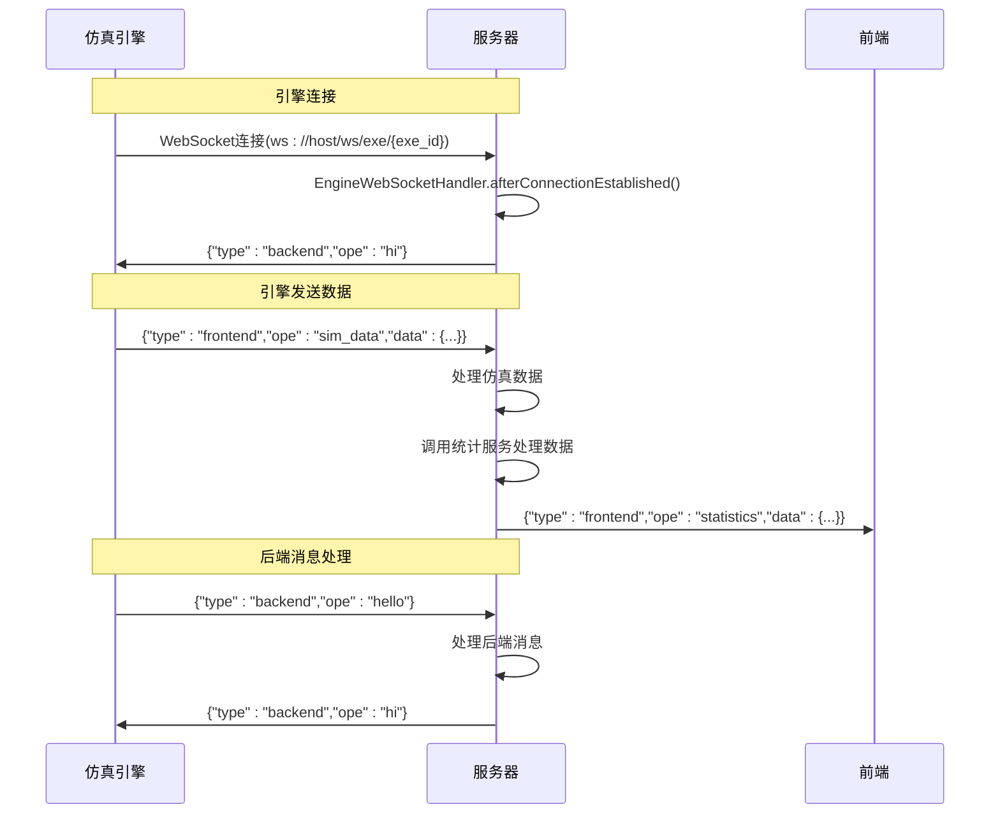
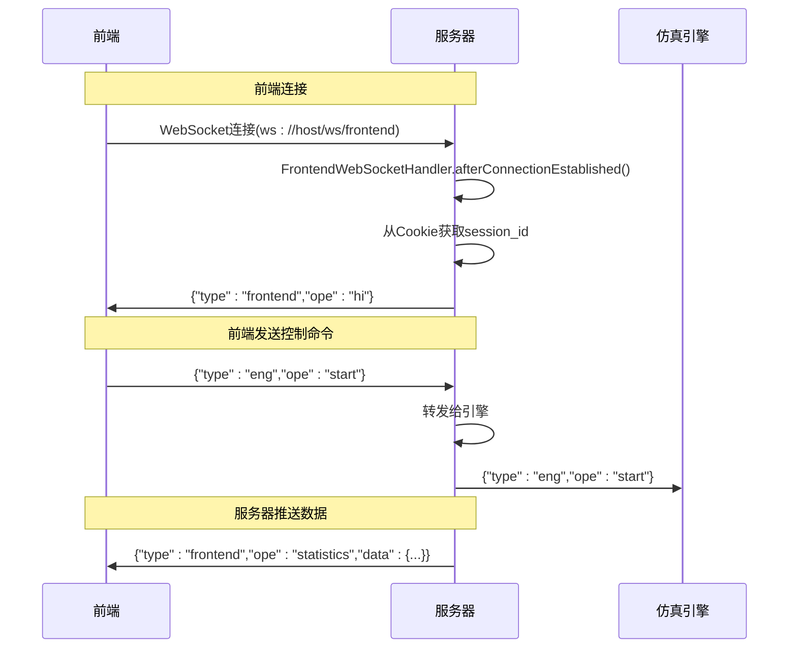

# API参考

<cite>
**本文档中引用的文件**  
- [AuthController.java](file://plugins/plugin-auth/src/main/java/com/traffic/sim/plugin/auth/controller/AuthController.java)
- [MapController.java](file://plugins/plugin-map/src/main/java/com/traffic/sim/plugin/map/controller/MapController.java)
- [MapApiController.java](file://plugins/plugin-map/src/main/java/com/traffic/sim/plugin/map/controller/MapApiController.java)
- [ReplayController.java](file://plugins/plugin-engine-replay/src/main/java/com/traffic/sim/plugin/replay/controller/ReplayController.java)
- [UserController.java](file://plugins/plugin-user/src/main/java/com/traffic/sim/plugin/user/controller/UserController.java)
- [SimulationController.java](file://plugins/plugin-simulation/src/main/java/com/traffic/sim/plugin/simulation/controller/SimulationController.java)
- [EngineWebSocketHandler.java](file://plugins/plugin-engine-manager/src/main/java/com/traffic/sim/plugin/engine/manager/websocket/EngineWebSocketHandler.java)
- [FrontendWebSocketHandler.java](file://plugins/plugin-engine-manager/src/main/java/com/traffic/sim/plugin/engine/manager/websocket/FrontendWebSocketHandler.java)
- [WebSocketConfig.java](file://plugins/plugin-engine-manager/src/main/java/com/traffic/sim/plugin/engine/manager/config/WebSocketConfig.java)
- [ErrorCode.java](file://traffic-sim-common/src/main/java/com/traffic/sim/common/constant/ErrorCode.java)
- [LoginRequest.java](file://traffic-sim-common/src/main/java/com/traffic/sim/common/dto/LoginRequest.java)
- [RegisterRequest.java](file://traffic-sim-common/src/main/java/com/traffic/sim/common/dto/RegisterRequest.java)
- [ApiResponse.java](file://traffic-sim-common/src/main/java/com/traffic/sim/common/response/ApiResponse.java)
- [WebSocketInfo.java](file://traffic-sim-common/src/main/java/com/traffic/sim/common/model/WebSocketInfo.java)
</cite>

## 目录
1. [简介](#简介)
2. [RESTful API端点](#restful-api端点)
   1. [认证管理](#认证管理)
   2. [地图管理](#地图管理)
   3. [用户管理](#用户管理)
   4. [仿真任务管理](#仿真任务管理)
   5. [回放管理](#回放管理)
3. [WebSocket API](#websocket-api)
   1. [引擎监控WebSocket](#引擎监控websocket)
   2. [前端通信WebSocket](#前端通信websocket)
4. [错误处理](#错误处理)
5. [示例](#示例)

## 简介
本API参考文档为交通模拟系统提供全面的接口说明。文档涵盖所有RESTful API端点和WebSocket接口，包括请求格式、响应结构、认证要求和错误码。系统采用JWT令牌进行认证，所有受保护的API端点都需要在请求头中包含有效的Authorization令牌。

**本文档中引用的文件**
- [AuthController.java](file://plugins/plugin-auth/src/main/java/com/traffic/sim/plugin/auth/controller/AuthController.java)
- [MapController.java](file://plugins/plugin-map/src/main/java/com/traffic/sim/plugin/map/controller/MapController.java)
- [MapApiController.java](file://plugins/plugin-map/src/main/java/com/traffic/sim/plugin/map/controller/MapApiController.java)
- [ReplayController.java](file://plugins/plugin-engine-replay/src/main/java/com/traffic/sim/plugin/replay/controller/ReplayController.java)
- [UserController.java](file://plugins/plugin-user/src/main/java/com/traffic/sim/plugin/user/controller/UserController.java)
- [SimulationController.java](file://plugins/plugin-simulation/src/main/java/com/traffic/sim/plugin/simulation/controller/SimulationController.java)
- [ErrorCode.java](file://traffic-sim-common/src/main/java/com/traffic/sim/common/constant/ErrorCode.java)

## RESTful API端点

### 认证管理
认证管理API提供用户登录、注册、令牌管理和验证码获取功能。

#### 用户登录
通过用户名和密码登录系统，返回JWT访问令牌和刷新令牌。

| 属性 | 说明 |
|------|------|
| **HTTP方法** | POST |
| **URL路径** | /api/auth/login |
| **请求头** | Content-Type: application/json |
| **认证要求** | 无 |

**请求体Schema**
```json
{
  "username": "string, 必填, 用户名",
  "password": "string, 必填, 密码",
  "captcha": "string, 可选, 验证码",
  "captchaId": "string, 可选, 验证码ID"
}
```

**响应体Schema**
```json
{
  "res": "string, 响应码",
  "msg": "string, 响应消息",
  "data": {
    "token": "string, JWT访问令牌",
    "refreshToken": "string, 刷新令牌",
    "tokenType": "string, 令牌类型",
    "expiresIn": "number, 令牌有效期(秒)"
  },
  "timestamp": "number, 时间戳"
}
```

**可能的错误码**
- `ERR_ARG`: 参数错误（用户名或密码为空）
- `ERR_AUTH`: 认证失败（用户名或密码错误）
- `ERR_UNKNOWN`: 未知错误

**Section sources**
- [AuthController.java](file://plugins/plugin-auth/src/main/java/com/traffic/sim/plugin/auth/controller/AuthController.java#L39-L44)
- [LoginRequest.java](file://traffic-sim-common/src/main/java/com/traffic/sim/common/dto/LoginRequest.java#L18-L26)

#### 用户注册
注册新用户账户。

| 属性 | 说明 |
|------|------|
| **HTTP方法** | POST |
| **URL路径** | /api/auth/register |
| **请求头** | Content-Type: application/json |
| **认证要求** | 无 |

**请求体Schema**
```json
{
  "username": "string, 必填, 用户名",
  "password": "string, 必填, 密码",
  "email": "string, 必填, 邮箱",
  "phoneNumber": "string, 可选, 电话号码",
  "institution": "string, 可选, 机构"
}
```

**响应体Schema**
```json
{
  "res": "string, 响应码",
  "msg": "string, 响应消息",
  "data": "null",
  "timestamp": "number, 时间戳"
}
```

**可能的错误码**
- `ERR_ARG`: 参数错误（必填字段为空或邮箱格式不正确）
- `ERR_EXIST`: 用户已存在
- `ERR_CREATE`: 创建失败

**Section sources**
- [AuthController.java](file://plugins/plugin-auth/src/main/java/com/traffic/sim/plugin/auth/controller/AuthController.java#L49-L54)
- [RegisterRequest.java](file://traffic-sim-common/src/main/java/com/traffic/sim/common/dto/RegisterRequest.java#L19-L30)

#### 获取验证码
获取图形验证码用于注册或登录。

| 属性 | 说明 |
|------|------|
| **HTTP方法** | GET |
| **URL路径** | /api/auth/captcha |
| **请求头** | 无 |
| **认证要求** | 无 |

**响应头**
- Content-Type: image/png
- X-Captcha-Id: 验证码ID

**响应体**
- PNG格式的验证码图片

**可能的错误码**
- `ERR_NOT_FOUND`: 验证码生成失败

**Section sources**
- [AuthController.java](file://plugins/plugin-auth/src/main/java/com/traffic/sim/plugin/auth/controller/AuthController.java#L59-L74)

#### 刷新令牌
使用刷新令牌获取新的访问令牌。

| 属性 | 说明 |
|------|------|
| **HTTP方法** | POST |
| **URL路径** | /api/auth/refresh |
| **请求头** | Content-Type: application/json |
| **认证要求** | 无 |

**请求体Schema**
```json
{
  "refreshToken": "string, 必填, 刷新令牌"
}
```

**响应体Schema**
```json
{
  "res": "string, 响应码",
  "msg": "string, 响应消息",
  "data": {
    "token": "string, 新的JWT访问令牌",
    "refreshToken": "string, 新的刷新令牌",
    "tokenType": "string, 令牌类型",
    "expiresIn": "number, 令牌有效期(秒)"
  },
  "timestamp": "number, 时间戳"
}
```

**可能的错误码**
- `ERR_ARG`: 参数错误（刷新令牌为空）
- `ERR_AUTH`: 认证失败（刷新令牌无效或已过期）

**Section sources**
- [AuthController.java](file://plugins/plugin-auth/src/main/java/com/traffic/sim/plugin/auth/controller/AuthController.java#L79-L85)

#### 用户登出
使当前用户的令牌失效，完成登出操作。

| 属性 | 说明 |
|------|------|
| **HTTP方法** | POST |
| **URL路径** | /api/auth/logout |
| **请求头** | Authorization: Bearer {token} |
| **认证要求** | 是 |

**请求体Schema**
- 无

**响应体Schema**
```json
{
  "res": "string, 响应码",
  "msg": "string, 响应消息",
  "data": "null",
  "timestamp": "number, 时间戳"
}
```

**可能的错误码**
- `ERR_AUTH`: 认证失败（令牌无效或格式错误）

**Section sources**
- [AuthController.java](file://plugins/plugin-auth/src/main/java/com/traffic/sim/plugin/auth/controller/AuthController.java#L90-L97)

### 地图管理
地图管理API提供地图的上传、查询、更新和删除功能。

#### 上传地图文件
通过文件上传方式上传地图文件并进行转换。

| 属性 | 说明 |
|------|------|
| **HTTP方法** | POST |
| **URL路径** | /api/map/upload |
| **请求头** | Content-Type: multipart/form-data |
| **认证要求** | 是 |

**请求参数**
- file: 文件, 必填, 地图文件
- name: 字符串, 必填, 地图名称
- description: 字符串, 可选, 地图描述
- status: 整数, 可选, 地图状态(1:公开, 0:私有)

**响应体Schema**
```json
{
  "res": "string, 响应码",
  "msg": "string, 响应消息",
  "data": {
    "id": "string, 地图ID",
    "name": "string, 地图名称",
    "description": "string, 地图描述",
    "status": "integer, 地图状态",
    "userId": "long, 用户ID",
    "createTime": "string, 创建时间",
    "updateTime": "string, 更新时间"
  },
  "timestamp": "number, 时间戳"
}
```

**可能的错误码**
- `ERR_AUTH`: 认证失败
- `ERR_ARG`: 参数错误
- `ERR_CREATE`: 创建失败

**Section sources**
- [MapApiController.java](file://plugins/plugin-map/src/main/java/com/traffic/sim/plugin/map/controller/MapApiController.java#L34-L45)

#### 获取用户地图列表
获取当前用户自己的地图列表。

| 属性 | 说明 |
|------|------|
| **HTTP方法** | GET |
| **URL路径** | /api/map/my-maps |
| **请求头** | 无 |
| **认证要求** | 是 |

**查询参数**
- mapName: 字符串, 可选, 地图名称（模糊查询）
- status: 整数, 可选, 地图状态
- page: 整数, 可选, 页码（默认1）
- size: 整数, 可选, 每页数量（默认10）

**响应体Schema**
```json
{
  "res": "string, 响应码",
  "msg": "string, 响应消息",
  "data": {
    "list": [
      {
        "id": "string, 地图ID",
        "name": "string, 地图名称",
        "description": "string, 地图描述",
        "status": "integer, 地图状态",
        "userId": "long, 用户ID",
        "createTime": "string, 创建时间",
        "updateTime": "string, 更新时间"
      }
    ],
    "total": "long, 总记录数",
    "page": "int, 当前页码",
    "size": "int, 每页数量"
  },
  "timestamp": "number, 时间戳"
}
```

**可能的错误码**
- `ERR_AUTH`: 认证失败

**Section sources**
- [MapApiController.java](file://plugins/plugin-map/src/main/java/com/traffic/sim/plugin/map/controller/MapApiController.java#L51-L62)

#### 获取地图详情
获取指定地图的详细信息。

| 属性 | 说明 |
|------|------|
| **HTTP方法** | GET |
| **URL路径** | /api/map/{mapId} |
| **请求头** | 无 |
| **认证要求** | 是 |

**路径参数**
- mapId: 字符串, 必填, 地图ID

**响应体Schema**
```json
{
  "res": "string, 响应码",
  "msg": "string, 响应消息",
  "data": {
    "id": "string, 地图ID",
    "name": "string, 地图名称",
    "description": "string, 地图描述",
    "status": "integer, 地图状态",
    "userId": "long, 用户ID",
    "createTime": "string, 创建时间",
    "updateTime": "string, 更新时间"
  },
  "timestamp": "number, 时间戳"
}
```

**可能的错误码**
- `ERR_AUTH`: 认证失败
- `ERR_NOT_FOUND`: 地图不存在
- `ERR_PERMISSION`: 无权访问该地图

**Section sources**
- [MapApiController.java](file://plugins/plugin-map/src/main/java/com/traffic/sim/plugin/map/controller/MapApiController.java#L80-L86)

#### 更新地图信息
更新指定地图的信息。

| 属性 | 说明 |
|------|------|
| **HTTP方法** | PUT |
| **URL路径** | /api/map/{mapId} |
| **请求头** | Content-Type: application/json |
| **认证要求** | 是 |

**路径参数**
- mapId: 字符串, 必填, 地图ID

**请求体Schema**
```json
{
  "name": "string, 可选, 地图名称",
  "description": "string, 可选, 地图描述",
  "status": "integer, 可选, 地图状态"
}
```

**响应体Schema**
```json
{
  "res": "string, 响应码",
  "msg": "string, 响应消息",
  "data": {
    "id": "string, 地图ID",
    "name": "string, 地图名称",
    "description": "string, 地图描述",
    "status": "integer, 地图状态",
    "userId": "long, 用户ID",
    "createTime": "string, 创建时间",
    "updateTime": "string, 更新时间"
  },
  "timestamp": "number, 时间戳"
}
```

**可能的错误码**
- `ERR_AUTH`: 认证失败
- `ERR_NOT_FOUND`: 地图不存在
- `ERR_UPDATE`: 更新失败
- `ERR_PERMISSION`: 无权更新该地图

**Section sources**
- [MapApiController.java](file://plugins/plugin-map/src/main/java/com/traffic/sim/plugin/map/controller/MapApiController.java#L92-L101)

#### 删除地图
删除用户自己的地图。

| 属性 | 说明 |
|------|------|
| **HTTP方法** | DELETE |
| **URL路径** | /api/map/{mapId} |
| **请求头** | 无 |
| **认证要求** | 是 |

**路径参数**
- mapId: 字符串, 必填, 地图ID

**响应体Schema**
```json
{
  "res": "string, 响应码",
  "msg": "string, 响应消息",
  "data": "null",
  "timestamp": "number, 时间戳"
}
```

**可能的错误码**
- `ERR_AUTH`: 认证失败
- `ERR_NOT_FOUND`: 地图不存在
- `ERR_DELETE`: 删除失败
- `ERR_PERMISSION`: 无权删除该地图

**Section sources**
- [MapApiController.java](file://plugins/plugin-map/src/main/java/com/traffic/sim/plugin/map/controller/MapApiController.java#L107-L113)

#### 获取公开地图列表
获取所有公开的地图列表。

| 属性 | 说明 |
|------|------|
| **HTTP方法** | GET |
| **URL路径** | /api/map/public |
| **请求头** | 无 |
| **认证要求** | 否 |

**查询参数**
- mapName: 字符串, 可选, 地图名称（模糊查询）
- page: 整数, 可选, 页码（默认1）
- size: 整数, 可选, 每页数量（默认10）

**响应体Schema**
```json
{
  "res": "string, 响应码",
  "msg": "string, 响应消息",
  "data": {
    "list": [
      {
        "id": "string, 地图ID",
        "name": "string, 地图名称",
        "description": "string, 地图描述",
        "status": "integer, 地图状态",
        "userId": "long, 用户ID",
        "createTime": "string, 创建时间",
        "updateTime": "string, 更新时间"
      }
    ],
    "total": "long, 总记录数",
    "page": "int, 当前页码",
    "size": "int, 每页数量"
  },
  "timestamp": "number, 时间戳"
}
```

**可能的错误码**
- `ERR_ARG`: 参数错误

**Section sources**
- [MapApiController.java](file://plugins/plugin-map/src/main/java/com/traffic/sim/plugin/map/controller/MapApiController.java#L119-L128)

### 用户管理
用户管理API提供用户信息的查询、创建、更新和删除功能。

#### 获取用户信息
根据用户ID获取用户详细信息。

| 属性 | 说明 |
|------|------|
| **HTTP方法** | GET |
| **URL路径** | /api/user/{id} |
| **请求头** | 无 |
| **认证要求** | 是 |

**路径参数**
- id: 长整型, 必填, 用户ID

**响应体Schema**
```json
{
  "res": "string, 响应码",
  "msg": "string, 响应消息",
  "data": {
    "id": "long, 用户ID",
    "username": "string, 用户名",
    "email": "string, 邮箱",
    "phoneNumber": "string, 电话号码",
    "institution": "string, 机构",
    "role": "string, 角色",
    "status": "string, 状态",
    "createTime": "string, 创建时间",
    "updateTime": "string, 更新时间"
  },
  "timestamp": "number, 时间戳"
}
```

**可能的错误码**
- `ERR_AUTH`: 认证失败
- `ERR_NOT_FOUND`: 用户不存在

**Section sources**
- [UserController.java](file://plugins/plugin-user/src/main/java/com/traffic/sim/plugin/user/controller/UserController.java#L43-L48)

#### 根据用户名获取用户信息
根据用户名获取用户详细信息。

| 属性 | 说明 |
|------|------|
| **HTTP方法** | GET |
| **URL路径** | /api/user/username/{username} |
| **请求头** | 无 |
| **认证要求** | 是 |

**路径参数**
- username: 字符串, 必填, 用户名

**响应体Schema**
```json
{
  "res": "string, 响应码",
  "msg": "string, 响应消息",
  "data": {
    "id": "long, 用户ID",
    "username": "string, 用户名",
    "email": "string, 邮箱",
    "phoneNumber": "string, 电话号码",
    "institution": "string, 机构",
    "role": "string, 角色",
    "status": "string, 状态",
    "createTime": "string, 创建时间",
    "updateTime": "string, 更新时间"
  },
  "timestamp": "number, 时间戳"
}
```

**可能的错误码**
- `ERR_AUTH`: 认证失败
- `ERR_NOT_FOUND`: 用户不存在

**Section sources**
- [UserController.java](file://plugins/plugin-user/src/main/java/com/traffic/sim/plugin/user/controller/UserController.java#L53-L58)

#### 创建用户
创建新用户。

| 属性 | 说明 |
|------|------|
| **HTTP方法** | POST |
| **URL路径** | /api/user |
| **请求头** | Content-Type: application/json |
| **认证要求** | 是 |

**请求体Schema**
```json
{
  "username": "string, 必填, 用户名",
  "password": "string, 必填, 密码",
  "email": "string, 必填, 邮箱",
  "phoneNumber": "string, 可选, 电话号码",
  "institution": "string, 可选, 机构",
  "role": "string, 可选, 角色"
}
```

**响应体Schema**
```json
{
  "res": "string, 响应码",
  "msg": "string, 响应消息",
  "data": {
    "id": "long, 用户ID",
    "username": "string, 用户名",
    "email": "string, 邮箱",
    "phoneNumber": "string, 电话号码",
    "institution": "string, 机构",
    "role": "string, 角色",
    "status": "string, 状态",
    "createTime": "string, 创建时间",
    "updateTime": "string, 更新时间"
  },
  "timestamp": "number, 时间戳"
}
```

**可能的错误码**
- `ERR_AUTH`: 认证失败
- `ERR_ARG`: 参数错误
- `ERR_EXIST`: 用户已存在
- `ERR_CREATE`: 创建失败

**Section sources**
- [UserController.java](file://plugins/plugin-user/src/main/java/com/traffic/sim/plugin/user/controller/UserController.java#L63-L68)

#### 更新用户信息
更新指定用户的信息。

| 属性 | 说明 |
|------|------|
| **HTTP方法** | PUT |
| **URL路径** | /api/user/{id} |
| **请求头** | Content-Type: application/json |
| **认证要求** | 是 |

**路径参数**
- id: 长整型, 必填, 用户ID

**请求体Schema**
```json
{
  "email": "string, 可选, 邮箱",
  "phoneNumber": "string, 可选, 电话号码",
  "institution": "string, 可选, 机构",
  "role": "string, 可选, 角色"
}
```

**响应体Schema**
```json
{
  "res": "string, 响应码",
  "msg": "string, 响应消息",
  "data": {
    "id": "long, 用户ID",
    "username": "string, 用户名",
    "email": "string, 邮箱",
    "phoneNumber": "string, 电话号码",
    "institution": "string, 机构",
    "role": "string, 角色",
    "status": "string, 状态",
    "createTime": "string, 创建时间",
    "updateTime": "string, 更新时间"
  },
  "timestamp": "number, 时间戳"
}
```

**可能的错误码**
- `ERR_AUTH`: 认证失败
- `ERR_NOT_FOUND`: 用户不存在
- `ERR_UPDATE`: 更新失败
- `ERR_PERMISSION`: 无权更新该用户

**Section sources**
- [UserController.java](file://plugins/plugin-user/src/main/java/com/traffic/sim/plugin/user/controller/UserController.java#L73-L80)

#### 更新用户密码
更新指定用户的密码。

| 属性 | 说明 |
|------|------|
| **HTTP方法** | PUT |
| **URL路径** | /api/user/{id}/password |
| **请求头** | 无 |
| **认证要求** | 是 |

**路径参数**
- id: 长整型, 必填, 用户ID

**查询参数**
- newPassword: 字符串, 必填, 新密码

**响应体Schema**
```json
{
  "res": "string, 响应码",
  "msg": "string, 响应消息",
  "data": "null",
  "timestamp": "number, 时间戳"
}
```

**可能的错误码**
- `ERR_AUTH`: 认证失败
- `ERR_NOT_FOUND`: 用户不存在
- `ERR_UPDATE`: 更新失败

**Section sources**
- [UserController.java](file://plugins/plugin-user/src/main/java/com/traffic/sim/plugin/user/controller/UserController.java#L85-L92)

#### 获取用户列表
分页获取用户列表。

| 属性 | 说明 |
|------|------|
| **HTTP方法** | GET |
| **URL路径** | /api/user/list |
| **请求头** | 无 |
| **认证要求** | 是 |

**查询参数**
- page: 整数, 可选, 页码（默认1）
- size: 整数, 可选, 每页数量（默认10）
- status: 字符串, 可选, 用户状态

**响应体Schema**
```json
{
  "res": "string, 响应码",
  "msg": "string, 响应消息",
  "data": {
    "list": [
      {
        "id": "long, 用户ID",
        "username": "string, 用户名",
        "email": "string, 邮箱",
        "phoneNumber": "string, 电话号码",
        "institution": "string, 机构",
        "role": "string, 角色",
        "status": "string, 状态",
        "createTime": "string, 创建时间",
        "updateTime": "string, 更新时间"
      }
    ],
    "total": "long, 总记录数",
    "page": "int, 当前页码",
    "size": "int, 每页数量"
  },
  "timestamp": "number, 时间戳"
}
```

**可能的错误码**
- `ERR_AUTH`: 认证失败

**Section sources**
- [UserController.java](file://plugins/plugin-user/src/main/java/com/traffic/sim/plugin/user/controller/UserController.java#L107-L116)

### 仿真任务管理
仿真任务管理API提供仿真任务的创建、查询和控制功能。

#### 创建仿真任务
创建新的仿真任务并初始化仿真引擎。

| 属性 | 说明 |
|------|------|
| **HTTP方法** | POST |
| **URL路径** | /api/simulation/create |
| **请求头** | Content-Type: application/json |
| **认证要求** | 是（通过Cookie中的id字段） |

**请求体Schema**
```json
{
  "name": "string, 必填, 仿真任务名称",
  "mapId": "string, 必填, 地图ID",
  "description": "string, 可选, 描述",
  "duration": "integer, 可选, 持续时间(秒)",
  "startTime": "string, 可选, 开始时间"
}
```

**请求Cookie**
- id: 会话ID, 必填

**响应体Schema**
```json
{
  "res": "string, 响应码",
  "msg": "string, 响应消息",
  "data": "string, 仿真任务ID",
  "timestamp": "number, 时间戳"
}
```

**可能的错误码**
- `ERR_AUTH`: 认证失败（会话ID缺失或无效）
- `ERR_ARG`: 参数错误
- `ERR_CREATE`: 创建失败

**Section sources**
- [SimulationController.java](file://plugins/plugin-simulation/src/main/java/com/traffic/sim/plugin/simulation/controller/SimulationController.java#L37-L59)

#### 获取仿真任务列表
分页查询仿真任务列表。

| 属性 | 说明 |
|------|------|
| **HTTP方法** | GET |
| **URL路径** | /api/simulation/list |
| **请求头** | 无 |
| **认证要求** | 否 |

**查询参数**
- page: 整数, 可选, 页码（默认1）
- size: 整数, 可选, 每页数量（默认10）

**响应体Schema**
```json
{
  "res": "string, 响应码",
  "msg": "string, 响应消息",
  "data": {
    "list": [
      {
        "taskId": "string, 任务ID",
        "name": "string, 任务名称",
        "mapId": "string, 地图ID",
        "status": "string, 状态",
        "duration": "integer, 持续时间",
        "createTime": "string, 创建时间",
        "startTime": "string, 开始时间",
        "endTime": "string, 结束时间"
      }
    ],
    "total": "long, 总记录数",
    "page": "int, 当前页码",
    "size": "int, 每页数量"
  },
  "timestamp": "number, 时间戳"
}
```

**可能的错误码**
- `ERR_UNKNOWN`: 未知错误

**Section sources**
- [SimulationController.java](file://plugins/plugin-simulation/src/main/java/com/traffic/sim/plugin/simulation/controller/SimulationController.java#L65-L78)

#### 获取仿真任务详情
根据任务ID获取仿真任务详细信息。

| 属性 | 说明 |
|------|------|
| **HTTP方法** | GET |
| **URL路径** | /api/simulation/{taskId} |
| **请求头** | 无 |
| **认证要求** | 否 |

**路径参数**
- taskId: 字符串, 必填, 任务ID

**响应体Schema**
```json
{
  "res": "string, 响应码",
  "msg": "string, 响应消息",
  "data": {
    "taskId": "string, 任务ID",
    "name": "string, 任务名称",
    "mapId": "string, 地图ID",
    "status": "string, 状态",
    "duration": "integer, 持续时间",
    "createTime": "string, 创建时间",
    "startTime": "string, 开始时间",
    "endTime": "string, 结束时间"
  },
  "timestamp": "number, 时间戳"
}
```

**可能的错误码**
- `ERR_NOT_FOUND`: 仿真任务不存在
- `ERR_UNKNOWN`: 未知错误

**Section sources**
- [SimulationController.java](file://plugins/plugin-simulation/src/main/java/com/traffic/sim/plugin/simulation/controller/SimulationController.java#L84-L96)

#### 绿信比控制
实时调整信号灯的绿信比值。

| 属性 | 说明 |
|------|------|
| **HTTP方法** | POST |
| **URL路径** | /api/simulation/control_green_ratio |
| **请求头** | Content-Type: application/json |
| **认证要求** | 是（通过Cookie中的id字段） |

**请求体Schema**
```json
{
  "greenRatio": "integer, 必填, 绿信比值(0-100)",
  "simulationInfo": "object, 可选, 仿真信息"
}
```

**请求Cookie**
- id: 会话ID, 必填

**响应体Schema**
```json
{
  "res": "string, 响应码",
  "msg": "string, 响应消息",
  "data": "null",
  "timestamp": "number, 时间戳"
}
```

**可能的错误码**
- `ERR_AUTH`: 认证失败（会话ID缺失或无效）
- `ERR_ENGINE`: 引擎未初始化或控制失败

**Section sources**
- [SimulationController.java](file://plugins/plugin-simulation/src/main/java/com/traffic/sim/plugin/simulation/controller/SimulationController.java#L102-L130)

### 回放管理
回放管理API提供仿真历史数据回放相关功能。

#### 创建回放任务
根据仿真任务创建回放任务。

| 属性 | 说明 |
|------|------|
| **HTTP方法** | POST |
| **URL路径** | /api/replay/create |
| **请求头** | Content-Type: application/json |
| **认证要求** | 是 |

**请求体Schema**
```json
{
  "simulationTaskId": "string, 必填, 仿真任务ID",
  "name": "string, 可选, 回放任务名称"
}
```

**响应体Schema**
```json
{
  "res": "string, 响应码",
  "msg": "string, 响应消息",
  "data": {
    "taskId": "string, 回放任务ID",
    "simulationTaskId": "string, 仿真任务ID",
    "name": "string, 回放任务名称",
    "status": "string, 状态",
    "createTime": "string, 创建时间",
    "startTime": "string, 开始时间",
    "endTime": "string, 结束时间"
  },
  "timestamp": "number, 时间戳"
}
```

**可能的错误码**
- `ERR_AUTH`: 认证失败
- `ERR_ARG`: 参数错误
- `ERR_CREATE`: 创建失败

**Section sources**
- [ReplayController.java](file://plugins/plugin-engine-replay/src/main/java/com/traffic/sim/plugin/replay/controller/ReplayController.java#L38-L50)

#### 获取回放任务详情
根据任务ID获取回放任务详细信息。

| 属性 | 说明 |
|------|------|
| **HTTP方法** | GET |
| **URL路径** | /api/replay/{taskId} |
| **请求头** | 无 |
| **认证要求** | 是 |

**路径参数**
- taskId: 字符串, 必填, 任务ID

**响应体Schema**
```json
{
  "res": "string, 响应码",
  "msg": "string, 响应消息",
  "data": {
    "taskId": "string, 回放任务ID",
    "simulationTaskId": "string, 仿真任务ID",
    "name": "string, 回放任务名称",
    "status": "string, 状态",
    "createTime": "string, 创建时间",
    "startTime": "string, 开始时间",
    "endTime": "string, 结束时间"
  },
  "timestamp": "number, 时间戳"
}
```

**可能的错误码**
- `ERR_AUTH`: 认证失败
- `ERR_NOT_FOUND`: 回放任务不存在

**Section sources**
- [ReplayController.java](file://plugins/plugin-engine-replay/src/main/java/com/traffic/sim/plugin/replay/controller/ReplayController.java#L55-L66)

#### 获取回放任务列表
分页获取当前用户的回放任务列表。

| 属性 | 说明 |
|------|------|
| **HTTP方法** | GET |
| **URL路径** | /api/replay/list |
| **请求头** | 无 |
| **认证要求** | 是 |

**查询参数**
- page: 整数, 可选, 页码（默认1）
- size: 整数, 可选, 每页数量（默认10）

**响应体Schema**
```json
{
  "res": "string, 响应码",
  "msg": "string, 响应消息",
  "data": {
    "list": [
      {
        "taskId": "string, 回放任务ID",
        "simulationTaskId": "string, 仿真任务ID",
        "name": "string, 回放任务名称",
        "status": "string, 状态",
        "createTime": "string, 创建时间",
        "startTime": "string, 开始时间",
        "endTime": "string, 结束时间"
      }
    ],
    "total": "long, 总记录数",
    "page": "int, 当前页码",
    "size": "int, 每页数量"
  },
  "timestamp": "number, 时间戳"
}
```

**可能的错误码**
- `ERR_AUTH`: 认证失败

**Section sources**
- [ReplayController.java](file://plugins/plugin-engine-replay/src/main/java/com/traffic/sim/plugin/replay/controller/ReplayController.java#L71-L84)

#### 获取回放数据
根据步数范围获取回放数据。

| 属性 | 说明 |
|------|------|
| **HTTP方法** | GET |
| **URL路径** | /api/replay/{taskId}/data |
| **请求头** | 无 |
| **认证要求** | 是 |

**路径参数**
- taskId: 字符串, 必填, 任务ID

**查询参数**
- startStep: 长整型, 必填, 起始步数
- endStep: 长整型, 必填, 结束步数

**响应体Schema**
```json
{
  "res": "string, 响应码",
  "msg": "string, 响应消息",
  "data": [
    {
      "step": "long, 步数",
      "timestamp": "long, 时间戳",
      "vehicleCount": "integer, 车辆数量",
      "averageSpeed": "double, 平均速度",
      "congestionIndex": "double, 拥堵指数",
      "signalStates": "array, 信号灯状态",
      "custom": "object, 自定义数据"
    }
  ],
  "timestamp": "number, 时间戳"
}
```

**可能的错误码**
- `ERR_AUTH`: 认证失败
- `ERR_NOT_FOUND`: 回放任务不存在

**Section sources**
- [ReplayController.java](file://plugins/plugin-engine-replay/src/main/java/com/traffic/sim/plugin/replay/controller/ReplayController.java#L89-L103)

#### 控制回放
控制回放播放、暂停、停止、跳转、设置速度等。

| 属性 | 说明 |
|------|------|
| **HTTP方法** | POST |
| **URL路径** | /api/replay/{taskId}/control |
| **请求头** | Content-Type: application/json |
| **认证要求** | 是 |

**路径参数**
- taskId: 字符串, 必填, 任务ID

**请求体Schema**
```json
{
  "operation": "string, 必填, 操作类型(pause/resume/stop/jump/speed)",
  "targetStep": "long, 可选, 目标步数",
  "speed": "double, 可选, 播放速度"
}
```

**响应体Schema**
```json
{
  "res": "string, 响应码",
  "msg": "string, 响应消息",
  "data": {
    "taskId": "string, 回放任务ID",
    "simulationTaskId": "string, 仿真任务ID",
    "name": "string, 回放任务名称",
    "status": "string, 状态",
    "createTime": "string, 创建时间",
    "startTime": "string, 开始时间",
    "endTime": "string, 结束时间"
  },
  "timestamp": "number, 时间戳"
}
```

**可能的错误码**
- `ERR_AUTH`: 认证失败
- `ERR_ARG`: 参数错误
- `ERR_NOT_FOUND`: 回放任务不存在

**Section sources**
- [ReplayController.java](file://plugins/plugin-engine-replay/src/main/java/com/traffic/sim/plugin/replay/controller/ReplayController.java#L108-L121)

#### 删除回放任务
删除指定的回放任务及其数据。

| 属性 | 说明 |
|------|------|
| **HTTP方法** | DELETE |
| **URL路径** | /api/replay/{taskId} |
| **请求头** | 无 |
| **认证要求** | 是 |

**路径参数**
- taskId: 字符串, 必填, 任务ID

**响应体Schema**
```json
{
  "res": "string, 响应码",
  "msg": "string, 响应消息",
  "data": "null",
  "timestamp": "number, 时间戳"
}
```

**可能的错误码**
- `ERR_AUTH`: 认证失败
- `ERR_NOT_FOUND`: 回放任务不存在
- `ERR_DELETE`: 删除失败

**Section sources**
- [ReplayController.java](file://plugins/plugin-engine-replay/src/main/java/com/traffic/sim/plugin/replay/controller/ReplayController.java#L126-L137)

## WebSocket API

### 引擎监控WebSocket
引擎监控WebSocket用于仿真引擎与服务器之间的实时通信。



**Diagram sources**
- [EngineWebSocketHandler.java](file://plugins/plugin-engine-manager/src/main/java/com/traffic/sim/plugin/engine/manager/websocket/EngineWebSocketHandler.java#L53-L272)
- [WebSocketConfig.java](file://plugins/plugin-engine-manager/src/main/java/com/traffic/sim/plugin/engine/manager/config/WebSocketConfig.java#L27-L38)

#### 连接URL
`ws://<host>/ws/exe/{exe_id}`

其中：
- `<host>`: 服务器主机名或IP地址
- `{exe_id}`: 会话ID，由仿真任务创建时生成

#### 消息格式
```json
{
  "type": "string, 消息类型(frontend/backend)",
  "ope": "string, 操作类型(hello/hi/sim_data/statistics/err等)",
  "time": "long, 时间戳",
  "data": "object, 消息数据"
}
```

#### 事件类型
| 事件类型 | 说明 |
|---------|------|
| hello | 引擎初始化握手 |
| hi | 服务器响应握手 |
| sim_data | 仿真数据 |
| statistics | 统计数据 |
| err | 错误消息 |

#### 交互流程
1. 仿真引擎通过`/ws/exe/{exe_id}`连接到服务器
2. 服务器在`afterConnectionEstablished`中记录连接
3. 引擎发送`{"type":"backend","ope":"hello"}`进行初始化
4. 服务器响应`{"type":"backend","ope":"hi"}`
5. 引擎周期性发送`{"type":"frontend","ope":"sim_data","data":{...}}`包含仿真数据
6. 服务器处理数据并转发给前端
7. 连接关闭时，服务器清理会话信息

**Section sources**
- [EngineWebSocketHandler.java](file://plugins/plugin-engine-manager/src/main/java/com/traffic/sim/plugin/engine/manager/websocket/EngineWebSocketHandler.java#L53-L272)

### 前端通信WebSocket
前端通信WebSocket用于前端与服务器之间的实时通信。



**Diagram sources**
- [FrontendWebSocketHandler.java](file://plugins/plugin-engine-manager/src/main/java/com/traffic/sim/plugin/engine/manager/websocket/FrontendWebSocketHandler.java#L43-L187)
- [WebSocketConfig.java](file://plugins/plugin-engine-manager/src/main/java/com/traffic/sim/plugin/engine/manager/config/WebSocketConfig.java#L27-L31)

#### 连接URL
`ws://<host>/ws/frontend`

其中：
- `<host>`: 服务器主机名或IP地址

#### 认证方式
通过Cookie中的`id`字段传递会话ID。

#### 消息格式
```json
{
  "type": "string, 消息类型(frontend/eng/backend)",
  "ope": "string, 操作类型(hello/hi/start/pause/stop/sim_data/statistics/err等)",
  "time": "long, 时间戳",
  "data": "object, 消息数据"
}
```

#### 事件类型
| 事件类型 | 说明 |
|---------|------|
| hello | 前端初始化握手 |
| hi | 服务器响应握手 |
| start | 开始仿真 |
| pause | 暂停仿真 |
| stop | 停止仿真 |
| sim_data | 仿真数据 |
| statistics | 统计数据 |
| err | 错误消息 |

#### 交互流程
1. 前端通过`/ws/frontend`连接到服务器
2. 服务器从Cookie中提取`id`作为会话ID
3. 前端发送`{"type":"backend","ope":"hello"}`进行初始化
4. 服务器响应`{"type":"frontend","ope":"hi"}`
5. 前端发送控制命令如`{"type":"eng","ope":"start"}`
6. 服务器转发给仿真引擎
7. 服务器将仿真数据和统计信息推送给前端
8. 连接关闭时，服务器清理会话信息

**Section sources**
- [FrontendWebSocketHandler.java](file://plugins/plugin-engine-manager/src/main/java/com/traffic/sim/plugin/engine/manager/websocket/FrontendWebSocketHandler.java#L43-L187)

## 错误处理
系统采用统一的错误响应格式和错误码机制。

### 统一响应格式
所有API响应都遵循统一的格式：

```json
{
  "res": "string, 响应码",
  "msg": "string, 响应消息",
  "data": "object, 响应数据",
  "timestamp": "number, 时间戳"
}
```

其中`res`字段为`ERR_OK`时表示成功，其他值表示错误。

### 错误码定义
系统定义了以下错误码：

| 错误码 | 说明 |
|--------|------|
| ERR_OK | 成功 |
| ERR_AUTH | 认证失败 |
| ERR_ARG | 参数错误 |
| ERR_EXIST | 资源已存在 |
| ERR_NOT_FOUND | 资源不存在 |
| ERR_CREATE | 创建失败 |
| ERR_UPDATE | 更新失败 |
| ERR_DELETE | 删除失败 |
| ERR_ENGINE | 引擎未初始化 |
| ERR_UNKNOWN | 未知错误 |
| ERR_INTERNAL | 服务器内部错误 |
| ERR_PERMISSION | 权限不足 |
| ERR_FORBIDDEN | 操作不允许 |

**Section sources**
- [ErrorCode.java](file://traffic-sim-common/src/main/java/com/traffic/sim/common/constant/ErrorCode.java#L11-L47)
- [ApiResponse.java](file://traffic-sim-common/src/main/java/com/traffic/sim/common/response/ApiResponse.java#L45-L75)

### 错误处理指南
1. **检查响应码**：首先检查`res`字段是否为`ERR_OK`
2. **查看错误消息**：`msg`字段提供详细的错误描述
3. **处理特定错误**：
   - `ERR_AUTH`: 重新登录或刷新令牌
   - `ERR_ARG`: 检查请求参数是否正确
   - `ERR_NOT_FOUND`: 确认资源ID是否正确
   - `ERR_PERMISSION`: 确认用户权限
4. **重试机制**：对于临时性错误（如网络问题），可适当重试
5. **日志记录**：记录错误信息以便调试

## 示例

### curl命令示例

#### 用户登录
```bash
curl -X POST "http://localhost:8080/api/auth/login" \
  -H "Content-Type: application/json" \
  -d '{
    "username": "admin",
    "password": "password"
  }'
```

#### 上传地图
```bash
curl -X POST "http://localhost:8080/api/map/upload" \
  -H "Authorization: Bearer <your_token>" \
  -F "file=@map.xml" \
  -F "name=MyMap" \
  -F "description=My first map" \
  -F "status=1"
```

#### 创建仿真任务
```bash
curl -X POST "http://localhost:8080/api/simulation/create" \
  -H "Content-Type: application/json" \
  -H "Cookie: id=<session_id>" \
  -d '{
    "name": "Test Simulation",
    "mapId": "69f39c15-75f8-4aa8-9b0a-f06b54150918",
    "duration": 3600
  }'
```

#### WebSocket连接示例（JavaScript）
```javascript
// 连接前端WebSocket
const frontendSocket = new WebSocket('ws://localhost:8080/ws/frontend');

// 设置Cookie中的session_id
// 这通常由浏览器自动处理

frontendSocket.onopen = function(event) {
    console.log('Connected to frontend WebSocket');
    // 发送初始化消息
    frontendSocket.send(JSON.stringify({
        type: 'backend',
        ope: 'hello'
    }));
};

frontendSocket.onmessage = function(event) {
    const message = JSON.parse(event.data);
    console.log('Received:', message);
    // 处理仿真数据或统计信息
    if (message.ope === 'statistics') {
        updateDashboard(message.data);
    }
};

frontendSocket.onclose = function(event) {
    console.log('Frontend WebSocket closed:', event);
};
```

**Section sources**
- [AuthController.java](file://plugins/plugin-auth/src/main/java/com/traffic/sim/plugin/auth/controller/AuthController.java#L39-L44)
- [MapApiController.java](file://plugins/plugin-map/src/main/java/com/traffic/sim/plugin/map/controller/MapApiController.java#L34-L45)
- [SimulationController.java](file://plugins/plugin-simulation/src/main/java/com/traffic/sim/plugin/simulation/controller/SimulationController.java#L37-L59)