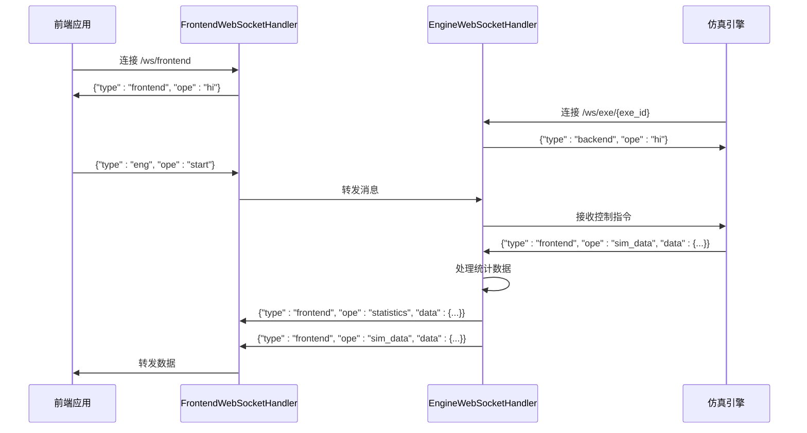

# API参考

<cite>
**本文档中引用的文件**  
- [AuthController.java](file://plugins/plugin-auth/src/main/java/com/traffic/sim/plugin/auth/controller/AuthController.java)
- [SimulationController.java](file://plugins/plugin-simulation/src/main/java/com/traffic/sim/plugin/simulation/controller/SimulationController.java)
- [MapController.java](file://plugins/plugin-map/src/main/java/com/traffic/sim/plugin/map/controller/MapController.java)
- [UserController.java](file://plugins/plugin-user/src/main/java/com/traffic/sim/plugin/user/controller/UserController.java)
- [ReplayController.java](file://plugins/plugin-engine-replay/src/main/java/com/traffic/sim/plugin/replay/controller/ReplayController.java)
- [EngineWebSocketHandler.java](file://plugins/plugin-engine-manager/src/main/java/com/traffic/sim/plugin/engine/manager/websocket/EngineWebSocketHandler.java)
- [FrontendWebSocketHandler.java](file://plugins/plugin-engine-manager/src/main/java/com/traffic/sim/plugin/engine/manager/websocket/FrontendWebSocketHandler.java)
- [LoginRequest.java](file://traffic-sim-common/src/main/java/com/traffic/sim/common/dto/LoginRequest.java)
- [LoginResponse.java](file://traffic-sim-common/src/main/java/com/traffic/sim/common/dto/LoginResponse.java)
- [CreateSimulationRequest.java](file://traffic-sim-common/src/main/java/com/traffic/sim/common/dto/CreateSimulationRequest.java)
- [GreenRatioControlRequest.java](file://traffic-sim-common/src/main/java/com/traffic/sim/common/dto/GreenRatioControlRequest.java)
- [RegisterRequest.java](file://traffic-sim-common/src/main/java/com/traffic/sim/common/dto/RegisterRequest.java)
- [UserCreateRequest.java](file://plugins/plugin-user/src/main/java/com/traffic/sim/plugin/user/dto/UserCreateRequest.java)
- [UserUpdateRequest.java](file://plugins/plugin-user/src/main/java/com/traffic/sim/plugin/user/dto/UserUpdateRequest.java)
- [WebSocketInfo.java](file://traffic-sim-common/src/main/java/com/traffic/sim/common/model/WebSocketInfo.java)
- [RequireRole.java](file://plugins/plugin-auth/src/main/java/com/traffic/sim/plugin/auth/annotation/RequireRole.java)
- [RequirePermission.java](file://plugins/plugin-auth/src/main/java/com/traffic/sim/plugin/auth/annotation/RequirePermission.java)
</cite>

## 目录
1. [简介](#简介)
2. [认证管理API](#认证管理api)
3. [仿真任务管理API](#仿真任务管理api)
4. [地图管理API](#地图管理api)
5. [用户管理API](#用户管理api)
6. [回放管理API](#回放管理api)
7. [WebSocket实时通信](#websocket实时通信)
8. [权限控制机制](#权限控制机制)

## 简介
本API参考文档详细描述了交通仿真系统中的所有公开RESTful API端点。系统采用模块化设计，各功能插件通过独立的Controller提供HTTP接口服务。所有API均返回统一的响应格式，包含状态码、消息和数据体。认证相关的接口需要通过JWT令牌进行身份验证，部分敏感操作需要特定角色或权限。

**本文档中引用的文件**  
- [AuthController.java](file://plugins/plugin-auth/src/main/java/com/traffic/sim/plugin/auth/controller/AuthController.java)

## 认证管理API
认证管理API提供用户登录、注册、令牌管理等功能。所有接口均位于`/api/auth`路径下。

### 用户登录
- **HTTP方法**: POST
- **URL路径**: `/api/auth/login`
- **请求头**: 无特殊要求
- **请求体 (JSON Schema)**:
```json
{
  "username": "string (必填, 用户名)",
  "password": "string (必填, 密码)",
  "captcha": "string (可选, 验证码)",
  "captchaId": "string (可选, 验证码ID)"
}
```
- **响应体 (JSON Schema)**:
```json
{
  "code": 200,
  "message": "success",
  "data": {
    "accessToken": "string (访问令牌)",
    "refreshToken": "string (刷新令牌)",
    "user": {
      // 用户信息对象
    },
    "expiresIn": "number (令牌过期时间，秒)"
  }
}
```

### 用户注册
- **HTTP方法**: POST
- **URL路径**: `/api/auth/register`
- **请求头**: 无特殊要求
- **请求体 (JSON Schema)**:
```json
{
  "username": "string (必填, 用户名)",
  "password": "string (必填, 密码)",
  "email": "string (可选, 邮箱)",
  "phoneNumber": "string (可选, 电话号码)",
  "institution": "string (可选, 机构)"
}
```
- **响应体 (JSON Schema)**:
```json
{
  "code": 200,
  "message": "success",
  "data": "注册成功"
}
```

### 获取验证码
- **HTTP方法**: GET
- **URL路径**: `/api/auth/captcha`
- **请求头**: 无特殊要求
- **响应**: PNG格式的验证码图片，响应头包含`X-Captcha-Id`字段，用于标识验证码

### 刷新令牌
- **HTTP方法**: POST
- **URL路径**: `/api/auth/refresh`
- **请求头**: 无特殊要求
- **请求体 (JSON Schema)**:
```json
{
  "refreshToken": "string (必填, 刷新令牌)"
}
```
- **响应体 (JSON Schema)**: 同登录响应

### 用户登出
- **HTTP方法**: POST
- **URL路径**: `/api/auth/logout`
- **请求头**: `Authorization: Bearer <token>` (可选，用于使令牌失效)
- **请求体**: 无
- **响应体 (JSON Schema)**:
```json
{
  "code": 200,
  "message": "success",
  "data": "登出成功"
}
```

**本文档中引用的文件**  
- [AuthController.java](file://plugins/plugin-auth/src/main/java/com/traffic/sim/plugin/auth/controller/AuthController.java)
- [LoginRequest.java](file://traffic-sim-common/src/main/java/com/traffic/sim/common/dto/LoginRequest.java)
- [LoginResponse.java](file://traffic-sim-common/src/main/java/com/traffic/sim/common/dto/LoginResponse.java)
- [RegisterRequest.java](file://traffic-sim-common/src/main/java/com/traffic/sim/common/dto/RegisterRequest.java)

## 仿真任务管理API
仿真任务管理API提供创建、查询和控制仿真任务的功能。所有接口均位于`/api/simulation`路径下，需要提供有效的会话ID作为Cookie。

### 创建仿真任务
- **HTTP方法**: POST
- **URL路径**: `/api/simulation/create`
- **请求头**: 无特殊要求
- **Cookie**: `id` (必填, 会话ID)
- **请求体 (JSON Schema)**:
```json
{
  "name": "string (仿真名称)",
  "mapXmlName": "string (地图XML文件名)",
  "mapXmlPath": "string (地图XML文件路径)",
  "simInfo": {
    "name": "string",
    "mapXmlName": "string",
    "mapXmlPath": "string",
    "fixedOd": {
      "od": [
        {
          "originId": "string (起点ID)",
          "dist": [
            {
              "destId": "string (目的地ID)",
              "rate": "number (流量比例)"
            }
          ]
        }
      ],
      "sg": [
        {
          "crossId": "number (路口ID)",
          "cycleTime": "number (周期时间)",
          "ewStraight": "number (东西直行时间)",
          "snStraight": "number (南北直行时间)",
          "snLeft": "number (南北左转时间)"
        }
      ]
    }
  },
  "controlViews": [
    {
      "usePlugin": "boolean (是否使用插件)",
      "activePlugin": "string (激活的插件名称)"
    }
  ]
}
```
- **响应体 (JSON Schema)**:
```json
{
  "code": 200,
  "message": "success",
  "data": "仿真任务ID"
}
```

### 获取仿真任务列表
- **HTTP方法**: GET
- **URL路径**: `/api/simulation/list`
- **请求头**: 无特殊要求
- **查询参数**:
  - `page`: 页码 (默认1)
  - `size`: 每页数量 (默认10)
- **响应体 (JSON Schema)**:
```json
{
  "code": 200,
  "message": "success",
  "data": {
    "records": [
      // 仿真任务列表
    ],
    "total": "number (总数)",
    "pages": "number (总页数)",
    "current": "number (当前页)",
    "size": "number (每页数量)"
  }
}
```

### 获取仿真任务详情
- **HTTP方法**: GET
- **URL路径**: `/api/simulation/{taskId}`
- **请求头**: 无特殊要求
- **路径参数**: `taskId` (仿真任务ID)
- **响应体 (JSON Schema)**:
```json
{
  "code": 200,
  "message": "success",
  "data": {
    // 仿真任务详细信息
  }
}
```

### 绿信比控制
- **HTTP方法**: POST
- **URL路径**: `/api/simulation/control_green_ratio`
- **请求头**: 无特殊要求
- **Cookie**: `id` (必填, 会话ID)
- **请求体 (JSON Schema)**:
```json
{
  "greenRatio": "number (必填, 绿信比值, 0-100)",
  "simulationInfo": {
    // 可选, 仿真信息用于日志记录
  }
}
```
- **响应体 (JSON Schema)**:
```json
{
  "code": 200,
  "message": "success",
  "data": "绿信比更新成功"
}
```

**本文档中引用的文件**  
- [SimulationController.java](file://plugins/plugin-simulation/src/main/java/com/traffic/sim/plugin/simulation/controller/SimulationController.java)
- [CreateSimulationRequest.java](file://traffic-sim-common/src/main/java/com/traffic/sim/common/dto/CreateSimulationRequest.java)
- [GreenRatioControlRequest.java](file://traffic-sim-common/src/main/java/com/traffic/sim/common/dto/GreenRatioControlRequest.java)

## 地图管理API
地图管理API提供地图的保存、查询和删除功能。包含新旧两套接口，以确保向后兼容性。

### 保存地图信息 (旧版兼容)
- **HTTP方法**: POST
- **URL路径**: `/saveMapInfo`
- **请求头**: 无特殊要求
- **请求体 (JSON Schema)**:
```json
{
  // 任意键值对，包含地图信息
}
```
- **响应体 (JSON Schema)**:
```json
{
  "code": 200,
  "message": "success",
  "data": {
    "mapId": "string (地图ID)",
    "status": "string (状态)"
  }
}
```

### 获取用户地图列表 (旧版兼容)
- **HTTP方法**: GET
- **URL路径**: `/getUserMap`
- **请求头**: 无特殊要求
- **查询参数**:
  - `mapName`: 地图名称 (可选)
  - `page`: 页码 (默认1)
  - `limit`: 每页数量 (默认10)
- **响应体 (JSON Schema)**:
```json
{
  "code": 200,
  "message": "success",
  "data": {
    "mapList": [
      // 地图列表
    ],
    "totalPages": "number (总页数)",
    "totalElement": "number (总数)"
  }
}
```

### 获取公开地图列表 (旧版兼容)
- **HTTP方法**: GET
- **URL路径**: `/getPublicMap`
- **请求头**: 无特殊要求
- **查询参数**:
  - `mapName`: 地图名称 (可选)
  - `page`: 页码 (默认1)
  - `limit`: 每页数量 (默认10)
- **响应体 (JSON Schema)**: 同获取用户地图列表

### 获取地图信息 (旧版兼容)
- **HTTP方法**: GET
- **URL路径**: `/getMapInfoDB`
- **请求头**: 无特殊要求
- **查询参数**: `mapId` (地图ID)
- **响应体 (JSON Schema)**:
```json
{
  "code": 200,
  "message": "success",
  "data": {
    // 地图详细信息
  }
}
```

### 删除地图 (管理员)
- **HTTP方法**: DELETE
- **URL路径**: `/deleteMap`
- **请求头**: 无特殊要求
- **请求体 (JSON Schema)**:
```json
{
  "mapId": "string (地图ID)",
  "status": "number (状态)"
}
```
- **响应体 (JSON Schema)**:
```json
{
  "code": 200,
  "message": "success",
  "data": "Delete Success"
}
```

**本文档中引用的文件**  
- [MapController.java](file://plugins/plugin-map/src/main/java/com/traffic/sim/plugin/map/controller/MapController.java)

## 用户管理API
用户管理API提供用户信息的增删改查功能。所有接口均位于`/api/user`路径下。

### 获取用户信息
- **HTTP方法**: GET
- **URL路径**: `/api/user/{id}`
- **请求头**: `Authorization: Bearer <token>`
- **路径参数**: `id` (用户ID)
- **响应体 (JSON Schema)**:
```json
{
  "code": 200,
  "message": "success",
  "data": {
    // 用户信息对象
  }
}
```

### 根据用户名获取用户信息
- **HTTP方法**: GET
- **URL路径**: `/api/user/username/{username}`
- **请求头**: `Authorization: Bearer <token>`
- **路径参数**: `username` (用户名)
- **响应体 (JSON Schema)**: 同获取用户信息

### 创建用户
- **HTTP方法**: POST
- **URL路径**: `/api/user`
- **请求头**: `Authorization: Bearer <token>`
- **请求体 (JSON Schema)**:
```json
{
  "username": "string (必填, 用户名)",
  "password": "string (必填, 密码)",
  "email": "string (可选, 邮箱)",
  "phoneNumber": "string (可选, 电话号码)",
  "institution": "string (可选, 机构)",
  "roleId": "number (可选, 角色ID)"
}
```
- **响应体 (JSON Schema)**:
```json
{
  "code": 200,
  "message": "success",
  "data": {
    // 创建的用户信息
  }
}
```

### 更新用户信息
- **HTTP方法**: PUT
- **URL路径**: `/api/user/{id}`
- **请求头**: `Authorization: Bearer <token>`
- **路径参数**: `id` (用户ID)
- **请求体 (JSON Schema)**:
```json
{
  "password": "string (可选, 密码)",
  "email": "string (可选, 邮箱)",
  "phoneNumber": "string (可选, 电话号码)",
  "institution": "string (可选, 机构)",
  "roleId": "number (可选, 角色ID)",
  "status": "string (可选, 状态)"
}
```
- **响应体 (JSON Schema)**:
```json
{
  "code": 200,
  "message": "success",
  "data": {
    // 更新后的用户信息
  }
}
```

### 更新用户密码
- **HTTP方法**: PUT
- **URL路径**: `/api/user/{id}/password`
- **请求头**: `Authorization: Bearer <token>`
- **路径参数**: `id` (用户ID)
- **查询参数**: `newPassword` (新密码)
- **响应体 (JSON Schema)**:
```json
{
  "code": 200,
  "message": "success",
  "data": "密码更新成功"
}
```

### 删除用户
- **HTTP方法**: DELETE
- **URL路径**: `/api/user/{id}`
- **请求头**: `Authorization: Bearer <token>`
- **路径参数**: `id` (用户ID)
- **响应体 (JSON Schema)**:
```json
{
  "code": 200,
  "message": "success",
  "data": "用户删除成功"
}
```

### 获取用户列表
- **HTTP方法**: GET
- **URL路径**: `/api/user/list`
- **请求头**: `Authorization: Bearer <token>`
- **查询参数**:
  - `page`: 页码 (默认1)
  - `size`: 每页数量 (默认10)
  - `status`: 状态 (可选)
- **响应体 (JSON Schema)**:
```json
{
  "code": 200,
  "message": "success",
  "data": {
    "records": [
      // 用户列表
    ],
    "total": "number (总数)",
    "pages": "number (总页数)",
    "current": "number (当前页)",
    "size": "number (每页数量)"
  }
}
```

**本文档中引用的文件**  
- [UserController.java](file://plugins/plugin-user/src/main/java/com/traffic/sim/plugin/user/controller/UserController.java)
- [UserCreateRequest.java](file://plugins/plugin-user/src/main/java/com/traffic/sim/plugin/user/dto/UserCreateRequest.java)
- [UserUpdateRequest.java](file://plugins/plugin-user/src/main/java/com/traffic/sim/plugin/user/dto/UserUpdateRequest.java)

## 回放管理API
回放管理API提供仿真历史数据的回放功能。所有接口均位于`/api/replay`路径下，需要用户登录。

### 创建回放任务
- **HTTP方法**: POST
- **URL路径**: `/api/replay/create`
- **请求头**: `Authorization: Bearer <token>`
- **请求体 (JSON Schema)**:
```json
{
  // 创建回放任务的请求参数
}
```
- **响应体 (JSON Schema)**:
```json
{
  "code": 200,
  "message": "success",
  "data": {
    // 回放任务信息
  }
}
```

### 获取回放任务详情
- **HTTP方法**: GET
- **URL路径**: `/api/replay/{taskId}`
- **请求头**: `Authorization: Bearer <token>`
- **路径参数**: `taskId` (回放任务ID)
- **响应体 (JSON Schema)**:
```json
{
  "code": 200,
  "message": "success",
  "data": {
    // 回放任务详细信息
  }
}
```

### 获取回放任务列表
- **HTTP方法**: GET
- **URL路径**: `/api/replay/list`
- **请求头**: `Authorization: Bearer <token>`
- **查询参数**:
  - `page`: 页码 (默认1)
  - `size`: 每页数量 (默认10)
- **响应体 (JSON Schema)**:
```json
{
  "code": 200,
  "message": "success",
  "data": {
    "records": [
      // 回放任务列表
    ],
    "total": "number (总数)",
    "pages": "number (总页数)",
    "current": "number (当前页)",
    "size": "number (每页数量)"
  }
}
```

### 获取回放数据
- **HTTP方法**: GET
- **URL路径**: `/api/replay/{taskId}/data`
- **请求头**: `Authorization: Bearer <token>`
- **路径参数**: `taskId` (回放任务ID)
- **查询参数**:
  - `startStep`: 起始步数
  - `endStep`: 结束步数
- **响应体 (JSON Schema)**:
```json
{
  "code": 200,
  "message": "success",
  "data": [
    // 回放数据列表
  ]
}
```

### 控制回放
- **HTTP方法**: POST
- **URL路径**: `/api/replay/{taskId}/control`
- **请求头**: `Authorization: Bearer <token>`
- **路径参数**: `taskId` (回放任务ID)
- **请求体 (JSON Schema)**:
```json
{
  // 回放控制请求参数
}
```
- **响应体 (JSON Schema)**:
```json
{
  "code": 200,
  "message": "success",
  "data": {
    // 回放任务信息
  }
}
```

### 删除回放任务
- **HTTP方法**: DELETE
- **URL路径**: `/api/replay/{taskId}`
- **请求头**: `Authorization: Bearer <token>`
- **路径参数**: `taskId` (回放任务ID)
- **响应体 (JSON Schema)**:
```json
{
  "code": 200,
  "message": "success",
  "data": "删除成功"
}
```

**本文档中引用的文件**  
- [ReplayController.java](file://plugins/plugin-engine-replay/src/main/java/com/traffic/sim/plugin/replay/controller/ReplayController.java)

## WebSocket实时通信
系统提供WebSocket接口用于实时通信，包括仿真引擎与前端之间的数据传输。

### 引擎WebSocket连接
- **连接端点**: `/ws/exe/{exe_id}`
- **参数**: `exe_id` = `session_id`
- **消息格式**:
```json
{
  "type": "frontend/eng/backend",
  "ope": "hello/hi/start/pause/stop/sim_data/statistics",
  "time": "number (时间戳)",
  "data": {
    // 消息数据
  }
}
```
- **连接流程**:
  1. 引擎连接到`/ws/exe/{exe_id}`
  2. 发送`{"type": "backend", "ope": "hello"}`进行初始化握手
  3. 服务器响应`{"type": "backend", "ope": "hi"}`

### 前端WebSocket连接
- **连接端点**: `/ws/frontend`
- **认证**: Cookie中的`id`字段（session_id）
- **消息格式**: 同引擎WebSocket
- **连接流程**:
  1. 前端连接到`/ws/frontend`，携带包含`id`的Cookie
  2. 发送`{"type": "backend", "ope": "hello"}`进行初始化握手
  3. 服务器响应`{"type": "frontend", "ope": "hi"}`

### 消息转发机制
- 前端发送到引擎的消息：`type: "eng"`，通过`FrontendWebSocketHandler`转发给`EngineWebSocketHandler`
- 引擎发送到前端的消息：`type: "frontend"`，通过`EngineWebSocketHandler`处理后转发给`FrontendWebSocketHandler`
- 统计数据处理：当引擎发送`type: "frontend", ope: "sim_data"`时，系统会调用统计服务处理数据，然后发送`type: "frontend", ope: "statistics"`给前端



**本文档中引用的文件**  
- [EngineWebSocketHandler.java](file://plugins/plugin-engine-manager/src/main/java/com/traffic/sim/plugin/engine/manager/websocket/EngineWebSocketHandler.java)
- [FrontendWebSocketHandler.java](file://plugins/plugin-engine-manager/src/main/java/com/traffic/sim/plugin/engine/manager/websocket/FrontendWebSocketHandler.java)
- [WebSocketInfo.java](file://traffic-sim-common/src/main/java/com/traffic/sim/common/model/WebSocketInfo.java)

## 权限控制机制
系统采用基于角色和权限的访问控制机制，通过注解方式实现。

### 角色控制
使用`@RequireRole`注解标记需要特定角色才能访问的方法或类。

```java
@Target({ElementType.METHOD, ElementType.TYPE})
@Retention(RetentionPolicy.RUNTIME)
public @interface RequireRole {
    String[] value();
}
```

### 权限控制
使用`@RequirePermission`注解标记需要特定权限才能访问的方法或类。

```java
@Target({ElementType.METHOD, ElementType.TYPE})
@Retention(RetentionPolicy.RUNTIME)
public @interface RequirePermission {
    String[] value();
}
```

### 实现原理
- `AuthenticationInterceptor`: 认证拦截器，验证JWT令牌的有效性
- `PermissionInterceptor`: 权限拦截器，检查用户角色和权限
- `RequestContext`: 存储当前请求的上下文信息，包括用户ID

**本文档中引用的文件**  
- [RequireRole.java](file://plugins/plugin-auth/src/main/java/com/traffic/sim/plugin/auth/annotation/RequireRole.java)
- [RequirePermission.java](file://plugins/plugin-auth/src/main/java/com/traffic/sim/plugin/auth/annotation/RequirePermission.java)