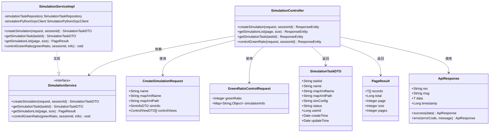

# 仿真任务API

<cite>
**本文档引用的文件**
- [SimulationController.java](file://plugins/plugin-simulation/src/main/java/com/traffic/sim/plugin/simulation/controller/SimulationController.java)
- [SimulationServiceImpl.java](file://plugins/plugin-simulation/src/main/java/com/traffic/sim/plugin/simulation/service/SimulationServiceImpl.java)
- [SimulationPythonGrpcClient.java](file://plugins/plugin-simulation/src/main/java/com/traffic/sim/plugin/simulation/grpc/SimulationPythonGrpcClient.java)
- [CreateSimulationRequest.java](file://traffic-sim-common/src/main/java/com/traffic/sim/common/dto/CreateSimulationRequest.java)
- [GreenRatioControlRequest.java](file://traffic-sim-common/src/main/java/com/traffic/sim/common/dto/GreenRatioControlRequest.java)
- [SimulationTaskDTO.java](file://traffic-sim-common/src/main/java/com/traffic/sim/common/dto/SimulationTaskDTO.java)
- [PageResult.java](file://traffic-sim-common/src/main/java/com/traffic/sim/common/response/PageResult.java)
- [ApiResponse.java](file://traffic-sim-common/src/main/java/com/traffic/sim/common/response/ApiResponse.java)
- [ErrorCode.java](file://traffic-sim-common/src/main/java/com/traffic/sim/common/constant/ErrorCode.java)
- [SimulationService.java](file://traffic-sim-common/src/main/java/com/traffic/sim/common/service/SimulationService.java)
- [SimulationTask.java](file://plugins/plugin-simulation/src/main/java/com/traffic/sim/plugin/simulation/entity/SimulationTask.java)
</cite>

## 目录
1. [简介](#简介)
2. [项目结构](#项目结构)
3. [核心组件](#核心组件)
4. [架构概览](#架构概览)
5. [详细组件分析](#详细组件分析)
6. [依赖关系分析](#依赖关系分析)
7. [性能考虑](#性能考虑)
8. [故障排除指南](#故障排除指南)
9. [结论](#结论)

## 简介

本文档详细描述了交通仿真系统中的仿真任务API，重点介绍`SimulationController`控制器中的四个核心端点：创建仿真任务、获取仿真任务列表、获取仿真任务详情和绿信比控制。该API采用统一的响应格式，支持会话管理和错误处理，并提供了完整的请求参数验证和响应格式说明。

## 项目结构

仿真任务API位于插件化架构的`plugin-simulation`模块中，采用分层架构设计：


**图表来源**
- [SimulationController.java](file://plugins/plugin-simulation/src/main/java/com/traffic/sim/plugin/simulation/controller/SimulationController.java#L25-L134)
- [SimulationServiceImpl.java](file://plugins/plugin-simulation/src/main/java/com/traffic/sim/plugin/simulation/service/SimulationServiceImpl.java#L34-L191)

**章节来源**
- [SimulationController.java](file://plugins/plugin-simulation/src/main/java/com/traffic/sim/plugin/simulation/controller/SimulationController.java#L1-L134)
- [SimulationServiceImpl.java](file://plugins/plugin-simulation/src/main/java/com/traffic/sim/plugin/simulation/service/SimulationServiceImpl.java#L1-L191)

## 核心组件

### API控制器层

`SimulationController`是所有仿真任务API的入口点，负责处理HTTP请求和响应。该控制器实现了四个主要端点：

- **创建仿真任务** (`/api/simulation/create`)
- **获取仿真任务列表** (`/api/simulation/list`)
- **获取仿真任务详情** (`/api/simulation/{taskId}`)
- **绿信比控制** (`/api/simulation/control_green_ratio`)

### 服务层

`SimulationServiceImpl`实现了业务逻辑，包括：
- 仿真任务的创建和管理
- 与Python仿真引擎的gRPC通信
- 数据验证和转换
- 错误处理和异常管理

### 数据传输对象

系统使用标准化的数据传输对象确保API的一致性和可维护性：

- **CreateSimulationRequest**: 创建仿真任务的请求参数
- **GreenRatioControlRequest**: 绿信比控制的请求参数  
- **SimulationTaskDTO**: 仿真任务的响应数据模型
- **PageResult**: 分页查询的结果封装
- **ApiResponse**: 统一的API响应格式

**章节来源**
- [SimulationController.java](file://plugins/plugin-simulation/src/main/java/com/traffic/sim/plugin/simulation/controller/SimulationController.java#L25-L134)
- [SimulationServiceImpl.java](file://plugins/plugin-simulation/src/main/java/com/traffic/sim/plugin/simulation/service/SimulationServiceImpl.java#L34-L191)

## 架构概览

仿真任务API采用典型的三层架构模式，结合插件化设计：


**图表来源**
- [SimulationController.java](file://plugins/plugin-simulation/src/main/java/com/traffic/sim/plugin/simulation/controller/SimulationController.java#L37-L60)
- [SimulationServiceImpl.java](file://plugins/plugin-simulation/src/main/java/com/traffic/sim/plugin/simulation/service/SimulationServiceImpl.java#L42-L90)
- [SimulationPythonGrpcClient.java](file://plugins/plugin-simulation/src/main/java/com/traffic/sim/plugin/simulation/grpc/SimulationPythonGrpcClient.java#L102-L124)

## 详细组件分析

### 创建仿真任务端点

#### 端点定义
- **HTTP方法**: POST
- **URL路径**: `/api/simulation/create`
- **请求头**: Content-Type: application/json
- **Cookie依赖**: 必须包含名为`id`的会话Cookie

#### 请求参数

| 参数 | 类型 | 必填 | 描述 | 示例 |
|------|------|------|------|------|
| name | String | 是 | 仿真任务名称 | "交叉口仿真" |
| mapXmlName | String | 是 | 地图XML文件名 | "map.xml" |
| mapXmlPath | String | 是 | 地图XML文件路径 | "/data/maps/map.xml" |
| simInfo | Object | 是 | 仿真配置信息 | 见下表 |
| controlViews | Array | 否 | 控制视图配置 | 见下表 |

**SimInfo配置参数**

| 参数 | 类型 | 必填 | 描述 | 示例 |
|------|------|------|------|------|
| name | String | 是 | 仿真名称 | "交叉口仿真" |
| mapXmlName | String | 是 | 地图XML文件名 | "map.xml" |
| mapXmlPath | String | 是 | 地图XML文件路径 | "/data/maps/map.xml" |
| fixedOd | Object | 否 | OD矩阵配置 | 见下表 |

**OD矩阵配置参数**

| 参数 | 类型 | 必填 | 描述 | 示例 |
|------|------|------|------|------|
| od | Array | 否 | OD对列表 | 见下表 |
| sg | Array | 否 | 信号灯组配置 | 见下表 |

**控制视图配置参数**

| 参数 | 类型 | 必填 | 描述 | 示例 |
|------|------|------|------|------|
| usePlugin | Boolean | 否 | 是否使用插件 | true |
| activePlugin | String | 否 | 激活的插件名称 | "default-plugin" |

#### 响应格式

**成功响应**:
```json
{
  "res": "ERR_OK",
  "msg": "ok", 
  "data": "任务ID",
  "timestamp": 1640995200000
}
```

**错误响应**:
```json
{
  "res": "ERR_CREATE",
  "msg": "错误消息",
  "data": null,
  "timestamp": 1640995200000
}
```

#### 会话验证逻辑

创建仿真任务需要验证会话ID，具体流程如下：


**图表来源**
- [SimulationController.java](file://plugins/plugin-simulation/src/main/java/com/traffic/sim/plugin/simulation/controller/SimulationController.java#L41-L50)
- [SimulationServiceImpl.java](file://plugins/plugin-simulation/src/main/java/com/traffic/sim/plugin/simulation/service/SimulationServiceImpl.java#L42-L90)

**章节来源**
- [SimulationController.java](file://plugins/plugin-simulation/src/main/java/com/traffic/sim/plugin/simulation/controller/SimulationController.java#L37-L60)
- [CreateSimulationRequest.java](file://traffic-sim-common/src/main/java/com/traffic/sim/common/dto/CreateSimulationRequest.java#L14-L134)

### 获取仿真任务列表端点

#### 端点定义
- **HTTP方法**: GET
- **URL路径**: `/api/simulation/list`
- **查询参数**: page, size

#### 查询参数

| 参数 | 类型 | 默认值 | 描述 |
|------|------|--------|------|
| page | Integer | 1 | 页码（从1开始） |
| size | Integer | 10 | 每页大小（最大100） |

#### 响应格式

**成功响应**:
```json
{
  "res": "ERR_OK",
  "msg": "ok",
  "data": {
    "records": [
      {
        "taskId": "任务ID",
        "name": "仿真名称",
        "mapXmlName": "地图文件名",
        "mapXmlPath": "地图文件路径",
        "simConfig": "仿真配置JSON",
        "status": "状态",
        "userId": 123,
        "createTime": "创建时间",
        "updateTime": "更新时间"
      }
    ],
    "total": 100,
    "page": 1,
    "size": 10,
    "pages": 10
  },
  "timestamp": 1640995200000
}
```

**章节来源**
- [SimulationController.java](file://plugins/plugin-simulation/src/main/java/com/traffic/sim/plugin/simulation/controller/SimulationController.java#L65-L79)
- [PageResult.java](file://traffic-sim-common/src/main/java/com/traffic/sim/common/response/PageResult.java#L16-L47)

### 获取仿真任务详情端点

#### 端点定义
- **HTTP方法**: GET
- **URL路径**: `/api/simulation/{taskId}`

#### 路径参数

| 参数 | 类型 | 必填 | 描述 |
|------|------|------|------|
| taskId | String | 是 | 仿真任务ID |

#### 响应格式

**成功响应**:
```json
{
  "res": "ERR_OK", 
  "msg": "ok",
  "data": {
    "taskId": "任务ID",
    "name": "仿真名称", 
    "mapXmlName": "地图文件名",
    "mapXmlPath": "地图文件路径",
    "simConfig": "仿真配置JSON",
    "status": "状态",
    "userId": 123,
    "createTime": "创建时间",
    "updateTime": "更新时间"
  },
  "timestamp": 1640995200000
}
```

**章节来源**
- [SimulationController.java](file://plugins/plugin-simulation/src/main/java/com/traffic/sim/plugin/simulation/controller/SimulationController.java#L84-L97)
- [SimulationTaskDTO.java](file://traffic-sim-common/src/main/java/com/traffic/sim/common/dto/SimulationTaskDTO.java#L13-L46)

### 绿信比控制端点

#### 端点定义
- **HTTP方法**: POST
- **URL路径**: `/api/simulation/control_green_ratio`
- **请求头**: Content-Type: application/json
- **Cookie依赖**: 必须包含名为`id`的会话Cookie

#### 请求参数

| 参数 | 类型 | 必填 | 描述 | 范围 | 示例 |
|------|------|------|------|------|------|
| greenRatio | Integer | 是 | 绿信比值 | 0-100 | 60 |
| simulationInfo | Object | 否 | 仿真信息（用于日志记录） | - | 见下表 |

**simulationInfo参数示例**:
```json
{
  "crossId": 1001,
  "signalPhase": "南北直行",
  "currentGreenTime": 30
}
```

#### 响应格式

**成功响应**:
```json
{
  "res": "ERR_OK",
  "msg": "ok",
  "data": "绿信比更新成功",
  "timestamp": 1640995200000
}
```

#### 参数验证逻辑

绿信比控制包含严格的参数验证：


**图表来源**
- [SimulationController.java](file://plugins/plugin-simulation/src/main/java/com/traffic/sim/plugin/simulation/controller/SimulationController.java#L104-L115)
- [SimulationServiceImpl.java](file://plugins/plugin-simulation/src/main/java/com/traffic/sim/plugin/simulation/service/SimulationServiceImpl.java#L118-L144)

**章节来源**
- [SimulationController.java](file://plugins/plugin-simulation/src/main/java/com/traffic/sim/plugin/simulation/controller/SimulationController.java#L102-L131)
- [GreenRatioControlRequest.java](file://traffic-sim-common/src/main/java/com/traffic/sim/common/dto/GreenRatioControlRequest.java#L16-L31)

## 依赖关系分析

### 类关系图



**图表来源**
- [SimulationController.java](file://plugins/plugin-simulation/src/main/java/com/traffic/sim/plugin/simulation/controller/SimulationController.java#L30-L134)
- [SimulationService.java](file://traffic-sim-common/src/main/java/com/traffic/sim/common/service/SimulationService.java#L15-L51)
- [SimulationServiceImpl.java](file://plugins/plugin-simulation/src/main/java/com/traffic/sim/plugin/simulation/service/SimulationServiceImpl.java#L34-L191)

### 错误码定义

系统使用统一的错误码体系，确保错误处理的一致性：

| 错误码 | 描述 | 使用场景 |
|--------|------|----------|
| ERR_OK | 成功 | 操作成功完成 |
| ERR_AUTH | 认证失败 | 会话ID缺失或无效 |
| ERR_ARG | 参数错误 | 请求参数验证失败 |
| ERR_NOT_FOUND | 资源不存在 | 仿真任务不存在 |
| ERR_CREATE | 创建失败 | 仿真任务创建失败 |
| ERR_ENGINE | 引擎未初始化 | Python仿真引擎问题 |
| ERR_UNKNOWN | 未知错误 | 未预期的异常情况 |

**章节来源**
- [ErrorCode.java](file://traffic-sim-common/src/main/java/com/traffic/sim/common/constant/ErrorCode.java#L8-L54)

## 性能考虑

### 缓存策略

- **gRPC连接池**: 使用Spring Boot自动配置的gRPC客户端连接池
- **会话缓存**: 会话信息存储在内存中，支持快速验证
- **响应缓存**: 对于只读查询（列表和详情）可考虑添加缓存层

### 并发处理

- **线程安全**: 所有DTO和响应对象都是线程安全的
- **事务管理**: 创建操作使用@Transactional注解确保数据一致性
- **异步处理**: 大数据量操作建议使用异步处理机制

### 资源管理

- **数据库连接**: 使用连接池管理数据库连接
- **gRPC资源**: 自动管理gRPC客户端生命周期
- **内存使用**: DTO对象设计考虑内存占用优化

## 故障排除指南

### 常见错误及解决方案

#### 认证失败 (ERR_AUTH)
**症状**: 返回400错误，消息显示会话ID缺失
**原因**: 请求缺少`id` Cookie或会话已过期
**解决方案**: 
1. 确保客户端正确设置Cookie
2. 检查会话有效期
3. 重新登录获取新会话

#### 参数错误 (ERR_ARG)
**症状**: 返回400错误，参数验证失败
**原因**: 请求参数不符合验证规则
**解决方案**:
1. 检查请求参数格式
2. 确保必需参数完整
3. 验证参数范围（绿信比0-100）

#### 资源不存在 (ERR_NOT_FOUND)
**症状**: 查找特定仿真任务时返回错误
**原因**: 任务ID不存在或已被删除
**解决方案**:
1. 验证任务ID的有效性
2. 检查任务状态
3. 重新创建仿真任务

#### 引擎未初始化 (ERR_ENGINE)
**症状**: 绿信比控制失败
**原因**: Python仿真引擎未启动或gRPC服务不可用
**解决方案**:
1. 检查Python服务状态
2. 验证gRPC端口(50051)连通性
3. 重启仿真引擎服务

### 调试技巧

1. **启用详细日志**: 在application.yml中设置日志级别为DEBUG
2. **监控gRPC状态**: 使用gRPCurl工具测试Python服务
3. **检查会话状态**: 验证会话存储中的用户信息

**章节来源**
- [SimulationController.java](file://plugins/plugin-simulation/src/main/java/com/traffic/sim/plugin/simulation/controller/SimulationController.java#L47-L50)
- [SimulationServiceImpl.java](file://plugins/plugin-simulation/src/main/java/com/traffic/sim/plugin/simulation/service/SimulationServiceImpl.java#L123-L144)

## 结论

仿真任务API提供了完整的交通仿真管理功能，具有以下特点：

### 设计优势
- **统一响应格式**: 所有端点使用一致的ApiResponse格式
- **严格的参数验证**: 前后端双重验证确保数据完整性
- **会话安全管理**: 基于Cookie的会话验证机制
- **容错设计**: gRPC服务不可用时的降级处理

### 扩展性
- **插件化架构**: 支持功能扩展和模块化开发
- **接口抽象**: 清晰的服务接口定义便于测试和替换
- **配置驱动**: 支持运行时配置调整

### 最佳实践
- **错误处理**: 统一的错误码体系便于问题诊断
- **性能优化**: 连接池和缓存策略提升系统性能
- **监控告警**: 完善的日志记录支持运维监控

该API为交通仿真系统的集成和扩展提供了坚实的基础，支持从简单到复杂的各种应用场景。