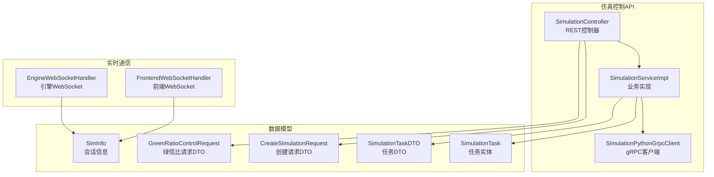
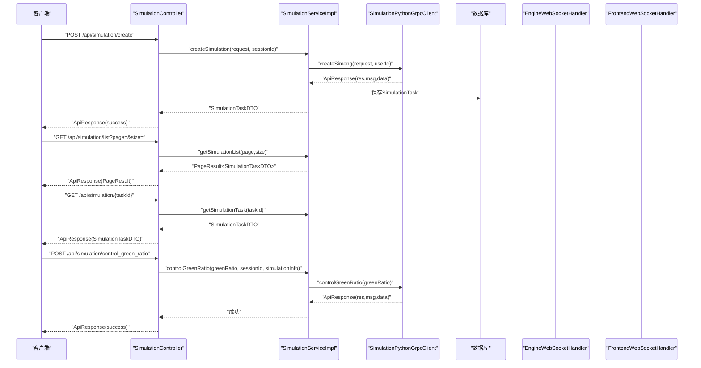
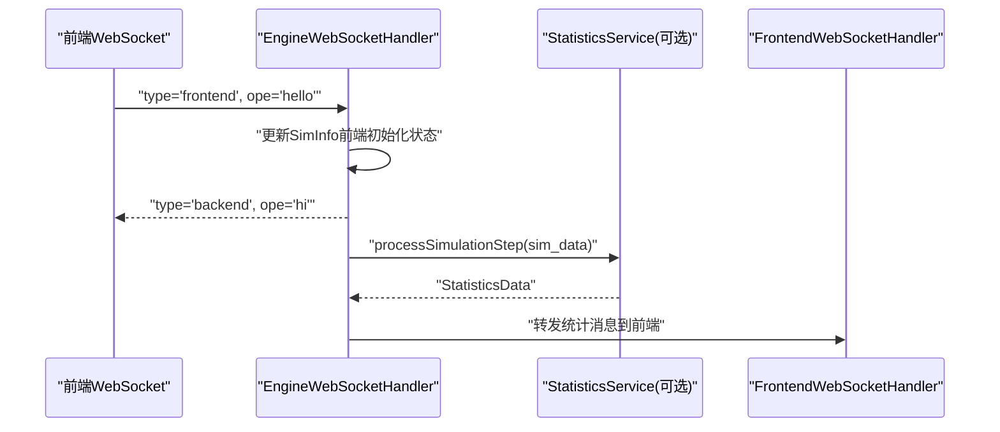
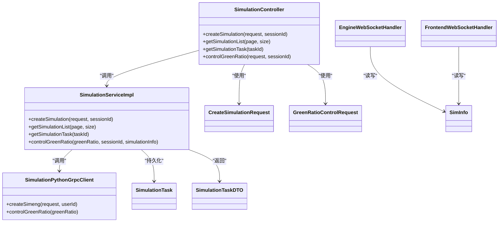
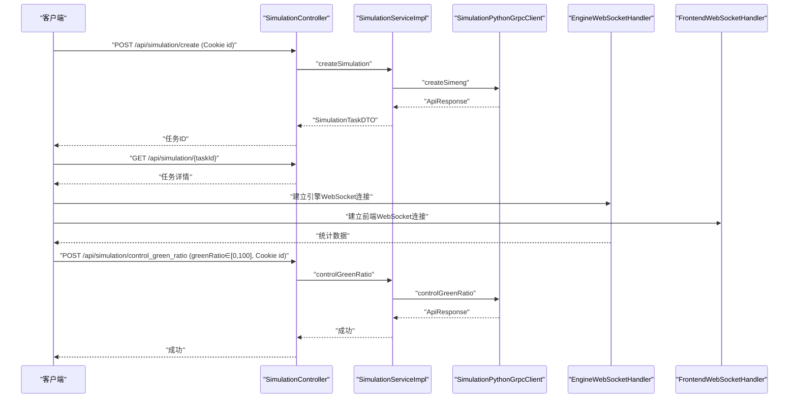

# 仿真控制API

<cite>
**本文引用的文件**
- [SimulationController.java](file://plugins/plugin-simulation/src/main/java/com/traffic/sim/plugin/simulation/controller/SimulationController.java)
- [CreateSimulationRequest.java](file://traffic-sim-common/src/main/java/com/traffic/sim/common/dto/CreateSimulationRequest.java)
- [GreenRatioControlRequest.java](file://traffic-sim-common/src/main/java/com/traffic/sim/common/dto/GreenRatioControlRequest.java)
- [ErrorCode.java](file://traffic-sim-common/src/main/java/com/traffic/sim/common/constant/ErrorCode.java)
- [SimulationServiceImpl.java](file://plugins/plugin-simulation/src/main/java/com/traffic/sim/plugin/simulation/service/SimulationServiceImpl.java)
- [SimulationPythonGrpcClient.java](file://plugins/plugin-simulation/src/main/java/com/traffic/sim/plugin/simulation/grpc/SimulationPythonGrpcClient.java)
- [PageResult.java](file://traffic-sim-common/src/main/java/com/traffic/sim/common/response/PageResult.java)
- [EngineWebSocketHandler.java](file://plugins/plugin-engine-manager/src/main/java/com/traffic/sim/plugin/engine/manager/websocket/EngineWebSocketHandler.java)
- [FrontendWebSocketHandler.java](file://plugins/plugin-engine-manager/src/main/java/com/traffic/sim/plugin/engine-manager/websocket/FrontendWebSocketHandler.java)
- [SimInfo.java](file://traffic-sim-common/src/main/java/com/traffic/sim/common/model/SimInfo.java)
- [SimulationTask.java](file://plugins/plugin-simulation/src/main/java/com/traffic/sim/plugin/simulation/entity/SimulationTask.java)
- [SimulationTaskDTO.java](file://traffic-sim-common/src/main/java/com/traffic/sim/common/dto/SimulationTaskDTO.java)
- [ApiResponse.java](file://traffic-sim-common/src/main/java/com/traffic/sim/common/response/ApiResponse.java)
- [GlobalExceptionHandler.java](file://traffic-sim-server/src/main/java/com/traffic/sim/exception/GlobalExceptionHandler.java)
</cite>

## 目录
1. [简介](#简介)
2. [项目结构](#项目结构)
3. [核心组件](#核心组件)
4. [架构总览](#架构总览)
5. [详细组件分析](#详细组件分析)
6. [依赖关系分析](#依赖关系分析)
7. [性能考量](#性能考量)
8. [故障排查指南](#故障排查指南)
9. [结论](#结论)
10. [附录](#附录)

## 简介
本文件面向仿真控制API使用者，系统性梳理SimulationController提供的全部功能，包括：
- 创建仿真任务的REST流程与请求体字段说明
- 任务列表与详情查询的分页机制
- 绿信比控制接口的实时调控能力与参数范围
- WebSocket与REST API的协同工作模式
- 仿真会话状态管理与错误码含义
- 完整的调用序列示例（创建仿真与动态调整信号灯）

## 项目结构
围绕仿真控制API的关键模块分布如下：
- 控制层：SimulationController 提供REST接口
- 业务层：SimulationServiceImpl 实现业务逻辑与gRPC调用
- DTO与模型：CreateSimulationRequest、GreenRatioControlRequest、SimulationTaskDTO、SimInfo等
- WebSocket：EngineWebSocketHandler与FrontendWebSocketHandler负责引擎与前端的实时通信
- 统一响应与异常：ApiResponse与GlobalExceptionHandler

图表来源
- [SimulationController.java](file://plugins/plugin-simulation/src/main/java/com/traffic/sim/plugin/simulation/controller/SimulationController.java#L1-L134)
- [SimulationServiceImpl.java](file://plugins/plugin-simulation/src/main/java/com/traffic/sim/plugin/simulation/service/SimulationServiceImpl.java#L1-L191)
- [SimulationPythonGrpcClient.java](file://plugins/plugin-simulation/src/main/java/com/traffic/sim/plugin/simulation/grpc/SimulationPythonGrpcClient.java#L1-L264)
- [CreateSimulationRequest.java](file://traffic-sim-common/src/main/java/com/traffic/sim/common/dto/CreateSimulationRequest.java#L1-L134)
- [GreenRatioControlRequest.java](file://traffic-sim-common/src/main/java/com/traffic/sim/common/dto/GreenRatioControlRequest.java#L1-L31)
- [SimulationTask.java](file://plugins/plugin-simulation/src/main/java/com/traffic/sim/plugin/simulation/entity/SimulationTask.java#L1-L51)
- [SimulationTaskDTO.java](file://traffic-sim-common/src/main/java/com/traffic/sim/common/dto/SimulationTaskDTO.java#L1-L46)
- [SimInfo.java](file://traffic-sim-common/src/main/java/com/traffic/sim/common/model/SimInfo.java#L1-L74)
- [EngineWebSocketHandler.java](file://plugins/plugin-engine-manager/src/main/java/com/traffic/sim/plugin/engine/manager/websocket/EngineWebSocketHandler.java#L1-L272)
- [FrontendWebSocketHandler.java](file://plugins/plugin-engine-manager/src/main/java/com/traffic/sim/plugin/engine-manager/websocket/FrontendWebSocketHandler.java#L1-L186)

章节来源
- [SimulationController.java](file://plugins/plugin-simulation/src/main/java/com/traffic/sim/plugin/simulation/controller/SimulationController.java#L1-L134)
- [SimulationServiceImpl.java](file://plugins/plugin-simulation/src/main/java/com/traffic/sim/plugin/simulation/service/SimulationServiceImpl.java#L1-L191)

## 核心组件
- SimulationController：暴露REST接口，负责参数校验、会话校验、调用业务层并返回统一响应。
- SimulationServiceImpl：实现业务逻辑，封装gRPC调用，持久化任务，处理分页与参数校验。
- SimulationPythonGrpcClient：封装与Python仿真引擎的gRPC交互，具备容错兜底能力。
- DTO与模型：CreateSimulationRequest、GreenRatioControlRequest、SimulationTaskDTO、SimInfo等。
- WebSocket：EngineWebSocketHandler与FrontendWebSocketHandler分别处理引擎与前端的实时通信，实现数据转发与状态同步。

章节来源
- [SimulationController.java](file://plugins/plugin-simulation/src/main/java/com/traffic/sim/plugin/simulation/controller/SimulationController.java#L1-L134)
- [SimulationServiceImpl.java](file://plugins/plugin-simulation/src/main/java/com/traffic/sim/plugin/simulation/service/SimulationServiceImpl.java#L1-L191)
- [SimulationPythonGrpcClient.java](file://plugins/plugin-simulation/src/main/java/com/traffic/sim/plugin/simulation/grpc/SimulationPythonGrpcClient.java#L1-L264)
- [CreateSimulationRequest.java](file://traffic-sim-common/src/main/java/com/traffic/sim/common/dto/CreateSimulationRequest.java#L1-L134)
- [GreenRatioControlRequest.java](file://traffic-sim-common/src/main/java/com/traffic/sim/common/dto/GreenRatioControlRequest.java#L1-L31)
- [SimulationTaskDTO.java](file://traffic-sim-common/src/main/java/com/traffic/sim/common/dto/SimulationTaskDTO.java#L1-L46)
- [SimInfo.java](file://traffic-sim-common/src/main/java/com/traffic/sim/common/model/SimInfo.java#L1-L74)
- [EngineWebSocketHandler.java](file://plugins/plugin-engine-manager/src/main/java/com/traffic/sim/plugin/engine/manager/websocket/EngineWebSocketHandler.java#L1-L272)
- [FrontendWebSocketHandler.java](file://plugins/plugin-engine-manager/src/main/java/com/traffic/sim/plugin/engine-manager/websocket/FrontendWebSocketHandler.java#L1-L186)

## 架构总览
仿真控制API采用“REST + WebSocket”的协同架构：
- REST层：提供任务创建、列表查询、详情查询、绿信比控制等接口，统一返回ApiResponse。
- WebSocket层：在会话建立后，将引擎侧仿真数据经统计处理后推送给前端；同时支持双向消息转发。
- 业务层：负责参数校验、gRPC调用、数据库持久化与状态管理。

图表来源
- [SimulationController.java](file://plugins/plugin-simulation/src/main/java/com/traffic/sim/plugin/simulation/controller/SimulationController.java#L1-L134)
- [SimulationServiceImpl.java](file://plugins/plugin-simulation/src/main/java/com/traffic/sim/plugin/simulation/service/SimulationServiceImpl.java#L1-L191)
- [SimulationPythonGrpcClient.java](file://plugins/plugin-simulation/src/main/java/com/traffic/sim/plugin/simulation/grpc/SimulationPythonGrpcClient.java#L1-L264)
- [SimulationTask.java](file://plugins/plugin-simulation/src/main/java/com/traffic/sim/plugin/simulation/entity/SimulationTask.java#L1-L51)
- [PageResult.java](file://traffic-sim-common/src/main/java/com/traffic/sim/common/response/PageResult.java#L1-L47)

## 详细组件分析

### 接口总览与会话要求
- 创建仿真任务：POST /api/simulation/create
  - 请求体：CreateSimulationRequest
  - 会话Cookie：必需，键名为id
  - 返回：ApiResponse，data为任务ID
- 查询任务列表：GET /api/simulation/list
  - 查询参数：page（默认1）、size（默认10）
  - 返回：ApiResponse，data为PageResult<SimulationTaskDTO>
- 查询任务详情：GET /api/simulation/{taskId}
  - 路径参数：taskId
  - 返回：ApiResponse，data为SimulationTaskDTO
- 绿信比控制：POST /api/simulation/control_green_ratio
  - 请求体：GreenRatioControlRequest（greenRatio∈[0,100]）
  - 会话Cookie：必需，键名为id
  - 返回：ApiResponse，data为操作结果文本

章节来源
- [SimulationController.java](file://plugins/plugin-simulation/src/main/java/com/traffic/sim/plugin/simulation/controller/SimulationController.java#L1-L134)
- [PageResult.java](file://traffic-sim-common/src/main/java/com/traffic/sim/common/response/PageResult.java#L1-L47)

### CreateSimulationRequest 字段定义
- 基本信息
  - name：仿真名称
  - mapXmlName：地图XML文件名
  - mapXmlPath：地图XML文件路径
- 仿真配置
  - simInfo：包含name、mapXmlName、mapXmlPath、fixedOd
  - fixedOd：包含od（起点OD列表）与sg（信号灯组配置）
- 控制视图
  - controlViews：包含usePlugin与activePlugin

章节来源
- [CreateSimulationRequest.java](file://traffic-sim-common/src/main/java/com/traffic/sim/common/dto/CreateSimulationRequest.java#L1-L134)

### 绿信比控制接口详解
- 参数范围：greenRatio∈[0,100]，超出范围将触发参数校验错误
- 上下文传递：simulationInfo为可选Map，用于日志记录与追踪
- 会话校验：必须携带Cookie id
- 执行流程：业务层校验参数→调用gRPC→根据响应码决定成功或错误

章节来源
- [GreenRatioControlRequest.java](file://traffic-sim-common/src/main/java/com/traffic/sim/common/dto/GreenRatioControlRequest.java#L1-L31)
- [SimulationController.java](file://plugins/plugin-simulation/src/main/java/com/traffic/sim/plugin/simulation/controller/SimulationController.java#L1-L134)
- [SimulationServiceImpl.java](file://plugins/plugin-simulation/src/main/java/com/traffic/sim/plugin/simulation/service/SimulationServiceImpl.java#L1-L191)
- [SimulationPythonGrpcClient.java](file://plugins/plugin-simulation/src/main/java/com/traffic/sim/plugin/simulation/grpc/SimulationPythonGrpcClient.java#L1-L264)

### 任务列表与分页机制
- GET /api/simulation/list?page=&size=
- 默认page=1，size=10
- 返回PageResult，包含records、total、page、size、pages

章节来源
- [SimulationController.java](file://plugins/plugin-simulation/src/main/java/com/traffic/sim/plugin/simulation/controller/SimulationController.java#L1-L134)
- [SimulationServiceImpl.java](file://plugins/plugin-simulation/src/main/java/com/traffic/sim/plugin/simulation/service/SimulationServiceImpl.java#L1-L191)
- [PageResult.java](file://traffic-sim-common/src/main/java/com/traffic/sim/common/response/PageResult.java#L1-L47)

### 任务详情查询
- GET /api/simulation/{taskId}
- 返回SimulationTaskDTO，包含任务基本信息、状态、用户ID与时间戳

章节来源
- [SimulationController.java](file://plugins/plugin-simulation/src/main/java/com/traffic/sim/plugin/simulation/controller/SimulationController.java#L1-L134)
- [SimulationServiceImpl.java](file://plugins/plugin-simulation/src/main/java/com/traffic/sim/plugin/simulation/service/SimulationServiceImpl.java#L1-L191)
- [SimulationTaskDTO.java](file://traffic-sim-common/src/main/java/com/traffic/sim/common/dto/SimulationTaskDTO.java#L1-L46)

### WebSocket 实时通信与REST协同
- 连接路径
  - 引擎侧：/ws/exe/{exe_id}，其中exe_id即session_id
  - 前端侧：/ws/fe/{session_id}
- 会话状态
  - SimInfo维护前端与引擎连接、初始化状态、仿真配置与目录等
- 数据流转
  - 引擎向后端发送“sim_data”类型消息，经统计服务处理后转发给前端
  - 后端与前端握手消息（hello/hi）用于建立会话状态
- 双向转发
  - 前端消息可转发至引擎；引擎消息可转发至前端

图表来源
- [EngineWebSocketHandler.java](file://plugins/plugin-engine-manager/src/main/java/com/traffic/sim/plugin/engine/manager/websocket/EngineWebSocketHandler.java#L1-L272)
- [FrontendWebSocketHandler.java](file://plugins/plugin-engine-manager/src/main/java/com/traffic/sim/plugin/engine-manager/websocket/FrontendWebSocketHandler.java#L1-L186)
- [SimInfo.java](file://traffic-sim-common/src/main/java/com/traffic/sim/common/model/SimInfo.java#L1-L74)

## 依赖关系分析
- 控制层依赖业务层与DTO模型
- 业务层依赖gRPC客户端与数据库实体
- WebSocket处理器依赖会话服务与统计服务（可选）
- 统一响应与异常处理贯穿各层

图表来源
- [SimulationController.java](file://plugins/plugin-simulation/src/main/java/com/traffic/sim/plugin/simulation/controller/SimulationController.java#L1-L134)
- [SimulationServiceImpl.java](file://plugins/plugin-simulation/src/main/java/com/traffic/sim/plugin/simulation/service/SimulationServiceImpl.java#L1-L191)
- [SimulationPythonGrpcClient.java](file://plugins/plugin-simulation/src/main/java/com/traffic/sim/plugin/simulation/grpc/SimulationPythonGrpcClient.java#L1-L264)
- [CreateSimulationRequest.java](file://traffic-sim-common/src/main/java/com/traffic/sim/common/dto/CreateSimulationRequest.java#L1-L134)
- [GreenRatioControlRequest.java](file://traffic-sim-common/src/main/java/com/traffic/sim/common/dto/GreenRatioControlRequest.java#L1-L31)
- [SimulationTask.java](file://plugins/plugin-simulation/src/main/java/com/traffic/sim/plugin/simulation/entity/SimulationTask.java#L1-L51)
- [SimulationTaskDTO.java](file://traffic-sim-common/src/main/java/com/traffic/sim/common/dto/SimulationTaskDTO.java#L1-L46)
- [SimInfo.java](file://traffic-sim-common/src/main/java/com/traffic/sim/common/model/SimInfo.java#L1-L74)
- [EngineWebSocketHandler.java](file://plugins/plugin-engine-manager/src/main/java/com/traffic/sim/plugin/engine/manager/websocket/EngineWebSocketHandler.java#L1-L272)
- [FrontendWebSocketHandler.java](file://plugins/plugin-engine-manager/src/main/java/com/traffic/sim/plugin/engine-manager/websocket/FrontendWebSocketHandler.java#L1-L186)

## 性能考量
- gRPC容错：当Python服务不可用时，gRPC客户端返回兜底响应，业务层记录告警并继续执行，避免阻塞REST请求。
- 分页查询：列表接口使用分页参数，建议合理设置size以平衡网络与数据库压力。
- WebSocket统计处理：统计服务失败时回退转发原始数据，保证前端实时性不受影响。

章节来源
- [SimulationPythonGrpcClient.java](file://plugins/plugin-simulation/src/main/java/com/traffic/sim/plugin/simulation/grpc/SimulationPythonGrpcClient.java#L1-L264)
- [SimulationServiceImpl.java](file://plugins/plugin-simulation/src/main/java/com/traffic/sim/plugin/simulation/service/SimulationServiceImpl.java#L1-L191)
- [EngineWebSocketHandler.java](file://plugins/plugin-engine-manager/src/main/java/com/traffic/sim/plugin/engine/manager/websocket/EngineWebSocketHandler.java#L1-L272)

## 故障排查指南
- 会话缺失
  - 现象：创建仿真或绿信比控制返回ERR_AUTH
  - 原因：Cookie id缺失或为空
  - 处理：确保登录后携带Cookie id
- 参数校验失败
  - 现象：返回ERR_ARG
  - 原因：请求体字段为空或越界（如绿信比不在[0,100]）
  - 处理：修正请求体字段与取值范围
- 创建失败
  - 现象：返回ERR_CREATE
  - 原因：业务层或gRPC调用失败
  - 处理：查看gRPC服务状态与日志
- 引擎未初始化
  - 现象：返回ERR_ENGINE
  - 原因：仿真引擎未就绪或gRPC调用异常
  - 处理：确认引擎已初始化，重试或检查Python服务
- 未知错误
  - 现象：返回ERR_UNKNOWN或ERR_INTERNAL
  - 处理：查看全局异常处理器日志

章节来源
- [SimulationController.java](file://plugins/plugin-simulation/src/main/java/com/traffic/sim/plugin/simulation/controller/SimulationController.java#L1-L134)
- [SimulationServiceImpl.java](file://plugins/plugin-simulation/src/main/java/com/traffic/sim/plugin/simulation/service/SimulationServiceImpl.java#L1-L191)
- [ErrorCode.java](file://traffic-sim-common/src/main/java/com/traffic/sim/common/constant/ErrorCode.java#L1-L54)
- [GlobalExceptionHandler.java](file://traffic-sim-server/src/main/java/com/traffic/sim/exception/GlobalExceptionHandler.java#L1-L108)

## 结论
本API通过REST接口完成仿真任务的创建、查询与绿信比控制，结合WebSocket实现实时数据推送与状态同步。会话Cookie id为REST接口的必要条件，业务层对参数与gRPC调用进行严格校验与容错处理，确保系统稳定性与可观测性。

## 附录

### API定义与示例

- 创建仿真任务
  - 方法与路径：POST /api/simulation/create
  - 请求头：Content-Type: application/json
  - 请求体字段：参考CreateSimulationRequest
  - 会话Cookie：id
  - 成功响应：ApiResponse，data为任务ID
  - 失败响应：ERR_AUTH/ERR_CREATE/ERR_ARG

- 查询任务列表
  - 方法与路径：GET /api/simulation/list?page=&size=
  - 查询参数：page（默认1）、size（默认10）
  - 成功响应：ApiResponse，data为PageResult<SimulationTaskDTO>

- 查询任务详情
  - 方法与路径：GET /api/simulation/{taskId}
  - 成功响应：ApiResponse，data为SimulationTaskDTO

- 绿信比控制
  - 方法与路径：POST /api/simulation/control_green_ratio
  - 请求体字段：greenRatio（0-100）、simulationInfo（可选）
  - 会话Cookie：id
  - 成功响应：ApiResponse，data为操作结果文本
  - 失败响应：ERR_AUTH/ERR_ENGINE/ERR_ARG

章节来源
- [SimulationController.java](file://plugins/plugin-simulation/src/main/java/com/traffic/sim/plugin/simulation/controller/SimulationController.java#L1-L134)
- [CreateSimulationRequest.java](file://traffic-sim-common/src/main/java/com/traffic/sim/common/dto/CreateSimulationRequest.java#L1-L134)
- [GreenRatioControlRequest.java](file://traffic-sim-common/src/main/java/com/traffic/sim/common/dto/GreenRatioControlRequest.java#L1-L31)
- [SimulationTaskDTO.java](file://traffic-sim-common/src/main/java/com/traffic/sim/common/dto/SimulationTaskDTO.java#L1-L46)
- [PageResult.java](file://traffic-sim-common/src/main/java/com/traffic/sim/common/response/PageResult.java#L1-L47)

### 会话状态管理
- SimInfo包含sessionId、name、xmlPath、mapXmlName、simDir、simInfo、controlViews、前后端连接与初始化标志、时间戳等
- 引擎与前端分别通过WebSocket建立连接，握手后更新SimInfo状态

章节来源
- [SimInfo.java](file://traffic-sim-common/src/main/java/com/traffic/sim/common/model/SimInfo.java#L1-L74)
- [EngineWebSocketHandler.java](file://plugins/plugin-engine-manager/src/main/java/com/traffic/sim/plugin/engine/manager/websocket/EngineWebSocketHandler.java#L1-L272)
- [FrontendWebSocketHandler.java](file://plugins/plugin-engine-manager/src/main/java/com/traffic/sim/plugin/engine-manager/websocket/FrontendWebSocketHandler.java#L1-L186)

### 错误码对照
- ERR_OK：成功
- ERR_AUTH：认证失败（缺少会话）
- ERR_ARG：参数错误
- ERR_NOT_FOUND：资源不存在
- ERR_CREATE：创建失败
- ERR_ENGINE：引擎未初始化或控制失败
- ERR_UNKNOWN：未知错误
- ERR_INTERNAL：服务器内部错误

章节来源
- [ErrorCode.java](file://traffic-sim-common/src/main/java/com/traffic/sim/common/constant/ErrorCode.java#L1-L54)

### 调用序列示例

- 创建仿真并动态调整信号灯
  1) 客户端携带Cookie id调用创建接口，返回任务ID
  2) 客户端轮询任务详情接口获取任务状态
  3) 引擎与前端建立WebSocket连接，握手完成后开始接收仿真数据
  4) 客户端调用绿信比控制接口，传入greenRatio与simulationInfo
  5) 业务层校验参数并调用gRPC，返回成功或错误

图表来源
- [SimulationController.java](file://plugins/plugin-simulation/src/main/java/com/traffic/sim/plugin/simulation/controller/SimulationController.java#L1-L134)
- [SimulationServiceImpl.java](file://plugins/plugin-simulation/src/main/java/com/traffic/sim/plugin/simulation/service/SimulationServiceImpl.java#L1-L191)
- [SimulationPythonGrpcClient.java](file://plugins/plugin-simulation/src/main/java/com/traffic/sim/plugin/simulation/grpc/SimulationPythonGrpcClient.java#L1-L264)
- [EngineWebSocketHandler.java](file://plugins/plugin-engine-manager/src/main/java/com/traffic/sim/plugin/engine/manager/websocket/EngineWebSocketHandler.java#L1-L272)
- [FrontendWebSocketHandler.java](file://plugins/plugin-engine-manager/src/main/java/com/traffic/sim/plugin/engine-manager/websocket/FrontendWebSocketHandler.java#L1-L186)