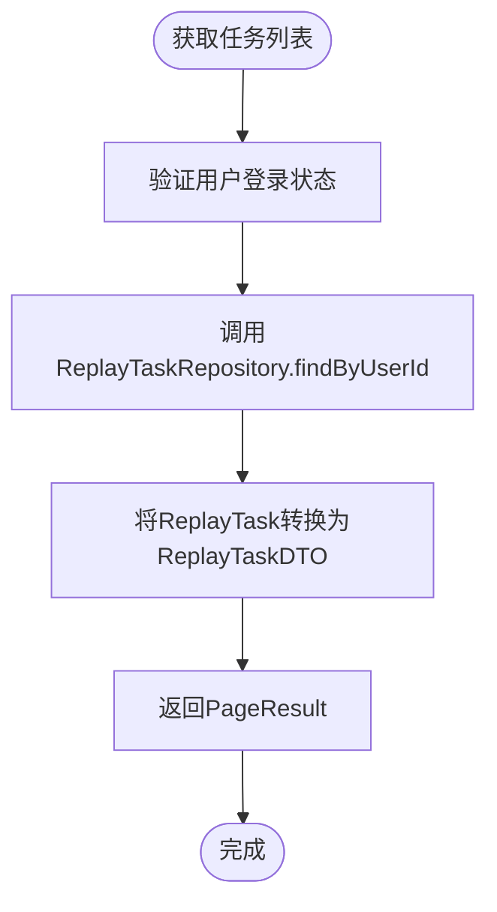

# 回放管理API

<cite>
**本文档引用文件**  
- [ReplayController.java](file://plugins/plugin-engine-replay/src/main/java/com/traffic/sim/plugin/replay/controller/ReplayController.java)
- [CreateReplayTaskRequest.java](file://plugins/plugin-engine-replay/src/main/java/com/traffic/sim/plugin/replay/dto/CreateReplayTaskRequest.java)
- [ReplayControlRequest.java](file://plugins/plugin-engine-replay/src/main/java/com/traffic/sim/plugin/replay/dto/ReplayControlRequest.java)
- [ReplayTaskDTO.java](file://plugins/plugin-engine-replay/src/main/java/com/traffic/sim/plugin/replay/dto/ReplayTaskDTO.java)
- [ReplayDataDTO.java](file://plugins/plugin-engine-replay/src/main/java/com/traffic/sim/plugin/replay/dto/ReplayDataDTO.java)
- [ReplayServiceImpl.java](file://plugins/plugin-engine-replay/src/main/java/com/traffic/sim/plugin/replay/service/ReplayServiceImpl.java)
- [ReplayTask.java](file://plugins/plugin-engine-replay/src/main/java/com/traffic/sim/plugin/replay/entity/ReplayTask.java)
- [ReplayDataDocument.java](file://plugins/plugin-engine-replay/src/main/java/com/traffic/sim/plugin/replay/document/ReplayDataDocument.java)
- [ReplayDataRepository.java](file://plugins/plugin-engine-replay/src/main/java/com/traffic/sim/plugin/replay/repository/ReplayDataRepository.java)
- [ReplayPluginProperties.java](file://plugins/plugin-engine-replay/src/main/java/com/traffic/sim/plugin/replay/config/ReplayPluginProperties.java)
</cite>

## 目录
1. [简介](#简介)
2. [核心接口说明](#核心接口说明)
3. [数据结构定义](#数据结构定义)
4. [回放数据存储机制](#回放数据存储机制)
5. [性能与查询优化](#性能与查询优化)
6. [错误处理与权限验证](#错误处理与权限验证)

## 简介

回放管理API提供对交通仿真历史数据的回放功能，支持创建、控制、查询和删除回放任务。系统采用分层架构，将任务元数据存储在MySQL中，而大量时序回放数据则存储在MongoDB中，实现高效的数据访问与管理。

**Section sources**
- [ReplayController.java](file://plugins/plugin-engine-replay/src/main/java/com/traffic/sim/plugin/replay/controller/ReplayController.java#L1-L140)

## 核心接口说明

### 创建回放任务

通过`POST /api/replay/create`接口创建新的回放任务。该接口接收`CreateReplayTaskRequest`参数，初始化任务状态为"CREATED"，并生成唯一任务ID。

**Diagram sources**
- [ReplayController.java](file://plugins/plugin-engine-replay/src/main/java/com/traffic/sim/plugin/replay/controller/ReplayController.java#L38-L50)
- [ReplayServiceImpl.java](file://plugins/plugin-engine-replay/src/main/java/com/traffic/sim/plugin/replay/service/ReplayServiceImpl.java#L37-L61)

### 获取任务详情与列表

- `GET /api/replay/{taskId}`：根据任务ID获取单个任务详情
- `GET /api/replay/list`：分页查询当前用户的所有回放任务，按创建时间倒序排列

**Diagram sources**
- [ReplayController.java](file://plugins/plugin-engine-replay/src/main/java/com/traffic/sim/plugin/replay/controller/ReplayController.java#L55-L84)
- [ReplayServiceImpl.java](file://plugins/plugin-engine-replay/src/main/java/com/traffic/sim/plugin/replay/service/ReplayServiceImpl.java#L71-L85)

### 获取回放数据

通过`GET /api/replay/{taskId}/data`接口按步数范围获取回放数据。系统会验证用户权限和步数范围的有效性。

**Diagram sources**
- [ReplayController.java](file://plugins/plugin-engine-replay/src/main/java/com/traffic/sim/plugin/replay/controller/ReplayController.java#L89-L103)
- [ReplayServiceImpl.java](file://plugins/plugin-engine-replay/src/main/java/com/traffic/sim/plugin/replay/service/ReplayServiceImpl.java#L88-L105)

### 控制回放操作

`POST /api/replay/{taskId}/control`接口支持多种回放控制操作，通过`ReplayControlRequest`指定操作类型。

**Diagram sources**
- [ReplayController.java](file://plugins/plugin-engine-replay/src/main/java/com/traffic/sim/plugin/replay/controller/ReplayController.java#L108-L121)
- [ReplayServiceImpl.java](file://plugins/plugin-engine-replay/src/main/java/com/traffic/sim/plugin/replay/service/ReplayServiceImpl.java#L107-L170)

### 删除回放任务

`DELETE /api/replay/{taskId}`接口删除回放任务时，会同时清理MySQL中的任务记录和MongoDB中的回放数据。

**Diagram sources**
- [ReplayController.java](file://plugins/plugin-engine-replay/src/main/java/com/traffic/sim/plugin/replay/controller/ReplayController.java#L126-L137)
- [ReplayServiceImpl.java](file://plugins/plugin-engine-replay/src/main/java/com/traffic/sim/plugin/replay/service/ReplayServiceImpl.java#L172-L185)

## 数据结构定义

### CreateReplayTaskRequest

创建回放任务的请求参数。

| 字段 | 类型 | 必填 | 说明 |
|------|------|------|------|
| simulationTaskId | String | 是 | 关联的仿真任务ID |
| name | String | 是 | 回放任务名称 |

**Section sources**
- [CreateReplayTaskRequest.java](file://plugins/plugin-engine-replay/src/main/java/com/traffic/sim/plugin/replay/dto/CreateReplayTaskRequest.java#L1-L32)

### ReplayControlRequest

回放控制请求，包含操作类型和相关参数。

| 字段 | 类型 | 必填 | 说明 |
|------|------|------|------|
| action | ReplayControlAction | 是 | 控制操作类型 |
| targetStep | Long | 否 | 跳转操作的目标步数 |
| speed | Double | 否 | 设置速度操作的播放速度 |

**ReplayControlAction枚举值：**
- PLAY: 播放
- PAUSE: 暂停
- STOP: 停止
- SEEK: 跳转
- SET_SPEED: 设置速度

**Section sources**
- [ReplayControlRequest.java](file://plugins/plugin-engine-replay/src/main/java/com/traffic/sim/plugin/replay/dto/ReplayControlRequest.java#L1-L62)

### ReplayTaskDTO

回放任务数据传输对象。

| 字段 | 类型 | 说明 |
|------|------|------|
| taskId | String | 任务唯一标识 |
| simulationTaskId | String | 关联的仿真任务ID |
| name | String | 任务名称 |
| status | String | 任务状态(CREATED/PLAYING/PAUSED/STOPPED/FINISHED) |
| currentStep | Long | 当前播放步数 |
| totalSteps | Long | 总步数 |
| playbackSpeed | Double | 播放速度（倍速） |
| userId | Long | 用户ID |
| createTime | Date | 创建时间 |
| updateTime | Date | 更新时间 |

**Section sources**
- [ReplayTaskDTO.java](file://plugins/plugin-engine-replay/src/main/java/com/traffic/sim/plugin/replay/dto/ReplayTaskDTO.java#L1-L30)

### ReplayDataDTO

回放数据传输对象。

| 字段 | 类型 | 说明 |
|------|------|------|
| step | Long | 仿真步数 |
| timestamp | Long | 时间戳 |
| simData | Map<String, Object> | 仿真数据 |
| statistics | Map<String, Object> | 统计数据 |

**Section sources**
- [ReplayDataDTO.java](file://plugins/plugin-engine-replay/src/main/java/com/traffic/sim/plugin/replay/dto/ReplayDataDTO.java#L1-L39)

## 回放数据存储机制

系统采用混合存储架构，将不同类型的数据存储在最适合的数据库中。

**存储特点：**
- **MySQL存储**：`replay_task`表存储任务元数据，使用JPA进行ORM映射
- **MongoDB存储**：`replay_data`集合存储时序回放数据，利用NoSQL的灵活模式和高效查询
- **数据关联**：通过`taskId`字段建立任务与数据的关联关系

**Section sources**
- [ReplayTask.java](file://plugins/plugin-engine-replay/src/main/java/com/traffic/sim/plugin/replay/entity/ReplayTask.java#L1-L102)
- [ReplayDataDocument.java](file://plugins/plugin-engine-replay/src/main/java/com/traffic/sim/plugin/replay/document/ReplayDataDocument.java#L1-L47)

## 性能与查询优化

### 大范围数据查询处理

为避免一次性查询大量数据导致内存溢出，系统对回放数据查询进行了优化。

**性能相关配置：**
- 最大批量查询步数：10000步
- 默认播放速度：1.0倍速
- 最大播放速度：10.0倍速
- 最小播放速度：0.1倍速
- 数据保留时间：30天

**Section sources**
- [ReplayDataRepository.java](file://plugins/plugin-engine-replay/src/main/java/com/traffic/sim/plugin/replay/repository/ReplayDataRepository.java#L1-L41)
- [ReplayPluginProperties.java](file://plugins/plugin-engine-replay/src/main/java/com/traffic/sim/plugin/replay/config/ReplayPluginProperties.java#L1-L70)

## 错误处理与权限验证

所有接口均包含用户权限验证和参数校验机制。

**常见错误码：**
- 400: 用户未登录或参数错误
- 403: 无权限访问指定资源
- 404: 回放任务不存在
- 409: 当前状态无法执行指定操作

**Section sources**
- [ReplayController.java](file://plugins/plugin-engine-replay/src/main/java/com/traffic/sim/plugin/replay/controller/ReplayController.java#L42-L137)
- [ReplayServiceImpl.java](file://plugins/plugin-engine-replay/src/main/java/com/traffic/sim/plugin/replay/service/ReplayServiceImpl.java#L64-L177)