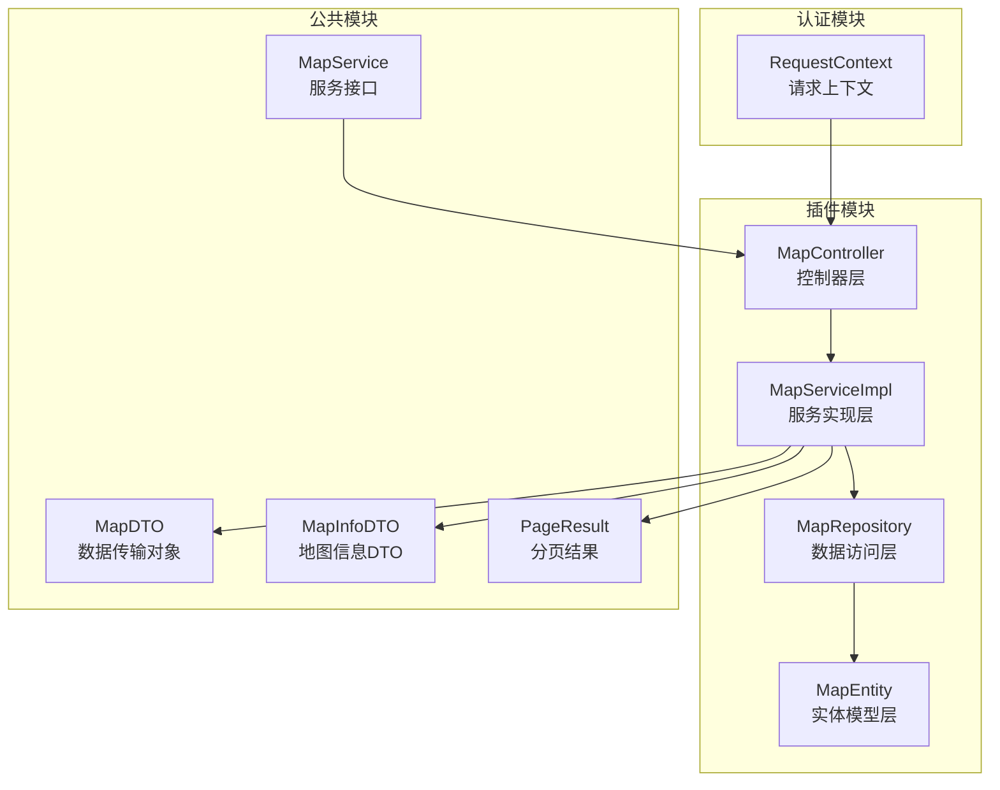
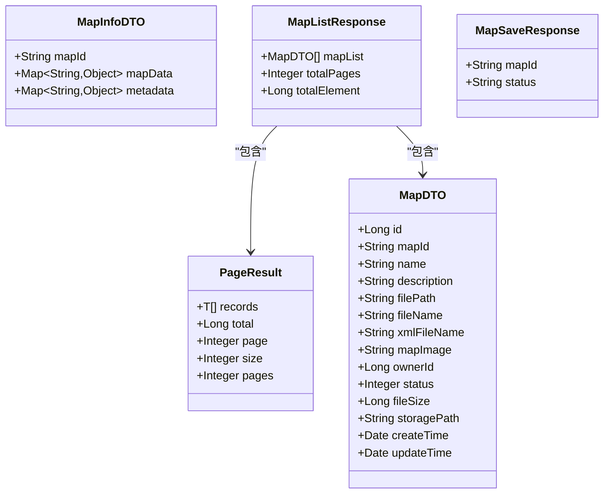
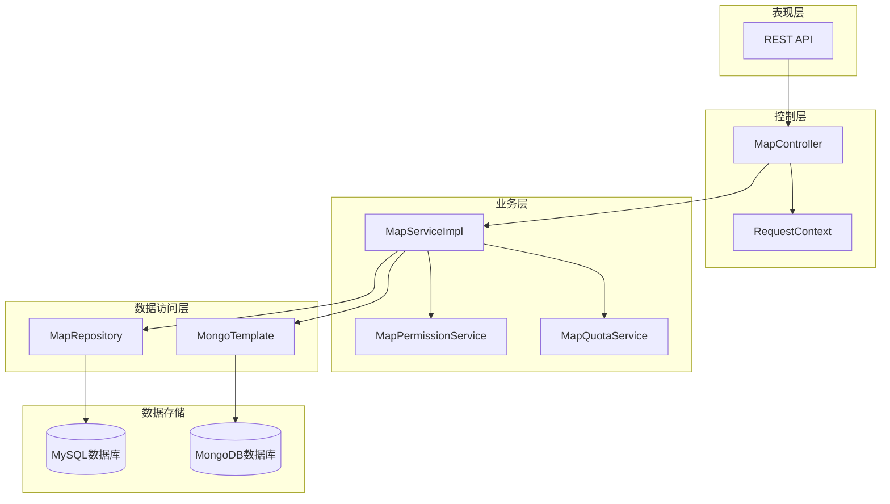
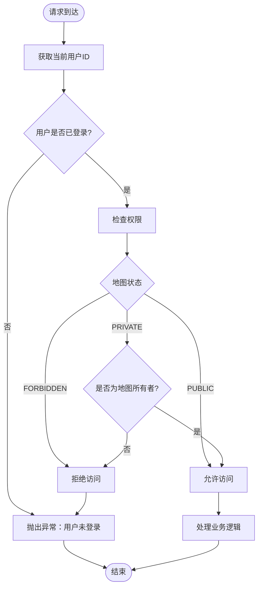
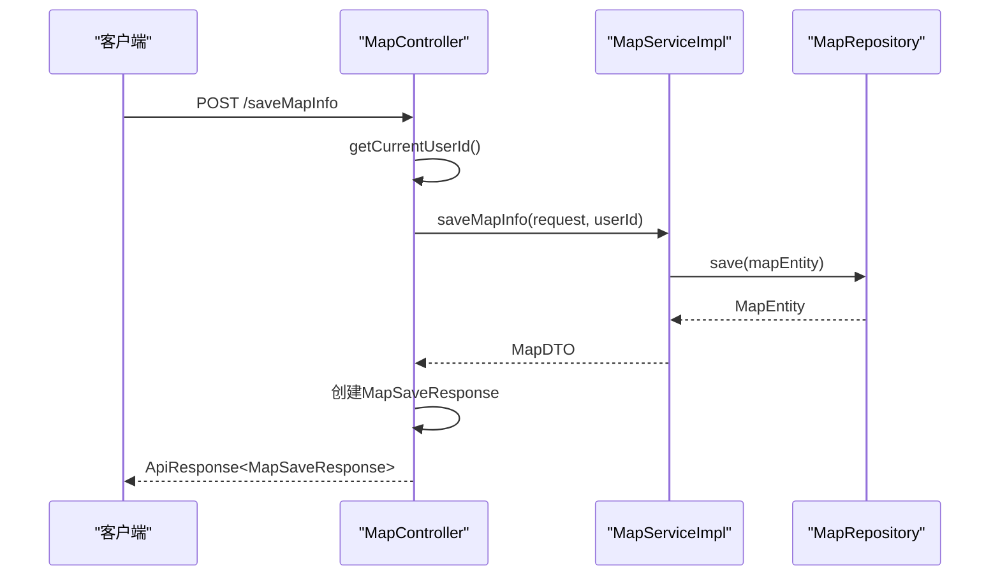
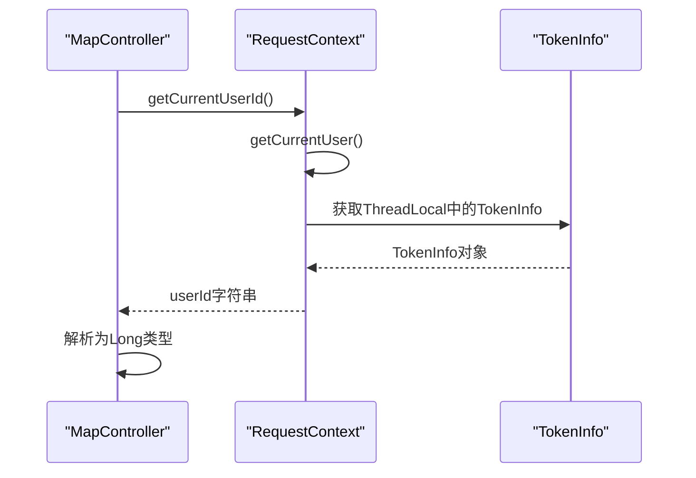
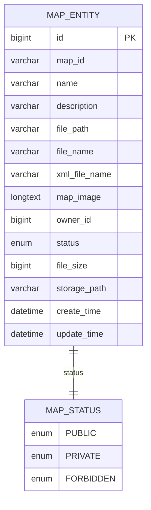
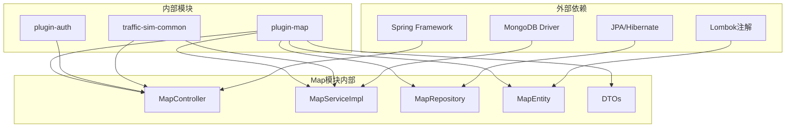

# 地图API

<cite>
**本文档引用的文件**
- [MapController.java](file://plugins/plugin-map/src/main/java/com/traffic/sim/plugin/map/controller/MapController.java)
- [MapServiceImpl.java](file://plugins/plugin-map/src/main/java/com/traffic/sim/plugin/map/service/MapServiceImpl.java)
- [MapListResponse.java](file://plugins/plugin-map/src/main/java/com/traffic/sim/plugin/map/dto/MapListResponse.java)
- [MapSaveResponse.java](file://plugins/plugin-map/src/main/java/com/traffic/sim/plugin/map/dto/MapSaveResponse.java)
- [PageResult.java](file://traffic-sim-common/src/main/java/com/traffic/sim/common/response/PageResult.java)
- [MapDTO.java](file://traffic-sim-common/src/main/java/com/traffic/sim/common/dto/MapDTO.java)
- [MapInfoDTO.java](file://traffic-sim-common/src/main/java/com/traffic/sim/common/dto/MapInfoDTO.java)
- [RequestContext.java](file://plugins/plugin-auth/src/main/java/com/traffic/sim/plugin/auth/util/RequestContext.java)
- [MapEntity.java](file://plugins/plugin-map/src/main/java/com/traffic/sim/plugin/map/entity/MapEntity.java)
- [MapRepository.java](file://plugins/plugin-map/src/main/java/com/traffic/sim/plugin/map/repository/MapRepository.java)
- [MapService.java](file://traffic-sim-common/src/main/java/com/traffic/sim/common/service/MapService.java)
- [MapPermissionService.java](file://plugins/plugin-map/src/main/java/com/traffic/sim/plugin/map/service/MapPermissionService.java)
- [MapQuotaService.java](file://plugins/plugin-map/src/main/java/com/traffic/sim/plugin/map/service/MapQuotaService.java)
</cite>

## 目录
1. [简介](#简介)
2. [项目结构](#项目结构)
3. [核心组件](#核心组件)
4. [架构概览](#架构概览)
5. [详细组件分析](#详细组件分析)
6. [依赖关系分析](#依赖关系分析)
7. [性能考虑](#性能考虑)
8. [故障排除指南](#故障排除指南)
9. [结论](#结论)

## 简介

本文件详细说明了地图管理API的旧版兼容接口，包括保存地图信息、获取用户/公开/所有地图列表、从MongoDB获取地图数据、预览地图信息和管理员删除地图等功能。该API基于Spring Boot框架构建，采用分层架构设计，包含控制器层、服务层、数据访问层和实体模型层。

## 项目结构

地图管理功能主要分布在以下模块中：

**图表来源**
- [MapController.java](file://plugins/plugin-map/src/main/java/com/traffic/sim/plugin/map/controller/MapController.java#L23-L27)
- [MapServiceImpl.java](file://plugins/plugin-map/src/main/java/com/traffic/sim/plugin/map/service/MapServiceImpl.java#L40-L43)
- [MapRepository.java](file://plugins/plugin-map/src/main/java/com/traffic/sim/plugin/map/repository/MapRepository.java#L19-L20)

**章节来源**
- [MapController.java](file://plugins/plugin-map/src/main/java/com/traffic/sim/plugin/map/controller/MapController.java#L1-L155)
- [MapServiceImpl.java](file://plugins/plugin-map/src/main/java/com/traffic/sim/plugin/map/service/MapServiceImpl.java#L1-L395)

## 核心组件

### MapController - 控制器层

MapController是地图管理API的主要入口点，提供了7个旧版兼容接口：

| 接口名称 | HTTP方法 | URL路径 | 功能描述 |
|---------|---------|--------|----------|
| saveMapInfo | POST | `/saveMapInfo` | 保存地图信息 |
| getUserMap | GET | `/getUserMap` | 获取用户地图列表 |
| getPublicMap | GET | `/getPublicMap` | 获取公开地图列表 |
| getMapInfoDB | GET | `/getMapInfoDB` | 从MongoDB获取地图数据 |
| previewMapInfo | POST | `/previewMapInfo` | 预览地图信息 |
| deleteMap | DELETE | `/deleteMap` | 管理员删除地图 |
| getAllMap | GET | `/getAllMap` | 获取所有地图（管理员） |

### MapServiceImpl - 服务实现层

MapServiceImpl实现了完整的业务逻辑，包括：
- 地图信息保存和更新
- 用户权限验证
- MongoDB数据读取
- 文件配额管理
- 分页查询处理

### 数据传输对象

系统使用多种DTO来封装数据传输：

**图表来源**
- [MapDTO.java](file://traffic-sim-common/src/main/java/com/traffic/sim/common/dto/MapDTO.java#L14-L32)
- [MapInfoDTO.java](file://traffic-sim-common/src/main/java/com/traffic/sim/common/dto/MapInfoDTO.java#L14-L32)
- [MapListResponse.java](file://plugins/plugin-map/src/main/java/com/traffic/sim/plugin/map/dto/MapListResponse.java#L15-L31)
- [MapSaveResponse.java](file://plugins/plugin-map/src/main/java/com/traffic/sim/plugin/map/dto/MapSaveResponse.java#L11-L15)
- [PageResult.java](file://traffic-sim-common/src/main/java/com/traffic/sim/common/response/PageResult.java#L19-L44)

**章节来源**
- [MapController.java](file://plugins/plugin-map/src/main/java/com/traffic/sim/plugin/map/controller/MapController.java#L28-L152)
- [MapServiceImpl.java](file://plugins/plugin-map/src/main/java/com/traffic/sim/plugin/map/service/MapServiceImpl.java#L43-L393)

## 架构概览

地图管理API采用经典的三层架构模式：

**图表来源**
- [MapController.java](file://plugins/plugin-map/src/main/java/com/traffic/sim/plugin/map/controller/MapController.java#L23-L27)
- [MapServiceImpl.java](file://plugins/plugin-map/src/main/java/com/traffic/sim/plugin/map/service/MapServiceImpl.java#L40-L50)
- [MapRepository.java](file://plugins/plugin-map/src/main/java/com/traffic/sim/plugin/map/repository/MapRepository.java#L19-L20)

### 权限控制流程

**图表来源**
- [MapController.java](file://plugins/plugin-map/src/main/java/com/traffic/sim/plugin/map/controller/MapController.java#L142-L152)
- [MapPermissionService.java](file://plugins/plugin-map/src/main/java/com/traffic/sim/plugin/map/service/MapPermissionService.java#L19-L37)

## 详细组件分析

### MapController - 旧版兼容接口

#### 保存地图信息接口

**接口定义**
- HTTP方法：POST
- URL路径：`/saveMapInfo`
- 请求体：JSON对象，包含地图相关信息
- 返回值：ApiResponse<MapSaveResponse>

**请求参数说明**

| 参数名 | 类型 | 必填 | 描述 |
|-------|------|------|------|
| mapName | String | 否 | 地图名称，默认"未命名地图" |
| description | String | 否 | 地图描述 |
| filePath | String | 否 | 文件路径 |
| fileName | String | 否 | 原始文件名 |
| xmlFileName | String | 否 | XML文件名 |
| mapId | String | 否 | 地图ID |
| fileSize | String | 否 | 文件大小（字符串形式） |

**响应结构**

**图表来源**
- [MapController.java](file://plugins/plugin-map/src/main/java/com/traffic/sim/plugin/map/controller/MapController.java#L35-L47)
- [MapServiceImpl.java](file://plugins/plugin-map/src/main/java/com/traffic/sim/plugin/map/service/MapServiceImpl.java#L54-L76)

**章节来源**
- [MapController.java](file://plugins/plugin-map/src/main/java/com/traffic/sim/plugin/map/controller/MapController.java#L31-L47)
- [MapServiceImpl.java](file://plugins/plugin-map/src/main/java/com/traffic/sim/plugin/map/service/MapServiceImpl.java#L54-L76)

#### 获取用户地图列表接口

**接口定义**
- HTTP方法：GET
- URL路径：`/getUserMap`
- 查询参数：
  - mapName: String（可选），地图名称过滤条件
  - page: int（默认1），当前页码
  - limit: int（默认10），每页条数

**响应结构**
- 返回：ApiResponse<MapListResponse>
- MapListResponse包含：
  - mapList: List<MapDTO>，地图列表
  - totalPages: Integer，总页数
  - totalElement: Long，总记录数

**章节来源**
- [MapController.java](file://plugins/plugin-map/src/main/java/com/traffic/sim/plugin/map/controller/MapController.java#L53-L64)
- [MapServiceImpl.java](file://plugins/plugin-map/src/main/java/com/traffic/sim/plugin/map/service/MapServiceImpl.java#L135-L146)

#### 获取公开地图列表接口

**接口定义**
- HTTP方法：GET
- URL路径：`/getPublicMap`
- 查询参数与getUserMap相同

**业务逻辑**
- 查询状态为PUBLIC的地图
- 支持按名称模糊搜索
- 使用分页查询

**章节来源**
- [MapController.java](file://plugins/plugin-map/src/main/java/com/traffic/sim/plugin/map/controller/MapController.java#L70-L80)
- [MapServiceImpl.java](file://plugins/plugin-map/src/main/java/com/traffic/sim/plugin/map/service/MapServiceImpl.java#L149-L155)

#### 从MongoDB获取地图数据接口

**接口定义**
- HTTP方法：GET
- URL路径：`/getMapInfoDB`
- 查询参数：mapId（必须）

**权限控制**
- 需要用户登录
- 需要具备访问权限（公开地图或地图所有者）
- 管理员可访问除禁用外的所有地图

**章节来源**
- [MapController.java](file://plugins/plugin-map/src/main/java/com/traffic/sim/plugin/map/controller/MapController.java#L87-L94)
- [MapServiceImpl.java](file://plugins/plugin-map/src/main/java/com/traffic/sim/plugin/map/service/MapServiceImpl.java#L253-L272)

#### 预览地图信息接口

**接口定义**
- HTTP方法：POST
- URL路径：`/previewMapInfo`
- 请求体：包含mapFile参数的JSON对象

**注意**：当前实现为占位符，实际预览逻辑待实现。

**章节来源**
- [MapController.java](file://plugins/plugin-map/src/main/java/com/traffic/sim/plugin/map/controller/MapController.java#L101-L106)
- [MapServiceImpl.java](file://plugins/plugin-map/src/main/java/com/traffic/sim/plugin/map/service/MapServiceImpl.java#L275-L280)

#### 管理员删除地图接口

**接口定义**
- HTTP方法：DELETE
- URL路径：`/deleteMap`
- 请求体：包含mapId和status的JSON对象

**参数说明**
- mapId: String，地图ID
- status: Integer，操作类型
  - 1: 物理删除
  - 2: 设置为禁用状态

**章节来源**
- [MapController.java](file://plugins/plugin-map/src/main/java/com/traffic/sim/plugin/map/controller/MapController.java#L114-L121)
- [MapServiceImpl.java](file://plugins/plugin-map/src/main/java/com/traffic/sim/plugin/map/service/MapServiceImpl.java#L229-L242)

#### 获取所有地图接口

**接口定义**
- HTTP方法：GET
- URL路径：`/getAllMap`
- 查询参数：mapName（可选）、page（默认1）、limit（默认10）

**用途**：管理员专用，用于查看系统中的所有地图。

**章节来源**
- [MapController.java](file://plugins/plugin-map/src/main/java/com/traffic/sim/plugin/map/controller/MapController.java#L128-L137)
- [MapServiceImpl.java](file://plugins/plugin-map/src/main/java/com/traffic/sim/plugin/map/service/MapServiceImpl.java#L245-L250)

### MapService - 业务逻辑处理

#### getCurrentUserId() 方法

MapController通过RequestContext.getCurrentUserId()获取当前用户上下文：

**图表来源**
- [MapController.java](file://plugins/plugin-map/src/main/java/com/traffic/sim/plugin/map/controller/MapController.java#L142-L152)
- [RequestContext.java](file://plugins/plugin-auth/src/main/java/com/traffic/sim/plugin/auth/util/RequestContext.java#L32-L35)

#### MapListResponse 结构

| 字段名 | 类型 | 描述 |
|-------|------|------|
| mapList | List<MapDTO> | 地图列表数据 |
| totalPages | Integer | 总页数 |
| totalElement | Long | 总记录数 |

#### MapSaveResponse 结构

| 字段名 | 类型 | 描述 |
|-------|------|------|
| mapId | String | 保存后的地图ID |
| status | String | 操作状态（success） |

#### PageResult 格式

PageResult是通用的分页结果封装：

| 字段名 | 类型 | 描述 |
|-------|------|------|
| records | List<T> | 当前页的数据列表 |
| total | Long | 总记录数 |
| page | Integer | 当前页码（从1开始） |
| size | Integer | 每页大小 |
| pages | Integer | 总页数 |

**章节来源**
- [MapListResponse.java](file://plugins/plugin-map/src/main/java/com/traffic/sim/plugin/map/dto/MapListResponse.java#L15-L31)
- [MapSaveResponse.java](file://plugins/plugin-map/src/main/java/com/traffic/sim/plugin/map/dto/MapSaveResponse.java#L11-L15)
- [PageResult.java](file://traffic-sim-common/src/main/java/com/traffic/sim/common/response/PageResult.java#L19-L44)

### MapEntity - 数据模型

MapEntity是JPA实体，映射到数据库表：

**图表来源**
- [MapEntity.java](file://plugins/plugin-map/src/main/java/com/traffic/sim/plugin/map/entity/MapEntity.java#L14-L114)

**章节来源**
- [MapEntity.java](file://plugins/plugin-map/src/main/java/com/traffic/sim/plugin/map/entity/MapEntity.java#L16-L114)

## 依赖关系分析

### 组件依赖图

**图表来源**
- [MapController.java](file://plugins/plugin-map/src/main/java/com/traffic/sim/plugin/map/controller/MapController.java#L1-L16)
- [MapServiceImpl.java](file://plugins/plugin-map/src/main/java/com/traffic/sim/plugin/map/service/MapServiceImpl.java#L1-L34)

### 关键依赖关系

1. **MapController** 依赖 **MapService** 接口
2. **MapServiceImpl** 实现 **MapService** 接口
3. **MapServiceImpl** 依赖 **MapRepository** 和 **MongoTemplate**
4. **MapRepository** 继承 **JpaRepository** 提供数据访问能力
5. **RequestContext** 提供用户上下文信息

**章节来源**
- [MapService.java](file://traffic-sim-common/src/main/java/com/traffic/sim/common/service/MapService.java#L18-L91)
- [MapRepository.java](file://plugins/plugin-map/src/main/java/com/traffic/sim/plugin/map/repository/MapRepository.java#L19-L85)

## 性能考虑

### 查询优化

1. **分页查询**：所有列表查询都使用分页，避免一次性加载大量数据
2. **索引优化**：建议在数据库表上为常用查询字段建立索引
3. **懒加载**：大字段（如地图图片）使用懒加载策略

### 缓存策略

1. **用户配额缓存**：UserMapQuota可以考虑缓存以减少数据库查询
2. **权限检查缓存**：频繁的权限检查可以使用缓存机制

### 并发控制

1. **事务管理**：关键操作使用@Transactional注解确保数据一致性
2. **线程安全**：RequestContext使用ThreadLocal确保线程安全

## 故障排除指南

### 常见错误及解决方案

| 错误类型 | 错误码 | 描述 | 解决方案 |
|---------|--------|------|----------|
| 用户未登录 | 500 | getCurrentUserId返回null | 确保用户已登录并正确设置Token |
| 权限不足 | 403 | 无权访问地图 | 检查地图状态和用户权限 |
| 地图不存在 | 404 | 地图ID无效 | 验证地图ID是否正确 |
| 文件过大 | 400 | 超过文件大小限制 | 检查配置文件中的最大文件大小设置 |
| 配额不足 | 400 | 地图数量或存储空间不足 | 检查用户配额并清理不需要的地图 |

### 调试建议

1. **启用日志**：在开发环境中启用DEBUG级别日志
2. **参数验证**：在Controller层添加参数验证
3. **异常处理**：统一异常处理机制，提供有意义的错误信息

**章节来源**
- [MapController.java](file://plugins/plugin-map/src/main/java/com/traffic/sim/plugin/map/controller/MapController.java#L142-L152)
- [MapServiceImpl.java](file://plugins/plugin-map/src/main/java/com/traffic/sim/plugin/map/service/MapServiceImpl.java#L314-L333)

## 结论

地图管理API提供了完整的旧版兼容接口，涵盖了地图的增删改查、权限控制、配额管理和数据持久化等核心功能。系统采用清晰的分层架构设计，具有良好的可扩展性和维护性。

### 主要优势

1. **完整的权限体系**：支持公开、私有、禁用三种状态的地图
2. **灵活的分页查询**：支持多维度的分页查询
3. **完善的错误处理**：提供详细的错误信息和状态码
4. **可扩展的设计**：基于接口的架构便于功能扩展

### 改进建议

1. **增强预览功能**：完善previewMapInfo接口的实际功能
2. **添加缓存机制**：对频繁访问的数据添加缓存
3. **优化MongoDB查询**：为MongoDB集合添加适当的索引
4. **增加监控指标**：添加API调用统计和性能监控