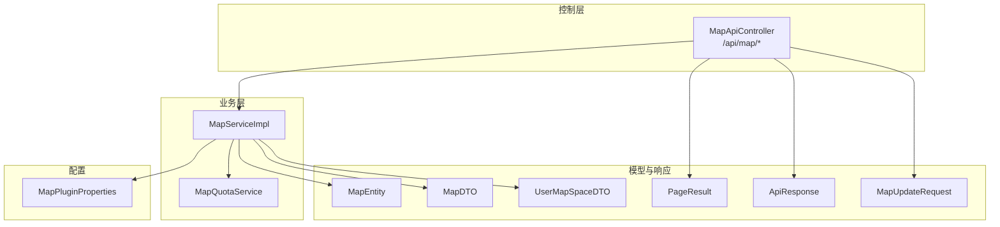
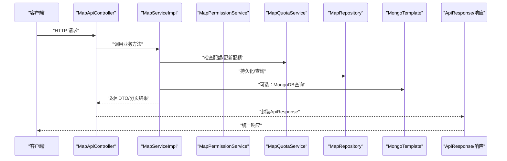
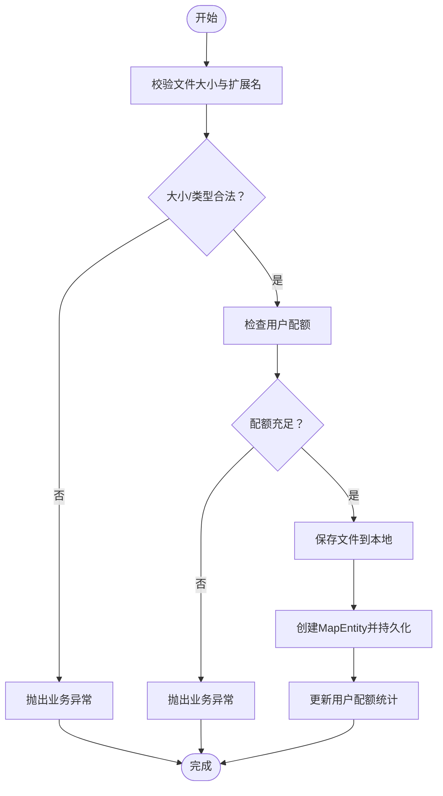
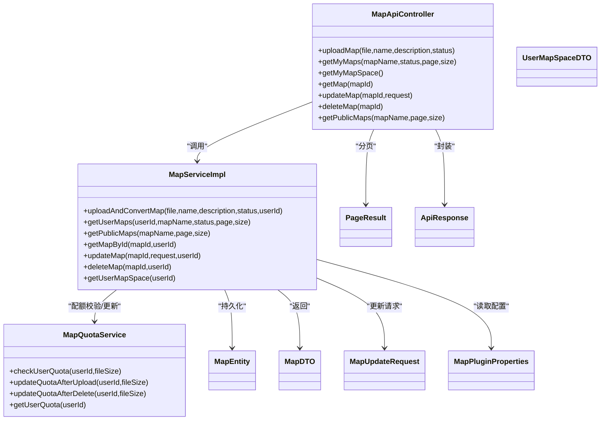

# 地图管理API

<cite>
**本文引用的文件**
- [MapApiController.java](file://plugins/plugin-map/src/main/java/com/traffic/sim/plugin/map/controller/MapApiController.java)
- [MapServiceImpl.java](file://plugins/plugin-map/src/main/java/com/traffic/sim/plugin/map/service/MapServiceImpl.java)
- [MapDTO.java](file://traffic-sim-common/src/main/java/com/traffic/sim/common/dto/MapDTO.java)
- [UserMapSpaceDTO.java](file://traffic-sim-common/src/main/java/com/traffic/sim/common/dto/UserMapSpaceDTO.java)
- [MapUpdateRequest.java](file://traffic-sim-common/src/main/java/com/traffic/sim/common/dto/MapUpdateRequest.java)
- [PageResult.java](file://traffic-sim-common/src/main/java/com/traffic/sim/common/response/PageResult.java)
- [ApiResponse.java](file://traffic-sim-common/src/main/java/com/traffic/sim/common/response/ApiResponse.java)
- [MapEntity.java](file://plugins/plugin-map/src/main/java/com/traffic/sim/plugin/map/entity/MapEntity.java)
- [MapQuotaService.java](file://plugins/plugin-map/src/main/java/com/traffic/sim/plugin/map/service/MapQuotaService.java)
- [MapPluginProperties.java](file://plugins/plugin-map/src/main/java/com/traffic/sim/plugin/map/config/MapPluginProperties.java)
</cite>

## 目录
1. [简介](#简介)
2. [项目结构](#项目结构)
3. [核心组件](#核心组件)
4. [架构总览](#架构总览)
5. [详细组件分析](#详细组件分析)
6. [依赖关系分析](#依赖关系分析)
7. [性能与配额](#性能与配额)
8. [故障排查指南](#故障排查指南)
9. [结论](#结论)
10. [附录：接口清单与示例](#附录接口清单与示例)

## 简介
本文件为“地图管理API”的权威技术文档，聚焦于MapApiController提供的RESTful接口能力，覆盖地图上传、个人地图列表分页查询、用户空间配额查询、地图详情/更新/删除、公开地图列表等完整流程。文档同时给出MapDTO、UserMapSpaceDTO等响应对象字段定义、上传文件类型限制、以及上传转换失败等异常处理策略，并提供curl示例帮助快速验证接口行为。

## 项目结构
- 控制层：MapApiController位于插件模块，负责接收HTTP请求并返回统一响应包装。
- 业务层：MapServiceImpl实现具体业务逻辑，包括配额校验、文件校验与保存、权限校验、分页查询、状态转换等。
- 数据模型：MapEntity为持久化实体；MapDTO、UserMapSpaceDTO为对外传输对象；MapUpdateRequest用于更新请求体。
- 统一响应：ApiResponse封装res/msg/data/timestamp；PageResult封装分页字段。
- 配置：MapPluginProperties集中管理配额、上传、存储、Python服务等配置项。

图表来源
- [MapApiController.java](file://plugins/plugin-map/src/main/java/com/traffic/sim/plugin/map/controller/MapApiController.java#L1-L146)
- [MapServiceImpl.java](file://plugins/plugin-map/src/main/java/com/traffic/sim/plugin/map/service/MapServiceImpl.java#L1-L200)
- [MapQuotaService.java](file://plugins/plugin-map/src/main/java/com/traffic/sim/plugin/map/service/MapQuotaService.java#L1-L115)
- [MapEntity.java](file://plugins/plugin-map/src/main/java/com/traffic/sim/plugin/map/entity/MapEntity.java#L1-L116)
- [MapDTO.java](file://traffic-sim-common/src/main/java/com/traffic/sim/common/dto/MapDTO.java#L1-L34)
- [UserMapSpaceDTO.java](file://traffic-sim-common/src/main/java/com/traffic/sim/common/dto/UserMapSpaceDTO.java#L1-L58)
- [PageResult.java](file://traffic-sim-common/src/main/java/com/traffic/sim/common/response/PageResult.java#L1-L47)
- [ApiResponse.java](file://traffic-sim-common/src/main/java/com/traffic/sim/common/response/ApiResponse.java#L1-L85)
- [MapPluginProperties.java](file://plugins/plugin-map/src/main/java/com/traffic/sim/plugin/map/config/MapPluginProperties.java#L1-L96)

章节来源
- [MapApiController.java](file://plugins/plugin-map/src/main/java/com/traffic/sim/plugin/map/controller/MapApiController.java#L1-L146)
- [MapServiceImpl.java](file://plugins/plugin-map/src/main/java/com/traffic/sim/plugin/map/service/MapServiceImpl.java#L1-L200)

## 核心组件
- MapApiController：提供RESTful接口，统一返回ApiResponse包装，内部通过RequestContext获取当前用户ID。
- MapServiceImpl：实现上传、查询、权限校验、配额更新、分页转换等核心逻辑。
- MapDTO：对外返回的地图对象，包含id、mapId、name、description、filePath、fileName、xmlFileName、mapImage、ownerId、status、fileSize、storagePath、createTime、updateTime等字段。
- UserMapSpaceDTO：用户地图空间配额信息，包含userId、maxMaps、currentMaps、totalSize、maxSize、remainingMaps、remainingSize、usageRate等。
- MapUpdateRequest：更新请求体，包含name、description、status字段。
- PageResult：分页结果容器，包含records、total、page、size、pages。
- ApiResponse：统一响应结构，包含res、msg、data、timestamp。

章节来源
- [MapDTO.java](file://traffic-sim-common/src/main/java/com/traffic/sim/common/dto/MapDTO.java#L1-L34)
- [UserMapSpaceDTO.java](file://traffic-sim-common/src/main/java/com/traffic/sim/common/dto/UserMapSpaceDTO.java#L1-L58)
- [MapUpdateRequest.java](file://traffic-sim-common/src/main/java/com/traffic/sim/common/dto/MapUpdateRequest.java#L1-L27)
- [PageResult.java](file://traffic-sim-common/src/main/java/com/traffic/sim/common/response/PageResult.java#L1-L47)
- [ApiResponse.java](file://traffic-sim-common/src/main/java/com/traffic/sim/common/response/ApiResponse.java#L1-L85)

## 架构总览
下图展示MapApiController到业务层与数据层的交互关系，以及关键对象流转。

图表来源
- [MapApiController.java](file://plugins/plugin-map/src/main/java/com/traffic/sim/plugin/map/controller/MapApiController.java#L1-L146)
- [MapServiceImpl.java](file://plugins/plugin-map/src/main/java/com/traffic/sim/plugin/map/service/MapServiceImpl.java#L1-L200)
- [MapQuotaService.java](file://plugins/plugin-map/src/main/java/com/traffic/sim/plugin/map/service/MapQuotaService.java#L1-L115)
- [MapEntity.java](file://plugins/plugin-map/src/main/java/com/traffic/sim/plugin/map/entity/MapEntity.java#L1-L116)

## 详细组件分析

### 接口总览与参数规范
- 上传地图
  - 方法：POST
  - 路径：/api/map/upload
  - 多部分表单参数：
    - file：必填，MultipartFile，原始文件名由后端拼接新文件名保存
    - name：必填，字符串，地图名称
    - description：可选，字符串，地图描述
    - status：可选，整型，0-公开，1-私有，2-禁用，默认1
  - 返回：ApiResponse<MapDTO>
- 获取个人地图列表
  - 方法：GET
  - 路径：/api/map/my-maps
  - 查询参数：
    - mapName：可选，字符串，按名称模糊过滤
    - status：可选，整型，0/1/2
    - page：可选，默认1
    - size：可选，默认10
  - 返回：ApiResponse<PageResult<MapDTO>>
- 获取用户地图空间配额
  - 方法：GET
  - 路径：/api/map/my-space
  - 返回：ApiResponse<UserMapSpaceDTO>
- 获取地图详情
  - 方法：GET
  - 路径：/api/map/{mapId}
  - 路径参数：mapId
  - 返回：ApiResponse<MapDTO>
- 更新地图信息
  - 方法：PUT
  - 路径：/api/map/{mapId}
  - 路径参数：mapId
  - 请求体：MapUpdateRequest（name、description、status）
  - 返回：ApiResponse<MapDTO>
- 删除地图
  - 方法：DELETE
  - 路径：/api/map/{mapId}
  - 路径参数：mapId
  - 返回：ApiResponse<String>
- 获取公开地图列表
  - 方法：GET
  - 路径：/api/map/public
  - 查询参数：
    - mapName：可选，字符串
    - page：可选，默认1
    - size：可选，默认10
  - 返回：ApiResponse<PageResult<MapDTO>>

章节来源
- [MapApiController.java](file://plugins/plugin-map/src/main/java/com/traffic/sim/plugin/map/controller/MapApiController.java#L30-L128)

### 上传流程与文件校验
- 参数校验与配额检查
  - 校验文件大小与扩展名
  - 校验用户配额（地图数量上限、存储空间上限）
- 文件保存
  - 基于配置的basePath创建用户目录
  - 生成唯一文件名并保存至磁盘
- 地图入库
  - 构造MapEntity并保存
  - 更新配额统计
- 转换流程
  - 当前实现中预留了Python服务调用位置（注释提示），后续可接入gRPC转换

图表来源
- [MapServiceImpl.java](file://plugins/plugin-map/src/main/java/com/traffic/sim/plugin/map/service/MapServiceImpl.java#L320-L375)
- [MapQuotaService.java](file://plugins/plugin-map/src/main/java/com/traffic/sim/plugin/map/service/MapQuotaService.java#L30-L71)
- [MapPluginProperties.java](file://plugins/plugin-map/src/main/java/com/traffic/sim/plugin/map/config/MapPluginProperties.java#L1-L96)

章节来源
- [MapServiceImpl.java](file://plugins/plugin-map/src/main/java/com/traffic/sim/plugin/map/service/MapServiceImpl.java#L77-L119)
- [MapServiceImpl.java](file://plugins/plugin-map/src/main/java/com/traffic/sim/plugin/map/service/MapServiceImpl.java#L320-L375)
- [MapQuotaService.java](file://plugins/plugin-map/src/main/java/com/traffic/sim/plugin/map/service/MapQuotaService.java#L30-L71)
- [MapPluginProperties.java](file://plugins/plugin-map/src/main/java/com/traffic/sim/plugin/map/config/MapPluginProperties.java#L1-L96)

### 权限与状态
- 权限校验
  - 详情/更新/删除均会基于MapPermissionService进行访问/修改权限判断
  - 若无权限，抛出业务异常
- 状态枚举
  - MapEntity.MapStatus：PUBLIC(0)、PRIVATE(1)、FORBIDDEN(2)
  - 上传默认私有，可通过status参数设置

章节来源
- [MapServiceImpl.java](file://plugins/plugin-map/src/main/java/com/traffic/sim/plugin/map/service/MapServiceImpl.java#L156-L195)
- [MapEntity.java](file://plugins/plugin-map/src/main/java/com/traffic/sim/plugin/map/entity/MapEntity.java#L67-L100)

### 分页查询机制
- 个人地图列表与公开地图列表均采用PageRequest(page-1,size)进行分页
- PageResult包含records、total、page、size、pages字段
- 服务层将Page<MapEntity>转换为PageResult<MapDTO>

章节来源
- [MapServiceImpl.java](file://plugins/plugin-map/src/main/java/com/traffic/sim/plugin/map/service/MapServiceImpl.java#L122-L155)
- [PageResult.java](file://traffic-sim-common/src/main/java/com/traffic/sim/common/response/PageResult.java#L1-L47)

### 响应对象字段定义
- MapDTO
  - 字段：id、mapId、name、description、filePath、fileName、xmlFileName、mapImage、ownerId、status、fileSize、storagePath、createTime、updateTime
- UserMapSpaceDTO
  - 字段：userId、maxMaps、currentMaps、totalSize、maxSize、remainingMaps、remainingSize、usageRate
- MapUpdateRequest
  - 字段：name（长度限制）、description（长度限制）、status（0/1/2）

章节来源
- [MapDTO.java](file://traffic-sim-common/src/main/java/com/traffic/sim/common/dto/MapDTO.java#L1-L34)
- [UserMapSpaceDTO.java](file://traffic-sim-common/src/main/java/com/traffic/sim/common/dto/UserMapSpaceDTO.java#L1-L58)
- [MapUpdateRequest.java](file://traffic-sim-common/src/main/java/com/traffic/sim/common/dto/MapUpdateRequest.java#L1-L27)

## 依赖关系分析
- 控制器依赖业务服务与统一响应包装
- 业务服务依赖仓库、配额服务、权限服务、MongoTemplate、配置属性
- 实体与DTO之间存在一对一映射关系

图表来源
- [MapApiController.java](file://plugins/plugin-map/src/main/java/com/traffic/sim/plugin/map/controller/MapApiController.java#L1-L146)
- [MapServiceImpl.java](file://plugins/plugin-map/src/main/java/com/traffic/sim/plugin/map/service/MapServiceImpl.java#L1-L200)
- [MapQuotaService.java](file://plugins/plugin-map/src/main/java/com/traffic/sim/plugin/map/service/MapQuotaService.java#L1-L115)
- [MapEntity.java](file://plugins/plugin-map/src/main/java/com/traffic/sim/plugin/map/entity/MapEntity.java#L1-L116)
- [MapDTO.java](file://traffic-sim-common/src/main/java/com/traffic/sim/common/dto/MapDTO.java#L1-L34)
- [UserMapSpaceDTO.java](file://traffic-sim-common/src/main/java/com/traffic/sim/common/dto/UserMapSpaceDTO.java#L1-L58)
- [MapUpdateRequest.java](file://traffic-sim-common/src/main/java/com/traffic/sim/common/dto/MapUpdateRequest.java#L1-L27)
- [PageResult.java](file://traffic-sim-common/src/main/java/com/traffic/sim/common/response/PageResult.java#L1-L47)
- [ApiResponse.java](file://traffic-sim-common/src/main/java/com/traffic/sim/common/response/ApiResponse.java#L1-L85)
- [MapPluginProperties.java](file://plugins/plugin-map/src/main/java/com/traffic/sim/plugin/map/config/MapPluginProperties.java#L1-L96)

## 性能与配额
- 配额规则
  - 地图数量上限：默认50
  - 存储空间上限：默认1GB
- 上传后配额更新
  - 成功上传后，当前地图数量+1，已用存储空间+文件大小
- 删除后配额回退
  - 当前地图数量与已用存储空间按文件大小回退，保证非负
- 文件大小限制
  - 默认最大文件大小为100MB
- 文件类型限制
  - 默认允许扩展名为txt、osm、xml

章节来源
- [MapQuotaService.java](file://plugins/plugin-map/src/main/java/com/traffic/sim/plugin/map/service/MapQuotaService.java#L30-L71)
- [MapPluginProperties.java](file://plugins/plugin-map/src/main/java/com/traffic/sim/plugin/map/config/MapPluginProperties.java#L1-L96)
- [MapServiceImpl.java](file://plugins/plugin-map/src/main/java/com/traffic/sim/plugin/map/service/MapServiceImpl.java#L320-L333)

## 故障排查指南
- 未登录或用户ID非法
  - 触发点：从RequestContext获取当前用户ID为空或无法解析为Long
  - 表现：抛出运行时异常
- 文件保存失败
  - 触发点：IO异常导致保存失败
  - 表现：抛出业务异常，提示“文件保存失败”
- 不支持的文件类型
  - 触发点：扩展名不在允许列表
  - 表现：抛出业务异常，提示“不支持的文件类型”
- 文件大小超限
  - 触发点：文件大小超过配置上限
  - 表现：抛出业务异常，提示“文件大小超过限制”
- 地图数量/存储空间不足
  - 触发点：配额检查失败
  - 表现：抛出业务异常，提示“地图数量已达上限”或“存储空间不足”
- 无权访问/修改地图
  - 触发点：权限校验失败
  - 表现：抛出业务异常，提示“无权访问该地图”或“无权修改该地图”

章节来源
- [MapApiController.java](file://plugins/plugin-map/src/main/java/com/traffic/sim/plugin/map/controller/MapApiController.java#L130-L143)
- [MapServiceImpl.java](file://plugins/plugin-map/src/main/java/com/traffic/sim/plugin/map/service/MapServiceImpl.java#L115-L119)
- [MapServiceImpl.java](file://plugins/plugin-map/src/main/java/com/traffic/sim/plugin/map/service/MapServiceImpl.java#L320-L333)
- [MapQuotaService.java](file://plugins/plugin-map/src/main/java/com/traffic/sim/plugin/map/service/MapQuotaService.java#L30-L45)
- [MapServiceImpl.java](file://plugins/plugin-map/src/main/java/com/traffic/sim/plugin/map/service/MapServiceImpl.java#L156-L195)

## 结论
本API围绕“上传-查询-权限-配额-删除-公开列表”形成闭环，具备清晰的参数约束、严格的配额控制与完善的异常处理。上传流程中对文件大小、类型与用户配额进行前置校验，确保系统资源安全；分页查询与统一响应包装提升了易用性与一致性。建议在生产环境中结合前端表单校验与后端严格校验，保障上传质量与安全性。

## 附录：接口清单与示例

### 接口清单
- 上传地图
  - 方法：POST
  - 路径：/api/map/upload
  - 表单参数：file、name、description（可选）、status（可选，默认1）
  - 返回：ApiResponse<MapDTO>
- 获取个人地图列表
  - 方法：GET
  - 路径：/api/map/my-maps
  - 查询参数：mapName（可选）、status（可选）、page（可选，默认1）、size（可选，默认10）
  - 返回：ApiResponse<PageResult<MapDTO>>
- 获取用户地图空间配额
  - 方法：GET
  - 路径：/api/map/my-space
  - 返回：ApiResponse<UserMapSpaceDTO>
- 获取地图详情
  - 方法：GET
  - 路径：/api/map/{mapId}
  - 返回：ApiResponse<MapDTO>
- 更新地图信息
  - 方法：PUT
  - 路径：/api/map/{mapId}
  - 请求体：MapUpdateRequest（name、description、status）
  - 返回：ApiResponse<MapDTO>
- 删除地图
  - 方法：DELETE
  - 路径：/api/map/{mapId}
  - 返回：ApiResponse<String>
- 获取公开地图列表
  - 方法：GET
  - 路径：/api/map/public
  - 查询参数：mapName（可选）、page（可选，默认1）、size（可选，默认10）
  - 返回：ApiResponse<PageResult<MapDTO>>

### curl 示例
- 上传地图（multipart/form-data）
  - curl命令示例（请替换为实际文件路径与服务器地址）：
    - curl -X POST "http://localhost:8080/api/map/upload" -F "file=@/path/to/map.osm" -F "name=我的地图" -F "description=测试描述" -F "status=1"
- 获取个人地图列表
  - curl示例：
    - curl "http://localhost:8080/api/map/my-maps?page=1&size=10&mapName=测试"
- 获取用户地图空间配额
  - curl示例：
    - curl "http://localhost:8080/api/map/my-space"
- 获取地图详情
  - curl示例：
    - curl "http://localhost:8080/api/map/{mapId}"
- 更新地图信息
  - curl示例：
    - curl -X PUT "http://localhost:8080/api/map/{mapId}" -H "Content-Type: application/json" -d '{"name":"新名称","description":"新描述","status":0}'
- 删除地图
  - curl示例：
    - curl -X DELETE "http://localhost:8080/api/map/{mapId}"
- 获取公开地图列表
  - curl示例：
    - curl "http://localhost:8080/api/map/public?page=1&size=10&mapName=测试"