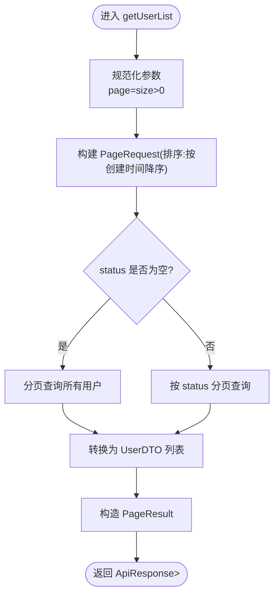

# 用户管理API

<cite>
**本文引用的文件**
- [UserController.java](file://plugins/plugin-user/src/main/java/com/traffic/sim/plugin/user/controller/UserController.java)
- [UserCreateRequest.java](file://plugins/plugin-user/src/main/java/com/traffic/sim/plugin/user/dto/UserCreateRequest.java)
- [UserUpdateRequest.java](file://plugins/plugin-user/src/main/java/com/traffic/sim/plugin/user/dto/UserUpdateRequest.java)
- [UserServiceImpl.java](file://plugins/plugin-user/src/main/java/com/traffic/sim/plugin/user/service/UserServiceImpl.java)
- [User.java](file://plugins/plugin-user/src/main/java/com/traffic/sim/plugin/user/entity/User.java)
- [Role.java](file://plugins/plugin-user/src/main/java/com/traffic/sim/plugin/user/entity/Role.java)
- [UserStatus.java](file://traffic-sim-common/src/main/java/com/traffic/sim/common/constant/UserStatus.java)
- [ApiResponse.java](file://traffic-sim-common/src/main/java/com/traffic/sim/common/response/ApiResponse.java)
- [PageResult.java](file://traffic-sim-common/src/main/java/com/traffic/sim/common/response/PageResult.java)
- [UserDTO.java](file://traffic-sim-common/src/main/java/com/traffic/sim/common/dto/UserDTO.java)
- [ErrorCode.java](file://traffic-sim-common/src/main/java/com/traffic/sim/common/constant/ErrorCode.java)
- [BusinessException.java](file://traffic-sim-common/src/main/java/com/traffic/sim/common/exception/BusinessException.java)
- [GlobalExceptionHandler.java](file://traffic-sim-server/src/main/java/com/traffic/sim/exception/GlobalExceptionHandler.java)
</cite>

## 目录
1. [简介](#简介)
2. [项目结构](#项目结构)
3. [核心组件](#核心组件)
4. [架构总览](#架构总览)
5. [详细组件分析](#详细组件分析)
6. [依赖关系分析](#依赖关系分析)
7. [性能考虑](#性能考虑)
8. [故障排查指南](#故障排查指南)
9. [结论](#结论)
10. [附录](#附录)

## 简介
本文件面向开发者与测试人员，系统性梳理用户管理模块的REST API，覆盖以下端点：
- GET /api/user/{id}：按用户ID获取用户信息
- GET /api/user/username/{username}：按用户名获取用户信息
- POST /api/user：创建用户
- PUT /api/user/{id}：更新用户信息
- PUT /api/user/{id}/password：修改用户密码
- DELETE /api/user/{id}：删除用户
- GET /api/user/list：分页查询用户列表

同时，文档明确UserCreateRequest与UserUpdateRequest的数据结构与校验规则，解释分页查询参数与PageResult<UserDTO>响应格式，并给出各接口的HTTP方法、认证要求、请求体示例与响应状态码说明；最后总结常见错误场景（如用户名重复、用户不存在）的处理机制与管理员角色在用户管理中的权限边界。

## 项目结构
用户管理API位于插件模块“plugin-user”，控制器、DTO、实体与服务实现均在此模块内；通用响应格式、分页模型与错误码位于traffic-sim-common模块；全局异常处理位于traffic-sim-server模块。

图表来源
- [UserController.java](file://plugins/plugin-user/src/main/java/com/traffic/sim/plugin/user/controller/UserController.java#L1-L119)
- [UserServiceImpl.java](file://plugins/plugin-user/src/main/java/com/traffic/sim/plugin/user/service/UserServiceImpl.java#L1-L331)
- [UserCreateRequest.java](file://plugins/plugin-user/src/main/java/com/traffic/sim/plugin/user/dto/UserCreateRequest.java#L1-L34)
- [UserUpdateRequest.java](file://plugins/plugin-user/src/main/java/com/traffic/sim/plugin/user/dto/UserUpdateRequest.java#L1-L30)
- [User.java](file://plugins/plugin-user/src/main/java/com/traffic/sim/plugin/user/entity/User.java#L1-L66)
- [Role.java](file://plugins/plugin-user/src/main/java/com/traffic/sim/plugin/user/entity/Role.java#L1-L40)
- [ApiResponse.java](file://traffic-sim-common/src/main/java/com/traffic/sim/common/response/ApiResponse.java#L1-L85)
- [PageResult.java](file://traffic-sim-common/src/main/java/com/traffic/sim/common/response/PageResult.java#L1-L47)
- [UserDTO.java](file://traffic-sim-common/src/main/java/com/traffic/sim/common/dto/UserDTO.java#L1-L30)
- [ErrorCode.java](file://traffic-sim-common/src/main/java/com/traffic/sim/common/constant/ErrorCode.java#L1-L54)
- [UserStatus.java](file://traffic-sim-common/src/main/java/com/traffic/sim/common/constant/UserStatus.java#L1-L24)
- [GlobalExceptionHandler.java](file://traffic-sim-server/src/main/java/com/traffic/sim/exception/GlobalExceptionHandler.java#L1-L109)

章节来源
- [UserController.java](file://plugins/plugin-user/src/main/java/com/traffic/sim/plugin/user/controller/UserController.java#L1-L119)
- [UserServiceImpl.java](file://plugins/plugin-user/src/main/java/com/traffic/sim/plugin/user/service/UserServiceImpl.java#L1-L331)

## 核心组件
- 控制器：UserController，提供REST端点与参数绑定、返回统一响应格式。
- 请求DTO：UserCreateRequest（创建）、UserUpdateRequest（更新），内置Javax Validation注解。
- 实体与仓库：User（用户）、Role（角色），服务实现负责业务逻辑与数据持久化。
- 响应与分页：ApiResponse（统一响应）、PageResult（分页结果）、UserDTO（传输对象）。
- 错误与异常：ErrorCode（错误码）、BusinessException（业务异常）、GlobalExceptionHandler（全局异常处理）。

章节来源
- [UserCreateRequest.java](file://plugins/plugin-user/src/main/java/com/traffic/sim/plugin/user/dto/UserCreateRequest.java#L1-L34)
- [UserUpdateRequest.java](file://plugins/plugin-user/src/main/java/com/traffic/sim/plugin/user/dto/UserUpdateRequest.java#L1-L30)
- [UserServiceImpl.java](file://plugins/plugin-user/src/main/java/com/traffic/sim/plugin/user/service/UserServiceImpl.java#L1-L331)
- [ApiResponse.java](file://traffic-sim-common/src/main/java/com/traffic/sim/common/response/ApiResponse.java#L1-L85)
- [PageResult.java](file://traffic-sim-common/src/main/java/com/traffic/sim/common/response/PageResult.java#L1-L47)
- [UserDTO.java](file://traffic-sim-common/src/main/java/com/traffic/sim/common/dto/UserDTO.java#L1-L30)
- [ErrorCode.java](file://traffic-sim-common/src/main/java/com/traffic/sim/common/constant/ErrorCode.java#L1-L54)
- [BusinessException.java](file://traffic-sim-common/src/main/java/com/traffic/sim/common/exception/BusinessException.java#L1-L34)
- [GlobalExceptionHandler.java](file://traffic-sim-server/src/main/java/com/traffic/sim/exception/GlobalExceptionHandler.java#L1-L109)

## 架构总览
用户管理API采用典型的MVC+服务层模式：Controller接收请求，调用UserServiceExt实现具体业务，服务层完成数据校验、加密、持久化与分页查询，最终以ApiResponse封装统一响应返回客户端。

图表来源
- [UserController.java](file://plugins/plugin-user/src/main/java/com/traffic/sim/plugin/user/controller/UserController.java#L1-L119)
- [UserServiceImpl.java](file://plugins/plugin-user/src/main/java/com/traffic/sim/plugin/user/service/UserServiceImpl.java#L1-L331)
- [GlobalExceptionHandler.java](file://traffic-sim-server/src/main/java/com/traffic/sim/exception/GlobalExceptionHandler.java#L1-L109)

## 详细组件分析

### 接口清单与规范
- GET /api/user/{id}
  - 方法：GET
  - 认证：未在控制器声明，通常需鉴权中间件支持（见下文）
  - 路径参数：id（Long）
  - 响应：ApiResponse<UserDTO>
  - 状态码：200 成功；若用户不存在，返回业务错误码
- GET /api/user/username/{username}
  - 方法：GET
  - 路径参数：username（String）
  - 响应：ApiResponse<UserDTO>
  - 状态码：200 成功；若用户不存在，返回业务错误码
- POST /api/user
  - 方法：POST
  - 认证：同上
  - 请求体：UserCreateRequest
  - 响应：ApiResponse<UserDTO>
  - 状态码：200 成功；参数校验失败返回400；业务异常返回业务错误码
- PUT /api/user/{id}
  - 方法：PUT
  - 路径参数：id（Long）
  - 认证：同上
  - 请求体：UserUpdateRequest
  - 响应：ApiResponse<UserDTO>
  - 状态码：200 成功；参数校验失败返回400；业务异常返回业务错误码
- PUT /api/user/{id}/password
  - 方法：PUT
  - 路径参数：id（Long）
  - 认证：同上
  - 查询参数：newPassword（String）
  - 响应：ApiResponse<String>
  - 状态码：200 成功；参数校验失败返回400；业务异常返回业务错误码
- DELETE /api/user/{id}
  - 方法：DELETE
  - 路径参数：id（Long）
  - 认证：同上
  - 响应：ApiResponse<String>
  - 状态码：200 成功；若用户不存在，返回业务错误码
- GET /api/user/list
  - 方法：GET
  - 认证：同上
  - 查询参数：page（int，默认1）、size（int，默认10）、status（String，可选）
  - 响应：ApiResponse<PageResult<UserDTO>>
  - 状态码：200 成功；参数非法返回400；业务异常返回业务错误码

章节来源
- [UserController.java](file://plugins/plugin-user/src/main/java/com/traffic/sim/plugin/user/controller/UserController.java#L1-L119)

### 数据模型与校验规则

#### UserCreateRequest（创建用户）
- 字段与校验
  - username：非空，长度3-50字符
  - password：非空，长度6-100字符
  - email：可选，需符合邮箱格式
  - phoneNumber：可选
  - institution：可选
  - roleId：可选（若提供，需存在对应角色）
- 服务侧行为
  - 校验用户名唯一性与邮箱唯一性（若提供邮箱）
  - 密码加密后存储
  - 默认状态为NORMAL
  - 若提供roleId，校验角色存在并回填角色名

章节来源
- [UserCreateRequest.java](file://plugins/plugin-user/src/main/java/com/traffic/sim/plugin/user/dto/UserCreateRequest.java#L1-L34)
- [UserServiceImpl.java](file://plugins/plugin-user/src/main/java/com/traffic/sim/plugin/user/service/UserServiceImpl.java#L190-L236)
- [UserStatus.java](file://traffic-sim-common/src/main/java/com/traffic/sim/common/constant/UserStatus.java#L1-L24)

#### UserUpdateRequest（更新用户）
- 字段与校验
  - password：可选，长度6-100字符（若提供则更新）
  - email：可选，需符合邮箱格式
  - phoneNumber：可选
  - institution：可选
  - roleId：可选（若提供，需存在对应角色）
  - status：可选（更新用户状态）
- 服务侧行为
  - 更新邮箱时检查唯一性（若变更）
  - 更新角色时校验角色存在并回填角色名
  - 可选更新密码（若提供）

章节来源
- [UserUpdateRequest.java](file://plugins/plugin-user/src/main/java/com/traffic/sim/plugin/user/dto/UserUpdateRequest.java#L1-L30)
- [UserServiceImpl.java](file://plugins/plugin-user/src/main/java/com/traffic/sim/plugin/user/service/UserServiceImpl.java#L240-L281)

#### UserDTO（传输对象）
- 字段：id、username、email、phoneNumber、institution、roleId、roleName、status、createTime、updateTime
- 用途：作为API响应载体返回给客户端

章节来源
- [UserDTO.java](file://traffic-sim-common/src/main/java/com/traffic/sim/common/dto/UserDTO.java#L1-L30)

#### PageResult<UserDTO>（分页结果）
- 字段：records（列表）、total（总数）、page（当前页）、size（每页大小）、pages（总页数）
- 构造：基于records、total、page、size计算pages

章节来源
- [PageResult.java](file://traffic-sim-common/src/main/java/com/traffic/sim/common/response/PageResult.java#L1-L47)

### 分页查询算法

图表来源
- [UserController.java](file://plugins/plugin-user/src/main/java/com/traffic/sim/plugin/user/controller/UserController.java#L104-L116)
- [UserServiceImpl.java](file://plugins/plugin-user/src/main/java/com/traffic/sim/plugin/user/service/UserServiceImpl.java#L298-L328)

### 错误处理与状态码
- 统一响应：ApiResponse，包含res、msg、data、timestamp
- 错误码：ErrorCode（如ERR_OK、ERR_ARG、ERR_EXIST、ERR_NOT_FOUND、ERR_INTERNAL等）
- 异常映射：
  - 参数校验失败：400，返回ERR_ARG
  - 业务异常：200，返回对应业务错误码与消息
  - 服务器内部错误：500，返回ERR_INTERNAL
- 常见错误场景
  - 用户不存在：ERR_NOT_FOUND
  - 用户名已存在/邮箱已被使用：ERR_EXIST
  - 密码为空：ERR_ARG
  - 非法参数：ERR_ARG

章节来源
- [ApiResponse.java](file://traffic-sim-common/src/main/java/com/traffic/sim/common/response/ApiResponse.java#L1-L85)
- [ErrorCode.java](file://traffic-sim-common/src/main/java/com/traffic/sim/common/constant/ErrorCode.java#L1-L54)
- [BusinessException.java](file://traffic-sim-common/src/main/java/com/traffic/sim/common/exception/BusinessException.java#L1-L34)
- [GlobalExceptionHandler.java](file://traffic-sim-server/src/main/java/com/traffic/sim/exception/GlobalExceptionHandler.java#L1-L109)
- [UserServiceImpl.java](file://plugins/plugin-user/src/main/java/com/traffic/sim/plugin/user/service/UserServiceImpl.java#L44-L151)

### 管理员角色与权限
- 角色实体：Role（含id、roleName、roleCode、description、permissions）
- 用户实体：User（含id、username、password、email、phoneNumber、institution、roleId、status、create/update时间）
- 服务侧在创建/更新用户时会校验roleId是否存在，若提供则回填roleName
- 管理员角色的具体权限由角色-权限关联决定（Role.permissions），但本模块未暴露显式“管理员”端点，权限控制通常由鉴权中间件或上层业务策略实现

章节来源
- [Role.java](file://plugins/plugin-user/src/main/java/com/traffic/sim/plugin/user/entity/Role.java#L1-L40)
- [User.java](file://plugins/plugin-user/src/main/java/com/traffic/sim/plugin/user/entity/User.java#L1-L66)
- [UserServiceImpl.java](file://plugins/plugin-user/src/main/java/com/traffic/sim/plugin/user/service/UserServiceImpl.java#L223-L236)

## 依赖关系分析

图表来源
- [UserController.java](file://plugins/plugin-user/src/main/java/com/traffic/sim/plugin/user/controller/UserController.java#L1-L119)
- [UserServiceImpl.java](file://plugins/plugin-user/src/main/java/com/traffic/sim/plugin/user/service/UserServiceImpl.java#L1-L331)
- [UserCreateRequest.java](file://plugins/plugin-user/src/main/java/com/traffic/sim/plugin/user/dto/UserCreateRequest.java#L1-L34)
- [UserUpdateRequest.java](file://plugins/plugin-user/src/main/java/com/traffic/sim/plugin/user/dto/UserUpdateRequest.java#L1-L30)
- [User.java](file://plugins/plugin-user/src/main/java/com/traffic/sim/plugin/user/entity/User.java#L1-L66)
- [Role.java](file://plugins/plugin-user/src/main/java/com/traffic/sim/plugin/user/entity/Role.java#L1-L40)
- [UserDTO.java](file://traffic-sim-common/src/main/java/com/traffic/sim/common/dto/UserDTO.java#L1-L30)
- [ApiResponse.java](file://traffic-sim-common/src/main/java/com/traffic/sim/common/response/ApiResponse.java#L1-L85)
- [PageResult.java](file://traffic-sim-common/src/main/java/com/traffic/sim/common/response/PageResult.java#L1-L47)
- [ErrorCode.java](file://traffic-sim-common/src/main/java/com/traffic/sim/common/constant/ErrorCode.java#L1-L54)
- [BusinessException.java](file://traffic-sim-common/src/main/java/com/traffic/sim/common/exception/BusinessException.java#L1-L34)
- [GlobalExceptionHandler.java](file://traffic-sim-server/src/main/java/com/traffic/sim/exception/GlobalExceptionHandler.java#L1-L109)

## 性能考虑
- 分页查询默认按创建时间倒序，避免全表扫描；建议在status列建立索引以提升按状态过滤效率。
- 密码加密使用PasswordEncoder，注意在高并发场景下的加解密成本与缓存策略。
- DTO转换与角色回填仅在必要时执行，避免不必要的数据库访问。
- 建议对高频查询（如按用户名/邮箱）建立唯一索引，减少重复校验开销。

## 故障排查指南
- 参数校验失败
  - 现象：返回400，msg包含字段校验失败信息
  - 排查：检查请求体字段是否满足UserCreateRequest/UserUpdateRequest的约束
- 用户不存在
  - 现象：返回业务错误码ERR_NOT_FOUND
  - 排查：确认id或username是否正确
- 用户名/邮箱已存在
  - 现象：返回业务错误码ERR_EXIST
  - 排查：更换用户名或邮箱，确保唯一性
- 密码为空
  - 现象：返回业务错误码ERR_ARG
  - 排查：提供合法的新密码（6-100字符）
- 服务器内部错误
  - 现象：返回500，msg为系统内部错误
  - 排查：查看服务日志定位异常堆栈

章节来源
- [GlobalExceptionHandler.java](file://traffic-sim-server/src/main/java/com/traffic/sim/exception/GlobalExceptionHandler.java#L1-L109)
- [UserServiceImpl.java](file://plugins/plugin-user/src/main/java/com/traffic/sim/plugin/user/service/UserServiceImpl.java#L44-L151)
- [ErrorCode.java](file://traffic-sim-common/src/main/java/com/traffic/sim/common/constant/ErrorCode.java#L1-L54)

## 结论
用户管理API以清晰的DTO与服务层实现为核心，结合统一响应与全局异常处理，提供了稳定可靠的用户生命周期管理能力。通过严格的参数校验与业务异常处理，保障了数据一致性与用户体验。分页查询支持按状态过滤，便于后台管理与审计。管理员角色可通过roleId参与权限控制，实际权限边界由角色-权限关联决定。

## 附录

### API定义与示例（路径与字段）
- GET /api/user/{id}
  - 请求：无请求体
  - 响应：ApiResponse<UserDTO>
- GET /api/user/username/{username}
  - 请求：无请求体
  - 响应：ApiResponse<UserDTO>
- POST /api/user
  - 请求体：UserCreateRequest
    - username（必填，3-50字符）
    - password（必填，6-100字符）
    - email（可选，邮箱格式）
    - phoneNumber（可选）
    - institution（可选）
    - roleId（可选，存在对应角色）
  - 响应：ApiResponse<UserDTO>
- PUT /api/user/{id}
  - 请求体：UserUpdateRequest
    - password（可选，6-100字符）
    - email（可选，邮箱格式）
    - phoneNumber（可选）
    - institution（可选）
    - roleId（可选，存在对应角色）
    - status（可选）
  - 响应：ApiResponse<UserDTO>
- PUT /api/user/{id}/password
  - 查询参数：newPassword（必填，6-100字符）
  - 响应：ApiResponse<String>
- DELETE /api/user/{id}
  - 请求：无请求体
  - 响应：ApiResponse<String>
- GET /api/user/list
  - 查询参数：page（默认1）、size（默认10）、status（可选）
  - 响应：ApiResponse<PageResult<UserDTO>>

章节来源
- [UserController.java](file://plugins/plugin-user/src/main/java/com/traffic/sim/plugin/user/controller/UserController.java#L1-L119)
- [UserCreateRequest.java](file://plugins/plugin-user/src/main/java/com/traffic/sim/plugin/user/dto/UserCreateRequest.java#L1-L34)
- [UserUpdateRequest.java](file://plugins/plugin-user/src/main/java/com/traffic/sim/plugin/user/dto/UserUpdateRequest.java#L1-L30)
- [PageResult.java](file://traffic-sim-common/src/main/java/com/traffic/sim/common/response/PageResult.java#L1-L47)
- [UserDTO.java](file://traffic-sim-common/src/main/java/com/traffic/sim/common/dto/UserDTO.java#L1-L30)