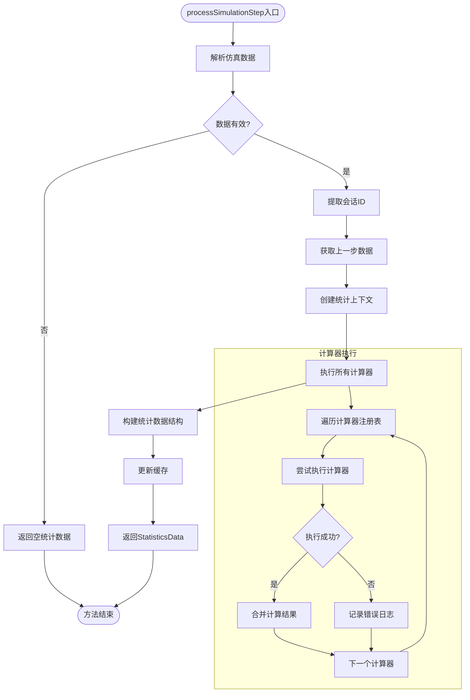
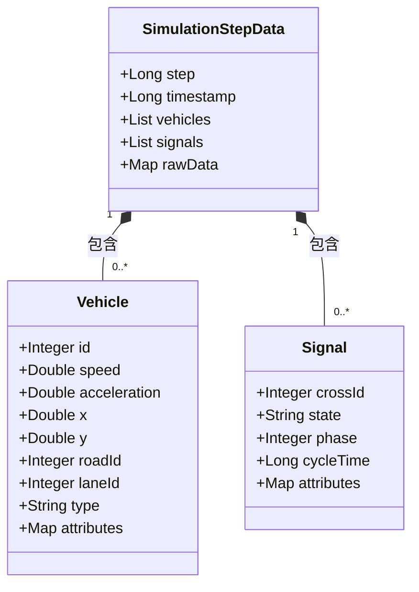
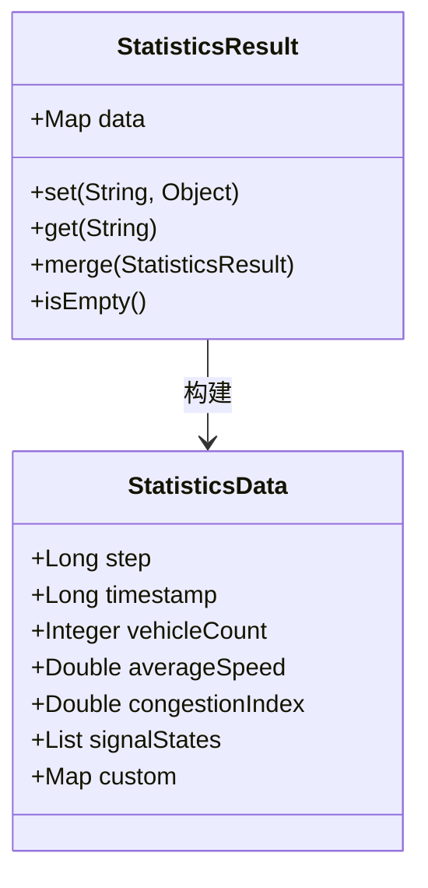
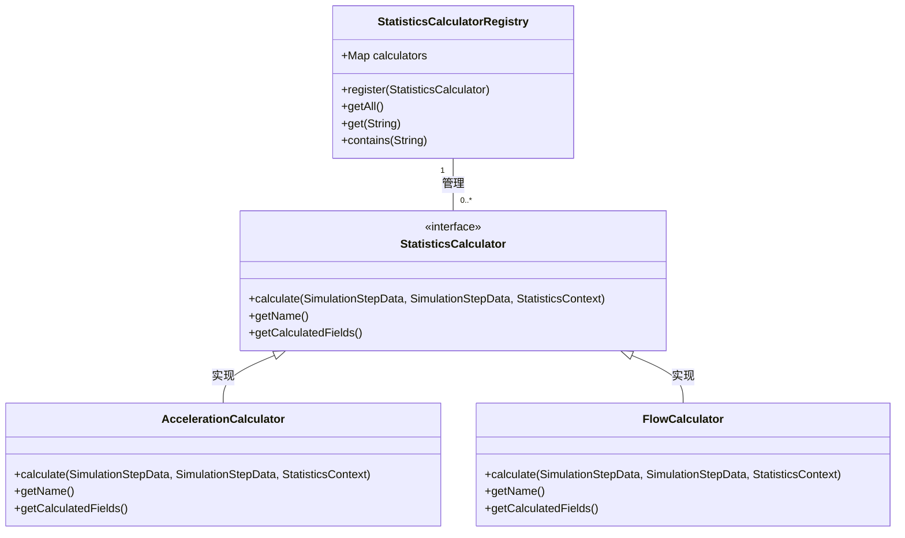
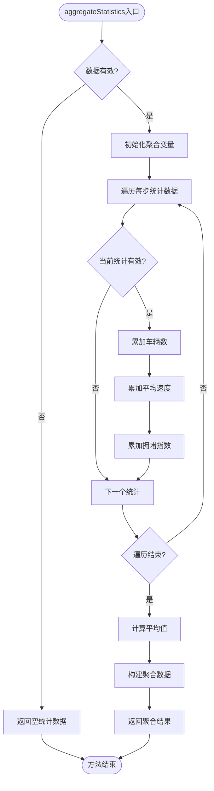
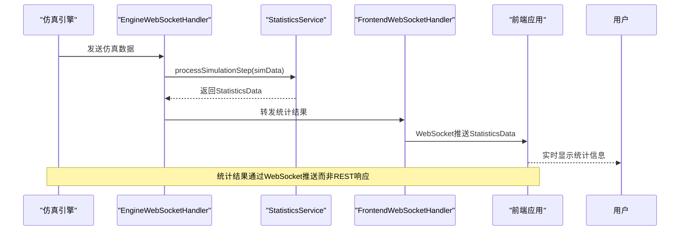
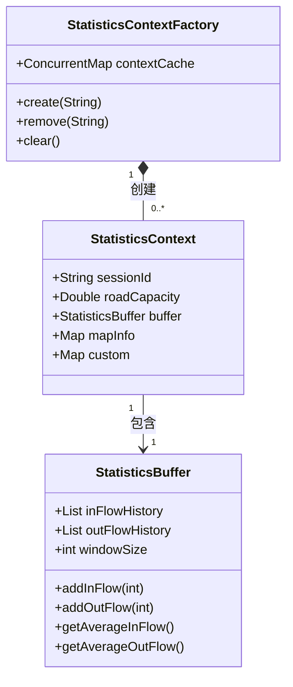

# 统计处理API

<cite>
**本文档引用的文件**   
- [StatisticsServiceImpl.java](file://plugins/plugin-statistics/src/main/java/com/traffic/sim/plugin/statistics/service/StatisticsServiceImpl.java)
- [SimulationStepData.java](file://plugins/plugin-statistics/src/main/java/com/traffic/sim/plugin/statistics/model/SimulationStepData.java)
- [StatisticsResult.java](file://plugins/plugin-statistics/src/main/java/com/traffic/sim/plugin/statistics/model/StatisticsResult.java)
- [StatisticsCalculatorRegistry.java](file://plugins/plugin-statistics/src/main/java/com/traffic/sim/plugin/statistics/calculator/StatisticsCalculatorRegistry.java)
- [StatisticsContextFactory.java](file://plugins/plugin-statistics/src/main/java/com/traffic/sim/plugin/statistics/service/StatisticsContextFactory.java)
- [AccelerationCalculator.java](file://plugins/plugin-statistics/src/main/java/com/traffic/sim/plugin/statistics/calculator/impl/AccelerationCalculator.java)
- [FlowCalculator.java](file://plugins/plugin-statistics/src/main/java/com/traffic/sim/plugin/statistics/calculator/impl/FlowCalculator.java)
- [SimulationDataParser.java](file://plugins/plugin-statistics/src/main/java/com/traffic/sim/plugin/statistics/parser/SimulationDataParser.java)
- [StatisticsContext.java](file://plugins/plugin-statistics/src/main/java/com/traffic/sim/plugin/statistics/model/StatisticsContext.java)
- [StatisticsBuffer.java](file://plugins/plugin-statistics/src/main/java/com/traffic/sim/plugin/statistics/model/StatisticsBuffer.java)
- [UnitConverter.java](file://plugins/plugin-statistics/src/main/java/com/traffic/sim/plugin/statistics/util/UnitConverter.java)
- [StatisticsService.java](file://traffic-sim-common/src/main/java/com/traffic/sim/common/service/StatisticsService.java)
- [StatisticsData.java](file://traffic-sim-common/src/main/java/com/traffic/sim/common/model/StatisticsData.java)
- [EngineWebSocketHandler.java](file://plugins/plugin-engine-manager/src/main/java/com/traffic/sim/plugin/engine/manager/websocket/EngineWebSocketHandler.java)
- [WebSocketHandlerConfig.java](file://plugins/plugin-engine-manager/src/main/java/com/traffic/sim/plugin/engine/manager/config/WebSocketHandlerConfig.java)
</cite>

## 目录
1. [简介](#简介)
2. [核心组件](#核心组件)
3. [数据处理流程](#数据处理流程)
4. [数据结构说明](#数据结构说明)
5. [计算器注册机制](#计算器注册机制)
6. [聚合算法](#聚合算法)
7. [WebSocket推送机制](#websocket推送机制)
8. [缓存设计](#缓存设计)
9. [输入输出示例](#输入输出示例)

## 简介
本文档详细描述了交通仿真系统中统计处理服务的核心功能。虽然StatisticsServiceImpl是服务类而非Controller，但其processSimulationStep和aggregateStatistics方法构成了统计功能的核心接口。文档将详细说明processSimulationStep方法如何接收仿真数据Map并输出StatisticsData，包括数据解析、上下文创建、计算器链执行和结果聚合的完整流程。

## 核心组件

**Section sources**
- [StatisticsServiceImpl.java](file://plugins/plugin-statistics/src/main/java/com/traffic/sim/plugin/statistics/service/StatisticsServiceImpl.java#L27-L195)
- [StatisticsService.java](file://traffic-sim-common/src/main/java/com/traffic/sim/common/service/StatisticsService.java#L14-L33)

## 数据处理流程



**Diagram sources **
- [StatisticsServiceImpl.java](file://plugins/plugin-statistics/src/main/java/com/traffic/sim/plugin/statistics/service/StatisticsServiceImpl.java#L37-L79)

## 数据结构说明

### 仿真步数据结构



**Diagram sources **
- [SimulationStepData.java](file://plugins/plugin-statistics/src/main/java/com/traffic/sim/plugin/statistics/model/SimulationStepData.java#L15-L71)

### 统计结果数据结构



**Diagram sources **
- [StatisticsResult.java](file://plugins/plugin-statistics/src/main/java/com/traffic/sim/plugin/statistics/model/StatisticsResult.java#L14-L56)
- [StatisticsData.java](file://traffic-sim-common/src/main/java/com/traffic/sim/common/model/StatisticsData.java#L15-L45)

## 计算器注册机制



**Diagram sources **
- [StatisticsCalculatorRegistry.java](file://plugins/plugin-statistics/src/main/java/com/traffic/sim/plugin/statistics/calculator/StatisticsCalculatorRegistry.java#L18-L54)
- [AccelerationCalculator.java](file://plugins/plugin-statistics/src/main/java/com/traffic/sim/plugin/statistics/calculator/impl/AccelerationCalculator.java#L20-L74)
- [FlowCalculator.java](file://plugins/plugin-statistics/src/main/java/com/traffic/sim/plugin/statistics/calculator/impl/FlowCalculator.java#L21-L114)

## 聚合算法



**Diagram sources **
- [StatisticsServiceImpl.java](file://plugins/plugin-statistics/src/main/java/com/traffic/sim/plugin/statistics/service/StatisticsServiceImpl.java#L83-L118)

## WebSocket推送机制



**Diagram sources **
- [EngineWebSocketHandler.java](file://plugins/plugin-engine-manager/src/main/java/com/traffic/sim/plugin/engine/manager/websocket/EngineWebSocketHandler.java#L68-L216)
- [WebSocketHandlerConfig.java](file://plugins/plugin-engine-manager/src/main/java/com/traffic/sim/plugin/engine/manager/config/WebSocketHandlerConfig.java#L28-L37)

## 缓存设计



**Diagram sources **
- [StatisticsContextFactory.java](file://plugins/plugin-statistics/src/main/java/com/traffic/sim/plugin/statistics/service/StatisticsContextFactory.java#L17-L49)
- [StatisticsContext.java](file://plugins/plugin-statistics/src/main/java/com/traffic/sim/plugin/statistics/model/StatisticsContext.java#L14-L47)
- [StatisticsBuffer.java](file://plugins/plugin-statistics/src/main/java/com/traffic/sim/plugin/statistics/model/StatisticsBuffer.java#L15-L87)

## 输入输出示例

### 仿真数据输入样例

```json
{
  "sessionId": "sim_001",
  "step": 10,
  "timestamp": 1700000000000,
  "vehicles": [
    {
      "id": 1,
      "speed": 15.5,
      "acceleration": 2.3,
      "x": 100.0,
      "y": 200.0,
      "roadId": 101,
      "laneId": 1,
      "type": "car"
    },
    {
      "id": 2,
      "speed": 0.0,
      "acceleration": -1.5,
      "x": 150.0,
      "y": 250.0,
      "roadId": 102,
      "laneId": 2,
      "type": "bus"
    }
  ],
  "signals": [
    {
      "crossId": 1,
      "state": "RED",
      "phase": 1,
      "cycleTime": 60
    }
  ]
}
```

### 对应统计输出

```json
{
  "step": 10,
  "timestamp": 1700000000000,
  "vehicleCount": 2,
  "averageSpeed": 7.75,
  "congestionIndex": 0.3,
  "custom": {
    "car_number": 2,
    "speed_ave": 7.75,
    "jam_index": 0.3,
    "acc_min": -1.5,
    "acc_max": 2.3,
    "acc_ave": 0.4,
    "flow_rd_ave": 72000,
    "flow_la_ave": 36000,
    "flow_cross_ave": 36000,
    "flow_details": {
      "roadFlow": {"101": 1, "102": 1},
      "laneFlow": {"101_1": 1, "102_2": 1},
      "crossFlow": {"1": 1}
    }
  }
}
```

**Section sources**
- [StatisticsServiceImpl.java](file://plugins/plugin-statistics/src/main/java/com/traffic/sim/plugin/statistics/service/StatisticsServiceImpl.java#L69-L74)
- [SimulationDataParser.java](file://plugins/plugin-statistics/src/main/java/com/traffic/sim/plugin/statistics/parser/SimulationDataParser.java#L24-L56)