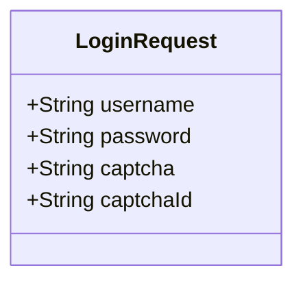
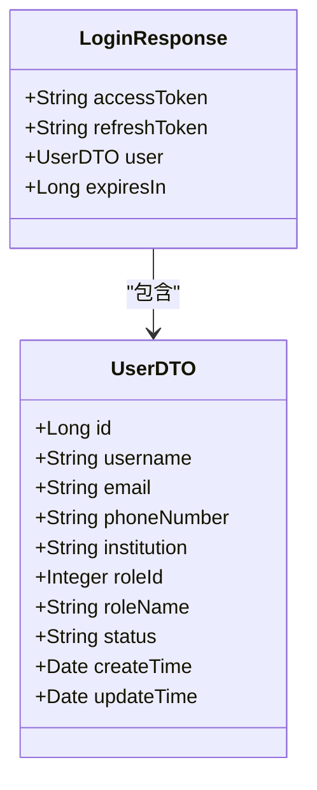
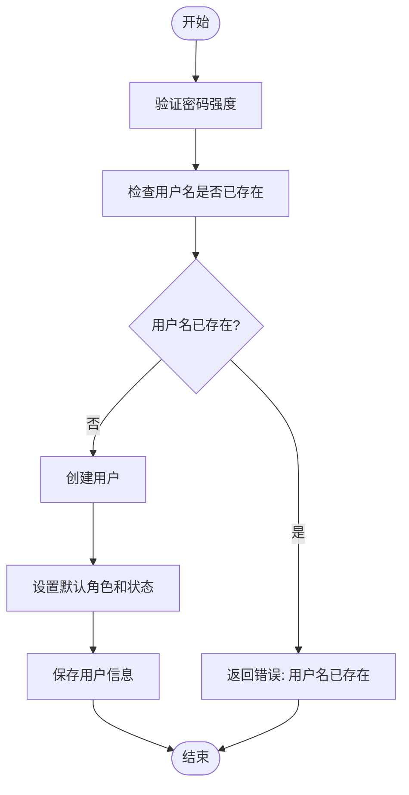
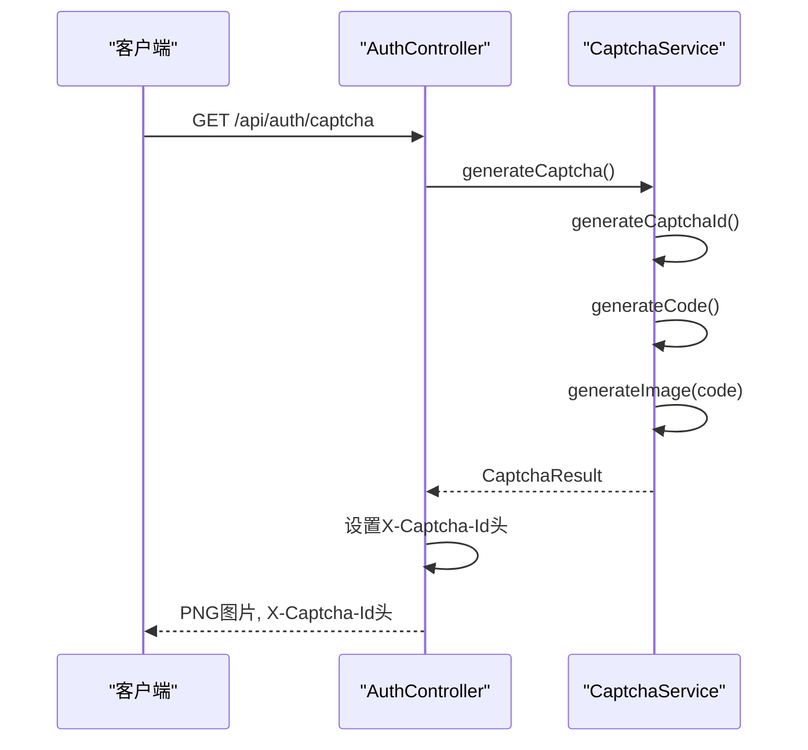
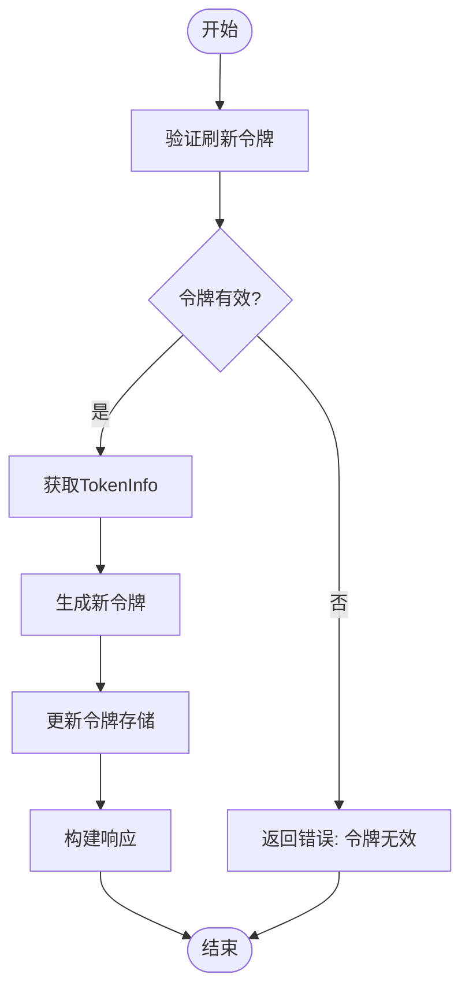
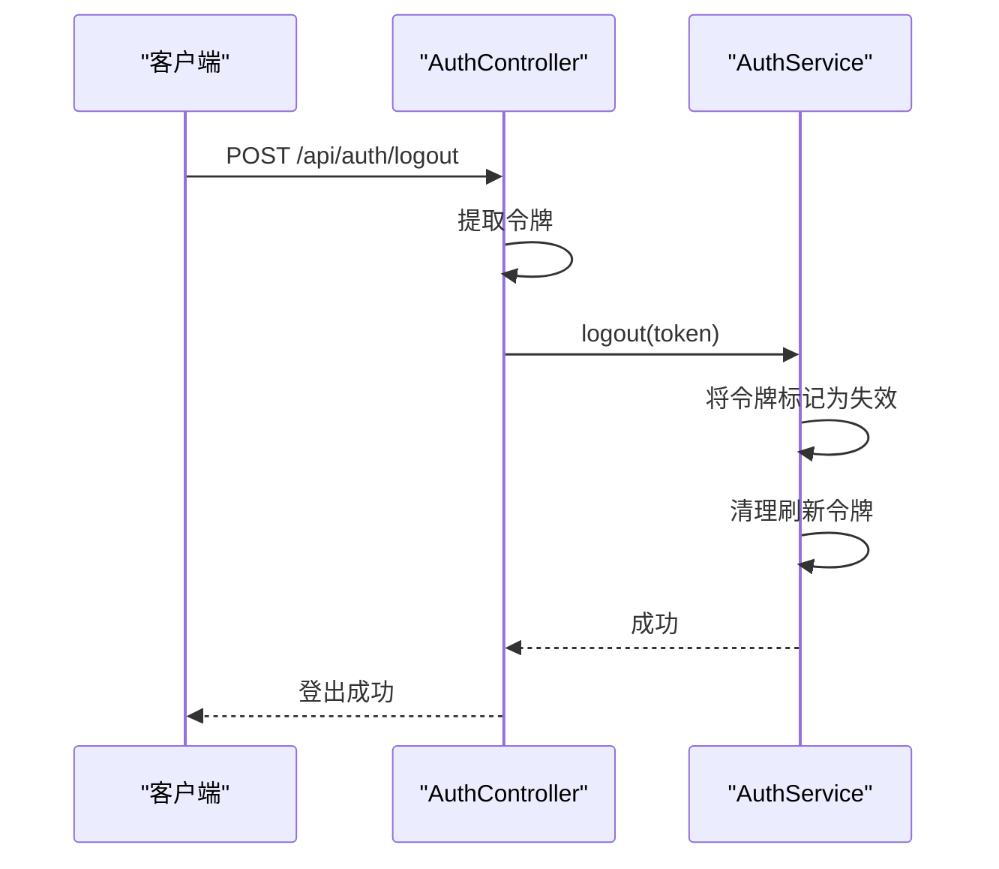
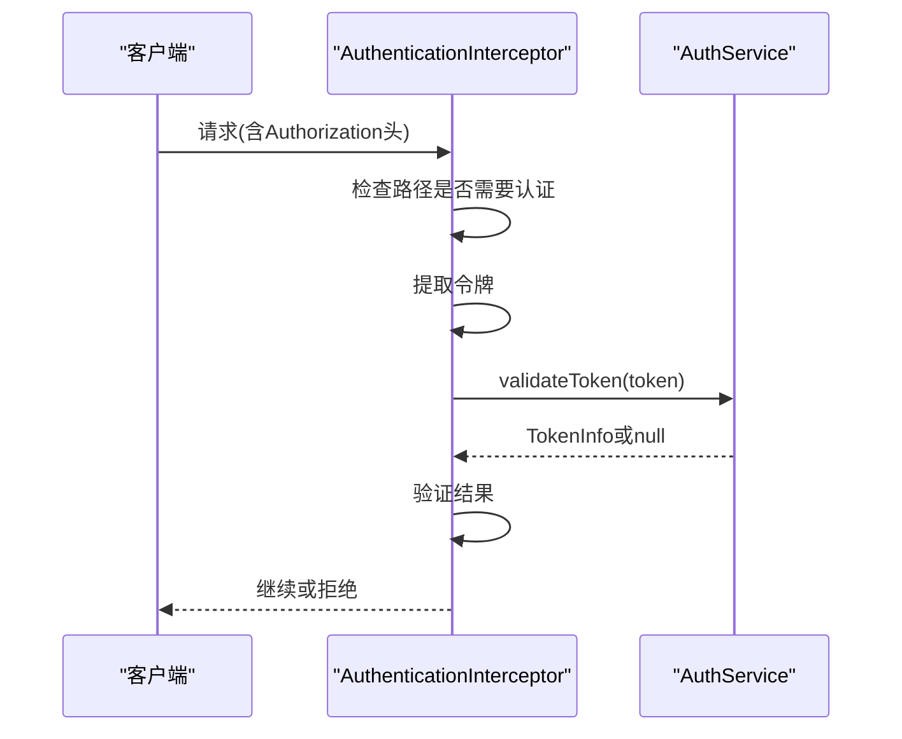
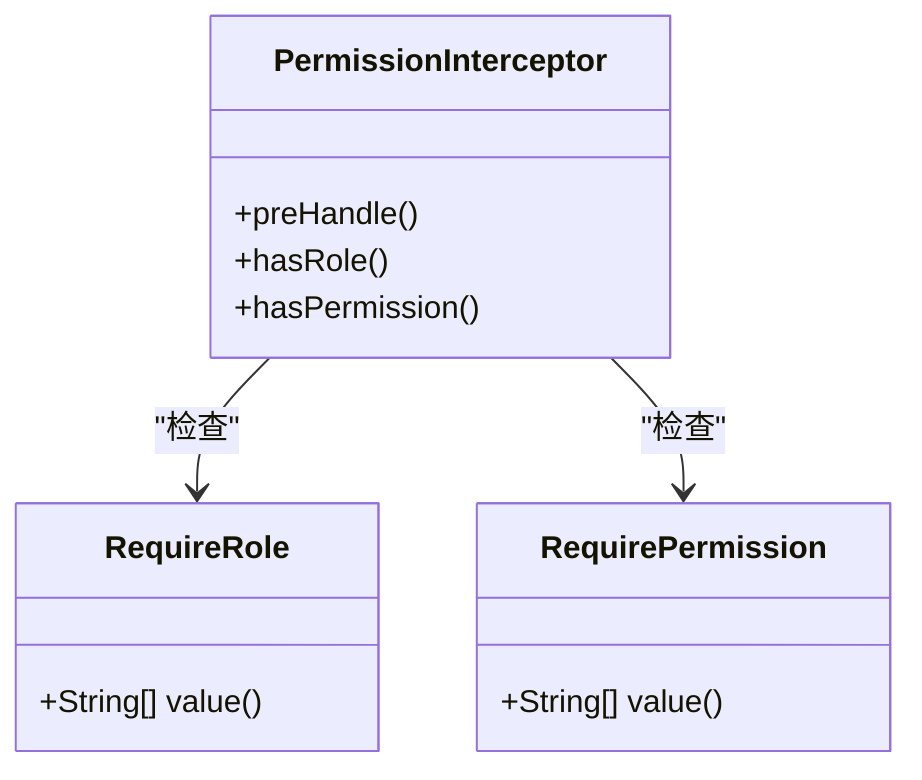
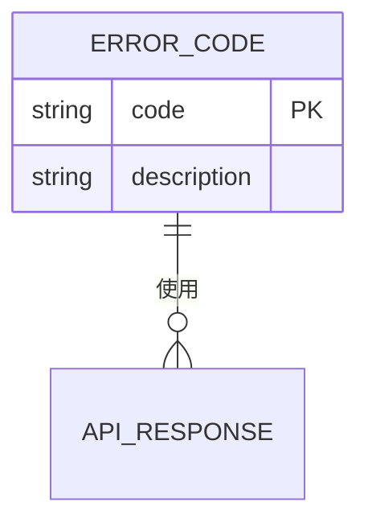

# 认证API

<cite>
**本文档引用的文件**
- [AuthController.java](file://plugins/plugin-auth/src/main/java/com/traffic/sim/plugin/auth/controller/AuthController.java)
- [LoginRequest.java](file://traffic-sim-common/src/main/java/com/traffic/sim/common/dto/LoginRequest.java)
- [LoginResponse.java](file://traffic-sim-common/src/main/java/com/traffic/sim/common/dto/LoginResponse.java)
- [RegisterRequest.java](file://traffic-sim-common/src/main/java/com/traffic/sim/common/dto/RegisterRequest.java)
- [CaptchaService.java](file://plugins/plugin-auth/src/main/java/com/traffic/sim/plugin/auth/service/CaptchaService.java)
- [JwtTokenService.java](file://plugins/plugin-auth/src/main/java/com/traffic/sim/plugin/auth/service/JwtTokenService.java)
- [AuthService.java](file://traffic-sim-common/src/main/java/com/traffic/sim/common/service/AuthService.java)
- [AuthServiceImpl.java](file://plugins/plugin-auth/src/main/java/com/traffic/sim/plugin/auth/service/AuthServiceImpl.java)
- [RequireRole.java](file://plugins/plugin-auth/src/main/java/com/traffic/sim/plugin/auth/annotation/RequireRole.java)
- [RequirePermission.java](file://plugins/plugin-auth/src/main/java/com/traffic/sim/plugin/auth/annotation/RequirePermission.java)
- [ErrorCode.java](file://traffic-sim-common/src/main/java/com/traffic/sim/common/constant/ErrorCode.java)
- [AuthenticationInterceptor.java](file://plugins/plugin-auth/src/main/java/com/traffic/sim/plugin/auth/interceptor/AuthenticationInterceptor.java)
- [PermissionInterceptor.java](file://plugins/plugin-auth/src/main/java/com/traffic/sim/plugin/auth/interceptor/PermissionInterceptor.java)
- [AuthPluginProperties.java](file://plugins/plugin-auth/src/main/java/com/traffic/sim/plugin/auth/config/AuthPluginProperties.java)
</cite>

## 目录
1. [简介](#简介)
2. [认证端点概览](#认证端点概览)
3. [登录接口](#登录接口)
4. [注册接口](#注册接口)
5. [验证码接口](#验证码接口)
6. [令牌刷新接口](#令牌刷新接口)
7. [登出接口](#登出接口)
8. [认证与权限控制](#认证与权限控制)
9. [错误码说明](#错误码说明)
10. [请求响应示例](#请求响应示例)

## 简介

本文档详细描述了交通仿真系统中的认证API，涵盖了用户认证、注册、令牌管理等核心功能。认证系统基于JWT（JSON Web Token）实现，提供了安全的用户身份验证机制。系统包含登录、注册、验证码生成、令牌刷新和登出等端点，所有需要认证的接口均使用`Authorization: Bearer <token>`头部进行身份验证。

认证系统通过拦截器实现权限控制，支持基于角色和权限的访问控制策略。`@RequireRole`和`@RequirePermission`注解用于标记需要特定角色或权限才能访问的方法或类。系统还实现了验证码机制，增强登录安全性，防止暴力破解攻击。

**本节来源**
- [AuthController.java](file://plugins/plugin-auth/src/main/java/com/traffic/sim/plugin/auth/controller/AuthController.java)
- [AuthenticationInterceptor.java](file://plugins/plugin-auth/src/main/java/com/traffic/sim/plugin/auth/interceptor/AuthenticationInterceptor.java)

## 认证端点概览

认证API提供了以下主要端点：

| 端点 | HTTP方法 | 描述 | 需要认证 |
|------|---------|------|---------|
| `/api/auth/login` | POST | 用户登录，返回JWT令牌 | 否 |
| `/api/auth/register` | POST | 用户注册新账户 | 否 |
| `/api/auth/captcha` | GET | 生成验证码图片 | 否 |
| `/api/auth/refresh` | POST | 使用刷新令牌获取新的访问令牌 | 否 |
| `/api/auth/logout` | POST | 登出当前用户，使令牌失效 | 是 |

**本节来源**
- [AuthController.java](file://plugins/plugin-auth/src/main/java/com/traffic/sim/plugin/auth/controller/AuthController.java)

## 登录接口

### 接口详情
- **URL**: `/api/auth/login`
- **HTTP方法**: POST
- **需要认证**: 否
- **描述**: 用户通过用户名和密码登录系统，返回JWT访问令牌和刷新令牌。

### 请求参数
请求体为JSON格式，包含以下字段：

```json
{
  "username": "string",
  "password": "string",
  "captcha": "string",
  "captchaId": "string"
}
```

| 字段 | 类型 | 必填 | 描述 |
|------|------|------|------|
| username | string | 是 | 用户名 |
| password | string | 是 | 密码 |
| captcha | string | 否 | 验证码 |
| captchaId | string | 否 | 验证码ID |

### 响应格式
成功响应返回200状态码，响应体包含`LoginResponse`对象：

```json
{
  "code": "ERR_OK",
  "message": "success",
  "data": {
    "accessToken": "string",
    "refreshToken": "string",
    "user": {
      "id": 1,
      "username": "string",
      "email": "string",
      "phoneNumber": "string",
      "institution": "string",
      "roleId": 1,
      "roleName": "string",
      "status": "string",
      "createTime": "2024-01-01T00:00:00",
      "updateTime": "2024-01-01T00:00:00"
    },
    "expiresIn": 3600
  }
}
```

### LoginRequest对象
`LoginRequest`对象定义了登录请求的数据结构，包含用户名、密码、验证码和验证码ID字段。其中用户名和密码为必填字段，验证码和验证码ID在验证码启用时为必填。



**图示来源**
- [LoginRequest.java](file://traffic-sim-common/src/main/java/com/traffic/sim/common/dto/LoginRequest.java)

### LoginResponse结构
`LoginResponse`对象包含访问令牌、刷新令牌、用户信息和令牌过期时间。



**图示来源**
- [LoginResponse.java](file://traffic-sim-common/src/main/java/com/traffic/sim/common/dto/LoginResponse.java)
- [UserDTO.java](file://traffic-sim-common/src/main/java/com/traffic/sim/common/dto/UserDTO.java)

**本节来源**
- [AuthController.java](file://plugins/plugin-auth/src/main/java/com/traffic/sim/plugin/auth/controller/AuthController.java)
- [LoginRequest.java](file://traffic-sim-common/src/main/java/com/traffic/sim/common/dto/LoginRequest.java)
- [LoginResponse.java](file://traffic-sim-common/src/main/java/com/traffic/sim/common/dto/LoginResponse.java)
- [AuthServiceImpl.java](file://plugins/plugin-auth/src/main/java/com/traffic/sim/plugin/auth/service/AuthServiceImpl.java)

## 注册接口

### 接口详情
- **URL**: `/api/auth/register`
- **HTTP方法**: POST
- **需要认证**: 否
- **描述**: 注册新用户账户。

### 请求参数
请求体为JSON格式，包含以下字段：

```json
{
  "username": "string",
  "password": "string",
  "email": "string",
  "phoneNumber": "string",
  "institution": "string"
}
```

| 字段 | 类型 | 必填 | 描述 |
|------|------|------|------|
| username | string | 是 | 用户名 |
| password | string | 是 | 密码 |
| email | string | 否 | 邮箱 |
| phoneNumber | string | 否 | 电话号码 |
| institution | string | 否 | 机构 |

### 用户注册流程
1. 系统验证密码强度，根据配置要求检查密码是否包含大写字母、小写字母、数字和特殊字符。
2. 检查用户名是否已存在，如果已存在则返回错误。
3. 创建用户DTO对象，设置默认角色和状态。
4. 调用用户服务创建新用户。

### 响应格式
成功响应返回200状态码，响应体如下：

```json
{
  "code": "ERR_OK",
  "message": "success",
  "data": "注册成功"
}
```



**图示来源**
- [RegisterRequest.java](file://traffic-sim-common/src/main/java/com/traffic/sim/common/dto/RegisterRequest.java)
- [AuthServiceImpl.java](file://plugins/plugin-auth/src/main/java/com/traffic/sim/plugin/auth/service/AuthServiceImpl.java)

**本节来源**
- [AuthController.java](file://plugins/plugin-auth/src/main/java/com/traffic/sim/plugin/auth/controller/AuthController.java)
- [RegisterRequest.java](file://traffic-sim-common/src/main/java/com/traffic/sim/common/dto/RegisterRequest.java)
- [AuthServiceImpl.java](file://plugins/plugin-auth/src/main/java/com/traffic/sim/plugin/auth/service/AuthServiceImpl.java)

## 验证码接口

### 接口详情
- **URL**: `/api/auth/captcha`
- **HTTP方法**: GET
- **需要认证**: 否
- **描述**: 生成验证码图片并返回。

### 响应格式
成功响应返回200状态码，响应体为PNG格式的图片数据。响应头包含`X-Captcha-Id`，用于后续验证。

| 响应头 | 值 | 描述 |
|--------|----|------|
| Content-Type | image/png | 响应内容类型 |
| X-Captcha-Id | string | 验证码ID，用于验证 |

### 验证码生成机制
系统生成随机验证码字符串，创建对应的PNG图片，并将验证码值和过期时间存储在内存中。验证码ID采用时间戳加随机数的方式生成，确保唯一性。



**图示来源**
- [CaptchaService.java](file://plugins/plugin-auth/src/main/java/com/traffic/sim/plugin/auth/service/CaptchaService.java)
- [AuthController.java](file://plugins/plugin-auth/src/main/java/com/traffic/sim/plugin/auth/controller/AuthController.java)

**本节来源**
- [AuthController.java](file://plugins/plugin-auth/src/main/java/com/traffic/sim/plugin/auth/controller/AuthController.java)
- [CaptchaService.java](file://plugins/plugin-auth/src/main/java/com/traffic/sim/plugin/auth/service/CaptchaService.java)

## 令牌刷新接口

### 接口详情
- **URL**: `/api/auth/refresh`
- **HTTP方法**: POST
- **需要认证**: 否
- **描述**: 使用刷新令牌获取新的访问令牌。

### 请求参数
请求体为JSON格式，包含刷新令牌：

```json
{
  "refreshToken": "string"
}
```

| 字段 | 类型 | 必填 | 描述 |
|------|------|------|------|
| refreshToken | string | 是 | 刷新令牌 |

### 令牌刷新机制
1. 系统验证刷新令牌的有效性。
2. 从存储中获取原始的TokenInfo。
3. 生成新的访问令牌和刷新令牌。
4. 更新刷新令牌存储，移除旧的刷新令牌，添加新的刷新令牌。
5. 返回包含新令牌的LoginResponse对象。



**图示来源**
- [AuthServiceImpl.java](file://plugins/plugin-auth/src/main/java/com/traffic/sim/plugin/auth/service/AuthServiceImpl.java)
- [JwtTokenService.java](file://plugins/plugin-auth/src/main/java/com/traffic/sim/plugin/auth/service/JwtTokenService.java)

**本节来源**
- [AuthController.java](file://plugins/plugin-auth/src/main/java/com/traffic/sim/plugin/auth/controller/AuthController.java)
- [AuthServiceImpl.java](file://plugins/plugin-auth/src/main/java/com/traffic/sim/plugin/auth/service/AuthServiceImpl.java)
- [JwtTokenService.java](file://plugins/plugin-auth/src/main/java/com/traffic/sim/plugin/auth/service/JwtTokenService.java)

## 登出接口

### 接口详情
- **URL**: `/api/auth/logout`
- **HTTP方法**: POST
- **需要认证**: 是
- **描述**: 登出当前用户，使当前令牌失效。

### 请求参数
请求头包含Authorization：

| 请求头 | 值 | 描述 |
|--------|----|------|
| Authorization | Bearer <token> | 访问令牌 |

### 安全实现
系统将登出用户的令牌添加到失效令牌存储中，后续使用该令牌的请求将被拒绝。同时，系统会清理相关的刷新令牌。



**图示来源**
- [AuthServiceImpl.java](file://plugins/plugin-auth/src/main/java/com/traffic/sim/plugin/auth/service/AuthServiceImpl.java)
- [AuthController.java](file://plugins/plugin-auth/src/main/java/com/traffic/sim/plugin/auth/controller/AuthController.java)

**本节来源**
- [AuthController.java](file://plugins/plugin-auth/src/main/java/com/traffic/sim/plugin/auth/controller/AuthController.java)
- [AuthServiceImpl.java](file://plugins/plugin-auth/src/main/java/com/traffic/sim/plugin/auth/service/AuthServiceImpl.java)

## 认证与权限控制

### 认证机制
所有需要认证的接口均使用`Authorization: Bearer <token>`头部进行身份验证。系统通过`AuthenticationInterceptor`拦截器验证JWT令牌的有效性。



**图示来源**
- [AuthenticationInterceptor.java](file://plugins/plugin-auth/src/main/java/com/traffic/sim/plugin/auth/interceptor/AuthenticationInterceptor.java)
- [AuthService.java](file://traffic-sim-common/src/main/java/com/traffic/sim/common/service/AuthService.java)

### 权限控制策略
系统使用`@RequireRole`和`@RequirePermission`注解实现细粒度的权限控制。

- `@RequireRole`: 指定需要的角色才能访问
- `@RequirePermission`: 指定需要的权限才能访问

权限拦截器`PermissionInterceptor`在请求处理前检查这些注解，并验证用户是否具有相应的角色或权限。



**图示来源**
- [RequireRole.java](file://plugins/plugin-auth/src/main/java/com/traffic/sim/plugin/auth/annotation/RequireRole.java)
- [RequirePermission.java](file://plugins/plugin-auth/src/main/java/com/traffic/sim/plugin/auth/annotation/RequirePermission.java)
- [PermissionInterceptor.java](file://plugins/plugin-auth/src/main/java/com/traffic/sim/plugin/auth/interceptor/PermissionInterceptor.java)

**本节来源**
- [AuthenticationInterceptor.java](file://plugins/plugin-auth/src/main/java/com/traffic/sim/plugin/auth/interceptor/AuthenticationInterceptor.java)
- [PermissionInterceptor.java](file://plugins/plugin-auth/src/main/java/com/traffic/sim/plugin/auth/interceptor/PermissionInterceptor.java)
- [RequireRole.java](file://plugins/plugin-auth/src/main/java/com/traffic/sim/plugin/auth/annotation/RequireRole.java)
- [RequirePermission.java](file://plugins/plugin-auth/src/main/java/com/traffic/sim/plugin/auth/annotation/RequirePermission.java)

## 错误码说明

系统定义了统一的错误码，用于标识不同类型的错误。



| 错误码 | 描述 | 说明 |
|--------|------|------|
| ERR_OK | 成功 | 操作成功 |
| ERR_AUTH | 认证失败 | 认证相关错误，如用户名密码错误、令牌无效等 |
| ERR_ARG | 参数错误 | 请求参数错误或缺失 |
| ERR_EXIST | 资源已存在 | 如用户名已存在 |
| ERR_NOT_FOUND | 资源不存在 | 请求的资源不存在 |
| ERR_CREATE | 创建失败 | 资源创建失败 |
| ERR_UPDATE | 更新失败 | 资源更新失败 |
| ERR_DELETE | 删除失败 | 资源删除失败 |
| ERR_ENGINE | 引擎未初始化 | 仿真引擎未初始化 |
| ERR_UNKNOWN | 未知错误 | 未知错误 |
| ERR_INTERNAL | 服务器内部错误 | 服务器内部错误 |
| ERR_PERMISSION | 权限不足 | 用户权限不足 |
| ERR_FORBIDDEN | 操作不允许 | 操作被禁止 |

**本节来源**
- [ErrorCode.java](file://traffic-sim-common/src/main/java/com/traffic/sim/common/constant/ErrorCode.java)

## 请求响应示例

### 成功场景

**登录成功响应**
```json
{
  "code": "ERR_OK",
  "message": "success",
  "data": {
    "accessToken": "eyJhbGciOiJIUzI1NiIsInR5cCI6IkpXVCJ9...",
    "refreshToken": "eyJhbGciOiJIUzI1NiIsInR5cCI6IkpXVCJ9...",
    "user": {
      "id": 1,
      "username": "admin",
      "email": "admin@example.com",
      "phoneNumber": "13800138000",
      "institution": "交通管理局",
      "roleId": 1,
      "roleName": "ADMIN",
      "status": "ACTIVE",
      "createTime": "2024-01-01T00:00:00",
      "updateTime": "2024-01-01T00:00:00"
    },
    "expiresIn": 3600
  }
}
```

**注册成功响应**
```json
{
  "code": "ERR_OK",
  "message": "success",
  "data": "注册成功"
}
```

### 错误场景

**登录失败 - 用户名密码错误**
```json
{
  "code": "ERR_AUTH",
  "message": "用户名或密码错误",
  "data": null
}
```

**登录失败 - 验证码错误**
```json
{
  "code": "ERR_AUTH",
  "message": "验证码错误或已过期",
  "data": null
}
```

**注册失败 - 用户名已存在**
```json
{
  "code": "ERR_EXIST",
  "message": "用户名已存在",
  "data": null
}
```

**权限不足**
```json
{
  "code": "ERR_PERMISSION",
  "message": "权限不足",
  "data": null
}
```

**本节来源**
- [AuthController.java](file://plugins/plugin-auth/src/main/java/com/traffic/sim/plugin/auth/controller/AuthController.java)
- [ErrorCode.java](file://traffic-sim-common/src/main/java/com/traffic/sim/common/constant/ErrorCode.java)
- [AuthServiceImpl.java](file://plugins/plugin-auth/src/main/java/com/traffic/sim/plugin/auth/service/AuthServiceImpl.java)