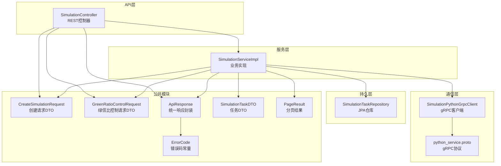
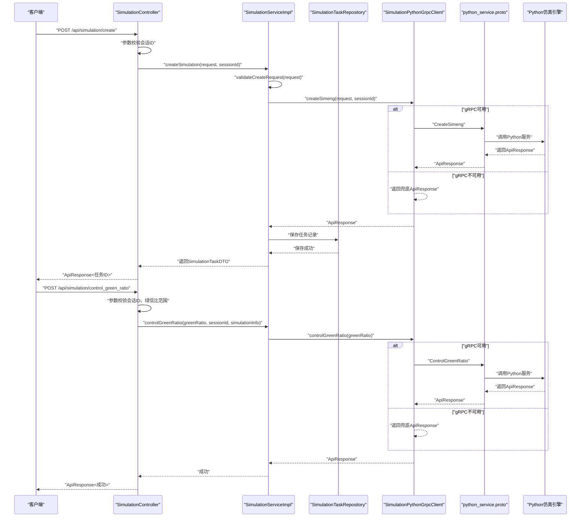
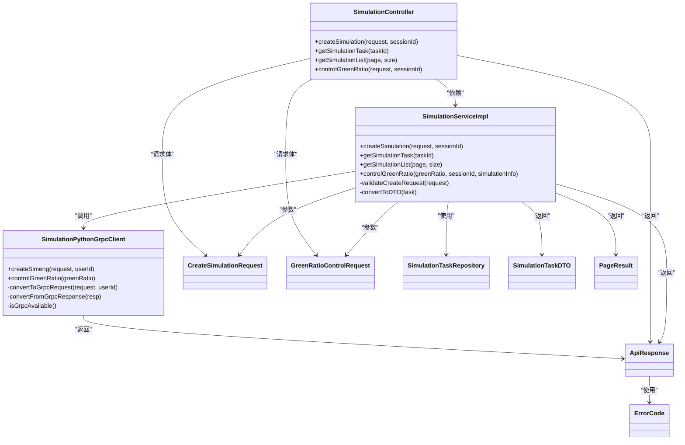

# API控制接口

<cite>
**本文档引用的文件**
- [SimulationController.java](file://plugins/plugin-simulation/src/main/java/com/traffic/sim/plugin/simulation/controller/SimulationController.java)
- [SimulationServiceImpl.java](file://plugins/plugin-simulation/src/main/java/com/traffic/sim/plugin/simulation/service/SimulationServiceImpl.java)
- [SimulationPythonGrpcClient.java](file://plugins/plugin-simulation/src/main/java/com/traffic/sim/plugin/simulation/grpc/SimulationPythonGrpcClient.java)
- [CreateSimulationRequest.java](file://traffic-sim-common/src/main/java/com/traffic/sim/common/dto/CreateSimulationRequest.java)
- [GreenRatioControlRequest.java](file://traffic-sim-common/src/main/java/com/traffic/sim/common/dto/GreenRatioControlRequest.java)
- [ApiResponse.java](file://traffic-sim-common/src/main/java/com/traffic/sim/common/response/ApiResponse.java)
- [ErrorCode.java](file://traffic-sim-common/src/main/java/com/traffic/sim/common/constant/ErrorCode.java)
- [python_service.proto](file://plugins/plugin-simulation/src/main/proto/python_service.proto)
- [application.yml](file://traffic-sim-server/src/main/resources/application.yml)
- [BusinessException.java](file://traffic-sim-common/src/main/java/com/traffic/sim/common/exception/BusinessException.java)
- [SimulationTaskDTO.java](file://traffic-sim-common/src/main/java/com/traffic/sim/common/dto/SimulationTaskDTO.java)
- [PageResult.java](file://traffic-sim-common/src/main/java/com/traffic/sim/common/response/PageResult.java)
- [SimulationTaskRepository.java](file://plugins/plugin-simulation/src/main/java/com/traffic/sim/plugin/simulation/repository/SimulationTaskRepository.java)
</cite>

## 目录
1. [简介](#简介)
2. [项目结构](#项目结构)
3. [核心组件](#核心组件)
4. [架构总览](#架构总览)
5. [详细接口文档](#详细接口文档)
6. [依赖关系分析](#依赖关系分析)
7. [性能考虑](#性能考虑)
8. [故障排查指南](#故障排查指南)
9. [结论](#结论)

## 简介
本文件面向仿真引擎API控制接口，聚焦于`SimulationController`暴露的REST端点，包括：
- 创建仿真任务（POST /api/simulation/create）
- 获取任务详情（GET /api/simulation/{taskId}）
- 查询任务列表（GET /api/simulation/list）
- 绿信比控制（POST /api/simulation/control_green_ratio）

文档详细说明每个接口的HTTP方法、URL路径、请求参数、认证方式（Cookie会话ID）、请求体结构（基于`CreateSimulationRequest`和`GreenRatioControlRequest`）及响应格式（统一使用`ApiResponse`封装）。结合`SimulationServiceImpl`中的业务逻辑，解释控制指令如何从API层传递至gRPC客户端并与Python仿真引擎交互。提供完整的curl示例和JSON请求体模板，帮助开发者快速集成。同时涵盖常见错误码（如400参数错误、404任务不存在、500引擎异常）的含义与处理建议。

## 项目结构
该模块位于Spring Boot工程中，采用多插件架构，仿真相关功能集中在`plugin-simulation`中，公共模型与响应封装在`traffic-sim-common`中，gRPC协议定义在`proto`文件中。

图表来源
- [SimulationController.java](file://plugins/plugin-simulation/src/main/java/com/traffic/sim/plugin/simulation/controller/SimulationController.java#L25-L134)
- [SimulationServiceImpl.java](file://plugins/plugin-simulation/src/main/java/com/traffic/sim/plugin/simulation/service/SimulationServiceImpl.java#L34-L191)
- [SimulationPythonGrpcClient.java](file://plugins/plugin-simulation/src/main/java/com/traffic/sim/plugin/simulation/grpc/SimulationPythonGrpcClient.java#L35-L264)
- [CreateSimulationRequest.java](file://traffic-sim-common/src/main/java/com/traffic/sim/common/dto/CreateSimulationRequest.java#L14-L134)
- [GreenRatioControlRequest.java](file://traffic-sim-common/src/main/java/com/traffic/sim/common/dto/GreenRatioControlRequest.java#L16-L31)
- [ApiResponse.java](file://traffic-sim-common/src/main/java/com/traffic/sim/common/response/ApiResponse.java#L14-L85)
- [ErrorCode.java](file://traffic-sim-common/src/main/java/com/traffic/sim/common/constant/ErrorCode.java#L8-L54)
- [python_service.proto](file://plugins/plugin-simulation/src/main/proto/python_service.proto#L9-L82)
- [SimulationTaskDTO.java](file://traffic-sim-common/src/main/java/com/traffic/sim/common/dto/SimulationTaskDTO.java#L13-L46)
- [PageResult.java](file://traffic-sim-common/src/main/java/com/traffic/sim/common/response/PageResult.java#L16-L47)
- [SimulationTaskRepository.java](file://plugins/plugin-simulation/src/main/java/com/traffic/sim/plugin/simulation/repository/SimulationTaskRepository.java#L16-L38)

章节来源
- [SimulationController.java](file://plugins/plugin-simulation/src/main/java/com/traffic/sim/plugin/simulation/controller/SimulationController.java#L25-L134)
- [application.yml](file://traffic-sim-server/src/main/resources/application.yml#L48-L81)

## 核心组件
- SimulationController：暴露REST端点，负责接收请求、参数校验、调用服务层并返回统一响应。
- SimulationServiceImpl：实现业务逻辑，包括创建仿真任务、查询任务列表/详情、绿信比控制，并通过gRPC客户端与Python仿真引擎交互。
- SimulationPythonGrpcClient：gRPC客户端，负责将Java对象转换为gRPC请求，调用Python服务，并将响应转换回统一响应格式；具备容错能力，gRPC不可用时返回兜底数据。
- CreateSimulationRequest/GreenRatioControlRequest：请求DTO，定义请求体结构与验证规则。
- ApiResponse：统一响应封装，包含响应码、消息、数据与时间戳。
- ErrorCode：错误码常量定义，用于标识不同类型的错误。
- python_service.proto：gRPC协议定义，包含CreateSimeng与ControlGreenRatio两个RPC方法。
- SimulationTaskRepository：JPA仓库，提供任务的持久化查询能力。
- SimulationTaskDTO/PageResult：数据传输对象与分页结果封装。

章节来源
- [SimulationController.java](file://plugins/plugin-simulation/src/main/java/com/traffic/sim/plugin/simulation/controller/SimulationController.java#L30-L134)
- [SimulationServiceImpl.java](file://plugins/plugin-simulation/src/main/java/com/traffic/sim/plugin/simulation/service/SimulationServiceImpl.java#L34-L191)
- [SimulationPythonGrpcClient.java](file://plugins/plugin-simulation/src/main/java/com/traffic/sim/plugin/simulation/grpc/SimulationPythonGrpcClient.java#L35-L264)
- [CreateSimulationRequest.java](file://traffic-sim-common/src/main/java/com/traffic/sim/common/dto/CreateSimulationRequest.java#L14-L134)
- [GreenRatioControlRequest.java](file://traffic-sim-common/src/main/java/com/traffic/sim/common/dto/GreenRatioControlRequest.java#L16-L31)
- [ApiResponse.java](file://traffic-sim-common/src/main/java/com/traffic/sim/common/response/ApiResponse.java#L14-L85)
- [ErrorCode.java](file://traffic-sim-common/src/main/java/com/traffic/sim/common/constant/ErrorCode.java#L8-L54)
- [python_service.proto](file://plugins/plugin-simulation/src/main/proto/python_service.proto#L9-L82)
- [SimulationTaskRepository.java](file://plugins/plugin-simulation/src/main/java/com/traffic/sim/plugin/simulation/repository/SimulationTaskRepository.java#L16-L38)
- [SimulationTaskDTO.java](file://traffic-sim-common/src/main/java/com/traffic/sim/common/dto/SimulationTaskDTO.java#L13-L46)
- [PageResult.java](file://traffic-sim-common/src/main/java/com/traffic/sim/common/response/PageResult.java#L16-L47)

## 架构总览
下图展示了从API到gRPC再到Python仿真引擎的整体流程，以及容错机制。

图表来源
- [SimulationController.java](file://plugins/plugin-simulation/src/main/java/com/traffic/sim/plugin/simulation/controller/SimulationController.java#L37-L131)
- [SimulationServiceImpl.java](file://plugins/plugin-simulation/src/main/java/com/traffic/sim/plugin/simulation/service/SimulationServiceImpl.java#L42-L144)
- [SimulationPythonGrpcClient.java](file://plugins/plugin-simulation/src/main/java/com/traffic/sim/plugin/simulation/grpc/SimulationPythonGrpcClient.java#L102-L157)
- [python_service.proto](file://plugins/plugin-simulation/src/main/proto/python_service.proto#L9-L19)

## 详细接口文档

### 接口概览
- 基础路径：/api/simulation
- 认证方式：Cookie会话ID（键名为id）
- 统一响应：ApiResponse，包含res、msg、data、timestamp
- 错误码：ErrorCode常量定义

章节来源
- [SimulationController.java](file://plugins/plugin-simulation/src/main/java/com/traffic/sim/plugin/simulation/controller/SimulationController.java#L25-L134)
- [ApiResponse.java](file://traffic-sim-common/src/main/java/com/traffic/sim/common/response/ApiResponse.java#L14-L85)
- [ErrorCode.java](file://traffic-sim-common/src/main/java/com/traffic/sim/common/constant/ErrorCode.java#L8-L54)

### 1) 创建仿真任务
- 方法：POST
- 路径：/api/simulation/create
- 认证：需要Cookie会话ID（id）
- 请求体：CreateSimulationRequest
- 响应：ApiResponse<String>（data为任务ID）

请求体结构（CreateSimulationRequest）
- name：仿真名称（必填）
- mapXmlName：地图XML文件名（必填）
- mapXmlPath：地图XML文件路径（必填）
- simInfo：仿真配置信息（必填）
  - name：仿真名称
  - mapXmlName：地图XML文件名
  - mapXmlPath：地图XML文件路径
  - fixedOd：固定OD矩阵配置（可选）
    - od：起点OD列表（可选）
      - originId：起点ID
      - dist：目的地列表（可选）
        - destId：目的地ID
        - rate：流量比例
    - sg：信号灯组配置（可选）
      - crossId：路口ID
      - cycleTime：周期时间
      - ewStraight：东西直行时间
      - snStraight：南北直行时间
      - snLeft：南北左转时间
- controlViews：控制视图列表（可选）
  - usePlugin：是否使用插件
  - activePlugin：激活的插件名称

请求体校验规则
- name非空
- simInfo非空
- simInfo.mapXmlName与simInfo.mapXmlPath非空
- 其他字段按DTO定义进行校验

响应说明
- 成功：ApiResponse.success(data=任务ID)
- 失败：ApiResponse.error(错误码, 消息)

章节来源
- [SimulationController.java](file://plugins/plugin-simulation/src/main/java/com/traffic/sim/plugin/simulation/controller/SimulationController.java#L37-L60)
- [SimulationServiceImpl.java](file://plugins/plugin-simulation/src/main/java/com/traffic/sim/plugin/simulation/service/SimulationServiceImpl.java#L42-L90)
- [CreateSimulationRequest.java](file://traffic-sim-common/src/main/java/com/traffic/sim/common/dto/CreateSimulationRequest.java#L14-L134)
- [ApiResponse.java](file://traffic-sim-common/src/main/java/com/traffic/sim/common/response/ApiResponse.java#L42-L75)

### 2) 获取仿真任务详情
- 方法：GET
- 路径：/api/simulation/{taskId}
- 认证：需要Cookie会话ID（id）
- 路径参数：taskId（任务ID）
- 响应：ApiResponse<SimulationTaskDTO>

响应说明
- 成功：ApiResponse.success(data=SimulationTaskDTO)
- 失败：ApiResponse.error(错误码, 消息)

章节来源
- [SimulationController.java](file://plugins/plugin-simulation/src/main/java/com/traffic/sim/plugin/simulation/controller/SimulationController.java#L84-L97)
- [SimulationServiceImpl.java](file://plugins/plugin-simulation/src/main/java/com/traffic/sim/plugin/simulation/service/SimulationServiceImpl.java#L92-L99)
- [SimulationTaskDTO.java](file://traffic-sim-common/src/main/java/com/traffic/sim/common/dto/SimulationTaskDTO.java#L13-L46)

### 3) 查询仿真任务列表
- 方法：GET
- 路径：/api/simulation/list
- 认证：需要Cookie会话ID（id）
- 查询参数：
  - page：页码，默认1
  - size：每页大小，默认10
- 响应：ApiResponse<PageResult<SimulationTaskDTO>>

响应说明
- 成功：ApiResponse.success(data=PageResult<SimulationTaskDTO>)
- 失败：ApiResponse.error(错误码, 消息)

章节来源
- [SimulationController.java](file://plugins/plugin-simulation/src/main/java/com/traffic/sim/plugin/simulation/controller/SimulationController.java#L65-L79)
- [SimulationServiceImpl.java](file://plugins/plugin-simulation/src/main/java/com/traffic/sim/plugin/simulation/service/SimulationServiceImpl.java#L101-L116)
- [PageResult.java](file://traffic-sim-common/src/main/java/com/traffic/sim/common/response/PageResult.java#L16-L47)
- [SimulationTaskRepository.java](file://plugins/plugin-simulation/src/main/java/com/traffic/sim/plugin/simulation/repository/SimulationTaskRepository.java#L16-L38)

### 4) 绿信比控制
- 方法：POST
- 路径：/api/simulation/control_green_ratio
- 认证：需要Cookie会话ID（id）
- 请求体：GreenRatioControlRequest
  - greenRatio：绿信比值（必填，0-100）
  - simulationInfo：仿真信息（可选，用于日志记录）
- 响应：ApiResponse<String>

请求体校验规则
- greenRatio必须在0-100范围内
- 其他字段按DTO定义进行校验

响应说明
- 成功：ApiResponse.success("Green ratio updated successfully")
- 失败：ApiResponse.error(错误码, 消息)

章节来源
- [SimulationController.java](file://plugins/plugin-simulation/src/main/java/com/traffic/sim/plugin/simulation/controller/SimulationController.java#L102-L131)
- [SimulationServiceImpl.java](file://plugins/plugin-simulation/src/main/java/com/traffic/sim/plugin/simulation/service/SimulationServiceImpl.java#L118-L144)
- [GreenRatioControlRequest.java](file://traffic-sim-common/src/main/java/com/traffic/sim/common/dto/GreenRatioControlRequest.java#L16-L31)
- [ApiResponse.java](file://traffic-sim-common/src/main/java/com/traffic/sim/common/response/ApiResponse.java#L42-L75)

### 统一响应格式
- res：响应码（参考ErrorCode）
- msg：响应消息
- data：响应数据（可能为任务ID、任务DTO、分页结果或兜底数据）
- timestamp：时间戳

章节来源
- [ApiResponse.java](file://traffic-sim-common/src/main/java/com/traffic/sim/common/response/ApiResponse.java#L14-L85)
- [ErrorCode.java](file://traffic-sim-common/src/main/java/com/traffic/sim/common/constant/ErrorCode.java#L8-L54)

### gRPC交互与容错机制
- gRPC客户端配置：地址localhost:50051，支持keep-alive
- 容错策略：当gRPC不可用时，返回ERR_OK但携带提示信息的兜底响应
- CreateSimeng：将CreateSimulationRequest转换为gRPC请求，调用Python服务
- ControlGreenRatio：将绿信比值封装为gRPC请求，调用Python服务

章节来源
- [SimulationPythonGrpcClient.java](file://plugins/plugin-simulation/src/main/java/com/traffic/sim/plugin/simulation/grpc/SimulationPythonGrpcClient.java#L35-L264)
- [python_service.proto](file://plugins/plugin-simulation/src/main/proto/python_service.proto#L9-L82)
- [application.yml](file://traffic-sim-server/src/main/resources/application.yml#L68-L81)

## 依赖关系分析

图表来源
- [SimulationController.java](file://plugins/plugin-simulation/src/main/java/com/traffic/sim/plugin/simulation/controller/SimulationController.java#L30-L134)
- [SimulationServiceImpl.java](file://plugins/plugin-simulation/src/main/java/com/traffic/sim/plugin/simulation/service/SimulationServiceImpl.java#L34-L191)
- [SimulationPythonGrpcClient.java](file://plugins/plugin-simulation/src/main/java/com/traffic/sim/plugin/simulation/grpc/SimulationPythonGrpcClient.java#L35-L264)
- [CreateSimulationRequest.java](file://traffic-sim-common/src/main/java/com/traffic/sim/common/dto/CreateSimulationRequest.java#L14-L134)
- [GreenRatioControlRequest.java](file://traffic-sim-common/src/main/java/com/traffic/sim/common/dto/GreenRatioControlRequest.java#L16-L31)
- [ApiResponse.java](file://traffic-sim-common/src/main/java/com/traffic/sim/common/response/ApiResponse.java#L14-L85)
- [ErrorCode.java](file://traffic-sim-common/src/main/java/com/traffic/sim/common/constant/ErrorCode.java#L8-L54)
- [SimulationTaskRepository.java](file://plugins/plugin-simulation/src/main/java/com/traffic/sim/plugin/simulation/repository/SimulationTaskRepository.java#L16-L38)
- [SimulationTaskDTO.java](file://traffic-sim-common/src/main/java/com/traffic/sim/common/dto/SimulationTaskDTO.java#L13-L46)
- [PageResult.java](file://traffic-sim-common/src/main/java/com/traffic/sim/common/response/PageResult.java#L16-L47)

## 性能考虑
- gRPC客户端懒加载与容错：通过@Lazy与条件装配，在gRPC不可用时不会阻塞应用启动，且返回兜底响应，保证系统可用性。
- 分页查询：列表接口使用Pageable分页，避免一次性返回大量数据。
- 会话ID校验：在API层进行会话ID校验，减少无效请求进入业务层。
- 日志级别：生产环境建议调整日志级别，避免过多调试日志影响性能。

章节来源
- [SimulationPythonGrpcClient.java](file://plugins/plugin-simulation/src/main/java/com/traffic/sim/plugin/simulation/grpc/SimulationPythonGrpcClient.java#L35-L93)
- [SimulationController.java](file://plugins/plugin-simulation/src/main/java/com/traffic/sim/plugin/simulation/controller/SimulationController.java#L46-L50)
- [application.yml](file://traffic-sim-server/src/main/resources/application.yml#L103-L117)

## 故障排查指南

常见错误码与含义
- ERR_OK：成功
- ERR_AUTH：认证失败（会话ID缺失或无效）
- ERR_ARG：参数错误（如绿信比不在0-100范围内、请求体字段为空）
- ERR_NOT_FOUND：资源不存在（任务ID不存在）
- ERR_CREATE：创建失败（仿真引擎初始化失败）
- ERR_ENGINE：引擎异常（控制指令下发失败）
- ERR_UNKNOWN：未知错误

排查步骤
- 检查Cookie会话ID是否正确设置（键名为id）
- 确认gRPC服务是否正常运行（localhost:50051）
- 校验请求体字段是否符合DTO定义与校验规则
- 查看服务端日志，定位BusinessException或ServiceException
- 若出现gRPC不可用，确认application.yml中grpc.client.python-service.enabled配置

章节来源
- [ErrorCode.java](file://traffic-sim-common/src/main/java/com/traffic/sim/common/constant/ErrorCode.java#L8-L54)
- [BusinessException.java](file://traffic-sim-common/src/main/java/com/traffic/sim/common/exception/BusinessException.java#L10-L34)
- [SimulationController.java](file://plugins/plugin-simulation/src/main/java/com/traffic/sim/plugin/simulation/controller/SimulationController.java#L46-L50)
- [SimulationServiceImpl.java](file://plugins/plugin-simulation/src/main/java/com/traffic/sim/plugin/simulation/service/SimulationServiceImpl.java#L123-L143)
- [application.yml](file://traffic-sim-server/src/main/resources/application.yml#L68-L81)

## 结论
本文档系统梳理了仿真引擎API控制接口的设计与实现，明确了各端点的请求/响应规范、认证方式、数据结构与错误处理策略，并结合gRPC容错机制解释了从API层到Python仿真引擎的完整调用链路。开发者可据此快速集成，确保请求参数合法、响应格式统一、错误码清晰，从而提升系统的稳定性与可维护性。