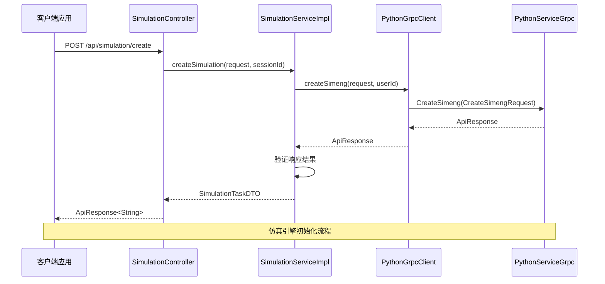
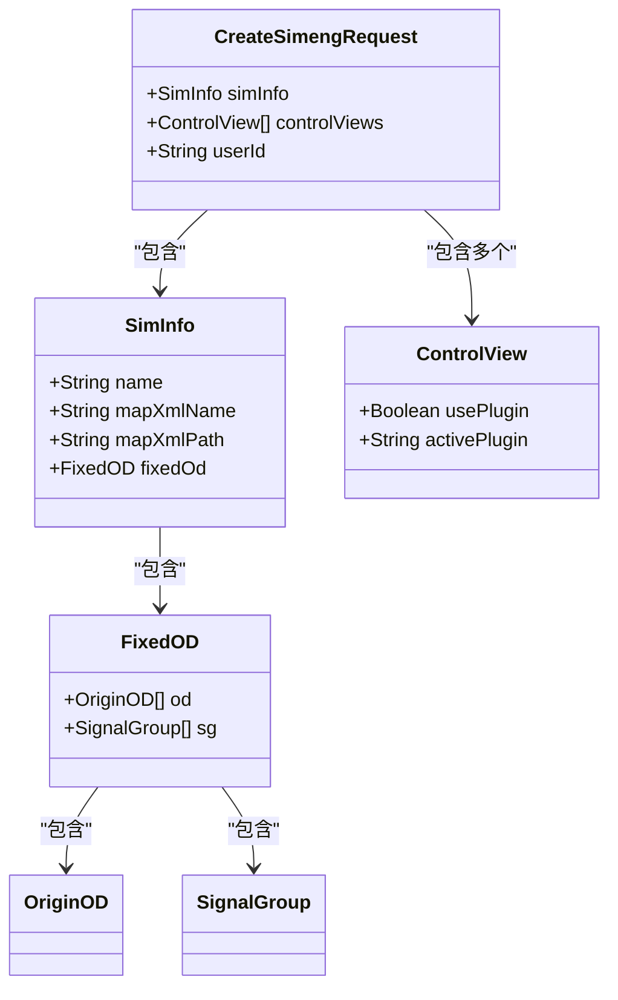
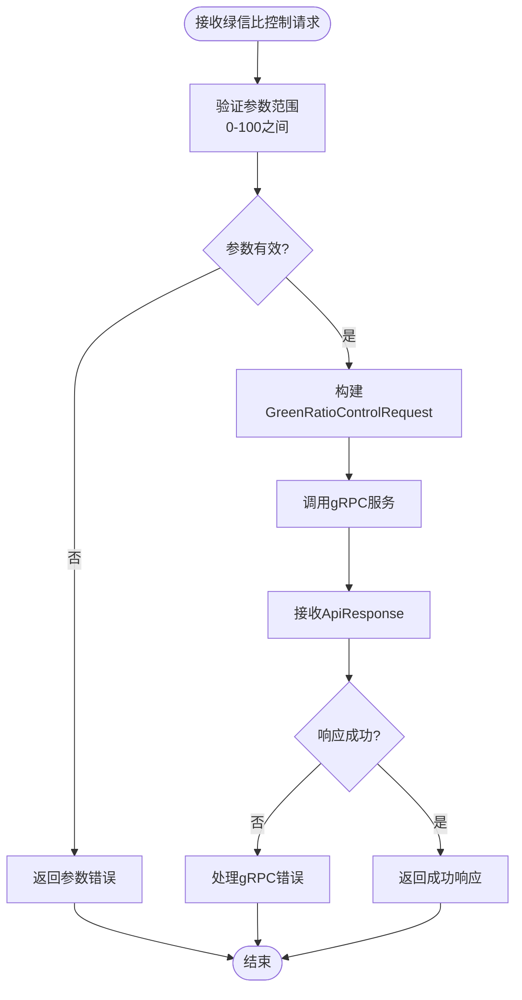
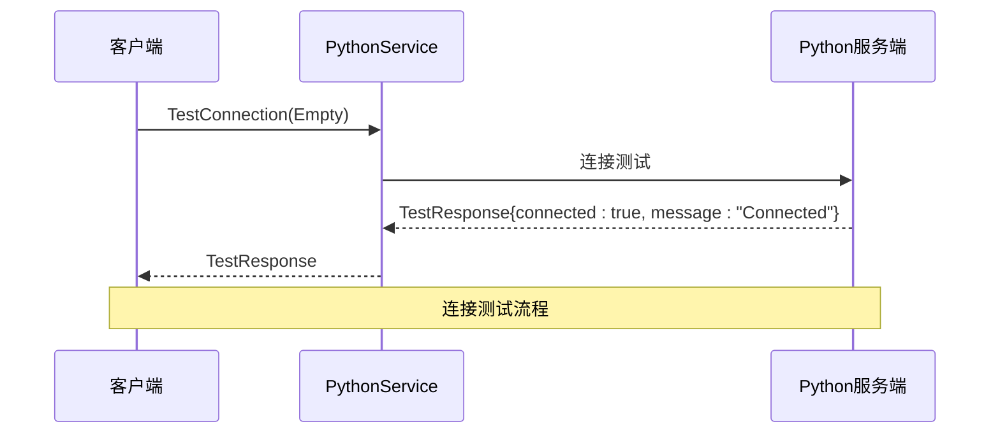
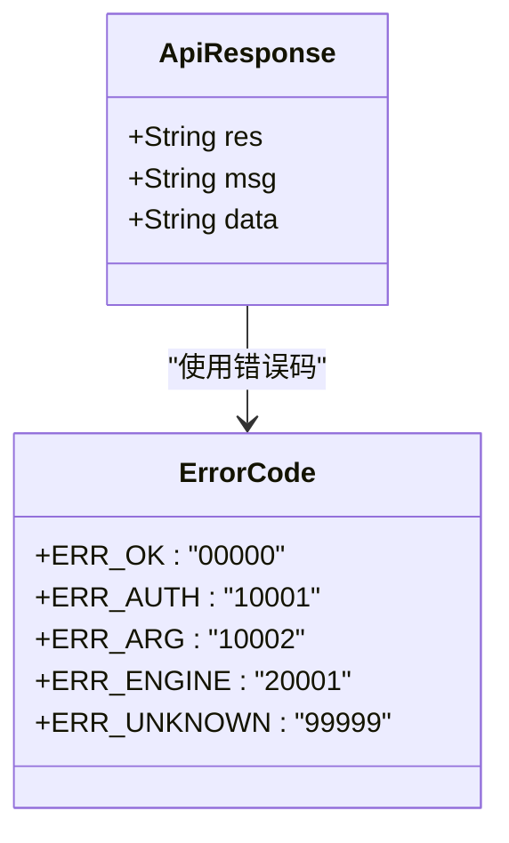
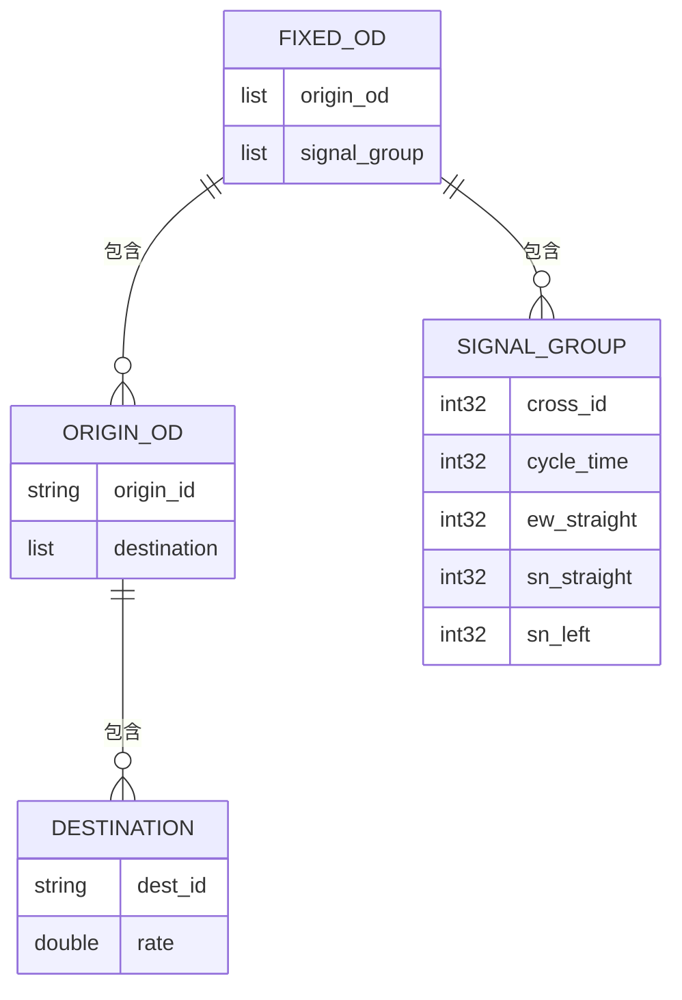
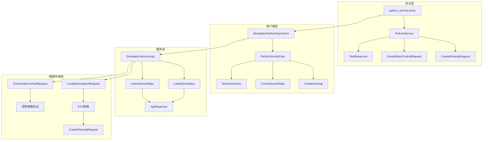

# gRPC协议规范

<cite>
**本文档引用的文件**
- [python_service.proto](file://plugins/plugin-simulation/src/main/proto/python_service.proto)
- [SimulationPythonGrpcClient.java](file://plugins/plugin-simulation/src/main/java/com/traffic/sim/plugin/simulation/grpc/SimulationPythonGrpcClient.java)
- [SimulationServiceImpl.java](file://plugins/plugin-simulation/src/main/java/com/traffic/sim/plugin/simulation/service/SimulationServiceImpl.java)
- [CreateSimulationRequest.java](file://traffic-sim-common/src/main/java/com/traffic/sim/common/dto/CreateSimulationRequest.java)
- [ApiResponse.java](file://traffic-sim-common/src/main/java/com/traffic/sim/common/response/ApiResponse.java)
- [application.yml](file://traffic-sim-server/src/main/resources/application.yml)
- [pom.xml](file://plugins/plugin-simulation/pom.xml)
</cite>

## 目录
1. [简介](#简介)
2. [项目结构](#项目结构)
3. [核心组件](#核心组件)
4. [架构概览](#架构概览)
5. [详细组件分析](#详细组件分析)
6. [依赖关系分析](#依赖关系分析)
7. [性能考虑](#性能考虑)
8. [故障排除指南](#故障排除指南)
9. [结论](#结论)

## 简介

本文档全面解析 `python_service.proto` 协议文件的定义与规范，该文件定义了Python仿真引擎服务的gRPC接口协议。该协议采用Protocol Buffers 3语法，提供了仿真引擎初始化、绿信比控制和连接测试等核心功能，是前后端交互的重要契约文件。

## 项目结构

该项目采用多模块架构，Python服务协议位于仿真插件模块中：

```mermaid
graph TB
subgraph "项目结构"
A[plugins/plugin-simulation/] --> B[src/main/proto/]
A --> C[src/main/grpc/]
A --> D[src/main/java/]
E[traffic-sim-common/] --> F[src/main/java/]
G[traffic-sim-server/] --> H[src/main/resources/]
end
subgraph "协议文件位置"
B --> I[python_service.proto]
I --> J[syntax = "proto3"]
I --> K[package com.traffic.sim.grpc]
I --> L[java_package option]
end
subgraph "客户端实现"
C --> M[SimulationPythonGrpcClient.java]
M --> N[PythonServiceGrpc.PythonServiceBlockingStub]
end
subgraph "服务端集成"
D --> O[SimulationServiceImpl.java]
O --> P[SimulationController.java]
end
```

**图表来源**
- [python_service.proto](file://plugins/plugin-simulation/src/main/proto/python_service.proto#L1-L82)
- [SimulationPythonGrpcClient.java](file://plugins/plugin-simulation/src/main/java/com/traffic/sim/plugin/simulation/grpc/SimulationPythonGrpcClient.java#L1-L264)

**章节来源**
- [python_service.proto](file://plugins/plugin-simulation/src/main/proto/python_service.proto#L1-L82)
- [pom.xml](file://plugins/plugin-simulation/pom.xml#L1-L124)

## 核心组件

### 协议文件头部配置

Protocol Buffer文件头部包含了重要的编译选项配置：

- **syntax = "proto3"**: 指定使用Protocol Buffers 3语法版本，提供更好的向后兼容性和更简洁的语法
- **package com.traffic.sim.grpc**: 定义Protocol Buffer的包命名空间，用于生成代码的基础包名
- **java_multiple_files = true**: 允许为每个消息类型生成独立的Java文件，提高代码组织性
- **java_package**: 指定生成的Java代码的包前缀，确保与Spring Boot项目结构兼容
- **java_outer_classname**: 设置外部类名，便于在Java代码中引用

这些配置确保了生成的Java代码能够正确集成到Spring Boot微服务架构中。

**章节来源**
- [python_service.proto](file://plugins/plugin-simulation/src/main/proto/python_service.proto#L1-L8)

### PythonService服务接口

服务定义提供了三个核心RPC方法：

1. **CreateSimeng**: 仿真引擎初始化方法
2. **ControlGreenRatio**: 绿信比实时控制系统
3. **TestConnection**: 连接状态测试方法

每个方法都遵循统一的响应模式，确保客户端能够一致地处理各种操作结果。

**章节来源**
- [python_service.proto](file://plugins/plugin-simulation/src/main/proto/python_service.proto#L9-L19)

## 架构概览



**图表来源**
- [SimulationController.java](file://plugins/plugin-simulation/src/main/java/com/traffic/sim/plugin/simulation/controller/SimulationController.java#L37-L60)
- [SimulationServiceImpl.java](file://plugins/plugin-simulation/src/main/java/com/traffic/sim/plugin/simulation/service/SimulationServiceImpl.java#L42-L90)
- [SimulationPythonGrpcClient.java](file://plugins/plugin-simulation/src/main/java/com/traffic/sim/plugin/simulation/grpc/SimulationPythonGrpcClient.java#L102-L124)

## 详细组件分析

### CreateSimeng RPC方法

#### 请求消息类型：CreateSimengRequest

CreateSimengRequest是仿真引擎初始化的核心请求消息，包含以下关键字段：



**图表来源**
- [python_service.proto](file://plugins/plugin-simulation/src/main/proto/python_service.proto#L21-L61)

**字段说明**:

- **simInfo**: 包含仿真基本信息和OD矩阵配置
- **controlViews**: 插件控制视图配置列表
- **userId**: 用户标识符，用于权限验证和审计

#### SimInfo消息及其嵌套结构

SimInfo消息定义了仿真引擎的核心配置信息：

1. **name**: 仿真任务名称
2. **mapXmlName**: 地图XML文件名称
3. **mapXmlPath**: 地图XML文件路径
4. **fixedOd**: 固定OD矩阵配置

FixedOD结构进一步细分为：
- **od**: 起点OD对列表
- **sg**: 信号灯组配置列表

**章节来源**
- [python_service.proto](file://plugins/plugin-simulation/src/main/proto/python_service.proto#L28-L38)

### ControlGreenRatio RPC方法

#### 绿信比控制请求

绿信比控制是交通仿真系统的核心功能之一，通过ControlGreenRatio方法实现：



**图表来源**
- [SimulationServiceImpl.java](file://plugins/plugin-simulation/src/main/java/com/traffic/sim/plugin/simulation/service/SimulationServiceImpl.java#L118-L144)
- [python_service.proto](file://plugins/plugin-simulation/src/main/proto/python_service.proto#L75-L78)

**业务含义**:
- **greenRatio**: 绿信比值，范围0-100的整数，表示百分比
- 该值直接影响信号灯的绿灯时长分配
- 实时调整可优化交通流量和通行效率

**章节来源**
- [python_service.proto](file://plugins/plugin-simulation/src/main/proto/python_service.proto#L75-L78)

### TestConnection RPC方法

TestConnection方法用于验证gRPC服务的连通性：



**图表来源**
- [python_service.proto](file://plugins/plugin-simulation/src/main/proto/python_service.proto#L17-L18)

**TestResponse结构**:
- **connected**: 布尔值，指示连接状态
- **message**: 连接状态的详细描述

**章节来源**
- [python_service.proto](file://plugins/plugin-simulation/src/main/proto/python_service.proto#L70-L73)

### 消息类型详解

#### ApiResponse统一响应格式

ApiResponse是所有gRPC方法的标准响应格式，提供统一的错误处理机制：



**图表来源**
- [python_service.proto](file://plugins/plugin-simulation/src/main/proto/python_service.proto#L63-L68)
- [ApiResponse.java](file://traffic-sim-common/src/main/java/com/traffic/sim/common/response/ApiResponse.java#L15-L83)

**字段含义**:
- **res**: 响应码，遵循统一的错误码标准
- **msg**: 响应消息，提供操作结果的详细描述
- **data**: 响应数据，承载具体的业务数据

#### ControlView插件控制视图

ControlView消息用于配置插件的控制视图：

- **usePlugin**: 布尔值，指示是否启用插件
- **activePlugin**: 字符串，指定激活的插件名称

**章节来源**
- [python_service.proto](file://plugins/plugin-simulation/src/main/proto/python_service.proto#L58-L61)

#### OD矩阵数据模型

OD矩阵是交通仿真系统的核心数据结构：



**图表来源**
- [python_service.proto](file://plugins/plugin-simulation/src/main/proto/python_service.proto#L35-L56)

**OD矩阵结构说明**:
- **OriginOD**: 起点ID和对应的目的地列表
- **Destination**: 目的地ID和流量比例
- **SignalGroup**: 信号灯组配置，包含路口ID、周期时间和各方向通行时间

**章节来源**
- [python_service.proto](file://plugins/plugin-simulation/src/main/proto/python_service.proto#L40-L56)

## 依赖关系分析



**图表来源**
- [python_service.proto](file://plugins/plugin-simulation/src/main/proto/python_service.proto#L1-L82)
- [SimulationPythonGrpcClient.java](file://plugins/plugin-simulation/src/main/java/com/traffic/sim/plugin/simulation/grpc/SimulationPythonGrpcClient.java#L1-L264)
- [SimulationServiceImpl.java](file://plugins/plugin-simulation/src/main/java/com/traffic/sim/plugin/simulation/service/SimulationServiceImpl.java#L1-L191)

**章节来源**
- [pom.xml](file://plugins/plugin-simulation/pom.xml#L50-L70)

### 外部依赖关系

项目使用以下关键依赖：

- **grpc-spring-boot-starter**: 提供gRPC客户端自动配置
- **protobuf-java**: Protocol Buffers Java运行时库
- **protoc-gen-grpc-java**: gRPC Java代码生成器
- **Spring Boot**: 微服务框架基础

**章节来源**
- [pom.xml](file://plugins/plugin-simulation/pom.xml#L50-L70)

## 性能考虑

### 序列化优势

Protocol Buffers相比JSON/XML具有以下性能优势：

1. **二进制序列化**: 更小的数据体积，更快的序列化/反序列化速度
2. **类型安全**: 编译时类型检查，减少运行时错误
3. **向后兼容**: 支持字段的添加、删除而不破坏现有代码
4. **跨语言支持**: 统一的接口定义，支持多种编程语言

### 连接管理

gRPC客户端配置了完善的连接管理策略：

- **keepAlive**: 启用Keep-Alive机制，保持连接活跃
- **超时设置**: 30秒超时，平衡响应速度和资源占用
- **容错机制**: gRPC服务不可用时自动降级为本地处理

**章节来源**
- [application.yml](file://traffic-sim-server/src/main/resources/application.yml#L68-L81)

## 故障排除指南

### 常见问题及解决方案

1. **gRPC服务不可用**
   - 检查Python服务端是否正常运行
   - 验证网络连接和端口可达性
   - 查看gRPC客户端日志输出

2. **连接超时**
   - 检查防火墙设置
   - 验证服务端配置
   - 调整超时参数配置

3. **序列化错误**
   - 确认Protocol Buffer版本兼容性
   - 检查消息字段类型匹配
   - 验证数据格式完整性

### 调试建议

- 启用详细的日志记录
- 使用gRPC调试工具
- 实施健康检查机制
- 监控连接状态指标

**章节来源**
- [SimulationPythonGrpcClient.java](file://plugins/plugin-simulation/src/main/java/com/traffic/sim/plugin/simulation/grpc/SimulationPythonGrpcClient.java#L54-L93)

## 结论

`python_service.proto` 协议文件定义了一个完整、类型安全的gRPC接口规范，为交通仿真系统的分布式架构提供了坚实的技术基础。通过统一的响应格式、完善的错误处理机制和灵活的插件控制能力，该协议实现了前后端的高效协作。

协议设计体现了以下最佳实践：
- 清晰的职责分离和模块化设计
- 类型安全和向后兼容性
- 容错机制和优雅降级
- 统一的错误处理和日志记录

开发者可以根据此协议文件快速生成客户端代码，实现与Python仿真引擎的无缝集成，为构建高性能的交通仿真系统奠定基础。