# gRPC客户端实现

<cite>
**本文档引用的文件**
- [SimulationPythonGrpcClient.java](file://plugins/plugin-simulation/src/main/java/com/traffic/sim/plugin/simulation/grpc/SimulationPythonGrpcClient.java)
- [GrpcClientConfig.java](file://plugins/plugin-simulation/src/main/java/com/traffic/sim/plugin/simulation/config/GrpcClientConfig.java)
- [application.yml](file://traffic-sim-server/src/main/resources/application.yml)
- [CreateSimulationRequest.java](file://traffic-sim-common/src/main/java/com/traffic/sim/common/dto/CreateSimulationRequest.java)
- [ApiResponse.java](file://traffic-sim-common/src/main/java/com/traffic/sim/common/response/ApiResponse.java)
- [ErrorCode.java](file://traffic-sim-common/src/main/java/com/traffic/sim/common/constant/ErrorCode.java)
- [SimulationServiceImpl.java](file://plugins/plugin-simulation/src/main/java/com/traffic/sim/plugin/simulation/service/SimulationServiceImpl.java)
- [python_service.proto](file://plugins/plugin-simulation/src/main/proto/python_service.proto)
- [TrafficSimApplication.java](file://traffic-sim-server/src/main/java/com/traffic/sim/TrafficSimApplication.java)
</cite>

## 目录
1. [简介](#简介)
2. [项目结构](#项目结构)
3. [核心组件](#核心组件)
4. [架构概览](#架构概览)
5. [详细组件分析](#详细组件分析)
6. [依赖关系分析](#依赖关系分析)
7. [性能考虑](#性能考虑)
8. [故障排查指南](#故障排查指南)
9. [结论](#结论)

## 简介

本文档深入解析`SimulationPythonGrpcClient`类的技术实现，这是一个关键的Spring服务组件，负责与Python gRPC服务进行通信。该客户端采用了先进的容错设计模式，通过`@ConditionalOnProperty`实现基于配置的条件化启用，使用`@Lazy`注解进行延迟初始化以避免应用启动失败，并实现了完善的异常处理和兜底响应机制。

该客户端的核心功能包括：
- 动态gRPC服务可用性检测
- 请求参数的深度转换（Java DTO到Protocol Buffer）
- 容错机制和兜底响应设计
- 生命周期管理和健康检查

## 项目结构

该项目采用多模块架构，gRPC客户端位于仿真插件模块中：

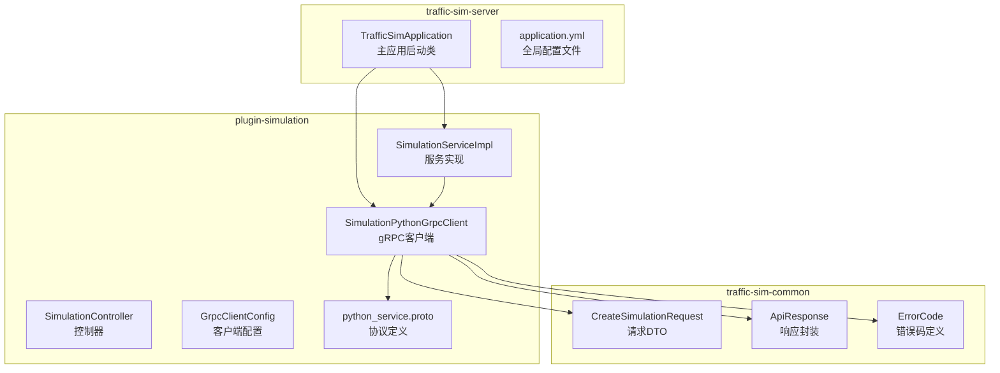

**图表来源**
- [TrafficSimApplication.java](file://traffic-sim-server/src/main/java/com/traffic/sim/TrafficSimApplication.java#L1-L44)
- [SimulationPythonGrpcClient.java](file://plugins/plugin-simulation/src/main/java/com/traffic/sim/plugin/simulation/grpc/SimulationPythonGrpcClient.java#L1-L264)

**章节来源**
- [TrafficSimApplication.java](file://traffic-sim-server/src/main/java/com/traffic/sim/TrafficSimApplication.java#L1-L44)
- [application.yml](file://traffic-sim-server/src/main/resources/application.yml#L1-L117)

## 核心组件

`SimulationPythonGrpcClient`类是整个gRPC客户端系统的核心，具有以下关键特性：

### 设计模式与架构

该类采用了多种Spring框架的设计模式：

1. **条件化装配模式**：通过`@ConditionalOnProperty`实现基于配置的条件化启用
2. **延迟初始化模式**：使用`@Lazy`注解避免启动时的依赖注入失败
3. **容错设计模式**：实现兜底响应机制确保系统稳定性
4. **适配器模式**：将Java DTO转换为Protocol Buffer消息

### 关键注解分析

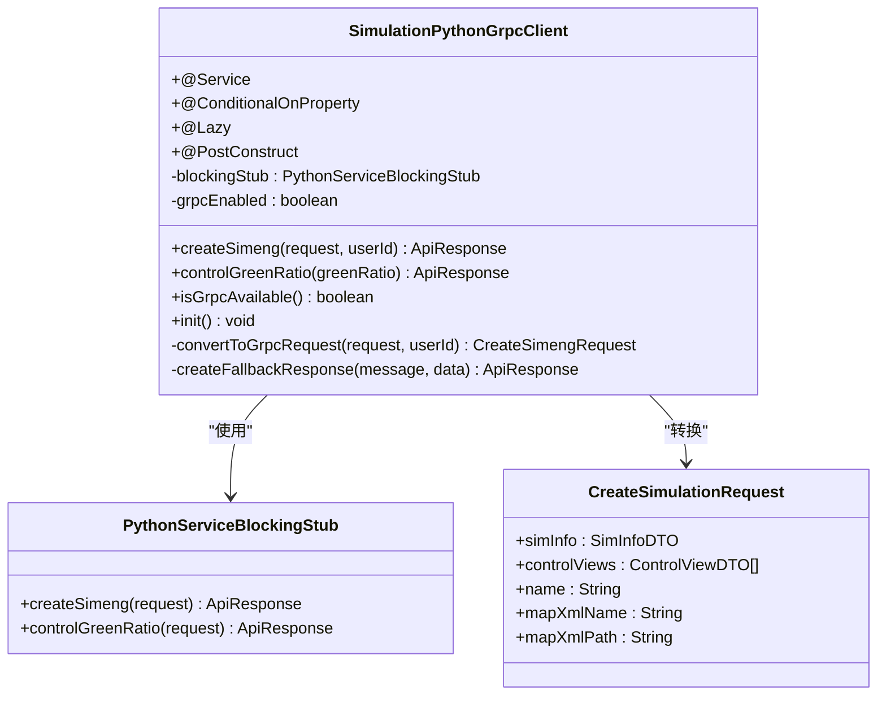

**图表来源**
- [SimulationPythonGrpcClient.java](file://plugins/plugin-simulation/src/main/java/com/traffic/sim/plugin/simulation/grpc/SimulationPythonGrpcClient.java#L35-L47)

**章节来源**
- [SimulationPythonGrpcClient.java](file://plugins/plugin-simulation/src/main/java/com/traffic/sim/plugin/simulation/grpc/SimulationPythonGrpcClient.java#L27-L38)

## 架构概览

系统采用分层架构设计，gRPC客户端位于服务层与控制器层之间：

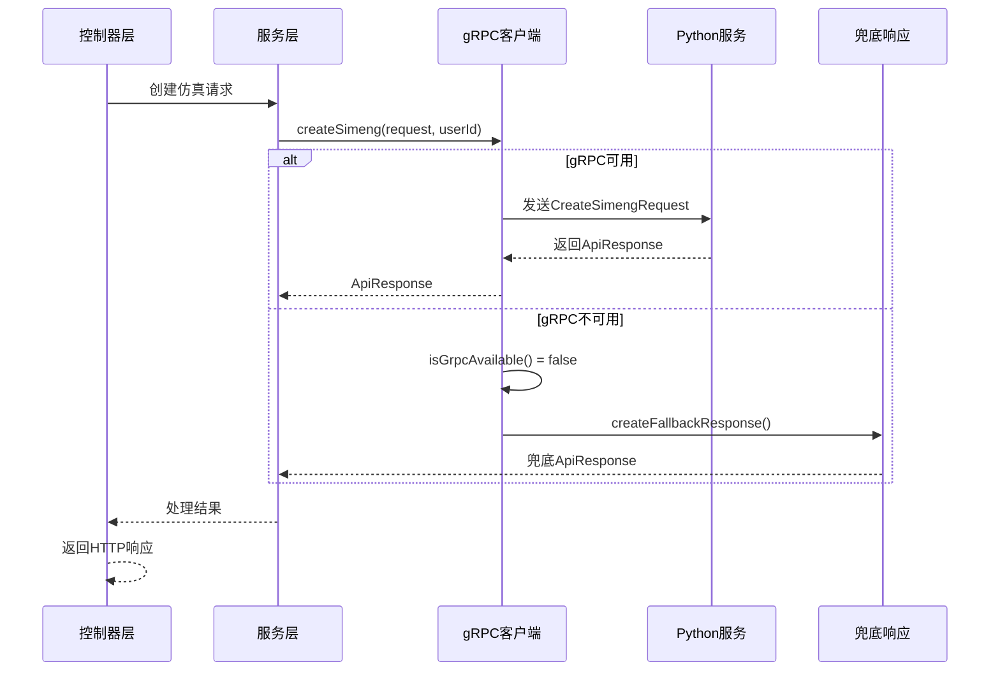

**图表来源**
- [SimulationController.java](file://plugins/plugin-simulation/src/main/java/com/traffic/sim/plugin/simulation/controller/SimulationController.java#L37-L60)
- [SimulationServiceImpl.java](file://plugins/plugin-simulation/src/main/java/com/traffic/sim/plugin/simulation/service/SimulationServiceImpl.java#L44-L90)
- [SimulationPythonGrpcClient.java](file://plugins/plugin-simulation/src/main/java/com/traffic/sim/plugin/simulation/grpc/SimulationPythonGrpcClient.java#L102-L124)

## 详细组件分析

### Spring服务组件设计

`SimulationPythonGrpcClient`类通过多个Spring注解实现了完整的依赖注入和生命周期管理：

#### 条件化启用机制

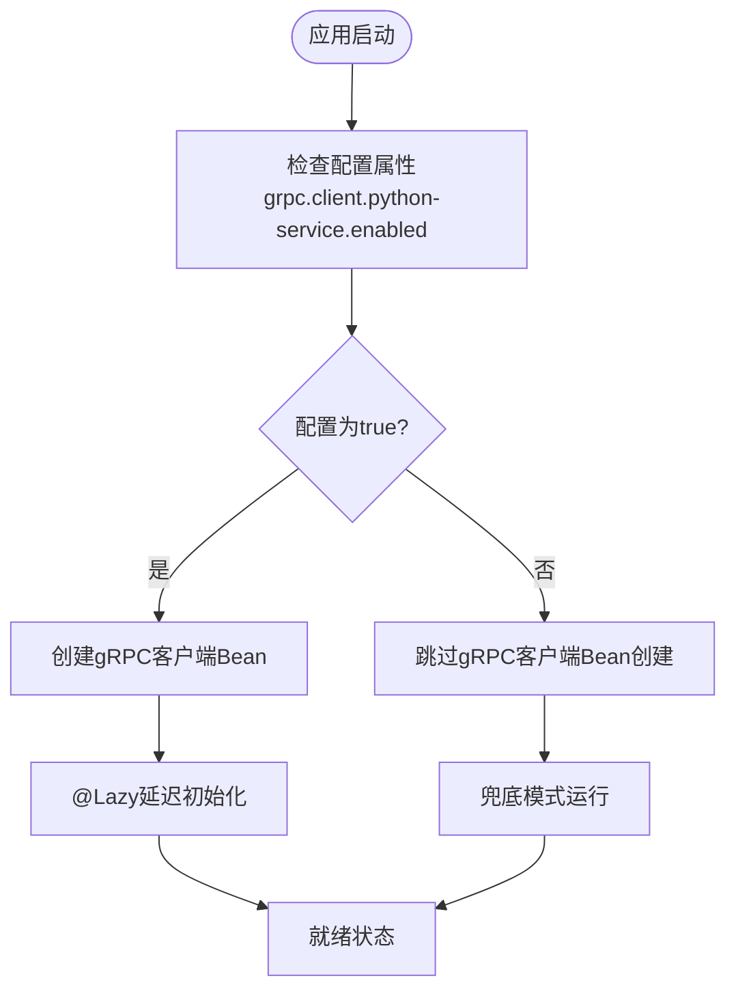

**图表来源**
- [GrpcClientConfig.java](file://plugins/plugin-simulation/src/main/java/com/traffic/sim/plugin/simulation/config/GrpcClientConfig.java#L27-L32)
- [SimulationPythonGrpcClient.java](file://plugins/plugin-simulation/src/main/java/com/traffic/sim/plugin/simulation/grpc/SimulationPythonGrpcClient.java#L37-L41)

#### 延迟初始化策略

延迟初始化是该客户端容错设计的关键：

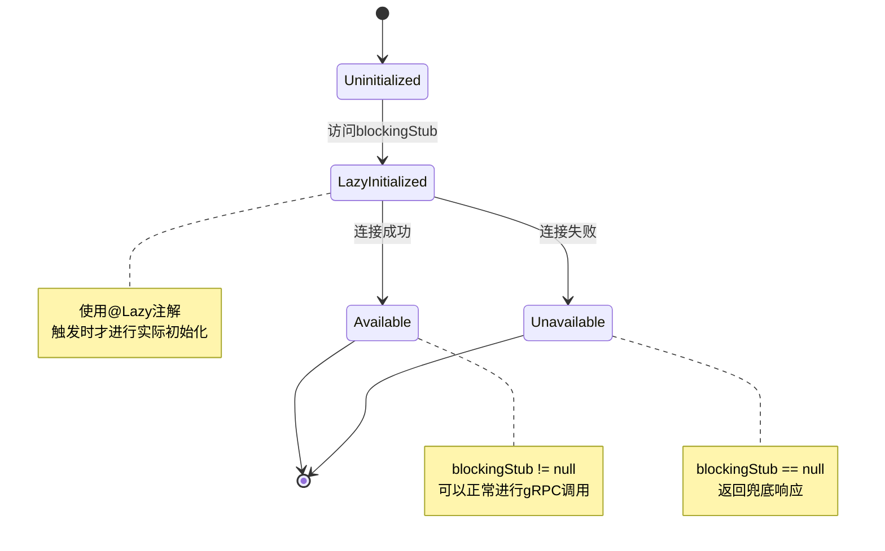

**图表来源**
- [SimulationPythonGrpcClient.java](file://plugins/plugin-simulation/src/main/java/com/traffic/sim/plugin/simulation/grpc/SimulationPythonGrpcClient.java#L43-L47)
- [SimulationPythonGrpcClient.java](file://plugins/plugin-simulation/src/main/java/com/traffic/sim/plugin/simulation/grpc/SimulationPythonGrpcClient.java#L80-L93)

**章节来源**
- [SimulationPythonGrpcClient.java](file://plugins/plugin-simulation/src/main/java/com/traffic/sim/plugin/simulation/grpc/SimulationPythonGrpcClient.java#L35-L93)

### 运行时可用性检测

`isGrpcAvailable()`方法实现了智能的运行时检测机制：

#### 检测逻辑流程

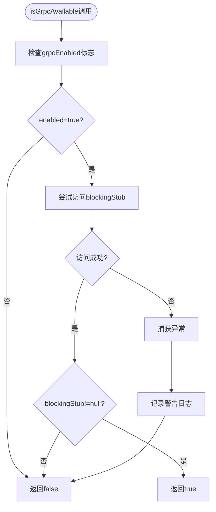

**图表来源**
- [SimulationPythonGrpcClient.java](file://plugins/plugin-simulation/src/main/java/com/traffic/sim/plugin/simulation/grpc/SimulationPythonGrpcClient.java#L80-L93)

#### 初始化阶段健康检查

`@PostConstruct`生命周期回调提供了额外的健康检查：

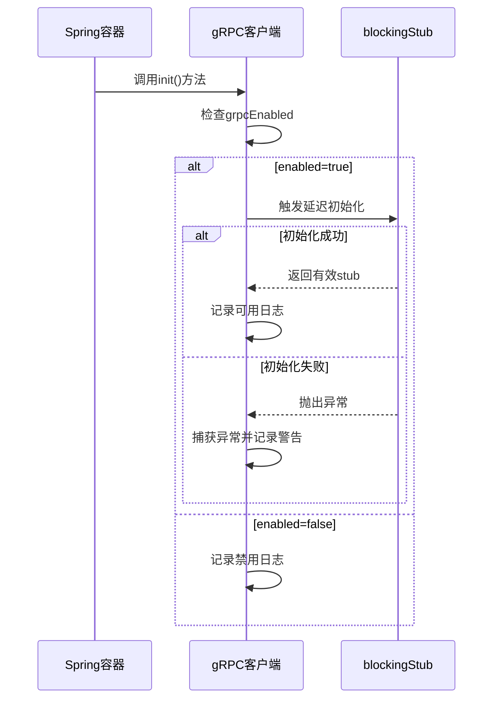

**图表来源**
- [SimulationPythonGrpcClient.java](file://plugins/plugin-simulation/src/main/java/com/traffic/sim/plugin/simulation/grpc/SimulationPythonGrpcClient.java#L54-L73)

**章节来源**
- [SimulationPythonGrpcClient.java](file://plugins/plugin-simulation/src/main/java/com/traffic/sim/plugin/simulation/grpc/SimulationPythonGrpcClient.java#L54-L93)

### 核心方法实现分析

#### createSimeng方法实现

`createSimeng`方法是客户端的核心入口，负责创建仿真引擎：

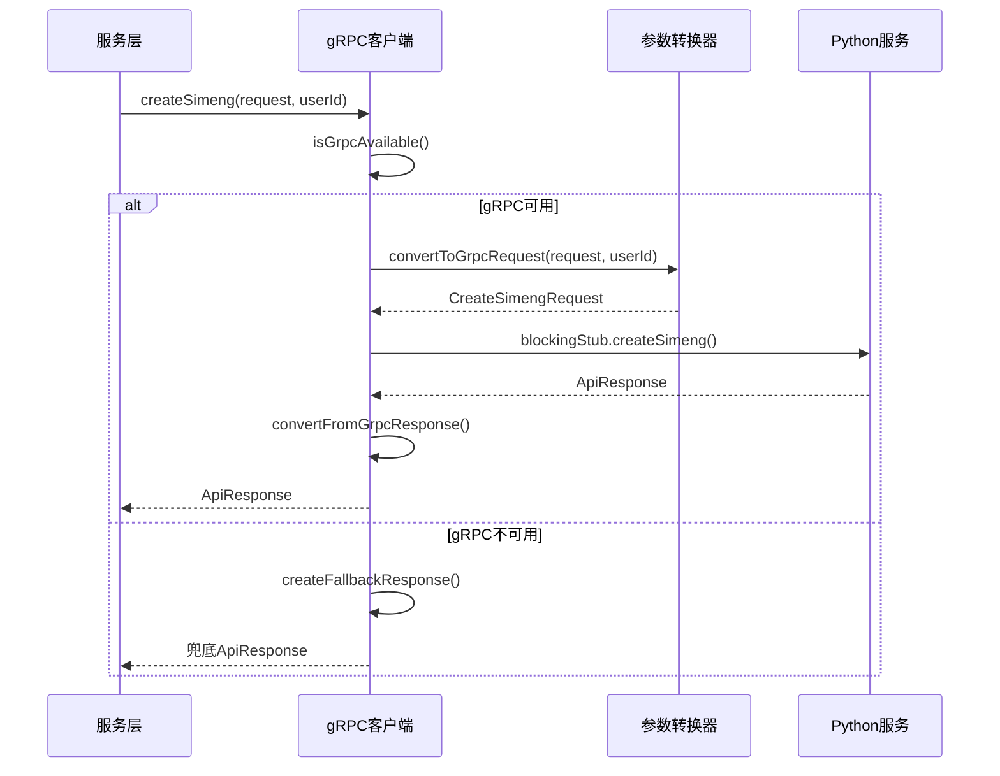

**图表来源**
- [SimulationPythonGrpcClient.java](file://plugins/plugin-simulation/src/main/java/com/traffic/sim/plugin/simulation/grpc/SimulationPythonGrpcClient.java#L102-L124)

#### controlGreenRatio方法实现

该方法提供实时的绿信比控制功能：

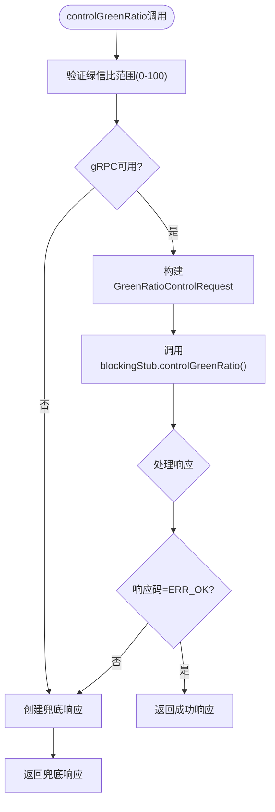

**图表来源**
- [SimulationPythonGrpcClient.java](file://plugins/plugin-simulation/src/main/java/com/traffic/sim/plugin/simulation/grpc/SimulationPythonGrpcClient.java#L132-L157)

**章节来源**
- [SimulationPythonGrpcClient.java](file://plugins/plugin-simulation/src/main/java/com/traffic/sim/plugin/simulation/grpc/SimulationPythonGrpcClient.java#L102-L157)

### 参数转换机制

`convertToGrpcRequest`方法实现了复杂的对象转换逻辑，将Java DTO深度转换为Protocol Buffer消息：

#### 转换流程图

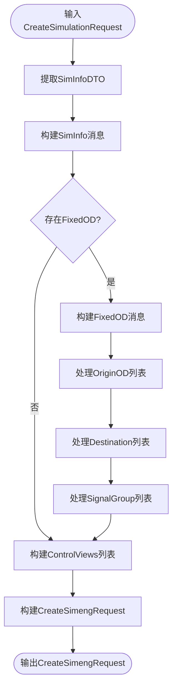

**图表来源**
- [SimulationPythonGrpcClient.java](file://plugins/plugin-simulation/src/main/java/com/traffic/sim/plugin/simulation/grpc/SimulationPythonGrpcClient.java#L177-L250)

#### 嵌套对象处理策略

转换过程中对复杂嵌套对象的处理：

| 对象类型 | 处理策略 | 空值处理 |
|---------|---------|---------|
| SimInfoDTO | 直接映射基础字段 | 忽略空值 |
| FixedODDTO | 递归处理嵌套对象 | 安全检查 |
| OriginODDTO | 处理目的地列表 | 空列表安全 |
| DestinationDTO | 映射流量比例 | 默认0.0 |
| SignalGroupDTO | 处理信号灯参数 | 默认0 |

**章节来源**
- [SimulationPythonGrpcClient.java](file://plugins/plugin-simulation/src/main/java/com/traffic/sim/plugin/simulation/grpc/SimulationPythonGrpcClient.java#L177-L250)

### 异常处理策略

客户端实现了多层次的异常处理机制：

#### 异常处理流程

```mermaid
flowchart TD
Start([gRPC调用]) --> TryCall["执行gRPC调用"]
TryCall --> Success{"调用成功?"}
Success --> |是| ReturnResponse["返回正常响应"]
Success --> |否| CatchStatus["捕获StatusRuntimeException"]
CatchStatus --> LogError["记录错误日志"]
LogError --> CreateFallback["创建兜底响应"]
CreateFallback --> ReturnFallback["返回兜底响应"]
subgraph "异常分类"
StatusRuntimeException["gRPC状态异常"]
OtherException["其他未知异常"]
end
CatchStatus --> CheckType{"异常类型判断"}
CheckType --> |StatusRuntimeException| CreateFallback
CheckType --> |其他异常| CreateFallback
end
```

**图表来源**
- [SimulationPythonGrpcClient.java](file://plugins/plugin-simulation/src/main/java/com/traffic/sim/plugin/simulation/grpc/SimulationPythonGrpcClient.java#L115-L123)

**章节来源**
- [SimulationPythonGrpcClient.java](file://plugins/plugin-simulation/src/main/java/com/traffic/sim/plugin/simulation/grpc/SimulationPythonGrpcClient.java#L112-L156)

### 兜底响应设计

`createFallbackResponse`方法实现了优雅的降级策略：

#### 兜底响应策略

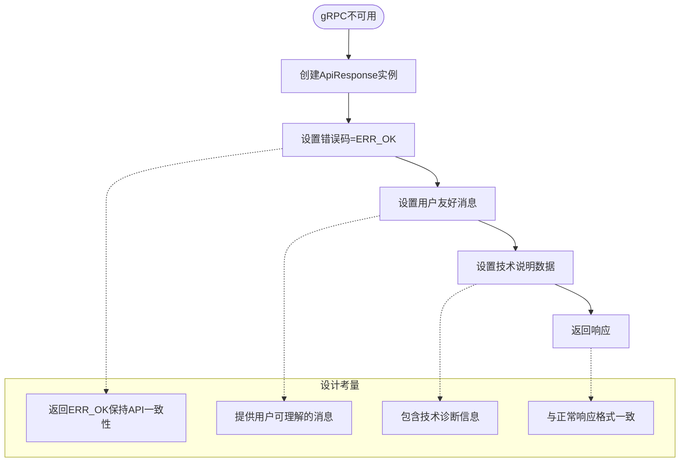

**图表来源**
- [SimulationPythonGrpcClient.java](file://plugins/plugin-simulation/src/main/java/com/traffic/sim/plugin/simulation/grpc/SimulationPythonGrpcClient.java#L166-L172)

#### 设计目的与业务价值

1. **用户体验优化**：保持API响应格式一致，避免前端处理复杂逻辑
2. **系统稳定性**：确保服务在部分组件故障时仍可正常运行
3. **调试便利性**：提供详细的错误信息帮助问题定位
4. **业务连续性**：关键功能不受非核心服务影响

**章节来源**
- [SimulationPythonGrpcClient.java](file://plugins/plugin-simulation/src/main/java/com/traffic/sim/plugin/simulation/grpc/SimulationPythonGrpcClient.java#L166-L172)

## 依赖关系分析

### 外部依赖关系

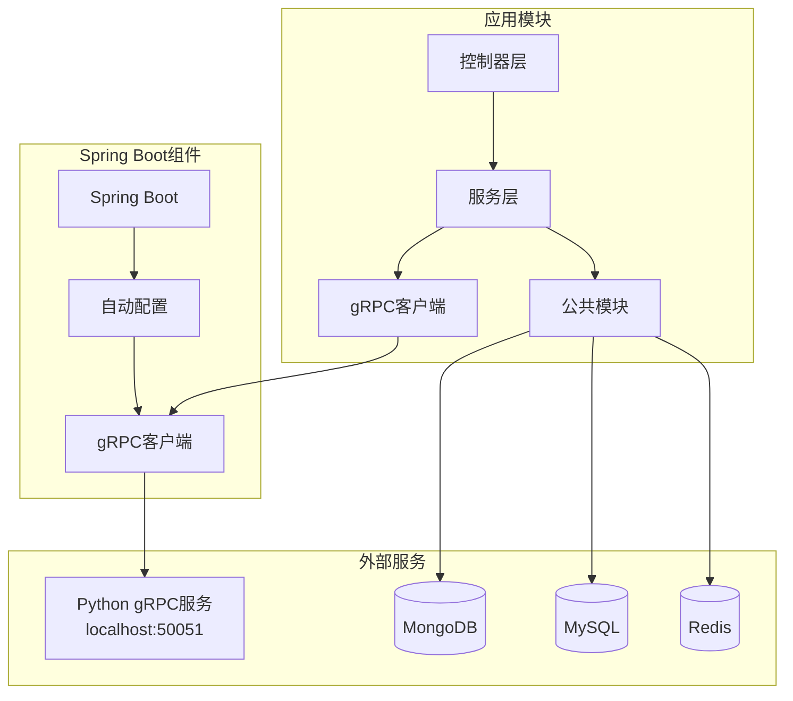

**图表来源**
- [application.yml](file://traffic-sim-server/src/main/resources/application.yml#L69-L81)
- [TrafficSimApplication.java](file://traffic-sim-server/src/main/java/com/traffic/sim/TrafficSimApplication.java#L17-L20)

### 内部依赖关系

客户端内部的依赖关系体现了清晰的职责分离：

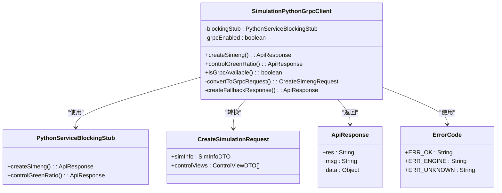

**图表来源**
- [SimulationPythonGrpcClient.java](file://plugins/plugin-simulation/src/main/java/com/traffic/sim/plugin/simulation/grpc/SimulationPythonGrpcClient.java#L1-L264)

**章节来源**
- [SimulationPythonGrpcClient.java](file://plugins/plugin-simulation/src/main/java/com/traffic/sim/plugin/simulation/grpc/SimulationPythonGrpcClient.java#L1-L264)

## 性能考虑

### 延迟初始化的优势

1. **启动性能**：避免在应用启动时阻塞
2. **资源利用**：只有在实际使用时才建立连接
3. **故障隔离**：单个组件故障不影响整体启动

### 连接池配置

基于配置文件的连接池优化：

- **keepAlive配置**：启用长连接减少握手开销
- **超时设置**：合理的超时时间平衡响应速度和资源占用
- **重连机制**：自动重连提高系统可用性

### 缓存策略

虽然当前实现主要依赖gRPC调用，但可以考虑：

1. **响应缓存**：对频繁查询的结果进行缓存
2. **连接复用**：复用gRPC连接减少资源消耗
3. **批量处理**：合并多个小请求提高效率

## 故障排查指南

### 常见问题诊断

#### gRPC服务不可用

**症状**：所有gRPC调用都返回兜底响应

**排查步骤**：
1. 检查Python服务是否正常运行
2. 验证网络连接和端口可达性
3. 查看gRPC客户端配置
4. 检查防火墙设置

#### 启动失败问题

**症状**：应用启动时因gRPC连接失败而中断

**解决方案**：
1. 设置`grpc.client.python-service.enabled=false`
2. 使用`@Lazy`注解确保延迟初始化
3. 实现适当的异常处理机制

#### 参数转换错误

**症状**：gRPC调用抛出参数异常

**排查要点**：
1. 检查DTO对象的完整性
2. 验证嵌套对象的正确性
3. 确认Protocol Buffer字段映射

**章节来源**
- [TrafficSimApplication.java](file://traffic-sim-server/src/main/java/com/traffic/sim/TrafficSimApplication.java#L30-L40)
- [application.yml](file://traffic-sim-server/src/main/resources/application.yml#L69-L81)

### 监控和日志

建议添加的监控指标：

1. **连接成功率**：统计gRPC连接的成功率
2. **响应时间分布**：监控gRPC调用的响应时间
3. **错误率统计**：跟踪不同类型的异常发生频率
4. **资源使用情况**：监控连接池和内存使用

## 结论

`SimulationPythonGrpcClient`类展现了现代微服务架构中的最佳实践：

### 技术亮点

1. **容错设计**：通过多重容错机制确保系统稳定性
2. **灵活配置**：支持运行时配置切换，适应不同环境需求
3. **优雅降级**：在服务不可用时提供一致的用户体验
4. **清晰架构**：职责分离明确，便于维护和扩展

### 架构优势

1. **松耦合**：客户端与具体服务实现解耦
2. **可测试性**：清晰的接口设计便于单元测试
3. **可扩展性**：支持新服务的无缝集成
4. **可观测性**：完善的日志和监控支持

### 业务价值

该设计为交通仿真系统提供了可靠的技术支撑：
- 确保核心功能在服务故障时仍可使用
- 提供一致的用户体验，提升系统可信度
- 支持渐进式部署和灰度发布
- 降低运维复杂度，提高系统稳定性

通过这种设计，系统能够在保证功能完整性的同时，最大化地提升用户体验和系统可靠性。