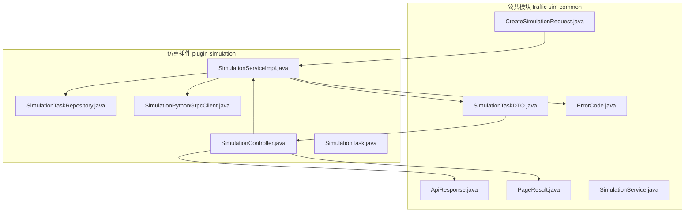
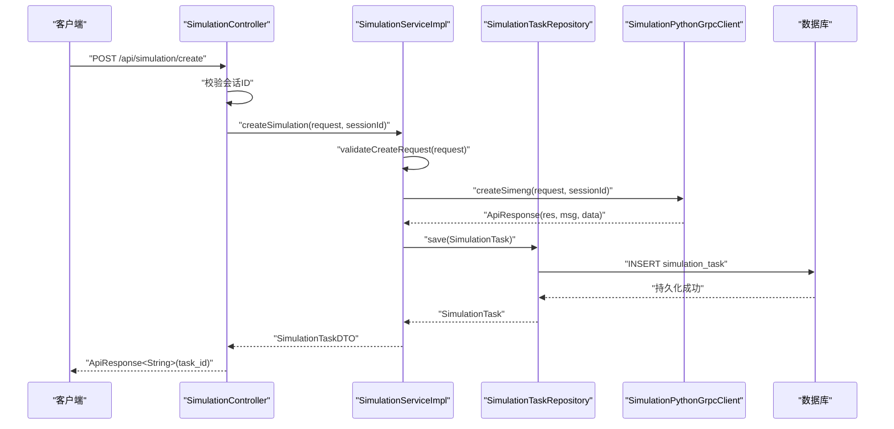
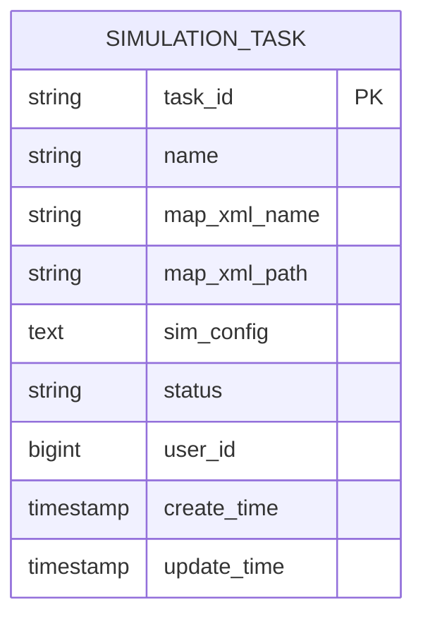
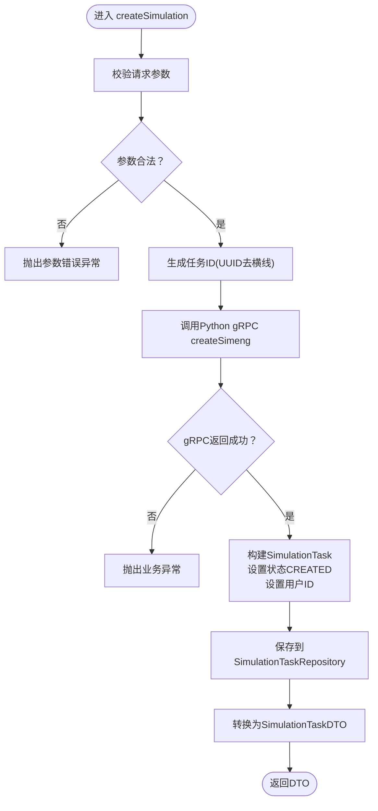
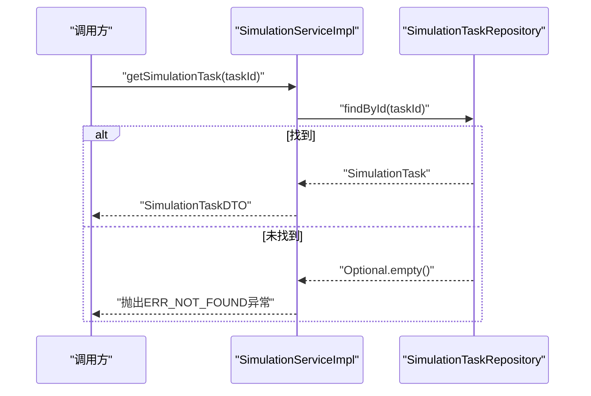
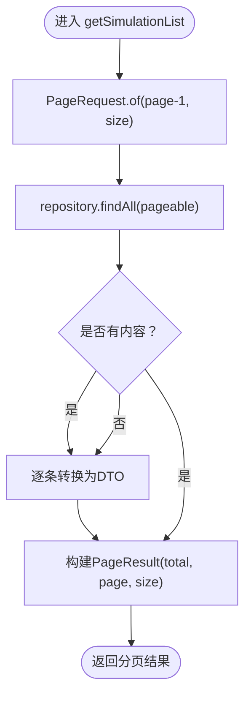
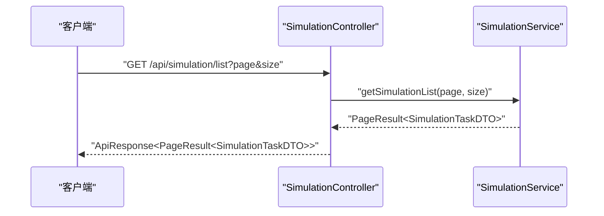
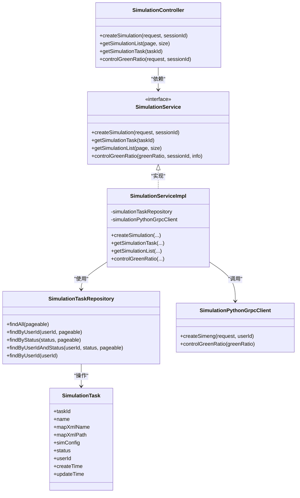

# 仿真任务管理

<cite>
**本文引用的文件**
- [SimulationTask.java](file://plugins/plugin-simulation/src/main/java/com/traffic/sim/plugin/simulation/entity/SimulationTask.java)
- [SimulationServiceImpl.java](file://plugins/plugin-simulation/src/main/java/com/traffic/sim/plugin/simulation/service/SimulationServiceImpl.java)
- [SimulationTaskRepository.java](file://plugins/plugin-simulation/src/main/java/com/traffic/sim/plugin/simulation/repository/SimulationTaskRepository.java)
- [CreateSimulationRequest.java](file://traffic-sim-common/src/main/java/com/traffic/sim/common/dto/CreateSimulationRequest.java)
- [SimulationTaskDTO.java](file://traffic-sim-common/src/main/java/com/traffic/sim/common/dto/SimulationTaskDTO.java)
- [SimulationController.java](file://plugins/plugin-simulation/src/main/java/com/traffic/sim/plugin/simulation/controller/SimulationController.java)
- [ErrorCode.java](file://traffic-sim-common/src/main/java/com/traffic/sim/common/constant/ErrorCode.java)
- [SimulationPythonGrpcClient.java](file://plugins/plugin-simulation/src/main/java/com/traffic/sim/plugin/simulation/grpc/SimulationPythonGrpcClient.java)
- [ApiResponse.java](file://traffic-sim-common/src/main/java/com/traffic/sim/common/response/ApiResponse.java)
- [PageResult.java](file://traffic-sim-common/src/main/java/com/traffic/sim/common/response/PageResult.java)
- [SimulationService.java](file://traffic-sim-common/src/main/java/com/traffic/sim/common/service/SimulationService.java)
</cite>

## 目录
1. [简介](#简介)
2. [项目结构](#项目结构)
3. [核心组件](#核心组件)
4. [架构总览](#架构总览)
5. [详细组件分析](#详细组件分析)
6. [依赖关系分析](#依赖关系分析)
7. [性能考虑](#性能考虑)
8. [故障排查指南](#故障排查指南)
9. [结论](#结论)

## 简介
本文件系统性地文档化“仿真任务管理”功能，覆盖以下关键目标：
- 解释仿真任务实体类的字段定义与数据库映射关系
- 详解服务层实现，包括任务创建、查询与分页机制
- 展示如何通过请求对象发起创建请求并转换为返回DTO
- 文档化异常处理策略与错误码
- 说明与Spring Data JPA仓库的交互方式
- 提供常见问题排查建议

## 项目结构
该功能位于插件模块 plugin-simulation 中，采用“控制器-服务-仓库-实体”的分层设计；公共模块 traffic-sim-common 提供通用的数据传输对象、响应封装与服务接口定义。

图表来源
- [SimulationController.java](file://plugins/plugin-simulation/src/main/java/com/traffic/sim/plugin/simulation/controller/SimulationController.java#L30-L131)
- [SimulationServiceImpl.java](file://plugins/plugin-simulation/src/main/java/com/traffic/sim/plugin/simulation/service/SimulationServiceImpl.java#L34-L188)
- [SimulationTaskRepository.java](file://plugins/plugin-simulation/src/main/java/com/traffic/sim/plugin/simulation/repository/SimulationTaskRepository.java#L16-L38)
- [SimulationTask.java](file://plugins/plugin-simulation/src/main/java/com/traffic/sim/plugin/simulation/entity/SimulationTask.java#L15-L49)
- [SimulationPythonGrpcClient.java](file://plugins/plugin-simulation/src/main/java/com/traffic/sim/plugin/simulation/grpc/SimulationPythonGrpcClient.java#L35-L262)
- [CreateSimulationRequest.java](file://traffic-sim-common/src/main/java/com/traffic/sim/common/dto/CreateSimulationRequest.java#L14-L132)
- [SimulationTaskDTO.java](file://traffic-sim-common/src/main/java/com/traffic/sim/common/dto/SimulationTaskDTO.java#L13-L44)
- [ApiResponse.java](file://traffic-sim-common/src/main/java/com/traffic/sim/common/response/ApiResponse.java#L14-L83)
- [PageResult.java](file://traffic-sim-common/src/main/java/com/traffic/sim/common/response/PageResult.java#L16-L45)
- [SimulationService.java](file://traffic-sim-common/src/main/java/com/traffic/sim/common/service/SimulationService.java#L15-L51)

章节来源
- [SimulationController.java](file://plugins/plugin-simulation/src/main/java/com/traffic/sim/plugin/simulation/controller/SimulationController.java#L25-L131)
- [SimulationServiceImpl.java](file://plugins/plugin-simulation/src/main/java/com/traffic/sim/plugin/simulation/service/SimulationServiceImpl.java#L34-L188)
- [SimulationTaskRepository.java](file://plugins/plugin-simulation/src/main/java/com/traffic/sim/plugin/simulation/repository/SimulationTaskRepository.java#L16-L38)
- [SimulationTask.java](file://plugins/plugin-simulation/src/main/java/com/traffic/sim/plugin/simulation/entity/SimulationTask.java#L15-L49)
- [SimulationPythonGrpcClient.java](file://plugins/plugin-simulation/src/main/java/com/traffic/sim/plugin/simulation/grpc/SimulationPythonGrpcClient.java#L35-L262)
- [CreateSimulationRequest.java](file://traffic-sim-common/src/main/java/com/traffic/sim/common/dto/CreateSimulationRequest.java#L14-L132)
- [SimulationTaskDTO.java](file://traffic-sim-common/src/main/java/com/traffic/sim/common/dto/SimulationTaskDTO.java#L13-L44)
- [ApiResponse.java](file://traffic-sim-common/src/main/java/com/traffic/sim/common/response/ApiResponse.java#L14-L83)
- [PageResult.java](file://traffic-sim-common/src/main/java/com/traffic/sim/common/response/PageResult.java#L16-L45)
- [SimulationService.java](file://traffic-sim-common/src/main/java/com/traffic/sim/common/service/SimulationService.java#L15-L51)

## 核心组件
- 仿真任务实体：定义任务ID、名称、地图信息、状态、用户ID与时间戳等字段，并通过JPA注解映射到数据库表
- 服务实现：负责参数校验、调用Python gRPC服务、持久化任务、状态管理与分页查询
- 仓库接口：基于Spring Data JPA提供按用户ID、状态等条件的分页查询能力
- 控制器：对外暴露REST接口，接收请求、校验会话、调用服务并统一响应封装
- 请求与响应：CreateSimulationRequest定义创建请求结构；ApiResponse/ PageResult统一封装响应
- 错误码：ErrorCode集中定义错误码常量，便于统一处理

章节来源
- [SimulationTask.java](file://plugins/plugin-simulation/src/main/java/com/traffic/sim/plugin/simulation/entity/SimulationTask.java#L15-L49)
- [SimulationServiceImpl.java](file://plugins/plugin-simulation/src/main/java/com/traffic/sim/plugin/simulation/service/SimulationServiceImpl.java#L34-L188)
- [SimulationTaskRepository.java](file://plugins/plugin-simulation/src/main/java/com/traffic/sim/plugin/simulation/repository/SimulationTaskRepository.java#L16-L38)
- [SimulationController.java](file://plugins/plugin-simulation/src/main/java/com/traffic/sim/plugin/simulation/controller/SimulationController.java#L30-L131)
- [CreateSimulationRequest.java](file://traffic-sim-common/src/main/java/com/traffic/sim/common/dto/CreateSimulationRequest.java#L14-L132)
- [SimulationTaskDTO.java](file://traffic-sim-common/src/main/java/com/traffic/sim/common/dto/SimulationTaskDTO.java#L13-L44)
- [ApiResponse.java](file://traffic-sim-common/src/main/java/com/traffic/sim/common/response/ApiResponse.java#L14-L83)
- [PageResult.java](file://traffic-sim-common/src/main/java/com/traffic/sim/common/response/PageResult.java#L16-L45)
- [ErrorCode.java](file://traffic-sim-common/src/main/java/com/traffic/sim/common/constant/ErrorCode.java#L8-L52)

## 架构总览
下图展示了从HTTP请求到服务层、仓库层以及外部Python gRPC服务的整体交互流程。

图表来源
- [SimulationController.java](file://plugins/plugin-simulation/src/main/java/com/traffic/sim/plugin/simulation/controller/SimulationController.java#L37-L60)
- [SimulationServiceImpl.java](file://plugins/plugin-simulation/src/main/java/com/traffic/sim/plugin/simulation/service/SimulationServiceImpl.java#L42-L90)
- [SimulationTaskRepository.java](file://plugins/plugin-simulation/src/main/java/com/traffic/sim/plugin/simulation/repository/SimulationTaskRepository.java#L16-L38)
- [SimulationPythonGrpcClient.java](file://plugins/plugin-simulation/src/main/java/com/traffic/sim/plugin/simulation/grpc/SimulationPythonGrpcClient.java#L102-L124)

## 详细组件分析

### 仿真任务实体与数据库映射
- 表名：simulation_task
- 主键：task_id（长度64）
- 关键字段：
  - name：仿真名称（非空，长度255）
  - map_xml_name：地图XML文件名（长度255）
  - map_xml_path：地图XML文件路径（长度500）
  - sim_config：仿真配置（TEXT类型，存储JSON字符串）
  - status：任务状态（长度20，取值CREATED/RUNNING/PAUSED/STOPPED/FINISHED）
  - user_id：用户ID（非空）
  - create_time/update_time：创建与更新时间戳（不可更新的创建时间）
- 时间戳注解：使用Hibernate提供的@CreationTimestamp/@UpdateTimestamp自动维护

图表来源
- [SimulationTask.java](file://plugins/plugin-simulation/src/main/java/com/traffic/sim/plugin/simulation/entity/SimulationTask.java#L15-L49)

章节来源
- [SimulationTask.java](file://plugins/plugin-simulation/src/main/java/com/traffic/sim/plugin/simulation/entity/SimulationTask.java#L15-L49)

### 服务实现：createSimulation
- 参数验证：确保请求对象、名称、地图XML名称与路径均不为空
- 任务ID生成：使用UUID去横线后作为task_id
- Python gRPC集成：调用createSimeng，若gRPC不可用则返回兜底响应（ERR_OK，但提示gRPC不可用）
- 任务持久化：构建SimulationTask，设置状态为CREATED，写入用户ID（当前使用sessionId或其哈希作为临时方案），并保存至数据库
- 结果转换：将实体转换为SimulationTaskDTO返回

图表来源
- [SimulationServiceImpl.java](file://plugins/plugin-simulation/src/main/java/com/traffic/sim/plugin/simulation/service/SimulationServiceImpl.java#L42-L90)
- [SimulationPythonGrpcClient.java](file://plugins/plugin-simulation/src/main/java/com/traffic/sim/plugin/simulation/grpc/SimulationPythonGrpcClient.java#L102-L124)

章节来源
- [SimulationServiceImpl.java](file://plugins/plugin-simulation/src/main/java/com/traffic/sim/plugin/simulation/service/SimulationServiceImpl.java#L42-L90)
- [SimulationPythonGrpcClient.java](file://plugins/plugin-simulation/src/main/java/com/traffic/sim/plugin/simulation/grpc/SimulationPythonGrpcClient.java#L102-L124)

### 服务实现：getSimulationTask
- 通过任务ID查询任务实体
- 若不存在，抛出资源未找到异常
- 将实体转换为SimulationTaskDTO返回

图表来源
- [SimulationServiceImpl.java](file://plugins/plugin-simulation/src/main/java/com/traffic/sim/plugin/simulation/service/SimulationServiceImpl.java#L92-L99)
- [SimulationTaskRepository.java](file://plugins/plugin-simulation/src/main/java/com/traffic/sim/plugin/simulation/repository/SimulationTaskRepository.java#L16-L38)

章节来源
- [SimulationServiceImpl.java](file://plugins/plugin-simulation/src/main/java/com/traffic/sim/plugin/simulation/service/SimulationServiceImpl.java#L92-L99)
- [SimulationTaskRepository.java](file://plugins/plugin-simulation/src/main/java/com/traffic/sim/plugin/simulation/repository/SimulationTaskRepository.java#L16-L38)

### 服务实现：getSimulationList
- 使用PageRequest构造分页参数（page从1开始，内部转换为从0开始）
- 调用findAll(Pageable)获取分页结果
- 将内容逐条转换为SimulationTaskDTO并封装为PageResult

图表来源
- [SimulationServiceImpl.java](file://plugins/plugin-simulation/src/main/java/com/traffic/sim/plugin/simulation/service/SimulationServiceImpl.java#L101-L116)
- [PageResult.java](file://traffic-sim-common/src/main/java/com/traffic/sim/common/response/PageResult.java#L38-L45)

章节来源
- [SimulationServiceImpl.java](file://plugins/plugin-simulation/src/main/java/com/traffic/sim/plugin/simulation/service/SimulationServiceImpl.java#L101-L116)
- [PageResult.java](file://traffic-sim-common/src/main/java/com/traffic/sim/common/response/PageResult.java#L38-L45)

### 控制器：请求入口与响应封装
- 创建任务：接收CreateSimulationRequest与会话ID，校验会话后调用服务，返回ApiResponse<String>（data为task_id）
- 查询列表：接收page与size参数，调用服务返回PageResult<SimulationTaskDTO>
- 查询详情：接收taskId，调用服务返回SimulationTaskDTO
- 绿信比控制：接收GreenRatioControlRequest与会话ID，校验范围后调用服务

图表来源
- [SimulationController.java](file://plugins/plugin-simulation/src/main/java/com/traffic/sim/plugin/simulation/controller/SimulationController.java#L64-L79)
- [SimulationService.java](file://traffic-sim-common/src/main/java/com/traffic/sim/common/service/SimulationService.java#L34-L41)

章节来源
- [SimulationController.java](file://plugins/plugin-simulation/src/main/java/com/traffic/sim/plugin/simulation/controller/SimulationController.java#L30-L131)
- [SimulationService.java](file://traffic-sim-common/src/main/java/com/traffic/sim/common/service/SimulationService.java#L15-L51)

### 请求对象与返回对象
- CreateSimulationRequest：包含仿真名称、地图XML信息、仿真配置、控制视图等
- SimulationTaskDTO：与实体对应的传输对象，包含任务ID、名称、地图信息、状态、用户ID与时间戳

章节来源
- [CreateSimulationRequest.java](file://traffic-sim-common/src/main/java/com/traffic/sim/common/dto/CreateSimulationRequest.java#L14-L132)
- [SimulationTaskDTO.java](file://traffic-sim-common/src/main/java/com/traffic/sim/common/dto/SimulationTaskDTO.java#L13-L44)

### 异常处理策略与错误码
- 参数错误（ERR_ARG）：请求对象为空、名称为空、地图XML名称或路径为空等情况
- 资源未找到（ERR_NOT_FOUND）：查询任务不存在时抛出
- 认证失败（ERR_AUTH）：会话ID缺失时控制器返回
- 创建失败（ERR_CREATE）：服务层创建任务失败时控制器返回
- 引擎未初始化/未知错误（ERR_ENGINE/ERR_UNKNOWN）：服务层在控制绿信比时发生异常时返回
- 统一响应：ApiResponse封装res/msg/data/timestamp；PageResult封装records/total/page/size/pages

章节来源
- [SimulationServiceImpl.java](file://plugins/plugin-simulation/src/main/java/com/traffic/sim/plugin/simulation/service/SimulationServiceImpl.java#L149-L171)
- [SimulationController.java](file://plugins/plugin-simulation/src/main/java/com/traffic/sim/plugin/simulation/controller/SimulationController.java#L46-L60)
- [ErrorCode.java](file://traffic-sim-common/src/main/java/com/traffic/sim/common/constant/ErrorCode.java#L8-L52)
- [ApiResponse.java](file://traffic-sim-common/src/main/java/com/traffic/sim/common/response/ApiResponse.java#L14-L83)
- [PageResult.java](file://traffic-sim-common/src/main/java/com/traffic/sim/common/response/PageResult.java#L16-L45)

### 与Spring Data JPA仓库的交互
- SimulationTaskRepository继承JpaRepository<SimulationTask, String>，天然具备按主键查询、分页查询等能力
- 自定义查询方法：
  - findByUserId(userId, Pageable)
  - findByStatus(status, Pageable)
  - findByUserIdAndStatus(userId, status, Pageable)
  - findByUserId(userId)：一次性查询全部

章节来源
- [SimulationTaskRepository.java](file://plugins/plugin-simulation/src/main/java/com/traffic/sim/plugin/simulation/repository/SimulationTaskRepository.java#L16-L38)

## 依赖关系分析
- 控制器依赖服务接口SimulationService，实现类在插件模块中
- 服务实现依赖仓库接口与gRPC客户端
- gRPC客户端封装了对Python服务的调用，并提供兜底响应
- 公共模块提供DTO、响应封装与错误码

图表来源
- [SimulationController.java](file://plugins/plugin-simulation/src/main/java/com/traffic/sim/plugin/simulation/controller/SimulationController.java#L30-L131)
- [SimulationService.java](file://traffic-sim-common/src/main/java/com/traffic/sim/common/service/SimulationService.java#L15-L51)
- [SimulationServiceImpl.java](file://plugins/plugin-simulation/src/main/java/com/traffic/sim/plugin/simulation/service/SimulationServiceImpl.java#L34-L188)
- [SimulationTaskRepository.java](file://plugins/plugin-simulation/src/main/java/com/traffic/sim/plugin/simulation/repository/SimulationTaskRepository.java#L16-L38)
- [SimulationTask.java](file://plugins/plugin-simulation/src/main/java/com/traffic/sim/plugin/simulation/entity/SimulationTask.java#L15-L49)
- [SimulationPythonGrpcClient.java](file://plugins/plugin-simulation/src/main/java/com/traffic/sim/plugin/simulation/grpc/SimulationPythonGrpcClient.java#L35-L262)

## 性能考虑
- 分页查询：getSimulationList使用PageRequest进行分页，建议合理设置每页大小以平衡网络与数据库负载
- gRPC容错：当Python服务不可用时返回兜底响应，避免阻塞主线程；建议在部署层面确保gRPC服务可用性
- 时间戳字段：使用@CreationTimestamp/@UpdateTimestamp自动维护，减少手动赋值带来的开销
- DTO转换：批量转换时注意避免N+1查询，当前实现为流式转换，复杂场景可考虑预加载关联数据

## 故障排查指南
- 任务创建失败
  - 检查会话ID是否传入（控制器会校验）
  - 查看gRPC服务是否可用；若不可用将返回兜底响应（ERR_OK但提示gRPC不可用）
  - 校验CreateSimulationRequest参数是否完整（名称、地图XML名称与路径）
  - 数据库连接与权限是否正常
- 列表无法加载
  - 确认page与size参数是否合理（page从1开始）
  - 检查数据库中是否存在数据
  - 查看服务日志中是否有异常堆栈
- 任务详情查询失败
  - 确认taskId是否正确
  - 检查数据库中是否存在对应记录
- 绿信比控制失败
  - 确认绿信比值在0-100范围内
  - 检查gRPC服务状态与Python仿真引擎状态

章节来源
- [SimulationController.java](file://plugins/plugin-simulation/src/main/java/com/traffic/sim/plugin/simulation/controller/SimulationController.java#L46-L60)
- [SimulationServiceImpl.java](file://plugins/plugin-simulation/src/main/java/com/traffic/sim/plugin/simulation/service/SimulationServiceImpl.java#L149-L171)
- [SimulationPythonGrpcClient.java](file://plugins/plugin-simulation/src/main/java/com/traffic/sim/plugin/simulation/grpc/SimulationPythonGrpcClient.java#L102-L124)

## 结论
仿真任务管理功能通过清晰的分层设计实现了从请求解析、参数校验、gRPC集成、持久化到统一响应的完整闭环。实体与仓库提供了稳定的数据库交互基础，服务层承担了业务规则与状态管理，控制器负责对外接口与错误处理。建议在生产环境中确保gRPC服务可用性与数据库稳定性，并合理设置分页参数以提升用户体验与系统性能。