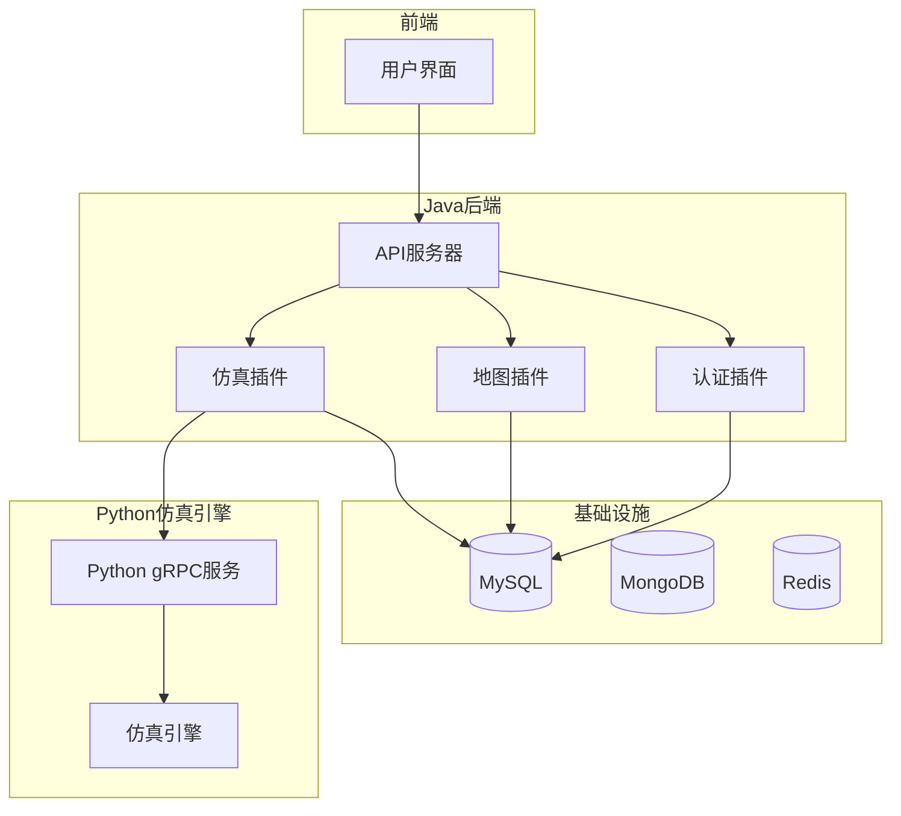
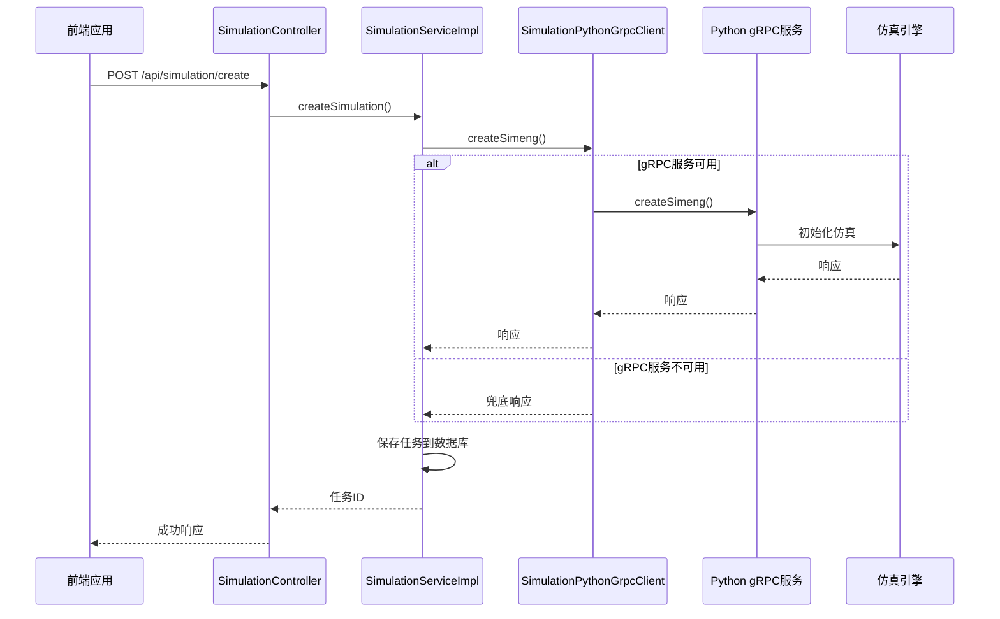
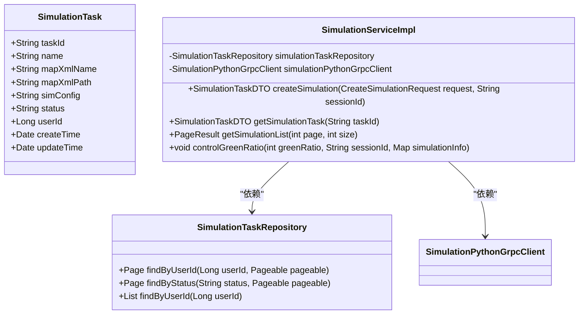
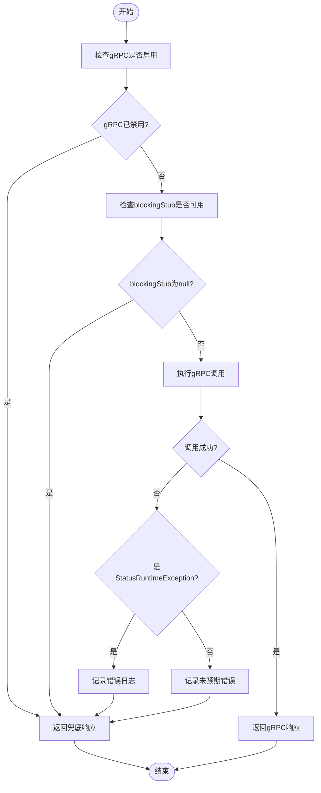
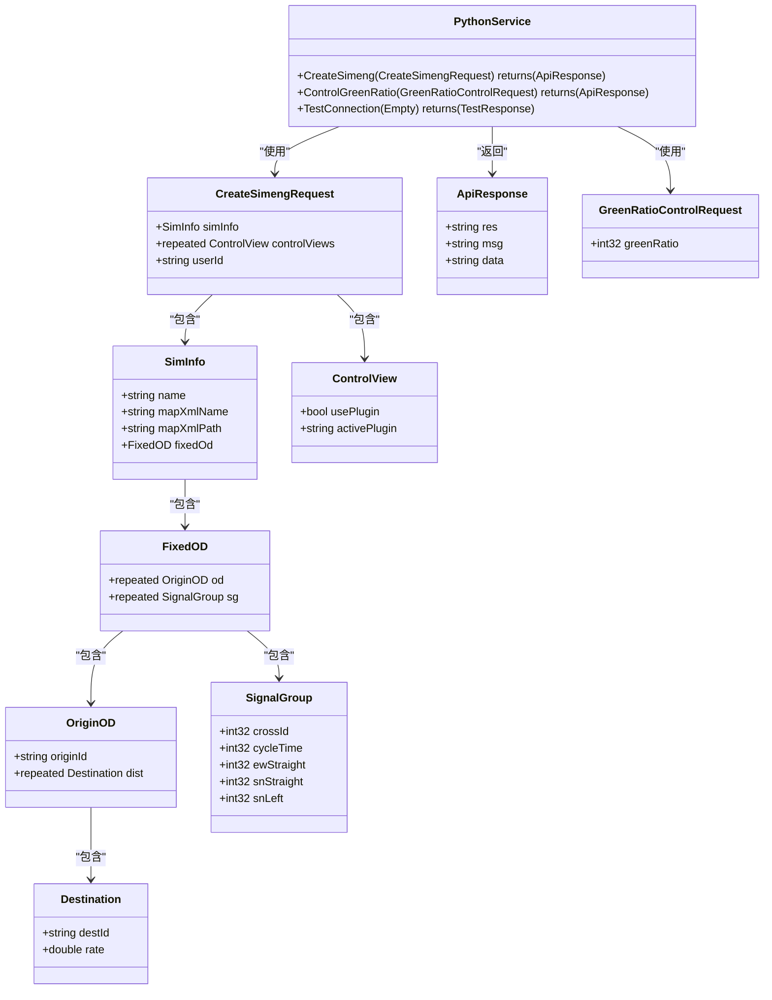
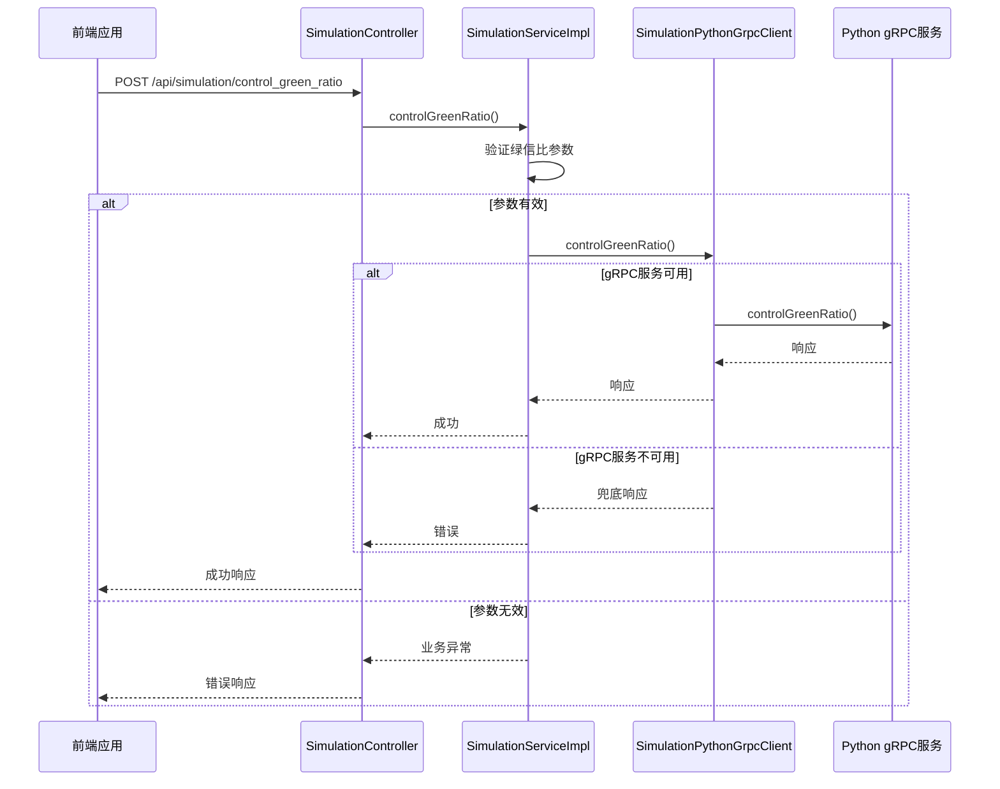
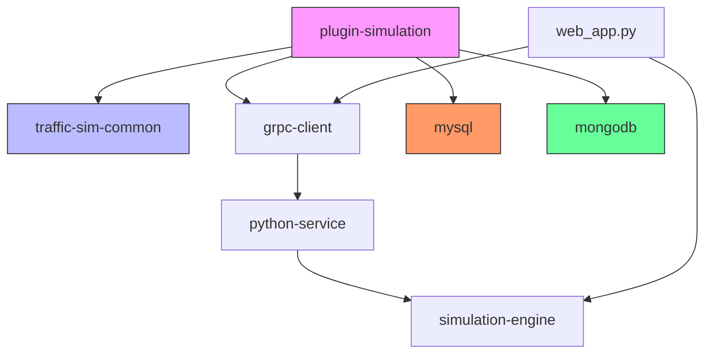

# 仿真引擎

<cite>
**本文档引用的文件**
- [SimulationPythonGrpcClient.java](file://plugins/plugin-simulation/src/main/java/com/traffic/sim/plugin/simulation/grpc/SimulationPythonGrpcClient.java)
- [python_service.proto](file://plugins/plugin-simulation/src/main/proto/python_service.proto)
- [SimulationServiceImpl.java](file://plugins/plugin-simulation/src/main/java/com/traffic/sim/plugin/simulation/service/SimulationServiceImpl.java)
- [SimulationTask.java](file://plugins/plugin-simulation/src/main/java/com/traffic/sim/plugin/simulation/entity/SimulationTask.java)
- [SimulationController.java](file://plugins/plugin-simulation/src/main/java/com/traffic/sim/plugin/simulation/controller/SimulationController.java)
- [SimulationTaskRepository.java](file://plugins/plugin-simulation/src/main/java/com/traffic/sim/plugin/simulation/repository/SimulationTaskRepository.java)
- [GrpcClientConfig.java](file://plugins/plugin-simulation/src/main/java/com/traffic/sim/plugin/simulation/config/GrpcClientConfig.java)
- [CreateSimulationRequest.java](file://traffic-sim-common/src/main/java/com/traffic/sim/common/dto/CreateSimulationRequest.java)
- [GreenRatioControlRequest.java](file://traffic-sim-common/src/main/java/com/traffic/sim/common/dto/GreenRatioControlRequest.java)
- [application.yml](file://traffic-sim-server/src/main/resources/application.yml)
- [SimulationPluginProperties.java](file://plugins/plugin-simulation/src/main/java/com/traffic/sim/plugin/simulation/config/SimulationPluginProperties.java)
- [web_app.py](file://map_convert_services/web_app.py)
</cite>

## 目录
1. [简介](#简介)
2. [项目结构](#项目结构)
3. [核心组件](#核心组件)
4. [架构概述](#架构概述)
5. [详细组件分析](#详细组件分析)
6. [依赖分析](#依赖分析)
7. [性能考虑](#性能考虑)
8. [故障排除指南](#故障排除指南)
9. [结论](#结论)

## 简介
本文档详细描述了交通仿真系统中的仿真引擎功能。文档涵盖了仿真任务的创建、执行和控制流程，重点解释了`SimulationPythonGrpcClient`如何通过gRPC协议与Python仿真引擎通信，以及`SimulationServiceImpl`如何处理仿真请求、管理任务状态并与gRPC客户端交互。文档还详细说明了仿真过程中的实时数据流和控制指令（如绿信比调整），并提供了关于gRPC超时、重试机制和错误处理的指导。

## 项目结构
该项目是一个基于微服务架构的交通仿真系统，包含多个插件模块和基础设施组件。核心仿真功能由`plugin-simulation`模块实现，该模块通过gRPC协议与Python编写的仿真引擎进行通信。系统还包括地图转换服务、用户管理、认证、统计等多个插件。

**图源**
- [application.yml](file://traffic-sim-server/src/main/resources/application.yml#L68-L81)
- [web_app.py](file://map_convert_services/web_app.py#L29-L31)

## 核心组件
本系统的核心组件包括仿真任务管理、gRPC客户端、Python仿真引擎通信协议和任务状态管理。`SimulationPythonGrpcClient`作为Java服务与Python仿真引擎之间的桥梁，实现了容错机制，当gRPC服务不可用时能够返回兜底数据。`SimulationServiceImpl`负责处理业务逻辑，管理仿真任务的生命周期，并通过gRPC客户端与仿真引擎交互。

**节源**
- [SimulationPythonGrpcClient.java](file://plugins/plugin-simulation/src/main/java/com/traffic/sim/plugin/simulation/grpc/SimulationPythonGrpcClient.java#L1-L264)
- [SimulationServiceImpl.java](file://plugins/plugin-simulation/src/main/java/com/traffic/sim/plugin/simulation/service/SimulationServiceImpl.java#L1-L191)

## 架构概述
系统采用分层架构设计，前端通过REST API与Java后端通信，Java后端通过gRPC协议与Python仿真引擎交互。仿真任务的状态信息存储在MySQL数据库中，而实时仿真数据则通过WebSocket进行传输。系统具有良好的容错性，当gRPC服务不可用时，系统仍能返回兜底响应，确保应用的可用性。

**图源**
- [SimulationController.java](file://plugins/plugin-simulation/src/main/java/com/traffic/sim/plugin/simulation/controller/SimulationController.java#L37-L60)
- [SimulationServiceImpl.java](file://plugins/plugin-simulation/src/main/java/com/traffic/sim/plugin/simulation/service/SimulationServiceImpl.java#L44-L89)
- [SimulationPythonGrpcClient.java](file://plugins/plugin-simulation/src/main/java/com/traffic/sim/plugin/simulation/grpc/SimulationPythonGrpcClient.java#L102-L124)

## 详细组件分析

### 仿真任务创建与管理
仿真任务的创建流程包括参数验证、任务ID生成、调用Python服务创建仿真引擎和保存任务记录到数据库。`SimulationTask`实体类定义了仿真任务的核心属性，包括任务ID、名称、地图配置、状态和用户信息等。

**图源**
- [SimulationTask.java](file://plugins/plugin-simulation/src/main/java/com/traffic/sim/plugin/simulation/entity/SimulationTask.java#L1-L51)
- [SimulationTaskRepository.java](file://plugins/plugin-simulation/src/main/java/com/traffic/sim/plugin/simulation/repository/SimulationTaskRepository.java#L1-L40)
- [SimulationServiceImpl.java](file://plugins/plugin-simulation/src/main/java/com/traffic/sim/plugin/simulation/service/SimulationServiceImpl.java#L1-L191)

**节源**
- [SimulationTask.java](file://plugins/plugin-simulation/src/main/java/com/traffic/sim/plugin/simulation/entity/SimulationTask.java#L1-L51)
- [SimulationTaskRepository.java](file://plugins/plugin-simulation/src/main/java/com/traffic/sim/plugin/simulation/repository/SimulationTaskRepository.java#L1-L40)

### gRPC通信机制
`SimulationPythonGrpcClient`是Java服务与Python仿真引擎之间的gRPC客户端，实现了容错机制。当gRPC服务不可用时，客户端能够返回兜底数据，确保系统的基本可用性。客户端使用`@Lazy`注解进行延迟初始化，避免应用启动时因gRPC服务不可用而失败。

**图源**
- [SimulationPythonGrpcClient.java](file://plugins/plugin-simulation/src/main/java/com/traffic/sim/plugin/simulation/grpc/SimulationPythonGrpcClient.java#L80-L124)
- [GrpcClientConfig.java](file://plugins/plugin-simulation/src/main/java/com/traffic/sim/plugin/simulation/config/GrpcClientConfig.java#L1-L36)

**节源**
- [SimulationPythonGrpcClient.java](file://plugins/plugin-simulation/src/main/java/com/traffic/sim/plugin/simulation/grpc/SimulationPythonGrpcClient.java#L1-L264)
- [GrpcClientConfig.java](file://plugins/plugin-simulation/src/main/java/com/traffic/sim/plugin/simulation/config/GrpcClientConfig.java#L1-L36)

### gRPC服务定义
`python_service.proto`文件定义了Python仿真引擎提供的gRPC服务接口，包括创建仿真引擎、绿信比控制和测试连接等方法。这些服务使用Protocol Buffers定义消息格式，确保了跨语言通信的兼容性和效率。

**图源**
- [python_service.proto](file://plugins/plugin-simulation/src/main/proto/python_service.proto#L1-L82)
- [CreateSimulationRequest.java](file://traffic-sim-common/src/main/java/com/traffic/sim/common/dto/CreateSimulationRequest.java#L1-L134)

**节源**
- [python_service.proto](file://plugins/plugin-simulation/src/main/proto/python_service.proto#L1-L82)
- [CreateSimulationRequest.java](file://traffic-sim-common/src/main/java/com/traffic/sim/common/dto/CreateSimulationRequest.java#L1-L134)

### 控制指令处理
系统支持实时控制指令，如绿信比调整。`controlGreenRatio`方法实现了这一功能，通过gRPC协议将控制指令发送到Python仿真引擎。系统具有完善的参数验证机制，确保绿信比值在0-100的有效范围内。

**图源**
- [SimulationController.java](file://plugins/plugin-simulation/src/main/java/com/traffic/sim/plugin/simulation/controller/SimulationController.java#L102-L131)
- [SimulationServiceImpl.java](file://plugins/plugin-simulation/src/main/java/com/traffic/sim/plugin/simulation/service/SimulationServiceImpl.java#L119-L144)
- [SimulationPythonGrpcClient.java](file://plugins/plugin-simulation/src/main/java/com/traffic/sim/plugin/simulation/grpc/SimulationPythonGrpcClient.java#L132-L157)

**节源**
- [GreenRatioControlRequest.java](file://traffic-sim-common/src/main/java/com/traffic/sim/common/dto/GreenRatioControlRequest.java#L1-L31)
- [SimulationController.java](file://plugins/plugin-simulation/src/main/java/com/traffic/sim/plugin/simulation/controller/SimulationController.java#L102-L131)

## 依赖分析
系统的主要依赖关系包括Java后端模块之间的依赖、Java与Python服务之间的gRPC依赖，以及与数据库的依赖。`plugin-simulation`模块依赖于`traffic-sim-common`模块共享DTO和常量，同时通过gRPC依赖Python仿真引擎。数据库依赖包括MySQL用于持久化仿真任务，MongoDB可能用于存储仿真结果数据。

**图源**
- [pom.xml](file://plugins/plugin-simulation/pom.xml)
- [application.yml](file://traffic-sim-server/src/main/resources/application.yml#L5-L40)
- [web_app.py](file://map_convert_services/web_app.py#L17-L18)

**节源**
- [pom.xml](file://plugins/plugin-simulation/pom.xml)
- [application.yml](file://traffic-sim-server/src/main/resources/application.yml#L5-L40)

## 性能考虑
系统的性能考虑主要体现在gRPC通信的配置、数据库访问优化和容错机制设计上。gRPC客户端配置了连接保持（keep-alive）机制，减少了连接建立的开销。系统采用了延迟初始化和容错机制，确保在gRPC服务不可用时应用仍能正常启动和运行。数据库访问通过Spring Data JPA实现，支持分页查询以避免大数据量加载。

在配置文件中，gRPC客户端设置了连接保持参数：
- keepAliveTime: 30s
- keepAliveTimeout: 5s
- enableKeepAlive: true

这些配置有助于维持长连接，减少频繁建立和断开连接的开销，提高通信效率。同时，系统通过`@Lazy`注解实现了延迟初始化，避免了启动时的依赖问题。

## 故障排除指南
当遇到仿真引擎相关问题时，可以按照以下步骤进行排查：

1. **检查gRPC服务状态**：确认Python gRPC服务是否在运行，监听端口50051。
2. **查看日志信息**：检查Java应用日志中是否有gRPC连接失败的错误信息。
3. **验证配置文件**：确认`application.yml`中的gRPC客户端配置是否正确。
4. **检查网络连接**：确保Java服务能够访问Python服务所在的主机和端口。
5. **验证参数输入**：确保创建仿真和控制指令的参数符合要求，特别是绿信比值应在0-100范围内。

当gRPC服务不可用时，系统会返回兜底响应，日志中会记录相关警告信息。这种设计确保了系统的高可用性，即使在部分服务故障的情况下，系统仍能提供基本功能。

**节源**
- [SimulationPythonGrpcClient.java](file://plugins/plugin-simulation/src/main/java/com/traffic/sim/plugin/simulation/grpc/SimulationPythonGrpcClient.java#L104-L123)
- [application.yml](file://traffic-sim-server/src/main/resources/application.yml#L68-L81)

## 结论
本文档详细描述了交通仿真系统的仿真引擎功能，包括任务创建、执行、控制流程以及gRPC通信机制。系统采用分层架构设计，通过gRPC协议实现Java后端与Python仿真引擎的高效通信。系统具有良好的容错性，当gRPC服务不可用时能够返回兜底数据，确保应用的可用性。通过完善的参数验证、错误处理和日志记录机制，系统能够稳定可靠地运行。未来可以进一步优化gRPC超时和重试机制，提高系统的健壮性和用户体验。