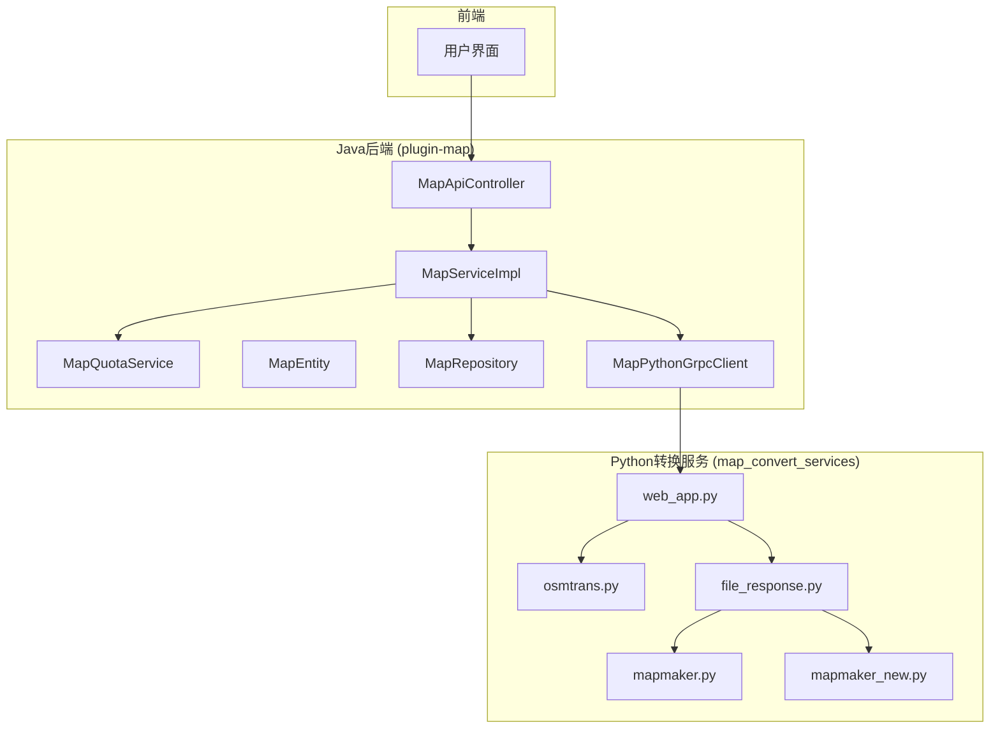
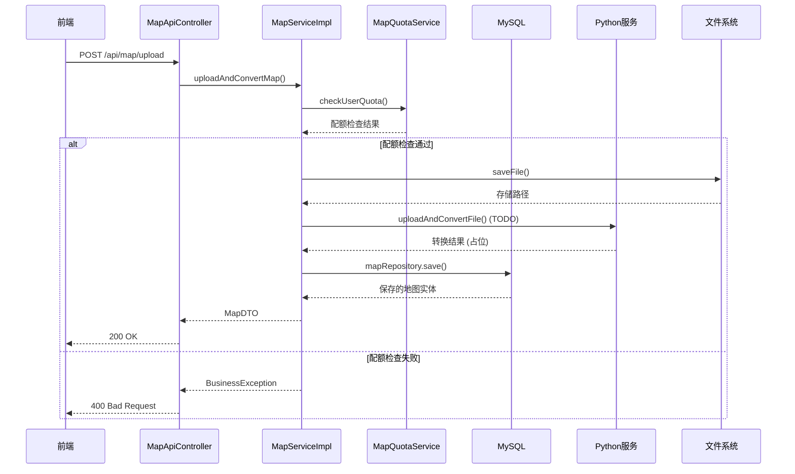
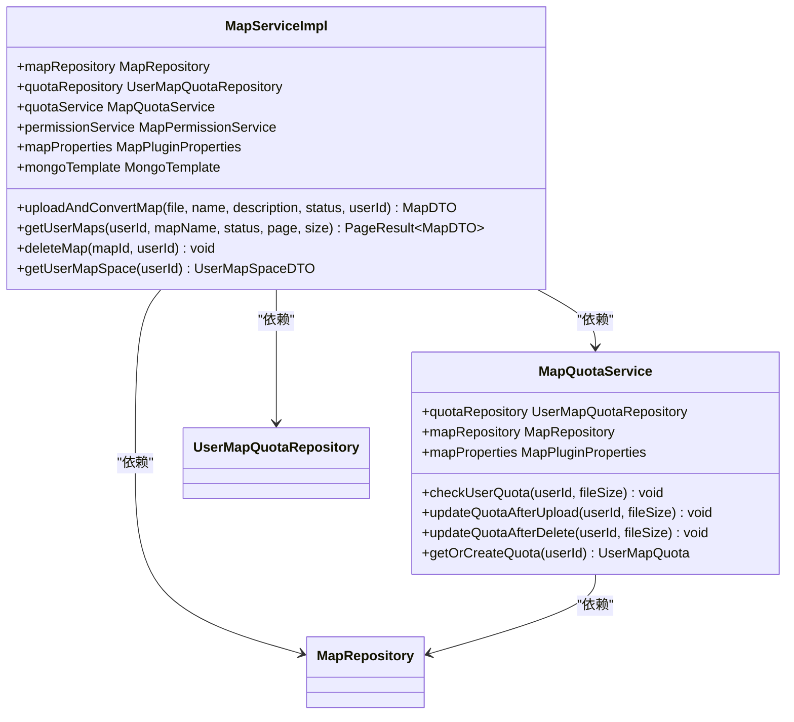
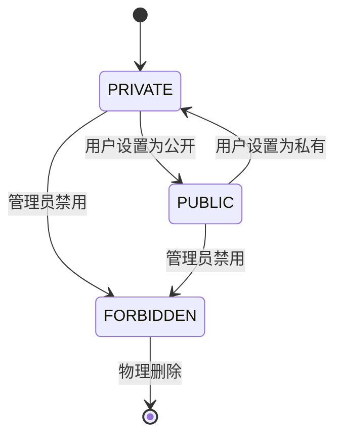
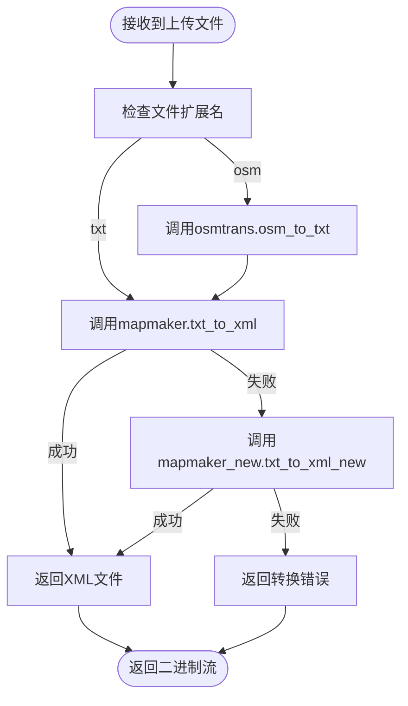

# 地图管理

<cite>
**本文档引用的文件**   
- [MapServiceImpl.java](file://plugins\plugin-map\src\main\java\com\traffic\sim\plugin\map\service\MapServiceImpl.java)
- [MapEntity.java](file://plugins\plugin-map\src\main\java\com\traffic\sim\plugin\map\entity\MapEntity.java)
- [UserMapQuota.java](file://plugins\plugin-map\src\main\java\com\traffic\sim\plugin\map\entity\UserMapQuota.java)
- [MapQuotaService.java](file://plugins\plugin-map\src\main\java\com\traffic\sim\plugin\map\service\MapQuotaService.java)
- [MapRepository.java](file://plugins\plugin-map\src\main\java\com\traffic\sim\plugin\map\repository\MapRepository.java)
- [UserMapQuotaRepository.java](file://plugins\plugin-map\src\main\java\com\traffic\sim\plugin\map\repository\UserMapQuotaRepository.java)
- [MapPluginProperties.java](file://plugins\plugin-map\src\main\java\com\traffic\sim\plugin\map\config\MapPluginProperties.java)
- [MapApiController.java](file://plugins\plugin-map\src\main\java\com\traffic\sim\plugin\map\controller\MapApiController.java)
- [MapPythonGrpcClient.java](file://plugins\plugin-map\src\main\java\com\traffic\sim\plugin\map\client\MapPythonGrpcClient.java)
- [PythonGrpcClient.java](file://plugins\plugin-map\src\main\java\com\traffic\sim\plugin\map\client\PythonGrpcClient.java)
- [osmtrans.py](file://map_convert_services\map_utils\osmtrans.py)
- [file_response.py](file://map_convert_services\utils\file_response.py)
- [mapmaker.py](file://map_convert_services\map_utils\mapmaker.py)
- [mapmaker_new.py](file://map_convert_services\map_utils\mapmaker_new.py)
- [web_app.py](file://map_convert_services\web_app.py)
</cite>

## 目录
1. [简介](#简介)
2. [项目结构](#项目结构)
3. [核心组件](#核心组件)
4. [架构概述](#架构概述)
5. [详细组件分析](#详细组件分析)
6. [依赖分析](#依赖分析)
7. [性能考虑](#性能考虑)
8. [故障排除指南](#故障排除指南)
9. [结论](#结论)
10. [附录](#附录)

## 简介
本文档全面创建地图管理功能的内容，解释地图上传、格式转换（OSM/TXT到XML）、存储和配额管理的完整流程。详细描述`MapServiceImpl`如何协调文件存储、调用Python gRPC服务进行转换（尽管当前为TODO）和数据库持久化。文档化`MapEntity`的字段和状态机（如PRIVATE状态）。深入分析Python地图转换服务（map_convert_services）的实现，特别是`osmtrans.py`和`file_response.py`中的转换逻辑。指出当前gRPC集成未完成的已知问题，并说明临时的处理方式。

## 项目结构
地图管理功能主要由两个核心部分组成：Java Spring Boot插件`plugin-map`和Python地图转换服务`map_convert_services`。`plugin-map`负责处理HTTP请求、用户权限、配额管理和数据库操作，而`map_convert_services`是一个独立的FastAPI应用，专门负责地图文件的格式转换。



**图源**
- [MapApiController.java](file://plugins\plugin-map\src\main\java\com\traffic\sim\plugin\map\controller\MapApiController.java)
- [MapServiceImpl.java](file://plugins\plugin-map\src\main\java\com\traffic\sim\plugin\map\service\MapServiceImpl.java)
- [MapQuotaService.java](file://plugins\plugin-map\src\main\java\com\traffic\sim\plugin\map\service\MapQuotaService.java)
- [MapEntity.java](file://plugins\plugin-map\src\main\java\com\traffic\sim\plugin\map\entity\MapEntity.java)
- [MapRepository.java](file://plugins\plugin-map\src\main\java\com\traffic\sim\plugin\map\repository\MapRepository.java)
- [MapPythonGrpcClient.java](file://plugins\plugin-map\src\main\java\com\traffic\sim\plugin\map\client\MapPythonGrpcClient.java)
- [web_app.py](file://map_convert_services\web_app.py)
- [osmtrans.py](file://map_convert_services\map_utils\osmtrans.py)
- [file_response.py](file://map_convert_services\utils\file_response.py)
- [mapmaker.py](file://map_convert_services\map_utils\mapmaker.py)
- [mapmaker_new.py](file://map_convert_services\map_utils\mapmaker_new.py)

## 核心组件

`MapServiceImpl`是地图管理功能的核心服务类，它实现了`MapService`接口，协调了文件上传、配额检查、文件存储、数据库持久化和调用外部Python服务进行格式转换的整个流程。`MapEntity`定义了地图在数据库中的数据模型，包含地图名称、描述、文件路径、所有者ID和状态等关键字段。`MapQuotaService`负责管理用户的地图配额，确保用户不会超出其存储空间和地图数量的限制。

**组件源**
- [MapServiceImpl.java](file://plugins\plugin-map\src\main\java\com\traffic\sim\plugin\map\service\MapServiceImpl.java#L43-L395)
- [MapEntity.java](file://plugins\plugin-map\src\main\java\com\traffic\sim\plugin\map\entity\MapEntity.java#L16-L116)
- [MapQuotaService.java](file://plugins\plugin-map\src\main\java\com\traffic\sim\plugin\map\service\MapQuotaService.java#L24-L115)

## 架构概述

地图管理功能的架构是一个典型的前后端分离、微服务风格的设计。前端通过HTTP请求与Java后端的`MapApiController`交互。`MapApiController`接收上传请求后，将业务逻辑委托给`MapServiceImpl`。`MapServiceImpl`首先调用`MapQuotaService`检查用户配额，然后将文件保存到本地磁盘，最后将文件信息持久化到MySQL数据库。对于格式转换，`MapServiceImpl`本应通过gRPC调用Python服务，但此功能尚未实现。



**图源**
- [MapApiController.java](file://plugins\plugin-map\src\main\java\com\traffic\sim\plugin\map\controller\MapApiController.java#L34-L45)
- [MapServiceImpl.java](file://plugins\plugin-map\src\main\java\com\traffic\sim\plugin\map\service\MapServiceImpl.java#L80-L120)
- [MapQuotaService.java](file://plugins\plugin-map\src\main\java\com\traffic\sim\plugin\map\service\MapQuotaService.java#L33-L45)
- [MapRepository.java](file://plugins\plugin-map\src\main\java\com\traffic\sim\plugin\map\repository\MapRepository.java#L25-L26)

## 详细组件分析

### MapServiceImpl 分析
`MapServiceImpl`是地图管理功能的业务逻辑中心。它通过`uploadAndConvertMap`方法处理地图上传的核心流程。该方法首先验证文件的有效性（大小和扩展名），然后调用`MapQuotaService`检查用户配额。配额检查通过后，文件被保存到由`MapPluginProperties`配置的存储路径下。最后，一个`MapEntity`被创建并保存到数据库中，同时更新用户的配额信息。

#### 服务类图


**图源**
- [MapServiceImpl.java](file://plugins\plugin-map\src\main\java\com\traffic\sim\plugin\map\service\MapServiceImpl.java)
- [MapQuotaService.java](file://plugins\plugin-map\src\main\java\com\traffic\sim\plugin\map\service\MapQuotaService.java)
- [MapRepository.java](file://plugins\plugin-map\src\main\java\com\traffic\sim\plugin\map\repository\MapRepository.java)
- [UserMapQuotaRepository.java](file://plugins\plugin-map\src\main\java\com\traffic\sim\plugin\map\repository\UserMapQuotaRepository.java)

### MapEntity 分析
`MapEntity`是地图数据的JPA实体类，它映射到MySQL数据库中的`map`表。该实体定义了地图的所有属性，包括唯一标识符`id`、业务ID`mapId`、名称、描述、文件路径、所有者ID、状态和文件大小。其核心是`MapStatus`枚举，它定义了地图的生命周期状态。

#### 状态机图


**图源**
- [MapEntity.java](file://plugins\plugin-map\src\main\java\com\traffic\sim\plugin\map\entity\MapEntity.java#L70-L98)

### Python 地图转换服务分析
Python地图转换服务是一个独立的FastAPI应用，其核心功能在`web_app.py`中定义。`/fileupload`端点接收上传的文件，将其保存到缓存目录，然后调用`file_response.py`中的`map_convert_to_binary`函数进行转换。`file_response.py`根据文件扩展名（`.osm`或`.txt`）调用`osmtrans.py`或`mapmaker.py`/`mapmaker_new.py`进行转换。

#### 转换逻辑流程图


**图源**
- [web_app.py](file://map_convert_services\web_app.py#L52-L81)
- [file_response.py](file://map_convert_services\utils\file_response.py#L8-L55)
- [osmtrans.py](file://map_convert_services\map_utils\osmtrans.py#L29-L448)
- [mapmaker.py](file://map_convert_services\map_utils\mapmaker.py#L30-L129)
- [mapmaker_new.py](file://map_convert_services\map_utils\mapmaker_new.py#L32-L184)

## 依赖分析

地图管理功能的依赖关系清晰地分为Java和Python两个独立的模块。Java模块`plugin-map`依赖于`traffic-sim-common`模块以获取DTO和异常定义，并依赖于Spring Boot和JPA框架。Python模块`map_convert_services`依赖于FastAPI、uvicorn、gekko、sympy等库。两个模块之间通过未实现的gRPC协议进行通信，目前Java端使用占位实现。

```mermaid
graph TD
subgraph "Java模块"
plugin_map[plugin-map]
common[traffic-sim-common]
spring_boot[Spring Boot]
jpa[JPA]
plugin_map --> common
plugin_map --> spring_boot
plugin_map --> jpa
end
subgraph "Python模块"
map_convert[map_convert_services]
fastapi[FastAPI]
uvicorn[uvicorn]
gekko[gekko]
sympy[sympy]
numpy[numpy]
map_convert --> fastapi
map_convert --> uvicorn
map_convert --> gekko
map_convert --> sympy
map_convert --> numpy
end
plugin_map -.-> map_convert : gRPC (TODO)
```

**图源**
- [pom.xml](file://plugins\plugin-map\pom.xml)
- [requirements.txt](file://map_convert_services\requirements.txt) (隐含)
- [MapPythonGrpcClient.java](file://plugins\plugin-map\src\main\java\com\traffic\sim\plugin\map\client\MapPythonGrpcClient.java#L26-L41)

## 性能考虑

地图管理功能的性能主要受文件I/O操作和格式转换算法的影响。文件上传和保存是I/O密集型操作，应确保存储路径位于高性能磁盘上。`osmtrans.py`中的地图转换算法涉及复杂的几何计算和字符串操作，可能成为性能瓶颈，特别是对于大型OSM文件。建议对转换过程进行性能监控，并考虑对大型文件进行异步处理。

## 故障排除指南

### gRPC集成未完成问题
**问题描述**：`MapPythonGrpcClient`和`PythonGrpcClient`中的`uploadAndConvertFile`方法目前是占位实现，日志中会输出`gRPC client not implemented yet, using placeholder`警告，导致无法真正调用Python服务进行文件转换。

**临时解决方案**：
1.  **使用HTTP替代**：`MapServiceImpl`中的`uploadAndConvertMap`方法注释掉gRPC调用，直接保存文件并返回成功。这与`web_app.py`的`/fileupload`端点功能重复，但可以绕过gRPC。
2.  **直接调用Python脚本**：在`MapServiceImpl`中，使用`Runtime.getRuntime().exec()`或`ProcessBuilder`直接执行Python脚本命令，进行文件转换。
3.  **使用HTTP客户端**：在`MapServiceImpl`中，使用`RestTemplate`或`WebClient`直接调用`map_convert_services`的`/fileupload`HTTP端点，而不是gRPC。

**根本解决方案**：需要根据`map_convert_services`的预期接口定义Protocol Buffers（`.proto`）文件，然后在Java和Python两端生成gRPC存根代码，实现真正的gRPC通信。

**组件源**
- [MapPythonGrpcClient.java](file://plugins\plugin-map\src\main\java\com\traffic\sim\plugin\map\client\MapPythonGrpcClient.java#L26-L41)
- [MapServiceImpl.java](file://plugins\plugin-map\src\main\java\com\traffic\sim\plugin\map\service\MapServiceImpl.java#L92-L94)

## 结论

地图管理功能提供了一个完整的地图上传、存储和配额管理解决方案。其架构设计合理，将业务逻辑与文件转换逻辑分离。`MapEntity`的状态机清晰地定义了地图的生命周期。然而，核心的gRPC集成尚未完成，这是一个关键的已知问题。目前的实现依赖于占位代码，无法真正执行格式转换。推荐的解决方案是尽快定义gRPC接口并实现两端的调用，以完成整个功能闭环。

## 附录

### MapEntity 字段定义
| 字段名 | 类型 | 描述 | 是否可为空 |
| :--- | :--- | :--- | :--- |
| id | Long | 数据库主键 | 否 |
| mapId | String | 业务唯一ID | 否 |
| name | String | 地图名称 | 否 |
| description | String | 地图描述 | 是 |
| filePath | String | 文件路径 | 否 |
| fileName | String | 原始文件名 | 是 |
| xmlFileName | String | XML文件名 | 是 |
| mapImage | String | 地图图片（Base64） | 是 |
| ownerId | Long | 所有者用户ID | 否 |
| status | MapStatus | 地图状态 | 否 |
| fileSize | Long | 文件大小（字节） | 是 |
| storagePath | String | 存储路径 | 是 |
| createTime | Date | 创建时间 | 否 |
| updateTime | Date | 更新时间 | 否 |

**组件源**
- [MapEntity.java](file://plugins\plugin-map\src\main\java\com\traffic\sim\plugin\map\entity\MapEntity.java)

### MapStatus 状态码
| 状态码 | 枚举值 | 描述 |
| :--- | :--- | :--- |
| 0 | PUBLIC | 公开地图，所有用户可见 |
| 1 | PRIVATE | 私有地图，仅所有者可见 |
| 2 | FORBIDDEN | 禁用地图，管理员操作 |

**组件源**
- [MapEntity.java](file://plugins\plugin-map\src\main\java\com\traffic\sim\plugin\map\entity\MapEntity.java#L71-L73)