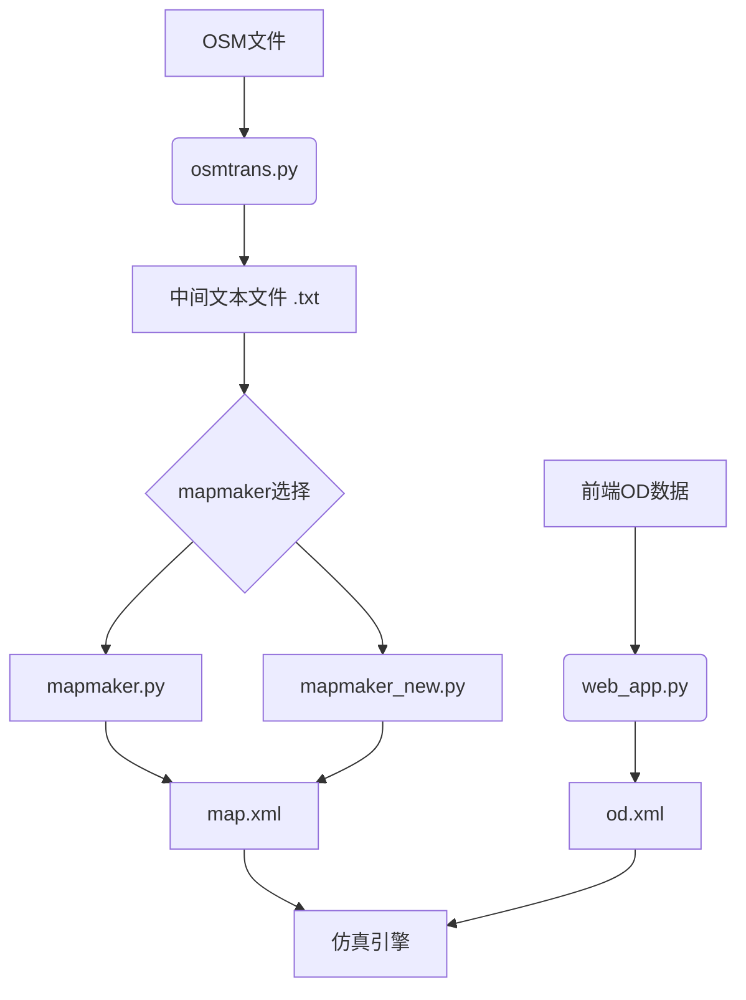
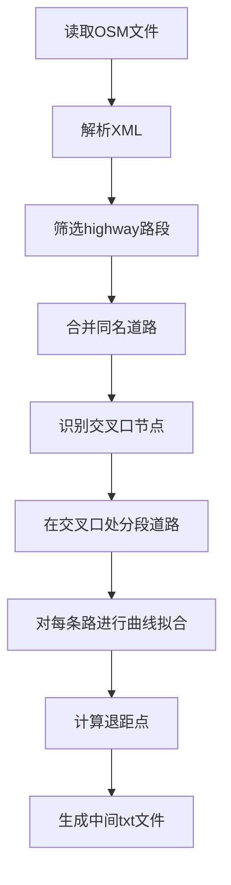
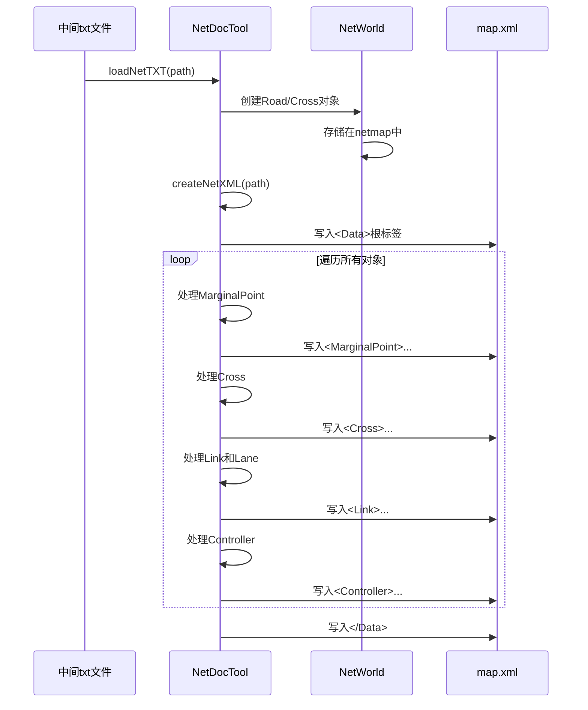
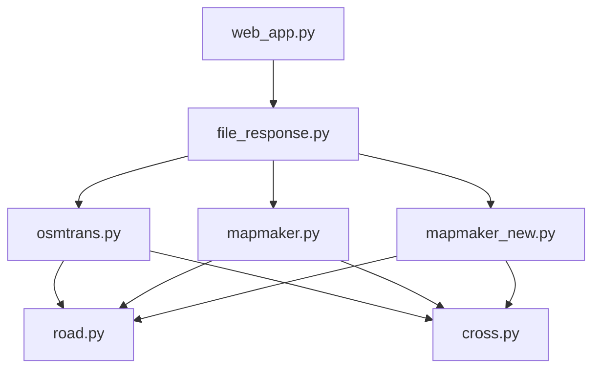

# Python地图转换脚本

<cite>
**本文档引用的文件**   
- [osmtrans.py](file://map_convert_services/map_utils/osmtrans.py)
- [mapmaker.py](file://map_convert_services/map_utils/mapmaker.py)
- [mapmaker_new.py](file://map_convert_services/map_utils/mapmaker_new.py)
- [road.py](file://map_convert_services/map_utils/road.py)
- [cross.py](file://map_convert_services/cross.py)
- [file_response.py](file://map_convert_services/utils/file_response.py)
</cite>

## 目录
1. [简介](#简介)
2. [项目结构](#项目结构)
3. [核心组件](#核心组件)
4. [架构概述](#架构概述)
5. [详细组件分析](#详细组件分析)
6. [依赖分析](#依赖分析)
7. [性能考虑](#性能考虑)
8. [故障排除指南](#故障排除指南)
9. [结论](#结论)

## 简介
本文档深入分析了Python地图转换脚本的实现机制，重点解析了`osmtrans.py`如何解析OSM（OpenStreetMap）原始数据，提取道路、交叉口等交通要素，并调用`road.py`中的几何处理逻辑进行拓扑构建。文档详细说明了`mapmaker.py`如何将处理后的数据序列化为系统专用的`map.xml`和`od.xml`格式，以及`mapmaker_new.py`与旧版的设计差异和演进意图。同时，指出了当前脚本作为独立运行模块的局限性，并提出了将其重构为可导入的Python包以支持gRPC服务集成的建议。

## 项目结构
地图转换服务位于`map_convert_services`目录下，其核心功能模块位于`map_utils`子目录中。主要包含四个核心Python脚本：`osmtrans.py`负责OSM数据解析和初步处理，`mapmaker.py`和`mapmaker_new.py`负责将中间格式转换为最终的XML输出，`road.py`和`cross.py`则定义了核心数据结构。该服务通过`web_app.py`提供FastAPI接口，`utils`目录下的工具类（如`file_response.py`）处理文件上传和转换逻辑。

**Section sources**
- [osmtrans.py](file://map_convert_services/map_utils/osmtrans.py#L1-L1255)
- [mapmaker.py](file://map_convert_services/map_utils/mapmaker.py#L1-L610)
- [mapmaker_new.py](file://map_convert_services/map_utils/mapmaker_new.py#L1-L748)
- [road.py](file://map_convert_services/map_utils/road.py#L1-L54)
- [cross.py](file://map_convert_services/cross.py#L1-L54)
- [file_response.py](file://map_convert_services/utils/file_response.py#L1-L107)

## 核心组件
核心组件包括`osmtrans.py`中的`deal_xml`类，用于解析OSM XML文件并执行道路合并、交叉口识别和退距点计算；`mapmaker.py`和`mapmaker_new.py`中的`NetDocTool`类，负责将中间文本格式转换为最终的`map.xml`；以及`road.py`和`cross.py`中定义的`Road`和`Cross`类，作为数据处理和转换过程中的核心数据模型。

**Section sources**
- [osmtrans.py](file://map_convert_services/map_utils/osmtrans.py#L42-L1255)
- [mapmaker.py](file://map_convert_services/map_utils/mapmaker.py#L26-L610)
- [mapmaker_new.py](file://map_convert_services/map_utils/mapmaker_new.py#L28-L748)
- [road.py](file://map_convert_services/map_utils/road.py#L27-L54)
- [cross.py](file://map_convert_services/cross.py#L27-L54)

## 架构概述
整个地图转换流程是一个多阶段的管道。首先，`osmtrans.py`接收OSM文件作为输入，解析其XML结构，提取道路（way）和节点（node）数据。它执行关键的拓扑处理，如合并同名道路、识别交叉口、计算退距点，并将结果输出为一个特定的中间文本格式（.txt）。随后，`mapmaker.py`或`mapmaker_new.py`读取此中间文件，将其解析为内存中的`Road`和`Cross`对象，并最终序列化为符合仿真引擎要求的`map.xml`格式。`od.xml`文件则由前端通过`web_app.py`服务在初始化仿真时动态生成。

**Diagram sources**
- [osmtrans.py](file://map_convert_services/map_utils/osmtrans.py#L1215-L1238)
- [mapmaker.py](file://map_convert_services/map_utils/mapmaker.py#L575-L597)
- [mapmaker_new.py](file://map_convert_services/map_utils/mapmaker_new.py#L715-L737)
- [file_response.py](file://map_convert_services/utils/file_response.py#L8-L55)

## 详细组件分析

### osmtrans.py 分析
`osmtrans.py`是整个转换流程的入口和核心处理引擎。它通过`deal_xml`类的`parse_xml`方法解析OSM文件。该方法首先遍历所有`<way>`元素，筛选出`k="highway"`的路段，并根据`k="name"`的值进行同名道路合并（`hb_to_two_way`方法），以解决道路分段问题。接着，通过计算所有路段节点的交集来识别交叉口（`cross_id_way_idx_dict`）。然后，它将长路段在交叉口处进行分段，形成独立的“道路”单元。最后，它执行关键的几何处理：使用`Find_xs`方法对每条道路的节点进行六阶多项式曲线拟合，并利用`Gekko`优化库求解距离交叉口10个单位的“退距点”坐标，这些点用于后续的信号灯控制逻辑。

#### osmtrans.py 数据流

**Diagram sources**
- [osmtrans.py](file://map_convert_services/map_utils/osmtrans.py#L47-L498)
- [osmtrans.py](file://map_convert_services/map_utils/osmtrans.py#L643-L644)
- [osmtrans.py](file://map_convert_services/map_utils/osmtrans.py#L1066-L1083)

**Section sources**
- [osmtrans.py](file://map_convert_services/map_utils/osmtrans.py#L42-L1255)

### mapmaker.py 与 mapmaker_new.py 分析
`mapmaker.py`和`mapmaker_new.py`是两个功能相似但实现不同的模块，用于将`osmtrans.py`生成的中间文本文件转换为最终的`map.xml`。它们都基于`NetWorld`和`NetDocTool`类的架构。

`mapmaker.py`首先解析文本文件，根据行首标识符'R'（道路）和'C'（交叉口）创建`Road`和`Cross`对象并存储在`NetWorld`的`netmap`字典中。在`createNetXML`方法中，它遍历这些对象，生成XML结构。它会创建`Link`元素来表示道路的双向连接，并根据连接关系（M-边缘点，C-交叉口）判断源点（Is_Origin）和终点（Is_Dest）。对于交叉口，它会生成`Controller`元素，其中硬编码了6个相位的信号灯控制方案。

`mapmaker_new.py`是`mapmaker.py`的改进版本。其主要演进意图在于更精确地处理边缘点（Marginal Point）。旧版`mapmaker.py`简单地将孤立道路的端点作为边缘点，而新版`mapmaker_new.py`在`loadNetTXT`方法中，通过计算道路端点与相邻交叉口的距离，选择距离最远的点作为边缘点，这在拓扑上更为合理。此外，新版代码的注释更清晰，逻辑分层更明确。

#### mapmaker.py 与 mapmaker_new.py 转换流程

**Diagram sources**
- [mapmaker.py](file://map_convert_services/map_utils/mapmaker.py#L30-L129)
- [mapmaker.py](file://map_convert_services/map_utils/mapmaker.py#L130-L537)
- [mapmaker_new.py](file://map_convert_services/map_utils/mapmaker_new.py#L32-L185)
- [mapmaker_new.py](file://map_convert_services/map_utils/mapmaker_new.py#L186-L676)

**Section sources**
- [mapmaker.py](file://map_convert_services/map_utils/mapmaker.py#L26-L610)
- [mapmaker_new.py](file://map_convert_services/map_utils/mapmaker_new.py#L28-L748)

### road.py 与 cross.py 分析
`road.py`和`cross.py`文件定义了地图转换过程中使用的两个核心数据模型。

`road.py`中的`Road`类代表一条道路，其属性包括`id`（道路ID）、`leftcross`和`rightcross`（左右连接的交叉口ID）、`tp`（道路类型，直路's'或弯路'c'）、`leftcnt`和`rightcnt`（左右车道数）、`eachw`（车道宽度）以及`anchors`（构成道路的节点坐标列表）。`MarginalPt`类用于表示不连接任何交叉口的道路端点。

`cross.py`中的`Cross`类代表一个交叉口，其属性包括`id`（交叉口ID）、`type`（类型，0为十字路口，1为T型路口等）、`north`、`south`、`west`、`est`（连接的四个方向的道路ID）、`lanecnt`（连接的路段数）、`center`（中心坐标）和`radius`（半径）。这些类为`mapmaker`系列脚本提供了操作和序列化的数据基础。

**Section sources**
- [road.py](file://map_convert_services/map_utils/road.py#L7-L54)
- [cross.py](file://map_convert_services/cross.py#L27-L54)

## 依赖分析
`osmtrans.py`直接依赖于`road.py`和`cross.py`中的数据结构，并使用了`numpy`、`sympy`和`gekko`等科学计算库来处理几何和优化问题。`mapmaker.py`和`mapmaker_new.py`同样依赖`road.py`和`cross.py`。`file_response.py`作为服务层，依赖于`osmtrans`、`mapmaker`和`mapmaker_new`这三个模块来执行实际的转换任务。整个`map_convert_services`作为一个独立的服务，通过`web_app.py`暴露API，与前端和其他Java插件（如`plugin-map`）进行交互。

**Diagram sources**
- [file_response.py](file://map_convert_services/utils/file_response.py#L5)
- [osmtrans.py](file://map_convert_services/map_utils/osmtrans.py#L19)
- [mapmaker.py](file://map_convert_services/map_utils/mapmaker.py#L19)
- [mapmaker_new.py](file://map_convert_services/map_utils/mapmaker_new.py#L25)

**Section sources**
- [file_response.py](file://map_convert_services/utils/file_response.py#L1-L107)

## 性能考虑
`osmtrans.py`中的几何计算是性能瓶颈。使用`gekko`库求解非线性方程组来计算退距点虽然精度高，但计算开销较大。代码中注释了`solve`、`Newton`和`string_cut`等其他方法，表明团队在探索更高效的算法。此外，`mapmaker_new.py`中通过距离计算选择边缘点的逻辑也增加了额外的计算量。对于大规模OSM文件，这些计算密集型操作可能导致转换时间过长。

## 故障排除指南
- **转换失败，无输出文件**：检查输入的OSM文件是否有效，确保`osmtrans.py`脚本中没有抛出异常。查看`web_app.py`的日志以获取更详细的错误信息。
- **生成的XML文件结构错误**：检查中间txt文件的格式是否正确。`osmtrans.py`的输出必须严格遵循`mapmaker.py`的解析规则。
- **退距点计算失败**：这通常由`gekko`求解器无法收敛引起。可以尝试调整初始点`jx_point`或考虑使用其他求解方法（如牛顿法）。
- **gRPC集成失败**：根据`plugin-map-Issue.md`文件，当前Java端的gRPC客户端尚未实现，这是导致集成失败的主要原因。

**Section sources**
- [osmtrans.py](file://map_convert_services/map_utils/osmtrans.py#L1215-L1238)
- [mapmaker.py](file://map_convert_services/map_utils/mapmaker.py#L575-L597)
- [web_app.py](file://map_convert_services/web_app.py#L186-L188)
- [plugin-map-Issue.md](file://plugins/plugin-map/plugin-map-Issue.md#L1-L50)

## 结论
现有的Python地图转换脚本实现了从OSM数据到仿真引擎专用格式的完整转换链。`osmtrans.py`负责复杂的拓扑和几何处理，而`mapmaker.py`系列脚本则负责数据序列化。然而，当前的设计存在明显局限：脚本作为独立的可执行文件运行，通过文件I/O进行通信，这不利于与gRPC等现代服务框架集成。建议将`osmtrans`、`mapmaker`和`mapmaker_new`重构为一个可导入的Python包，提供清晰的函数接口（如`convert_osm_to_xml(osm_path, xml_path)`），并移除`__main__`块和文件I/O的硬编码路径。这样，`web_app.py`或未来的gRPC服务可以直接调用这些函数，实现更高效、更灵活的集成。