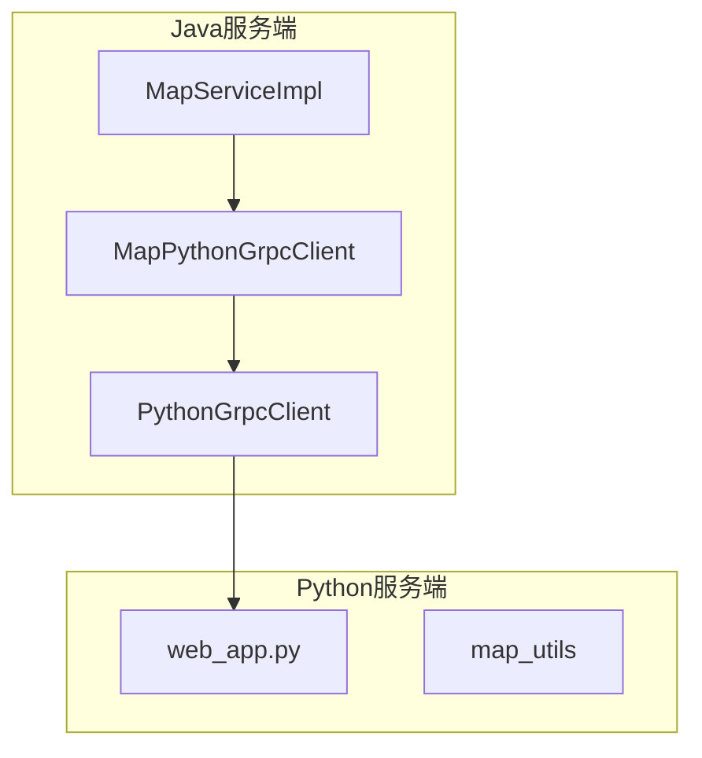
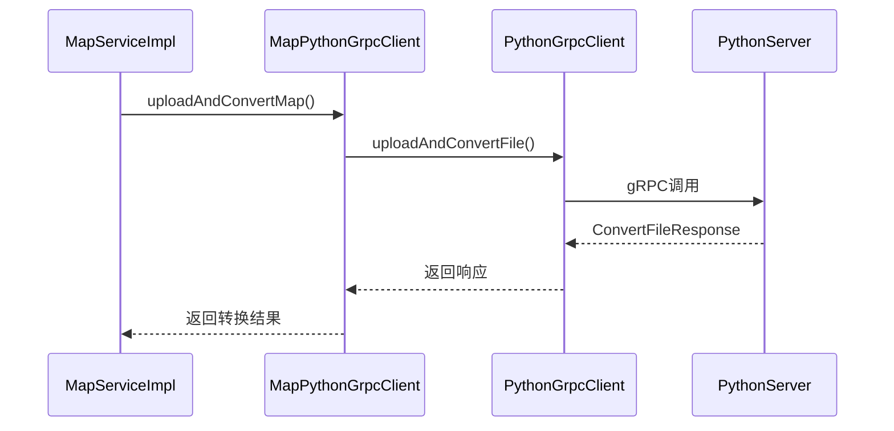
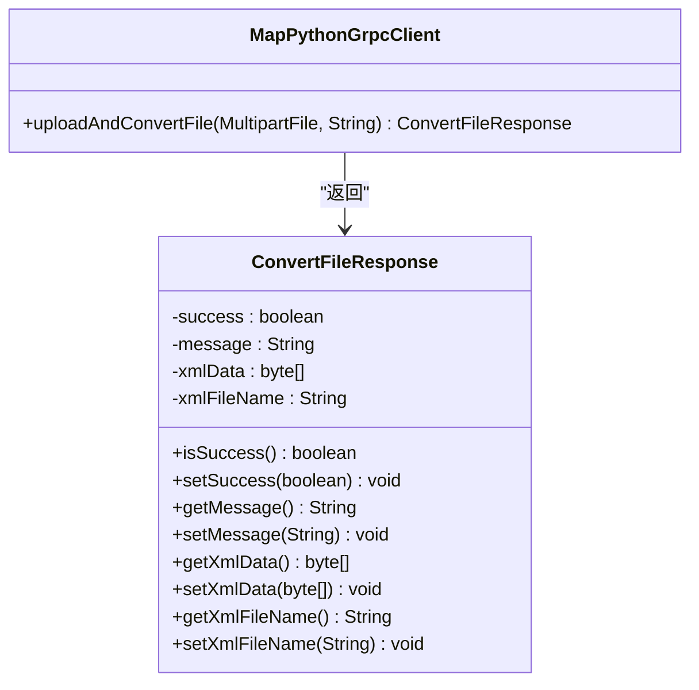
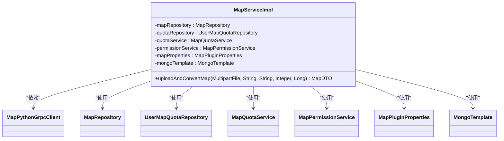
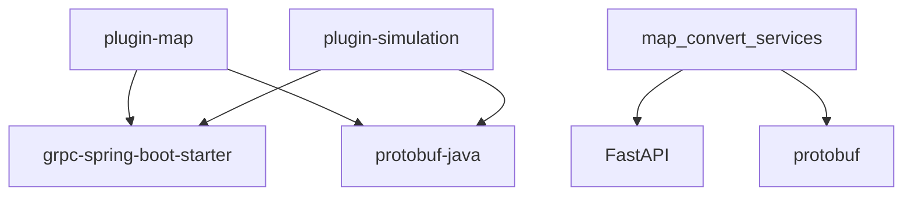

# gRPC客户端集成

<cite>
**本文档引用的文件**  
- [MapPythonGrpcClient.java](file://plugins/plugin-map/src/main/java/com/traffic/sim/plugin/map/client/MapPythonGrpcClient.java)
- [PythonGrpcClient.java](file://plugins/plugin-map/src/main/java/com/traffic/sim/plugin/map/client/PythonGrpcClient.java)
- [MapServiceImpl.java](file://plugins/plugin-map/src/main/java/com/traffic/sim/plugin/map/service/MapServiceImpl.java)
- [MapPluginProperties.java](file://plugins/plugin-map/src/main/java/com/traffic/sim/plugin/map/config/MapPluginProperties.java)
- [python_service.proto](file://plugins/plugin-simulation/src/main/proto/python_service.proto)
- [SimulationPythonGrpcClient.java](file://plugins/plugin-simulation/src/main/java/com/traffic/sim/plugin/simulation/grpc/SimulationPythonGrpcClient.java)
- [GrpcClientConfig.java](file://plugins/plugin-simulation/src/main/java/com/traffic/sim/plugin/simulation/config/GrpcClientConfig.java)
- [application.yml](file://traffic-sim-server/src/main/resources/application.yml)
- [web_app.py](file://map_convert_services/web_app.py)
- [config.py](file://map_convert_services/config.py)
</cite>

## 目录
1. [简介](#简介)
2. [项目结构](#项目结构)
3. [核心组件](#核心组件)
4. [架构概述](#架构概述)
5. [详细组件分析](#详细组件分析)
6. [依赖分析](#依赖分析)
7. [性能考虑](#性能考虑)
8. [故障排除指南](#故障排除指南)
9. [结论](#结论)

## 简介
本文档详细说明了Java服务如何通过gRPC协议与Python地图转换服务进行通信。重点分析了`MapPythonGrpcClient`类中定义的`uploadAndConvertFile`方法的预期实现流程。尽管当前实现为TODO占位，但文档化了完整的预期流程：`MapServiceImpl`调用`MapPythonGrpcClient`，后者构建包含文件字节流和用户ID的gRPC请求，发送至Python gRPC服务器，接收包含转换后XML数据的`ConvertFileResponse`。同时定义了预期的`.proto`接口契约，包括消息结构和服务方法，并提供了gRPC超时、重试和错误处理的最佳实践建议，以及通过Spring配置管理gRPC客户端参数的方法。

## 项目结构
项目采用微服务架构，其中`plugin-map`模块负责地图管理，通过gRPC与Python实现的地图转换服务进行通信。`map_convert_services`目录包含Python服务端的实现，使用FastAPI框架。Java服务端通过`plugin-map`中的gRPC客户端调用Python服务。

**图示来源**
- [MapServiceImpl.java](file://plugins/plugin-map/src/main/java/com/traffic/sim/plugin/map/service/MapServiceImpl.java)
- [MapPythonGrpcClient.java](file://plugins/plugin-map/src/main/java/com/traffic/sim/plugin/map/client/MapPythonGrpcClient.java)
- [PythonGrpcClient.java](file://plugins/plugin-map/src/main/java/com/traffic/sim/plugin/map/client/PythonGrpcClient.java)
- [web_app.py](file://map_convert_services/web_app.py)

**本节来源**
- [MapServiceImpl.java](file://plugins/plugin-map/src/main/java/com/traffic/sim/plugin/map/service/MapServiceImpl.java)
- [MapPythonGrpcClient.java](file://plugins/plugin-map/src/main/java/com/traffic/sim/plugin/map/client/MapPythonGrpcClient.java)
- [web_app.py](file://map_convert_services/web_app.py)

## 核心组件
核心组件包括`MapPythonGrpcClient`和`MapServiceImpl`。`MapServiceImpl`是地图服务的业务实现类，负责处理地图上传和转换的业务逻辑。`MapPythonGrpcClient`是gRPC客户端，负责与Python服务进行通信。当前`MapPythonGrpcClient`的`uploadAndConvertFile`方法尚未实现，仅返回占位响应。

**本节来源**
- [MapPythonGrpcClient.java](file://plugins/plugin-map/src/main/java/com/traffic/sim/plugin/map/client/MapPythonGrpcClient.java)
- [MapServiceImpl.java](file://plugins/plugin-map/src/main/java/com/traffic/sim/plugin/map/service/MapServiceImpl.java)

## 架构概述
系统架构采用客户端-服务器模式，Java服务作为gRPC客户端，Python服务作为gRPC服务器。Java服务通过`MapPythonGrpcClient`调用Python服务的`ConvertFile`方法，实现地图文件的上传和格式转换。配置通过Spring的`@ConfigurationProperties`进行管理，支持灵活的参数配置。

**图示来源**
- [MapServiceImpl.java](file://plugins/plugin-map/src/main/java/com/traffic/sim/plugin/map/service/MapServiceImpl.java)
- [MapPythonGrpcClient.java](file://plugins/plugin-map/src/main/java/com/traffic/sim/plugin/map/client/MapPythonGrpcClient.java)
- [PythonGrpcClient.java](file://plugins/plugin-map/src/main/java/com/traffic/sim/plugin/map/client/PythonGrpcClient.java)
- [web_app.py](file://map_convert_services/web_app.py)

## 详细组件分析

### MapPythonGrpcClient分析
`MapPythonGrpcClient`是`plugin-map`模块中的gRPC客户端，负责与Python地图转换服务通信。其`uploadAndConvertFile`方法目前为占位实现，需要根据`.proto`文件生成的stub进行实际的gRPC调用。

#### 类图

**图示来源**
- [MapPythonGrpcClient.java](file://plugins/plugin-map/src/main/java/com/traffic/sim/plugin/map/client/MapPythonGrpcClient.java)

**本节来源**
- [MapPythonGrpcClient.java](file://plugins/plugin-map/src/main/java/com/traffic/sim/plugin/map/client/MapPythonGrpcClient.java)

### MapServiceImpl分析
`MapServiceImpl`是地图服务的业务实现类，负责处理地图上传、转换、查询等业务逻辑。在`uploadAndConvertMap`方法中，调用`MapPythonGrpcClient`进行地图文件转换。

#### 类图

**图示来源**
- [MapServiceImpl.java](file://plugins/plugin-map/src/main/java/com/traffic/sim/plugin/map/service/MapServiceImpl.java)

**本节来源**
- [MapServiceImpl.java](file://plugins/plugin-map/src/main/java/com/traffic/sim/plugin/map/service/MapServiceImpl.java)

## 依赖分析
项目依赖`net.devh:grpc-spring-boot-starter`实现gRPC通信，`com.google.protobuf:protobuf-java`用于Protocol Buffers支持。`plugin-simulation`模块提供了gRPC客户端的实现参考，`map_convert_services`目录包含Python服务端的实现。

**图示来源**
- [pom.xml](file://pom.xml)
- [python_service.proto](file://plugins/plugin-simulation/src/main/proto/python_service.proto)

**本节来源**
- [pom.xml](file://pom.xml)
- [python_service.proto](file://plugins/plugin-simulation/src/main/proto/python_service.proto)

## 性能考虑
gRPC客户端配置了连接保持（keep-alive），以减少连接建立的开销。超时时间在`MapPluginProperties`中配置，支持灵活调整。建议根据实际网络环境和服务器性能调整超时和重试策略。

**本节来源**
- [MapPluginProperties.java](file://plugins/plugin-map/src/main/java/com/traffic/sim/plugin/map/config/MapPluginProperties.java)
- [application.yml](file://traffic-sim-server/src/main/resources/application.yml)

## 故障排除指南
当gRPC调用失败时，`MapPythonGrpcClient`会返回占位响应，提示gRPC客户端未实现。应检查Python服务是否正常运行，gRPC服务器地址和端口是否正确配置。日志中会记录相关错误信息，便于排查问题。

**本节来源**
- [MapPythonGrpcClient.java](file://plugins/plugin-map/src/main/java/com/traffic/sim/plugin/map/client/MapPythonGrpcClient.java)
- [web_app.py](file://map_convert_services/web_app.py)

## 结论
当前`MapPythonGrpcClient`的gRPC实现尚未完成，需要根据`python_service.proto`文件生成的stub实现`uploadAndConvertFile`方法。建议参考`plugin-simulation`模块的`SimulationPythonGrpcClient`实现，完成gRPC客户端的开发。配置通过`MapPluginProperties`和`application.yml`进行管理，支持灵活的参数配置。