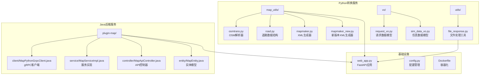
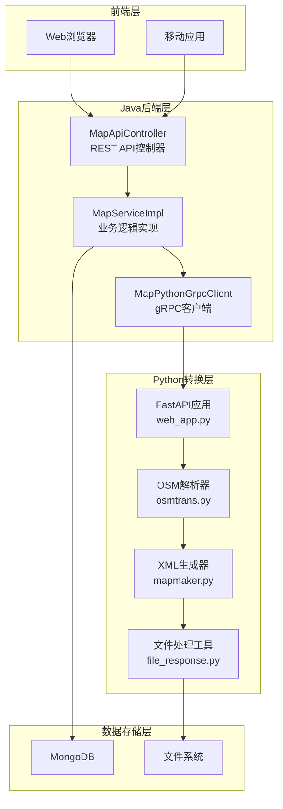
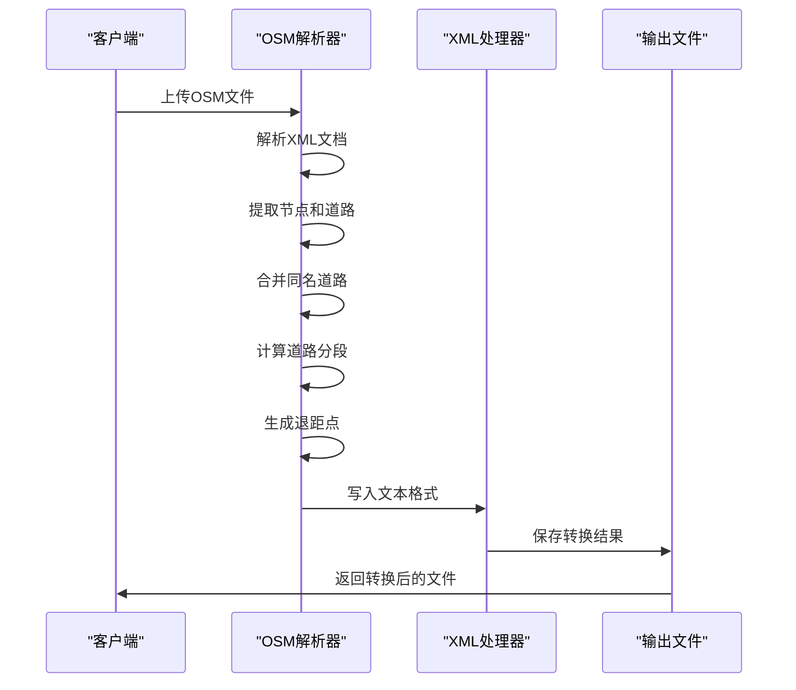
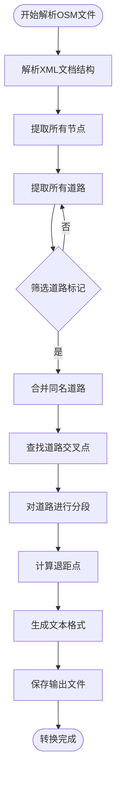
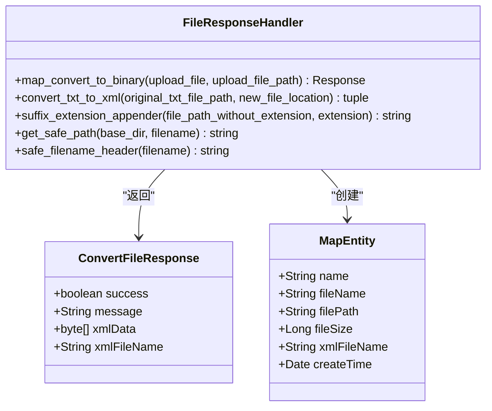
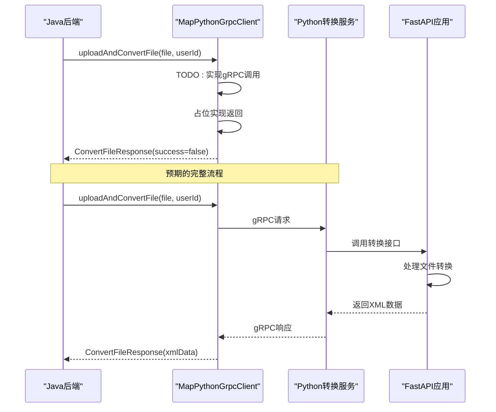
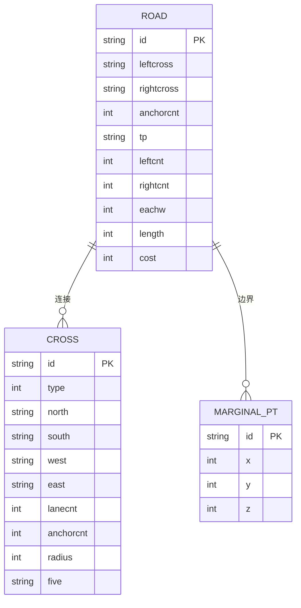
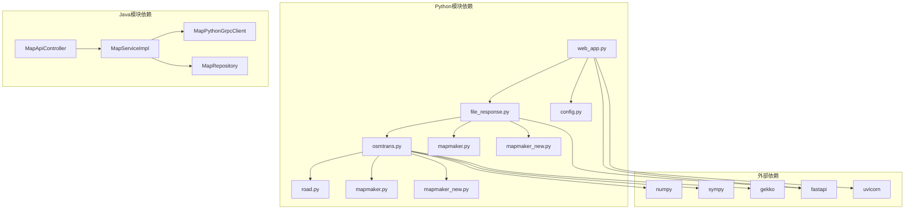

# 地图转换服务

<cite>
**本文档引用的文件**
- [osmtrans.py](file://map_convert_services/map_utils/osmtrans.py)
- [road.py](file://map_convert_services/map_utils/road.py)
- [mapmaker.py](file://map_convert_services/map_utils/mapmaker.py)
- [mapmaker_new.py](file://map_convert_services/map_utils/mapmaker_new.py)
- [file_response.py](file://map_convert_services/utils/file_response.py)
- [web_app.py](file://map_convert_services/web_app.py)
- [MapPythonGrpcClient.java](file://plugins/plugin-map/src/main/java/com/traffic/sim/plugin/map/client/MapPythonGrpcClient.java)
- [MapServiceImpl.java](file://plugins/plugin-map/src/main/java/com/traffic/sim/plugin/map/service/MapServiceImpl.java)
- [MapApiController.java](file://plugins/plugin-map/src/main/java/com/traffic/sim/plugin/map/controller/MapApiController.java)
- [cross.py](file://map_convert_services/cross.py)
</cite>

## 目录
1. [简介](#简介)
2. [项目结构](#项目结构)
3. [核心组件](#核心组件)
4. [架构概览](#架构概览)
5. [详细组件分析](#详细组件分析)
6. [依赖关系分析](#依赖关系分析)
7. [性能考虑](#性能考虑)
8. [故障排除指南](#故障排除指南)
9. [结论](#结论)

## 简介

地图转换服务是一个完整的OSM（OpenStreetMap）数据转换系统，负责将OSM格式的地图数据转换为交通仿真引擎所需的XML格式。该系统采用Python脚本进行数据解析和转换，同时提供Java后端的gRPC客户端接口，实现了前后端分离的微服务架构。

系统主要包含三个核心功能：
- OSM数据解析和道路网络重建
- 路网数据的几何变换和退距点计算
- XML格式输出和文件响应处理

## 项目结构

地图转换服务采用模块化的项目结构，主要分为以下几个部分：

**图表来源**
- [osmtrans.py](file://map_convert_services/map_utils/osmtrans.py#L1-L50)
- [file_response.py](file://map_convert_services/utils/file_response.py#L1-L20)
- [MapPythonGrpcClient.java](file://plugins/plugin-map/src/main/java/com/traffic/sim/plugin/map/client/MapPythonGrpcClient.java#L1-L30)

**章节来源**
- [osmtrans.py](file://map_convert_services/map_utils/osmtrans.py#L1-L100)
- [file_response.py](file://map_convert_services/utils/file_response.py#L1-L50)
- [web_app.py](file://map_convert_services/web_app.py#L1-L50)

## 核心组件

### OSM解析器 (osmtrans.py)

OSM解析器是整个转换系统的核心组件，负责将OSM格式的XML数据解析为内部数据结构，然后生成适合交通仿真引擎使用的文本格式。

主要功能包括：
- OSM文件解析和节点、道路提取
- 道路网络合并和拓扑关系建立
- 几何坐标变换和退距点计算
- 文本格式输出生成

### 道路数据结构 (road.py)

定义了交通网络的基本数据结构，包括道路、交叉口和边缘点的属性和方法。

关键类：
- `Road`: 道路实体，包含车道数、曲率、锚点等属性
- `Cross`: 交叉口实体，包含连接关系和几何信息
- `MarginalPt`: 边缘点，用于网络边界处理

### XML生成器 (mapmaker.py)

将内部文本格式转换为交通仿真引擎所需的XML格式，包含完整的网络拓扑、信号控制和几何信息。

**章节来源**
- [osmtrans.py](file://map_convert_services/map_utils/osmtrans.py#L42-L1255)
- [road.py](file://map_convert_services/map_utils/road.py#L27-L54)
- [mapmaker.py](file://map_convert_services/map_utils/mapmaker.py#L26-L610)

## 架构概览

系统采用分层架构设计，实现了清晰的职责分离：

**图表来源**
- [MapApiController.java](file://plugins/plugin-map/src/main/java/com/traffic/sim/plugin/map/controller/MapApiController.java#L34-L45)
- [MapServiceImpl.java](file://plugins/plugin-map/src/main/java/com/traffic/sim/plugin/map/service/MapServiceImpl.java#L80-L120)
- [web_app.py](file://map_convert_services/web_app.py#L52-L80)

## 详细组件分析

### OSM数据解析流程

OSM解析器采用面向对象的设计模式，通过deal_xml类实现完整的数据处理流程：

**图表来源**
- [osmtrans.py](file://map_convert_services/map_utils/osmtrans.py#L47-L895)
- [file_response.py](file://map_convert_services/utils/file_response.py#L8-L55)

#### 数据处理算法

系统实现了复杂的道路网络处理算法：

**图表来源**
- [osmtrans.py](file://map_convert_services/map_utils/osmtrans.py#L120-L498)

**章节来源**
- [osmtrans.py](file://map_convert_services/map_utils/osmtrans.py#L42-L895)

### 文件处理和响应工具

文件处理模块提供了完整的文件转换和响应处理功能：

**图表来源**
- [file_response.py](file://map_convert_services/utils/file_response.py#L8-L107)
- [MapPythonGrpcClient.java](file://plugins/plugin-map/src/main/java/com/traffic/sim/plugin/map/client/MapPythonGrpcClient.java#L46-L83)

#### gRPC客户端实现

Java后端的gRPC客户端目前处于占位符状态，需要实现完整的gRPC通信：

**图表来源**
- [MapPythonGrpcClient.java](file://plugins/plugin-map/src/main/java/com/traffic/sim/plugin/map/client/MapPythonGrpcClient.java#L26-L41)
- [web_app.py](file://map_convert_services/web_app.py#L52-L80)

**章节来源**
- [file_response.py](file://map_convert_services/utils/file_response.py#L8-L107)
- [MapPythonGrpcClient.java](file://plugins/plugin-map/src/main/java/com/traffic/sim/plugin/map/client/MapPythonGrpcClient.java#L17-L41)

### 数据模型和结构

系统使用了多种数据模型来表示交通网络的不同方面：

**图表来源**
- [road.py](file://map_convert_services/map_utils/road.py#L27-L54)
- [cross.py](file://map_convert_services/cross.py#L27-L54)

**章节来源**
- [road.py](file://map_convert_services/map_utils/road.py#L1-L54)
- [cross.py](file://map_convert_services/cross.py#L1-L54)

## 依赖关系分析

系统具有清晰的模块化依赖关系：

**图表来源**
- [osmtrans.py](file://map_convert_services/map_utils/osmtrans.py#L1-L10)
- [file_response.py](file://map_convert_services/utils/file_response.py#L1-L6)
- [web_app.py](file://map_convert_services/web_app.py#L1-L27)

**章节来源**
- [osmtrans.py](file://map_convert_services/map_utils/osmtrans.py#L1-L10)
- [file_response.py](file://map_convert_services/utils/file_response.py#L1-L6)
- [web_app.py](file://map_convert_services/web_app.py#L1-L27)

## 性能考虑

### 算法复杂度分析

系统的关键算法具有以下复杂度特征：

- **道路合并算法**: O(n²)，其中n是道路数量
- **交叉点查找**: O(n²)，用于计算道路间的交点
- **退距点计算**: O(n)，基于拟合曲线的数值计算
- **XML生成**: O(n)，线性遍历所有元素

### 优化策略

1. **内存管理**: 使用生成器模式处理大型文件
2. **并行处理**: 利用多核CPU进行并行计算
3. **缓存机制**: 缓存中间结果减少重复计算
4. **流式处理**: 支持大文件的流式转换

## 故障排除指南

### 常见问题及解决方案

1. **文件格式错误**
   - 检查文件扩展名是否为osm或txt
   - 验证文件编码格式
   - 确认文件完整性

2. **转换失败**
   - 检查Python依赖库安装
   - 验证输入数据的正确性
   - 查看日志文件获取详细错误信息

3. **gRPC连接问题**
   - 确认Python服务正在运行
   - 检查网络连接和防火墙设置
   - 验证gRPC端口配置

**章节来源**
- [file_response.py](file://map_convert_services/utils/file_response.py#L18-L28)
- [MapPythonGrpcClient.java](file://plugins/plugin-map/src/main/java/com/traffic/sim/plugin/map/client/MapPythonGrpcClient.java#L27-L41)

## 结论

地图转换服务是一个功能完整、架构清晰的交通仿真数据转换系统。它成功地实现了从OSM格式到仿真引擎XML格式的转换，为交通仿真应用提供了可靠的数据基础。

### 主要优势

1. **模块化设计**: 清晰的模块分离便于维护和扩展
2. **算法完善**: 实现了复杂的道路网络处理算法
3. **性能优化**: 采用多种优化策略提升处理效率
4. **可扩展性**: 支持新版本XML生成器和gRPC接口

### 改进建议

1. **gRPC实现**: 完成MapPythonGrpcClient的gRPC客户端实现
2. **错误处理**: 增强异常处理和错误恢复机制
3. **监控告警**: 添加系统监控和性能指标
4. **测试覆盖**: 提高单元测试和集成测试覆盖率

该系统为交通仿真应用提供了坚实的技术基础，通过持续的改进和完善，将能够更好地服务于智能交通系统的开发和应用。