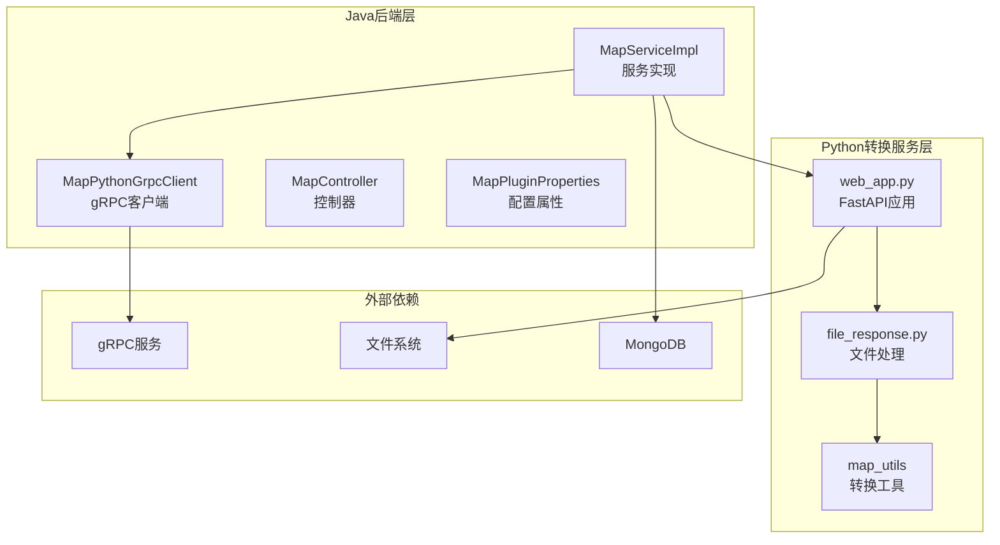
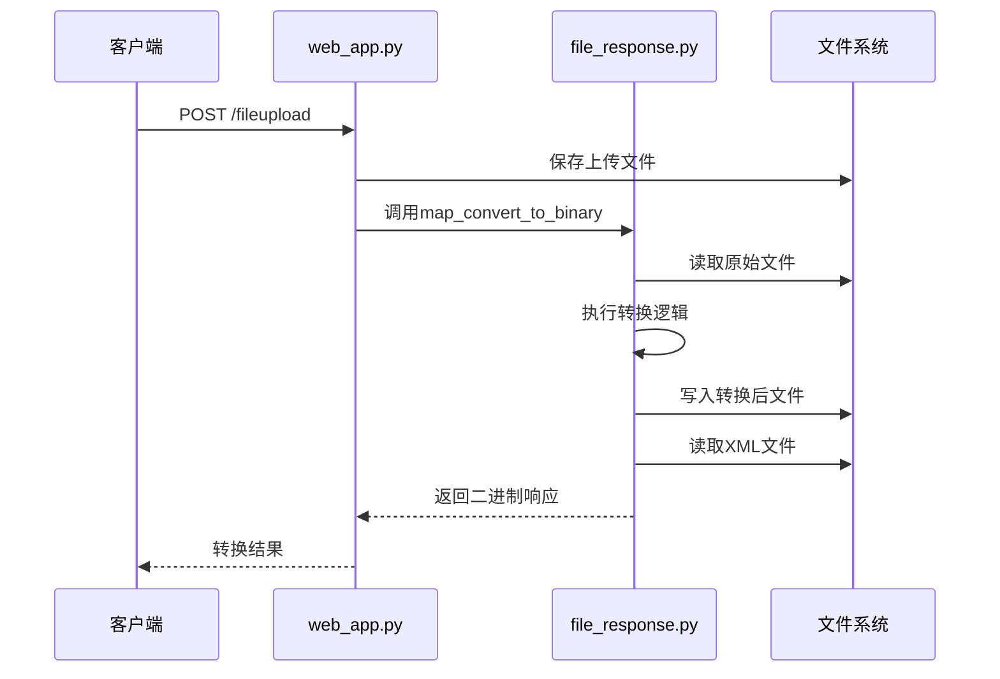
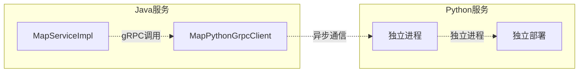
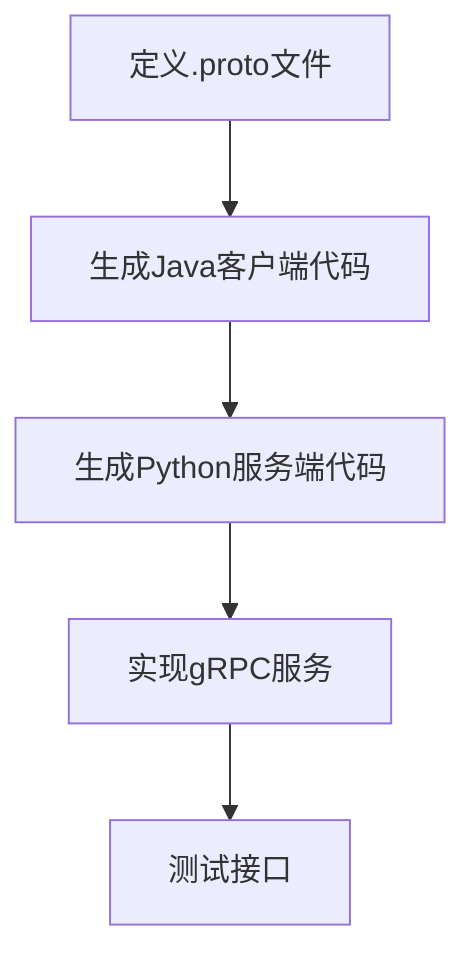
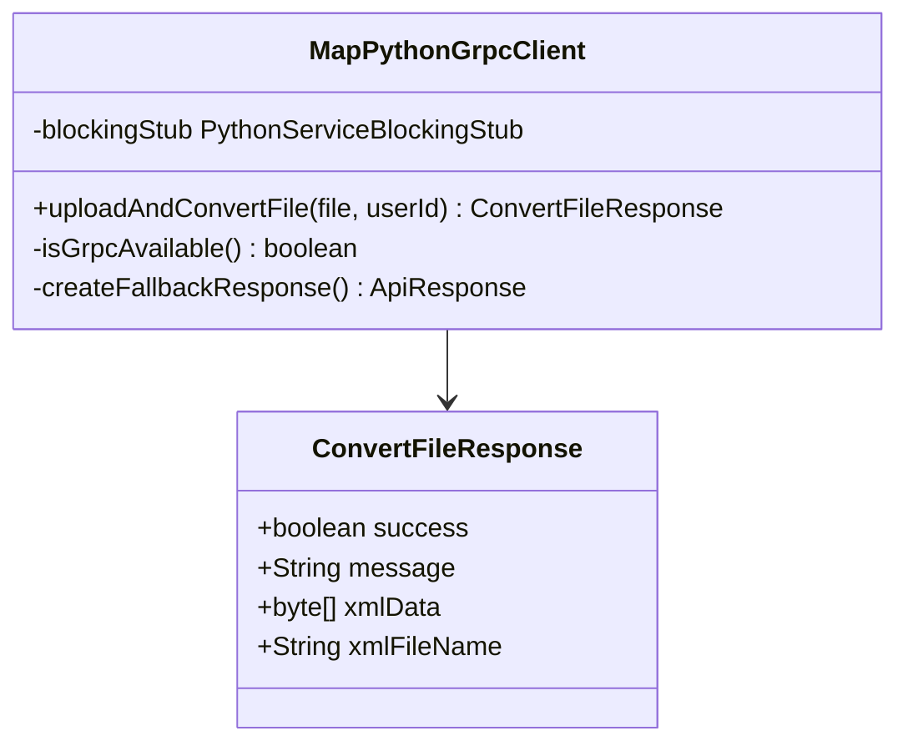
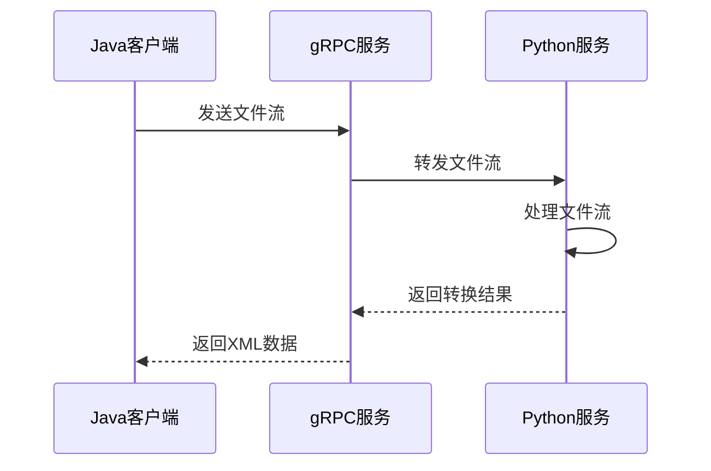

# 已知问题与临时方案

<cite>
**本文档引用的文件**
- [MapPythonGrpcClient.java](file://plugins/plugin-map/src/main/java/com/traffic/sim/plugin/map/client/MapPythonGrpcClient.java)
- [file_response.py](file://map_convert_services/utils/file_response.py)
- [MapServiceImpl.java](file://plugins/plugin-map/src/main/java/com/traffic/sim/plugin/map/service/MapServiceImpl.java)
- [web_app.py](file://map_convert_services/web_app.py)
- [config.py](file://map_convert_services/config.py)
- [MapPluginProperties.java](file://plugins/plugin-map/src/main/java/com/traffic/sim/plugin/map/config/MapPluginProperties.java)
- [SimulationPythonGrpcClient.java](file://plugins/plugin-simulation/src/main/java/com/traffic/sim/plugin/simulation/grpc/SimulationPythonGrpcClient.java)
- [plugin-map-Issue.md](file://plugins/plugin-map/plugin-map-Issue.md)
</cite>

## 目录
1. [简介](#简介)
2. [项目结构概览](#项目结构概览)
3. [核心问题分析](#核心问题分析)
4. [临时方案分析](#临时方案分析)
5. [完整方案对比](#完整方案对比)
6. [迁移路线图](#迁移路线图)
7. [技术债务评估](#技术债务评估)
8. [风险与缓解措施](#风险与缓解措施)
9. [结论](#结论)

## 简介

本文件系统化地记录了地图转换服务的当前实现状态与设计目标之间的差距。重点分析了`MapPythonGrpcClient`中`uploadAndConvertFile`方法仍为TODO的问题，以及实际文件处理由`file_response.py`中的同步文件I/O操作临时替代的情况。本文旨在明确指出这些问题带来的影响，并提供完整的迁移路线图。

## 项目结构概览

地图转换服务采用分层架构设计，主要包含以下组件：



**图表来源**
- [MapServiceImpl.java](file://plugins/plugin-map/src/main/java/com/traffic/sim/plugin/map/service/MapServiceImpl.java#L80-L120)
- [MapPythonGrpcClient.java](file://plugins/plugin-map/src/main/java/com/traffic/sim/plugin/map/client/MapPythonGrpcClient.java#L26-L41)
- [web_app.py](file://map_convert_services/web_app.py#L52-L80)

## 核心问题分析

### 1. gRPC客户端未实现

当前`MapPythonGrpcClient`类中的`uploadAndConvertFile`方法仅包含TODO注释，实际功能完全缺失：

```mermaid
flowchart TD
A[调用uploadAndConvertFile] --> B{gRPC客户端实现?}
B --> |否| C[返回占位响应]
C --> D[success=false]
D --> E[message="gRPC client not implemented"]
E --> F[日志警告]
```

**图表来源**
- [MapPythonGrpcClient.java](file://plugins/plugin-map/src/main/java/com/traffic/sim/plugin/map/client/MapPythonGrpcClient.java#L26-L41)

### 2. 服务实现中的gRPC调用缺失

`MapServiceImpl`中的`uploadAndConvertMap`方法同样存在TODO注释，表明服务层也未实现gRPC调用：

**章节来源**
- [MapServiceImpl.java](file://plugins/plugin-map/src/main/java/com/traffic/sim/plugin/map/service/MapServiceImpl.java#L92-L93)

### 3. 配置属性中的Python服务设置

`MapPluginProperties`类提供了Python服务的配置项，但当前并未使用：

**章节来源**
- [MapPluginProperties.java](file://plugins/plugin-map/src/main/java/com/traffic/sim/plugin/map/config/MapPluginProperties.java#L78-L93)

## 临时方案分析

### 1. Python文件处理服务现状

当前Python端通过`file_response.py`实现了完整的文件转换逻辑，但采用了同步文件I/O操作：



**图表来源**
- [web_app.py](file://map_convert_services/web_app.py#L52-L80)
- [file_response.py](file://map_convert_services/utils/file_response.py#L8-L55)

### 2. 临时方案的问题分析

#### 缺乏异步处理
- 所有文件操作都是同步阻塞的
- 大文件转换会阻塞整个服务线程
- 无法处理高并发场景

#### 无法水平扩展
- 依赖本地文件系统存储
- 无法在多节点间共享状态
- 部署时需要共享存储

#### 错误处理机制薄弱
- 异常处理相对简单
- 缺乏重试机制
- 错误信息不够详细

**章节来源**
- [file_response.py](file://map_convert_services/utils/file_response.py#L18-L28)

## 完整方案对比

### 1. gRPC异步通信优势

#### 解耦性


#### 可扩展性
- 支持水平扩展
- 可独立部署和升级
- 资源隔离

#### 健壮性
- 容错机制完善
- 超时控制
- 重试策略

### 2. 对比分析表

| 特性 | 临时方案 | 完整方案 |
|------|----------|----------|
| 异步处理 | ❌ 同步阻塞 | ✅ 异步非阻塞 |
| 水平扩展 | ❌ 本地存储 | ✅ 独立进程 |
| 错误处理 | ❌ 简单异常 | ✅ 完善容错 |
| 性能 | ❌ 阻塞等待 | ✅ 并发处理 |
| 部署 | ❌ 紧耦合 | ✅ 独立部署 |

## 迁移路线图

### 第一阶段：实现Python gRPC服务器

#### 1. 定义Protocol Buffers接口


#### 2. 实现Python gRPC服务
- 参考`SimulationPythonGrpcClient`的实现模式
- 添加容错机制和日志记录
- 实现超时控制和重试策略

**章节来源**
- [SimulationPythonGrpcClient.java](file://plugins/plugin-simulation/src/main/java/com/traffic/sim/plugin/simulation/grpc/SimulationPythonGrpcClient.java#L35-L93)

### 第二阶段：完成Java客户端调用

#### 1. 实现MapPythonGrpcClient


**图表来源**
- [MapPythonGrpcClient.java](file://plugins/plugin-map/src/main/java/com/traffic/sim/plugin/map/client/MapPythonGrpcClient.java#L46-L83)

#### 2. 集成到服务层
- 修改`MapServiceImpl`中的gRPC调用
- 添加错误处理和回退机制
- 实现配置管理

### 第三阶段：移除临时文件存储逻辑

#### 1. 文件流传输


#### 2. 配置调整
- 更新`MapPluginProperties`配置
- 移除文件系统依赖
- 实现内存缓冲区管理

## 技术债务评估

### 1. 当前技术债务

#### 代码层面
- TODO注释大量存在
- 缺少单元测试
- 配置管理不完善

#### 架构层面
- 耦合度高
- 缺乏监控
- 错误处理不完善

### 2. 债务影响分析

| 影响类型 | 影响程度 | 说明 |
|----------|----------|------|
| 性能 | 高 | 同步阻塞影响响应时间 |
| 可靠性 | 中 | 缺少容错机制 |
| 可扩展性 | 高 | 无法水平扩展 |
| 维护性 | 中 | 代码质量有待提升 |

## 风险与缓解措施

### 1. 主要风险

#### 风险1：gRPC服务不可用
- **影响**：服务降级，使用临时方案
- **缓解**：实现容错机制和回退策略

#### 风险2：性能问题
- **影响**：高并发场景下性能下降
- **缓解**：异步处理和连接池优化

#### 风险3：数据一致性
- **影响**：文件系统操作可能导致数据不一致
- **缓解**：事务管理和状态同步

### 2. 实施策略

#### 分阶段实施

```mermaid
gantt
title 迁移实施计划
dateFormat X
axisFormat %d天
section 第1阶段
实现gRPC接口 :done, 0, 10
测试接口 :done, 10, 15
section 第2阶段
实现Java客户端 :crit, 15, 25
集成到服务层 :crit, 25, 35
section 第3阶段
移除临时方案 :crit, 35, 45
全面测试 :crit, 45, 50
```


#### 回滚策略
- 保持临时方案作为回退选项
- 实现渐进式迁移
- 建立监控和告警机制

## 结论

地图转换服务目前处于半完成状态，`MapPythonGrpcClient`的gRPC实现缺失和临时文件处理方案构成了主要的技术债务。通过实施上述迁移路线图，可以逐步解决这些问题：

1. **立即行动**：完善现有临时方案的错误处理和性能优化
2. **短期目标**：实现Python gRPC服务器和Java客户端
3. **长期规划**：完全移除文件系统依赖，实现真正的微服务架构

这种渐进式的迁移策略既能保证业务连续性，又能逐步提升系统的整体质量和可维护性。建议优先处理影响最大的性能和可靠性问题，然后逐步完善其他方面。