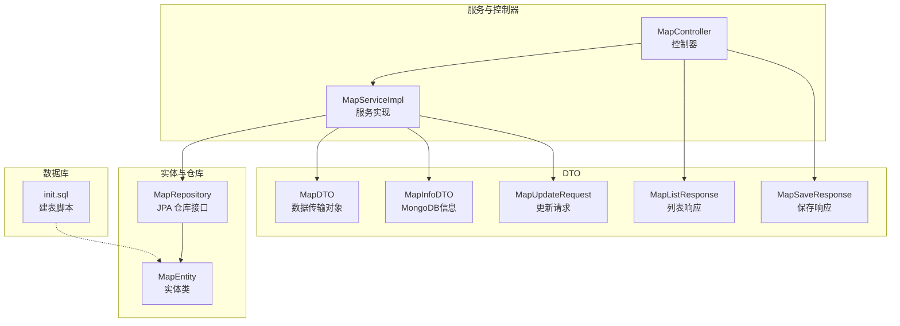
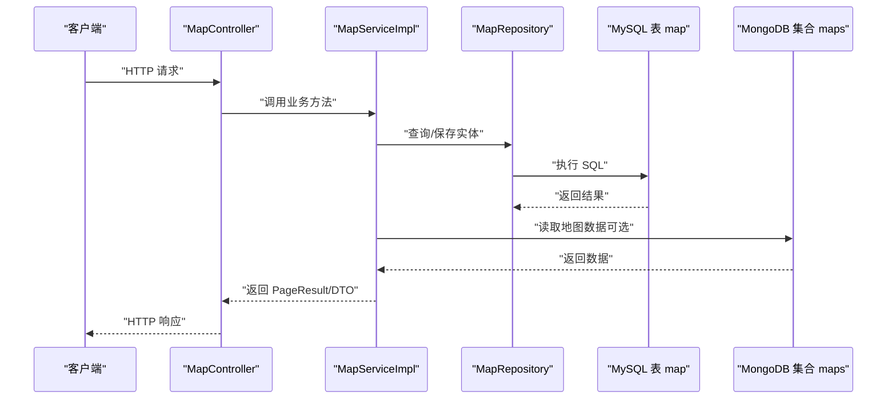
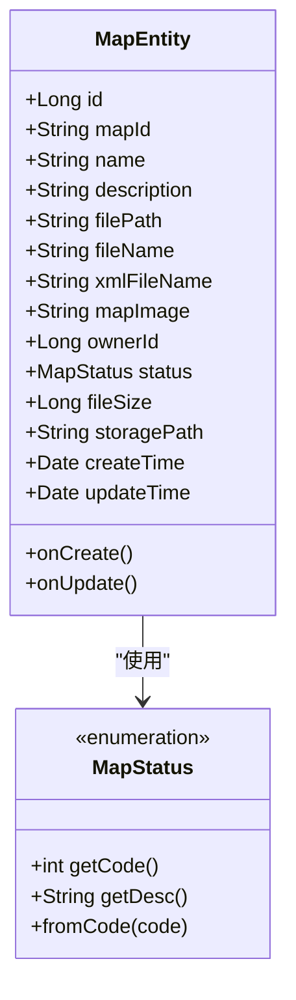
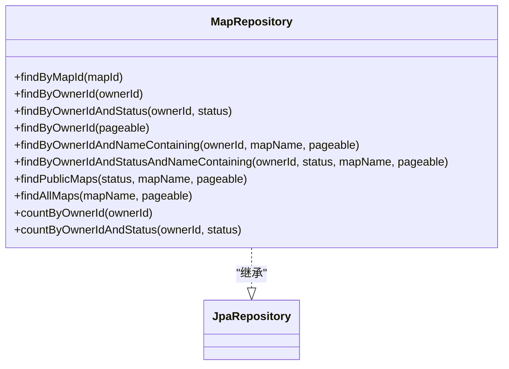
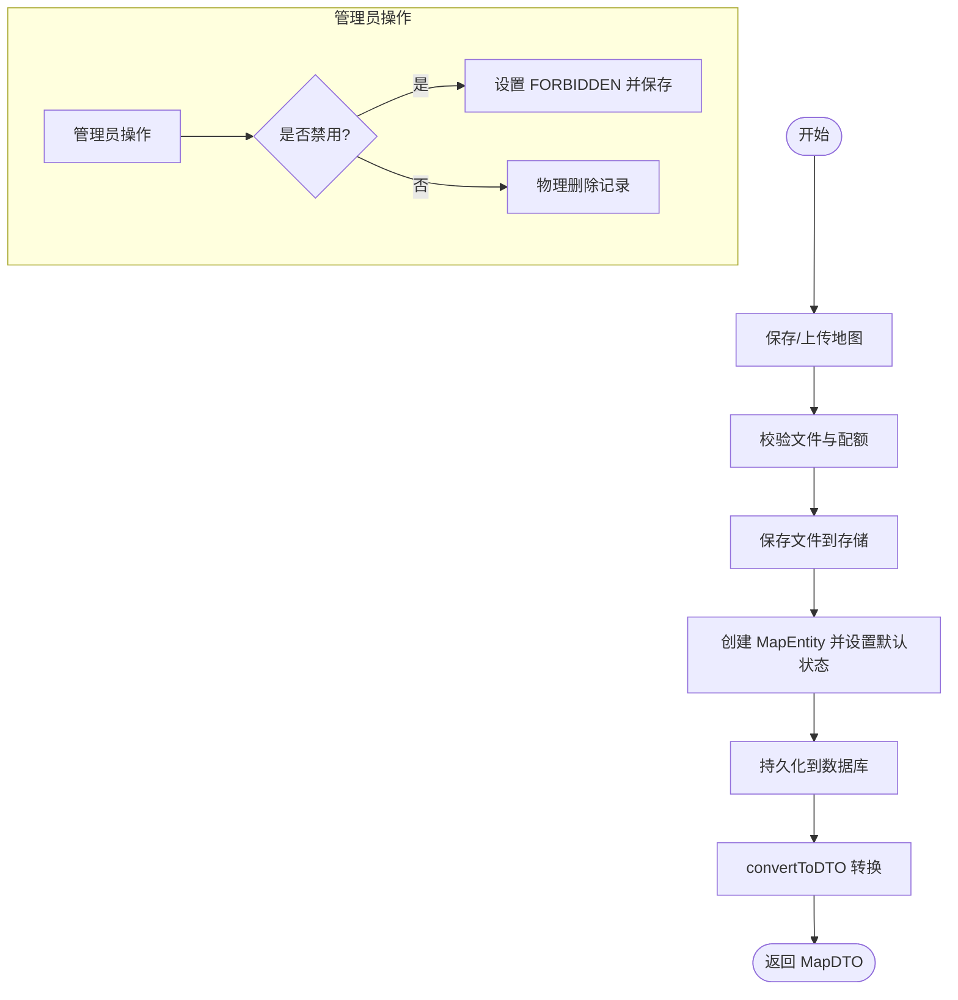
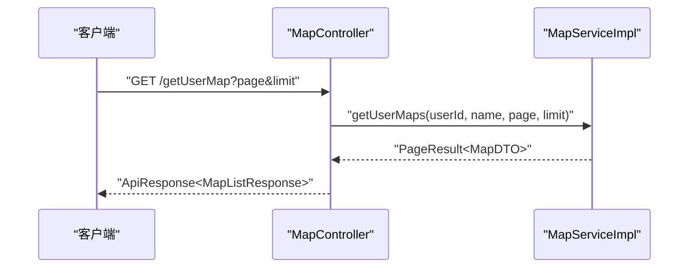
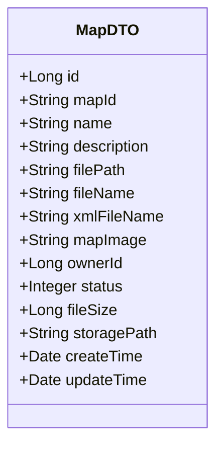
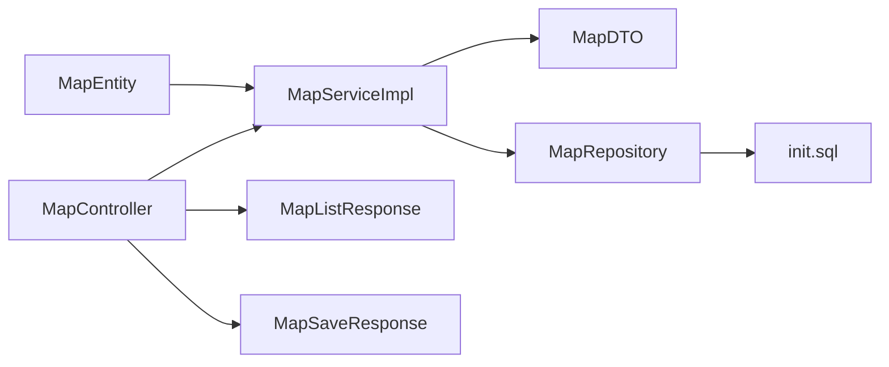

# 数据模型

<cite>
**本文引用的文件**
- [MapEntity.java](file://plugins/plugin-map/src/main/java/com/traffic/sim/plugin/map/entity/MapEntity.java)
- [MapDTO.java](file://traffic-sim-common/src/main/java/com/traffic/sim/common/dto/MapDTO.java)
- [MapRepository.java](file://plugins/plugin-map/src/main/java/com/traffic/sim/plugin/map/repository/MapRepository.java)
- [MapServiceImpl.java](file://plugins/plugin-map/src/main/java/com/traffic/sim/plugin/map/service/MapServiceImpl.java)
- [MapController.java](file://plugins/plugin-map/src/main/java/com/traffic/sim/plugin/map/controller/MapController.java)
- [init.sql](file://infrastructure/init.sql)
- [MapListResponse.java](file://plugins/plugin-map/src/main/java/com/traffic/sim/plugin/map/dto/MapListResponse.java)
- [MapSaveResponse.java](file://plugins/plugin-map/src/main/java/com/traffic/sim/plugin/map/dto/MapSaveResponse.java)
- [MapInfoDTO.java](file://traffic-sim-common/src/main/java/com/traffic/sim/common/dto/MapInfoDTO.java)
- [MapUpdateRequest.java](file://traffic-sim-common/src/main/java/com/traffic/sim/common/dto/MapUpdateRequest.java)
</cite>

## 目录
1. [简介](#简介)
2. [项目结构](#项目结构)
3. [核心组件](#核心组件)
4. [架构概览](#架构概览)
5. [详细组件分析](#详细组件分析)
6. [依赖分析](#依赖分析)
7. [性能考虑](#性能考虑)
8. [故障排查指南](#故障排查指南)
9. [结论](#结论)
10. [附录](#附录)

## 简介
本文件聚焦于地图管理的数据模型，系统性阐述 MapEntity 实体类的字段语义、JPA 注解应用、MapStatus 枚举的状态定义与业务含义，并说明 MapDTO 数据传输对象与 MapEntity 的映射关系及在 API 层的使用方式。同时提供数据库表结构的文本描述与字段约束，帮助开发者快速理解与维护地图管理模块。

## 项目结构
围绕地图管理的核心文件分布如下：
- 实体与仓库：MapEntity、MapRepository
- 服务与控制器：MapServiceImpl、MapController
- DTO：MapDTO、MapListResponse、MapSaveResponse、MapInfoDTO、MapUpdateRequest
- 数据库初始化：init.sql

**图表来源**
- [MapEntity.java](file://plugins/plugin-map/src/main/java/com/traffic/sim/plugin/map/entity/MapEntity.java#L1-L116)
- [MapRepository.java](file://plugins/plugin-map/src/main/java/com/traffic/sim/plugin/map/repository/MapRepository.java#L1-L87)
- [MapServiceImpl.java](file://plugins/plugin-map/src/main/java/com/traffic/sim/plugin/map/service/MapServiceImpl.java#L1-L395)
- [MapController.java](file://plugins/plugin-map/src/main/java/com/traffic/sim/plugin/map/controller/MapController.java#L1-L155)
- [MapDTO.java](file://traffic-sim-common/src/main/java/com/traffic/sim/common/dto/MapDTO.java#L1-L34)
- [MapListResponse.java](file://plugins/plugin-map/src/main/java/com/traffic/sim/plugin/map/dto/MapListResponse.java#L1-L33)
- [MapSaveResponse.java](file://plugins/plugin-map/src/main/java/com/traffic/sim/plugin/map/dto/MapSaveResponse.java#L1-L17)
- [MapInfoDTO.java](file://traffic-sim-common/src/main/java/com/traffic/sim/common/dto/MapInfoDTO.java#L1-L34)
- [MapUpdateRequest.java](file://traffic-sim-common/src/main/java/com/traffic/sim/common/dto/MapUpdateRequest.java#L1-L27)
- [init.sql](file://infrastructure/init.sql#L87-L107)

**章节来源**
- [MapEntity.java](file://plugins/plugin-map/src/main/java/com/traffic/sim/plugin/map/entity/MapEntity.java#L1-L116)
- [MapRepository.java](file://plugins/plugin-map/src/main/java/com/traffic/sim/plugin/map/repository/MapRepository.java#L1-L87)
- [MapServiceImpl.java](file://plugins/plugin-map/src/main/java/com/traffic/sim/plugin/map/service/MapServiceImpl.java#L1-L395)
- [MapController.java](file://plugins/plugin-map/src/main/java/com/traffic/sim/plugin/map/controller/MapController.java#L1-L155)
- [MapDTO.java](file://traffic-sim-common/src/main/java/com/traffic/sim/common/dto/MapDTO.java#L1-L34)
- [MapListResponse.java](file://plugins/plugin-map/src/main/java/com/traffic/sim/plugin/map/dto/MapListResponse.java#L1-L33)
- [MapSaveResponse.java](file://plugins/plugin-map/src/main/java/com/traffic/sim/plugin/map/dto/MapSaveResponse.java#L1-L17)
- [MapInfoDTO.java](file://traffic-sim-common/src/main/java/com/traffic/sim/common/dto/MapInfoDTO.java#L1-L34)
- [MapUpdateRequest.java](file://traffic-sim-common/src/main/java/com/traffic/sim/common/dto/MapUpdateRequest.java#L1-L27)
- [init.sql](file://infrastructure/init.sql#L87-L107)

## 核心组件
本节聚焦 MapEntity 实体类与 MapDTO 数据传输对象，解释字段语义、JPA 注解与时间戳自动管理机制，并说明 MapStatus 枚举的业务含义。

- MapEntity 字段与语义
  - id：自增主键，唯一标识每条地图记录
  - mapId：MongoDB 地图 ID，用于与外部存储系统关联
  - name：地图名称，必填
  - description：地图描述，最大长度 500
  - filePath：文件路径，必填
  - fileName：原始文件名
  - xmlFileName：XML 文件名
  - mapImage：地图图片（Base64），大文本字段
  - ownerId：所有者用户 ID，必填
  - status：地图状态，使用 MapStatus 枚举
  - fileSize：文件大小（字节）
  - storagePath：存储路径
  - createTime：创建时间，不可更新
  - updateTime：更新时间

- JPA 注解说明
  - @Entity：声明为 JPA 实体
  - @Table：指定数据库表名为“map”
  - @Column：映射字段到表列，含可空性、长度、列名等约束
  - @Lob：将 mapImage 映射为大文本（LONGTEXT）
  - @Enumerated(EnumType.ORDINAL)：以序数值存储 MapStatus
  - @Temporal(TemporalType.TIMESTAMP)：将日期字段映射为时间戳
  - @PrePersist/@PreUpdate：持久化前自动设置时间戳与默认状态

- MapStatus 枚举
  - PUBLIC（0，公开）：所有用户可见
  - PRIVATE（1，私有）：仅所有者可见
  - FORBIDDEN（2，禁用）：管理员操作后禁止访问

- MapDTO 字段与映射关系
  - MapDTO 与 MapEntity 字段一一对应，但 status 使用整型代码（0/1/2）
  - 服务层通过 convertToDTO 完成实体到 DTO 的转换

**章节来源**
- [MapEntity.java](file://plugins/plugin-map/src/main/java/com/traffic/sim/plugin/map/entity/MapEntity.java#L13-L116)
- [MapDTO.java](file://traffic-sim-common/src/main/java/com/traffic/sim/common/dto/MapDTO.java#L13-L34)
- [MapServiceImpl.java](file://plugins/plugin-map/src/main/java/com/traffic/sim/plugin/map/service/MapServiceImpl.java#L358-L376)

## 架构概览
下图展示从 API 到数据库的端到端流程，包括实体、仓库、服务与控制器之间的交互，以及 DTO 的使用。

**图表来源**
- [MapController.java](file://plugins/plugin-map/src/main/java/com/traffic/sim/plugin/map/controller/MapController.java#L23-L155)
- [MapServiceImpl.java](file://plugins/plugin-map/src/main/java/com/traffic/sim/plugin/map/service/MapServiceImpl.java#L40-L395)
- [MapRepository.java](file://plugins/plugin-map/src/main/java/com/traffic/sim/plugin/map/repository/MapRepository.java#L19-L87)
- [init.sql](file://infrastructure/init.sql#L87-L107)

## 详细组件分析

### MapEntity 实体类
- 字段与注解
  - 主键与表映射：@Entity、@Table(name="map")、@Id、@GeneratedValue
  - 字段映射：@Column、@Lob、@Enumerated、@Temporal
  - 时间戳：@PrePersist 设置 createTime/updateTime；@PreUpdate 更新 updateTime；默认状态为 PRIVATE
- MapStatus 枚举
  - 提供 code/desc 访问器与 fromCode 工厂方法，便于从整型状态码恢复枚举值

**图表来源**
- [MapEntity.java](file://plugins/plugin-map/src/main/java/com/traffic/sim/plugin/map/entity/MapEntity.java#L13-L116)

**章节来源**
- [MapEntity.java](file://plugins/plugin-map/src/main/java/com/traffic/sim/plugin/map/entity/MapEntity.java#L13-L116)

### MapRepository 仓库接口
- 提供基于 Spring Data JPA 的查询方法，包括按 mapId、ownerId、状态与名称的组合查询
- 支持分页查询与统计功能

**图表来源**
- [MapRepository.java](file://plugins/plugin-map/src/main/java/com/traffic/sim/plugin/map/repository/MapRepository.java#L19-L87)

**章节来源**
- [MapRepository.java](file://plugins/plugin-map/src/main/java/com/traffic/sim/plugin/map/repository/MapRepository.java#L19-L87)

### MapServiceImpl 服务实现
- 负责业务逻辑：文件校验、配额检查、文件保存、实体转换、权限控制、管理员操作
- 提供分页查询、公开地图查询、管理员全量查询、删除与禁用处理
- convertToDTO 将 MapEntity 转换为 MapDTO，convertToPageResult 将 Page<MapEntity> 转换为 PageResult<MapDTO>

**图表来源**
- [MapServiceImpl.java](file://plugins/plugin-map/src/main/java/com/traffic/sim/plugin/map/service/MapServiceImpl.java#L52-L120)
- [MapServiceImpl.java](file://plugins/plugin-map/src/main/java/com/traffic/sim/plugin/map/service/MapServiceImpl.java#L171-L242)
- [MapServiceImpl.java](file://plugins/plugin-map/src/main/java/com/traffic/sim/plugin/map/service/MapServiceImpl.java#L358-L392)

**章节来源**
- [MapServiceImpl.java](file://plugins/plugin-map/src/main/java/com/traffic/sim/plugin/map/service/MapServiceImpl.java#L52-L120)
- [MapServiceImpl.java](file://plugins/plugin-map/src/main/java/com/traffic/sim/plugin/map/service/MapServiceImpl.java#L171-L242)
- [MapServiceImpl.java](file://plugins/plugin-map/src/main/java/com/traffic/sim/plugin/map/service/MapServiceImpl.java#L358-L392)

### MapController 控制器
- 提供旧版兼容接口：保存地图、获取用户地图、获取公开地图、从 MongoDB 获取地图数据、预览地图信息、管理员删除与全量查询
- 通过 MapService 完成业务调用，并将结果封装为 ApiResponse

**图表来源**
- [MapController.java](file://plugins/plugin-map/src/main/java/com/traffic/sim/plugin/map/controller/MapController.java#L23-L155)
- [MapServiceImpl.java](file://plugins/plugin-map/src/main/java/com/traffic/sim/plugin/map/service/MapServiceImpl.java#L122-L146)
- [MapListResponse.java](file://plugins/plugin-map/src/main/java/com/traffic/sim/plugin/map/dto/MapListResponse.java#L24-L30)

**章节来源**
- [MapController.java](file://plugins/plugin-map/src/main/java/com/traffic/sim/plugin/map/controller/MapController.java#L23-L155)
- [MapListResponse.java](file://plugins/plugin-map/src/main/java/com/traffic/sim/plugin/map/dto/MapListResponse.java#L24-L30)

### MapDTO 数据传输对象
- 字段与 MapEntity 对应，status 使用整型代码（0/1/2）
- 在服务层通过 convertToDTO 完成实体到 DTO 的转换，供 API 层返回

**图表来源**
- [MapDTO.java](file://traffic-sim-common/src/main/java/com/traffic/sim/common/dto/MapDTO.java#L13-L34)
- [MapServiceImpl.java](file://plugins/plugin-map/src/main/java/com/traffic/sim/plugin/map/service/MapServiceImpl.java#L358-L376)

**章节来源**
- [MapDTO.java](file://traffic-sim-common/src/main/java/com/traffic/sim/common/dto/MapDTO.java#L13-L34)
- [MapServiceImpl.java](file://plugins/plugin-map/src/main/java/com/traffic/sim/plugin/map/service/MapServiceImpl.java#L358-L376)

### 数据库表结构与字段约束
- 表名：map
- 字段与约束（来自 init.sql）
  - id：BIGINT，自增主键
  - map_id：VARCHAR(255)，可空
  - name：VARCHAR(255)，NOT NULL
  - description：VARCHAR(500)，可空
  - file_path：VARCHAR(500)，NOT NULL
  - file_name：VARCHAR(255)，可空
  - xml_file_name：VARCHAR(255)，可空
  - map_image：LONGTEXT，可空
  - owner_id：BIGINT，NOT NULL
  - status：TINYINT，NOT NULL，默认 1（私有）
  - file_size：BIGINT，默认 0
  - storage_path：VARCHAR(500)，可空
  - create_time：DATETIME，NOT NULL，默认当前时间
  - update_time：DATETIME，NOT NULL，默认当前时间并自动更新
- 索引
  - idx_owner_id：owner_id
  - idx_status：status
  - idx_create_time：create_time

**章节来源**
- [init.sql](file://infrastructure/init.sql#L87-L107)

## 依赖分析
- MapEntity 与 MapDTO 的映射关系
  - 一对一字段映射，status 由枚举代码转换为整型
- MapServiceImpl 作为桥梁
  - 负责实体与 DTO 的转换、权限校验、配额与存储操作
- MapRepository 提供数据访问能力
  - 支持多条件分页查询与统计
- 控制器层负责 API 协议与响应封装

**图表来源**
- [MapEntity.java](file://plugins/plugin-map/src/main/java/com/traffic/sim/plugin/map/entity/MapEntity.java#L13-L116)
- [MapServiceImpl.java](file://plugins/plugin-map/src/main/java/com/traffic/sim/plugin/map/service/MapServiceImpl.java#L358-L392)
- [MapDTO.java](file://traffic-sim-common/src/main/java/com/traffic/sim/common/dto/MapDTO.java#L13-L34)
- [MapRepository.java](file://plugins/plugin-map/src/main/java/com/traffic/sim/plugin/map/repository/MapRepository.java#L19-L87)
- [init.sql](file://infrastructure/init.sql#L87-L107)
- [MapController.java](file://plugins/plugin-map/src/main/java/com/traffic/sim/plugin/map/controller/MapController.java#L23-L155)
- [MapListResponse.java](file://plugins/plugin-map/src/main/java/com/traffic/sim/plugin/map/dto/MapListResponse.java#L24-L30)
- [MapSaveResponse.java](file://plugins/plugin-map/src/main/java/com/traffic/sim/plugin/map/dto/MapSaveResponse.java#L13-L15)

**章节来源**
- [MapServiceImpl.java](file://plugins/plugin-map/src/main/java/com/traffic/sim/plugin/map/service/MapServiceImpl.java#L358-L392)
- [MapRepository.java](file://plugins/plugin-map/src/main/java/com/traffic/sim/plugin/map/repository/MapRepository.java#L19-L87)
- [MapController.java](file://plugins/plugin-map/src/main/java/com/traffic/sim/plugin/map/controller/MapController.java#L23-L155)

## 性能考虑
- 分页查询：通过 Pageable 限制查询范围，避免一次性加载大量数据
- 索引优化：对 owner_id、status、create_time 建立索引，提升查询效率
- 大字段处理：map_image 使用 LONGTEXT，建议在不需要时避免加载，或采用懒加载策略
- 时间戳管理：使用 @PrePersist/@PreUpdate 自动维护时间戳，减少重复代码与错误

[本节为通用指导，无需特定文件来源]

## 故障排查指南
- 状态码异常
  - 现象：MapStatus.fromCode 抛出非法参数异常
  - 排查：确认传入的整型状态码是否为 0/1/2
- 权限不足
  - 现象：访问或修改地图时报错
  - 排查：确认当前用户是否为地图所有者或具备管理员权限
- 文件保存失败
  - 现象：上传文件抛出业务异常
  - 排查：检查文件大小、扩展名限制与存储路径权限
- 配额超限
  - 现象：上传被拒绝
  - 排查：检查用户配额表中的 max_maps 与 max_size

**章节来源**
- [MapEntity.java](file://plugins/plugin-map/src/main/java/com/traffic/sim/plugin/map/entity/MapEntity.java#L91-L98)
- [MapServiceImpl.java](file://plugins/plugin-map/src/main/java/com/traffic/sim/plugin/map/service/MapServiceImpl.java#L314-L333)
- [MapServiceImpl.java](file://plugins/plugin-map/src/main/java/com/traffic/sim/plugin/map/service/MapServiceImpl.java#L82-L120)

## 结论
本数据模型以 MapEntity 为核心，结合 MapRepository、MapServiceImpl 与 MapController 形成清晰的分层架构。MapDTO 作为 API 层的数据载体，确保了前后端交互的一致性。MapStatus 枚举与 JPA 注解共同保证了状态管理与持久化行为的规范性。配合 init.sql 中的表结构与索引设计，整体方案具备良好的扩展性与可维护性。

[本节为总结，无需特定文件来源]

## 附录
- 相关 DTO
  - MapInfoDTO：从 MongoDB 获取的地图数据封装
  - MapUpdateRequest：地图更新请求参数封装
- 响应包装
  - MapListResponse：列表响应封装
  - MapSaveResponse：保存响应封装

**章节来源**
- [MapInfoDTO.java](file://traffic-sim-common/src/main/java/com/traffic/sim/common/dto/MapInfoDTO.java#L13-L34)
- [MapUpdateRequest.java](file://traffic-sim-common/src/main/java/com/traffic/sim/common/dto/MapUpdateRequest.java#L13-L27)
- [MapListResponse.java](file://plugins/plugin-map/src/main/java/com/traffic/sim/plugin/map/dto/MapListResponse.java#L13-L33)
- [MapSaveResponse.java](file://plugins/plugin-map/src/main/java/com/traffic/sim/plugin/map/dto/MapSaveResponse.java#L10-L17)