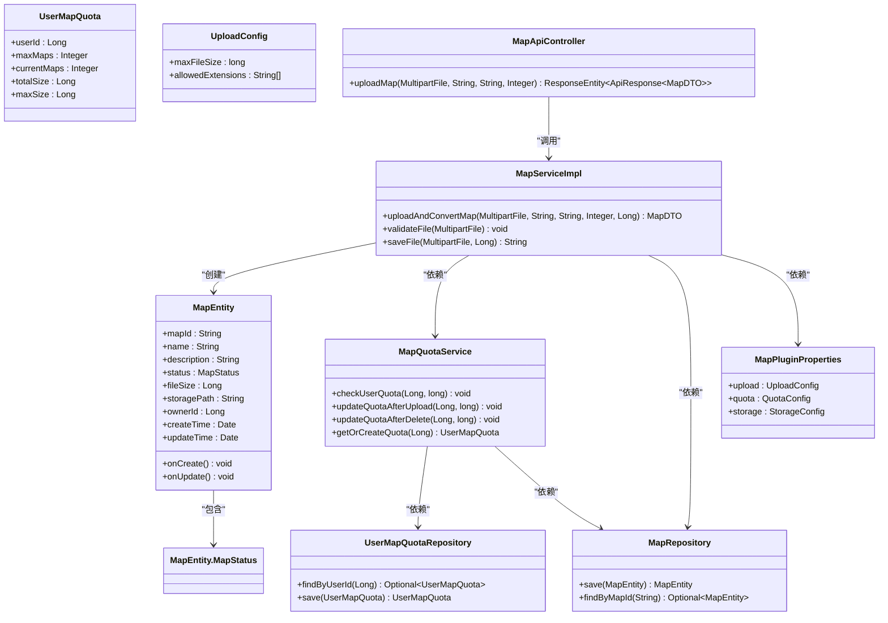
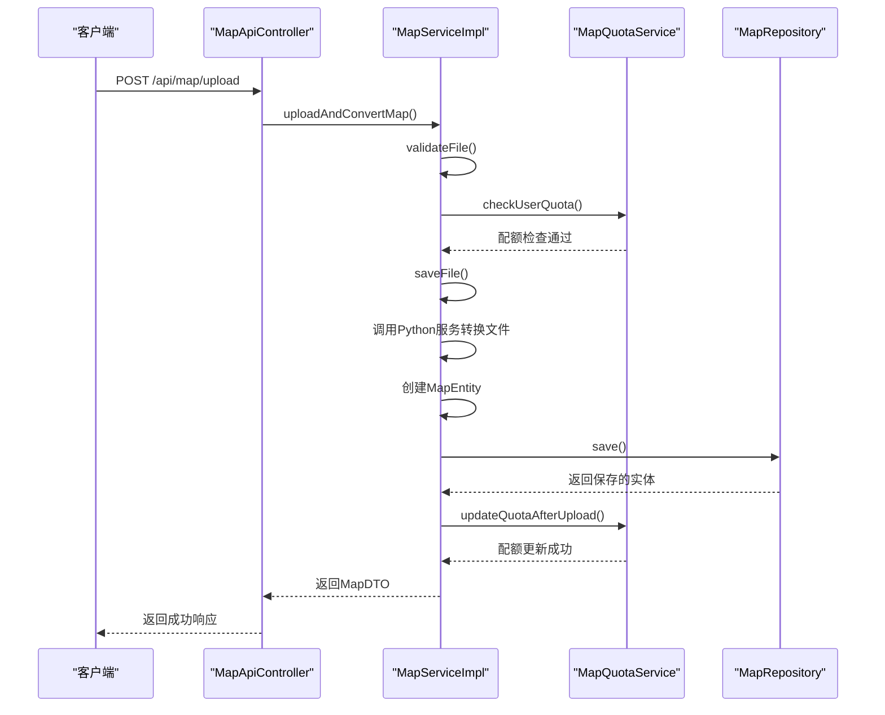
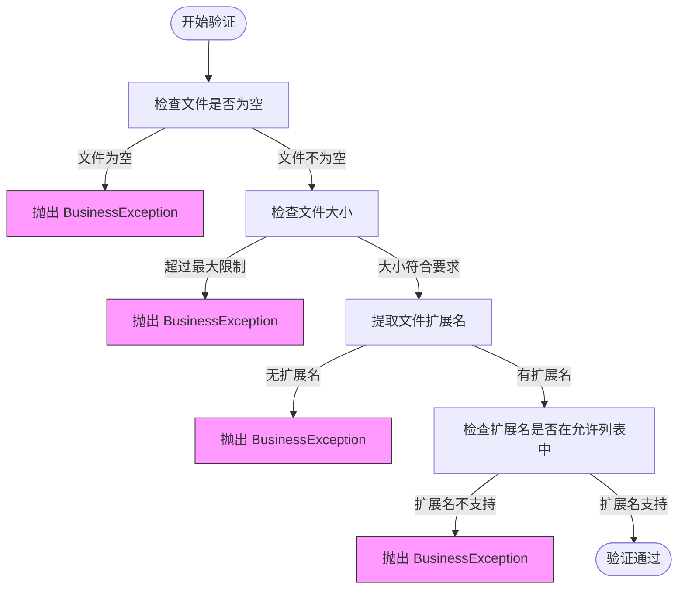
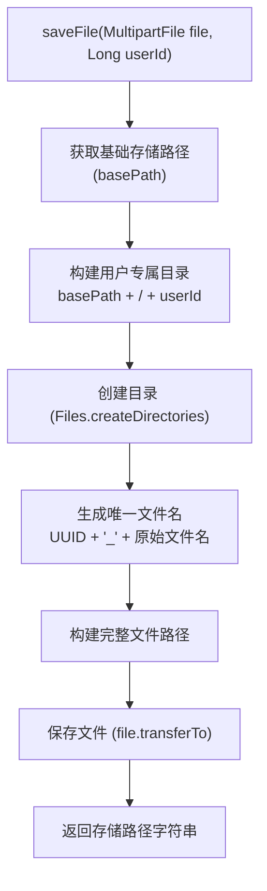
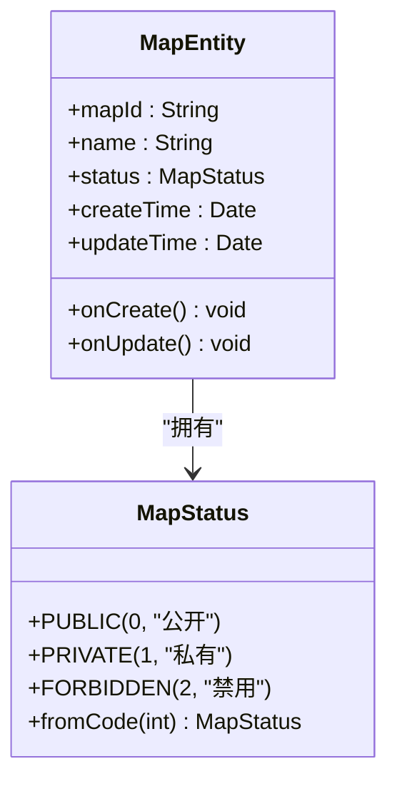
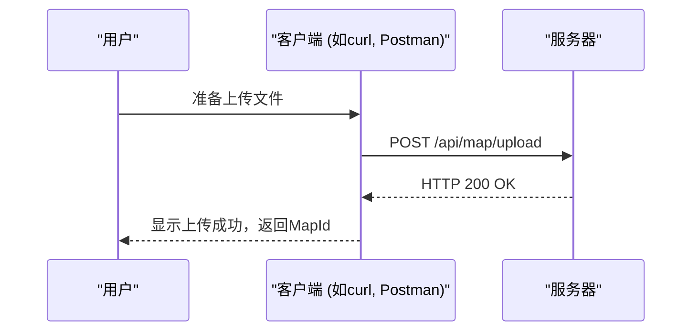

# 上传与转换

<cite>
**本文档中引用的文件**  
- [MapServiceImpl.java](file://plugins/plugin-map/src/main/java/com/traffic/sim/plugin/map/service/MapServiceImpl.java)
- [MapEntity.java](file://plugins/plugin-map/src/main/java/com/traffic/sim/plugin/map/entity/MapEntity.java)
- [MapPluginProperties.java](file://plugins/plugin-map/src/main/java/com/traffic/sim/plugin/map/config/MapPluginProperties.java)
- [MapQuotaService.java](file://plugins/plugin-map/src/main/java/com/traffic/sim/plugin/map/service/MapQuotaService.java)
- [MapApiController.java](file://plugins/plugin-map/src/main/java/com/traffic/sim/plugin/map/controller/MapApiController.java)
- [MapRepository.java](file://plugins/plugin-map/src/main/java/com/traffic/sim/plugin/map/repository/MapRepository.java)
- [UserMapQuotaRepository.java](file://plugins/plugin-map/src/main/java/com/traffic/sim/plugin/map/repository/UserMapQuotaRepository.java)
- [MapDTO.java](file://traffic-sim-common/src/main/java/com/traffic/sim/common/dto/MapDTO.java)
- [UserMapSpaceDTO.java](file://traffic-sim-common/src/main/java/com/traffic/sim/common/dto/UserMapSpaceDTO.java)
- [application.yml](file://traffic-sim-server/src/main/resources/application.yml)
</cite>

## 目录
1. [简介](#简介)
2. [核心组件分析](#核心组件分析)
3. [文件上传与转换流程](#文件上传与转换流程)
4. [文件验证机制](#文件验证机制)
5. [配额检查与管理](#配额检查与管理)
6. [文件存储机制](#文件存储机制)
7. [实体状态初始化与生命周期](#实体状态初始化与生命周期)
8. [API使用示例](#api使用示例)
9. [结论](#结论)

## 简介
本文档详细阐述了交通仿真系统中的地图上传与转换功能。该功能允许用户上传地图文件，系统对其进行验证、转换和持久化存储。文档重点分析了`MapServiceImpl`类中的`uploadAndConvertMap`方法，以及相关的文件验证、配额检查、文件存储和数据库持久化流程。

## 核心组件分析

本节分析地图上传与转换功能的核心组件及其相互关系。



**图示来源**
- [MapServiceImpl.java](file://plugins/plugin-map/src/main/java/com/traffic/sim/plugin/map/service/MapServiceImpl.java)
- [MapEntity.java](file://plugins/plugin-map/src/main/java/com/traffic/sim/plugin/map/entity/MapEntity.java)
- [MapQuotaService.java](file://plugins/plugin-map/src/main/java/com/traffic/sim/plugin/map/service/MapQuotaService.java)
- [MapRepository.java](file://plugins/plugin-map/src/main/java/com/traffic/sim/plugin/map/repository/MapRepository.java)
- [UserMapQuotaRepository.java](file://plugins/plugin-map/src/main/java/com/traffic/sim/plugin/map/repository/UserMapQuotaRepository.java)
- [MapPluginProperties.java](file://plugins/plugin-map/src/main/java/com/traffic/sim/plugin/map/config/MapPluginProperties.java)
- [MapApiController.java](file://plugins/plugin-map/src/main/java/com/traffic/sim/plugin/map/controller/MapApiController.java)

## 文件上传与转换流程

`uploadAndConvertMap`方法是处理地图文件上传和转换的核心流程。该方法接收上传的文件、地图名称、描述、状态和用户ID，执行一系列操作以完成地图的上传和持久化。



**图示来源**
- [MapServiceImpl.java](file://plugins/plugin-map/src/main/java/com/traffic/sim/plugin/map/service/MapServiceImpl.java#L80-L119)
- [MapApiController.java](file://plugins/plugin-map/src/main/java/com/traffic/sim/plugin/map/controller/MapApiController.java#L34-L45)

**核心流程步骤：**
1.  **文件验证**：调用`validateFile`方法检查文件的有效性。
2.  **配额检查**：调用`MapQuotaService`的`checkUserQuota`方法，确保用户有足够的配额来上传新文件。
3.  **文件保存**：调用`saveFile`方法将上传的文件物理保存到服务器的指定目录。
4.  **文件转换**：调用Python服务（通过gRPC）将上传的文件转换为系统内部使用的格式（代码中为TODO，但流程存在）。
5.  **实体创建**：创建`MapEntity`对象，填充相关信息，包括生成唯一的`mapId`。
6.  **数据库持久化**：调用`MapRepository`的`save`方法将`MapEntity`保存到MySQL数据库。
7.  **配额更新**：调用`MapQuotaService`的`updateQuotaAfterUpload`方法，更新用户的配额信息，增加已使用的地图数量和存储空间。

**本节来源**
- [MapServiceImpl.java](file://plugins/plugin-map/src/main/java/com/traffic/sim/plugin/map/service/MapServiceImpl.java#L80-L119)

## 文件验证机制

`validateFile`方法负责对上传的文件进行初步验证，确保其符合系统的基本要求。



**图示来源**
- [MapServiceImpl.java](file://plugins/plugin-map/src/main/java/com/traffic/sim/plugin/map/service/MapServiceImpl.java#L314-L333)

**验证逻辑详解：**
1.  **空文件检查**：首先检查`MultipartFile`对象是否为`null`或为空。如果文件为空，则抛出`BusinessException`异常，提示“文件不能为空”。
2.  **文件大小检查**：获取文件的大小（字节），并与配置文件中定义的最大文件大小进行比较。如果文件大小超过限制，则抛出`BusinessException`异常。最大文件大小由`MapPluginProperties`中的`upload.maxFileSize`属性定义，默认为100MB。
3.  **文件扩展名检查**：从文件的原始名称中提取扩展名，并转换为小写。然后检查该扩展名是否在允许的扩展名列表中。允许的扩展名列表由`MapPluginProperties`中的`upload.allowedExtensions`属性定义，默认为`txt`、`osm`和`xml`。如果扩展名不在允许列表中，则抛出`BusinessException`异常。

**本节来源**
- [MapServiceImpl.java](file://plugins/plugin-map/src/main/java/com/traffic/sim/plugin/map/service/MapServiceImpl.java#L314-L333)
- [MapPluginProperties.java](file://plugins/plugin-map/src/main/java/com/traffic/sim/plugin/map/config/MapPluginProperties.java#L56-L61)

## 配额检查与管理

系统通过`MapQuotaService`服务来管理用户的地图存储配额，防止用户过度占用系统资源。

```mermaid
flowchart LR
subgraph "配额实体"
UserMapQuota["UserMapQuota<br>用户地图配额"]
UserMapQuota --> |包含| maxMaps["maxMaps: 最大地图数"]
UserMapQuota --> |包含| maxSize["maxSize: 最大存储空间"]
UserMapQuota --> |包含| currentMaps["currentMaps: 当前地图数"]
UserMapQuota --> |包含| totalSize["totalSize: 已用空间"]
end
subgraph "配额服务"
MapQuotaService["MapQuotaService"]
MapQuotaService --> |调用| checkUserQuota["checkUserQuota()<br>检查配额"]
MapQuotaService --> |调用| updateQuotaAfterUpload["updateQuotaAfterUpload()<br>上传后更新"]
MapQuotaService --> |调用| updateQuotaAfterDelete["updateQuotaAfterDelete()<br>删除后更新"]
MapQuotaService --> |调用| getOrCreateQuota["getOrCreateQuota()<br>获取或创建配额"]
end
subgraph "数据访问"
UserMapQuotaRepository["UserMapQuotaRepository"]
MapRepository["MapRepository"]
end
MapQuotaService --> UserMapQuotaRepository
MapQuotaService --> MapRepository
UserMapQuotaRepository < --> UserMapQuota
```

**图示来源**
- [MapQuotaService.java](file://plugins/plugin-map/src/main/java/com/traffic/sim/plugin/map/service/MapQuotaService.java)
- [UserMapQuota.java](file://plugins/plugin-map/src/main/java/com/traffic/sim/plugin/map/entity/UserMapQuota.java)
- [UserMapQuotaRepository.java](file://plugins/plugin-map/src/main/java/com/traffic/sim/plugin/map/repository/UserMapQuotaRepository.java)

**配额管理流程：**
1.  **配额检查 (`checkUserQuota`)**：
    *   该方法在上传文件前被调用。
    *   它首先通过`getOrCreateQuota`方法获取用户的配额信息。
    *   然后进行两项检查：
        *   **数量检查**：当前地图数量 (`currentMaps`) 是否已达到最大限制 (`maxMaps`)。
        *   **空间检查**：当前已用空间 (`totalSize`) 加上新文件的大小是否超过最大存储空间 (`maxSize`)。
    *   如果任一检查失败，则抛出`BusinessException`异常。

2.  **配额更新 (`updateQuotaAfterUpload`)**：
    *   该方法在文件成功上传并保存到数据库后被调用。
    *   它将用户的`currentMaps`计数加1，并将`totalSize`增加新文件的大小。
    *   更新后的配额信息会被保存回数据库。

3.  **配额初始化 (`getOrCreateQuota`)**：
    *   当系统中没有该用户的配额记录时，此方法会创建一个新的`UserMapQuota`对象。
    *   其`maxMaps`和`maxSize`的默认值来自`MapPluginProperties`中的`quota`配置。

**本节来源**
- [MapQuotaService.java](file://plugins/plugin-map/src/main/java/com/traffic/sim/plugin/map/service/MapQuotaService.java)
- [UserMapQuota.java](file://plugins/plugin-map/src/main/java/com/traffic/sim/plugin/map/entity/UserMapQuota.java)
- [MapServiceImpl.java](file://plugins/plugin-map/src/main/java/com/traffic/sim/plugin/map/service/MapServiceImpl.java#L86-L87)

## 文件存储机制

`saveFile`方法负责将上传的文件从内存写入到服务器的文件系统中，并生成唯一的存储路径。



**图示来源**
- [MapServiceImpl.java](file://plugins/plugin-map/src/main/java/com/traffic/sim/plugin/map/service/MapServiceImpl.java#L338-L354)

**存储机制详解：**
1.  **路径生成**：
    *   基础路径 (`basePath`) 由`MapPluginProperties`中的`storage.basePath`配置，默认为`maps`。
    *   用户专属目录路径为`basePath + File.separator + userId`，例如`maps/123`。
    *   系统会使用`Files.createDirectories`方法确保该目录存在。

2.  **文件命名**：
    *   为了避免文件名冲突，系统使用`UUID.randomUUID().toString()`生成一个全局唯一的标识符。
    *   最终的文件名为`[UUID]_[原始文件名]`，例如`a1b2c3d4-e5f6-7890-g1h2-i3j4k5l6m7n8_original_map.osm`。

3.  **文件保存**：
    *   使用`MultipartFile`的`transferTo(File)`方法将文件内容写入到生成的路径中。
    *   保存成功后，该方法返回完整的文件系统路径字符串，该路径会被存储在`MapEntity`的`storagePath`字段中。

**本节来源**
- [MapServiceImpl.java](file://plugins/plugin-map/src/main/java/com/traffic/sim/plugin/map/service/MapServiceImpl.java#L338-L354)
- [MapPluginProperties.java](file://plugins/plugin-map/src/main/java/com/traffic/sim/plugin/map/config/MapPluginProperties.java#L69)

## 实体状态初始化与生命周期

`MapEntity`实体类定义了地图在数据库中的数据结构，并通过JPA的生命周期回调方法管理其状态。



**图示来源**
- [MapEntity.java](file://plugins/plugin-map/src/main/java/com/traffic/sim/plugin/map/entity/MapEntity.java)

**状态初始化与生命周期：**
1.  **状态枚举 (`MapStatus`)**：
    *   `MapEntity`包含一个`MapStatus`枚举类型的`status`字段，用于表示地图的可见性状态。
    *   该枚举定义了三种状态：`PUBLIC`（公开，代码0）、`PRIVATE`（私有，代码1）和`FORBIDDEN`（禁用，代码2）。

2.  **`@PrePersist` 生命周期方法**：
    *   `@PrePersist`注解标记的`onCreate()`方法会在实体**首次**被持久化（即`save`操作）到数据库**之前**自动执行。
    *   该方法的主要职责是：
        *   设置`createTime`和`updateTime`为当前时间。
        *   **关键初始化**：如果`status`字段为`null`，则将其设置为默认值`MapStatus.PRIVATE`。这确保了所有新创建的地图默认都是私有的，符合安全要求。

3.  **`@PreUpdate` 生命周期方法**：
    *   `@PreUpdate`注解标记的`onUpdate()`方法会在实体被更新（即`save`一个已存在的实体）到数据库**之前**自动执行。
    *   该方法会将`updateTime`字段更新为当前时间，以记录最后一次修改的时间。

**本节来源**
- [MapEntity.java](file://plugins/plugin-map/src/main/java/com/traffic/sim/plugin/map/entity/MapEntity.java#L101-L113)

## API使用示例

用户可以通过`MapApiController`提供的REST API来上传地图文件。



**API调用示例：**

使用`curl`命令上传一个名为`my_city.osm`的地图文件：

```bash
curl -X POST "http://localhost:3822/api/map/upload" \
  -H "Content-Type: multipart/form-data" \
  -F "file=@my_city.osm" \
  -F "name=我的城市地图" \
  -F "description=这是我的城市交通网络" \
  -F "status=1"
```

**响应示例：**
```json
{
  "code": 200,
  "message": "Success",
  "data": {
    "id": 101,
    "mapId": "a1b2c3d4-e5f6-7890-g1h2-i3j4k5l6m7n8",
    "name": "我的城市地图",
    "description": "这是我的城市交通网络",
    "status": 1,
    "fileSize": 5242880,
    "storagePath": "maps/123/a1b2c3d4-e5f6-7890-g1h2-i3j4k5l6m7n8_my_city.osm",
    "ownerId": 123,
    "createTime": "2023-10-27T10:00:00",
    "updateTime": "2023-10-27T10:00:00"
  }
}
```

**流程说明：**
1.  用户通过客户端发起一个`POST`请求到`/api/map/upload`端点。
2.  请求包含一个名为`file`的多部分表单字段，以及`name`、`description`和`status`等元数据。
3.  服务器接收到请求后，`MapApiController`调用`MapServiceImpl`的`uploadAndConvertMap`方法。
4.  方法执行完整的上传、验证、转换和持久化流程。
5.  流程成功完成后，系统生成一个唯一的`mapId`（如示例中的UUID），并将其与`MapDTO`一起返回给客户端。
6.  同时，`MapQuotaService`会更新该用户的配额，`currentMaps`和`totalSize`都会相应增加。

**本节来源**
- [MapApiController.java](file://plugins/plugin-map/src/main/java/com/traffic/sim/plugin/map/controller/MapApiController.java#L34-L45)
- [MapServiceImpl.java](file://plugins/plugin-map/src/main/java/com/traffic/sim/plugin/map/service/MapServiceImpl.java#L107-L108)
- [MapQuotaService.java](file://plugins/plugin-map/src/main/java/com/traffic/sim/plugin/map/service/MapQuotaService.java#L50-L58)

## 结论

本文档全面分析了交通仿真系统中的地图上传与转换功能。`MapServiceImpl`的`uploadAndConvertMap`方法通过一个严谨的流程，确保了文件上传的安全性和可靠性。该流程包括：
1.  **严格的文件验证**：通过`validateFile`方法检查文件大小和扩展名。
2.  **有效的配额管理**：通过`MapQuotaService`服务防止用户超出其存储限制。
3.  **安全的文件存储**：通过`saveFile`方法将文件保存在用户隔离的目录中，并使用UUID避免命名冲突。
4.  **可靠的数据库持久化**：`MapEntity`实体利用JPA的`@PrePersist`和`@PreUpdate`注解，确保了`createTime`、`updateTime`和默认`status`（PRIVATE）的正确初始化和更新。

整个流程通过清晰的API暴露给用户，使得地图的上传、管理和使用变得简单而高效。