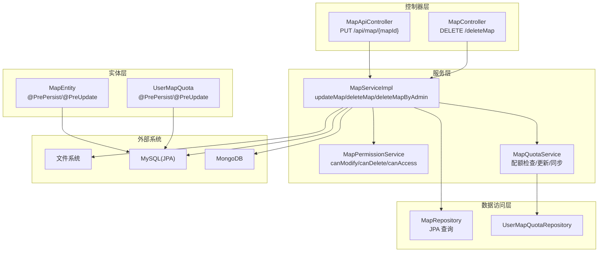
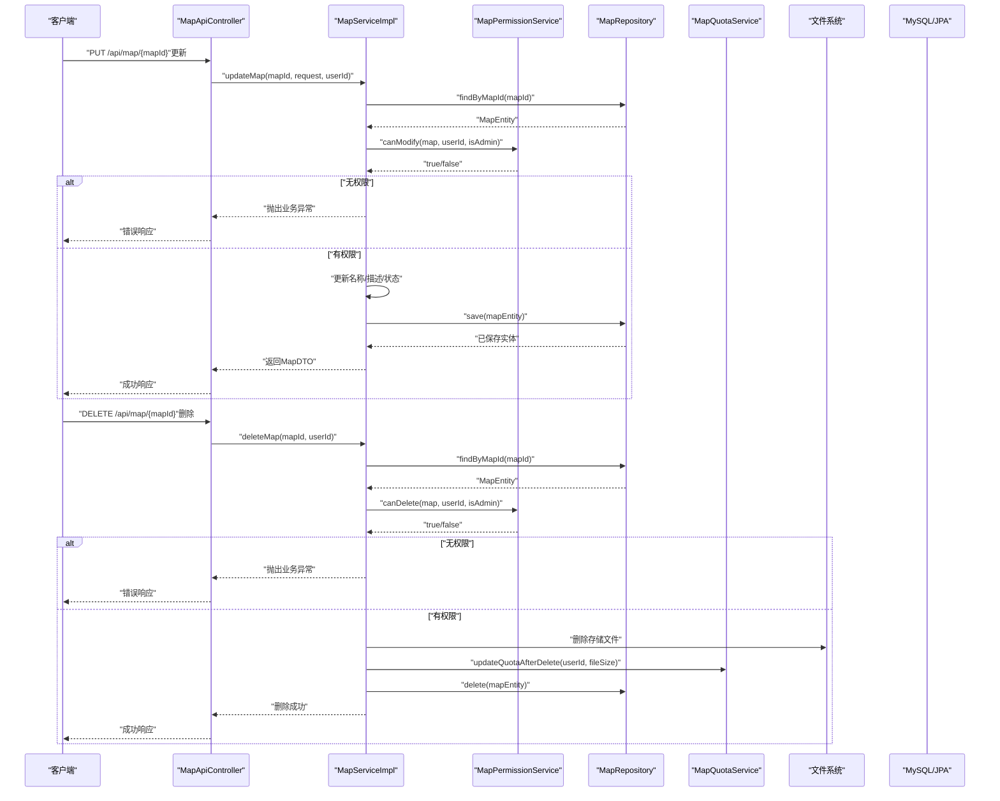
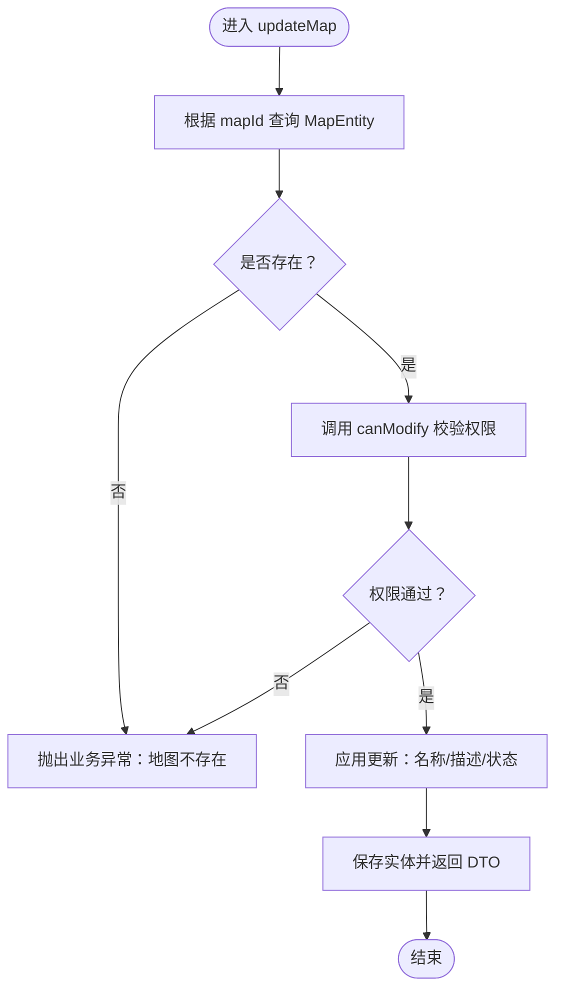
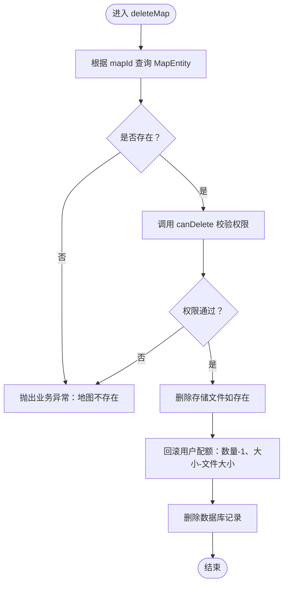
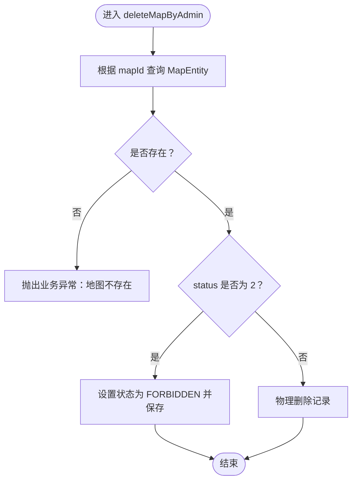
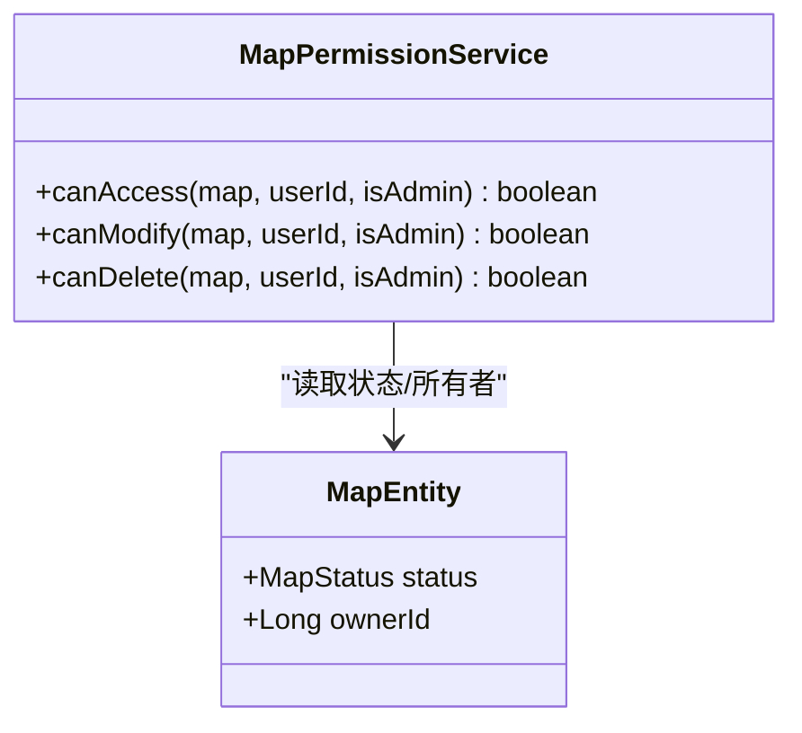
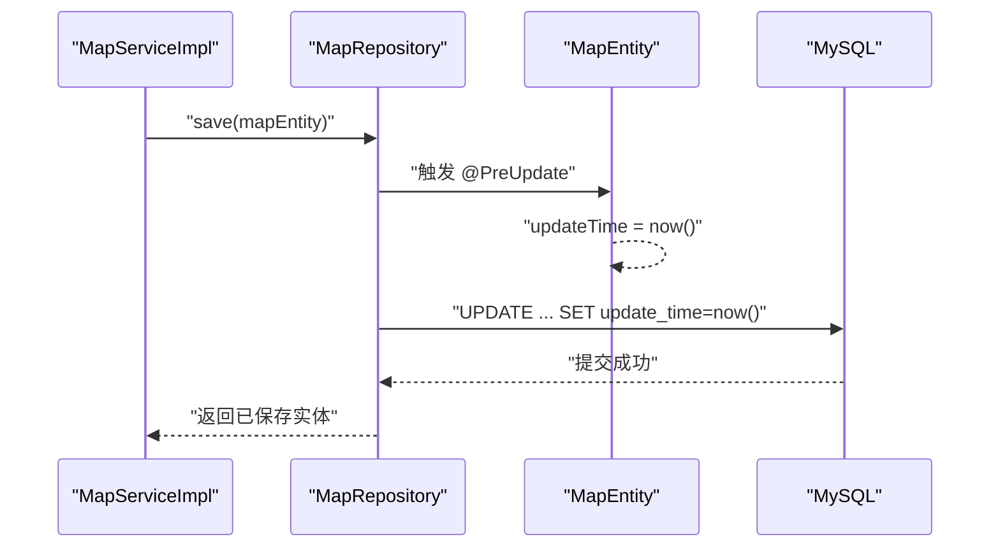
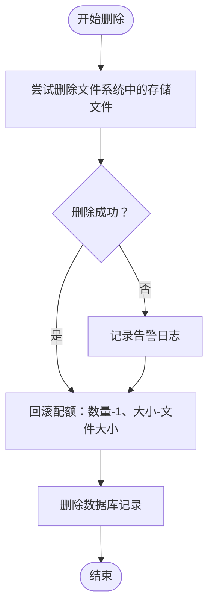
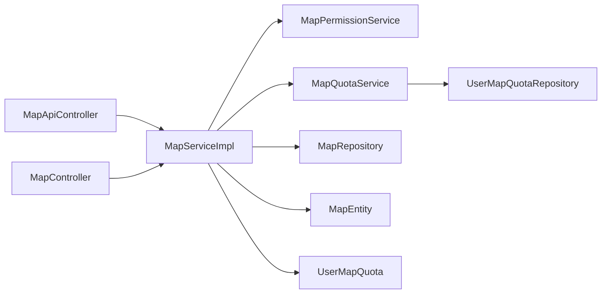

# 更新与删除

<cite>
**本文引用的文件**
- [MapServiceImpl.java](file://plugins/plugin-map/src/main/java/com/traffic/sim/plugin/map/service/MapServiceImpl.java)
- [MapPermissionService.java](file://plugins/plugin-map/src/main/java/com/traffic/sim/plugin/map/service/MapPermissionService.java)
- [MapEntity.java](file://plugins/plugin-map/src/main/java/com/traffic/sim/plugin/map/entity/MapEntity.java)
- [MapRepository.java](file://plugins/plugin-map/src/main/java/com/traffic/sim/plugin/map/repository/MapRepository.java)
- [MapUpdateRequest.java](file://traffic-sim-common/src/main/java/com/traffic/sim/common/dto/MapUpdateRequest.java)
- [MapQuotaService.java](file://plugins/plugin-map/src/main/java/com/traffic/sim/plugin/map/service/MapQuotaService.java)
- [UserMapQuota.java](file://plugins/plugin-map/src/main/java/com/traffic/sim/plugin/map/entity/UserMapQuota.java)
- [UserMapQuotaRepository.java](file://plugins/plugin-map/src/main/java/com/traffic/sim/plugin/map/repository/UserMapQuotaRepository.java)
- [MapApiController.java](file://plugins/plugin-map/src/main/java/com/traffic/sim/plugin/map/controller/MapApiController.java)
- [MapController.java](file://plugins/plugin-map/src/main/java/com/traffic/sim/plugin/map/controller/MapController.java)
</cite>

## 目录
1. [简介](#简介)
2. [项目结构](#项目结构)
3. [核心组件](#核心组件)
4. [架构总览](#架构总览)
5. [详细组件分析](#详细组件分析)
6. [依赖关系分析](#依赖关系分析)
7. [性能考量](#性能考量)
8. [故障排查指南](#故障排查指南)
9. [结论](#结论)
10. [附录：使用示例](#附录使用示例)

## 简介
本章节聚焦于“地图更新与删除”功能，围绕以下目标展开：
- 解释 MapServiceImpl 中 updateMap 如何处理名称、描述、状态的更新；
- 解释 deleteMap 与 deleteMapByAdmin 的删除逻辑；
- 描述 MapPermissionService 的 canModify 与 canDelete 权限校验；
- 展示 @PreUpdate 生命周期方法对更新时间的自动维护；
- 文档化删除时的文件系统清理与用户配额回滚流程；
- 提供用户更新地图状态与管理员禁用地图的实际使用示例。

## 项目结构
本功能位于插件模块 plugin-map 内，采用分层设计：
- 控制器层：对外暴露 REST 接口，负责参数解析与响应封装；
- 服务层：实现业务逻辑，包括权限校验、配额管理、文件清理等；
- 数据访问层：JPA Repository 与 MongoTemplate 访问数据库与文档存储；
- 实体层：JPA 实体与配额实体，包含 JPA 生命周期回调。

图表来源
- [MapApiController.java](file://plugins/plugin-map/src/main/java/com/traffic/sim/plugin/map/controller/MapApiController.java#L88-L113)
- [MapController.java](file://plugins/plugin-map/src/main/java/com/traffic/sim/plugin/map/controller/MapController.java#L109-L121)
- [MapServiceImpl.java](file://plugins/plugin-map/src/main/java/com/traffic/sim/plugin/map/service/MapServiceImpl.java#L171-L242)
- [MapPermissionService.java](file://plugins/plugin-map/src/main/java/com/traffic/sim/plugin/map/service/MapPermissionService.java#L19-L63)
- [MapQuotaService.java](file://plugins/plugin-map/src/main/java/com/traffic/sim/plugin/map/service/MapQuotaService.java#L33-L71)
- [MapRepository.java](file://plugins/plugin-map/src/main/java/com/traffic/sim/plugin/map/repository/MapRepository.java#L25-L84)
- [UserMapQuotaRepository.java](file://plugins/plugin-map/src/main/java/com/traffic/sim/plugin/map/repository/UserMapQuotaRepository.java#L15-L21)
- [MapEntity.java](file://plugins/plugin-map/src/main/java/com/traffic/sim/plugin/map/entity/MapEntity.java#L101-L113)
- [UserMapQuota.java](file://plugins/plugin-map/src/main/java/com/traffic/sim/plugin/map/entity/UserMapQuota.java#L45-L54)

章节来源
- [MapApiController.java](file://plugins/plugin-map/src/main/java/com/traffic/sim/plugin/map/controller/MapApiController.java#L22-L146)
- [MapController.java](file://plugins/plugin-map/src/main/java/com/traffic/sim/plugin/map/controller/MapController.java#L23-L155)
- [MapServiceImpl.java](file://plugins/plugin-map/src/main/java/com/traffic/sim/plugin/map/service/MapServiceImpl.java#L40-L395)

## 核心组件
- MapServiceImpl：实现地图更新、删除、配额管理、文件清理、权限校验与MongoDB读取等核心逻辑。
- MapPermissionService：提供 canAccess/canModify/canDelete 权限判定。
- MapEntity：定义地图实体及 JPA 生命周期回调（创建/更新时间）。
- MapRepository：提供按 mapId、状态、名称等条件的查询与分页能力。
- MapQuotaService：配额检查、上传/删除后的配额更新、配额同步。
- UserMapQuota/UserMapQuotaRepository：用户配额实体与持久化。
- MapUpdateRequest：更新请求载体，包含名称、描述、状态字段。
- MapApiController/MapController：对外暴露 REST 接口，统一由服务层处理。

章节来源
- [MapServiceImpl.java](file://plugins/plugin-map/src/main/java/com/traffic/sim/plugin/map/service/MapServiceImpl.java#L40-L395)
- [MapPermissionService.java](file://plugins/plugin-map/src/main/java/com/traffic/sim/plugin/map/service/MapPermissionService.java#L12-L66)
- [MapEntity.java](file://plugins/plugin-map/src/main/java/com/traffic/sim/plugin/map/entity/MapEntity.java#L13-L116)
- [MapRepository.java](file://plugins/plugin-map/src/main/java/com/traffic/sim/plugin/map/repository/MapRepository.java#L19-L87)
- [MapQuotaService.java](file://plugins/plugin-map/src/main/java/com/traffic/sim/plugin/map/service/MapQuotaService.java#L21-L115)
- [UserMapQuota.java](file://plugins/plugin-map/src/main/java/com/traffic/sim/plugin/map/entity/UserMapQuota.java#L13-L57)
- [UserMapQuotaRepository.java](file://plugins/plugin-map/src/main/java/com/traffic/sim/plugin/map/repository/UserMapQuotaRepository.java#L14-L23)
- [MapUpdateRequest.java](file://traffic-sim-common/src/main/java/com/traffic/sim/common/dto/MapUpdateRequest.java#L13-L27)
- [MapApiController.java](file://plugins/plugin-map/src/main/java/com/traffic/sim/plugin/map/controller/MapApiController.java#L22-L146)
- [MapController.java](file://plugins/plugin-map/src/main/java/com/traffic/sim/plugin/map/controller/MapController.java#L23-L155)

## 架构总览
下图展示了“更新与删除”的端到端调用链路与关键参与者。

图表来源
- [MapApiController.java](file://plugins/plugin-map/src/main/java/com/traffic/sim/plugin/map/controller/MapApiController.java#L88-L113)
- [MapServiceImpl.java](file://plugins/plugin-map/src/main/java/com/traffic/sim/plugin/map/service/MapServiceImpl.java#L171-L225)
- [MapPermissionService.java](file://plugins/plugin-map/src/main/java/com/traffic/sim/plugin/map/service/MapPermissionService.java#L42-L63)
- [MapRepository.java](file://plugins/plugin-map/src/main/java/com/traffic/sim/plugin/map/repository/MapRepository.java#L25-L25)
- [MapQuotaService.java](file://plugins/plugin-map/src/main/java/com/traffic/sim/plugin/map/service/MapQuotaService.java#L63-L71)

## 详细组件分析

### MapServiceImpl.updateMap：更新地图信息
- 输入：mapId、MapUpdateRequest（包含 name、description、status）、userId。
- 流程要点：
  - 通过 MapRepository 根据 mapId 查找实体；
  - 使用 MapPermissionService.canModify 进行权限校验（管理员可修改；仅所有者可修改）；
  - 对请求中的非空字段进行更新（名称、描述、状态码映射为枚举）；
  - 保存并返回 DTO。
- 关键点：
  - 状态字段通过 MapEntity.MapStatus.fromCode 安全转换；
  - 权限校验失败直接抛出业务异常；
  - 事务注解确保数据库一致性。

图表来源
- [MapServiceImpl.java](file://plugins/plugin-map/src/main/java/com/traffic/sim/plugin/map/service/MapServiceImpl.java#L171-L195)
- [MapPermissionService.java](file://plugins/plugin-map/src/main/java/com/traffic/sim/plugin/map/service/MapPermissionService.java#L42-L50)
- [MapEntity.java](file://plugins/plugin-map/src/main/java/com/traffic/sim/plugin/map/entity/MapEntity.java#L91-L99)

章节来源
- [MapServiceImpl.java](file://plugins/plugin-map/src/main/java/com/traffic/sim/plugin/map/service/MapServiceImpl.java#L171-L195)
- [MapUpdateRequest.java](file://traffic-sim-common/src/main/java/com/traffic/sim/common/dto/MapUpdateRequest.java#L14-L25)
- [MapEntity.java](file://plugins/plugin-map/src/main/java/com/traffic/sim/plugin/map/entity/MapEntity.java#L91-L99)

### MapServiceImpl.deleteMap：用户删除地图
- 输入：mapId、userId。
- 流程要点：
  - 校验权限（仅所有者或管理员可删除）；
  - 尝试删除文件系统中的存储文件（若存在）；
  - 回滚用户配额（减少地图数量与总大小）；
  - 删除数据库记录。
- 异常处理：
  - 文件删除失败仅记录告警，不影响整体删除流程；
  - 权限不足或地图不存在会抛出业务异常。

图表来源
- [MapServiceImpl.java](file://plugins/plugin-map/src/main/java/com/traffic/sim/plugin/map/service/MapServiceImpl.java#L197-L225)
- [MapPermissionService.java](file://plugins/plugin-map/src/main/java/com/traffic/sim/plugin/map/service/MapPermissionService.java#L55-L63)
- [MapQuotaService.java](file://plugins/plugin-map/src/main/java/com/traffic/sim/plugin/map/service/MapQuotaService.java#L63-L71)

章节来源
- [MapServiceImpl.java](file://plugins/plugin-map/src/main/java/com/traffic/sim/plugin/map/service/MapServiceImpl.java#L197-L225)
- [MapQuotaService.java](file://plugins/plugin-map/src/main/java/com/traffic/sim/plugin/map/service/MapQuotaService.java#L63-L71)

### MapServiceImpl.deleteMapByAdmin：管理员删除/禁用地图
- 输入：mapId、status（可选）。
- 行为：
  - 若 status 为 2，则将地图状态置为 FORBIDDEN（禁用），不物理删除；
  - 否则执行物理删除。
- 适用场景：
  - 管理员快速处置违规或风险地图，保留记录以便审计。

图表来源
- [MapServiceImpl.java](file://plugins/plugin-map/src/main/java/com/traffic/sim/plugin/map/service/MapServiceImpl.java#L227-L242)
- [MapEntity.java](file://plugins/plugin-map/src/main/java/com/traffic/sim/plugin/map/entity/MapEntity.java#L70-L99)

章节来源
- [MapServiceImpl.java](file://plugins/plugin-map/src/main/java/com/traffic/sim/plugin/map/service/MapServiceImpl.java#L227-L242)
- [MapEntity.java](file://plugins/plugin-map/src/main/java/com/traffic/sim/plugin/map/entity/MapEntity.java#L70-L99)

### MapPermissionService：权限校验
- canAccess：管理员可访问除禁用外的所有地图；公开地图所有用户可访问；私有地图仅所有者可访问；禁用地图不可访问。
- canModify：管理员可修改所有地图；仅所有者可修改。
- canDelete：管理员可删除所有地图；仅所有者可删除。

图表来源
- [MapPermissionService.java](file://plugins/plugin-map/src/main/java/com/traffic/sim/plugin/map/service/MapPermissionService.java#L19-L63)
- [MapEntity.java](file://plugins/plugin-map/src/main/java/com/traffic/sim/plugin/map/entity/MapEntity.java#L45-L50)

章节来源
- [MapPermissionService.java](file://plugins/plugin-map/src/main/java/com/traffic/sim/plugin/map/service/MapPermissionService.java#L19-L63)

### @PreUpdate 生命周期：自动维护更新时间
- MapEntity 与 UserMapQuota 在每次更新前自动设置 updateTime 为当前时间，保证数据变更的可追溯性。
- 与 MapServiceImpl.updateMap 的保存操作配合，确保数据库记录的 update_time 字段被正确更新。

图表来源
- [MapEntity.java](file://plugins/plugin-map/src/main/java/com/traffic/sim/plugin/map/entity/MapEntity.java#L110-L113)
- [UserMapQuota.java](file://plugins/plugin-map/src/main/java/com/traffic/sim/plugin/map/entity/UserMapQuota.java#L51-L54)
- [MapServiceImpl.java](file://plugins/plugin-map/src/main/java/com/traffic/sim/plugin/map/service/MapServiceImpl.java#L193-L194)

章节来源
- [MapEntity.java](file://plugins/plugin-map/src/main/java/com/traffic/sim/plugin/map/entity/MapEntity.java#L101-L113)
- [UserMapQuota.java](file://plugins/plugin-map/src/main/java/com/traffic/sim/plugin/map/entity/UserMapQuota.java#L45-L54)

### 删除流程：文件系统清理与配额回滚
- 文件清理：尝试删除存储路径下的文件；失败仅记录告警，不阻断删除；
- 配额回滚：调用 MapQuotaService.updateQuotaAfterDelete，原子性地减少用户当前地图数与总大小；
- 数据库清理：删除对应记录。

图表来源
- [MapServiceImpl.java](file://plugins/plugin-map/src/main/java/com/traffic/sim/plugin/map/service/MapServiceImpl.java#L209-L224)
- [MapQuotaService.java](file://plugins/plugin-map/src/main/java/com/traffic/sim/plugin/map/service/MapQuotaService.java#L63-L71)

章节来源
- [MapServiceImpl.java](file://plugins/plugin-map/src/main/java/com/traffic/sim/plugin/map/service/MapServiceImpl.java#L209-L224)
- [MapQuotaService.java](file://plugins/plugin-map/src/main/java/com/traffic/sim/plugin/map/service/MapQuotaService.java#L63-L71)

## 依赖关系分析
- MapServiceImpl 依赖 MapPermissionService、MapQuotaService、MapRepository、UserMapQuotaRepository、MongoTemplate；
- MapPermissionService 依赖 MapEntity；
- MapQuotaService 依赖 UserMapQuotaRepository 与 MapRepository；
- MapRepository 提供多种查询方法，支撑分页与筛选；
- 控制器层通过 RequestContext 获取当前用户ID，统一注入服务层。

图表来源
- [MapApiController.java](file://plugins/plugin-map/src/main/java/com/traffic/sim/plugin/map/controller/MapApiController.java#L28-L28)
- [MapController.java](file://plugins/plugin-map/src/main/java/com/traffic/sim/plugin/map/controller/MapController.java#L29-L29)
- [MapServiceImpl.java](file://plugins/plugin-map/src/main/java/com/traffic/sim/plugin/map/service/MapServiceImpl.java#L45-L50)
- [MapPermissionService.java](file://plugins/plugin-map/src/main/java/com/traffic/sim/plugin/map/service/MapPermissionService.java#L14-L14)
- [MapQuotaService.java](file://plugins/plugin-map/src/main/java/com/traffic/sim/plugin/map/service/MapQuotaService.java#L26-L28)
- [MapRepository.java](file://plugins/plugin-map/src/main/java/com/traffic/sim/plugin/map/repository/MapRepository.java#L20-L20)
- [UserMapQuotaRepository.java](file://plugins/plugin-map/src/main/java/com/traffic/sim/plugin/map/repository/UserMapQuotaRepository.java#L15-L15)

章节来源
- [MapServiceImpl.java](file://plugins/plugin-map/src/main/java/com/traffic/sim/plugin/map/service/MapServiceImpl.java#L45-L50)
- [MapPermissionService.java](file://plugins/plugin-map/src/main/java/com/traffic/sim/plugin/map/service/MapPermissionService.java#L14-L14)
- [MapQuotaService.java](file://plugins/plugin-map/src/main/java/com/traffic/sim/plugin/map/service/MapQuotaService.java#L26-L28)
- [MapRepository.java](file://plugins/plugin-map/src/main/java/com/traffic/sim/plugin/map/repository/MapRepository.java#L20-L20)
- [UserMapQuotaRepository.java](file://plugins/plugin-map/src/main/java/com/traffic/sim/plugin/map/repository/UserMapQuotaRepository.java#L15-L15)

## 性能考量
- 事务边界：更新与删除均在 @Transactional 包裹内，确保一致性与原子性；
- 文件删除：IO 操作可能成为瓶颈，建议异步化或批量处理；
- 配额更新：单次更新为 O(1)，适合高频调用；
- 查询优化：MapRepository 已提供多条件分页查询，注意索引与分页大小控制；
- 生命周期回调：@PrePersist/@PreUpdate 仅写入时间戳，开销极低。

## 故障排查指南
- 权限相关
  - 症状：提示“无权修改/删除该地图”；
  - 排查：确认当前用户是否为地图所有者或管理员；检查 MapPermissionService 的判定逻辑；
  - 参考：[MapPermissionService.java](file://plugins/plugin-map/src/main/java/com/traffic/sim/plugin/map/service/MapPermissionService.java#L42-L63)
- 地图不存在
  - 症状：提示“地图不存在”；
  - 排查：确认 mapId 是否正确；检查 MapRepository.findByMapId；
  - 参考：[MapRepository.java](file://plugins/plugin-map/src/main/java/com/traffic/sim/plugin/map/repository/MapRepository.java#L25-L25)
- 文件删除失败
  - 症状：删除日志出现告警；
  - 排查：检查存储路径、权限与磁盘空间；确认文件是否存在；
  - 参考：[MapServiceImpl.java](file://plugins/plugin-map/src/main/java/com/traffic/sim/plugin/map/service/MapServiceImpl.java#L210-L217)
- 配额异常
  - 症状：删除后配额未回滚或数值异常；
  - 排查：核对 MapQuotaService.updateQuotaAfterDelete 的实现；必要时执行配额同步；
  - 参考：[MapQuotaService.java](file://plugins/plugin-map/src/main/java/com/traffic/sim/plugin/map/service/MapQuotaService.java#L63-L71)

章节来源
- [MapPermissionService.java](file://plugins/plugin-map/src/main/java/com/traffic/sim/plugin/map/service/MapPermissionService.java#L42-L63)
- [MapRepository.java](file://plugins/plugin-map/src/main/java/com/traffic/sim/plugin/map/repository/MapRepository.java#L25-L25)
- [MapServiceImpl.java](file://plugins/plugin-map/src/main/java/com/traffic/sim/plugin/map/service/MapServiceImpl.java#L210-L217)
- [MapQuotaService.java](file://plugins/plugin-map/src/main/java/com/traffic/sim/plugin/map/service/MapQuotaService.java#L63-L71)

## 结论
- 更新流程以权限校验为核心，确保仅所有者与管理员可操作；状态更新通过安全的枚举映射完成；
- 删除流程兼顾数据与文件系统的完整性，通过配额回滚与事务保证一致性；
- @PreUpdate 自动维护更新时间，提升审计与追踪能力；
- 管理员可通过 deleteMapByAdmin 快速禁用地图，保留记录便于后续处理。

## 附录：使用示例

- 用户更新地图状态
  - 请求：PUT /api/map/{mapId}
  - Body：MapUpdateRequest（包含 status）
  - 示例路径：[MapApiController.java](file://plugins/plugin-map/src/main/java/com/traffic/sim/plugin/map/controller/MapApiController.java#L92-L101)
  - 请求体参考：[MapUpdateRequest.java](file://traffic-sim-common/src/main/java/com/traffic/sim/common/dto/MapUpdateRequest.java#L14-L25)

- 管理员禁用地图
  - 请求：DELETE /deleteMap
  - Body：包含 mapId 与 status=2
  - 示例路径：[MapController.java](file://plugins/plugin-map/src/main/java/com/traffic/sim/plugin/map/controller/MapController.java#L109-L121)
  - 逻辑实现：[MapServiceImpl.java](file://plugins/plugin-map/src/main/java/com/traffic/sim/plugin/map/service/MapServiceImpl.java#L227-L242)

- 删除用户自己的地图
  - 请求：DELETE /api/map/{mapId}
  - 示例路径：[MapApiController.java](file://plugins/plugin-map/src/main/java/com/traffic/sim/plugin/map/controller/MapApiController.java#L103-L113)
  - 实现逻辑：[MapServiceImpl.java](file://plugins/plugin-map/src/main/java/com/traffic/sim/plugin/map/service/MapServiceImpl.java#L197-L225)