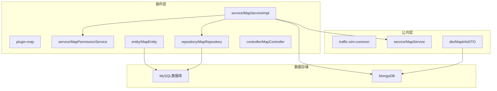
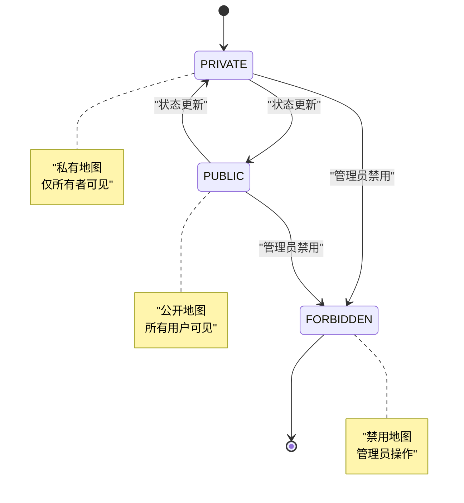
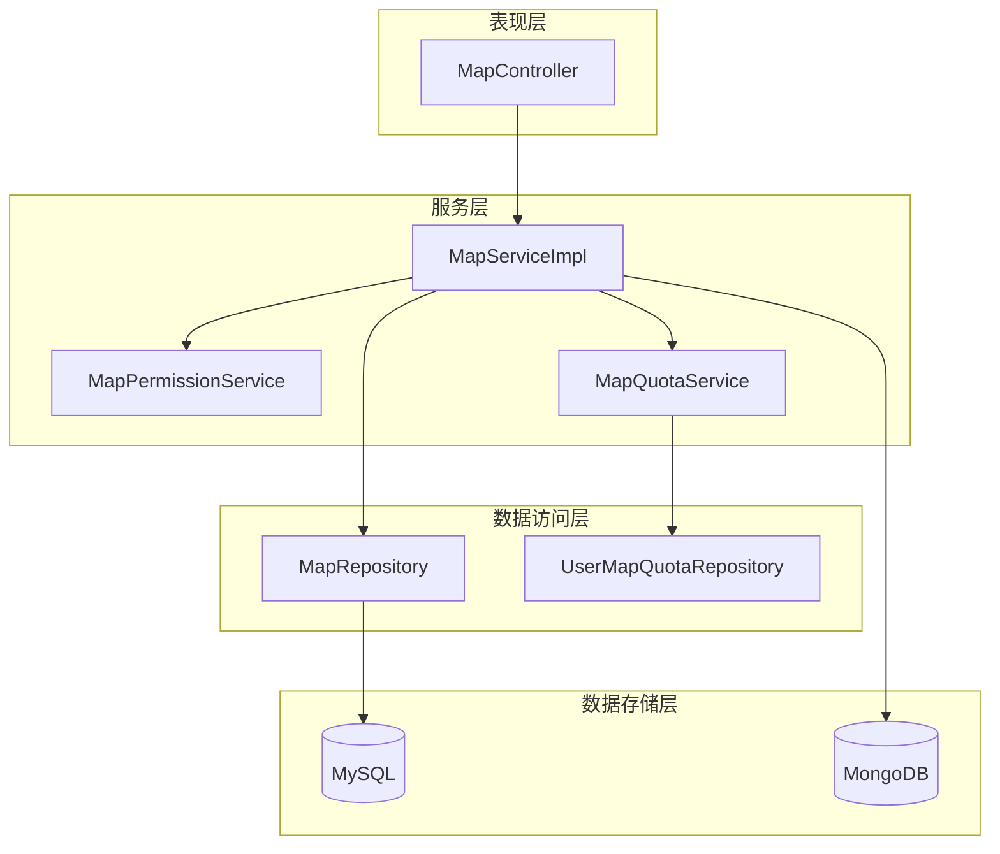
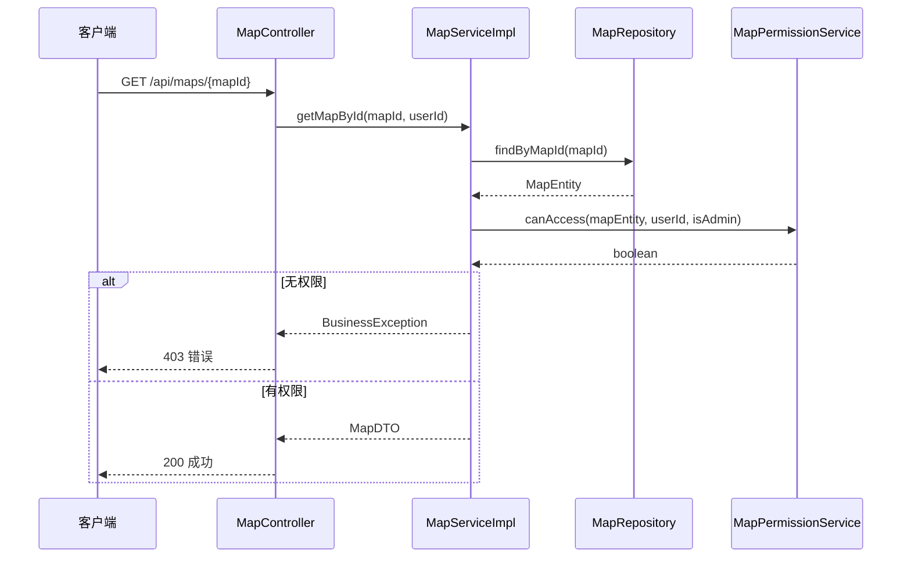
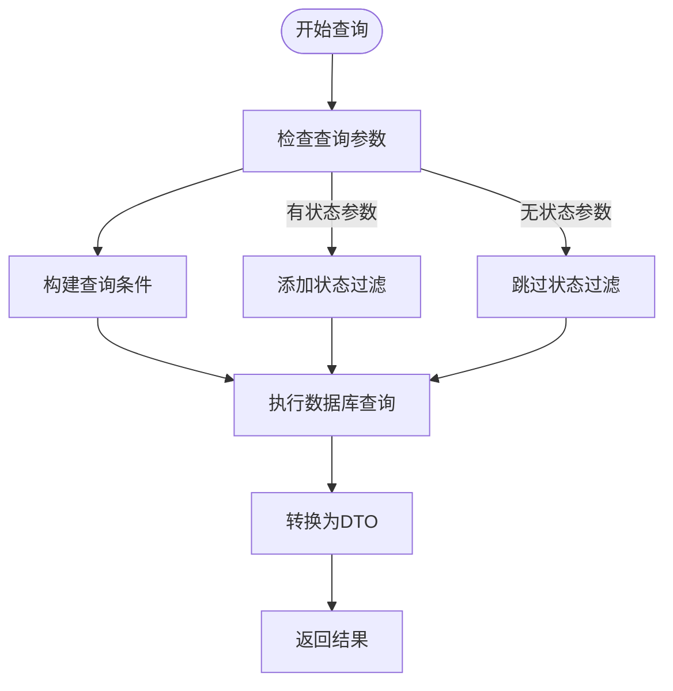
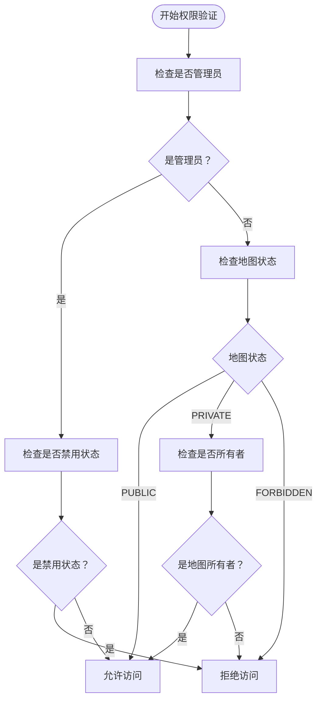
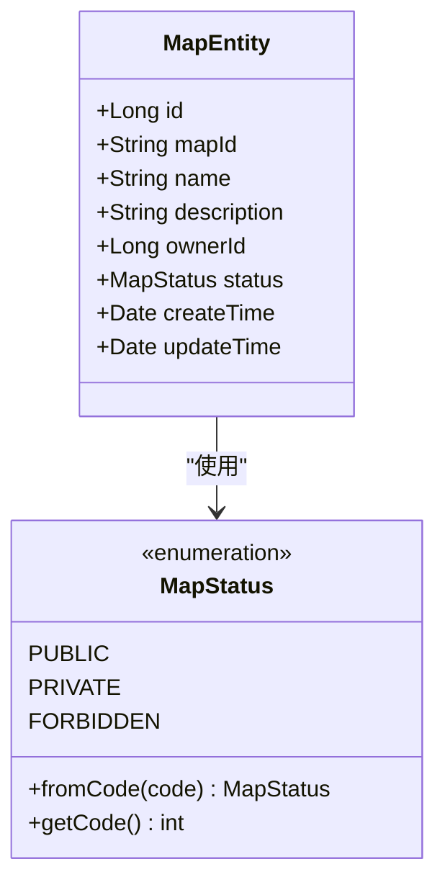
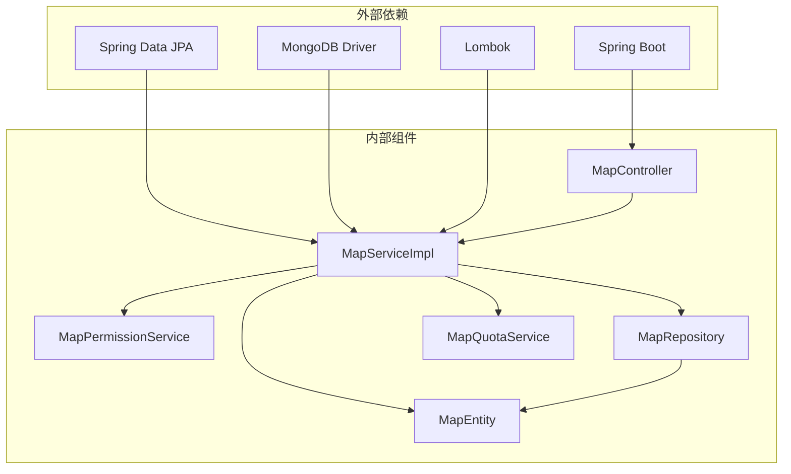

# 查询与访问

<cite>
**本文档引用的文件**
- [MapServiceImpl.java](file://plugins/plugin-map/src/main/java/com/traffic/sim/plugin/map/service/MapServiceImpl.java)
- [MapPermissionService.java](file://plugins/plugin-map/src/main/java/com/traffic/sim/plugin/map/service/MapPermissionService.java)
- [MapEntity.java](file://plugins/plugin-map/src/main/java/com/traffic/sim/plugin/map/entity/MapEntity.java)
- [MapRepository.java](file://plugins/plugin-map/src/main/java/com/traffic/sim/plugin/map/repository/MapRepository.java)
- [MapController.java](file://plugins/plugin-map/src/main/java/com/traffic/sim/plugin/map/controller/MapController.java)
- [MapService.java](file://traffic-sim-common/src/main/java/com/traffic/sim/common/service/MapService.java)
- [MapQuotaService.java](file://plugins/plugin-map/src/main/java/com/traffic/sim/plugin/map/service/MapQuotaService.java)
- [UserMapQuotaRepository.java](file://plugins/plugin-map/src/main/java/com/traffic/sim/plugin/map/repository/UserMapQuotaRepository.java)
- [MapListResponse.java](file://plugins/plugin-map/src/main/java/com/traffic/sim/plugin/map/dto/MapListResponse.java)
- [MapInfoDTO.java](file://traffic-sim-common/src/main/java/com/traffic/sim/common/dto/MapInfoDTO.java)
</cite>

## 目录
1. [简介](#简介)
2. [项目结构](#项目结构)
3. [核心组件](#核心组件)
4. [架构概览](#架构概览)
5. [详细组件分析](#详细组件分析)
6. [依赖关系分析](#依赖关系分析)
7. [性能考虑](#性能考虑)
8. [故障排除指南](#故障排除指南)
9. [结论](#结论)

## 简介

本文档深入解析交通模拟系统中地图查询与访问功能的完整实现。重点涵盖以下核心功能：

- **MapServiceImpl** 中的查询方法：`getMapById`、`getUserMaps`、`getPublicMaps` 和 `getAllMaps`
- **MapPermissionService** 的权限验证机制：`canAccess` 方法如何基于地图状态和用户身份进行访问控制
- **MapEntity** 实体的状态机设计及其在访问控制中的应用
- 不同用户角色的查询行为差异和权限不足时的错误处理机制

该系统采用分层架构设计，通过明确的职责分离实现了安全、高效的地图查询与访问控制。

## 项目结构

地图查询与访问功能主要分布在以下模块中：

**图表来源**
- [MapServiceImpl.java](file://plugins/plugin-map/src/main/java/com/traffic/sim/plugin/map/service/MapServiceImpl.java#L43-L394)
- [MapPermissionService.java](file://plugins/plugin-map/src/main/java/com/traffic/sim/plugin/map/service/MapPermissionService.java#L14-L66)
- [MapEntity.java](file://plugins/plugin-map/src/main/java/com/traffic/sim/plugin/map/entity/MapEntity.java#L16-L116)

**章节来源**
- [MapServiceImpl.java](file://plugins/plugin-map/src/main/java/com/traffic/sim/plugin/map/service/MapServiceImpl.java#L1-L395)
- [MapController.java](file://plugins/plugin-map/src/main/java/com/traffic/sim/plugin/map/controller/MapController.java#L1-L155)

## 核心组件

### MapServiceImpl - 地图服务实现

MapServiceImpl 是地图功能的核心实现类，负责处理所有地图相关的业务逻辑。该类实现了 MapService 接口，提供了完整的地图查询、权限验证和数据转换功能。

**关键特性：**
- **事务管理**：所有写操作都使用 `@Transactional` 注解确保数据一致性
- **权限验证**：集成 MapPermissionService 进行访问控制
- **数据转换**：提供实体与 DTO 之间的双向转换
- **配额管理**：集成 MapQuotaService 处理用户存储配额

**章节来源**
- [MapServiceImpl.java](file://plugins/plugin-map/src/main/java/com/traffic/sim/plugin/map/service/MapServiceImpl.java#L43-L394)

### MapPermissionService - 权限验证服务

MapPermissionService 提供了地图访问的核心权限控制逻辑，定义了清晰的访问规则：

**权限规则矩阵：**
- **管理员**：可访问除禁用外的所有地图
- **公开地图**：所有用户均可访问
- **私有地图**：仅所有者可访问
- **禁用地图**：禁止访问

**章节来源**
- [MapPermissionService.java](file://plugins/plugin-map/src/main/java/com/traffic/sim/plugin/map/service/MapPermissionService.java#L19-L37)

### MapEntity - 地图实体模型

MapEntity 定义了地图的完整数据模型，包括状态机设计：

**图表来源**
- [MapEntity.java](file://plugins/plugin-map/src/main/java/com/traffic/sim/plugin/map/entity/MapEntity.java#L70-L99)

**章节来源**
- [MapEntity.java](file://plugins/plugin-map/src/main/java/com/traffic/sim/plugin/map/entity/MapEntity.java#L16-L116)

## 架构概览

系统采用分层架构，各层职责明确：

**图表来源**
- [MapController.java](file://plugins/plugin-map/src/main/java/com/traffic/sim/plugin/map/controller/MapController.java#L27-L153)
- [MapServiceImpl.java](file://plugins/plugin-map/src/main/java/com/traffic/sim/plugin/map/service/MapServiceImpl.java#L45-L50)

## 详细组件分析

### MapServiceImpl 查询方法详解

#### getMapById - 单个地图查询

getMapById 方法实现了精确的地图查询功能，包含完整的权限验证流程：

**图表来源**
- [MapServiceImpl.java](file://plugins/plugin-map/src/main/java/com/traffic/sim/plugin/map/service/MapServiceImpl.java#L158-L169)
- [MapController.java](file://plugins/plugin-map/src/main/java/com/traffic/sim/plugin/map/controller/MapController.java#L142-L152)

**实现要点：**
- 使用 `Optional` 处理不存在的地图
- 集成权限验证服务进行访问控制
- 抛出业务异常而非空指针异常

**章节来源**
- [MapServiceImpl.java](file://plugins/plugin-map/src/main/java/com/traffic/sim/plugin/map/service/MapServiceImpl.java#L158-L169)

#### getUserMaps - 用户地图查询

getUserMaps 方法支持按用户、状态和名称的多条件查询：

**图表来源**
- [MapServiceImpl.java](file://plugins/plugin-map/src/main/java/com/traffic/sim/plugin/map/service/MapServiceImpl.java#L122-L146)
- [MapRepository.java](file://plugins/plugin-map/src/main/java/com/traffic/sim/plugin/map/repository/MapRepository.java#L45-L59)

**查询逻辑特点：**
- 支持模糊匹配的地图名称搜索
- 可选的状态过滤条件
- 分页查询支持

**章节来源**
- [MapServiceImpl.java](file://plugins/plugin-map/src/main/java/com/traffic/sim/plugin/map/service/MapServiceImpl.java#L122-L146)
- [MapRepository.java](file://plugins/plugin-map/src/main/java/com/traffic/sim/plugin/map/repository/MapRepository.java#L20-L85)

#### getPublicMaps - 公开地图查询

getPublicMaps 方法专门处理公开地图的查询：

**实现特征：**
- 固定查询公开状态的地图
- 支持名称模糊搜索
- 使用专用的 JPQL 查询

**章节来源**
- [MapServiceImpl.java](file://plugins/plugin-map/src/main/java/com/traffic/sim/plugin/map/service/MapServiceImpl.java#L148-L155)
- [MapRepository.java](file://plugins/plugin-map/src/main/java/com/traffic/sim/plugin/map/repository/MapRepository.java#L61-L68)

#### getAllMaps - 管理员全量查询

getAllMaps 方法提供管理员级别的全量地图查询：

**权限要求：**
- 仅管理员可访问
- 无状态过滤，查询所有地图
- 支持名称搜索

**章节来源**
- [MapServiceImpl.java](file://plugins/plugin-map/src/main/java/com/traffic/sim/plugin/map/service/MapServiceImpl.java#L244-L250)
- [MapRepository.java](file://plugins/plugin-map/src/main/java/com/traffic/sim/plugin/map/repository/MapRepository.java#L71-L74)

### MapPermissionService 权限验证机制

MapPermissionService 的 canAccess 方法实现了复杂的权限验证逻辑：

**图表来源**
- [MapPermissionService.java](file://plugins/plugin-map/src/main/java/com/traffic/sim/plugin/map/service/MapPermissionService.java#L19-L37)

**权限验证规则：**

| 用户身份 | 地图状态 | 访问权限 |
|---------|---------|---------|
| 普通用户 | PUBLIC | ✅ 允许 |
| 普通用户 | PRIVATE | ❌ 拒绝（除非是所有者） |
| 普通用户 | FORBIDDEN | ❌ 拒绝 |
| 管理员 | 任意状态 | ✅ 允许（禁用状态除外） |

**章节来源**
- [MapPermissionService.java](file://plugins/plugin-map/src/main/java/com/traffic/sim/plugin/map/service/MapPermissionService.java#L19-L37)

### MapEntity 状态机设计

MapEntity 的状态机设计体现了清晰的业务逻辑：

**图表来源**
- [MapEntity.java](file://plugins/plugin-map/src/main/java/com/traffic/sim/plugin/map/entity/MapEntity.java#L16-L99)

**状态转换规则：**
- **默认状态**：PRIVATE（私有）
- **状态变更**：通过状态码转换实现
- **持久化**：使用 ORDINAL 类型存储

**章节来源**
- [MapEntity.java](file://plugins/plugin-map/src/main/java/com/traffic/sim/plugin/map/entity/MapEntity.java#L70-L99)

## 依赖关系分析

系统各组件之间的依赖关系如下：

**图表来源**
- [MapServiceImpl.java](file://plugins/plugin-map/src/main/java/com/traffic/sim/plugin/map/service/MapServiceImpl.java#L1-L34)
- [MapController.java](file://plugins/plugin-map/src/main/java/com/traffic/sim/plugin/map/controller/MapController.java#L1-L16)

**依赖特点：**
- **低耦合高内聚**：各组件职责明确，依赖关系清晰
- **接口隔离**：通过 MapService 接口实现松耦合
- **事务管理**：统一的事务边界管理

**章节来源**
- [MapServiceImpl.java](file://plugins/plugin-map/src/main/java/com/traffic/sim/plugin/map/service/MapServiceImpl.java#L45-L50)
- [MapController.java](file://plugins/plugin-map/src/main/java/com/traffic/sim/plugin/map/controller/MapController.java#L29-L30)

## 性能考虑

### 查询优化策略

1. **索引优化**
   - `map_id` 字段应建立唯一索引
   - `owner_id` 字段建立普通索引
   - `status` 字段建立索引以支持快速筛选

2. **分页查询**
   - 所有列表查询都使用分页避免大数据集加载
   - 默认页面大小设置合理，避免内存溢出

3. **缓存策略**
   - 可考虑对热门地图信息进行缓存
   - 用户配额信息可短期缓存

### 内存管理

- **流式处理**：大文件操作使用流式处理避免内存占用过高
- **及时释放**：文件操作后及时释放资源
- **批量操作**：支持批量删除和更新操作

## 故障排除指南

### 常见问题及解决方案

#### 权限不足错误

**症状：** 返回 "无权访问该地图" 错误

**可能原因：**
1. 用户不是地图所有者
2. 地图状态为 PRIVATE 或 FORBIDDEN
3. 用户未登录或身份验证失败

**解决步骤：**
1. 验证用户登录状态
2. 检查地图状态是否为 PUBLIC
3. 确认用户是否为地图所有者

#### 地图不存在错误

**症状：** 返回 "地图不存在" 错误

**可能原因：**
1. 地图ID错误
2. 地图已被删除
3. 数据库连接问题

**解决步骤：**
1. 验证地图ID格式
2. 检查数据库连接
3. 确认地图状态

#### 配额不足错误

**症状：** 返回 "存储空间不足" 或 "地图数量已达上限" 错误

**解决步骤：**
1. 清理不需要的地图文件
2. 联系管理员提升配额
3. 优化现有地图文件大小

**章节来源**
- [MapServiceImpl.java](file://plugins/plugin-map/src/main/java/com/traffic/sim/plugin/map/service/MapServiceImpl.java#L116-L120)
- [MapQuotaService.java](file://plugins/plugin-map/src/main/java/com/traffic/sim/plugin/map/service/MapQuotaService.java#L33-L45)

## 结论

交通模拟系统的地图查询与访问功能展现了优秀的软件工程实践：

### 设计优势

1. **清晰的权限模型**：基于角色和状态的双重权限控制
2. **良好的分层架构**：职责分离，便于维护和扩展
3. **完善的错误处理**：统一的异常处理机制
4. **性能优化**：合理的查询策略和资源管理

### 最佳实践

1. **权限验证前置**：在数据访问前进行权限检查
2. **事务边界明确**：写操作使用事务确保数据一致性
3. **接口设计规范**：统一的请求响应格式
4. **错误处理标准化**：业务异常与系统异常分离

### 扩展建议

1. **监控指标**：添加查询性能和权限验证的监控
2. **缓存机制**：对热点数据添加缓存层
3. **异步处理**：大文件转换操作异步化
4. **审计日志**：记录重要的权限访问事件

该系统为地图查询与访问功能提供了坚实的技术基础，为后续的功能扩展和性能优化奠定了良好基础。