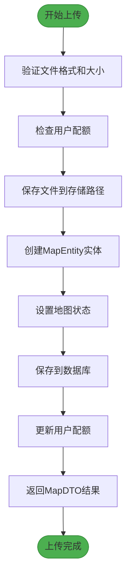
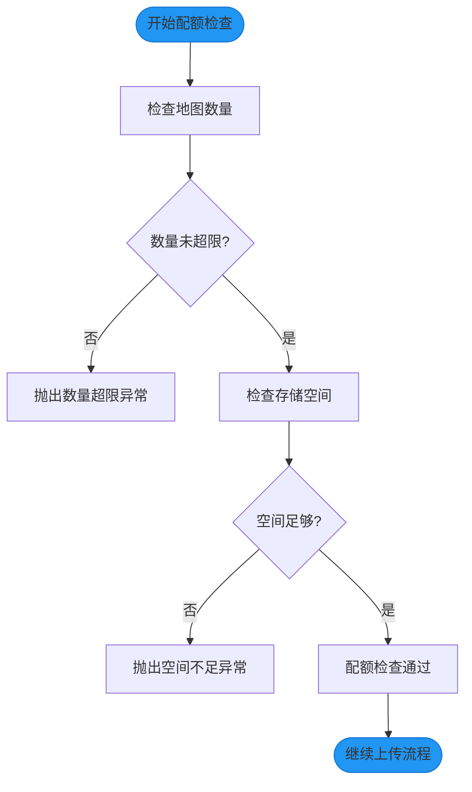
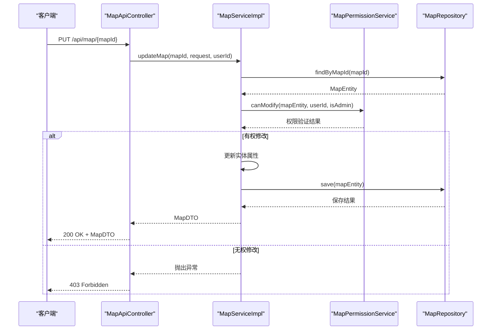
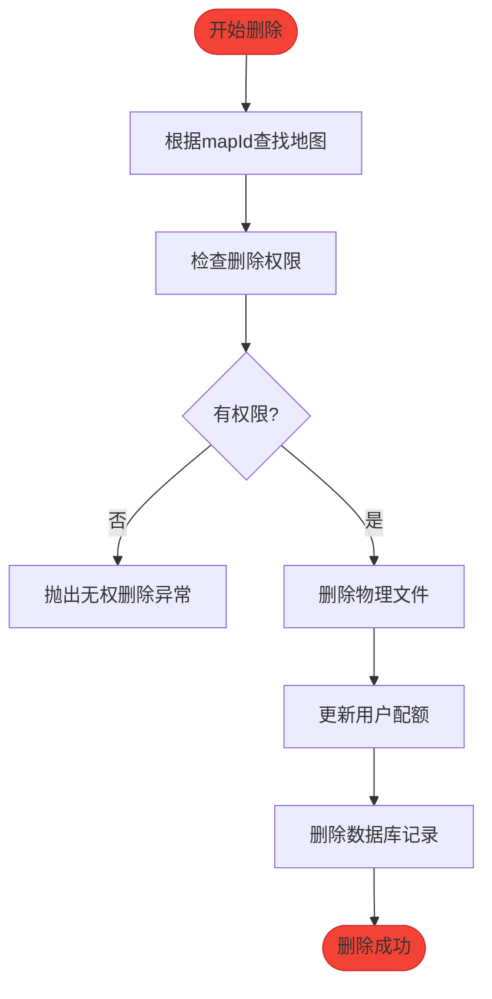
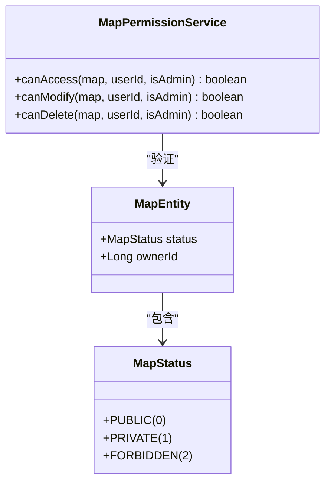
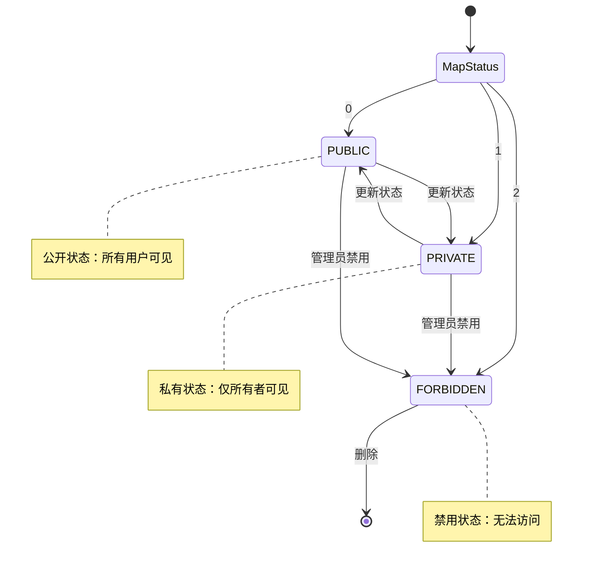

# 核心功能

<cite>
**本文档引用的文件**   
- [MapServiceImpl.java](file://plugins/plugin-map/src/main/java/com/traffic/sim/plugin/map/service/MapServiceImpl.java)
- [MapEntity.java](file://plugins/plugin-map/src/main/java/com/traffic/sim/plugin/map/entity/MapEntity.java)
- [MapPermissionService.java](file://plugins/plugin-map/src/main/java/com/traffic/sim/plugin/map/service/MapPermissionService.java)
- [MapQuotaService.java](file://plugins/plugin-map/src/main/java/com/traffic/sim/plugin/map/service/MapQuotaService.java)
- [MapRepository.java](file://plugins/plugin-map/src/main/java/com/traffic/sim/plugin/map/repository/MapRepository.java)
- [UserMapQuota.java](file://plugins/plugin-map/src/main/java/com/traffic/sim/plugin/map/entity/UserMapQuota.java)
- [MapPluginProperties.java](file://plugins/plugin-map/src/main/java/com/traffic/sim/plugin/map/config/MapPluginProperties.java)
- [MapApiController.java](file://plugins/plugin-map/src/main/java/com/traffic/sim/plugin/map/controller/MapApiController.java)
- [MapService.java](file://traffic-sim-common/src/main/java/com/traffic/sim/common/service/MapService.java)
</cite>

## 目录
1. [地图管理核心功能概述](#地图管理核心功能概述)
2. [地图上传与转换流程](#地图上传与转换流程)
3. [地图信息更新与删除操作](#地图信息更新与删除操作)
4. [权限访问控制机制](#权限访问控制机制)
5. [MapEntity状态机与生命周期管理](#mapentity状态机与生命周期管理)
6. [API使用示例与权限差异](#api使用示例与权限差异)

## 地图管理核心功能概述

本系统提供完整的地图管理功能，包括地图上传、信息更新、权限控制和删除操作。系统通过`MapServiceImpl`类实现核心业务逻辑，结合`MapEntity`实体、`MapRepository`数据访问层和`MapPermissionService`权限服务，构建了一个安全可靠的地图管理系统。系统支持普通用户和管理员两种角色，具有不同的操作权限。

**本节来源**
- [MapServiceImpl.java](file://plugins/plugin-map/src/main/java/com/traffic/sim/plugin/map/service/MapServiceImpl.java#L40-L43)
- [MapEntity.java](file://plugins/plugin-map/src/main/java/com/traffic/sim/plugin/map/entity/MapEntity.java#L13-L16)

## 地图上传与转换流程

地图上传功能通过`MapServiceImpl`中的`uploadAndConvertMap`方法实现。该方法处理文件上传、配额检查和数据库持久化等关键步骤。



**流程图来源**
- [MapServiceImpl.java](file://plugins/plugin-map/src/main/java/com/traffic/sim/plugin/map/service/MapServiceImpl.java#L80-L119)

### 文件上传处理

`uploadAndConvertMap`方法首先验证上传文件的有效性，包括检查文件是否为空、大小是否超过限制以及文件扩展名是否在允许列表中。系统通过`MapPluginProperties`配置文件定义最大文件大小和允许的扩展名。

**本节来源**
- [MapServiceImpl.java](file://plugins/plugin-map/src/main/java/com/traffic/sim/plugin/map/service/MapServiceImpl.java#L82-L83)
- [MapPluginProperties.java](file://plugins/plugin-map/src/main/java/com/traffic/sim/plugin/map/config/MapPluginProperties.java#L56-L61)

### 配额检查机制

在文件上传前，系统会调用`MapQuotaService`的`checkUserQuota`方法进行配额检查。配额检查包括两个维度：地图数量限制和存储空间限制。用户默认最多可创建50个地图，总存储空间为1GB。



**流程图来源**
- [MapQuotaService.java](file://plugins/plugin-map/src/main/java/com/traffic/sim/plugin/map/service/MapQuotaService.java#L33-L45)
- [UserMapQuota.java](file://plugins/plugin-map/src/main/java/com/traffic/sim/plugin/map/entity/UserMapQuota.java#L26-L35)

### 数据库持久化

文件上传成功后，系统创建`MapEntity`实体并将其持久化到数据库。实体包含地图名称、描述、文件路径、所有者ID、状态和文件大小等信息。系统使用JPA进行数据库操作，确保数据的一致性和完整性。

**本节来源**
- [MapServiceImpl.java](file://plugins/plugin-map/src/main/java/com/traffic/sim/plugin/map/service/MapServiceImpl.java#L96-L110)
- [MapRepository.java](file://plugins/plugin-map/src/main/java/com/traffic/sim/plugin/map/repository/MapRepository.java#L20)

## 地图信息更新与删除操作

系统提供完整的地图CRUD操作，包括信息更新和删除功能。

### 信息更新流程

`updateMap`方法处理地图信息的更新操作。该方法首先根据`mapId`查找地图实体，然后验证用户是否有修改权限，最后更新实体属性并保存到数据库。



**序列图来源**
- [MapServiceImpl.java](file://plugins/plugin-map/src/main/java/com/traffic/sim/plugin/map/service/MapServiceImpl.java#L173-L195)
- [MapApiController.java](file://plugins/plugin-map/src/main/java/com/traffic/sim/plugin/map/controller/MapApiController.java#L92-L101)

### 删除操作流程

`deleteMap`方法处理地图的删除操作。该方法不仅从数据库中删除记录，还会删除对应的物理文件，并更新用户的配额信息。



**流程图来源**
- [MapServiceImpl.java](file://plugins/plugin-map/src/main/java/com/traffic/sim/plugin/map/service/MapServiceImpl.java#L198-L224)
- [MapApiController.java](file://plugins/plugin-map/src/main/java/com/traffic/sim/plugin/map/controller/MapApiController.java#L107-L113)

## 权限访问控制机制

系统通过`MapPermissionService`实现精细的权限控制，区分普通用户和管理员的不同权限。

### 权限验证逻辑

`MapPermissionService`提供了三个核心权限验证方法：`canAccess`、`canModify`和`canDelete`。这些方法根据地图状态和用户身份决定是否允许操作。



**类图来源**
- [MapPermissionService.java](file://plugins/plugin-map/src/main/java/com/traffic/sim/plugin/map/service/MapPermissionService.java#L12-L64)
- [MapEntity.java](file://plugins/plugin-map/src/main/java/com/traffic/sim/plugin/map/entity/MapEntity.java#L70-L98)

### 访问权限规则

系统定义了明确的访问权限规则：
- **管理员**：可以访问、修改和删除所有非禁用状态的地图
- **普通用户**：只能访问自己拥有的私有地图或所有公开地图
- **禁用地图**：任何人都无法访问

**本节来源**
- [MapPermissionService.java](file://plugins/plugin-map/src/main/java/com/traffic/sim/plugin/map/service/MapPermissionService.java#L19-L37)
- [MapServiceImpl.java](file://plugins/plugin-map/src/main/java/com/traffic/sim/plugin/map/service/MapServiceImpl.java#L163-L166)

## MapEntity状态机与生命周期管理

`MapEntity`实体定义了完整的状态机和生命周期管理机制。

### 状态机定义

`MapEntity`包含一个`MapStatus`枚举，定义了三种状态：PUBLIC（公开）、PRIVATE（私有）和FORBIDDEN（禁用）。每种状态都有对应的代码值和描述。



**状态图来源**
- [MapEntity.java](file://plugins/plugin-map/src/main/java/com/traffic/sim/plugin/map/entity/MapEntity.java#L70-L98)
- [MapServiceImpl.java](file://plugins/plugin-map/src/main/java/com/traffic/sim/plugin/map/service/MapServiceImpl.java#L104)

### 生命周期管理

系统使用JPA的`@PrePersist`和`@PreUpdate`注解管理实体的生命周期。在实体持久化前，系统会自动设置创建时间和更新时间，并为新实体设置默认状态。

```mermaid
flowchart LR
A[实体创建] --> B{是否为新实体?}
B --> |是| C[调用@PrePersist]
C --> D[设置createTime]
D --> E[设置updateTime]
E --> F[设置默认状态为PRIVATE]
F --> G[持久化到数据库]
B --> |否| H[调用@PreUpdate]
H --> I[更新updateTime]
I --> G
```

**流程图来源**
- [MapEntity.java](file://plugins/plugin-map/src/main/java/com/traffic/sim/plugin/map/entity/MapEntity.java#L101-L113)
- [MapServiceImpl.java](file://plugins/plugin-map/src/main/java/com/traffic/sim/plugin/map/service/MapServiceImpl.java#L64)

## API使用示例与权限差异

系统提供了一套完整的RESTful API，支持地图的CRUD操作。

### API端点列表

| API端点 | HTTP方法 | 描述 | 权限要求 |
|--------|--------|------|---------|
| `/api/map/upload` | POST | 上传地图文件 | 普通用户 |
| `/api/map/my-maps` | GET | 获取用户自己的地图 | 普通用户 |
| `/api/map/{mapId}` | GET | 获取地图详情 | 有访问权限的用户 |
| `/api/map/{mapId}` | PUT | 更新地图信息 | 地图所有者或管理员 |
| `/api/map/{mapId}` | DELETE | 删除地图 | 地图所有者或管理员 |
| `/api/map/public` | GET | 获取公开地图列表 | 所有用户 |

**本节来源**
- [MapApiController.java](file://plugins/plugin-map/src/main/java/com/traffic/sim/plugin/map/controller/MapApiController.java#L22-L143)
- [MapService.java](file://traffic-sim-common/src/main/java/com/traffic/sim/common/service/MapService.java#L18-L92)

### 用户权限差异

系统明确区分了普通用户和管理员的权限：
- **普通用户**：只能管理自己创建的地图，可以设置为公开或私有
- **管理员**：可以查看所有地图，对违规地图执行禁用操作

这种权限设计确保了系统的安全性和数据的隔离性。

**本节来源**
- [MapPermissionService.java](file://plugins/plugin-map/src/main/java/com/traffic/sim/plugin/map/service/MapPermissionService.java#L42-L63)
- [MapServiceImpl.java](file://plugins/plugin-map/src/main/java/com/traffic/sim/plugin/map/service/MapServiceImpl.java#L227-L242)