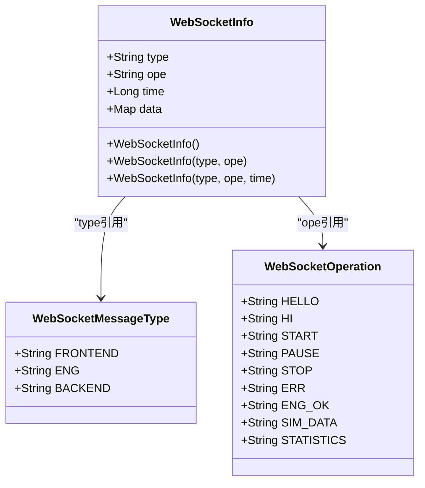
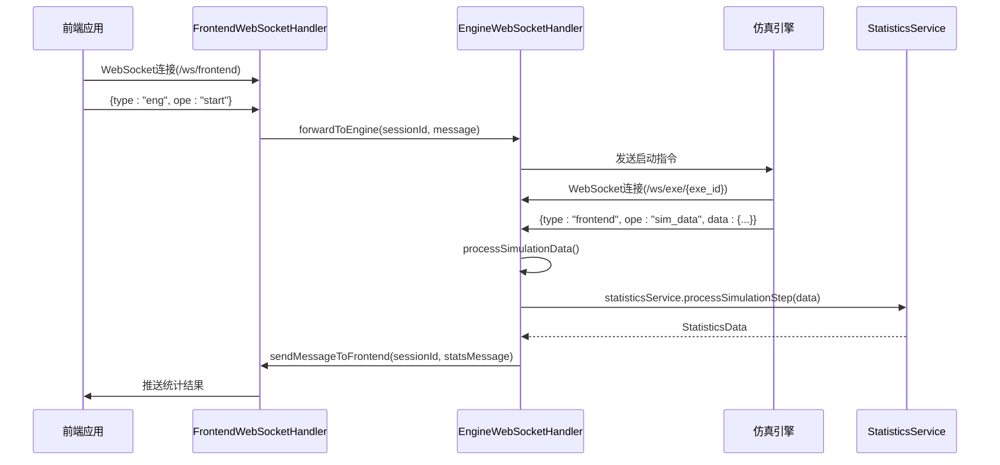
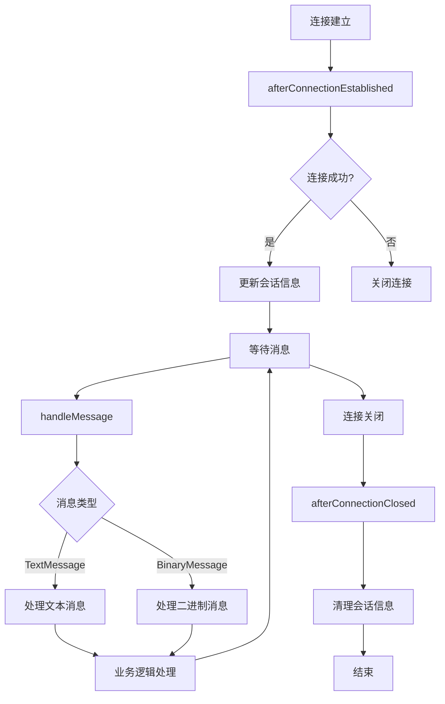
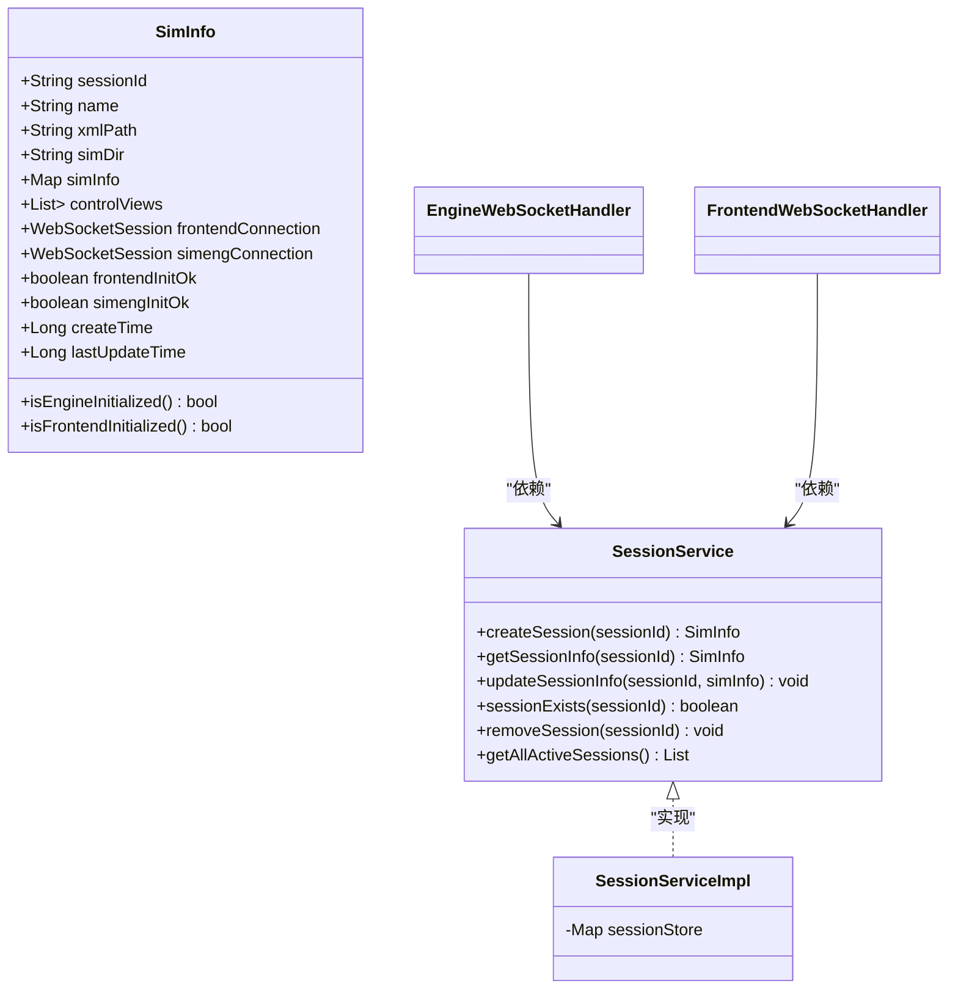
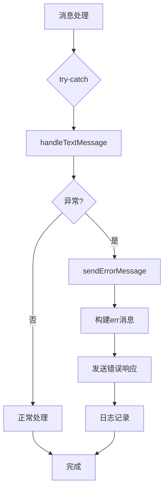
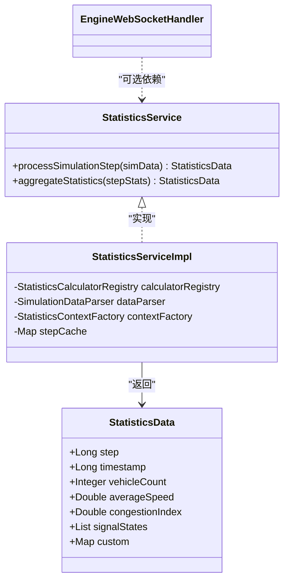

# WebSocket 集成

<cite>
**本文档引用的文件**
- [EngineWebSocketHandler.java](file://plugins/plugin-engine-manager/src/main/java/com/traffic/sim/plugin/engine/manager/websocket/EngineWebSocketHandler.java)
- [FrontendWebSocketHandler.java](file://plugins/plugin-engine-manager/src/main/java/com/traffic/sim/plugin/engine/manager/websocket/FrontendWebSocketHandler.java)
- [WebSocketInfo.java](file://traffic-sim-common/src/main/java/com/traffic/sim/common/model/WebSocketInfo.java)
- [WebSocketMessageType.java](file://traffic-sim-common/src/main/java/com/traffic/sim/common/constant/WebSocketMessageType.java)
- [WebSocketOperation.java](file://traffic-sim-common/src/main/java/com/traffic/sim/common/constant/WebSocketOperation.java)
- [WebSocketConfig.java](file://plugins/plugin-engine-manager/src/main/java/com/traffic/sim/plugin/engine/manager/config/WebSocketConfig.java)
- [SessionServiceImpl.java](file://plugins/plugin-engine-manager/src/main/java/com/traffic/sim/plugin/engine/manager/service/SessionServiceImpl.java)
- [SimInfo.java](file://traffic-sim-common/src/main/java/com/traffic/sim/common/model/SimInfo.java)
- [StatisticsServiceImpl.java](file://plugins/plugin-statistics/src/main/java/com/traffic/sim/plugin/statistics/service/StatisticsServiceImpl.java)
- [StatisticsService.java](file://traffic-sim-common/src/main/java/com/traffic/sim/common/service/StatisticsService.java)
- [StatisticsData.java](file://traffic-sim-common/src/main/java/com/traffic/sim/common/model/StatisticsData.java)
</cite>

## 目录
1. [引言](#引言)
2. [核心组件](#核心组件)
3. [WebSocket消息模型](#websocket消息模型)
4. [消息路由与处理流程](#消息路由与处理流程)
5. [连接生命周期管理](#连接生命周期管理)
6. [会话状态维护](#会话状态维护)
7. [消息广播机制](#消息广播机制)
8. [错误处理策略](#错误处理策略)
9. [统计服务集成](#统计服务集成)
10. [配置与部署](#配置与部署)

## 引言

本系统通过WebSocket技术实现了前端、后端与仿真引擎之间的实时双向通信。该架构以`EngineWebSocketHandler`和`FrontendWebSocketHandler`为核心，构建了一个高效的消息路由系统，确保仿真数据、控制指令和统计结果能够在不同组件间实时、可靠地传输。WebSocket连接不仅用于传输仿真过程中的实时数据，还承担了系统初始化、状态同步和错误报告等关键功能。

**Section sources**
- [EngineWebSocketHandler.java](file://plugins/plugin-engine-manager/src/main/java/com/traffic/sim/plugin/engine/manager/websocket/EngineWebSocketHandler.java#L1-L272)
- [FrontendWebSocketHandler.java](file://plugins/plugin-engine-manager/src/main/java/com/traffic/sim/plugin/engine/manager/websocket/FrontendWebSocketHandler.java#L1-L187)

## 核心组件

系统中的WebSocket功能由两个核心处理器类实现：`EngineWebSocketHandler`负责与仿真引擎通信，`FrontendWebSocketHandler`负责与前端应用通信。这两个处理器通过循环依赖的方式相互引用，实现了消息在前端和引擎之间的双向路由。

`EngineWebSocketHandler`监听`/ws/exe/{exe_id}`路径，其中`exe_id`作为会话标识符，用于关联特定的仿真任务。该处理器接收来自仿真引擎的数据，并根据消息类型决定是转发给后端服务还是通过`FrontendWebSocketHandler`推送给前端。

`FrontendWebSocketHandler`监听`/ws/frontend`路径，通过WebSocket握手时Cookie中的`id`字段来识别会话。它接收来自前端的控制指令（如启动、暂停仿真），并将其转发给对应的仿真引擎。

两个处理器都实现了Spring的`WebSocketHandler`接口，重写了连接建立、消息处理、连接关闭等关键方法，确保了WebSocket连接的完整生命周期管理。

**Section sources**
- [EngineWebSocketHandler.java](file://plugins/plugin-engine-manager/src/main/java/com/traffic/sim/plugin/engine/manager/websocket/EngineWebSocketHandler.java#L31-L272)
- [FrontendWebSocketHandler.java](file://plugins/plugin-engine-manager/src/main/java/com/traffic/sim/plugin/engine/manager/websocket/FrontendWebSocketHandler.java#L31-L187)

## WebSocket消息模型

系统使用`WebSocketInfo`类作为统一的消息模型，该模型包含四个核心字段：`type`（消息类型）、`ope`（操作类型）、`time`（时间戳）和`data`（数据负载）。



**Diagram sources**
- [WebSocketInfo.java](file://traffic-sim-common/src/main/java/com/traffic/sim/common/model/WebSocketInfo.java#L14-L45)
- [WebSocketMessageType.java](file://traffic-sim-common/src/main/java/com/traffic/sim/common/constant/WebSocketMessageType.java#L8-L22)
- [WebSocketOperation.java](file://traffic-sim-common/src/main/java/com/traffic/sim/common/constant/WebSocketOperation.java#L8-L40)

### 消息类型（type）

消息类型字段`type`定义了消息的接收方，其值来自`WebSocketMessageType`常量类：
- **frontend**: 消息应发送给前端应用
- **eng**: 消息应发送给仿真引擎
- **backend**: 消息应发送给后端服务

### 操作类型（ope）

操作类型字段`ope`定义了消息的具体操作，其值来自`WebSocketOperation`常量类，包括：
- **hello/hi**: 初始化握手请求和响应
- **start/pause/stop**: 仿真控制指令
- **sim_data**: 仿真引擎推送的原始仿真数据
- **statistics**: 经过统计服务处理后的仿真统计结果
- **err**: 错误消息

### 时间戳（time）

`time`字段记录了消息创建的时间戳，单位为毫秒，用于前端进行数据同步和时序分析。

### 数据负载（data）

`data`字段是一个`Map<String, Object>`类型的通用数据容器，用于携带消息的具体内容。不同操作类型的消息，其数据结构也不同。例如，`sim_data`消息的`data`字段包含详细的仿真状态，而`statistics`消息的`data`字段则包含聚合后的统计指标。

**Section sources**
- [WebSocketInfo.java](file://traffic-sim-common/src/main/java/com/traffic/sim/common/model/WebSocketInfo.java#L14-L45)
- [WebSocketMessageType.java](file://traffic-sim-common/src/main/java/com/traffic/sim/common/constant/WebSocketMessageType.java#L8-L22)
- [WebSocketOperation.java](file://traffic-sim-common/src/main/java/com/traffic/sim/common/constant/WebSocketOperation.java#L8-L40)

## 消息路由与处理流程

系统的消息路由机制基于`type`和`ope`字段进行决策，确保消息被正确地分发到目标组件。



**Diagram sources**
- [EngineWebSocketHandler.java](file://plugins/plugin-engine-manager/src/main/java/com/traffic/sim/plugin/engine/manager/websocket/EngineWebSocketHandler.java#L68-L272)
- [FrontendWebSocketHandler.java](file://plugins/plugin-engine-manager/src/main/java/com/traffic/sim/plugin/engine/manager/websocket/FrontendWebSocketHandler.java#L58-L187)
- [StatisticsServiceImpl.java](file://plugins/plugin-statistics/src/main/java/com/traffic/sim/plugin/statistics/service/StatisticsServiceImpl.java#L37-L195)

### 仿真数据处理流程

当仿真引擎推送`sim_data`消息时，`EngineWebSocketHandler`会触发`processSimulationData`方法。该方法首先调用`StatisticsService`对原始仿真数据进行实时计算，生成包含车辆总数、平均速度、拥堵指数等指标的`StatisticsData`对象。然后，它构建一个新的`WebSocketInfo`消息，将`type`设为`frontend`，`ope`设为`statistics`，并将`StatisticsData`序列化后放入`data`字段。最后，通过`FrontendWebSocketHandler`将处理后的统计结果推送给前端。

如果统计服务不可用或处理失败，系统会直接将原始的`sim_data`消息转发给前端，确保数据流不会中断。

**Section sources**
- [EngineWebSocketHandler.java](file://plugins/plugin-engine-manager/src/main/java/com/traffic/sim/plugin/engine/manager/websocket/EngineWebSocketHandler.java#L107-L158)
- [StatisticsServiceImpl.java](file://plugins/plugin-statistics/src/main/java/com/traffic/sim/plugin/statistics/service/StatisticsServiceImpl.java#L37-L195)

## 连接生命周期管理

系统通过实现`WebSocketHandler`接口的生命周期方法，对WebSocket连接进行完整的管理。



**Diagram sources**
- [EngineWebSocketHandler.java](file://plugins/plugin-engine-manager/src/main/java/com/traffic/sim/plugin/engine/manager/websocket/EngineWebSocketHandler.java#L53-L272)
- [FrontendWebSocketHandler.java](file://plugins/plugin-engine-manager/src/main/java/com/traffic/sim/plugin/engine/manager/websocket/FrontendWebSocketHandler.java#L43-L187)

### 连接建立

当WebSocket连接建立时，`afterConnectionEstablished`方法会被调用。`EngineWebSocketHandler`会从URI路径中提取`exe_id`，而`FrontendWebSocketHandler`会从Cookie中提取`id`作为会话ID。然后，处理器会查询`SessionService`获取对应的`SimInfo`对象，并将WebSocket会话引用（`WebSocketSession`）存储在`SimInfo`中，以便后续消息的路由。

### 连接关闭

当WebSocket连接关闭时，`afterConnectionClosed`方法会被调用。处理器会从会话信息中移除对应的WebSocket会话引用，并将相关的初始化标志（如`frontendInitOk`、`simengInitOk`）重置为`false`，确保系统状态的一致性。

**Section sources**
- [EngineWebSocketHandler.java](file://plugins/plugin-engine-manager/src/main/java/com/traffic/sim/plugin/engine/manager/websocket/EngineWebSocketHandler.java#L53-L65)
- [FrontendWebSocketHandler.java](file://plugins/plugin-engine-manager/src/main/java/com/traffic/sim/plugin/engine/manager/websocket/FrontendWebSocketHandler.java#L43-L54)
- [EngineWebSocketHandler.java](file://plugins/plugin-engine-manager/src/main/java/com/traffic/sim/plugin/engine/manager/websocket/EngineWebSocketHandler.java#L254-L264)
- [FrontendWebSocketHandler.java](file://plugins/plugin-engine-manager/src/main/java/com/traffic/sim/plugin/engine/manager/websocket/FrontendWebSocketHandler.java#L169-L178)

## 会话状态维护

系统的会话状态由`SimInfo`类和`SessionService`接口共同维护。`SimInfo`是一个数据模型，包含了会话ID、仿真配置、前端和引擎的WebSocket连接引用以及初始化状态标志。



**Diagram sources**
- [SimInfo.java](file://traffic-sim-common/src/main/java/com/traffic/sim/common/model/SimInfo.java#L16-L73)
- [SessionService.java](file://traffic-sim-common/src/main/java/com/traffic/sim/common/service/SessionService.java#L13-L61)
- [SessionServiceImpl.java](file://plugins/plugin-engine-manager/src/main/java/com/traffic/sim/plugin/engine/manager/service/SessionServiceImpl.java#L20-L67)

`SessionService`是一个接口，定义了会话管理的基本操作。`SessionServiceImpl`是其具体实现，使用`ConcurrentHashMap`在内存中存储所有活跃的会话信息。这种设计确保了会话数据的线程安全访问。

**Section sources**
- [SimInfo.java](file://traffic-sim-common/src/main/java/com/traffic/sim/common/model/SimInfo.java#L16-L73)
- [SessionService.java](file://traffic-sim-common/src/main/java/com/traffic/sim/common/service/SessionService.java#L13-L61)
- [SessionServiceImpl.java](file://plugins/plugin-engine-manager/src/main/java/com/traffic/sim/plugin/engine/manager/service/SessionServiceImpl.java#L20-L67)

## 消息广播机制

系统通过`SessionService`维护的会话注册表，实现了针对特定会话的消息广播。`FrontendWebSocketHandler`提供了`sendMessageToFrontend`方法，`EngineWebSocketHandler`提供了`forwardToEngine`和`sendMessageToEngine`方法。这些方法接收一个`sessionId`参数，通过`SessionService`查询对应的`SimInfo`，然后获取目标组件的WebSocket会话引用，最终将消息发送出去。

这种机制确保了消息的精确路由，避免了不必要的广播，提高了系统的效率和可扩展性。

**Section sources**
- [FrontendWebSocketHandler.java](file://plugins/plugin-engine-manager/src/main/java/com/traffic/sim/plugin/engine/manager/websocket/FrontendWebSocketHandler.java#L115-L128)
- [EngineWebSocketHandler.java](file://plugins/plugin-engine-manager/src/main/java/com/traffic/sim/plugin/engine/manager/websocket/EngineWebSocketHandler.java#L185-L198)

## 错误处理策略

系统在多个层面实现了错误处理机制，确保WebSocket通信的健壮性。



**Diagram sources**
- [EngineWebSocketHandler.java](file://plugins/plugin-engine-manager/src/main/java/com/traffic/sim/plugin/engine/manager/websocket/EngineWebSocketHandler.java#L74-L102)
- [FrontendWebSocketHandler.java](file://plugins/plugin-engine-manager/src/main/java/com/traffic/sim/plugin/engine/manager/websocket/FrontendWebSocketHandler.java#L64-L88)

在`handleTextMessage`方法中，系统使用了`try-catch`块来捕获JSON反序列化、业务逻辑处理等过程中可能发生的异常。一旦捕获到异常，处理器会调用`sendErrorMessage`方法，构建一个`type`为`frontend`或`backend`、`ope`为`err`的错误消息，并将其发送回客户端。同时，详细的错误信息会被记录到日志中，便于后续的故障排查。

**Section sources**
- [EngineWebSocketHandler.java](file://plugins/plugin-engine-manager/src/main/java/com/traffic/sim/plugin/engine/manager/websocket/EngineWebSocketHandler.java#L74-L102)
- [FrontendWebSocketHandler.java](file://plugins/plugin-engine-manager/src/main/java/com/traffic/sim/plugin/engine/manager/websocket/FrontendWebSocketHandler.java#L64-L88)

## 统计服务集成

`StatisticsService`是系统中的一个可选依赖，由`plugin-statistics`模块提供。`EngineWebSocketHandler`通过`setStatisticsService`方法注入该服务，实现了与统计模块的松耦合。

当`processSimulationData`方法被调用时，它会检查`statisticsService`是否为`null`。如果可用，则调用`processSimulationStep`方法对仿真数据进行实时计算；如果不可用，则跳过统计处理，直接转发原始数据。这种设计使得系统核心功能不依赖于统计模块，提高了系统的灵活性和容错能力。



**Diagram sources**
- [StatisticsService.java](file://traffic-sim-common/src/main/java/com/traffic/sim/common/service/StatisticsService.java#L14-L32)
- [StatisticsServiceImpl.java](file://plugins/plugin-statistics/src/main/java/com/traffic/sim/plugin/statistics/service/StatisticsServiceImpl.java#L27-L195)
- [StatisticsData.java](file://traffic-sim-common/src/main/java/com/traffic/sim/common/model/StatisticsData.java#L15-L44)

**Section sources**
- [EngineWebSocketHandler.java](file://plugins/plugin-engine-manager/src/main/java/com/traffic/sim/plugin/engine/manager/websocket/EngineWebSocketHandler.java#L35-L50)
- [StatisticsServiceImpl.java](file://plugins/plugin-statistics/src/main/java/com/traffic/sim/plugin/statistics/service/StatisticsServiceImpl.java#L27-L195)

## 配置与部署

WebSocket服务的配置由`WebSocketConfig`类完成。该类实现了`WebSocketConfigurer`接口，通过`registerWebSocketHandlers`方法注册了`FrontendWebSocketHandler`和`EngineWebSocketHandler`两个处理器，并配置了它们的访问路径和允许的跨域源。

```mermaid
graph TD
A[WebSocketConfig] --> B[registerWebSocketHandlers]
B --> C[addHandler FrontendWebSocketHandler]
C --> D[路径: /ws/frontend]
C --> E[跨域: 允许的源]
C --> F[SockJS: 可选]
B --> G[addHandler EngineWebSocketHandler]
G --> H[路径: /ws/exe/{exe_id}]
G --> I[跨域: 允许的源]
```

**Diagram sources**
- [WebSocketConfig.java](file://plugins/plugin-engine-manager/src/main/java/com/traffic/sim/plugin/engine/manager/config/WebSocketConfig.java#L19-L42)

**Section sources**
- [WebSocketConfig.java](file://plugins/plugin-engine-manager/src/main/java/com/traffic/sim/plugin/engine/manager/config/WebSocketConfig.java#L19-L42)

配置中的路径和跨域设置可以通过`EngineManagerProperties`从外部配置文件中读取，实现了配置的外部化和灵活性。