# gRPC 集成

<cite>
**本文档引用的文件**
- [SimulationPythonGrpcClient.java](file://plugins/plugin-simulation/src/main/java/com/traffic/sim/plugin/simulation/grpc/SimulationPythonGrpcClient.java)
- [python_service.proto](file://plugins/plugin-simulation/src/main/proto/python_service.proto)
- [SimulationController.java](file://plugins/plugin-simulation/src/main/java/com/traffic/sim/plugin/simulation/controller/SimulationController.java)
- [SimulationServiceImpl.java](file://plugins/plugin-simulation/src/main/java/com/traffic/sim/plugin/simulation/service/SimulationServiceImpl.java)
- [SimInfo.java](file://traffic-sim-common/src/main/java/com/traffic/sim/common/model/SimInfo.java)
- [CreateSimulationRequest.java](file://traffic-sim-common/src/main/java/com/traffic/sim/common/dto/CreateSimulationRequest.java)
- [GreenRatioControlRequest.java](file://traffic-sim-common/src/main/java/com/traffic/sim/common/dto/GreenRatioControlRequest.java)
- [ApiResponse.java](file://traffic-sim-common/src/main/java/com/traffic/sim/common/response/ApiResponse.java)
- [GrpcClientConfig.java](file://plugins/plugin-simulation/src/main/java/com/traffic/sim/plugin/simulation/config/GrpcClientConfig.java)
- [application.yml](file://traffic-sim-server/src/main/resources/application.yml)
</cite>

## 目录
1. [引言](#引言)
2. [系统架构概述](#系统架构概述)
3. [核心组件分析](#核心组件分析)
4. [gRPC 服务接口定义](#grpc-服务接口定义)
5. [数据序列化与消息映射](#数据序列化与消息映射)
6. [通道管理与异常处理](#通道管理与异常处理)
7. [调用模式与超时配置](#调用模式与超时配置)
8. [容错机制与兜底策略](#容错机制与兜底策略)
9. [集成工作流程](#集成工作流程)
10. [配置与部署](#配置与部署)

## 引言
本文档详细描述了交通仿真系统中gRPC集成的实现机制，重点阐述Java主服务如何通过gRPC与Python编写的仿真引擎进行通信。文档以`SimulationPythonGrpcClient`为核心，深入分析其作为gRPC客户端的实现细节，包括通道管理、存根调用和异常处理机制。同时，文档详细说明了`python_service.proto`文件中定义的服务接口和消息类型在仿真任务初始化和实时控制中的作用，以及数据序列化过程、同步/异步调用模式、超时配置和与公共模型的映射关系。

## 系统架构概述
本系统采用微服务架构，Java主服务作为核心业务处理层，负责用户请求处理、任务管理和数据持久化。Python仿真引擎作为独立的服务进程，负责执行复杂的交通仿真计算。两者通过gRPC协议进行高效通信，实现了业务逻辑与计算密集型任务的分离。

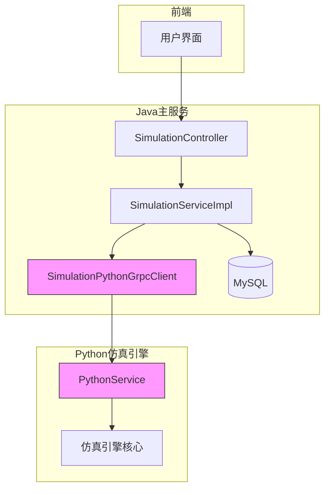

**图示来源**
- [SimulationController.java](file://plugins/plugin-simulation/src/main/java/com/traffic/sim/plugin/simulation/controller/SimulationController.java)
- [SimulationServiceImpl.java](file://plugins/plugin-simulation/src/main/java/com/traffic/sim/plugin/simulation/service/SimulationServiceImpl.java)
- [SimulationPythonGrpcClient.java](file://plugins/plugin-simulation/src/main/java/com/traffic/sim/plugin/simulation/grpc/SimulationPythonGrpcClient.java)

## 核心组件分析
本节深入分析gRPC集成中的核心组件，包括控制器、服务实现和gRPC客户端的协同工作机制。

### SimulationController 分析
`SimulationController`是系统的API入口，负责接收HTTP请求并将其转发给业务服务层。该控制器通过Spring框架的依赖注入机制获取`SimulationService`实例，实现了请求处理与业务逻辑的解耦。

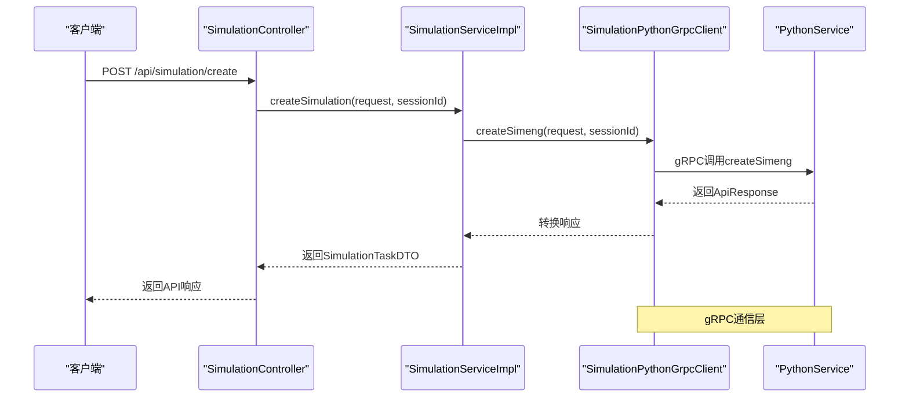

**图示来源**
- [SimulationController.java](file://plugins/plugin-simulation/src/main/java/com/traffic/sim/plugin/simulation/controller/SimulationController.java#L37-L60)
- [SimulationServiceImpl.java](file://plugins/plugin-simulation/src/main/java/com/traffic/sim/plugin/simulation/service/SimulationServiceImpl.java#L44-L90)

**本节来源**
- [SimulationController.java](file://plugins/plugin-simulation/src/main/java/com/traffic/sim/plugin/simulation/controller/SimulationController.java)

### SimulationServiceImpl 分析
`SimulationServiceImpl`是业务逻辑的核心实现类，负责协调gRPC客户端与数据持久化操作。该服务实现了`SimulationService`接口，通过依赖注入获取`SimulationPythonGrpcClient`和`SimulationTaskRepository`实例。

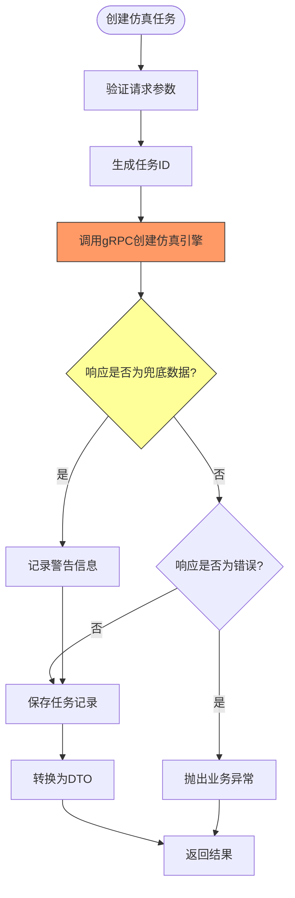

**图示来源**
- [SimulationServiceImpl.java](file://plugins/plugin-simulation/src/main/java/com/traffic/sim/plugin/simulation/service/SimulationServiceImpl.java#L44-L90)
- [SimulationPythonGrpcClient.java](file://plugins/plugin-simulation/src/main/java/com/traffic/sim/plugin/simulation/grpc/SimulationPythonGrpcClient.java#L102-L124)

**本节来源**
- [SimulationServiceImpl.java](file://plugins/plugin-simulation/src/main/java/com/traffic/sim/plugin/simulation/service/SimulationServiceImpl.java)

## gRPC 服务接口定义
本节详细分析`python_service.proto`文件中定义的服务接口和消息类型，这些定义是Java与Python服务之间通信的基础。

### PythonService 接口
`PythonService`是gRPC服务的核心接口，定义了仿真引擎的主要功能。该接口包含三个RPC方法：`CreateSimeng`用于初始化仿真引擎，`ControlGreenRatio`用于实时控制信号灯绿信比，`TestConnection`用于测试连接状态。

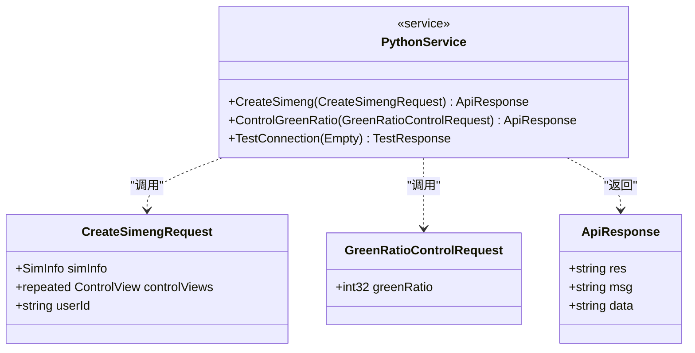

**图示来源**
- [python_service.proto](file://plugins/plugin-simulation/src/main/proto/python_service.proto#L10-L19)

### 消息类型定义
proto文件定义了多个消息类型，用于结构化传输数据。`SimInfo`消息包含仿真基本信息，`FixedOD`消息包含交通流和信号灯配置，`ApiResponse`消息定义了统一的响应格式。

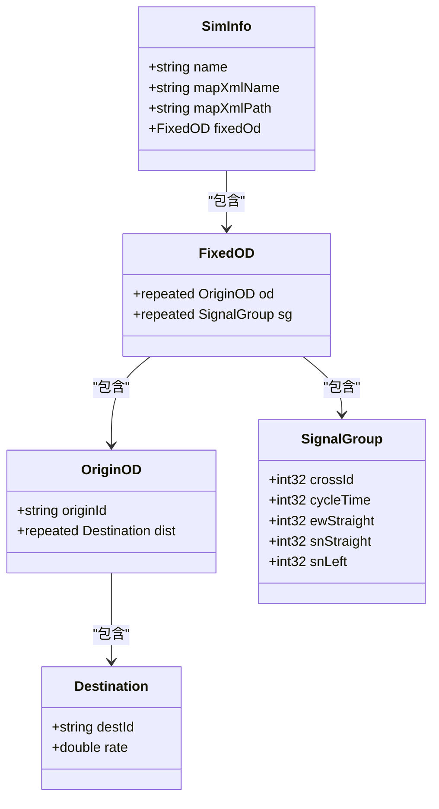

**图示来源**
- [python_service.proto](file://plugins/plugin-simulation/src/main/proto/python_service.proto#L22-L56)

## 数据序列化与消息映射
本节分析Java对象与gRPC消息之间的序列化和映射机制，这是跨语言通信的关键环节。

### CreateSimulationRequest 映射
`CreateSimulationRequest`是Java端的DTO对象，需要转换为gRPC的`CreateSimengRequest`消息。转换过程涉及嵌套对象的逐层映射，确保数据结构的完整传递。

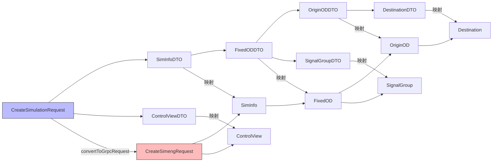

**图示来源**
- [CreateSimulationRequest.java](file://traffic-sim-common/src/main/java/com/traffic/sim/common/dto/CreateSimulationRequest.java)
- [SimulationPythonGrpcClient.java](file://plugins/plugin-simulation/src/main/java/com/traffic/sim/plugin/simulation/grpc/SimulationPythonGrpcClient.java#L177-L249)

### 响应转换机制
gRPC调用返回的`ApiResponse`消息需要转换为Java端的`ApiResponse`对象。由于两个类具有相同的字段结构，转换过程相对简单，主要是字段值的复制。

```mermaid
classDiagram
class GrpcApiResponse {
+string res
+string msg
+string data
}
class JavaApiResponse {
+string res
+string msg
+T data
+Long timestamp
}
GrpcApiResponse --> JavaApiResponse : "convertFromGrpcResponse"
note right of GrpcApiResponse
gRPC消息定义
在proto文件中声明
end
note left of JavaApiResponse
Java DTO类
在common模块中定义
end
```

**图示来源**
- [python_service.proto](file://plugins/plugin-simulation/src/main/proto/python_service.proto#L64-L68)
- [ApiResponse.java](file://traffic-sim-common/src/main/java/com/traffic/sim/common/response/ApiResponse.java)
- [SimulationPythonGrpcClient.java](file://plugins/plugin-simulation/src/main/java/com/traffic/sim/plugin/simulation/grpc/SimulationPythonGrpcClient.java#L255-L260)

## 通道管理与异常处理
本节分析gRPC客户端的通道管理策略和异常处理机制，确保通信的稳定性和可靠性。

### 通道初始化与延迟加载
`SimulationPythonGrpcClient`使用`@Lazy`注解实现通道的延迟初始化，避免应用启动时因gRPC服务不可用而导致启动失败。这种设计提高了系统的容错能力。

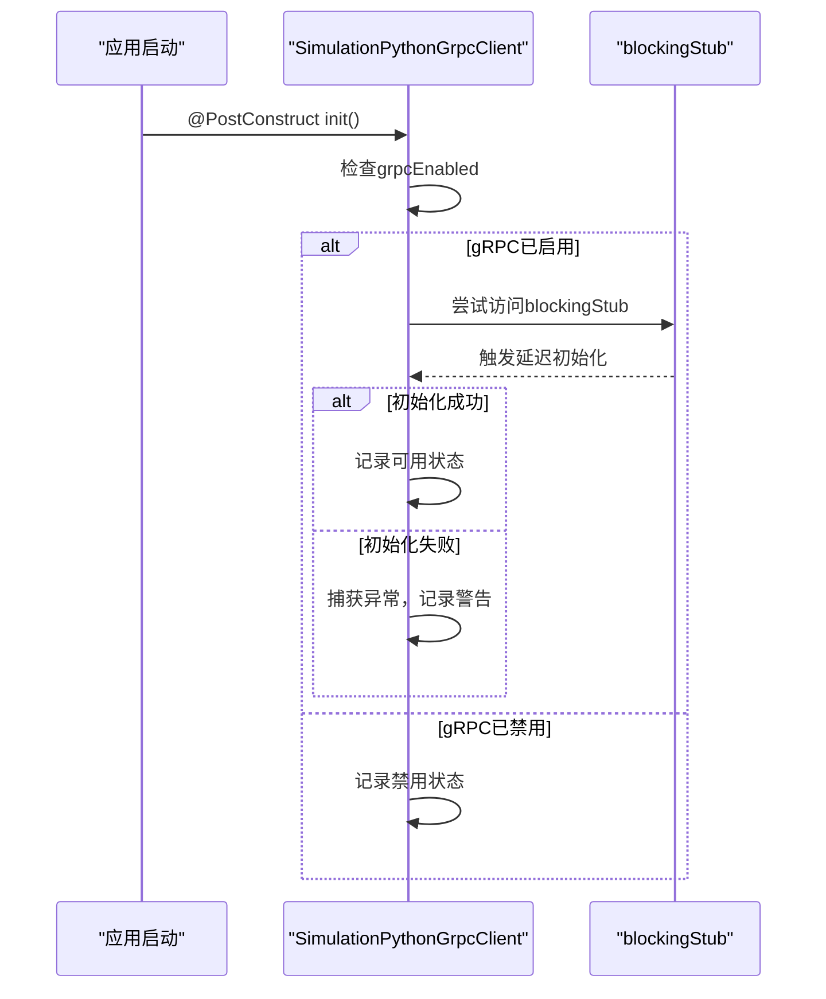

**图示来源**
- [SimulationPythonGrpcClient.java](file://plugins/plugin-simulation/src/main/java/com/traffic/sim/plugin/simulation/grpc/SimulationPythonGrpcClient.java#L54-L73)
- [GrpcClientConfig.java](file://plugins/plugin-simulation/src/main/java/com/traffic/sim/plugin/simulation/config/GrpcClientConfig.java)

### 异常处理策略
gRPC客户端实现了分层的异常处理策略，区分`StatusRuntimeException`和其他异常，提供针对性的错误处理和日志记录。

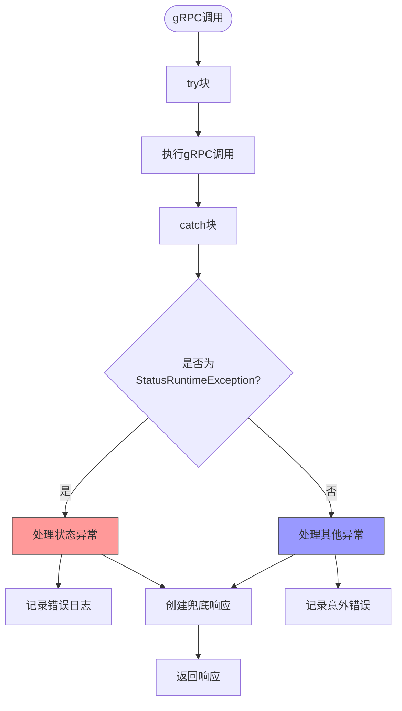

**图示来源**
- [SimulationPythonGrpcClient.java](file://plugins/plugin-simulation/src/main/java/com/traffic/sim/plugin/simulation/grpc/SimulationPythonGrpcClient.java#L111-L123)

## 调用模式与超时配置
本节分析gRPC调用的模式选择和超时配置，优化通信性能和用户体验。

### 同步调用模式
系统采用同步阻塞调用模式（BlockingStub），适用于需要立即获取结果的场景。这种模式简化了调用逻辑，但需要注意调用超时的配置。

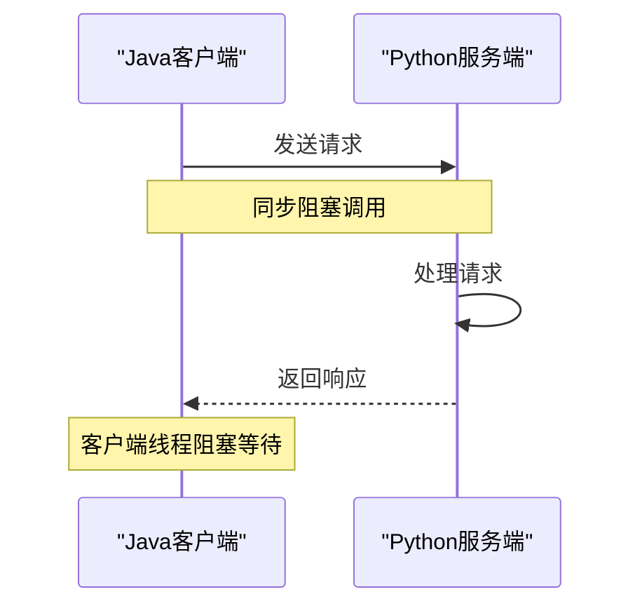

**本节来源**
- [SimulationPythonGrpcClient.java](file://plugins/plugin-simulation/src/main/java/com/traffic/sim/plugin/simulation/grpc/SimulationPythonGrpcClient.java#L47)

### 超时配置
gRPC客户端配置了连接保持（keep-alive）参数，确保长连接的稳定性，防止因网络空闲导致的连接中断。

```mermaid
classDiagram
class GrpcConfig {
+enableKeepAlive : true
+keepAliveWithoutCalls : true
+keepAliveTime : 30s
+keepAliveTimeout : 5s
+negotiationType : plaintext
}
note right of GrpcConfig
配置文件中定义的gRPC参数
位于application.yml
end
```

**图示来源**
- [application.yml](file://traffic-sim-server/src/main/resources/application.yml#L69-L78)

## 容错机制与兜底策略
本节分析系统的容错设计，确保在gRPC服务不可用时仍能提供基本功能。

### 兜底响应机制
当gRPC服务不可用时，系统不会直接失败，而是返回兜底响应，保证应用的可用性。这种设计体现了优雅降级的原则。

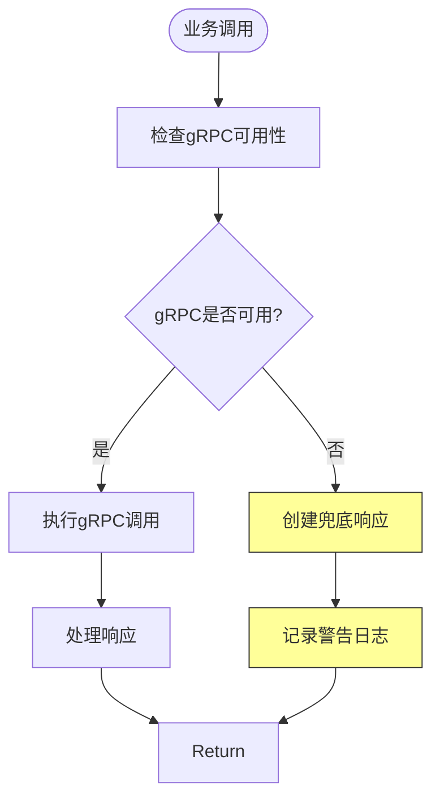

**图示来源**
- [SimulationPythonGrpcClient.java](file://plugins/plugin-simulation/src/main/java/com/traffic/sim/plugin/simulation/grpc/SimulationPythonGrpcClient.java#L104-L109)
- [SimulationPythonGrpcClient.java](file://plugins/plugin-simulation/src/main/java/com/traffic/sim/plugin/simulation/grpc/SimulationPythonGrpcClient.java#L166-L172)

### 配置驱动的容错
系统通过配置项`grpc.client.python-service.enabled`控制gRPC客户端的启用状态，提供了灵活的部署选项。

```mermaid
classDiagram
class GrpcConfigProperties {
+grpcEnabled : boolean = true
+address : string = 'static : //localhost : 50051'
+negotiationType : string = plaintext
}
note right of GrpcConfigProperties
可通过application.yml覆盖默认值
支持环境变量配置
end
```

**图示来源**
- [GrpcClientConfig.java](file://plugins/plugin-simulation/src/main/java/com/traffic/sim/plugin/simulation/config/GrpcClientConfig.java#L19-L20)
- [SimulationPythonGrpcClient.java](file://plugins/plugin-simulation/src/main/java/com/traffic/sim/plugin/simulation/grpc/SimulationPythonGrpcClient.java#L40-L41)

## 集成工作流程
本节描述从用户请求到仿真引擎创建的完整工作流程，展示各组件的协同工作。

### 仿真创建流程
当用户发起创建仿真请求时，系统按照预定义的流程处理请求，确保数据的正确传递和持久化。

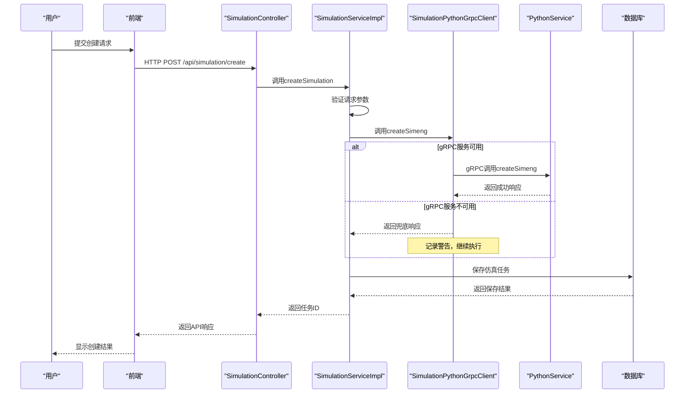

**图示来源**
- [SimulationController.java](file://plugins/plugin-simulation/src/main/java/com/traffic/sim/plugin/simulation/controller/SimulationController.java#L37-L60)
- [SimulationServiceImpl.java](file://plugins/plugin-simulation/src/main/java/com/traffic/sim/plugin/simulation/service/SimulationServiceImpl.java#L44-L90)
- [SimulationPythonGrpcClient.java](file://plugins/plugin-simulation/src/main/java/com/traffic/sim/plugin/simulation/grpc/SimulationPythonGrpcClient.java#L102-L124)

### 绿信比控制流程
实时控制信号灯绿信比的流程相对简单，主要涉及参数验证和gRPC调用。

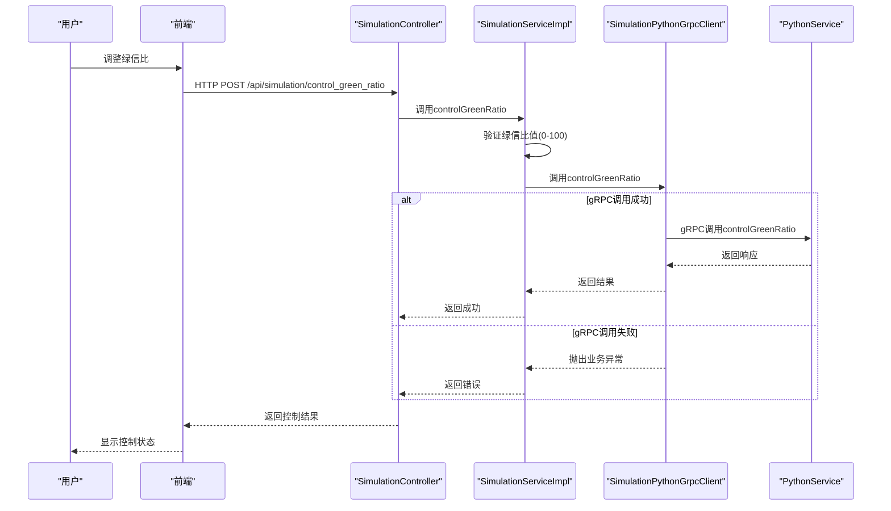

**图示来源**
- [SimulationController.java](file://plugins/plugin-simulation/src/main/java/com/traffic/sim/plugin/simulation/controller/SimulationController.java#L102-L131)
- [SimulationServiceImpl.java](file://plugins/plugin-simulation/src/main/java/com/traffic/sim/plugin/simulation/service/SimulationServiceImpl.java#L119-L144)
- [SimulationPythonGrpcClient.java](file://plugins/plugin-simulation/src/main/java/com/traffic/sim/plugin/simulation/grpc/SimulationPythonGrpcClient.java#L132-L157)

## 配置与部署
本节说明gRPC集成的相关配置和部署注意事项。

### Maven 依赖配置
系统通过Maven管理gRPC相关依赖，确保版本兼容性和构建一致性。

```mermaid
classDiagram
class Dependencies {
+grpc-spring-boot-starter
+protobuf-java
+javax.annotation-api
+protobuf-maven-plugin
}
note right of Dependencies
依赖关系由pom.xml定义
版本由父POM统一管理
end
```

**本节来源**
- [pom.xml](file://plugins/plugin-simulation/pom.xml)

### 应用配置
gRPC客户端的关键配置位于`application.yml`文件中，支持通过环境变量进行覆盖。

```mermaid
erDiagram
GRPC_CONFIG {
string address PK
string negotiationType
boolean enableKeepAlive
boolean keepAliveWithoutCalls
string keepAliveTime
string keepAliveTimeout
boolean enabled
}
note right of GRPC_CONFIG
配置项前缀: grpc.client.python-service
可通过环境变量覆盖
end
```

**本节来源**
- [application.yml](file://traffic-sim-server/src/main/resources/application.yml#L69-L81)