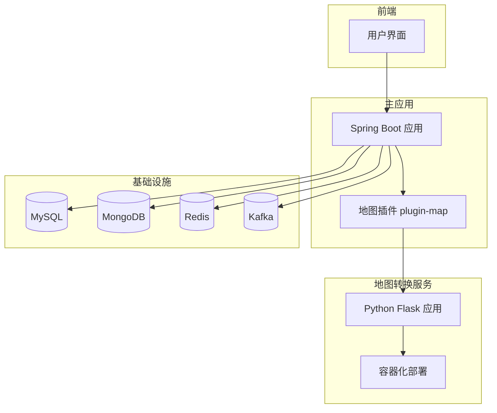
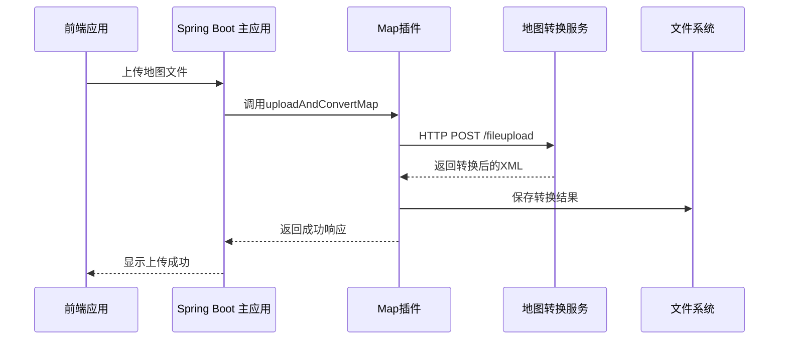
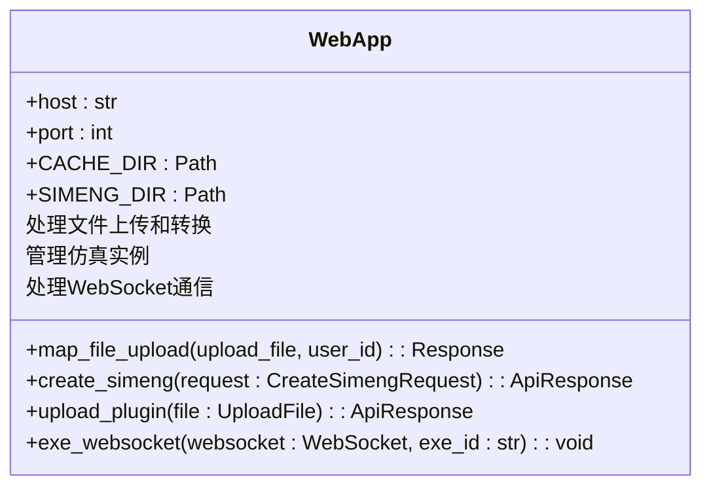
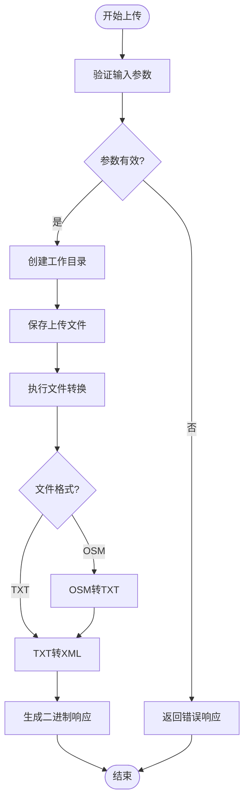
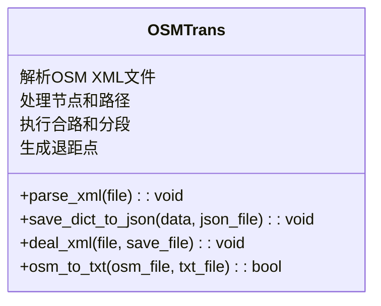
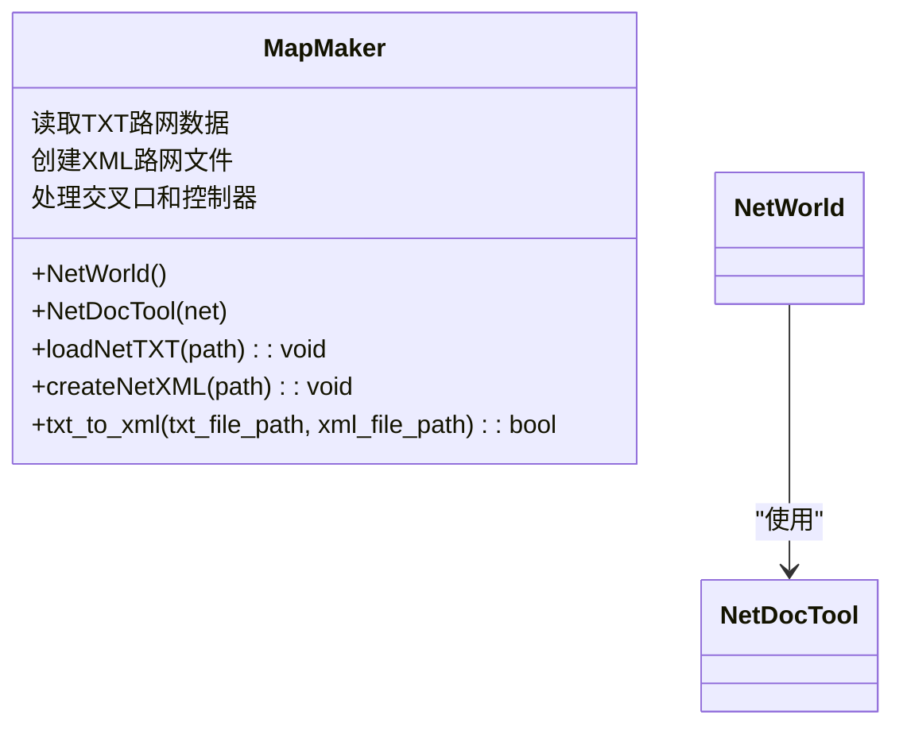
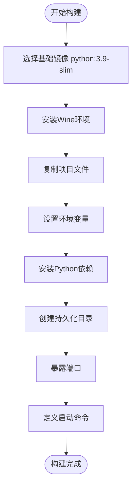
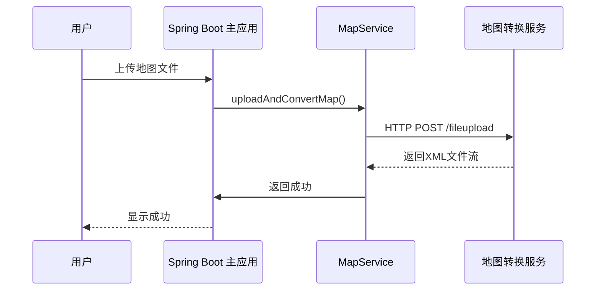
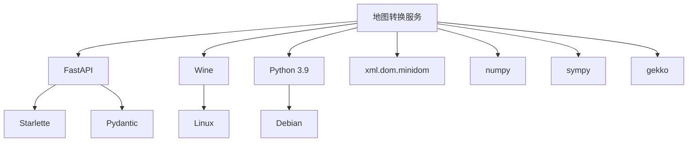

# 地图转换服务集成

<cite>
**本文档引用的文件**   
- [web_app.py](file://map_convert_services/web_app.py)
- [Dockerfile](file://map_convert_services/Dockerfile)
- [docker-compose.yml](file://infrastructure/docker-compose.yml)
- [mapmaker.py](file://map_convert_services/map_utils/mapmaker.py)
- [MapServiceImpl.java](file://plugins/plugin-map/src/main/java/com/traffic/sim/plugin/map/service/MapServiceImpl.java)
- [MapController.java](file://plugins/plugin-map/src/main/java/com/traffic/sim/plugin/map/controller/MapController.java)
- [command_runner.py](file://map_convert_services/utils/command_runner.py)
- [file_response.py](file://map_convert_services/utils/file_response.py)
- [config.py](file://map_convert_services/config.py)
- [osmtrans.py](file://map_convert_services/map_utils/osmtrans.py)
</cite>

## 目录
1. [简介](#简介)
2. [项目结构](#项目结构)
3. [核心组件](#核心组件)
4. [架构概述](#架构概述)
5. [详细组件分析](#详细组件分析)
6. [依赖分析](#依赖分析)
7. [性能考虑](#性能考虑)
8. [故障排除指南](#故障排除指南)
9. [结论](#结论)

## 简介
本文档详细说明了交通仿真系统中地图转换服务`map_convert_services`的集成机制。该服务是一个独立的Python应用，通过Flask框架提供HTTP API，与主Spring Boot应用协同工作，实现从OSM数据到仿真专用格式的转换流程。文档重点分析了服务间的通信协议、数据格式约定、容器化配置以及调用链路，确保地图上传功能的端到端实现。

## 项目结构
项目采用微服务架构，包含前端、基础设施、地图转换服务和多个插件模块。地图转换服务位于`map_convert_services`目录下，是独立的Python应用，通过Docker容器化部署。主Spring Boot应用通过`plugin-map`插件与地图转换服务交互。

**图源**
- [docker-compose.yml](file://infrastructure/docker-compose.yml#L3-L253)

**本节源**
- [docker-compose.yml](file://infrastructure/docker-compose.yml#L3-L253)

## 核心组件
地图转换服务的核心是`web_app.py`中的Flask应用，它提供了HTTP API用于文件上传和转换。`mapmaker.py`和`osmtrans.py`是关键的工具脚本，负责将OSM数据转换为仿真引擎所需的XML格式。`Dockerfile`定义了服务的容器化配置，确保环境一致性。

**本节源**
- [web_app.py](file://map_convert_services/web_app.py#L1-L269)
- [mapmaker.py](file://map_convert_services/map_utils/mapmaker.py#L1-L610)
- [osmtrans.py](file://map_convert_services/map_utils/osmtrans.py#L1-L800)
- [Dockerfile](file://map_convert_services/Dockerfile#L1-L66)

## 架构概述
系统采用分层架构，主Spring Boot应用作为控制中心，通过插件机制调用独立的地图转换服务。地图转换服务暴露RESTful API，接收主应用的HTTP请求，执行转换任务，并将结果通过文件系统或网络返回。整个流程通过`docker-compose.yml`进行服务编排。

**图源**
- [web_app.py](file://map_convert_services/web_app.py#L52-L80)
- [MapServiceImpl.java](file://plugins/plugin-map/src/main/java/com/traffic/sim/plugin/map/service/MapServiceImpl.java#L80-L120)

## 详细组件分析

### Flask应用分析
`web_app.py`是地图转换服务的核心，基于FastAPI框架构建。它提供了多个HTTP端点，处理文件上传、转换触发和插件管理等任务。

#### HTTP API端点

**图源**
- [web_app.py](file://map_convert_services/web_app.py#L1-L269)

#### 文件上传与转换流程

**图源**
- [web_app.py](file://map_convert_services/web_app.py#L52-L80)
- [file_response.py](file://map_convert_services/utils/file_response.py#L8-L55)

**本节源**
- [web_app.py](file://map_convert_services/web_app.py#L1-L269)
- [file_response.py](file://map_convert_services/utils/file_response.py#L1-L107)

### 转换工具脚本分析
`mapmaker.py`和`osmtrans.py`是实现数据格式转换的核心工具脚本。`osmtrans.py`负责将OSM数据解析并转换为中间的TXT格式，而`mapmaker.py`则将TXT格式转换为仿真引擎所需的XML格式。

#### OSM到TXT转换

**图源**
- [osmtrans.py](file://map_convert_services/map_utils/osmtrans.py#L1-L800)

#### TXT到XML转换

**图源**
- [mapmaker.py](file://map_convert_services/map_utils/mapmaker.py#L1-L610)

**本节源**
- [mapmaker.py](file://map_convert_services/map_utils/mapmaker.py#L1-L610)
- [osmtrans.py](file://map_convert_services/map_utils/osmtrans.py#L1-L800)

### 容器化配置分析
`Dockerfile`定义了地图转换服务的容器化配置，确保服务在不同环境中的一致性。它基于`python:3.9-slim`镜像，安装了必要的依赖，包括Wine以支持Windows可执行文件的运行。

#### Docker构建流程

**图源**
- [Dockerfile](file://map_convert_services/Dockerfile#L1-L66)

#### 环境变量配置
| 环境变量 | 默认值 | 说明 |
| :--- | :--- | :--- |
| `APP_HOST` | 0.0.0.0 | 服务监听地址 |
| `APP_PORT` | 8000 | 服务监听端口 |
| `CLIENT_SOCKET_IP` | 192.168.1.212 | 客户端Socket IP |
| `LOG_HOME` | /app/engine_sim_logs/ | 日志文件目录 |

**本节源**
- [Dockerfile](file://map_convert_services/Dockerfile#L1-L66)
- [config.py](file://map_convert_services/config.py#L1-L18)

### 主应用集成分析
主Spring Boot应用通过`plugin-map`插件与地图转换服务集成。`MapServiceImpl.java`中的`uploadAndConvertMap`方法是关键的集成点，它调用Python服务的API来执行文件转换。

#### 服务调用链路

**图源**
- [MapServiceImpl.java](file://plugins/plugin-map/src/main/java/com/traffic/sim/plugin/map/service/MapServiceImpl.java#L80-L120)
- [web_app.py](file://map_convert_services/web_app.py#L52-L80)

#### 配额管理
主应用实现了用户地图配额管理，确保系统资源的合理分配。

| 配额类型 | 配置项 | 说明 |
| :--- | :--- | :--- |
| 最大地图数 | maxMaps | 用户可创建的地图总数 |
| 总大小限制 | maxSize | 用户地图存储总大小 |
| 单文件大小 | maxFileSize | 单个地图文件最大大小 |
| 允许扩展名 | allowedExtensions | 支持的文件格式 |

**本节源**
- [MapServiceImpl.java](file://plugins/plugin-map/src/main/java/com/traffic/sim/plugin/map/service/MapServiceImpl.java#L80-L120)
- [MapController.java](file://plugins/plugin-map/src/main/java/com/traffic/sim/plugin/map/controller/MapController.java#L1-L155)

## 依赖分析
地图转换服务依赖于多个外部库和工具，包括FastAPI、Wine和各种Python数据处理库。这些依赖通过`requirements.txt`和`Dockerfile`进行管理。

**图源**
- [Dockerfile](file://map_convert_services/Dockerfile#L1-L66)
- [web_app.py](file://map_convert_services/web_app.py#L1-L269)

**本节源**
- [Dockerfile](file://map_convert_services/Dockerfile#L1-L66)
- [web_app.py](file://map_convert_services/web_app.py#L1-L269)

## 性能考虑
地图转换服务的性能主要受文件大小、转换算法复杂度和系统资源的影响。服务通过异步处理和文件流传输来优化性能，避免内存溢出。

- **文件大小**: 服务对上传文件大小有限制，防止过大的文件导致内存问题。
- **转换算法**: `osmtrans.py`中的合路和分段算法时间复杂度较高，对大型OSM文件可能需要较长时间。
- **资源管理**: 服务使用Wine运行Windows可执行文件，这会增加CPU和内存开销。
- **并发处理**: FastAPI的异步特性允许服务同时处理多个转换请求。

## 故障排除指南
当地图转换服务出现问题时，可以按照以下步骤进行排查：

1. **检查服务状态**: 确认Docker容器是否正常运行。
2. **查看日志文件**: 检查`engine_sim_logs`目录下的日志文件，查找错误信息。
3. **验证文件格式**: 确保上传的OSM或TXT文件格式正确。
4. **检查网络连接**: 确认主应用与地图转换服务之间的网络连接正常。
5. **资源监控**: 检查系统CPU、内存和磁盘使用情况，确保资源充足。

**本节源**
- [command_runner.py](file://map_convert_services/utils/command_runner.py#L1-L199)
- [web_app.py](file://map_convert_services/web_app.py#L1-L269)

## 结论
地图转换服务`map_convert_services`通过清晰的API接口和容器化部署，实现了与主Spring Boot应用的高效集成。服务将OSM数据转换为仿真专用格式的流程稳定可靠，通过`docker-compose.yml`进行服务编排，确保了系统的可维护性和可扩展性。未来可以考虑优化转换算法的性能，并增加更多的错误处理和监控机制。