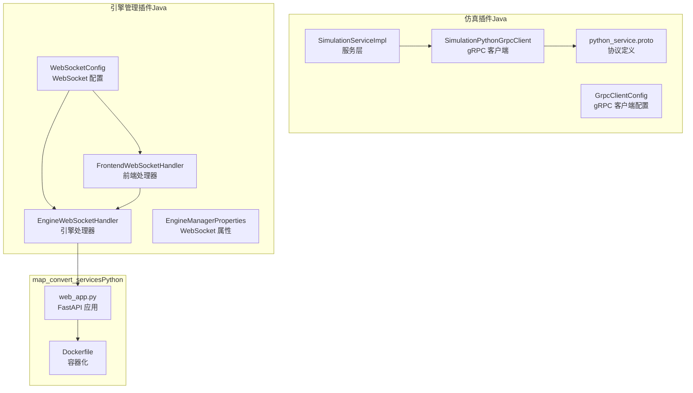
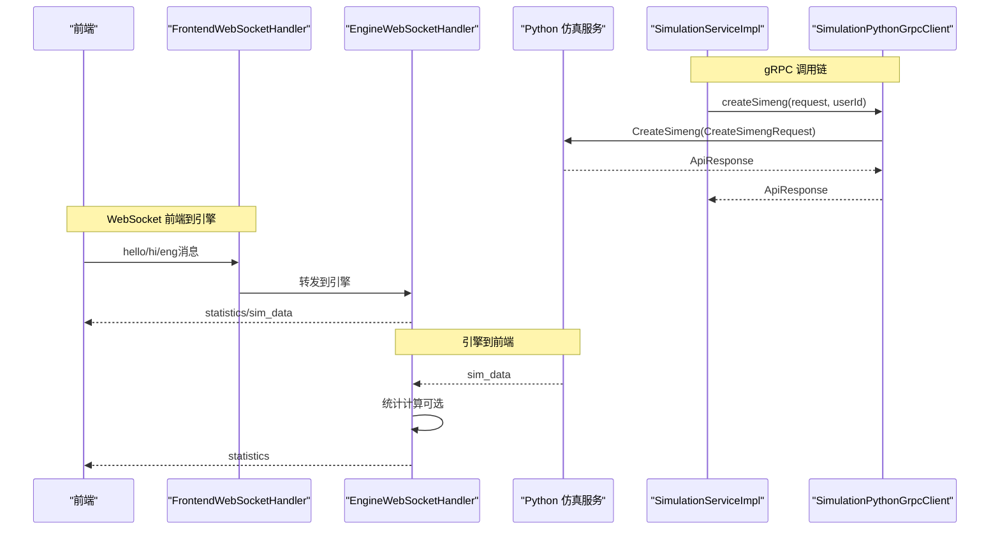
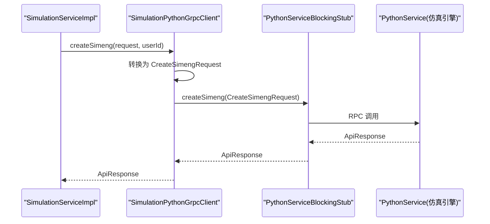
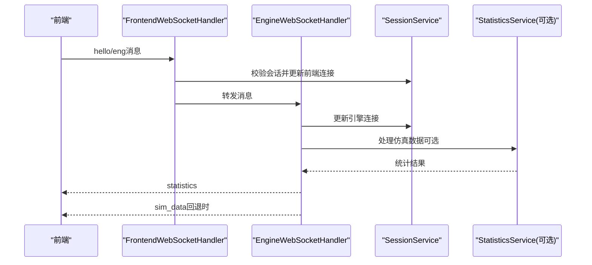
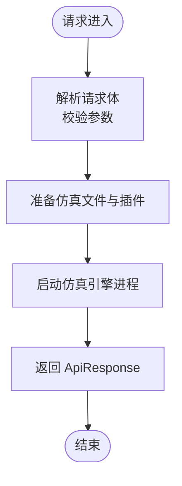
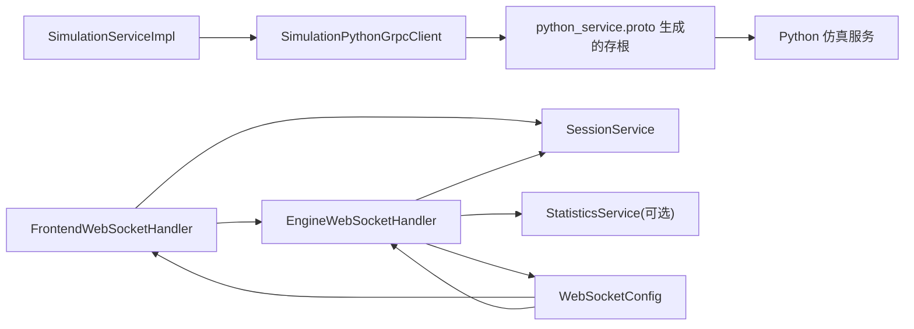

# 外部集成

<cite>
**本文引用的文件**
- [SimulationPythonGrpcClient.java](file://plugins/plugin-simulation/src/main/java/com/traffic/sim/plugin/simulation/grpc/SimulationPythonGrpcClient.java)
- [python_service.proto](file://plugins/plugin-simulation/src/main/proto/python_service.proto)
- [GrpcClientConfig.java](file://plugins/plugin-simulation/src/main/java/com/traffic/sim/plugin/simulation/config/GrpcClientConfig.java)
- [SimulationServiceImpl.java](file://plugins/plugin-simulation/src/main/java/com/traffic/sim/plugin/simulation/service/SimulationServiceImpl.java)
- [EngineWebSocketHandler.java](file://plugins/plugin-engine-manager/src/main/java/com/traffic/sim/plugin/engine/manager/websocket/EngineWebSocketHandler.java)
- [FrontendWebSocketHandler.java](file://plugins/plugin-engine-manager/src/main/java/com/traffic/sim/plugin/engine/manager/websocket/FrontendWebSocketHandler.java)
- [WebSocketConfig.java](file://plugins/plugin-engine-manager/src/main/java/com/traffic/sim/plugin/engine/manager/config/WebSocketConfig.java)
- [EngineManagerProperties.java](file://plugins/plugin-engine-manager/src/main/java/com/traffic/sim/plugin/engine/manager/config/EngineManagerProperties.java)
- [WebSocketInfo.java](file://traffic-sim-common/src/main/java/com/traffic/sim/common/model/WebSocketInfo.java)
- [WebSocketOperation.java](file://traffic-sim-common/src/main/java/com/traffic/sim/common/constant/WebSocketOperation.java)
- [Dockerfile（map_convert_services）](file://map_convert_services/Dockerfile)
- [web_app.py（map_convert_services）](file://map_convert_services/web_app.py)
</cite>

## 目录
1. [简介](#简介)
2. [项目结构](#项目结构)
3. [核心组件](#核心组件)
4. [架构总览](#架构总览)
5. [详细组件分析](#详细组件分析)
6. [依赖分析](#依赖分析)
7. [性能考虑](#性能考虑)
8. [故障排查指南](#故障排查指南)
9. [结论](#结论)

## 简介
本文件聚焦系统与外部系统的两类关键集成方式：
- gRPC 集成：Java 服务作为 gRPC 客户端调用 Python 编写的仿真引擎服务，协议由 proto 定义并通过生成的存根发起同步调用；同时具备容错兜底能力。
- WebSocket 集成：前端与仿真引擎通过两条独立的 WebSocket 通道实时通信，分别由前端处理器与引擎处理器负责消息分发、统计计算与错误处理。

此外，map_convert_services 作为独立的 Python 服务，通过 HTTP 接口与主应用交互，并以 Dockerfile 表明其容器化部署形态。

## 项目结构
围绕“外部集成”的关键模块分布如下：
- gRPC 集成位于仿真插件模块，包含 proto 协议、gRPC 客户端与服务层调用链。
- WebSocket 集成位于引擎管理插件模块，包含处理器、配置与属性。
- map_convert_services 位于仓库根目录，包含 Python 服务与 Dockerfile。

图表来源
- [SimulationServiceImpl.java](file://plugins/plugin-simulation/src/main/java/com/traffic/sim/plugin/simulation/service/SimulationServiceImpl.java#L1-L191)
- [SimulationPythonGrpcClient.java](file://plugins/plugin-simulation/src/main/java/com/traffic/sim/plugin/simulation/grpc/SimulationPythonGrpcClient.java#L1-L264)
- [GrpcClientConfig.java](file://plugins/plugin-simulation/src/main/java/com/traffic/sim/plugin/simulation/config/GrpcClientConfig.java#L1-L36)
- [python_service.proto](file://plugins/plugin-simulation/src/main/proto/python_service.proto#L1-L82)
- [WebSocketConfig.java](file://plugins/plugin-engine-manager/src/main/java/com/traffic/sim/plugin/engine/manager/config/WebSocketConfig.java#L1-L42)
- [FrontendWebSocketHandler.java](file://plugins/plugin-engine-manager/src/main/java/com/traffic/sim/plugin/engine/manager/websocket/FrontendWebSocketHandler.java#L1-L187)
- [EngineWebSocketHandler.java](file://plugins/plugin-engine-manager/src/main/java/com/traffic/sim/plugin/engine/manager/websocket/EngineWebSocketHandler.java#L1-L272)
- [EngineManagerProperties.java](file://plugins/plugin-engine-manager/src/main/java/com/traffic/sim/plugin/engine/manager/config/EngineManagerProperties.java#L1-L44)
- [web_app.py](file://map_convert_services/web_app.py#L1-L200)
- [Dockerfile（map_convert_services）](file://map_convert_services/Dockerfile#L1-L66)

章节来源
- [SimulationServiceImpl.java](file://plugins/plugin-simulation/src/main/java/com/traffic/sim/plugin/simulation/service/SimulationServiceImpl.java#L1-L191)
- [SimulationPythonGrpcClient.java](file://plugins/plugin-simulation/src/main/java/com/traffic/sim/plugin/simulation/grpc/SimulationPythonGrpcClient.java#L1-L264)
- [GrpcClientConfig.java](file://plugins/plugin-simulation/src/main/java/com/traffic/sim/plugin/simulation/config/GrpcClientConfig.java#L1-L36)
- [python_service.proto](file://plugins/plugin-simulation/src/main/proto/python_service.proto#L1-L82)
- [WebSocketConfig.java](file://plugins/plugin-engine-manager/src/main/java/com/traffic/sim/plugin/engine/manager/config/WebSocketConfig.java#L1-L42)
- [FrontendWebSocketHandler.java](file://plugins/plugin-engine-manager/src/main/java/com/traffic/sim/plugin/engine/manager/websocket/FrontendWebSocketHandler.java#L1-L187)
- [EngineWebSocketHandler.java](file://plugins/plugin-engine-manager/src/main/java/com/traffic/sim/plugin/engine/manager/websocket/EngineWebSocketHandler.java#L1-L272)
- [EngineManagerProperties.java](file://plugins/plugin-engine-manager/src/main/java/com/traffic/sim/plugin/engine/manager/config/EngineManagerProperties.java#L1-L44)
- [web_app.py](file://map_convert_services/web_app.py#L1-L200)
- [Dockerfile（map_convert_services）](file://map_convert_services/Dockerfile#L1-L66)

## 核心组件
- gRPC 客户端与协议
  - Java 侧通过 @GrpcClient 注入 PythonService 的阻塞式存根，发起 CreateSimeng 与 ControlGreenRatio 请求；对 gRPC 不可用或异常进行兜底处理，保证系统可用性。
  - 协议由 python_service.proto 定义，包含请求/响应消息体及 RPC 方法。
- WebSocket 处理器
  - 前端处理器负责解析前端消息、握手初始化、转发到引擎处理器；引擎处理器负责与仿真引擎建立连接、接收仿真数据、调用统计服务、向前端推送统计结果。
- Python 服务
  - map_convert_services 提供 FastAPI 接口，负责仿真初始化、文件处理与引擎启动，并以 Dockerfile 进行容器化部署。

章节来源
- [SimulationPythonGrpcClient.java](file://plugins/plugin-simulation/src/main/java/com/traffic/sim/plugin/simulation/grpc/SimulationPythonGrpcClient.java#L1-L264)
- [python_service.proto](file://plugins/plugin-simulation/src/main/proto/python_service.proto#L1-L82)
- [FrontendWebSocketHandler.java](file://plugins/plugin-engine-manager/src/main/java/com/traffic/sim/plugin/engine/manager/websocket/FrontendWebSocketHandler.java#L1-L187)
- [EngineWebSocketHandler.java](file://plugins/plugin-engine-manager/src/main/java/com/traffic/sim/plugin/engine/manager/websocket/EngineWebSocketHandler.java#L1-L272)
- [web_app.py](file://map_convert_services/web_app.py#L1-L200)
- [Dockerfile（map_convert_services）](file://map_convert_services/Dockerfile#L1-L66)

## 架构总览
下图展示 Java 服务与 Python 服务之间的 gRPC 调用链，以及前端与引擎之间的 WebSocket 交互路径。

图表来源
- [SimulationServiceImpl.java](file://plugins/plugin-simulation/src/main/java/com/traffic/sim/plugin/simulation/service/SimulationServiceImpl.java#L1-L191)
- [SimulationPythonGrpcClient.java](file://plugins/plugin-simulation/src/main/java/com/traffic/sim/plugin/simulation/grpc/SimulationPythonGrpcClient.java#L1-L264)
- [python_service.proto](file://plugins/plugin-simulation/src/main/proto/python_service.proto#L1-L82)
- [FrontendWebSocketHandler.java](file://plugins/plugin-engine-manager/src/main/java/com/traffic/sim/plugin/engine/manager/websocket/FrontendWebSocketHandler.java#L1-L187)
- [EngineWebSocketHandler.java](file://plugins/plugin-engine-manager/src/main/java/com/traffic/sim/plugin/engine/manager/websocket/EngineWebSocketHandler.java#L1-L272)

## 详细组件分析

### gRPC 集成：Java 作为客户端调用 Python 仿真引擎
- 协议定义与生成的存根
  - 协议文件定义了 PythonService 服务及其 RPC 方法，包括 CreateSimeng、ControlGreenRatio、TestConnection，以及请求/响应消息体。
  - Java 侧通过 @GrpcClient 注入阻塞式存根，发起同步调用。
- 容错与兜底
  - 客户端在初始化阶段采用延迟加载，若 gRPC 服务不可用，仍允许应用启动；后续调用中捕获异常并返回兜底响应，避免影响上层业务。
- 调用流程
  - 服务层调用 gRPC 客户端，客户端将请求 DTO 转换为 proto 消息，发送至 Python 服务；收到响应后转换回通用 ApiResponse 返回。

图表来源
- [SimulationServiceImpl.java](file://plugins/plugin-simulation/src/main/java/com/traffic/sim/plugin/simulation/service/SimulationServiceImpl.java#L1-L191)
- [SimulationPythonGrpcClient.java](file://plugins/plugin-simulation/src/main/java/com/traffic/sim/plugin/simulation/grpc/SimulationPythonGrpcClient.java#L1-L264)
- [python_service.proto](file://plugins/plugin-simulation/src/main/proto/python_service.proto#L1-L82)

章节来源
- [SimulationPythonGrpcClient.java](file://plugins/plugin-simulation/src/main/java/com/traffic/sim/plugin/simulation/grpc/SimulationPythonGrpcClient.java#L1-L264)
- [GrpcClientConfig.java](file://plugins/plugin-simulation/src/main/java/com/traffic/sim/plugin/simulation/config/GrpcClientConfig.java#L1-L36)
- [SimulationServiceImpl.java](file://plugins/plugin-simulation/src/main/java/com/traffic/sim/plugin/simulation/service/SimulationServiceImpl.java#L1-L191)
- [python_service.proto](file://plugins/plugin-simulation/src/main/proto/python_service.proto#L1-L82)

### WebSocket 集成：前端与引擎的实时通信
- 连接建立
  - 前端 WebSocket 路径由配置类注册，默认为 /ws/frontend；引擎 WebSocket 路径为 /ws/exe/{exe_id}，其中 exe_id 对应会话标识。
  - 处理器在连接建立时从握手头或 URI 中提取会话标识，并将自身会话绑定到会话信息中。
- 消息格式与操作类型
  - 使用 WebSocketInfo 作为统一消息载体，包含 type（消息类型）、ope（操作类型）、time（时间戳）与 data（负载数据）。
  - 常用操作类型包括 hello、hi、start、pause、stop、err、eng_ok、sim_data、statistics 等。
- 前端到引擎的消息转发
  - 前端处理器识别 eng 类型消息并转发给引擎处理器；若引擎未初始化则返回错误。
- 引擎到前端的数据推送
  - 引擎处理器接收仿真数据后，可调用统计服务进行处理，构造 statistics 消息推送给前端；若统计服务不可用，则回退推送原始数据。
- 错误处理
  - 两端处理器均在异常时发送 err 消息，并记录日志；连接关闭时清理会话状态。

图表来源
- [FrontendWebSocketHandler.java](file://plugins/plugin-engine-manager/src/main/java/com/traffic/sim/plugin/engine/manager/websocket/FrontendWebSocketHandler.java#L1-L187)
- [EngineWebSocketHandler.java](file://plugins/plugin-engine-manager/src/main/java/com/traffic/sim/plugin/engine/manager/websocket/EngineWebSocketHandler.java#L1-L272)
- [WebSocketConfig.java](file://plugins/plugin-engine-manager/src/main/java/com/traffic/sim/plugin/engine/manager/config/WebSocketConfig.java#L1-L42)
- [EngineManagerProperties.java](file://plugins/plugin-engine-manager/src/main/java/com/traffic/sim/plugin/engine/manager/config/EngineManagerProperties.java#L1-L44)
- [WebSocketInfo.java](file://traffic-sim-common/src/main/java/com/traffic/sim/common/model/WebSocketInfo.java#L1-L47)
- [WebSocketOperation.java](file://traffic-sim-common/src/main/java/com/traffic/sim/common/constant/WebSocketOperation.java#L1-L42)

章节来源
- [FrontendWebSocketHandler.java](file://plugins/plugin-engine-manager/src/main/java/com/traffic/sim/plugin/engine/manager/websocket/FrontendWebSocketHandler.java#L1-L187)
- [EngineWebSocketHandler.java](file://plugins/plugin-engine-manager/src/main/java/com/traffic/sim/plugin/engine/manager/websocket/EngineWebSocketHandler.java#L1-L272)
- [WebSocketConfig.java](file://plugins/plugin-engine-manager/src/main/java/com/traffic/sim/plugin/engine/manager/config/WebSocketConfig.java#L1-L42)
- [EngineManagerProperties.java](file://plugins/plugin-engine-manager/src/main/java/com/traffic/sim/plugin/engine/manager/config/EngineManagerProperties.java#L1-L44)
- [WebSocketInfo.java](file://traffic-sim-common/src/main/java/com/traffic/sim/common/model/WebSocketInfo.java#L1-L47)
- [WebSocketOperation.java](file://traffic-sim-common/src/main/java/com/traffic/sim/common/constant/WebSocketOperation.java#L1-L42)

### Python 服务（map_convert_services）：HTTP 与容器化
- HTTP 接口
  - 提供 /init_simeng 等接口，用于接收仿真初始化请求，完成文件准备、插件复制与仿真引擎启动。
- 容器化部署
  - Dockerfile 指定基础镜像、安装 Wine 与 Python 依赖、暴露端口并设置默认入口命令，表明该服务以容器形式运行。

图表来源
- [web_app.py](file://map_convert_services/web_app.py#L1-L200)
- [Dockerfile（map_convert_services）](file://map_convert_services/Dockerfile#L1-L66)

章节来源
- [web_app.py](file://map_convert_services/web_app.py#L1-L200)
- [Dockerfile（map_convert_services）](file://map_convert_services/Dockerfile#L1-L66)

## 依赖分析
- gRPC 客户端与服务层
  - SimulationServiceImpl 依赖 SimulationPythonGrpcClient；后者依赖 proto 生成的存根与 Python 服务。
- WebSocket 处理器与配置
  - WebSocketConfig 注册两条处理器路径；FrontendWebSocketHandler 与 EngineWebSocketHandler 通过 SessionService 维护会话状态；EngineWebSocketHandler 可选依赖 StatisticsService。
- Python 服务与容器
  - Python 服务通过 FastAPI 提供 HTTP 接口，Dockerfile 定义镜像构建与运行参数。

图表来源
- [SimulationServiceImpl.java](file://plugins/plugin-simulation/src/main/java/com/traffic/sim/plugin/simulation/service/SimulationServiceImpl.java#L1-L191)
- [SimulationPythonGrpcClient.java](file://plugins/plugin-simulation/src/main/java/com/traffic/sim/plugin/simulation/grpc/SimulationPythonGrpcClient.java#L1-L264)
- [python_service.proto](file://plugins/plugin-simulation/src/main/proto/python_service.proto#L1-L82)
- [FrontendWebSocketHandler.java](file://plugins/plugin-engine-manager/src/main/java/com/traffic/sim/plugin/engine/manager/websocket/FrontendWebSocketHandler.java#L1-L187)
- [EngineWebSocketHandler.java](file://plugins/plugin-engine-manager/src/main/java/com/traffic/sim/plugin/engine/manager/websocket/EngineWebSocketHandler.java#L1-L272)
- [WebSocketConfig.java](file://plugins/plugin-engine-manager/src/main/java/com/traffic/sim/plugin/engine/manager/config/WebSocketConfig.java#L1-L42)

章节来源
- [SimulationServiceImpl.java](file://plugins/plugin-simulation/src/main/java/com/traffic/sim/plugin/simulation/service/SimulationServiceImpl.java#L1-L191)
- [SimulationPythonGrpcClient.java](file://plugins/plugin-simulation/src/main/java/com/traffic/sim/plugin/simulation/grpc/SimulationPythonGrpcClient.java#L1-L264)
- [FrontendWebSocketHandler.java](file://plugins/plugin-engine-manager/src/main/java/com/traffic/sim/plugin/engine/manager/websocket/FrontendWebSocketHandler.java#L1-L187)
- [EngineWebSocketHandler.java](file://plugins/plugin-engine-manager/src/main/java/com/traffic/sim/plugin/engine/manager/websocket/EngineWebSocketHandler.java#L1-L272)
- [WebSocketConfig.java](file://plugins/plugin-engine-manager/src/main/java/com/traffic/sim/plugin/engine/manager/config/WebSocketConfig.java#L1-L42)

## 性能考虑
- gRPC
  - 使用阻塞式存根进行同步调用，适合低延迟场景；建议在高并发场景下评估连接池与超时策略。
  - 客户端已具备容错兜底，避免单点故障导致整体不可用。
- WebSocket
  - 处理器对消息大小与处理超时有配置项，建议结合业务流量调整。
  - 统计服务处理可能带来额外开销，若不可用则回退原始数据，确保前端体验连续性。
- Python 服务
  - 容器化部署便于弹性伸缩与资源隔离；注意日志与文件系统挂载的 I/O 影响。

## 故障排查指南
- gRPC 不可用
  - 现象：调用返回兜底响应，消息中包含 gRPC 不可用提示。
  - 排查：确认 Python 服务是否启动、端口是否可达、网络连通性；检查客户端配置开关。
- WebSocket 握手失败
  - 现象：连接被拒绝或无法建立。
  - 排查：核对路径配置、CORS 允许域、Cookie 中的会话标识；查看处理器日志。
- 引擎未初始化
  - 现象：前端发送 eng 消息被拒绝。
  - 排查：确认引擎握手流程已完成，且会话状态已更新。
- 统计服务异常
  - 现象：统计消息缺失或延迟。
  - 排查：检查统计服务可用性与处理逻辑，必要时回退推送原始数据。

章节来源
- [SimulationPythonGrpcClient.java](file://plugins/plugin-simulation/src/main/java/com/traffic/sim/plugin/simulation/grpc/SimulationPythonGrpcClient.java#L1-L264)
- [EngineWebSocketHandler.java](file://plugins/plugin-engine-manager/src/main/java/com/traffic/sim/plugin/engine/manager/websocket/EngineWebSocketHandler.java#L1-L272)
- [FrontendWebSocketHandler.java](file://plugins/plugin-engine-manager/src/main/java/com/traffic/sim/plugin/engine/manager/websocket/FrontendWebSocketHandler.java#L1-L187)

## 结论
本系统通过 gRPC 与 WebSocket 两种方式实现了与外部系统的高效集成：
- gRPC 保障了 Java 服务与 Python 仿真引擎之间的可靠同步调用，并内置容错兜底，提升系统韧性。
- WebSocket 为前端与引擎提供了低延迟的双向通信通道，配合会话管理与可选统计服务，满足实时可视化与控制需求。
- map_convert_services 以容器化方式提供 HTTP 接口，便于与主应用解耦协作。