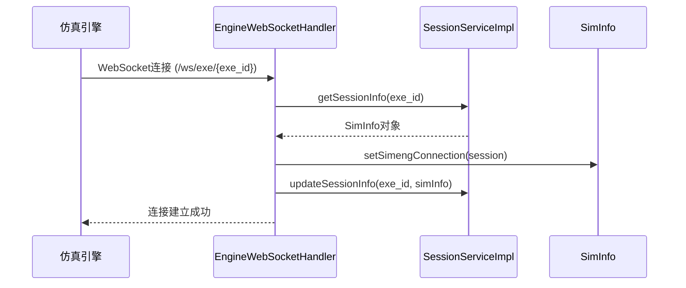
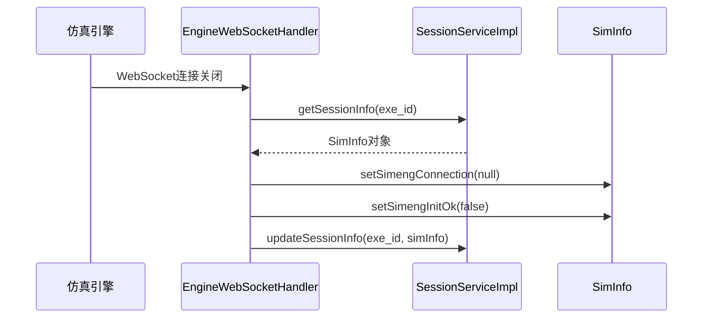
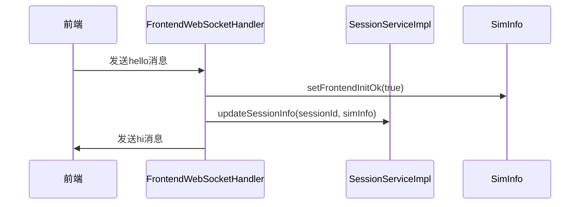
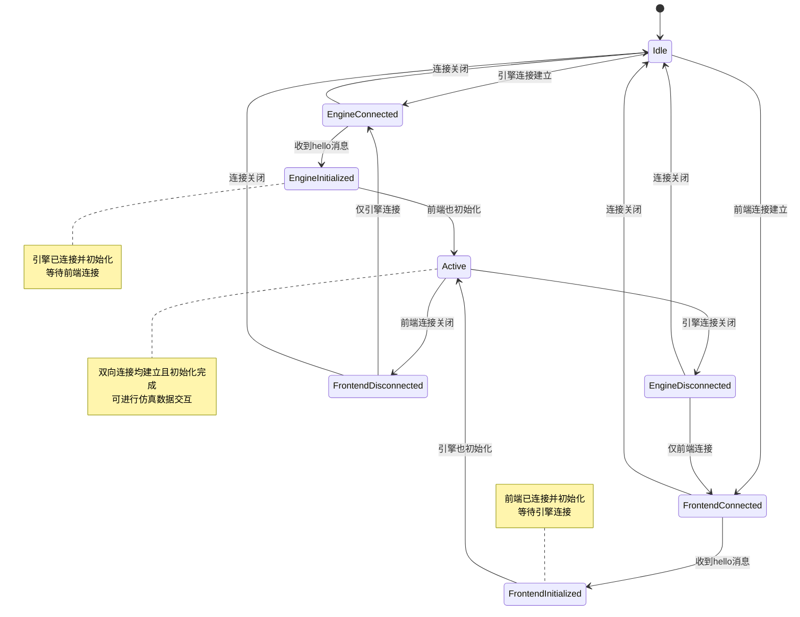

# 会话管理

<cite>
**本文档中引用的文件**  
- [SessionServiceImpl.java](file://plugins/plugin-engine-manager/src/main/java/com/traffic/sim/plugin/engine/manager/service/SessionServiceImpl.java)
- [SimInfo.java](file://traffic-sim-common/src/main/java/com/traffic/sim/common/model/SimInfo.java)
- [SessionService.java](file://traffic-sim-common/src/main/java/com/traffic/sim/common/service/SessionService.java)
- [EngineWebSocketHandler.java](file://plugins/plugin-engine-manager/src/main/java/com/traffic/sim/plugin/engine/manager/websocket/EngineWebSocketHandler.java)
- [FrontendWebSocketHandler.java](file://plugins/plugin-engine-manager/src/main/java/com/traffic/sim/plugin/engine/manager/websocket/FrontendWebSocketHandler.java)
- [WebSocketConfig.java](file://plugins/plugin-engine-manager/src/main/java/com/traffic/sim/plugin/engine/manager/config/WebSocketConfig.java)
- [WebSocketHandlerConfig.java](file://plugins/plugin-engine-manager/src/main/java/com/traffic/sim/plugin/engine/manager/config/WebSocketHandlerConfig.java)
- [EngineManagerProperties.java](file://plugins/plugin-engine-manager/src/main/java/com/traffic/sim/plugin/engine/manager/config/EngineManagerProperties.java)
- [WebSocketInfo.java](file://traffic-sim-common/src/main/java/com/traffic/sim/common/model/WebSocketInfo.java)
- [WebSocketMessageType.java](file://traffic-sim-common/src/main/java/com/traffic/sim/common/constant/WebSocketMessageType.java)
- [WebSocketOperation.java](file://traffic-sim-common/src/main/java/com/traffic/sim/common/constant/WebSocketOperation.java)
</cite>

## 目录
1. [简介](#简介)
2. [核心组件](#核心组件)
3. [会话生命周期管理](#会话生命周期管理)
4. [状态转换与会话管理机制](#状态转换与会话管理机制)
5. [会话状态转换图](#会话状态转换图)
6. [持久化与分布式扩展方案](#持久化与分布式扩展方案)
7. [典型使用场景](#典型使用场景)
8. [结论](#结论)

## 简介
本系统通过`SessionServiceImpl`类实现对仿真引擎监控会话的集中管理。该服务基于内存中的`ConcurrentHashMap`结构存储会话信息，支持高并发访问，确保在多线程环境下会话数据的安全性和一致性。会话管理模块作为核心枢纽，协调前端、仿真引擎和后端服务之间的通信，维护每个仿真会话的完整状态。

## 核心组件

`SessionServiceImpl`是会话管理的核心实现类，实现了`SessionService`接口，提供会话的创建、查询、更新、删除和获取所有活跃会话的功能。会话数据通过`SimInfo`对象进行封装，包含仿真会话的元数据、连接状态和初始化标志。

**会话存储机制**
会话信息存储在`ConcurrentHashMap<String, SimInfo>`类型的`sessionStore`中，利用其线程安全特性，避免了显式同步的开销，提高了并发性能。该设计适用于单体架构，在分布式环境下需要扩展为共享存储方案。

**会话操作实现**
- **创建会话**：调用`createSession`方法时，创建新的`SimInfo`实例，设置会话ID、创建时间和最后更新时间，并存入`sessionStore`。
- **查询会话**：通过`getSessionInfo`方法根据会话ID从`sessionStore`中获取会话信息。
- **更新会话**：`updateSessionInfo`方法在更新会话信息前会自动更新`lastUpdateTime`字段，确保会话活跃状态的准确追踪。
- **删除会话**：`removeSession`方法从`sessionStore`中移除指定会话，并记录日志。

**Section sources**
- [SessionServiceImpl.java](file://plugins/plugin-engine-manager/src/main/java/com/traffic/sim/plugin/engine/manager/service/SessionServiceImpl.java#L20-L66)
- [SessionService.java](file://traffic-sim-common/src/main/java/com/traffic/sim/common/service/SessionService.java#L13-L60)
- [SimInfo.java](file://traffic-sim-common/src/main/java/com/traffic/sim/common/model/SimInfo.java#L16-L72)

## 会话生命周期管理

会话的生命周期与WebSocket连接紧密相关，通过`EngineWebSocketHandler`和`FrontendWebSocketHandler`两个处理器分别管理与仿真引擎和前端的连接。

**连接建立时的初始化**
当仿真引擎通过`/ws/exe/{exe_id}`路径建立WebSocket连接时，`EngineWebSocketHandler`的`afterConnectionEstablished`方法被触发。该方法从会话存储中获取对应的`SimInfo`对象，将`WebSocketSession`引用赋值给`simengConnection`字段，并更新会话信息。



**Section sources**
- [EngineWebSocketHandler.java](file://plugins/plugin-engine-manager/src/main/java/com/traffic/sim/plugin/engine/manager/websocket/EngineWebSocketHandler.java#L53-L64)
- [FrontendWebSocketHandler.java](file://plugins/plugin-engine-manager/src/main/java/com/traffic/sim/plugin/engine/manager/websocket/FrontendWebSocketHandler.java#L43-L54)

**连接关闭时的资源清理**
当WebSocket连接关闭时，`afterConnectionClosed`方法被调用。该方法将`SimInfo`对象中的连接引用置为`null`，并重置初始化标志，确保会话状态的正确性。



**Diagram sources**
- [EngineWebSocketHandler.java](file://plugins/plugin-engine-manager/src/main/java/com/traffic/sim/plugin/engine/manager/websocket/EngineWebSocketHandler.java#L254-L263)
- [FrontendWebSocketHandler.java](file://plugins/plugin-engine-manager/src/main/java/com/traffic/sim/plugin/engine/manager/websocket/FrontendWebSocketHandler.java#L169-L178)

## 状态转换与会话管理机制

`SimInfo`对象是会话状态的核心载体，其各个字段具有明确的用途和状态转换逻辑。

**核心字段说明**
- `sessionId`：会话的唯一标识符，作为`sessionStore`的键。
- `simengConnection`：指向仿真引擎的WebSocket连接，用于与引擎通信。
- `frontendConnection`：指向前端的WebSocket连接，用于向前端推送数据。
- `simengInitOk`：引擎初始化标志，通过`hello`消息握手后设置为`true`。
- `frontendInitOk`：前端初始化标志，通过`hello`消息握手后设置为`true`。
- `lastUpdateTime`：最后更新时间，用于会话超时检测。

**状态检查方法**
`SimInfo`类提供了两个便捷方法来检查连接状态：
- `isEngineInitialized()`：检查引擎连接是否有效且已初始化。
- `isFrontendInitialized()`：检查前端连接是否有效且已初始化。

**初始化握手流程**
初始化通过`hello`/`hi`消息对完成。当一方发送`hello`消息后，另一方回复`hi`消息，同时将对应的初始化标志置为`true`。



**Section sources**
- [SimInfo.java](file://traffic-sim-common/src/main/java/com/traffic/sim/common/model/SimInfo.java#L16-L72)
- [EngineWebSocketHandler.java](file://plugins/plugin-engine-manager/src/main/java/com/traffic/sim/plugin/engine/manager/websocket/EngineWebSocketHandler.java#L170-L178)
- [FrontendWebSocketHandler.java](file://plugins/plugin-engine-manager/src/main/java/com/traffic/sim/plugin/engine/manager/websocket/FrontendWebSocketHandler.java#L100-L108)

## 会话状态转换图



**Diagram sources**
- [SimInfo.java](file://traffic-sim-common/src/main/java/com/traffic/sim/common/model/SimInfo.java#L16-L72)
- [EngineWebSocketHandler.java](file://plugins/plugin-engine-manager/src/main/java/com/traffic/sim/plugin/engine/manager/websocket/EngineWebSocketHandler.java#L53-L64)
- [FrontendWebSocketHandler.java](file://plugins/plugin-engine-manager/src/main/java/com/traffic/sim/plugin/engine/manager/websocket/FrontendWebSocketHandler.java#L43-L54)

## 持久化与分布式扩展方案

当前会话管理采用内存存储，适用于单体架构。在生产环境中，为提高可靠性和支持分布式部署，需要考虑以下扩展方案。

**持久化考虑**
- **会话状态持久化**：可将会话信息存储到数据库（如MySQL或MongoDB）中，防止服务重启导致会话丢失。
- **定期快照**：定期将会话状态序列化到文件系统或对象存储中，用于故障恢复。
- **事件溯源**：将会话状态变更记录为事件流，存储在消息队列或事件存储中，实现状态重建。

**分布式环境下的扩展**
- **共享存储**：使用Redis等分布式缓存替代`ConcurrentHashMap`，实现多实例间的会话共享。
- **会话复制**：在集群节点间复制会话状态，确保高可用性。
- **粘性会话**：通过负载均衡器的粘性会话功能，将会话固定到特定节点，简化状态管理。

**配置参数**
`EngineManagerProperties`类定义了会话相关的配置参数，如会话超时时间、清理间隔等，为未来的会话管理策略提供了配置基础。

**Section sources**
- [EngineManagerProperties.java](file://plugins/plugin-engine-manager/src/main/java/com/traffic/sim/plugin/engine/manager/config/EngineManagerProperties.java#L15-L43)
- [SessionServiceImpl.java](file://plugins/plugin-engine-manager/src/main/java/com/traffic/sim/plugin/engine/manager/service/SessionServiceImpl.java#L23-L24)

## 典型使用场景

**场景一：创建新仿真会话**
```java
// 伪代码示例
String sessionId = UUID.randomUUID().toString();
SimInfo simInfo = sessionService.createSession(sessionId);
// 配置simInfo的其他属性，如xmlPath、simDir等
```

**场景二：处理引擎消息**
```java
// 在EngineWebSocketHandler中
SimInfo simInfo = sessionService.getSessionInfo(exeId);
if (simInfo != null && "hello".equals(wsMessage.getOpe())) {
    simInfo.setSimengInitOk(true);
    sessionService.updateSessionInfo(exeId, simInfo);
}
```

**场景三：转发前端控制指令**
```java
// 在FrontendWebSocketHandler中
if ("start".equals(wsMessage.getOpe())) {
    // 验证前端和引擎均已初始化
    if (simInfo.isFrontendInitialized() && simInfo.isEngineInitialized()) {
        engineWebSocketHandler.forwardToEngine(sessionId, wsMessage);
    }
}
```

**Section sources**
- [SessionServiceImpl.java](file://plugins/plugin-engine-manager/src/main/java/com/traffic/sim/plugin/engine/manager/service/SessionServiceImpl.java#L26-L33)
- [EngineWebSocketHandler.java](file://plugins/plugin-engine-manager/src/main/java/com/traffic/sim/plugin/engine/manager/websocket/EngineWebSocketHandler.java#L170-L178)
- [FrontendWebSocketHandler.java](file://plugins/plugin-engine-manager/src/main/java/com/traffic/sim/plugin/engine/manager/websocket/FrontendWebSocketHandler.java#L75-L77)

## 结论
`SessionServiceImpl`通过`ConcurrentHashMap`实现了高效、线程安全的会话管理，`SimInfo`对象全面封装了仿真会话的状态信息。通过WebSocket连接的生命周期管理，系统能够准确追踪会话状态，确保通信的可靠性。当前设计适用于单体架构，在分布式环境下可通过引入共享存储和持久化机制进行扩展，以满足高可用性和数据一致性的要求。