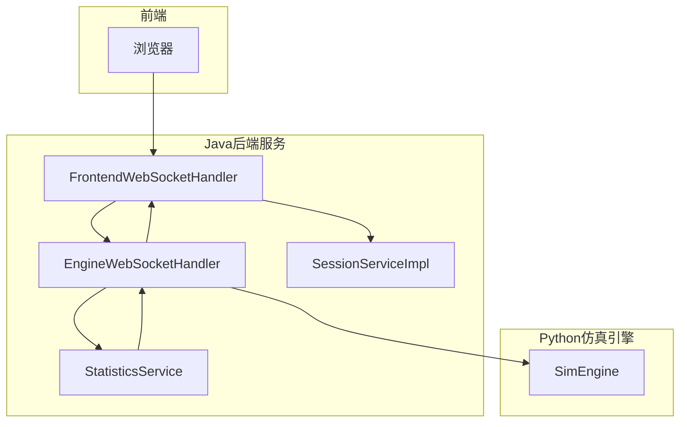
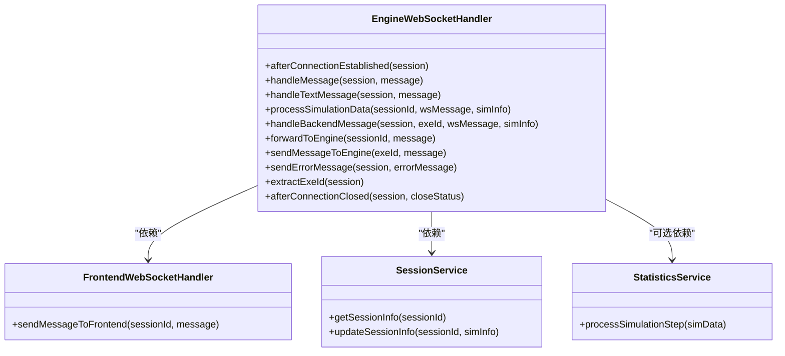
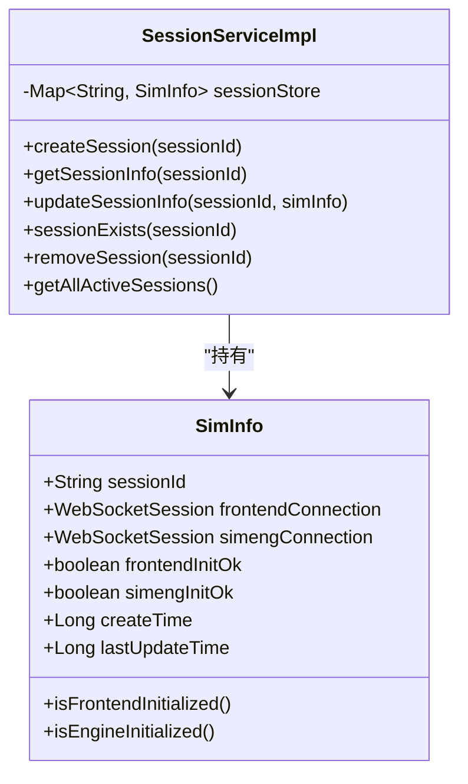
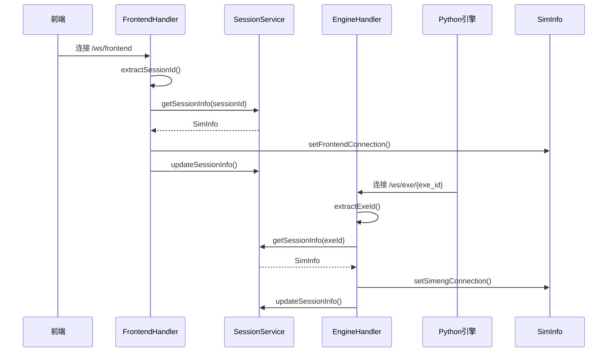
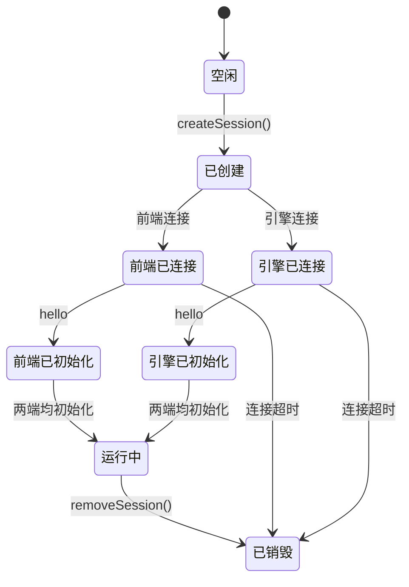
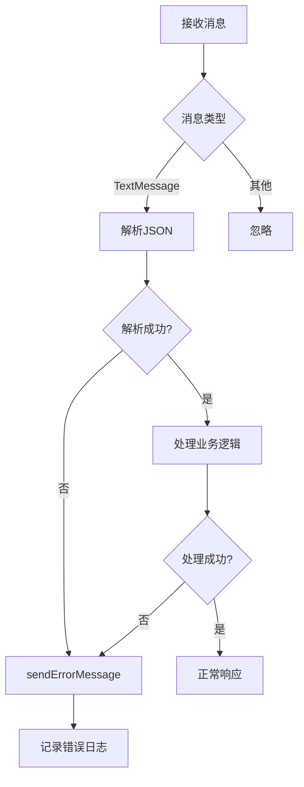

# 引擎监控

<cite>
**本文档引用的文件**  
- [EngineWebSocketHandler.java](file://plugins/plugin-engine-manager/src/main/java/com/traffic/sim/plugin/engine/manager/websocket/EngineWebSocketHandler.java)
- [SessionServiceImpl.java](file://plugins/plugin-engine-manager/src/main/java/com/traffic/sim/plugin/engine/manager/service/SessionServiceImpl.java)
- [FrontendWebSocketHandler.java](file://plugins/plugin-engine-manager/src/main/java/com/traffic/sim/plugin/engine/manager/websocket/FrontendWebSocketHandler.java)
- [WebSocketConfig.java](file://plugins/plugin-engine-manager/src/main/java/com/traffic/sim/plugin/engine/manager/config/WebSocketConfig.java)
- [WebSocketHandlerConfig.java](file://plugins/plugin-engine-manager/src/main/java/com/traffic/sim/plugin/engine/manager/config/WebSocketHandlerConfig.java)
- [SimInfo.java](file://traffic-sim-common/src/main/java/com/traffic/sim/common/model/SimInfo.java)
- [WebSocketInfo.java](file://traffic-sim-common/src/main/java/com/traffic/sim/common/model/WebSocketInfo.java)
- [SessionService.java](file://traffic-sim-common/src/main/java/com/traffic/sim/common/service/SessionService.java)
- [StatisticsService.java](file://traffic-sim-common/src/main/java/com/traffic/sim/common/service/StatisticsService.java)
- [WebSocketMessageType.java](file://traffic-sim-common/src/main/java/com/traffic/sim/common/constant/WebSocketMessageType.java)
- [WebSocketOperation.java](file://traffic-sim-common/src/main/java/com/traffic/sim/common/constant/WebSocketOperation.java)
- [EngineManagerProperties.java](file://plugins/plugin-engine-manager/src/main/java/com/traffic/sim/plugin/engine/manager/config/EngineManagerProperties.java)
- [application.yml](file://traffic-sim-server/src/main/resources/application.yml)
</cite>

## 目录
1. [引言](#引言)
2. [系统架构概述](#系统架构概述)
3. [核心组件分析](#核心组件分析)
4. [WebSocket连接处理机制](#websocket连接处理机制)
5. [会话生命周期管理](#会话生命周期管理)
6. [监控数据类型与用途](#监控数据类型与用途)
7. [异常处理与会话恢复机制](#异常处理与会话恢复机制)
8. [配置与部署说明](#配置与部署说明)
9. [结论](#结论)

## 引言

本系统通过WebSocket实现实时监控仿真引擎的状态和会话信息，构建了一个高效、低延迟的双向通信通道。该机制支持前端、后端服务与Python仿真引擎之间的实时数据交换，确保仿真过程的可视化监控和动态控制。整个监控体系基于Spring Boot的WebSocket支持，结合内存会话管理与模块化服务设计，实现了高内聚、低耦合的架构。

**本节不涉及具体源码分析，因此无“节来源”**

## 系统架构概述

系统采用三层通信架构：前端（浏览器）、Java后端服务、Python仿真引擎。三者通过WebSocket建立双向连接，并以`session_id`为纽带进行关联。Java后端作为消息中转站，负责协调前后端与引擎之间的消息路由。



**图来源**  
- [FrontendWebSocketHandler.java](file://plugins/plugin-engine-manager/src/main/java/com/traffic/sim/plugin/engine/manager/websocket/FrontendWebSocketHandler.java)
- [EngineWebSocketHandler.java](file://plugins/plugin-engine-manager/src/main/java/com/traffic/sim/plugin/engine/manager/websocket/EngineWebSocketHandler.java)
- [SessionServiceImpl.java](file://plugins/plugin-engine-manager/src/main/java/com/traffic/sim/plugin/engine/manager/service/SessionServiceImpl.java)
- [StatisticsService.java](file://traffic-sim-common/src/main/java/com/traffic/sim/common/service/StatisticsService.java)

## 核心组件分析

### EngineWebSocketHandler 分析

`EngineWebSocketHandler` 是处理与Python仿真引擎WebSocket连接的核心组件。它监听路径 `/ws/exe/{exe_id}` 的连接请求，其中 `exe_id` 实际上是会话ID（`session_id`），用于唯一标识一个仿真会话。

该处理器负责接收来自引擎的消息，解析为统一的 `WebSocketInfo` 模型，并根据消息类型进行分发：若需转发至前端，则通过 `FrontendWebSocketHandler` 实现；若为仿真数据，则调用统计服务处理后再转发。



**图来源**  
- [EngineWebSocketHandler.java](file://plugins/plugin-engine-manager/src/main/java/com/traffic/sim/plugin/engine/manager/websocket/EngineWebSocketHandler.java)
- [FrontendWebSocketHandler.java](file://plugins/plugin-engine-manager/src/main/java/com/traffic/sim/plugin/engine/manager/websocket/FrontendWebSocketHandler.java)
- [SessionService.java](file://traffic-sim-common/src/main/java/com/traffic/sim/common/service/SessionService.java)
- [StatisticsService.java](file://traffic-sim-common/src/main/java/com/traffic/sim/common/service/StatisticsService.java)

### SessionServiceImpl 分析

`SessionServiceImpl` 是会话管理的核心实现类，基于 `ConcurrentHashMap` 在内存中存储所有活跃会话的 `SimInfo` 对象。每个会话包含前端和引擎的WebSocket连接引用、初始化状态、创建时间等元数据。

该服务提供了会话的增删改查操作，是整个监控系统状态同步的基础。所有WebSocket处理器在连接建立或关闭时都会调用此服务更新会话状态。



**图来源**  
- [SessionServiceImpl.java](file://plugins/plugin-engine-manager/src/main/java/com/traffic/sim/plugin/engine/manager/service/SessionServiceImpl.java)
- [SimInfo.java](file://traffic-sim-common/src/main/java/com/traffic/sim/common/model/SimInfo.java)

## WebSocket连接处理机制

系统通过两个独立的WebSocket端点实现双通道通信：

1. **前端连接**：路径为 `/ws/frontend`，通过Cookie中的 `id` 字段提取 `session_id`，建立与浏览器的连接。
2. **引擎连接**：路径为 `/ws/exe/{exe_id}`，从URI中提取 `exe_id`（即 `session_id`），建立与Python引擎的连接。

连接建立后，`EngineWebSocketHandler` 和 `FrontendWebSocketHandler` 会分别将WebSocket会话对象保存到对应的 `SimInfo` 中，完成会话绑定。



**图来源**  
- [FrontendWebSocketHandler.java](file://plugins/plugin-engine-manager/src/main/java/com/traffic/sim/plugin/engine/manager/websocket/FrontendWebSocketHandler.java#L42-L55)
- [EngineWebSocketHandler.java](file://plugins/plugin-engine-manager/src/main/java/com/traffic/sim/plugin/engine/manager/websocket/EngineWebSocketHandler.java#L53-L65)
- [SessionServiceImpl.java](file://plugins/plugin-engine-manager/src/main/java/com/traffic/sim/plugin/engine/manager/service/SessionServiceImpl.java)

## 会话生命周期管理

会话的生命周期由 `SessionServiceImpl` 统一管理，主要包含以下阶段：

1. **创建**：当用户启动仿真任务时，调用 `createSession()` 创建新的 `SimInfo` 对象并存入内存。
2. **初始化**：前后端分别通过WebSocket发送 `hello` 消息进行握手，服务端更新 `frontendInitOk` 和 `simengInitOk` 标志位。
3. **运行**：引擎持续发送 `sim_data` 消息，经统计处理后转发至前端。
4. **销毁**：任一端断开连接，服务端清理对应连接引用；会话超时或用户主动停止时调用 `removeSession()` 彻底删除。



**图来源**  
- [SessionServiceImpl.java](file://plugins/plugin-engine-manager/src/main/java/com/traffic/sim/plugin/engine/manager/service/SessionServiceImpl.java)
- [SimInfo.java](file://traffic-sim-common/src/main/java/com/traffic/sim/common/model/SimInfo.java)

## 监控数据类型与用途

系统监控的数据主要分为以下几类：

| 数据类型 | 来源 | 用途 | 示例操作 |
|--------|------|------|---------|
| 连接状态 | WebSocket连接事件 | 监控通信链路健康 | `afterConnectionEstablished`, `afterConnectionClosed` |
| 心跳与初始化 | `hello`/`hi` 消息 | 确认服务就绪状态 | 握手协议 |
| 仿真数据 | `sim_data` 消息 | 实时展示交通流 | 车辆位置、速度、信号灯状态 |
| 统计信息 | `statistics` 消息 | 提供宏观交通指标 | 平均车速、拥堵指数、流量统计 |
| 控制指令 | `start`/`pause`/`stop` | 控制仿真流程 | 用户交互响应 |
| 错误信息 | `err` 消息 | 故障诊断与告警 | 异常捕获与日志记录 |

**节来源**  
- [WebSocketInfo.java](file://traffic-sim-common/src/main/java/com/traffic/sim/common/model/WebSocketInfo.java)
- [WebSocketOperation.java](file://traffic-sim-common/src/main/java/com/traffic/sim/common/constant/WebSocketOperation.java)

## 异常处理与会话恢复机制

系统具备完善的异常处理机制：

- **传输错误**：`handleTransportError` 方法捕获网络传输异常并记录日志。
- **消息解析失败**：使用 `try-catch` 包裹JSON反序列化过程，发送错误消息给客户端。
- **连接丢失**：在 `afterConnectionClosed` 中清理会话状态，防止资源泄漏。
- **统计服务降级**：`statisticsService` 为可选依赖，若不可用则直接转发原始数据。

目前系统未实现自动会话恢复机制，一旦连接中断需重新建立会话。建议在生产环境中引入Redis等持久化存储替代内存会话，并结合心跳检测实现断线重连。



**图来源**  
- [EngineWebSocketHandler.java](file://plugins/plugin-engine-manager/src/main/java/com/traffic/sim/plugin/engine/manager/websocket/EngineWebSocketHandler.java#L67-L102)
- [FrontendWebSocketHandler.java](file://plugins/plugin-engine-manager/src/main/java/com/traffic/sim/plugin/engine/manager/websocket/FrontendWebSocketHandler.java#L58-L88)

## 配置与部署说明

WebSocket相关配置通过 `EngineManagerProperties` 类定义，并可在 `application.yml` 中进行外部化配置：

```yaml
plugin:
  engine-manager:
    websocket:
      frontend-path: /ws/frontend
      engine-path: /ws/exe/{exe_id}
      allowed-origins: "*"
      sockjs-enabled: true
    session:
      timeout: 3600
      cleanup-interval: 300
```

WebSocket端点通过 `WebSocketConfig` 注册，并通过 `WebSocketHandlerConfig` 解决循环依赖问题。系统支持SOCKJS降级，确保在不支持原生WebSocket的环境下仍可通信。

**节来源**  
- [WebSocketConfig.java](file://plugins/plugin-engine-manager/src/main/java/com/traffic/sim/plugin/engine/manager/config/WebSocketConfig.java)
- [WebSocketHandlerConfig.java](file://plugins/plugin-engine-manager/src/main/java/com/traffic/sim/plugin/engine/manager/config/WebSocketHandlerConfig.java)
- [EngineManagerProperties.java](file://plugins/plugin-engine-manager/src/main/java/com/traffic/sim/plugin/engine/manager/config/EngineManagerProperties.java)
- [application.yml](file://traffic-sim-server/src/main/resources/application.yml)

## 结论

本系统通过 `EngineWebSocketHandler` 和 `SessionServiceImpl` 构建了完整的仿真引擎监控体系，实现了前后端与引擎之间的实时状态同步和数据交换。基于WebSocket的双通道设计确保了通信的高效性与可靠性，而模块化的服务结构则提升了系统的可维护性和扩展性。未来可进一步增强会话持久化与自动恢复能力，以适应更复杂的生产环境需求。

**本节为总结性内容，不涉及具体源码，因此无“节来源”**