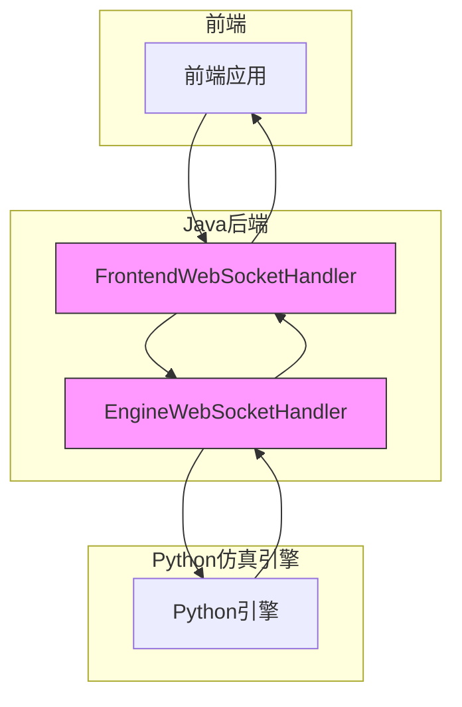
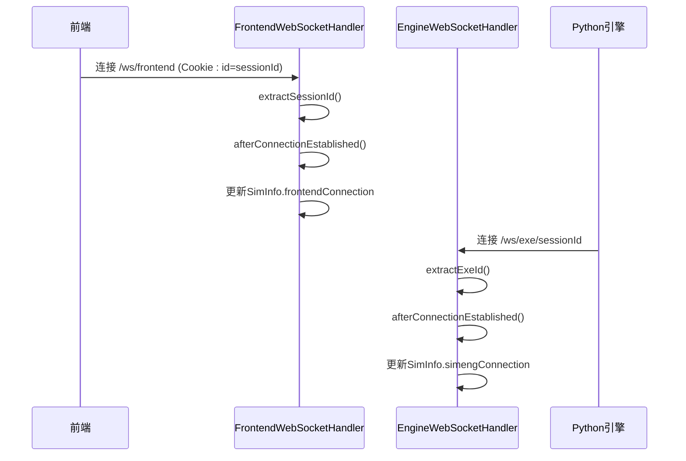
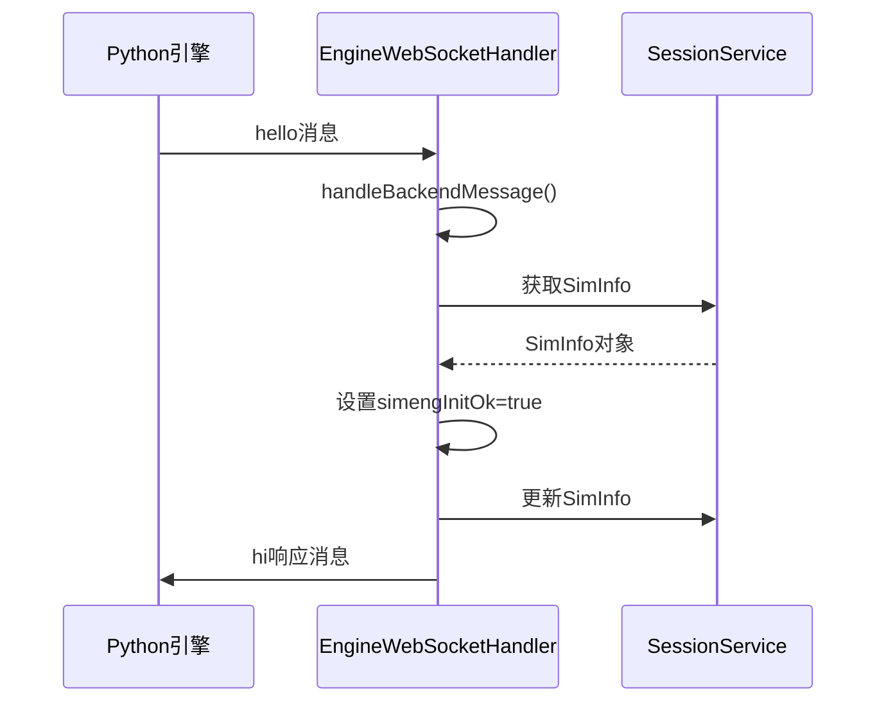
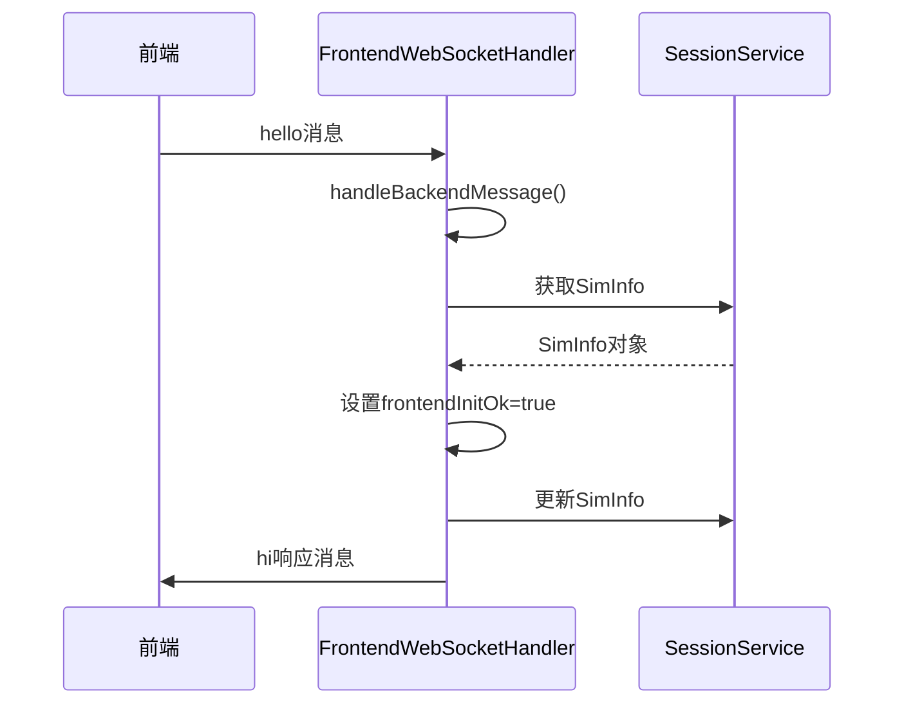
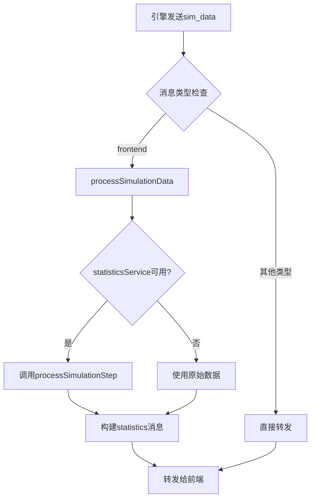
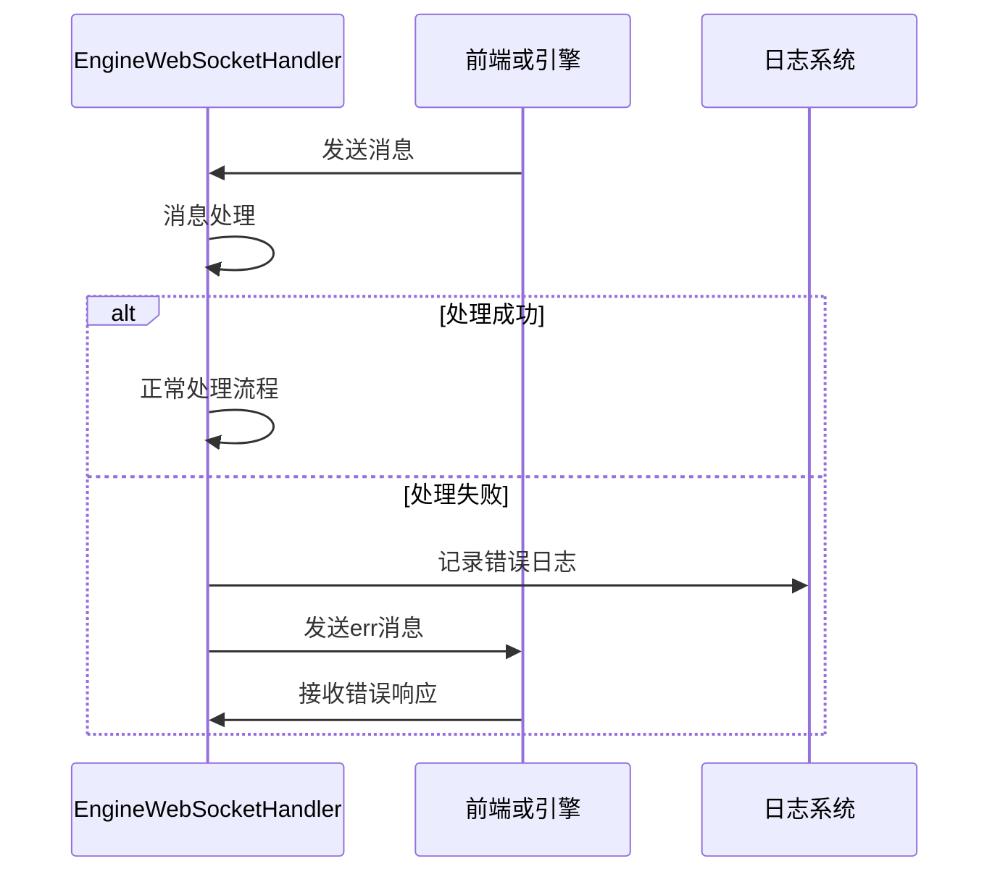
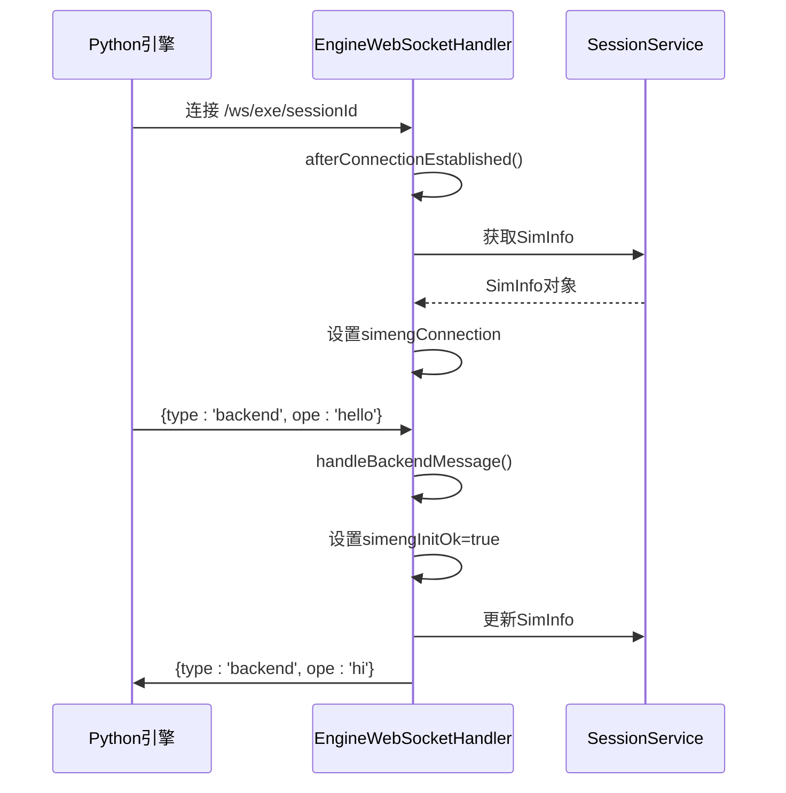
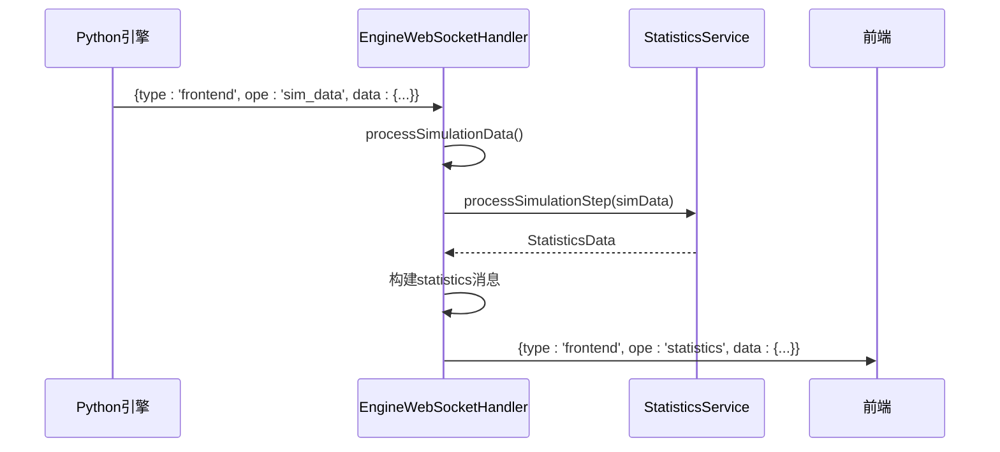
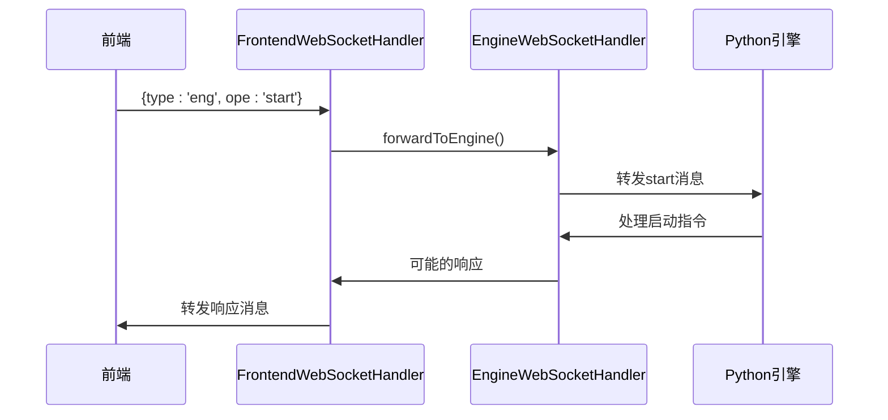

# 通信协议

<cite>
**本文档引用的文件**   
- [EngineWebSocketHandler.java](file://plugins/plugin-engine-manager/src/main/java/com/traffic/sim/plugin/engine/manager/websocket/EngineWebSocketHandler.java)
- [WebSocketInfo.java](file://traffic-sim-common/src/main/java/com/traffic/sim/common/model/WebSocketInfo.java)
- [WebSocketMessageType.java](file://traffic-sim-common/src/main/java/com/traffic/sim/common/constant/WebSocketMessageType.java)
- [WebSocketOperation.java](file://traffic-sim-common/src/main/java/com/traffic/sim/common/constant/WebSocketOperation.java)
- [FrontendWebSocketHandler.java](file://plugins/plugin-engine-manager/src/main/java/com/traffic/sim/plugin/engine/manager/websocket/FrontendWebSocketHandler.java)
- [socket_handler.py](file://map_convert_services/utils/socket_handler.py)
- [SimInfo.java](file://traffic-sim-common/src/main/java/com/traffic/sim/common/model/SimInfo.java)
- [StatisticsData.java](file://traffic-sim-common/src/main/java/com/traffic/sim/common/model/StatisticsData.java)
- [StatisticsService.java](file://traffic-sim-common/src/main/java/com/traffic/sim/common/service/StatisticsService.java)
</cite>

## 目录
1. [系统架构概述](#系统架构概述)
2. [WebSocket连接管理](#websocket连接管理)
3. [消息结构定义](#消息结构定义)
4. [握手协议实现](#握手协议实现)
5. [数据处理流程](#数据处理流程)
6. [错误处理机制](#错误处理机制)
7. [典型通信场景](#典型通信场景)

## 系统架构概述

该系统通过WebSocket实现前端、Java后端和Python仿真引擎之间的实时通信。系统采用三端通信架构，其中Java后端作为消息中枢，协调前端和Python引擎之间的数据交换。



**图示来源**
- [EngineWebSocketHandler.java](file://plugins/plugin-engine-manager/src/main/java/com/traffic/sim/plugin/engine/manager/websocket/EngineWebSocketHandler.java)
- [FrontendWebSocketHandler.java](file://plugins/plugin-engine-manager/src/main/java/com/traffic/sim/plugin/engine/manager/websocket/FrontendWebSocketHandler.java)

**本节来源**
- [EngineWebSocketHandler.java](file://plugins/plugin-engine-manager/src/main/java/com/traffic/sim/plugin/engine/manager/websocket/EngineWebSocketHandler.java#L1-L272)
- [FrontendWebSocketHandler.java](file://plugins/plugin-engine-manager/src/main/java/com/traffic/sim/plugin/engine/manager/websocket/FrontendWebSocketHandler.java#L1-L187)

## WebSocket连接管理

系统通过两个独立的WebSocket端点管理不同类型的连接：

1. **前端连接**：路径为`/ws/frontend`，通过Cookie中的`id`字段识别会话
2. **引擎连接**：路径为`/ws/exe/{exe_id}`，通过URL路径参数识别执行ID

连接建立时，系统会提取会话标识并更新`SimInfo`对象中的连接状态。`EngineWebSocketHandler`和`FrontendWebSocketHandler`通过循环依赖注入实现双向通信。



**图示来源**
- [EngineWebSocketHandler.java](file://plugins/plugin-engine-manager/src/main/java/com/traffic/sim/plugin/engine/manager/websocket/EngineWebSocketHandler.java#L52-L65)
- [FrontendWebSocketHandler.java](file://plugins/plugin-engine-manager/src/main/java/com/traffic/sim/plugin/engine/manager/websocket/FrontendWebSocketHandler.java#L42-L55)

**本节来源**
- [EngineWebSocketHandler.java](file://plugins/plugin-engine-manager/src/main/java/com/traffic/sim/plugin/engine/manager/websocket/EngineWebSocketHandler.java#L218-L246)
- [FrontendWebSocketHandler.java](file://plugins/plugin-engine-manager/src/main/java/com/traffic/sim/plugin/engine/manager/websocket/FrontendWebSocketHandler.java#L145-L161)

## 消息结构定义

所有WebSocket消息都遵循统一的`WebSocketInfo`数据结构，包含四个核心字段：

```mermaid
classDiagram
class WebSocketInfo {
+String type
+String ope
+Long time
+Map<String, Object> data
+WebSocketInfo()
+WebSocketInfo(String, String)
+WebSocketInfo(String, String, Long)
}
note right of WebSocketInfo
WebSocket消息模型
type : 消息类型
ope : 操作类型
time : 时间戳
data : 消息数据
end note
```

**字段说明：**

- **type**：消息类型，定义消息的流向
  - `frontend`：发送给前端
  - `eng`：发送给引擎
  - `backend`：发送给后端

- **ope**：操作类型，标识消息的具体功能
  - `hello`：初始化握手请求
  - `hi`：初始化握手响应
  - `start`：启动仿真
  - `pause`：暂停仿真
  - `stop`：停止仿真
  - `sim_data`：仿真数据
  - `statistics`：统计信息
  - `err`：错误消息

- **time**：消息时间戳，单位为毫秒

- **data**：消息数据体，包含具体业务数据的键值对

**本节来源**
- [WebSocketInfo.java](file://traffic-sim-common/src/main/java/com/traffic/sim/common/model/WebSocketInfo.java#L1-L47)
- [WebSocketMessageType.java](file://traffic-sim-common/src/main/java/com/traffic/sim/common/constant/WebSocketMessageType.java#L1-L24)
- [WebSocketOperation.java](file://traffic-sim-common/src/main/java/com/traffic/sim/common/constant/WebSocketOperation.java#L1-L42)

## 握手协议实现

系统采用双向握手协议确保通信双方的正常初始化。握手过程分为前端初始化和引擎初始化两个独立流程。

### 引擎握手流程



当Python引擎连接到`/ws/exe/{exe_id}`端点并发送`hello`消息时，`EngineWebSocketHandler`会：
1. 解析消息并验证会话ID
2. 从`SessionService`获取对应的`SimInfo`
3. 设置`simengInitOk`标志为true
4. 向引擎发送`hi`响应消息

### 前端握手流程



前端握手流程与引擎类似，但使用不同的消息类型和处理器。

**本节来源**
- [EngineWebSocketHandler.java](file://plugins/plugin-engine-manager/src/main/java/com/traffic/sim/plugin/engine/manager/websocket/EngineWebSocketHandler.java#L160-L179)
- [FrontendWebSocketHandler.java](file://plugins/plugin-engine-manager/src/main/java/com/traffic/sim/plugin/engine/manager/websocket/FrontendWebSocketHandler.java#L90-L109)
- [socket_handler.py](file://map_convert_services/utils/socket_handler.py#L40-L48)

## 数据处理流程

系统对仿真数据的处理流程包括接收、统计计算和转发三个主要步骤。

### 仿真数据处理流程



当引擎发送`sim_data`消息时，系统会：
1. 调用`processSimulationData`方法处理消息
2. 如果`statisticsService`可用，调用其`processSimulationStep`方法进行统计计算
3. 构建包含统计信息的`statistics`消息
4. 将消息转发给前端

### 统计数据结构

```mermaid
classDiagram
class StatisticsData {
+Long step
+Long timestamp
+Integer vehicleCount
+Double averageSpeed
+Double congestionIndex
+List<SignalState> signalStates
+Map<String, Object> custom
}
note right of StatisticsData
统计数据模型
step : 仿真步数
vehicleCount : 车辆总数
averageSpeed : 平均速度
congestionIndex : 拥堵指数
signalStates : 信号灯状态
end note
```

**本节来源**
- [EngineWebSocketHandler.java](file://plugins/plugin-engine-manager/src/main/java/com/traffic/sim/plugin/engine/manager/websocket/EngineWebSocketHandler.java#L104-L158)
- [StatisticsData.java](file://traffic-sim-common/src/main/java/com/traffic/sim/common/model/StatisticsData.java#L1-L45)
- [StatisticsService.java](file://traffic-sim-common/src/main/java/com/traffic/sim/common/service/StatisticsService.java#L1-L33)

## 错误处理机制

系统实现了完善的错误处理机制，能够捕获和报告通信过程中的各种异常情况。

### 错误消息格式

错误消息遵循标准的`WebSocketInfo`结构，具有以下特征：
- `type`: `frontend` 或 `backend`
- `ope`: `err`
- `data`: 包含错误信息的键值对，其中`message`字段包含具体的错误描述

### 错误处理流程



系统在以下情况下会发送错误消息：
1. 消息解析失败
2. 会话不存在
3. 引擎未初始化
4. 消息转发失败

**本节来源**
- [EngineWebSocketHandler.java](file://plugins/plugin-engine-manager/src/main/java/com/traffic/sim/plugin/engine/manager/websocket/EngineWebSocketHandler.java#L221-L231)
- [FrontendWebSocketHandler.java](file://plugins/plugin-engine-manager/src/main/java/com/traffic/sim/plugin/engine/manager/websocket/FrontendWebSocketHandler.java#L133-L143)
- [socket_handler.py](file://map_convert_services/utils/socket_handler.py#L27-L33)

## 典型通信场景

### 引擎初始化场景



### 数据上报场景



### 指令下发场景



**本节来源**
- [EngineWebSocketHandler.java](file://plugins/plugin-engine-manager/src/main/java/com/traffic/sim/plugin/engine/manager/websocket/EngineWebSocketHandler.java#L67-L102)
- [FrontendWebSocketHandler.java](file://plugins/plugin-engine-manager/src/main/java/com/traffic/sim/plugin/engine/manager/websocket/FrontendWebSocketHandler.java#L57-L87)
- [socket_handler.py](file://map_convert_services/utils/socket_handler.py#L64-L75)