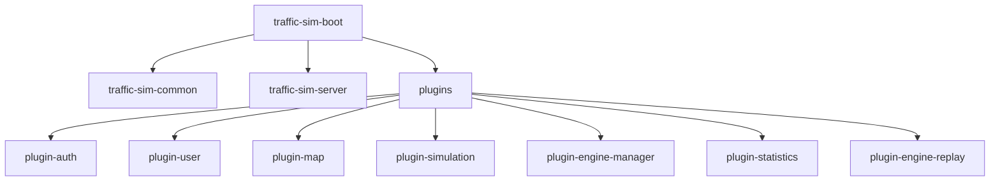
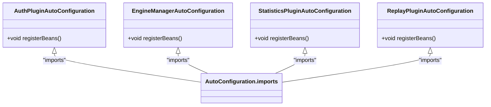

# 技术栈与依赖

<cite>
**本文档中引用的文件**  
- [pom.xml](file://pom.xml)
- [traffic-sim-server/pom.xml](file://traffic-sim-server/pom.xml)
- [traffic-sim-common/pom.xml](file://traffic-sim-common/pom.xml)
- [plugins/pom.xml](file://plugins/pom.xml)
- [plugins/plugin-auth/pom.xml](file://plugins/plugin-auth/pom.xml)
- [plugins/plugin-map/pom.xml](file://plugins/plugin-map/pom.xml)
- [plugins/plugin-simulation/pom.xml](file://plugins/plugin-simulation/pom.xml)
- [plugins/plugin-engine-manager/pom.xml](file://plugins/plugin-engine-manager/pom.xml)
- [traffic-sim-server/src/main/resources/application.yml](file://traffic-sim-server/src/main/resources/application.yml)
- [traffic-sim-server/src/main/java/com/traffic/sim/TrafficSimApplication.java](file://traffic-sim-server/src/main/java/com/traffic/sim/TrafficSimApplication.java)
- [plugins/plugin-auth/src/main/resources/META-INF/spring/org.springframework.boot.autoconfigure.AutoConfiguration.imports](file://plugins/plugin-auth/src/main/resources/META-INF/spring/org.springframework.boot.autoconfigure.AutoConfiguration.imports)
- [plugins/plugin-engine-manager/src/main/resources/META-INF/spring/org.springframework.boot.autoconfigure.AutoConfiguration.imports](file://plugins/plugin-engine-manager/src/main/resources/META-INF/spring/org.springframework.boot.autoconfigure.AutoConfiguration.imports)
- [plugins/plugin-statistics/src/main/resources/META-INF/spring/org.springframework.boot.autoconfigure.AutoConfiguration.imports](file://plugins/plugin-statistics/src/main/resources/META-INF/spring/org.springframework.boot.autoconfigure.AutoConfiguration.imports)
- [plugins/plugin-engine-replay/src/main/resources/META-INF/spring/org.springframework.boot.autoconfigure.AutoConfiguration.imports](file://plugins/plugin-engine-replay/src/main/resources/META-INF/spring/org.springframework.boot.autoconfigure.AutoConfiguration.imports)
</cite>

## 目录
1. [简介](#简介)
2. [核心技术栈](#核心技术栈)
3. [Maven构建与模块化架构](#maven构建与模块化架构)
4. [插件化架构实现机制](#插件化架构实现机制)
5. [外部基础设施依赖](#外部基础设施依赖)
6. [配置文件与应用入口](#配置文件与应用入口)

## 简介
本项目是一个基于Spring Boot 3.x的交通仿真系统，采用插件化架构设计，支持模块化扩展。系统通过RESTful API提供服务，使用多种数据存储技术，并通过gRPC与外部Python仿真服务通信。本文档详细说明项目的技术栈、依赖关系和架构设计。

## 核心技术栈

### Spring Boot 3.x生态系统
项目基于Spring Boot 3.2.0构建，充分利用了Spring生态系统的各项功能。核心依赖包括：

- **Spring Web**: 提供RESTful API支持，处理HTTP请求和响应
- **Spring Data JPA**: 实现MySQL数据库的持久化操作，简化数据访问层开发
- **Spring Data MongoDB**: 用于存储仿真日志等非结构化数据
- **Jackson**: 负责JSON序列化和反序列化，处理API数据交换
- **Lombok**: 减少样板代码，通过注解自动生成getter、setter、构造函数等
- **Swagger/OpenAPI**: 自动生成API文档，提供交互式接口测试界面

### gRPC通信
项目使用gRPC与Python编写的仿真引擎服务进行通信。关键依赖包括：
- `grpc-spring-boot-starter`: 简化gRPC在Spring Boot中的集成
- `protobuf-java`: 支持Protocol Buffers协议，定义服务接口和数据结构
- 在`plugin-simulation`模块中配置了protobuf-maven-plugin，用于编译`.proto`文件

**本节来源**
- [pom.xml](file://pom.xml#L11)
- [traffic-sim-server/pom.xml](file://traffic-sim-server/pom.xml#L27-L36)
- [plugins/plugin-simulation/pom.xml](file://plugins/plugin-simulation/pom.xml#L50-L67)

## Maven构建与模块化架构

### 项目模块结构
项目采用多模块Maven架构，包含以下主要模块：



**图示来源**
- [pom.xml](file://pom.xml#L22-L26)
- [plugins/pom.xml](file://plugins/pom.xml#L19-L27)

### 依赖管理机制
根`pom.xml`文件通过`<dependencyManagement>`集中管理所有依赖的版本，确保各模块使用统一的依赖版本。关键特性包括：

- **版本集中管理**: 在`<properties>`中定义Spring Boot、SpringDoc、gRPC等核心依赖的版本
- **BOM导入**: 使用`spring-boot-dependencies`作为依赖管理的BOM（Bill of Materials）
- **内部模块声明**: 在`<dependencyManagement>`中声明所有内部模块，供其他模块引用

**本节来源**
- [pom.xml](file://pom.xml#L28-L135)

## 插件化架构实现机制

### 插件自动注册原理
项目通过Spring Boot的自动配置机制实现插件的自动注册。每个插件模块包含一个`META-INF/spring/org.springframework.boot.autoconfigure.AutoConfiguration.imports`文件，该文件指定插件的自动配置类：



**图示来源**
- [plugins/plugin-auth/src/main/resources/META-INF/spring/org.springframework.boot.autoconfigure.AutoConfiguration.imports](file://plugins/plugin-auth/src/main/resources/META-INF/spring/org.springframework.boot.autoconfigure.AutoConfiguration.imports#L1)
- [plugins/plugin-engine-manager/src/main/resources/META-INF/spring/org.springframework.boot.autoconfigure.AutoConfiguration.imports](file://plugins/plugin-engine-manager/src/main/resources/META-INF/spring/org.springframework.boot.autoconfigure.AutoConfiguration.imports#L1)
- [plugins/plugin-statistics/src/main/resources/META-INF/spring/org.springframework.boot.autoconfigure.AutoConfiguration.imports](file://plugins/plugin-statistics/src/main/resources/META-INF/spring/org.springframework.boot.autoconfigure.AutoConfiguration.imports#L1)
- [plugins/plugin-engine-replay/src/main/resources/META-INF/spring/org.springframework.boot.autoconfigure.AutoConfiguration.imports](file://plugins/plugin-engine-replay/src/main/resources/META-INF/spring/org.springframework.boot.autoconfigure.AutoConfiguration.imports#L1)

### 主应用上下文扫描
主应用`TrafficSimApplication`通过`@ComponentScan`注解扫描基础包，确保插件模块中的Bean能够被自动发现和注册：

```java
@ComponentScan(basePackages = {
    "com.traffic.sim",
    "com.traffic.sim.plugin"
})
```

当`traffic-sim-server`模块依赖插件模块时，插件中的配置类和组件会被自动加载到Spring应用上下文中。

**本节来源**
- [traffic-sim-server/src/main/java/com/traffic/sim/TrafficSimApplication.java](file://traffic-sim-server/src/main/java/com/traffic/sim/TrafficSimApplication.java#L17-L20)

## 外部基础设施依赖

### 数据库系统
项目依赖以下数据库系统：

- **MySQL 8.0+**: 作为主关系型数据库，存储用户、地图、仿真任务等结构化数据
  - 配置文件: `application.yml`中的`spring.datasource`配置
  - 使用`com.mysql.cj.jdbc.Driver`驱动
  - 采用HikariCP连接池

- **MongoDB 7.0**: 用于存储仿真日志等非结构化数据
  - 配置文件: `application.yml`中的`spring.data.mongodb`配置
  - 使用URI方式连接，包含认证信息

- **Redis 7.2**: 用于缓存验证码等临时数据
  - 虽然在配置文件中未直接体现，但根据项目需求，Redis用于验证码缓存场景

**本节来源**
- [traffic-sim-server/src/main/resources/application.yml](file://traffic-sim-server/src/main/resources/application.yml#L6-L40)

## 配置文件与应用入口

### 主配置文件
`application.yml`文件包含系统的核心配置：

- **服务器配置**: 端口8080，上下文路径`/api`
- **数据源配置**: MySQL和MongoDB的连接信息
- **JPA配置**: 使用MySQL8Dialect，DDL模式为update
- **gRPC客户端配置**: 连接到Python服务的`localhost:50051`
- **SpringDoc配置**: API文档路径为`/swagger-ui.html`

### 应用启动流程
`TrafficSimApplication`是系统的主启动类，其启动流程包括：

1. 执行`SpringApplication.run()`启动Spring Boot应用
2. 扫描`com.traffic.sim`和`com.traffic.sim.plugin`包下的组件
3. 加载所有插件模块的自动配置
4. 初始化gRPC客户端连接
5. 启动成功后输出日志信息

如果gRPC服务初始化失败，应用会给出明确的警告提示，建议检查Python服务状态或禁用gRPC客户端。

**本节来源**
- [traffic-sim-server/src/main/resources/application.yml](file://traffic-sim-server/src/main/resources/application.yml)
- [traffic-sim-server/src/main/java/com/traffic/sim/TrafficSimApplication.java](file://traffic-sim-server/src/main/java/com/traffic/sim/TrafficSimApplication.java)