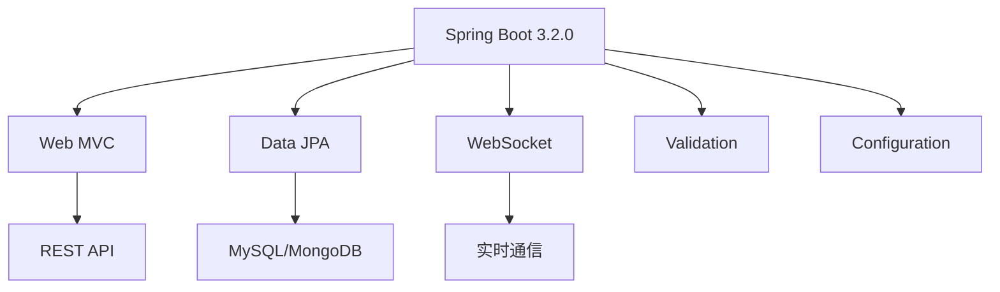
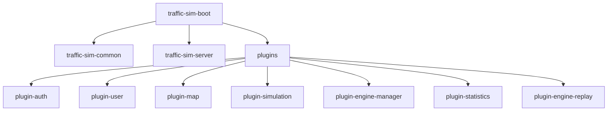
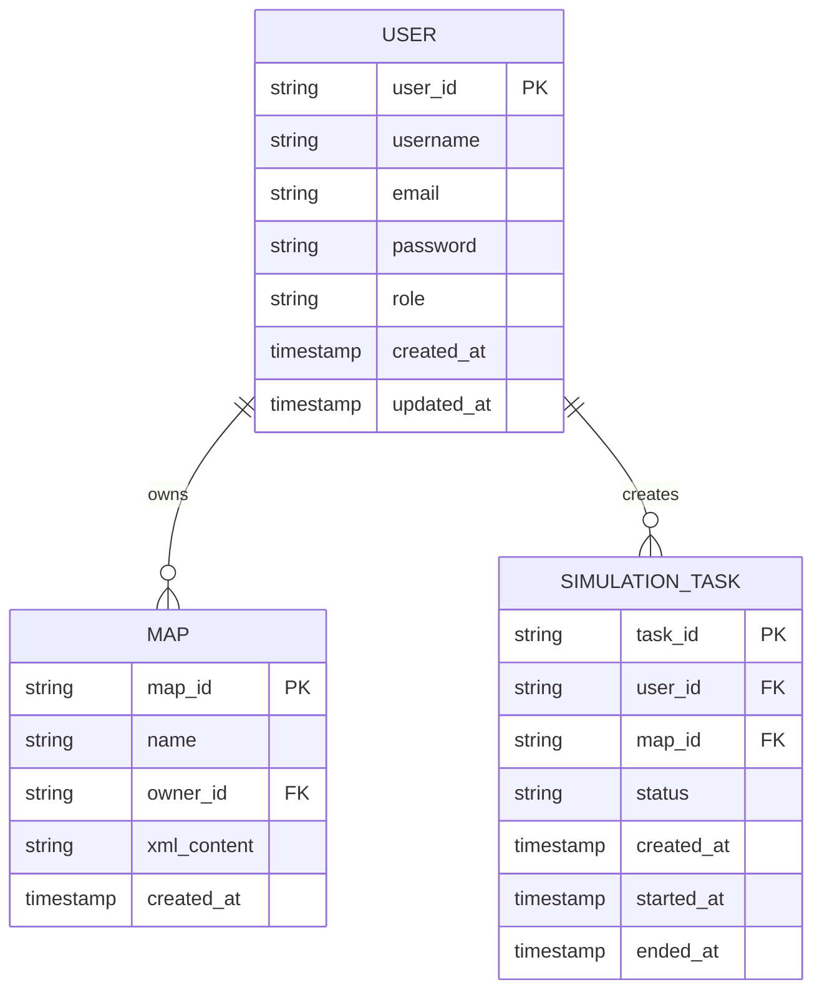
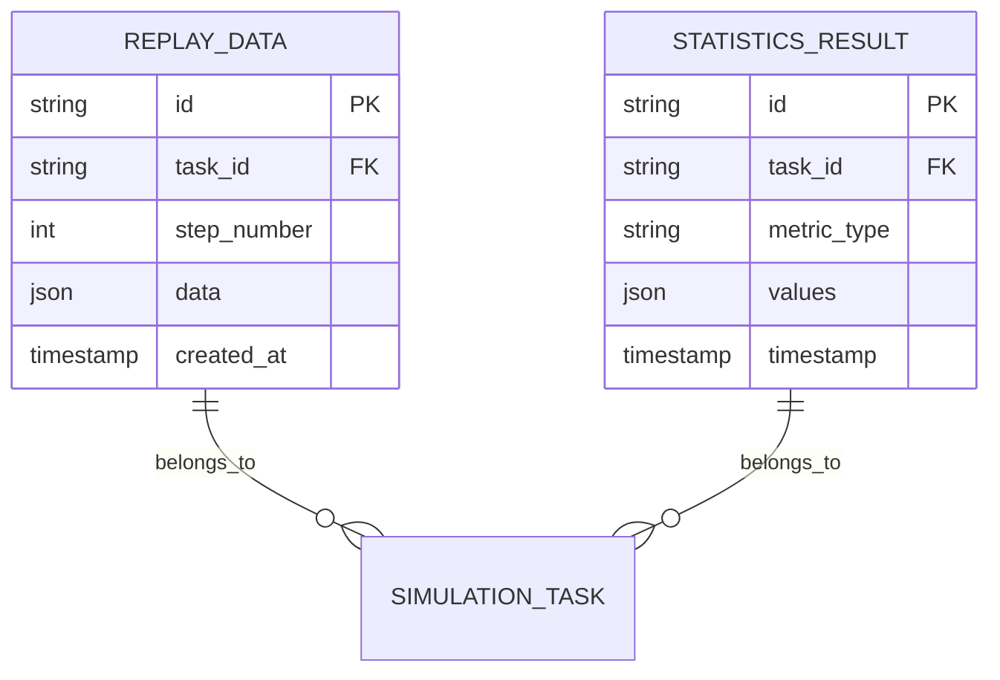
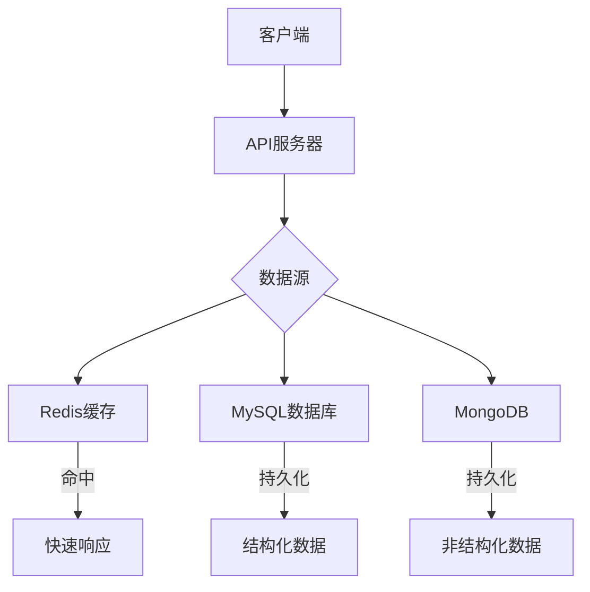
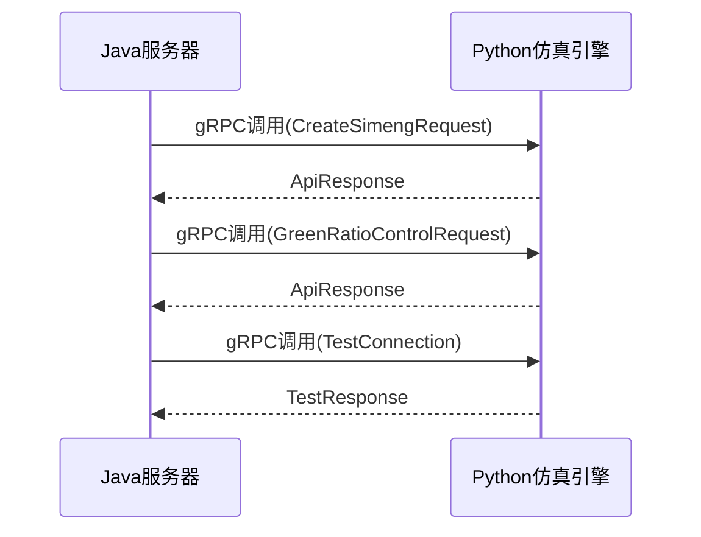
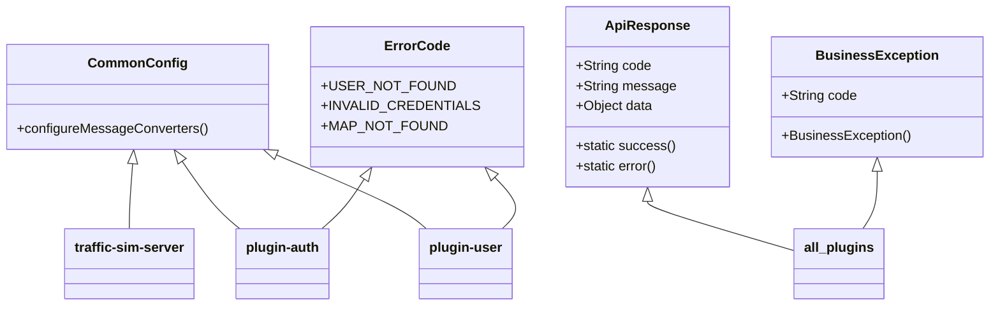
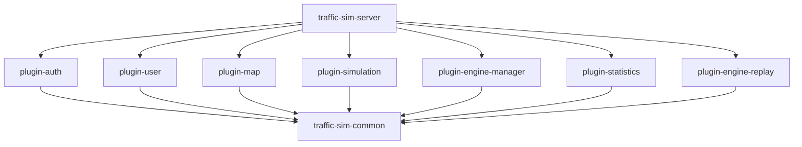
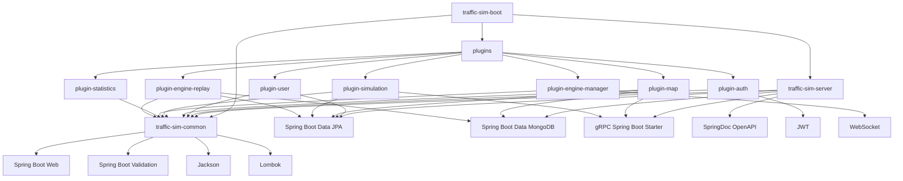
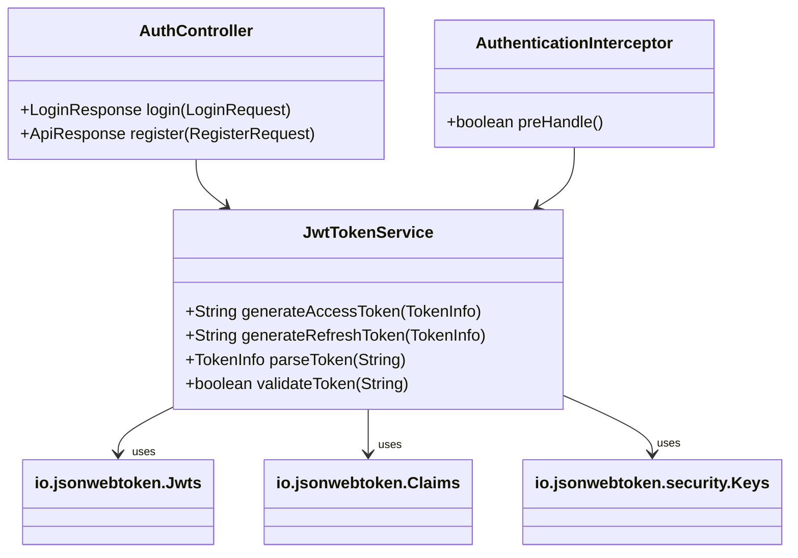

# 技术栈与依赖

<cite>
**本文档引用的文件**  
- [pom.xml](file://pom.xml)
- [traffic-sim-server/pom.xml](file://traffic-sim-server/pom.xml)
- [traffic-sim-common/pom.xml](file://traffic-sim-common/pom.xml)
- [plugins/pom.xml](file://plugins/pom.xml)
- [plugins/plugin-auth/pom.xml](file://plugins/plugin-auth/pom.xml)
- [plugins/plugin-user/pom.xml](file://plugins/plugin-user/pom.xml)
- [plugins/plugin-map/pom.xml](file://plugins/plugin-map/pom.xml)
- [plugins/plugin-simulation/pom.xml](file://plugins/plugin-simulation/pom.xml)
- [plugins/plugin-engine-manager/pom.xml](file://plugins/plugin-engine-manager/pom.xml)
- [plugins/plugin-statistics/pom.xml](file://plugins/plugin-statistics/pom.xml)
- [plugins/plugin-engine-replay/pom.xml](file://plugins/plugin-engine-replay/pom.xml)
- [traffic-sim-server/src/main/java/com/traffic/sim/TrafficSimApplication.java](file://traffic-sim-server/src/main/java/com/traffic/sim/TrafficSimApplication.java)
- [traffic-sim-server/src/main/resources/application.yml](file://traffic-sim-server/src/main/resources/application.yml)
- [plugins/plugin-auth/src/main/java/com/traffic/sim/plugin/auth/service/JwtTokenService.java](file://plugins/plugin-auth/src/main/java/com/traffic/sim/plugin/auth/service/JwtTokenService.java)
- [plugins/plugin-auth/src/main/java/com/traffic/sim/plugin/auth/config/AuthPluginAutoConfiguration.java](file://plugins/plugin-auth/src/main/java/com/traffic/sim/plugin/auth/config/AuthPluginAutoConfiguration.java)
- [plugins/plugin-map/src/main/java/com/traffic/sim/plugin/map/client/MapPythonGrpcClient.java](file://plugins/plugin-map/src/main/java/com/traffic/sim/plugin/map/client/MapPythonGrpcClient.java)
- [plugins/plugin-simulation/src/main/proto/python_service.proto](file://plugins/plugin-simulation/src/main/proto/python_service.proto)
</cite>

## 目录
1. [技术栈概览](#技术栈概览)
2. [核心框架与构建工具](#核心框架与构建工具)
3. [持久化技术](#持久化技术)
4. [缓存与通信](#缓存与通信)
5. [项目模块结构](#项目模块结构)
6. [依赖关系分析](#依赖关系分析)
7. [版本兼容性与升级路径](#版本兼容性与升级路径)
8. [第三方库选型理由](#第三方库选型理由)

## 技术栈概览

traffic_sim_pib项目采用基于Spring Boot 3.x的微服务架构，通过Maven进行依赖管理和构建。系统集成了多种持久化技术（MySQL、MongoDB）、缓存系统（Redis）和通信协议（gRPC），形成了一个功能完整、可扩展的交通仿真平台。项目采用插件化架构设计，通过模块化方式组织代码，提高了系统的可维护性和可扩展性。

**文档来源**
- [pom.xml](file://pom.xml)
- [traffic-sim-server/pom.xml](file://traffic-sim-server/pom.xml)

## 核心框架与构建工具

### Spring Boot 3.x框架

项目基于Spring Boot 3.2.0构建，利用其自动配置、起步依赖和嵌入式服务器等特性，简化了应用的开发和部署。Spring Boot作为核心框架，提供了Web MVC、数据访问、安全控制等基础功能。



**图示来源**
- [pom.xml](file://pom.xml#L8-L13)
- [traffic-sim-server/pom.xml](file://traffic-sim-server/pom.xml#L26-L36)

### Maven构建系统

项目采用Maven作为构建工具，通过多模块POM结构管理复杂的依赖关系。主POM文件定义了项目整体结构和依赖管理，确保各模块使用统一的版本。



**图示来源**
- [pom.xml](file://pom.xml#L22-L26)
- [plugins/pom.xml](file://plugins/pom.xml#L19-L27)

**文档来源**
- [pom.xml](file://pom.xml)
- [traffic-sim-server/pom.xml](file://traffic-sim-server/pom.xml)

## 持久化技术

### MySQL关系型数据库

项目使用MySQL作为主要的关系型数据库，存储用户信息、权限配置、仿真任务等结构化数据。通过Spring Data JPA实现数据访问，简化了数据库操作。



**图示来源**
- [traffic-sim-server/pom.xml](file://traffic-sim-server/pom.xml#L44-L48)
- [plugins/plugin-user/pom.xml](file://plugins/plugin-user/pom.xml#L26-L30)
- [traffic-sim-server/src/main/resources/application.yml](file://traffic-sim-server/src/main/resources/application.yml#L5-L17)

### MongoDB文档数据库

MongoDB用于存储仿真过程中的非结构化或半结构化数据，如仿真日志、统计结果等。这种混合持久化策略充分发挥了不同类型数据库的优势。



**图示来源**
- [traffic-sim-server/pom.xml](file://traffic-sim-server/pom.xml#L50-L54)
- [plugins/plugin-engine-replay/pom.xml](file://plugins/plugin-engine-replay/pom.xml#L32-L36)
- [traffic-sim-server/src/main/resources/application.yml](file://traffic-sim-server/src/main/resources/application.yml#L28-L40)

**文档来源**
- [traffic-sim-server/pom.xml](file://traffic-sim-server/pom.xml)
- [traffic-sim-server/src/main/resources/application.yml](file://traffic-sim-server/src/main/resources/application.yml)

## 缓存与通信

### Redis缓存系统

虽然项目配置中未直接显示Redis依赖，但基础设施目录包含Redis配置文件，表明系统设计中考虑了缓存机制。Redis可用于缓存用户会话、认证令牌和频繁访问的数据，提高系统性能。



**图示来源**
- [infrastructure/redis/redis.conf](file://infrastructure/redis/redis.conf)

### gRPC通信协议

项目采用gRPC作为微服务间的主要通信协议，特别是在Java后端与Python仿真引擎之间的通信。通过Protocol Buffers定义服务接口，实现了高效、类型安全的远程调用。



**图示来源**
- [plugins/plugin-simulation/pom.xml](file://plugins/plugin-simulation/pom.xml#L50-L54)
- [plugins/plugin-simulation/src/main/proto/python_service.proto](file://plugins/plugin-simulation/src/main/proto/python_service.proto)
- [traffic-sim-server/src/main/resources/application.yml](file://traffic-sim-server/src/main/resources/application.yml#L68-L81)

**文档来源**
- [plugins/plugin-simulation/pom.xml](file://plugins/plugin-simulation/pom.xml)
- [plugins/plugin-simulation/src/main/proto/python_service.proto](file://plugins/plugin-simulation/src/main/proto/python_service.proto)

## 项目模块结构

### 共享模块(traffic-sim-common)

`traffic-sim-common`模块作为所有插件和主应用的共享基础，包含通用的数据传输对象(DTO)、异常处理、常量定义和工具类。这种设计避免了代码重复，确保了各模块间的数据一致性。



**图示来源**
- [traffic-sim-common/pom.xml](file://traffic-sim-common/pom.xml)
- [traffic-sim-common/src/main/java/com/traffic/sim/common/](file://traffic-sim-common/src/main/java/com/traffic/sim/common/)

### 插件模块架构

项目采用插件化架构，各功能模块独立开发、测试和部署，通过Maven依赖集成到主应用中。这种设计提高了系统的可维护性和可扩展性。



**图示来源**
- [traffic-sim-server/pom.xml](file://traffic-sim-server/pom.xml#L82-L110)
- [plugins/pom.xml](file://plugins/pom.xml)

**文档来源**
- [traffic-sim-server/pom.xml](file://traffic-sim-server/pom.xml)
- [plugins/pom.xml](file://plugins/pom.xml)

## 依赖关系分析

### 依赖树状图



**图示来源**
- [pom.xml](file://pom.xml)
- [traffic-sim-server/pom.xml](file://traffic-sim-server/pom.xml)
- [traffic-sim-common/pom.xml](file://traffic-sim-common/pom.xml)
- [plugins/pom.xml](file://plugins/pom.xml)

### 认证模块中的JWT依赖

在`plugin-auth`模块中，`jjwt-api`、`jjwt-impl`和`jjwt-jackson`三个JWT相关库被用于实现基于令牌的认证机制。`jjwt-api`定义了JWT的核心接口，`jjwt-impl`提供了具体实现，`jjwt-jackson`则用于JSON序列化。



**图示来源**
- [plugins/plugin-auth/pom.xml](file://plugins/plugin-auth/pom.xml#L37-L51)
- [plugins/plugin-auth/src/main/java/com/traffic/sim/plugin/auth/service/JwtTokenService.java](file://plugins/plugin-auth/src/main/java/com/traffic/sim/plugin/auth/service/JwtTokenService.java)
- [plugins/plugin-auth/src/main/java/com/traffic/sim/plugin/auth/config/AuthPluginAutoConfiguration.java](file://plugins/plugin-auth/src/main/java/com/traffic/sim/plugin/auth/config/AuthPluginAutoConfiguration.java)

**文档来源**
- [plugins/plugin-auth/pom.xml](file://plugins/plugin-auth/pom.xml)
- [plugins/plugin-auth/src/main/java/com/traffic/sim/plugin/auth/service/JwtTokenService.java](file://plugins/plugin-auth/src/main/java/com/traffic/sim/plugin/auth/service/JwtTokenService.java)

## 版本兼容性与升级路径

### 当前版本状态

项目当前使用的技术栈版本经过精心选择，确保了良好的兼容性：
- Spring Boot 3.2.0：基于Spring Framework 6，支持Java 17+
- gRPC 1.60.0：与Spring Boot 3.x兼容的稳定版本
- JWT 0.12.3：支持现代加密算法的最新版本
- Protocol Buffers 3.25.1：与gRPC 1.60.0匹配的版本

### 未来升级路径

建议的升级路径应遵循以下原则：
1. **Spring Boot升级**：可平稳升级至Spring Boot 3.3.x系列，需注意Java版本要求
2. **gRPC升级**：可升级至gRPC 1.62.x系列，需同步更新Protocol Buffers版本
3. **安全库升级**：定期更新JWT库以获取最新的安全补丁
4. **数据库驱动**：保持MySQL和MongoDB驱动为最新稳定版本

```mermaid
graph LR
A[当前版本] --> B[短期升级]
A --> C[中期升级]
A --> D[长期规划]
B --> E[Spring Boot 3.3.x]
B --> F[gRPC 1.62.x]
B --> G[JWT 0.13.x]
C --> H[Spring Boot 4.0(预估)]
C --> I[Java 21 LTS]
C --> J[Redis 7.x]
D --> K[云原生架构]
D --> L[服务网格]
D --> M[AI集成]
```

**文档来源**
- [pom.xml](file://pom.xml)
- [traffic-sim-server/pom.xml](file://traffic-sim-server/pom.xml)

## 第三方库选型理由

### 核心依赖选型

| 库名称 | 选型理由 | 使用场景 |
|--------|----------|----------|
| **Spring Boot** | 提供全面的企业级Java开发解决方案，简化配置和部署 | 核心框架，提供Web、数据访问、安全等功能 |
| **gRPC** | 高性能、跨语言的RPC框架，适合微服务间通信 | Java后端与Python仿真引擎的通信 |
| **JWT** | 行业标准的无状态认证方案，易于实现和维护 | 用户认证和授权，令牌生成与验证 |
| **Lombok** | 减少样板代码，提高开发效率 | 自动生成getter、setter、构造函数等 |
| **SpringDoc** | 基于OpenAPI 3的现代化API文档工具 | 自动生成REST API文档，集成Swagger UI |

### 数据持久化选型

| 技术 | 选型理由 | 使用场景 |
|------|----------|----------|
| **MySQL** | 成熟的关系型数据库，支持复杂查询和事务 | 存储用户、权限、地图等结构化数据 |
| **MongoDB** | 灵活的文档数据库，适合存储半结构化数据 | 存储仿真日志、统计结果等非结构化数据 |
| **Redis** | 高性能内存数据库，支持多种数据结构 | 计划用于缓存用户会话和频繁访问的数据 |

**文档来源**
- [pom.xml](file://pom.xml)
- [traffic-sim-server/pom.xml](file://traffic-sim-server/pom.xml)
- [plugins/plugin-auth/pom.xml](file://plugins/plugin-auth/pom.xml)