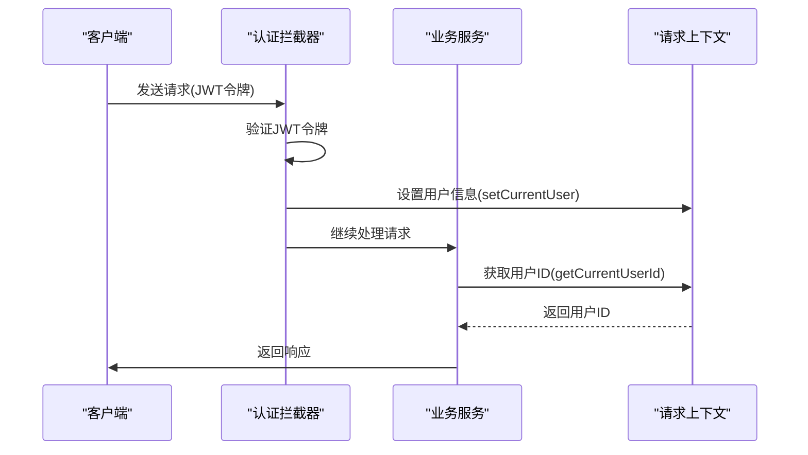
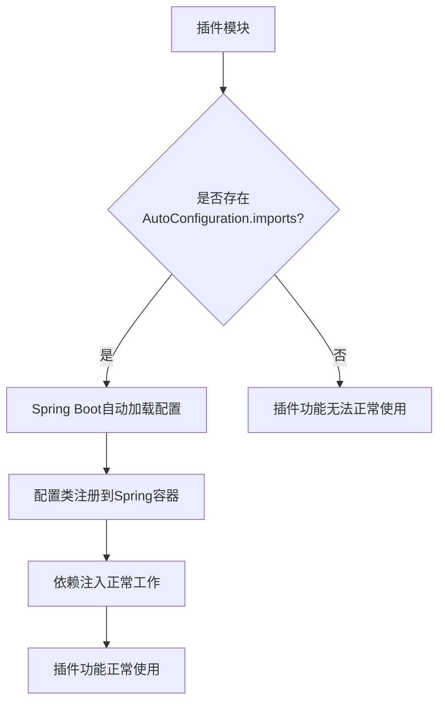
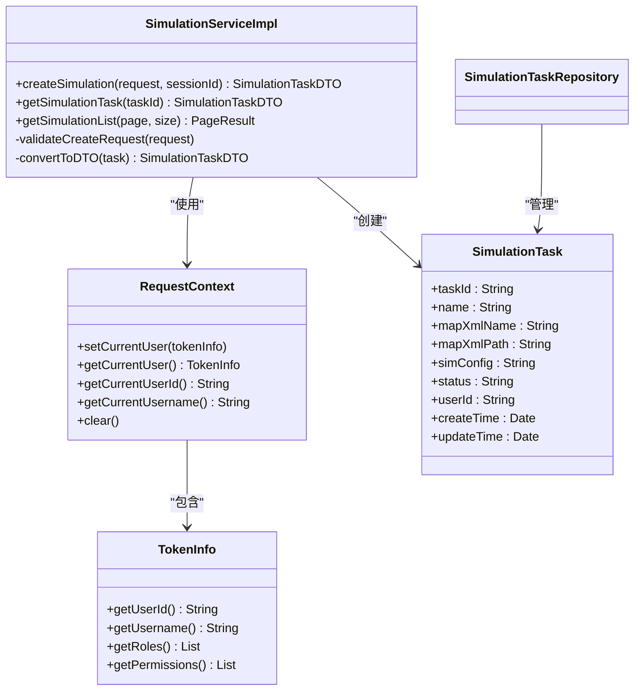

# 仿真任务问题

<cite>
**本文档引用文件**  
- [SimulationServiceImpl.java](file://plugins/plugin-simulation/src/main/java/com/traffic/sim/plugin/simulation/service/SimulationServiceImpl.java)
- [SimulationController.java](file://plugins/plugin-simulation/src/main/java/com/traffic/sim/plugin/simulation/controller/SimulationController.java)
- [SimulationTask.java](file://plugins/plugin-simulation/src/main/java/com/traffic/sim/plugin/simulation/entity/SimulationTask.java)
- [RequestContext.java](file://plugins/plugin-auth/src/main/java/com/traffic/sim/plugin/auth/util/RequestContext.java)
- [AuthPluginAutoConfiguration.java](file://plugins/plugin-auth/src/main/java/com/traffic/sim/plugin/auth/config/AuthPluginAutoConfiguration.java)
- [org.springframework.boot.autoconfigure.AutoConfiguration.imports](file://plugins/plugin-auth/src/main/resources/META-INF/spring/org.springframework.boot.autoconfigure.AutoConfiguration.imports)
- [plugin-simulation-Issue.md](file://plugins/plugin-simulation/plugin-simulation-Issue.md)
- [pom.xml](file://plugins/plugin-simulation/pom.xml)
</cite>

## 目录
1. [问题概述](#问题概述)
2. [userId获取问题分析](#userid获取问题分析)
3. [AutoConfiguration配置缺失问题](#autoconfiguration配置缺失问题)
4. [完整解决方案](#完整解决方案)
5. [测试验证步骤](#测试验证步骤)
6. [总结](#总结)

## 问题概述

`plugin-simulation` 模块存在两个关键问题：一是用户ID获取方式不完善，当前使用sessionId作为临时方案；二是缺少AutoConfiguration配置文件，影响插件的自动加载。本文档将详细分析这两个问题并提供完整的解决方案。

**Section sources**
- [plugin-simulation-Issue.md](file://plugins/plugin-simulation/plugin-simulation-Issue.md#L1-L99)

## userId获取问题分析

在`SimulationServiceImpl`类中，创建仿真任务时的用户ID获取方式存在严重缺陷。当前实现使用sessionId作为临时方案，这会导致用户数据关联错误和安全风险。

### 当前实现的问题

当前代码在`createSimulation`方法中使用以下方式获取用户ID：

```java
// TODO: 从请求上下文获取userId，当前使用sessionId作为临时方案
// 实际应该从RequestContext.getCurrentUserId()获取
try {
    task.setUserId(Long.parseLong(sessionId));
} catch (NumberFormatException e) {
    // 如果sessionId不是数字，使用hashCode作为临时userId
    // 实际应该从认证上下文获取
    task.setUserId((long) sessionId.hashCode());
}
```

这种实现方式存在以下问题：
1. **数据准确性问题**：sessionId不是用户ID，可能导致不同用户的数据混淆
2. **安全风险**：使用sessionId的hashCode作为用户ID存在碰撞风险
3. **类型不匹配**：用户ID应为字符串类型，而非长整型
4. **临时方案长期存在**：代码中的TODO注释表明这是临时方案，但一直未修复

### 认证上下文机制

系统提供了`RequestContext`工具类来管理认证上下文，其中包含获取当前用户ID的正确方法：

```java
public class RequestContext {
    private static final ThreadLocal<TokenInfo> USER_CONTEXT = new ThreadLocal<>();
    
    /**
     * 获取当前用户ID
     */
    public static String getCurrentUserId() {
        TokenInfo tokenInfo = getCurrentUser();
        return tokenInfo != null ? tokenInfo.getUserId() : null;
    }
}
```

该机制通过ThreadLocal存储当前请求的用户信息，在认证拦截器中设置，在业务逻辑中获取，确保了线程安全和数据准确性。



**Diagram sources**
- [RequestContext.java](file://plugins/plugin-auth/src/main/java/com/traffic/sim/plugin/auth/util/RequestContext.java#L11-L53)
- [AuthPluginAutoConfiguration.java](file://plugins/plugin-auth/src/main/java/com/traffic/sim/plugin/auth/config/AuthPluginAutoConfiguration.java#L16-L48)

**Section sources**
- [SimulationServiceImpl.java](file://plugins/plugin-simulation/src/main/java/com/traffic/sim/plugin/simulation/service/SimulationServiceImpl.java#L44-L84)
- [RequestContext.java](file://plugins/plugin-auth/src/main/java/com/traffic/sim/plugin/auth/util/RequestContext.java#L11-L53)

## AutoConfiguration配置缺失问题

`plugin-simulation`模块缺少Spring Boot的自动配置文件，这会影响插件的自动加载和配置。

### Spring Boot自动配置机制

Spring Boot 2.4+版本引入了新的自动配置导入机制，通过`META-INF/spring/org.springframework.boot.autoconfigure.AutoConfiguration.imports`文件来声明自动配置类。与旧版本的`spring.factories`不同，新机制更加简洁和明确。

### 其他插件的实现示例

其他插件模块已经正确实现了自动配置机制：

```text
com.traffic.sim.plugin.auth.config.AuthPluginAutoConfiguration
```

```text
com.traffic.sim.plugin.engine.manager.config.EngineManagerAutoConfiguration
```

```text
com.traffic.sim.plugin.statistics.config.StatisticsPluginAutoConfiguration
```

这些文件位于各自插件的`src/main/resources/META-INF/spring/`目录下，指定了相应的自动配置类。

### 缺失的影响

缺少自动配置文件会导致以下问题：
1. **插件无法自动加载**：Spring Boot无法识别和加载该插件的配置
2. **配置类不生效**：即使存在配置类，也不会被自动注册到Spring容器
3. **依赖注入失败**：其他模块无法正确依赖和使用该插件的功能
4. **启动异常**：在严格模式下可能导致应用启动失败



**Diagram sources**
- [org.springframework.boot.autoconfigure.AutoConfiguration.imports](file://plugins/plugin-auth/src/main/resources/META-INF/spring/org.springframework.boot.autoconfigure.AutoConfiguration.imports#L1-L3)
- [AuthPluginAutoConfiguration.java](file://plugins/plugin-auth/src/main/java/com/traffic/sim/plugin/auth/config/AuthPluginAutoConfiguration.java#L16-L48)

**Section sources**
- [org.springframework.boot.autoconfigure.AutoConfiguration.imports](file://plugins/plugin-auth/src/main/resources/META-INF/spring/org.springframework.boot.autoconfigure.AutoConfiguration.imports#L1-L3)
- [pom.xml](file://plugins/plugin-simulation/pom.xml#L1-L124)

## 完整解决方案

针对上述两个问题，提供完整的解决方案和实现步骤。

### 问题1：userId获取方式修复

修改`SimulationServiceImpl.createSimulation`方法，使用`RequestContext.getCurrentUserId()`获取真实的用户ID：

```java
@Override
@Transactional
public SimulationTaskDTO createSimulation(CreateSimulationRequest request, String sessionId) {
    log.info("Creating simulation task: name={}, sessionId={}", request.getName(), sessionId);
    
    // 1. 验证请求参数
    validateCreateRequest(request);
    
    // 2. 生成任务ID
    String taskId = UUID.randomUUID().toString().replace("-", "");
    
    // 3. 调用Python服务创建仿真引擎（支持容错，gRPC不可用时使用兜底数据）
    ApiResponse response = simulationPythonGrpcClient.createSimeng(request, sessionId);
    
    // 检查响应，如果是兜底响应（包含gRPC不可用提示），记录警告但继续执行
    if (response.getMsg() != null && response.getMsg().contains("gRPC unavailable")) {
        log.warn("gRPC service unavailable, using fallback response. Message: {}", response.getMsg());
        // 继续执行，但记录警告
    } else if (!ErrorCode.ERR_OK.equals(response.getRes())) {
        // 如果是真正的错误响应，抛出异常
        throw new BusinessException(response.getRes(), 
            "Failed to create simulation engine: " + response.getMsg());
    }
    
    // 4. 保存仿真任务记录
    SimulationTask task = new SimulationTask();
    task.setTaskId(taskId);
    task.setName(request.getName());
    task.setMapXmlName(request.getSimInfo() != null ? request.getSimInfo().getMapXmlName() : null);
    task.setMapXmlPath(request.getSimInfo() != null ? request.getSimInfo().getMapXmlPath() : null);
    task.setSimConfig(JsonUtils.toJson(request));
    task.setStatus("CREATED");
    
    // 修复：从请求上下文获取真实的用户ID
    String userId = RequestContext.getCurrentUserId();
    if (userId == null) {
        throw new BusinessException(ErrorCode.ERR_AUTH, "User not authenticated");
    }
    task.setUserId(userId);
    
    task.setCreateTime(new Date());
    task.setUpdateTime(new Date());
    
    task = simulationTaskRepository.save(task);
    
    // 5. 转换为DTO并返回
    return convertToDTO(task);
}
```

### 问题2：创建AutoConfiguration配置文件

1. 创建目录结构：
```
mkdir -p plugins/plugin-simulation/src/main/resources/META-INF/spring/
```

2. 创建自动配置文件：
```text
# plugins/plugin-simulation/src/main/resources/META-INF/spring/org.springframework.boot.autoconfigure.AutoConfiguration.imports

com.traffic.sim.plugin.simulation.config.SimulationPluginAutoConfiguration
```

3. 创建自动配置类（如果不存在）：
```java
@AutoConfiguration
@EnableConfigurationProperties(SimulationPluginProperties.class)
@RequiredArgsConstructor
public class SimulationPluginAutoConfiguration {
    // 配置类内容
}
```

### 依赖关系说明

确保`pom.xml`中包含必要的依赖：

```xml
<dependencies>
    <!-- Common Module -->
    <dependency>
        <groupId>com.traffic.sim</groupId>
        <artifactId>traffic-sim-common</artifactId>
    </dependency>

    <!-- Spring Boot Starters -->
    <dependency>
        <groupId>org.springframework.boot</groupId>
        <artifactId>spring-boot-starter-web</artifactId>
    </dependency>
    
    <dependency>
        <groupId>org.springframework.boot</groupId>
        <artifactId>spring-boot-starter-validation</artifactId>
    </dependency>

    <!-- Spring Boot Data JPA -->
    <dependency>
        <groupId>org.springframework.boot</groupId>
        <artifactId>spring-boot-starter-data-jpa</artifactId>
    </dependency>
</dependencies>
```



**Diagram sources**
- [SimulationServiceImpl.java](file://plugins/plugin-simulation/src/main/java/com/traffic/sim/plugin/simulation/service/SimulationServiceImpl.java#L34-L191)
- [RequestContext.java](file://plugins/plugin-auth/src/main/java/com/traffic/sim/plugin/auth/util/RequestContext.java#L11-L53)
- [SimulationTask.java](file://plugins/plugin-simulation/src/main/java/com/traffic/sim/plugin/simulation/entity/SimulationTask.java#L15-L51)

**Section sources**
- [SimulationServiceImpl.java](file://plugins/plugin-simulation/src/main/java/com/traffic/sim/plugin/simulation/service/SimulationServiceImpl.java#L44-L84)
- [org.springframework.boot.autoconfigure.AutoConfiguration.imports](file://plugins/plugin-auth/src/main/resources/META-INF/spring/org.springframework.boot.autoconfigure.AutoConfiguration.imports#L1-L3)

## 测试验证步骤

为确保问题已正确修复，执行以下测试验证步骤。

### 1. 单元测试

创建单元测试验证userId正确获取：

```java
@Test
public void testCreateSimulationWithValidUser() {
    // 设置测试上下文
    TokenInfo tokenInfo = new TokenInfo();
    tokenInfo.setUserId("user_123");
    tokenInfo.setUsername("testuser");
    RequestContext.setCurrentUser(tokenInfo);
    
    try {
        // 执行测试
        CreateSimulationRequest request = new CreateSimulationRequest();
        request.setName("Test Simulation");
        request.setSimInfo(new SimInfoDTO());
        
        SimulationTaskDTO result = simulationService.createSimulation(request, "session_456");
        
        // 验证结果
        assertNotNull(result);
        assertEquals("user_123", result.getUserId());
        
        // 验证数据库记录
        SimulationTask task = simulationTaskRepository.findById(result.getTaskId()).orElse(null);
        assertNotNull(task);
        assertEquals("user_123", task.getUserId());
    } finally {
        // 清理测试上下文
        RequestContext.clear();
    }
}

@Test
public void testCreateSimulationWithoutAuthentication() {
    // 不设置用户上下文
    
    CreateSimulationRequest request = new CreateSimulationRequest();
    request.setName("Test Simulation");
    request.setSimInfo(new SimInfoDTO());
    
    // 验证抛出认证异常
    BusinessException exception = assertThrows(BusinessException.class, () -> {
        simulationService.createSimulation(request, "session_456");
    });
    
    assertEquals(ErrorCode.ERR_AUTH, exception.getCode());
}
```

### 2. 集成测试

执行集成测试验证插件自动加载：

```bash
# 1. 构建项目
mvn clean install

# 2. 启动应用
java -jar traffic-sim-server.jar

# 3. 检查日志输出
grep "SimulationPluginAutoConfiguration" logs/application.log

# 4. 调用API验证功能
curl -X POST http://localhost:8080/api/simulation/create \
  -H "Content-Type: application/json" \
  -H "Authorization: Bearer ${JWT_TOKEN}" \
  -d '{
    "name": "Integration Test",
    "simInfo": {
      "name": "Integration Test",
      "mapXmlName": "test_map.xml",
      "mapXmlPath": "/maps/test_map.xml"
    }
  }'
```

### 3. 验证步骤清单

| 步骤 | 操作 | 预期结果 |
|------|------|----------|
| 1 | 检查自动配置文件 | `META-INF/spring/org.springframework.boot.autoconfigure.AutoConfiguration.imports`文件存在且内容正确 |
| 2 | 启动应用 | 应用正常启动，无配置加载错误 |
| 3 | 调用创建仿真API | 返回成功响应，任务创建成功 |
| 4 | 检查数据库记录 | `simulation_task`表中记录的`user_id`字段为真实的用户ID |
| 5 | 查询任务列表 | 能正确查询到当前用户创建的任务 |
| 6 | 异常情况测试 | 未认证用户调用API返回认证错误 |

**Section sources**
- [SimulationServiceImpl.java](file://plugins/plugin-simulation/src/main/java/com/traffic/sim/plugin/simulation/service/SimulationServiceImpl.java#L44-L84)
- [org.springframework.boot.autoconfigure.AutoConfiguration.imports](file://plugins/plugin-auth/src/main/resources/META-INF/spring/org.springframework.boot.autoconfigure.AutoConfiguration.imports#L1-L3)

## 总结

本文档详细分析了`plugin-simulation`模块中存在的两个关键问题，并提供了完整的解决方案。

### 主要问题总结

1. **userId获取问题**：
   - 当前使用sessionId作为临时方案，存在数据准确性和安全风险
   - 正确方案是使用`RequestContext.getCurrentUserId()`从认证上下文中获取真实的用户ID
   - 修复后能确保仿真任务正确关联到真实用户

2. **AutoConfiguration配置缺失**：
   - 缺少`META-INF/spring/org.springframework.boot.autoconfigure.AutoConfiguration.imports`文件
   - 导致插件无法自动加载和配置
   - 创建该文件并指定正确的配置类可解决此问题

### 实施建议

1. **优先级**：建议优先修复userId获取问题，因为这直接影响数据的准确性和系统的安全性
2. **测试覆盖**：确保有充分的单元测试和集成测试覆盖修复后的功能
3. **代码审查**：在合并修复代码前进行严格的代码审查
4. **文档更新**：更新相关文档，说明正确的用户ID获取方式

通过实施本文档提供的解决方案，可以确保仿真任务模块的稳定性和可靠性，为用户提供准确、安全的服务。

**Section sources**
- [plugin-simulation-Issue.md](file://plugins/plugin-simulation/plugin-simulation-Issue.md#L1-L99)
- [SimulationServiceImpl.java](file://plugins/plugin-simulation/src/main/java/com/traffic/sim/plugin/simulation/service/SimulationServiceImpl.java#L44-L84)