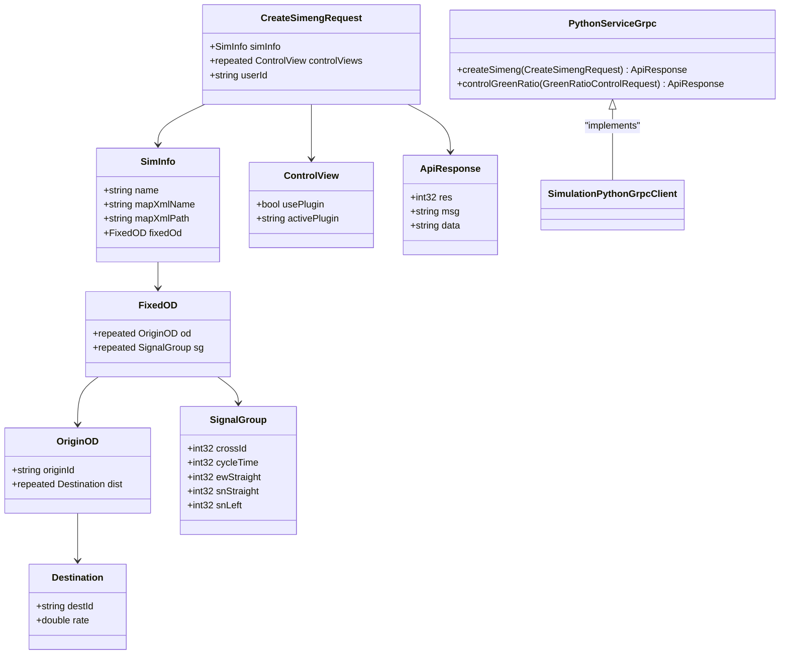
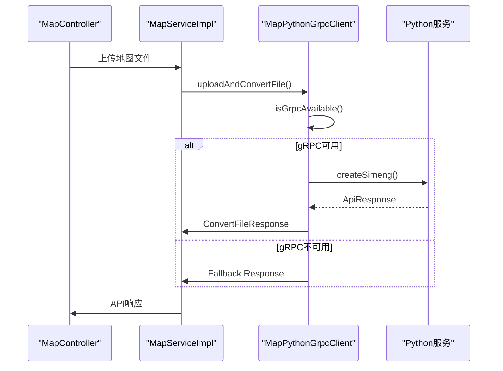
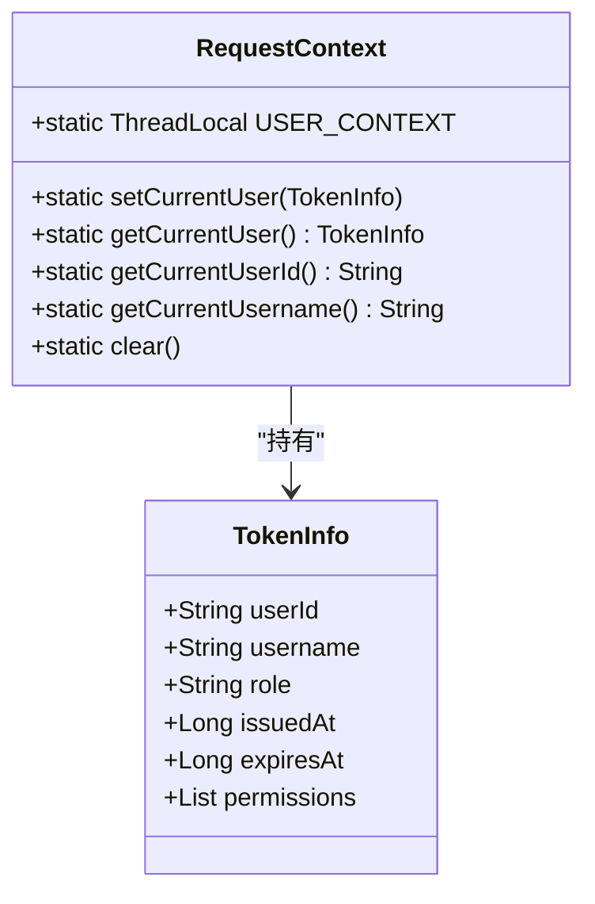
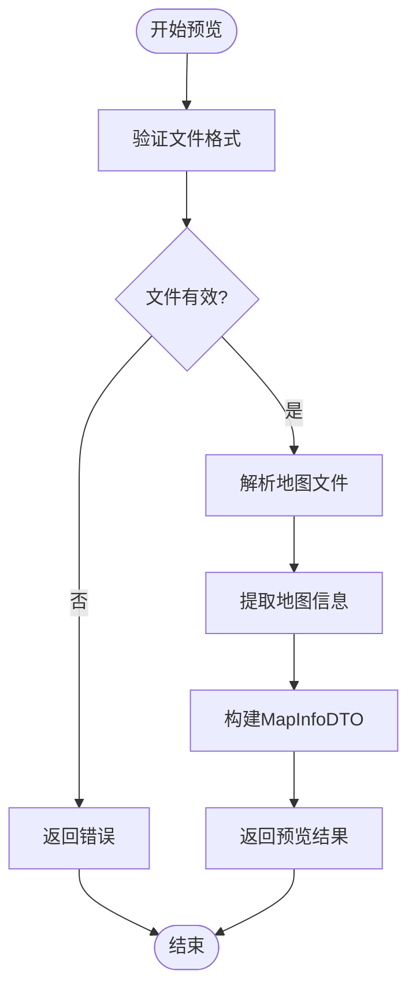
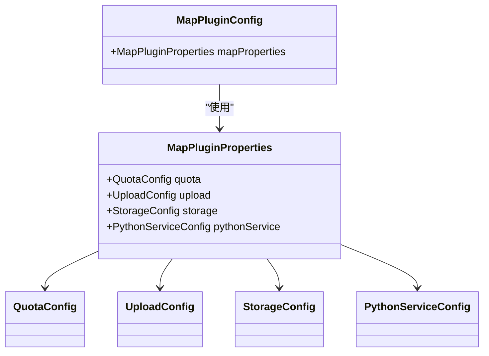
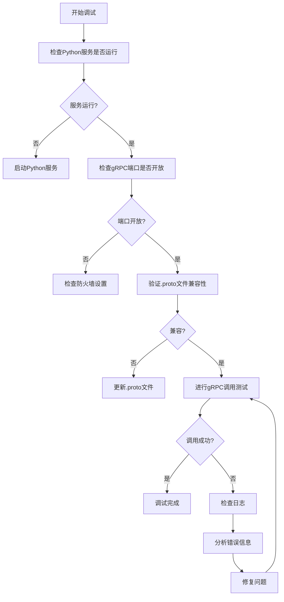

# 地图管理问题

<cite>
**本文档引用的文件**  
- [MapPythonGrpcClient.java](file://plugins/plugin-map/src/main/java/com/traffic/sim/plugin/map/client/MapPythonGrpcClient.java)
- [PythonGrpcClient.java](file://plugins/plugin-map/src/main/java/com/traffic/sim/plugin/map/client/PythonGrpcClient.java)
- [MapApiController.java](file://plugins/plugin-map/src/main/java/com/traffic/sim/plugin/map/controller/MapApiController.java)
- [MapServiceImpl.java](file://plugins/plugin-map/src/main/java/com/traffic/sim/plugin/map/service/MapServiceImpl.java)
- [MapPluginConfig.java](file://plugins/plugin-map/src/main/java/com/traffic/sim/plugin/map/config/MapPluginConfig.java)
- [MapPluginProperties.java](file://plugins/plugin-map/src/main/java/com/traffic/sim/plugin/map/config/MapPluginProperties.java)
- [RequestContext.java](file://plugins/plugin-auth/src/main/java/com/traffic/sim/plugin/auth/util/RequestContext.java)
- [plugin-map-Issue.md](file://plugins/plugin-map/plugin-map-Issue.md)
- [SimulationPythonGrpcClient.java](file://plugins/plugin-simulation/src/main/java/com/traffic/sim/plugin/simulation/grpc/SimulationPythonGrpcClient.java)
- [pom.xml](file://plugins/plugin-map/pom.xml)
</cite>

## 目录
1. [问题概述](#问题概述)
2. [gRPC客户端实现](#grpc客户端实现)
3. [管理员标识获取](#管理员标识获取)
4. [地图预览功能](#地图预览功能)
5. [AutoConfiguration配置](#autoconfiguration配置)
6. [调试技巧](#调试技巧)

## 问题概述

`plugin-map`模块存在多个关键问题，主要包括Python gRPC客户端未实现导致的地图转换失败、管理员标识获取未实现、地图预览功能缺失以及缺少AutoConfiguration配置等问题。这些问题影响了地图管理功能的完整性和可用性。

**Section sources**
- [plugin-map-Issue.md](file://plugins/plugin-map/plugin-map-Issue.md#L1-L197)

## gRPC客户端实现

### Protocol Buffers定义

根据`plugin-simulation`模块的实现，Python服务的gRPC接口定义在`python_service.proto`文件中。虽然该文件未在当前上下文中提供，但可以从`SimulationPythonGrpcClient`的实现推断出主要的接口定义。



**Diagram sources**
- [SimulationPythonGrpcClient.java](file://plugins/plugin-simulation/src/main/java/com/traffic/sim/plugin/simulation/grpc/SimulationPythonGrpcClient.java#L1-L264)

### gRPC客户端调用实现

`MapPythonGrpcClient`和`PythonGrpcClient`类中的`uploadAndConvertFile`方法需要实现实际的gRPC调用逻辑。参考`SimulationPythonGrpcClient`的实现模式，可以构建一个健壮的gRPC客户端。



**Diagram sources**
- [MapPythonGrpcClient.java](file://plugins/plugin-map/src/main/java/com/traffic/sim/plugin/map/client/MapPythonGrpcClient.java#L1-L86)
- [PythonGrpcClient.java](file://plugins/plugin-map/src/main/java/com/traffic/sim/plugin/map/client/PythonGrpcClient.java#L1-L88)
- [SimulationPythonGrpcClient.java](file://plugins/plugin-simulation/src/main/java/com/traffic/sim/plugin/simulation/grpc/SimulationPythonGrpcClient.java#L1-L264)

**Section sources**
- [MapPythonGrpcClient.java](file://plugins/plugin-map/src/main/java/com/traffic/sim/plugin/map/client/MapPythonGrpcClient.java#L1-L86)
- [PythonGrpcClient.java](file://plugins/plugin-map/src/main/java/com/traffic/sim/plugin/map/client/PythonGrpcClient.java#L1-L88)

## 管理员标识获取

### 从RequestContext获取管理员标识

`MapServiceImpl`中的多个方法需要从`RequestContext`获取管理员标识，而不是硬编码为`false`。`RequestContext`类提供了获取当前用户信息的静态方法。



**Diagram sources**
- [RequestContext.java](file://plugins/plugin-auth/src/main/java/com/traffic/sim/plugin/auth/util/RequestContext.java#L1-L53)
- [TokenInfo.java](file://traffic-sim-common/src/main/java/com/traffic/sim/common/service/TokenInfo.java#L1-L36)

### 实现代码示例

在`MapServiceImpl`中，应该使用以下方式获取管理员标识：

```java
private boolean isAdmin() {
    TokenInfo tokenInfo = RequestContext.getCurrentUser();
    if (tokenInfo == null) {
        return false;
    }
    // 根据角色判断是否为管理员
    return "ADMIN".equals(tokenInfo.getRole());
}
```

然后在需要检查管理员权限的地方使用：

```java
// 检查权限
boolean isAdmin = isAdmin();
if (!permissionService.canAccess(mapEntity, userId, isAdmin)) {
    throw new BusinessException("无权访问该地图");
}
```

**Section sources**
- [MapServiceImpl.java](file://plugins/plugin-map/src/main/java/com/traffic/sim/plugin/map/service/MapServiceImpl.java#L1-L395)
- [RequestContext.java](file://plugins/plugin-auth/src/main/java/com/traffic/sim/plugin/auth/util/RequestContext.java#L1-L53)

## 地图预览功能

### 预览功能实现

`MapServiceImpl`中的`previewMapInfo`方法需要实现地图预览逻辑。该功能应该解析上传的地图文件并返回基本信息。



**Diagram sources**
- [MapServiceImpl.java](file://plugins/plugin-map/src/main/java/com/traffic/sim/plugin/map/service/MapServiceImpl.java#L274-L280)

**Section sources**
- [MapServiceImpl.java](file://plugins/plugin-map/src/main/java/com/traffic/sim/plugin/map/service/MapServiceImpl.java#L274-L280)

## AutoConfiguration配置

### 配置类改造

`MapPluginConfig`类需要从`@Configuration`改为`@AutoConfiguration`，并创建相应的imports文件。



**Diagram sources**
- [MapPluginConfig.java](file://plugins/plugin-map/src/main/java/com/traffic/sim/plugin/map/config/MapPluginConfig.java#L1-L17)
- [MapPluginProperties.java](file://plugins/plugin-map/src/main/java/com/traffic/sim/plugin/map/config/MapPluginProperties.java#L1-L96)

### 配置文件创建

需要创建`META-INF/spring/org.springframework.boot.autoconfigure.AutoConfiguration.imports`文件，内容为：

```
com.traffic.sim.plugin.map.config.MapPluginConfig
```

同时更新`pom.xml`以确保资源文件被正确包含。

```mermaid
flowchart LR
ConfigClass[MapPluginConfig] --> Annotation[@AutoConfiguration]
ConfigClass --> Properties[MapPluginProperties]
Annotation --> ImportsFile[META-INF/spring/org.springframework.boot.autoconfigure.AutoConfiguration.imports]
ImportsFile --> Content["com.traffic.sim.plugin.map.config.MapPluginConfig"]
```

**Diagram sources**
- [MapPluginConfig.java](file://plugins/plugin-map/src/main/java/com/traffic/sim/plugin/map/config/MapPluginConfig.java#L1-L17)
- [pom.xml](file://plugins/plugin-map/pom.xml#L1-L74)

**Section sources**
- [MapPluginConfig.java](file://plugins/plugin-map/src/main/java/com/traffic/sim/plugin/map/config/MapPluginConfig.java#L1-L17)
- [MapPluginProperties.java](file://plugins/plugin-map/src/main/java/com/traffic/sim/plugin/map/config/MapPluginProperties.java#L1-L96)

## 调试技巧

### gRPC通信调试

调试gRPC通信时，可以使用以下技巧：

1. **启用gRPC日志**：在`application.yml`中添加日志配置
2. **使用gRPC CLI工具**：直接调用gRPC服务进行测试
3. **检查网络连接**：确保Python服务在指定端口上运行
4. **验证Protocol Buffers兼容性**：确保客户端和服务端使用相同的.proto定义



**Diagram sources**
- [MapPythonGrpcClient.java](file://plugins/plugin-map/src/main/java/com/traffic/sim/plugin/map/client/MapPythonGrpcClient.java#L1-L86)
- [PythonGrpcClient.java](file://plugins/plugin-map/src/main/java/com/traffic/sim/plugin/map/client/PythonGrpcClient.java#L1-L88)

**Section sources**
- [MapPythonGrpcClient.java](file://plugins/plugin-map/src/main/java/com/traffic/sim/plugin/map/client/MapPythonGrpcClient.java#L1-L86)
- [PythonGrpcClient.java](file://plugins/plugin-map/src/main/java/com/traffic/sim/plugin/map/client/PythonGrpcClient.java#L1-L88)