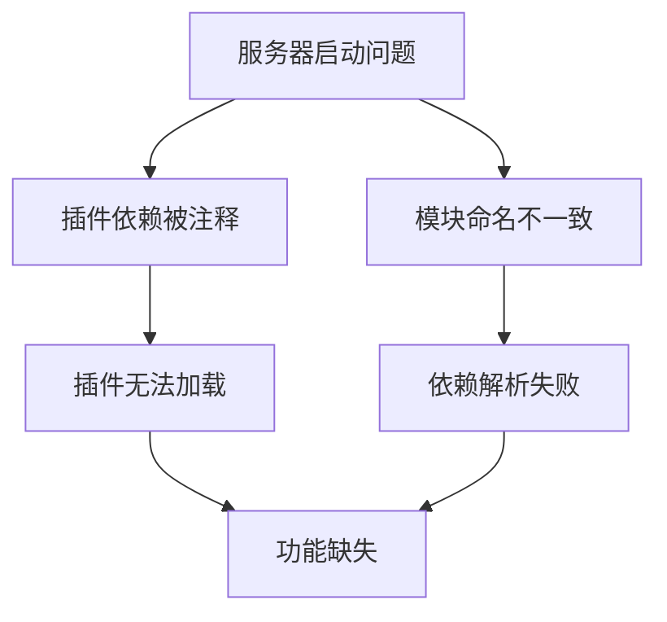
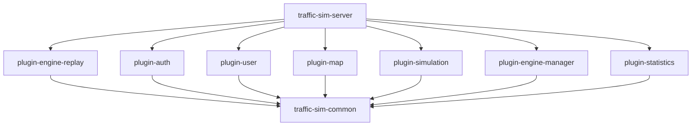
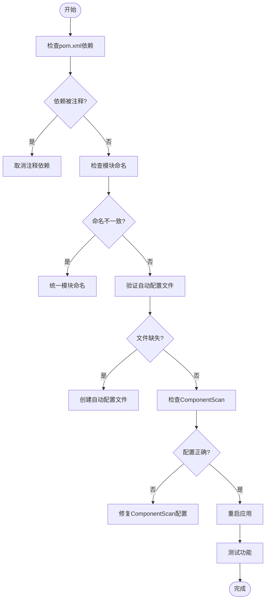

# 服务器配置问题

<cite>
**本文档引用的文件**   
- [traffic-sim-server/pom.xml](file://traffic-sim-server/pom.xml)
- [traffic-sim-server/traffic-sim-server-Issue.md](file://traffic-sim-server/traffic-sim-server-Issue.md)
- [plugins/pom.xml](file://plugins/pom.xml)
- [traffic-sim-server/src/main/java/com/traffic/sim/TrafficSimApplication.java](file://traffic-sim-server/src/main/java/com/traffic/sim/TrafficSimApplication.java)
- [plugins/plugin-auth/src/main/resources/META-INF/spring/org.springframework.boot.autoconfigure.AutoConfiguration.imports](file://plugins/plugin-auth/src/main/resources/META-INF/spring/org.springframework.boot.autoconfigure.AutoConfiguration.imports)
- [plugins/plugin-engine-manager/src/main/resources/META-INF/spring/org.springframework.boot.autoconfigure.AutoConfiguration.imports](file://plugins/plugin-engine-manager/src/main/resources/META-INF/spring/org.springframework.boot.autoconfigure.AutoConfiguration.imports)
- [plugins/plugin-engine-replay/src/main/resources/META-INF/spring/org.springframework.boot.autoconfigure.AutoConfiguration.imports](file://plugins/plugin-engine-replay/src/main/resources/META-INF/spring/org.springframework.boot.autoconfigure.AutoConfiguration.imports)
- [traffic-sim-server/src/main/resources/application.yml](file://traffic-sim-server/src/main/resources/application.yml)
</cite>

## 目录
1. [引言](#引言)
2. [核心配置问题](#核心配置问题)
3. [插件依赖配置](#插件依赖配置)
4. [模块命名一致性](#模块命名一致性)
5. [插件加载验证方法](#插件加载验证方法)
6. [ComponentScan 配置验证](#componentscan-配置验证)
7. [故障排除指南](#故障排除指南)
8. [结论](#结论)

## 引言

本文档详细记录了 `traffic-sim-server` 模块中曾经存在的严重配置问题，包括插件依赖被注释导致插件无法加载的问题，以及模块命名不一致造成的依赖混乱。虽然这些问题已解决，但仍需记录其症状和修复过程，帮助开发者识别类似配置错误。

**本文档引用的文件**   
- [traffic-sim-server/traffic-sim-server-Issue.md](file://traffic-sim-server/traffic-sim-server-Issue.md)

## 核心配置问题

`traffic-sim-server` 模块在开发过程中曾出现两个严重影响系统功能的配置问题：一是所有插件依赖在 `pom.xml` 中被注释，导致插件无法加载；二是模块命名不一致，造成依赖混乱。这两个问题都已解决，但其症状和修复过程对未来的配置管理具有重要参考价值。



**本文档引用的文件**   
- [traffic-sim-server/traffic-sim-server-Issue.md](file://traffic-sim-server/traffic-sim-server-Issue.md)

## 插件依赖配置

### 问题描述

在 `traffic-sim-server/pom.xml` 文件中，所有插件依赖都被注释掉了，导致插件模块不会被加载到应用中，插件功能无法使用。

```xml
<!-- 插件依赖（通过Maven依赖引入） -->
<!-- 
<dependency>
    <groupId>com.traffic.sim</groupId>
    <artifactId>plugin-auth</artifactId>
</dependency>
...
-->
```

### 正确配置方法

正确的配置方法是取消所有插件依赖的注释，确保每个插件模块都被正确声明：

```xml
<!-- 插件依赖（通过Maven依赖引入） -->
<dependency>
    <groupId>com.traffic.sim</groupId>
    <artifactId>plugin-auth</artifactId>
</dependency>
<dependency>
    <groupId>com.traffic.sim</groupId>
    <artifactId>plugin-user</artifactId>
</dependency>
<dependency>
    <groupId>com.traffic.sim</groupId>
    <artifactId>plugin-map</artifactId>
</dependency>
<dependency>
    <groupId>com.traffic.sim</groupId>
    <artifactId>plugin-simulation</artifactId>
</dependency>
<dependency>
    <groupId>com.traffic.sim</groupId>
    <artifactId>plugin-engine-manager</artifactId>
</dependency>
<dependency>
    <groupId>com.traffic.sim</groupId>
    <artifactId>plugin-statistics</artifactId>
</dependency>
<dependency>
    <groupId>com.traffic.sim</groupId>
    <artifactId>plugin-engine-replay</artifactId>
</dependency>
```

### 影响分析

当插件依赖被注释时，会产生以下严重影响：
- 所有插件模块无法被Spring Boot加载
- 插件中的Controller、Service、Repository等Bean不会被注册
- 应用无法正常启动或功能缺失

**本文档引用的文件**   
- [traffic-sim-server/pom.xml](file://traffic-sim-server/pom.xml)
- [traffic-sim-server/traffic-sim-server-Issue.md](file://traffic-sim-server/traffic-sim-server-Issue.md)

## 模块命名一致性

### 问题描述

在项目中存在模块命名不一致的问题：
- 在 `plugins/pom.xml` 中同时声明了 `plugin-replay` 和 `plugin-engine-replay` 两个模块
- 在 `traffic-sim-server/pom.xml` 中引用了不存在的 `plugin-replay`
- 实际目录中只存在 `plugin-engine-replay`

### 统一命名方案

经过与产品经理讨论，决定统一使用 `plugin-engine-replay` 作为模块名称，并进行以下修复：
1. 在 `traffic-sim-server/pom.xml` 中使用 `plugin-engine-replay` 依赖
2. 更新 `plugins/pom.xml`，删除 `plugin-replay` 模块声明
3. 更新 `README.md`，统一使用 `plugin-engine-replay` 名称

```xml
<modules>
    <module>plugin-auth</module>
    <module>plugin-user</module>
    <module>plugin-map</module>
    <module>plugin-simulation</module>
    <module>plugin-engine-manager</module>
    <module>plugin-statistics</module>
    <module>plugin-engine-replay</module>
</modules>
```

### 依赖关系图



**本文档引用的文件**   
- [plugins/pom.xml](file://plugins/pom.xml)
- [traffic-sim-server/traffic-sim-server-Issue.md](file://traffic-sim-server/traffic-sim-server-Issue.md)

## 插件加载验证方法

### 自动配置机制

插件模块使用Spring Boot 3.x的自动配置机制，通过 `META-INF/spring/org.springframework.boot.autoconfigure.AutoConfiguration.imports` 文件注册自动配置类：

```
com.traffic.sim.plugin.auth.config.AuthPluginAutoConfiguration
com.traffic.sim.plugin.engine.manager.config.EngineManagerAutoConfiguration
com.traffic.sim.plugin.replay.config.ReplayPluginAutoConfiguration
```

### 插件Bean注册检查

要验证插件是否成功加载，可以检查以下内容：

1. **自动配置文件存在性**：
   - 确认每个插件模块都有 `META-INF/spring/org.springframework.boot.autoconfigure.AutoConfiguration.imports` 文件
   - 确认文件中包含正确的自动配置类全限定名

2. **Bean注册状态**：
   - 在应用启动日志中搜索插件相关的Bean注册信息
   - 使用Spring Boot Actuator的 `/beans` 端点查看所有注册的Bean

3. **功能验证**：
   - 访问插件提供的API接口，验证功能是否正常
   - 检查插件相关的数据库表是否创建成功

**本文档引用的文件**   
- [plugins/plugin-auth/src/main/resources/META-INF/spring/org.springframework.boot.autoconfigure.AutoConfiguration.imports](file://plugins/plugin-auth/src/main/resources/META-INF/spring/org.springframework.boot.autoconfigure.AutoConfiguration.imports)
- [plugins/plugin-engine-manager/src/main/resources/META-INF/spring/org.springframework.boot.autoconfigure.AutoConfiguration.imports](file://plugins/plugin-engine-manager/src/main/resources/META-INF/spring/org.springframework.boot.autoconfigure.AutoConfiguration.imports)
- [plugins/plugin-engine-replay/src/main/resources/META-INF/spring/org.springframework.boot.autoconfigure.AutoConfiguration.imports](file://plugins/plugin-engine-replay/src/main/resources/META-INF/spring/org.springframework.boot.autoconfigure.AutoConfiguration.imports)

## ComponentScan 配置验证

### 当前配置

`traffic-sim-server` 模块的 `TrafficSimApplication` 类中配置了正确的 `ComponentScan`：

```java
@ComponentScan(basePackages = {
    "com.traffic.sim",
    "com.traffic.sim.plugin"
})
```

### 配置验证

该配置可以正确扫描所有插件包，原因如下：
- `com.traffic.sim` 包含主应用的组件
- `com.traffic.sim.plugin` 包含所有插件模块的基包
- 插件使用自动配置机制，与 `ComponentScan` 配合工作正常

### 验证方法

可以通过以下方式验证 `ComponentScan` 配置是否生效：

1. **启动日志检查**：
   - 查看应用启动日志中是否有扫描到插件包的信息
   - 搜索 "Scanning" 或 "component scan" 相关的日志

2. **运行时验证**：
   - 使用 `ApplicationContext` 的 `getBeansWithAnnotation` 方法检查特定注解的Bean数量
   - 通过调试模式查看组件扫描的结果

3. **配置测试**：
   - 编写单元测试验证关键Bean是否被正确注册
   - 使用 `@SpringBootTest` 测试插件功能是否可用

**本文档引用的文件**   
- [traffic-sim-server/src/main/java/com/traffic/sim/TrafficSimApplication.java](file://traffic-sim-server/src/main/java/com/traffic/sim/TrafficSimApplication.java)
- [traffic-sim-server/traffic-sim-server-Issue.md](file://traffic-sim-server/traffic-sim-server-Issue.md)

## 故障排除指南

### 常见问题症状

当出现插件配置问题时，通常会表现出以下症状：
- 应用启动时缺少插件相关的日志信息
- 访问插件API返回404错误
- 数据库中缺少插件相关的表
- 功能缺失或不完整

### 诊断步骤

1. **检查pom.xml配置**：
   - 确认所有插件依赖没有被注释
   - 确认模块名称与实际目录一致

2. **验证自动配置文件**：
   - 检查每个插件模块的 `META-INF/spring/org.springframework.boot.autoconfigure.AutoConfiguration.imports` 文件
   - 确认文件内容正确无误

3. **查看启动日志**：
   - 搜索插件自动配置类的加载信息
   - 检查是否有相关的错误或警告

4. **运行时验证**：
   - 使用Actuator端点检查Bean注册状态
   - 访问Swagger UI验证API是否暴露

### 修复流程



**本文档引用的文件**   
- [traffic-sim-server/pom.xml](file://traffic-sim-server/pom.xml)
- [traffic-sim-server/src/main/java/com/traffic/sim/TrafficSimApplication.java](file://traffic-sim-server/src/main/java/com/traffic/sim/TrafficSimApplication.java)
- [traffic-sim-server/src/main/resources/application.yml](file://traffic-sim-server/src/main/resources/application.yml)

## 结论

本文档详细记录了 `traffic-sim-server` 模块中曾经存在的严重配置问题及其解决方案。通过正确配置 `pom.xml` 中的插件依赖、统一模块命名、验证 `ComponentScan` 配置和插件Bean注册状态，可以确保服务器能够正确加载所有插件模块。

关键要点总结：
1. 确保所有插件依赖在 `pom.xml` 中正确声明，不要注释
2. 统一模块命名，避免依赖混乱
3. 使用 `ComponentScan` 正确配置包扫描范围
4. 验证每个插件的自动配置文件存在且内容正确
5. 通过启动日志和运行时检查验证插件加载状态

这些最佳实践将帮助开发者避免类似的配置错误，确保系统的稳定性和可维护性。