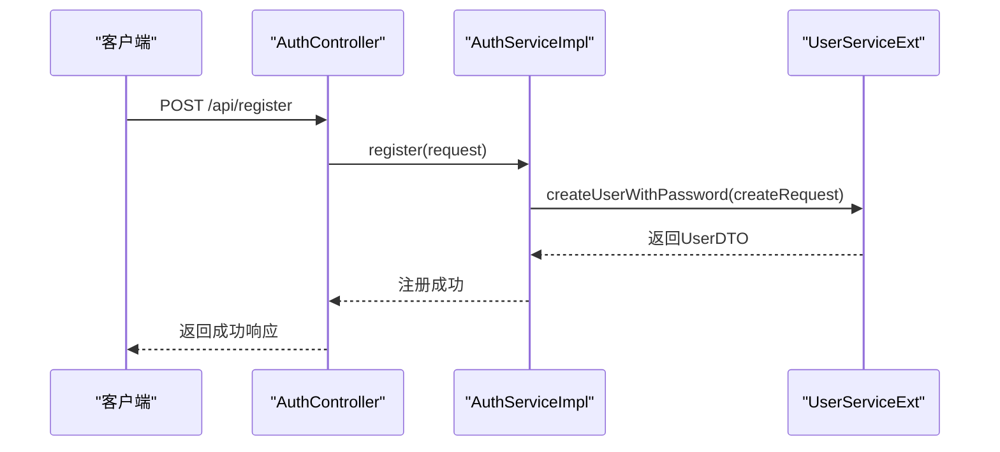
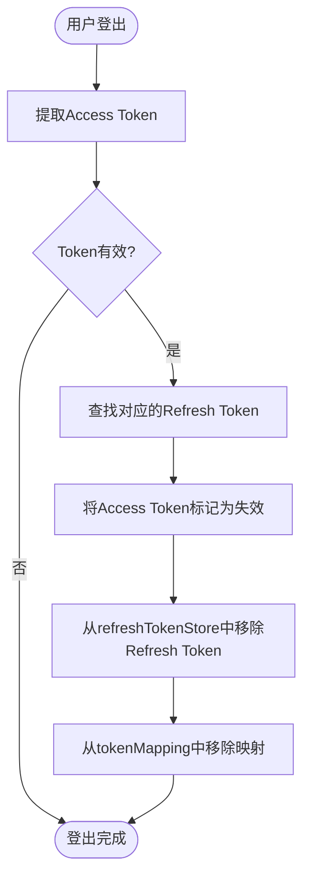
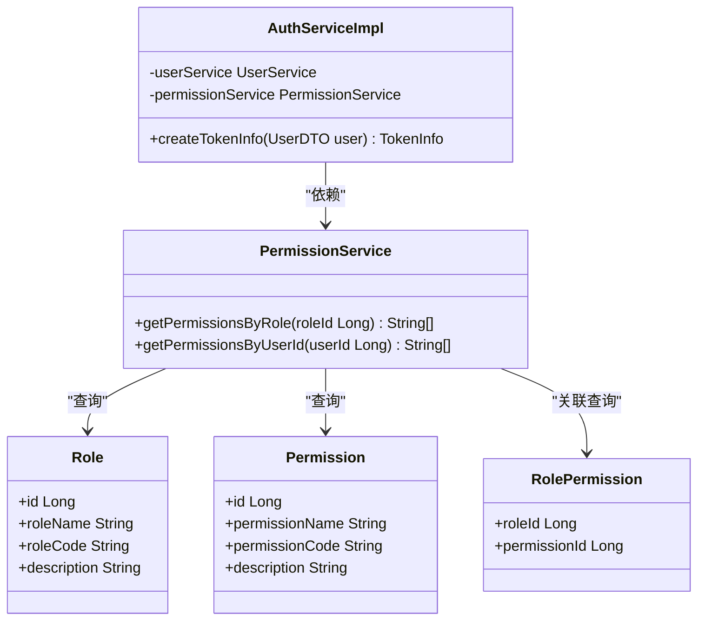

# 认证与授权问题

<cite>
**本文档引用的文件**
- [plugin-auth-Issue.md](file://plugins/plugin-auth/plugin-auth-Issue.md)
- [AuthServiceImpl.java](file://plugins/plugin-auth/src/main/java/com/traffic/sim/plugin/auth/service/AuthServiceImpl.java)
- [JwtTokenService.java](file://plugins/plugin-auth/src/main/java/com/traffic/sim/plugin/auth/service/JwtTokenService.java)
- [UserServiceExt.java](file://plugins/plugin-user/src/main/java/com/traffic/sim/plugin/user/service/UserServiceExt.java)
- [UserCreateRequest.java](file://plugins/plugin-user/src/main/java/com/traffic/sim/plugin/user/dto/UserCreateRequest.java)
- [AuthPluginProperties.java](file://plugins/plugin-auth/src/main/java/com/traffic/sim/plugin/auth/config/AuthPluginProperties.java)
- [init.sql](file://infrastructure/init.sql)
</cite>

## 目录
1. [简介](#简介)
2. [核心问题分析](#核心问题分析)
3. [用户注册时密码传递问题](#用户注册时密码传递问题)
4. [令牌失效机制不完整](#令牌失效机制不完整)
5. [权限列表硬编码](#权限列表硬编码)
6. [调试技巧与验证方法](#调试技巧与验证方法)
7. [总结与建议](#总结与建议)

## 简介
本文档详细分析了`plugin-auth`模块中存在的认证与授权问题，重点解决用户注册时密码传递问题、令牌失效机制不完整以及权限列表硬编码等已知问题。通过深入分析每个问题的症状、根本原因和具体的修复方案，帮助开发者快速定位和解决认证相关的问题。

## 核心问题分析
通过对`plugin-auth`模块的代码和问题报告进行分析，识别出三个主要问题：
1. 用户注册时密码传递问题
2. 令牌失效机制不完整
3. 权限列表硬编码

这些问题影响了系统的安全性、可维护性和功能完整性。以下将逐一详细分析并提供解决方案。

## 用户注册时密码传递问题

**问题症状**：
- 用户注册功能无法正确设置密码
- 注册后用户无法使用设置的密码登录
- 系统日志中可能出现密码验证失败的记录

**根本原因**：
在`AuthServiceImpl.register()`方法中，创建用户时调用`userService.createUser(userDTO)`，但`UserDTO`对象不包含密码字段。这是正确的设计原则（DTO不应包含敏感信息），但导致注册流程无法将密码传递给用户服务。

```java
@Override
public void register(RegisterRequest request) {
    // ...
    UserDTO userDTO = new UserDTO();
    userDTO.setUsername(request.getUsername());
    // ... 其他字段
    // TODO: 密码传递问题需要解决
    userService.createUser(userDTO);  // ❌ UserDTO不包含密码字段
}
```

**修复方案**：
使用`UserServiceExt.createUserWithPassword()`方法来正确传递密码。具体步骤如下：

1. 在`AuthServiceImpl`中注入`UserServiceExt`服务
2. 创建`UserCreateRequest`对象并设置密码
3. 调用`createUserWithPassword()`方法



**Diagram sources**
- [AuthServiceImpl.java](file://plugins/plugin-auth/src/main/java/com/traffic/sim/plugin/auth/service/AuthServiceImpl.java#L93-L123)
- [UserServiceExt.java](file://plugins/plugin-user/src/main/java/com/traffic/sim/plugin/user/service/UserServiceExt.java#L19-L20)
- [UserCreateRequest.java](file://plugins/plugin-user/src/main/java/com/traffic/sim/plugin/user/dto/UserCreateRequest.java#L22-L23)

**Section sources**
- [plugin-auth-Issue.md](file://plugins/plugin-auth/plugin-auth-Issue.md#L11-L31)
- [AuthServiceImpl.java](file://plugins/plugin-auth/src/main/java/com/traffic/sim/plugin/auth/service/AuthServiceImpl.java#L93-L123)

## 令牌失效机制不完整

**问题症状**：
- 用户登出后，access token被正确标记为失效
- 但对应的refresh token仍然有效，可以继续用于获取新的access token
- 存在安全漏洞，用户无法完全登出系统

**根本原因**：
在`logout()`方法中，只将access token标记为失效，但没有清理对应的refresh token。代码注释中提到需要维护access token和refresh token的映射关系，但未实现。

```java
@Override
public void logout(String token) {
    invalidatedTokens.put(token, System.currentTimeMillis());
    TokenInfo tokenInfo = jwtTokenService.parseToken(token);
    if (tokenInfo != null) {
        // 清理刷新令牌（需要找到对应的refreshToken，这里简化处理）
        // 实际实现中可能需要维护accessToken和refreshToken的映射关系
    }
}
```

**修复方案**：
维护`accessToken -> refreshToken`的映射关系，并在登出时同时清理两个令牌。具体实现步骤：

1. 创建`tokenMapping`映射表，存储access token到refresh token的映射
2. 在登录和刷新令牌时更新映射关系
3. 在登出时同时清理access token和对应的refresh token



**Diagram sources**
- [AuthServiceImpl.java](file://plugins/plugin-auth/src/main/java/com/traffic/sim/plugin/auth/service/AuthServiceImpl.java#L185-L201)
- [JwtTokenService.java](file://plugins/plugin-auth/src/main/java/com/traffic/sim/plugin/auth/service/JwtTokenService.java#L32-L41)

**Section sources**
- [plugin-auth-Issue.md](file://plugins/plugin-auth/plugin-auth-Issue.md#L59-L86)
- [AuthServiceImpl.java](file://plugins/plugin-auth/src/main/java/com/traffic/sim/plugin/auth/service/AuthServiceImpl.java#L185-L201)

## 权限列表硬编码

**问题症状**：
- 权限列表在代码中硬编码，无法动态调整
- 修改权限需要修改代码并重新部署
- 系统灵活性和可维护性差

**根本原因**：
在`createTokenInfo()`方法中，权限列表是根据角色名称硬编码的，而不是从数据库或配置中动态获取。

```java
List<String> permissions = new ArrayList<>();
if ("ADMIN".equals(user.getRoleName())) {
    permissions.add("user:create");
    permissions.add("user:update");
    // ... 硬编码的权限
} else {
    permissions.add("user:query");
}
```

**修复方案**：
从数据库的角色权限表中动态加载权限列表。具体实现步骤：

1. 在`plugin-user`模块中实现权限服务
2. 通过角色ID查询关联的权限列表
3. 在创建TokenInfo时调用权限服务获取动态权限



**Diagram sources**
- [AuthServiceImpl.java](file://plugins/plugin-auth/src/main/java/com/traffic/sim/plugin/auth/service/AuthServiceImpl.java#L206-L228)
- [init.sql](file://infrastructure/init.sql#L187-L200)

**Section sources**
- [plugin-auth-Issue.md](file://plugins/plugin-auth/plugin-auth-Issue.md#L92-L117)
- [AuthServiceImpl.java](file://plugins/plugin-auth/src/main/java/com/traffic/sim/plugin/auth/service/AuthServiceImpl.java#L206-L228)

## 调试技巧与验证方法

### 密码传递问题调试
1. **日志检查**：查看注册流程日志，确认是否调用了正确的密码处理方法
2. **断点调试**：在`createUserWithPassword()`方法处设置断点，验证密码参数是否正确传递
3. **集成测试**：编写测试用例验证注册后能否使用设置的密码登录

### 令牌失效问题验证
1. **登出测试**：执行登出操作后，尝试使用原access token和refresh token访问受保护接口
2. **数据库检查**：验证`refreshTokenStore`中对应的refresh token是否已被移除
3. **时间验证**：测试在不同时间间隔后尝试使用旧令牌，确认失效机制正常工作

### 权限配置验证
1. **权限变更测试**：修改数据库中的角色权限配置，验证用户权限是否动态更新
2. **接口访问测试**：使用不同角色的用户访问需要特定权限的接口，验证权限控制是否正确
3. **审计日志**：检查权限验证失败的日志记录，确认权限检查逻辑正常工作

## 总结与建议
针对`plugin-auth`模块的三个主要问题，建议按以下优先级进行修复：

1. **高优先级**：解决用户注册时密码传递问题，确保用户能够正常注册和登录
2. **中优先级**：完善令牌失效机制，提高系统安全性
3. **中优先级**：实现动态权限管理，提高系统可维护性

建议在修复这些问题时，遵循以下最佳实践：
- 保持敏感信息（如密码）的安全性
- 实现完整的会话管理机制
- 采用配置化而非硬编码的方式管理权限
- 充分测试每个修复方案，确保不影响现有功能