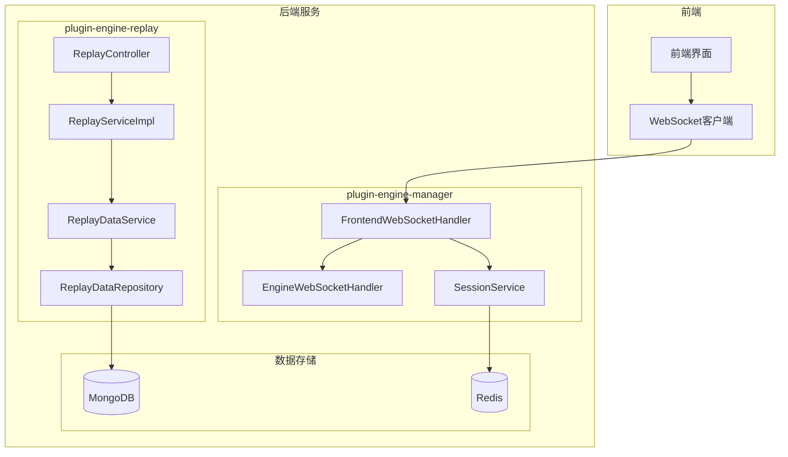
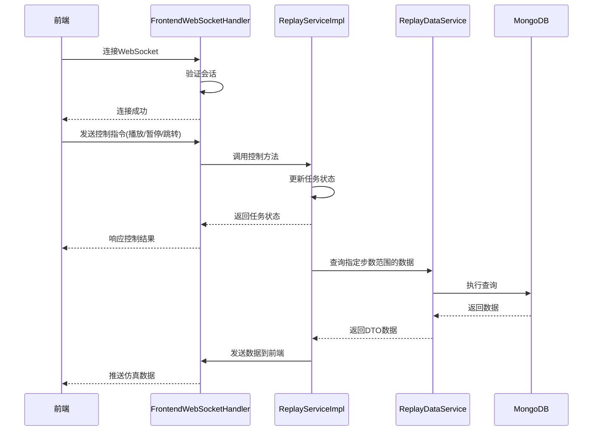
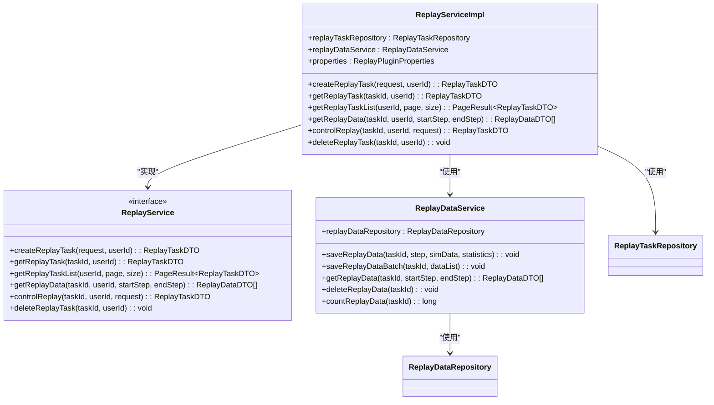
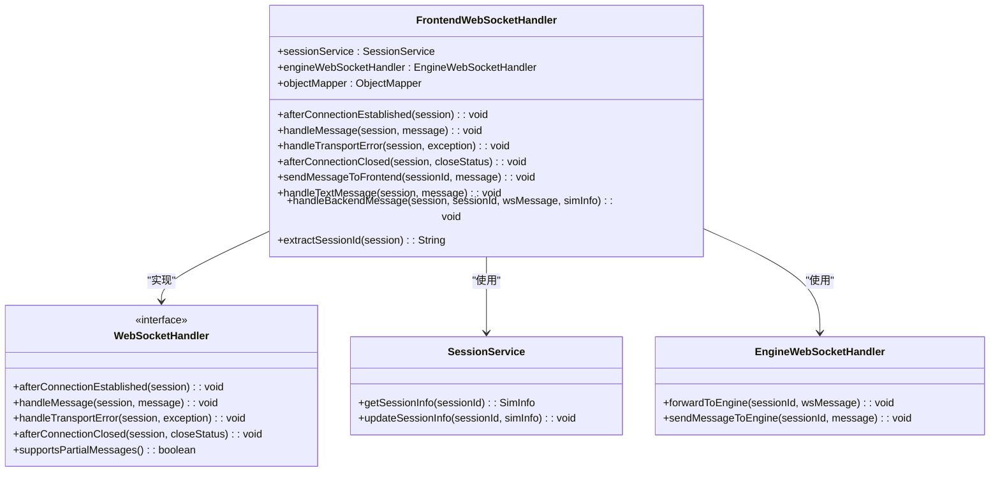
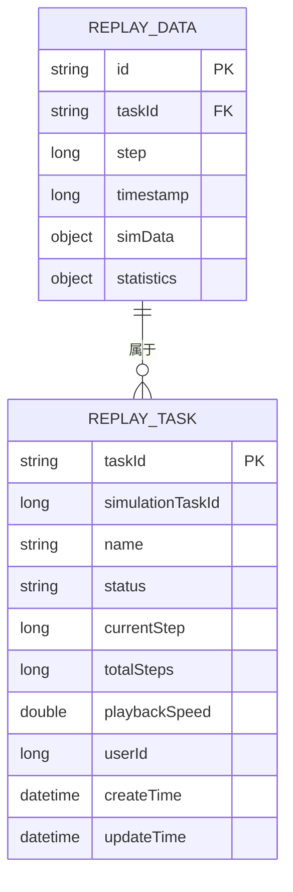
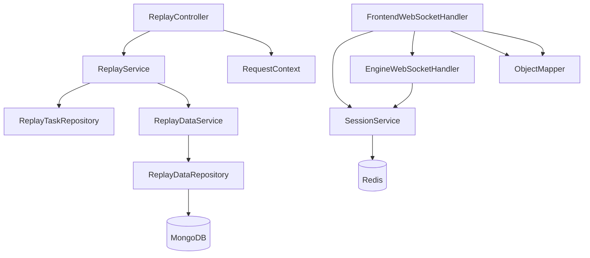
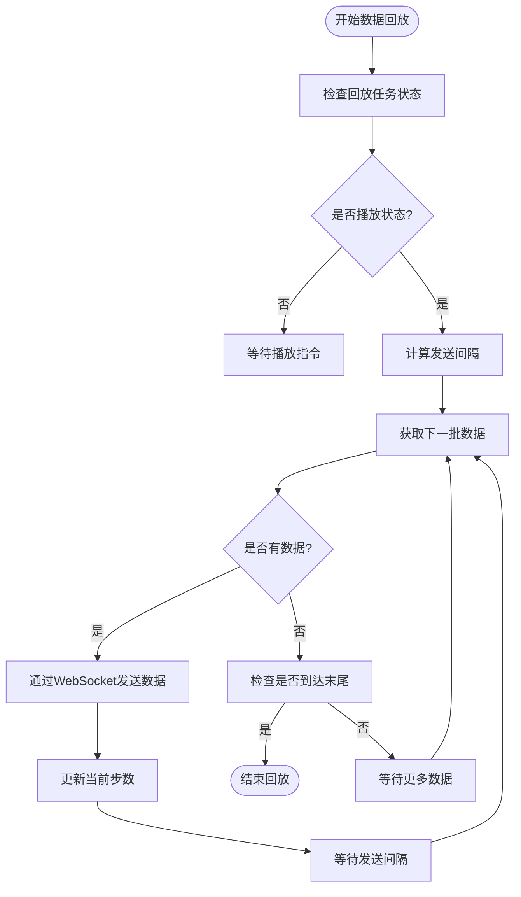

# 实时通信

<cite>
**本文档引用的文件**   
- [ReplayServiceImpl.java](file://plugins/plugin-engine-replay/src/main/java/com/traffic/sim/plugin/replay/service/ReplayServiceImpl.java)
- [FrontendWebSocketHandler.java](file://plugins/plugin-engine-manager/src/main/java/com/traffic/sim/plugin/engine/manager/websocket/FrontendWebSocketHandler.java)
- [ReplayDataRepository.java](file://plugins/plugin-engine-replay/src/main/java/com/traffic/sim/plugin/replay/repository/ReplayDataRepository.java)
- [ReplayDataDocument.java](file://plugins/plugin-engine-replay/src/main/java/com/traffic/sim/plugin/replay/document/ReplayDataDocument.java)
- [ReplayDataService.java](file://plugins/plugin-engine-replay/src/main/java/com/traffic/sim/plugin/replay/service/ReplayDataService.java)
- [ReplayController.java](file://plugins/plugin-engine-replay/src/main/java/com/traffic/sim/plugin/replay/controller/ReplayController.java)
- [WebSocketInfo.java](file://traffic-sim-common/src/main/java/com/traffic/sim/common/model/WebSocketInfo.java)
- [WebSocketMessageType.java](file://traffic-sim-common/src/main/java/com/traffic/sim/common/constant/WebSocketMessageType.java)
- [WebSocketOperation.java](file://traffic-sim-common/src/main/java/com/traffic/sim/common/constant/WebSocketOperation.java)
- [init-mongo.js](file://infrastructure/mongodb/init-mongo.js)
- [index.html](file://frontend/index.html)
</cite>

## 目录
1. [引言](#引言)
2. [项目结构](#项目结构)
3. [核心组件](#核心组件)
4. [架构概述](#架构概述)
5. [详细组件分析](#详细组件分析)
6. [依赖分析](#依赖分析)
7. [性能考虑](#性能考虑)
8. [故障排除指南](#故障排除指南)
9. [结论](#结论)

## 引言
本文档详细说明了交通仿真系统中数据回放在实时通信方面的实现机制。重点描述系统如何通过WebSocket技术将MongoDB中存储的历史仿真数据按指定播放速度逐步推送给前端。文档阐述了`ReplayServiceImpl`与WebSocket处理器的集成方式，以及在播放过程中如何根据`playbackSpeed`动态控制数据发送频率。同时讨论了大数据量下的分批加载与流式传输策略、索引优化与缓存策略，以及网络异常情况的容错处理方案。

## 项目结构
系统采用微服务架构，通过插件化设计实现功能模块解耦。数据回放功能主要由`plugin-engine-replay`插件实现，该插件负责管理回放任务和数据存储。实时通信通过`plugin-engine-manager`插件中的WebSocket处理器实现，前端通过WebSocket连接与后端保持实时通信。

**图示来源**
- [ReplayServiceImpl.java](file://plugins/plugin-engine-replay/src/main/java/com/traffic/sim/plugin/replay/service/ReplayServiceImpl.java)
- [FrontendWebSocketHandler.java](file://plugins/plugin-engine-manager/src/main/java/com/traffic/sim/plugin/engine/manager/websocket/FrontendWebSocketHandler.java)
- [ReplayDataRepository.java](file://plugins/plugin-engine-replay/src/main/java/com/traffic/sim/plugin/replay/repository/ReplayDataRepository.java)

**本节来源**
- [ReplayServiceImpl.java](file://plugins/plugin-engine-replay/src/main/java/com/traffic/sim/plugin/replay/service/ReplayServiceImpl.java)
- [FrontendWebSocketHandler.java](file://plugins/plugin-engine-manager/src/main/java/com/traffic/sim/plugin/engine/manager/websocket/FrontendWebSocketHandler.java)

## 核心组件
系统的核心组件包括回放服务实现、WebSocket处理器、MongoDB数据访问层和前端通信模型。`ReplayServiceImpl`负责管理回放任务的生命周期，包括创建、控制和删除任务。`FrontendWebSocketHandler`处理前端WebSocket连接，实现双向实时通信。`ReplayDataRepository`提供对MongoDB中`replay_data`集合的访问，支持按任务ID和步数范围查询数据。

**本节来源**
- [ReplayServiceImpl.java](file://plugins/plugin-engine-replay/src/main/java/com/traffic/sim/plugin/replay/service/ReplayServiceImpl.java)
- [FrontendWebSocketHandler.java](file://plugins/plugin-engine-manager/src/main/java/com/traffic/sim/plugin/engine/manager/websocket/FrontendWebSocketHandler.java)
- [ReplayDataRepository.java](file://plugins/plugin-engine-replay/src/main/java/com/traffic/sim/plugin/replay/repository/ReplayDataRepository.java)

## 架构概述
系统采用分层架构设计，实现了业务逻辑与通信机制的分离。回放功能的核心是`ReplayServiceImpl`，它通过`ReplayDataService`访问存储在MongoDB中的历史仿真数据。WebSocket通信由`FrontendWebSocketHandler`管理，该处理器负责处理前端连接、消息路由和会话管理。

**图示来源**
- [ReplayServiceImpl.java](file://plugins/plugin-engine-replay/src/main/java/com/traffic/sim/plugin/replay/service/ReplayServiceImpl.java)
- [FrontendWebSocketHandler.java](file://plugins/plugin-engine-manager/src/main/java/com/traffic/sim/plugin/engine/manager/websocket/FrontendWebSocketHandler.java)
- [ReplayDataService.java](file://plugins/plugin-engine-replay/src/main/java/com/traffic/sim/plugin/replay/service/ReplayDataService.java)

## 详细组件分析

### 回放服务实现分析
`ReplayServiceImpl`是回放功能的核心服务类，实现了`ReplayService`接口。该服务负责管理回放任务的完整生命周期，包括创建、查询、控制和删除任务。服务通过依赖注入获取`ReplayTaskRepository`、`ReplayDataService`和`ReplayPluginProperties`实例。

**图示来源**
- [ReplayServiceImpl.java](file://plugins/plugin-engine-replay/src/main/java/com/traffic/sim/plugin/replay/service/ReplayServiceImpl.java)
- [ReplayDataService.java](file://plugins/plugin-engine-replay/src/main/java/com/traffic/sim/plugin/replay/service/ReplayDataService.java)

**本节来源**
- [ReplayServiceImpl.java](file://plugins/plugin-engine-replay/src/main/java/com/traffic/sim/plugin/replay/service/ReplayServiceImpl.java)

### WebSocket处理器分析
`FrontendWebSocketHandler`是前端WebSocket连接的处理器，实现了Spring WebSocket的`WebSocketHandler`接口。该处理器负责处理前端连接的建立、消息接收、传输错误和连接关闭等生命周期事件。

**图示来源**
- [FrontendWebSocketHandler.java](file://plugins/plugin-engine-manager/src/main/java/com/traffic/sim/plugin/engine/manager/websocket/FrontendWebSocketHandler.java)
- [SessionService.java](file://traffic-sim-common/src/main/java/com/traffic/sim/common/service/SessionService.java)

**本节来源**
- [FrontendWebSocketHandler.java](file://plugins/plugin-engine-manager/src/main/java/com/traffic/sim/plugin/engine/manager/websocket/FrontendWebSocketHandler.java)

### 数据模型分析
系统使用`ReplayDataDocument`作为MongoDB文档模型，对应`replay_data`集合。该文档包含任务ID、步数、时间戳、仿真数据和统计信息等字段，支持高效的时间序列数据存储和查询。

**图示来源**
- [ReplayDataDocument.java](file://plugins/plugin-engine-replay/src/main/java/com/traffic/sim/plugin/replay/document/ReplayDataDocument.java)
- [ReplayTask.java](file://plugins/plugin-engine-replay/src/main/java/com/traffic/sim/plugin/replay/entity/ReplayTask.java)

**本节来源**
- [ReplayDataDocument.java](file://plugins/plugin-engine-replay/src/main/java/com/traffic/sim/plugin/replay/document/ReplayDataDocument.java)

## 依赖分析
系统各组件之间存在明确的依赖关系。`ReplayServiceImpl`依赖于`ReplayDataService`和`ReplayTaskRepository`来访问数据，而`ReplayDataService`又依赖于`ReplayDataRepository`与MongoDB交互。WebSocket通信方面，`FrontendWebSocketHandler`依赖于`SessionService`管理会话状态，并与`EngineWebSocketHandler`协同工作处理消息路由。

**图示来源**
- [ReplayServiceImpl.java](file://plugins/plugin-engine-replay/src/main/java/com/traffic/sim/plugin/replay/service/ReplayServiceImpl.java)
- [FrontendWebSocketHandler.java](file://plugins/plugin-engine-manager/src/main/java/com/traffic/sim/plugin/engine/manager/websocket/FrontendWebSocketHandler.java)
- [ReplayDataRepository.java](file://plugins/plugin-engine-replay/src/main/java/com/traffic/sim/plugin/replay/repository/ReplayDataRepository.java)

**本节来源**
- [ReplayServiceImpl.java](file://plugins/plugin-engine-replay/src/main/java/com/traffic/sim/plugin/replay/service/ReplayServiceImpl.java)
- [FrontendWebSocketHandler.java](file://plugins/plugin-engine-manager/src/main/java/com/traffic/sim/plugin/engine/manager/websocket/FrontendWebSocketHandler.java)

## 性能考虑
为确保大数据量下的流畅播放，系统采用了多种性能优化策略。在数据存储方面，`replay_data`集合通过任务ID和步数建立复合索引，支持高效的范围查询。数据访问层使用分页查询限制单次返回的数据量，避免内存溢出。

**图示来源**
- [ReplayServiceImpl.java](file://plugins/plugin-engine-replay/src/main/java/com/traffic/sim/plugin/replay/service/ReplayServiceImpl.java)
- [ReplayDataService.java](file://plugins/plugin-engine-replay/src/main/java/com/traffic/sim/plugin/replay/service/ReplayDataService.java)

**本节来源**
- [ReplayDataRepository.java](file://plugins/plugin-engine-replay/src/main/java/com/traffic/sim/plugin/replay/repository/ReplayDataRepository.java)
- [init-mongo.js](file://infrastructure/mongodb/init-mongo.js)

## 故障排除指南
系统实现了完善的异常处理机制，能够应对各种网络和数据异常情况。当WebSocket连接出现传输错误时，`FrontendWebSocketHandler`会记录错误日志但不会中断其他连接。对于数据查询异常，服务层会抛出`BusinessException`并返回有意义的错误信息给前端。

**本节来源**
- [FrontendWebSocketHandler.java](file://plugins/plugin-engine-manager/src/main/java/com/traffic/sim/plugin/engine/manager/websocket/FrontendWebSocketHandler.java)
- [ReplayServiceImpl.java](file://plugins/plugin-engine-replay/src/main/java/com/traffic/sim/plugin/replay/service/ReplayServiceImpl.java)

## 结论
本文档详细阐述了交通仿真系统中数据回放的实时通信实现机制。系统通过WebSocket技术实现了前端与后端的双向实时通信，`ReplayServiceImpl`与`FrontendWebSocketHandler`的紧密集成确保了回放控制指令的及时响应和仿真数据的流畅推送。通过合理的分批加载策略、索引优化和异常处理机制，系统能够在大数据量下提供稳定可靠的回放服务。