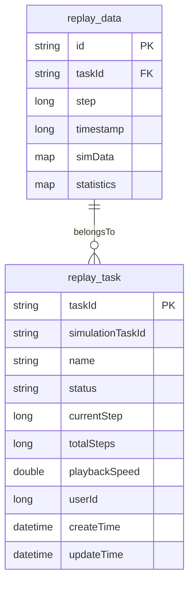
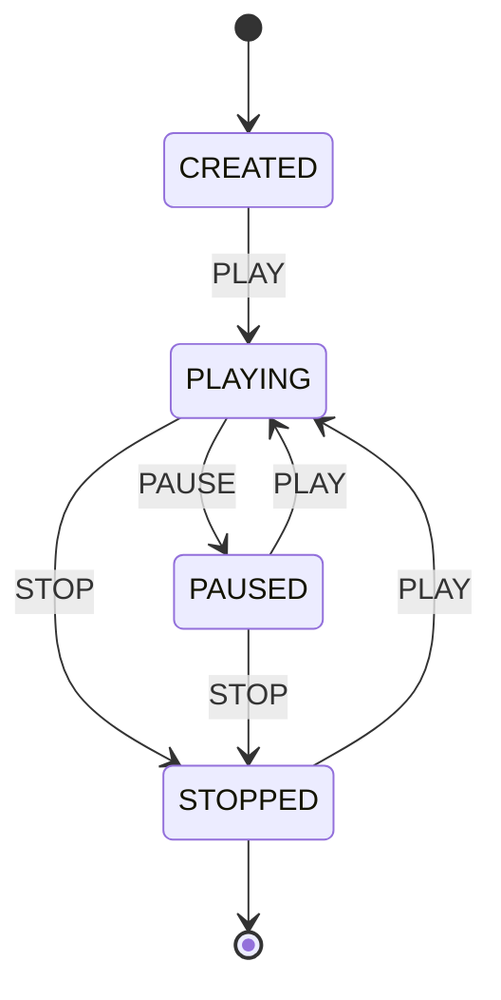
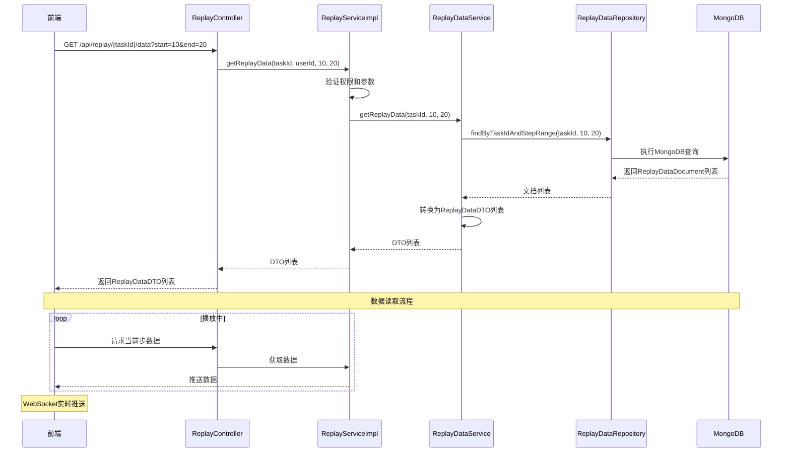

# 数据回放

<cite>
**本文档中引用的文件**  
- [ReplayDataDocument.java](file://plugins/plugin-engine-replay/src/main/java/com/traffic/sim/plugin/replay/document/ReplayDataDocument.java)
- [ReplayTask.java](file://plugins/plugin-engine-replay/src/main/java/com/traffic/sim/plugin/replay/entity/ReplayTask.java)
- [ReplayServiceImpl.java](file://plugins/plugin-engine-replay/src/main/java/com/traffic/sim/plugin/replay/service/ReplayServiceImpl.java)
- [ReplayDataService.java](file://plugins/plugin-engine-replay/src/main/java/com/traffic/sim/plugin/replay/service/ReplayDataService.java)
- [ReplayController.java](file://plugins/plugin-engine-replay/src/main/java/com/traffic/sim/plugin/replay/controller/ReplayController.java)
- [ReplayDataRepository.java](file://plugins/plugin-engine-replay/src/main/java/com/traffic/sim/plugin/replay/repository/ReplayDataRepository.java)
- [ReplayTaskRepository.java](file://plugins/plugin-engine-replay/src/main/java/com/traffic/sim/plugin/replay/repository/ReplayTaskRepository.java)
- [WebSocketConfig.java](file://plugins/plugin-engine-manager/src/main/java/com/traffic/sim/plugin/engine/manager/config/WebSocketConfig.java)
- [FrontendWebSocketHandler.java](file://plugins/plugin-engine-manager/src/main/java/com/traffic/sim/plugin/engine/manager/websocket/FrontendWebSocketHandler.java)
- [WebSocketMessageType.java](file://traffic-sim-common/src/main/java/com/traffic/sim/common/constant/WebSocketMessageType.java)
- [WebSocketOperation.java](file://traffic-sim-common/src/main/java/com/traffic/sim/common/constant/WebSocketOperation.java)
</cite>

## 目录
1. [简介](#简介)
2. [历史仿真数据的存储](#历史仿真数据的存储)
3. [回放任务的创建与控制机制](#回放任务的创建与控制机制)
4. [ReplayServiceImpl的数据读取与推送流程](#replayserviceimpl的数据读取与推送流程)
5. [ReplayTask实体的状态管理与生命周期](#replaytask实体的状态管理与生命周期)
6. [WebSocket在实时推送中的应用](#websocket在实时推送中的应用)
7. [大数据量回放的性能优化建议](#大数据量回放的性能优化建议)
8. [结论](#结论)

## 简介

数据回放功能是交通仿真系统中的核心模块之一，旨在支持用户对已完成的历史仿真过程进行可视化重放。该功能允许用户创建回放任务，控制播放进度（如播放、暂停、跳转、倍速等），并实时查看仿真数据与统计结果。系统通过MongoDB持久化存储大量仿真步数据，并结合WebSocket实现服务端到前端的低延迟实时推送。本文档将深入解析该功能的技术实现细节，涵盖数据模型、服务逻辑、状态控制及性能优化策略。

**Section sources**
- [ReplayServiceImpl.java](file://plugins/plugin-engine-replay/src/main/java/com/traffic/sim/plugin/replay/service/ReplayServiceImpl.java#L1-L206)
- [ReplayController.java](file://plugins/plugin-engine-replay/src/main/java/com/traffic/sim/plugin/replay/controller/ReplayController.java#L1-L140)

## 历史仿真数据的存储

历史仿真数据以文档形式存储在MongoDB数据库中，对应集合为`replay_data`。核心数据结构由`ReplayDataDocument`类定义，其主要字段包括：

- **taskId**: 关联的回放任务ID，用于数据归属查询。
- **step**: 仿真步数，标识该数据在仿真时间轴上的位置。
- **timestamp**: 数据生成的时间戳，用于时间序列分析。
- **simData**: 仿真数据，以`Map<String, Object>`形式存储，包含车辆位置、信号灯状态等动态信息。
- **statistics**: 统计数据，同样以`Map<String, Object>`形式存储，包含流量、延误、排队长度等指标。

该设计利用MongoDB的灵活文档模型，能够高效存储结构复杂且可能动态变化的仿真数据。`ReplayDataRepository`接口提供了基于任务ID和步数范围的查询方法，支持分页和排序，确保在大数据量下的查询性能。

**Diagram sources**
- [ReplayDataDocument.java](file://plugins/plugin-engine-replay/src/main/java/com/traffic/sim/plugin/replay/document/ReplayDataDocument.java#L1-L47)
- [ReplayTask.java](file://plugins/plugin-engine-replay/src/main/java/com/traffic/sim/plugin/replay/entity/ReplayTask.java#L1-L102)

**Section sources**
- [ReplayDataDocument.java](file://plugins/plugin-engine-replay/src/main/java/com/traffic/sim/plugin/replay/document/ReplayDataDocument.java#L1-L47)
- [ReplayDataRepository.java](file://plugins/plugin-engine-replay/src/main/java/com/traffic/sim/plugin/replay/repository/ReplayDataRepository.java#L1-L41)

## 回放任务的创建与控制机制

回放任务的生命周期由`ReplayTask`实体和`ReplayServiceImpl`服务类共同管理。

### 任务创建

创建回放任务通过`ReplayController.createReplayTask`接口触发。`ReplayServiceImpl.createReplayTask`方法负责核心逻辑：
1. 生成全局唯一的任务ID。
2. 初始化`ReplayTask`实体，状态设为`CREATED`，播放速度使用配置的默认值。
3. 将任务持久化到MySQL数据库。

### 任务控制

任务控制通过`ReplayController.controlReplay`接口实现，支持多种操作：
- **PLAY (播放)**: 将状态从`PAUSED`或`STOPPED`切换至`PLAYING`。
- **PAUSE (暂停)**: 将状态从`PLAYING`切换至`PAUSED`。
- **STOP (停止)**: 将状态设为`STOPPED`，并重置当前步数为0。
- **SEEK (跳转)**: 允许用户跳转到指定步数，需验证目标步数的有效性。
- **SET_SPEED (设置速度)**: 调整播放速度，需在配置的最小和最大速度范围内。

控制逻辑在`ReplayServiceImpl.controlReplay`方法中实现，包含严格的状态校验，确保操作的合法性。例如，只有在“暂停”或“停止”状态下才能执行“播放”操作。

**Diagram sources**
- [ReplayTask.java](file://plugins/plugin-engine-replay/src/main/java/com/traffic/sim/plugin/replay/entity/ReplayTask.java#L77-L102)
- [ReplayServiceImpl.java](file://plugins/plugin-engine-replay/src/main/java/com/traffic/sim/plugin/replay/service/ReplayServiceImpl.java#L115-L163)

**Section sources**
- [ReplayTask.java](file://plugins/plugin-engine-replay/src/main/java/com/traffic/sim/plugin/replay/entity/ReplayTask.java#L1-L102)
- [ReplayServiceImpl.java](file://plugins/plugin-engine-replay/src/main/java/com/traffic/sim/plugin/replay/service/ReplayServiceImpl.java#L36-L170)
- [ReplayController.java](file://plugins/plugin-engine-replay/src/main/java/com/traffic/sim/plugin/replay/controller/ReplayController.java#L108-L121)

## ReplayServiceImpl的数据读取与推送流程

`ReplayServiceImpl`是数据回放功能的核心服务，其`getReplayData`方法负责从数据库读取数据并准备推送。

### 数据读取流程

1.  **权限验证**: 首先调用`ReplayTaskRepository.findByTaskIdAndUserId`，确保当前用户有权访问该任务。
2.  **参数校验**: 检查请求的步数范围（`startStep`, `endStep`）是否有效，是否超出任务的总步数。
3.  **委托查询**: 调用`ReplayDataService.getReplayData`，后者通过`ReplayDataRepository.findByTaskIdAndStepRange`从MongoDB中查询指定范围内的`ReplayDataDocument`。
4.  **数据转换**: 将查询到的文档列表转换为前端友好的`ReplayDataDTO`列表。

### 实时推送流程

虽然`ReplayServiceImpl`本身不直接处理推送，但它为推送提供了数据基础。当回放任务处于`PLAYING`状态时，系统会启动一个后台任务（或由前端通过轮询/长连接触发），周期性地调用`getReplayData`获取当前步数的数据，并通过WebSocket通道将`ReplayDataDTO`列表推送给前端。前端接收后解析`simData`和`statistics`，更新可视化界面。

**Diagram sources**
- [ReplayServiceImpl.java](file://plugins/plugin-engine-replay/src/main/java/com/traffic/sim/plugin/replay/service/ReplayServiceImpl.java#L88-L105)
- [ReplayDataService.java](file://plugins/plugin-engine-replay/src/main/java/com/traffic/sim/plugin/replay/service/ReplayDataService.java#L80-L89)
- [ReplayDataRepository.java](file://plugins/plugin-engine-replay/src/main/java/com/traffic/sim/plugin/replay/repository/ReplayDataRepository.java#L22-L23)

**Section sources**
- [ReplayServiceImpl.java](file://plugins/plugin-engine-replay/src/main/java/com/traffic/sim/plugin/replay/service/ReplayServiceImpl.java#L88-L105)
- [ReplayDataService.java](file://plugins/plugin-engine-replay/src/main/java/com/traffic/sim/plugin/replay/service/ReplayDataService.java#L37-L98)

## ReplayTask实体的状态管理与生命周期

`ReplayTask`实体是回放任务在系统中的持久化表示，其状态管理是功能稳定性的关键。

### 状态枚举

`ReplayTask.ReplayStatus`枚举定义了任务的五种状态：
- **CREATED (已创建)**: 任务创建后初始状态。
- **PLAYING (播放中)**: 数据正在被实时推送。
- **PAUSED (已暂停)**: 播放被用户暂停，当前步数保留。
- **STOPPED (已停止)**: 播放被停止，当前步数重置为0。
- **FINISHED (已完成)**: 任务已结束（当前系统主要使用STOPPED）。

### 生命周期

任务的生命周期始于`createReplayTask`，终于`deleteReplayTask`。在生命周期内，状态在`CREATED`、`PLAYING`、`PAUSED`、`STOPPED`之间转换。状态转换由`controlReplay`方法驱动，并通过`ReplayTaskRepository`持久化到数据库。这种基于数据库的状态管理确保了服务重启后状态的可恢复性。

**Section sources**
- [ReplayTask.java](file://plugins/plugin-engine-replay/src/main/java/com/traffic/sim/plugin/replay/entity/ReplayTask.java#L39-L102)

## WebSocket在实时推送中的应用

WebSocket是实现低延迟、双向实时通信的核心技术，用于将回放数据从服务端主动推送到前端。

### 配置与通道

系统通过`WebSocketConfig`和`WebSocketHandlerConfig`进行WebSocket配置。`FrontendWebSocketHandler`作为核心处理器，负责管理与前端的WebSocket连接。消息的类型和操作由`WebSocketMessageType`和`WebSocketOperation`常量类定义，例如，回放数据的推送可能使用特定的消息类型（如`REPLAY_DATA`）。

### 推送机制

当`ReplayServiceImpl`获取到当前步的`ReplayDataDTO`后，服务层会通过注入的WebSocket会话管理器（如`SessionService`），向与该用户关联的前端WebSocket会话发送消息。消息体通常是一个包含消息类型、操作和数据（`ReplayDataDTO`）的`WebSocketInfo`对象。前端通过监听WebSocket消息，解析出数据并更新UI，从而实现流畅的实时回放体验。

**Section sources**
- [WebSocketConfig.java](file://plugins/plugin-engine-manager/src/main/java/com/traffic/sim/plugin/engine/manager/config/WebSocketConfig.java#L1-L19)
- [FrontendWebSocketHandler.java](file://plugins/plugin-engine-manager/src/main/java/com/traffic/sim/plugin/engine/manager/websocket/FrontendWebSocketHandler.java)
- [WebSocketMessageType.java](file://traffic-sim-common/src/main/java/com/traffic/sim/common/constant/WebSocketMessageType.java)
- [WebSocketOperation.java](file://traffic-sim-common/src/main/java/com/traffic/sim/common/constant/WebSocketOperation.java)
- [WebSocketInfo.java](file://traffic-sim-common/src/main/java/com/traffic/sim/common/model/WebSocketInfo.java)

## 大数据量回放的性能优化建议

针对海量仿真数据的回放场景，提出以下优化建议：

1.  **分页与范围查询**: 严格使用`startStep`和`endStep`参数进行范围查询，避免一次性加载全部数据。`ReplayDataService.getReplayData`已实现此机制。
2.  **MongoDB索引优化**: 在`replay_data`集合上为`taskId`和`step`字段创建复合索引，极大提升按任务和步数范围查询的效率。
3.  **数据压缩**: 对`simData`和`statistics`中的大文本或冗余数据，在存储前进行压缩（如GZIP），减少数据库I/O和网络传输开销。
4.  **批处理与异步**: 在数据写入阶段（仿真时），使用`ReplayDataService.saveReplayDataBatch`进行批量保存，减少数据库连接开销。
5.  **前端数据缓存**: 前端可缓存已加载的步数数据，当用户前后跳转时，优先从本地缓存读取，减少网络请求。
6.  **动态加载策略**: 对于超长仿真，可采用“预加载”策略，提前加载当前步附近的若干步数据，保证播放流畅性。
7.  **限制返回数据量**: 在`ReplayDataService.getReplayData`中，通过`Pageable`限制单次查询返回的最大文档数（如10000条），防止内存溢出。

**Section sources**
- [ReplayDataService.java](file://plugins/plugin-engine-replay/src/main/java/com/traffic/sim/plugin/replay/service/ReplayDataService.java#L80-L89)
- [ReplayDataRepository.java](file://plugins/plugin-engine-replay/src/main/java/com/traffic/sim/plugin/replay/repository/ReplayDataRepository.java#L22-L23)

## 结论

数据回放功能通过`ReplayTask`管理任务生命周期，利用MongoDB高效存储`ReplayDataDocument`形式的历史仿真数据，并通过`ReplayServiceImpl`协调数据读取。结合WebSocket的实时推送能力，系统能够为用户提供流畅的交互式回放体验。其设计充分考虑了权限控制、状态管理和数据一致性。未来可通过引入更精细的索引策略、数据分片和前端优化，进一步提升超大规模仿真数据的回放性能。