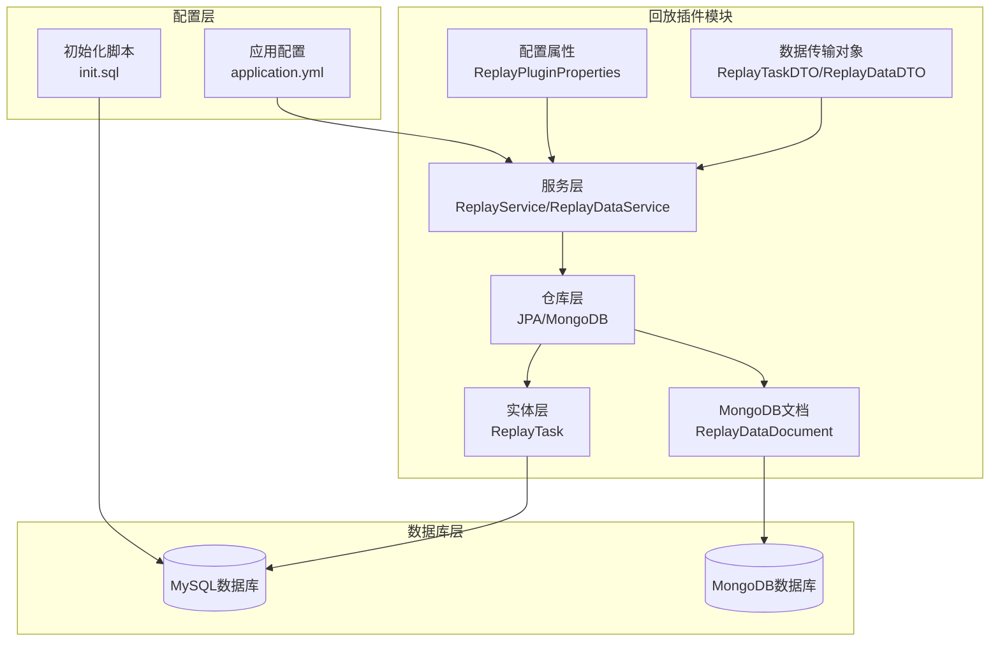
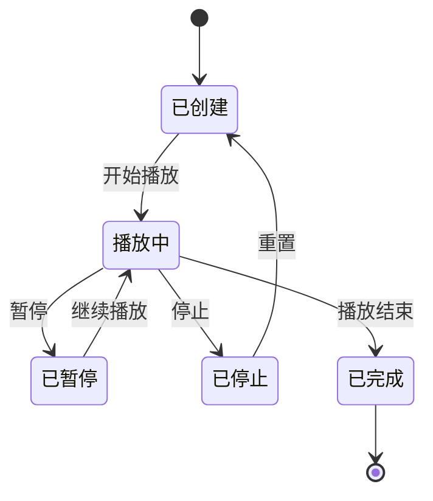
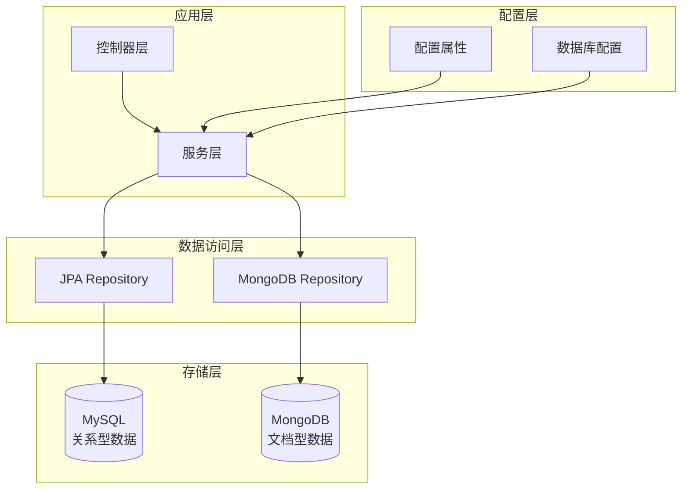
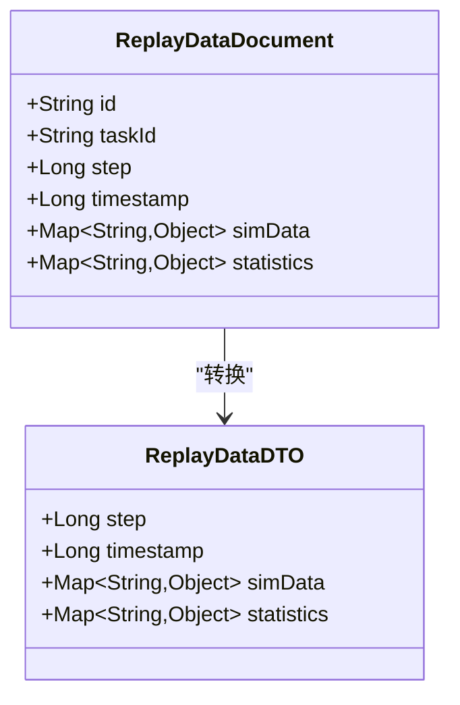
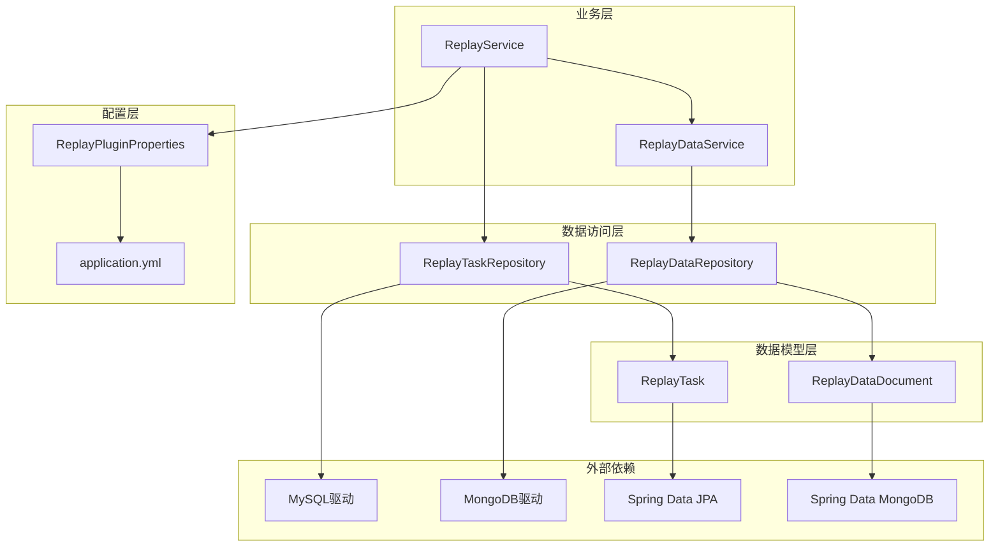
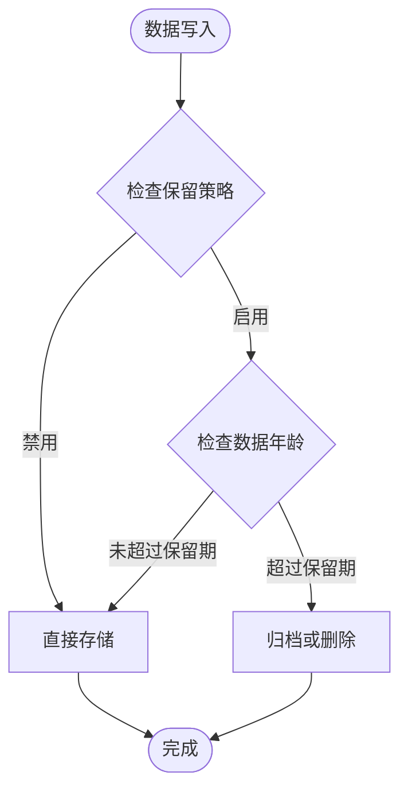

# 数据模型

<cite>
**本文档引用的文件**
- [ReplayTask.java](file://plugins/plugin-engine-replay/src/main/java/com/traffic/sim/plugin/replay/entity/ReplayTask.java)
- [ReplayDataDocument.java](file://plugins/plugin-engine-replay/src/main/java/com/traffic/sim/plugin/replay/document/ReplayDataDocument.java)
- [ReplayTaskRepository.java](file://plugins/plugin-engine-replay/src/main/java/com/traffic/sim/plugin/replay/repository/ReplayTaskRepository.java)
- [ReplayDataRepository.java](file://plugins/plugin-engine-replay/src/main/java/com/traffic/sim/plugin/replay/repository/ReplayDataRepository.java)
- [ReplayServiceImpl.java](file://plugins/plugin-engine-replay/src/main/java/com/traffic/sim/plugin/replay/service/ReplayServiceImpl.java)
- [ReplayDataService.java](file://plugins/plugin-engine-replay/src/main/java/com/traffic/sim/plugin/replay/service/ReplayDataService.java)
- [ReplayPluginProperties.java](file://plugins/plugin-engine-replay/src/main/java/com/traffic/sim/plugin/replay/config/ReplayPluginProperties.java)
- [init.sql](file://infrastructure/init.sql)
- [application.yml](file://traffic-sim-server/src/main/resources/application.yml)
- [ReplayDataDTO.java](file://plugins/plugin-engine-replay/src/main/java/com/traffic/sim/plugin/replay/dto/ReplayDataDTO.java)
- [ReplayTaskDTO.java](file://plugins/plugin-engine-replay/src/main/java/com/traffic/sim/plugin/replay/dto/ReplayTaskDTO.java)
</cite>

## 目录
1. [简介](#简介)
2. [项目结构](#项目结构)
3. [核心组件](#核心组件)
4. [架构概览](#架构概览)
5. [详细组件分析](#详细组件分析)
6. [依赖关系分析](#依赖关系分析)
7. [性能考虑](#性能考虑)
8. [故障排除指南](#故障排除指南)
9. [结论](#结论)

## 简介

本文档提供了交通仿真系统中数据模型的全面分析，重点涵盖了MySQL和MongoDB两种存储引擎中的数据结构设计。文档详细描述了`ReplayTask`实体的字段定义、约束条件及其业务含义，深入解析了`ReplayDataDocument`在MongoDB中的存储结构，特别是`simData`和`statistics`字段的嵌套结构设计与大数据存储优化策略。同时，基于`replay_task`表的DDL语句分析了查询性能优化点，并提供了数据保留策略与归档机制的实现建议。

## 项目结构

交通仿真系统的数据模型主要分布在以下模块中：



**图表来源**
- [ReplayTask.java](file://plugins/plugin-engine-replay/src/main/java/com/traffic/sim/plugin/replay/entity/ReplayTask.java#L15-L102)
- [ReplayDataDocument.java](file://plugins/plugin-engine-replay/src/main/java/com/traffic/sim/plugin/replay/document/ReplayDataDocument.java#L14-L47)
- [application.yml](file://traffic-sim-server/src/main/resources/application.yml#L1-L117)

**章节来源**
- [ReplayTask.java](file://plugins/plugin-engine-replay/src/main/java/com/traffic/sim/plugin/replay/entity/ReplayTask.java#L1-L102)
- [ReplayDataDocument.java](file://plugins/plugin-engine-replay/src/main/java/com/traffic/sim/plugin/replay/document/ReplayDataDocument.java#L1-L47)
- [application.yml](file://traffic-sim-server/src/main/resources/application.yml#L1-L117)

## 核心组件

### ReplayTask 实体（MySQL）

`ReplayTask`是回放任务的核心实体，采用JPA注解映射到MySQL数据库的`replay_task`表。该实体定义了回放任务的所有关键属性和业务逻辑。

**主要字段定义：**

| 字段名 | 类型 | 约束 | 描述 |
|--------|------|------|------|
| task_id | VARCHAR(64) | 主键 | 回放任务唯一标识符 |
| simulation_task_id | VARCHAR(64) | 非空 | 关联的仿真任务ID |
| name | VARCHAR(255) | 非空 | 回放任务名称 |
| status | VARCHAR(20) | 非空 | 任务状态（CREATED/PLAYING/PAUSED/STOPPED/FINISHED） |
| current_step | BIGINT | 可为空 | 当前播放步数 |
| total_steps | BIGINT | 可为空 | 总步数 |
| playback_speed | DOUBLE | 可为空 | 播放速度（倍速） |
| user_id | BIGINT | 非空 | 创建用户ID |
| create_time | DATETIME | 非空，不可更新 | 创建时间 |
| update_time | DATETIME | 非空 | 更新时间 |

**状态枚举 ReplayStatus：**



**图表来源**
- [ReplayTask.java](file://plugins/plugin-engine-replay/src/main/java/com/traffic/sim/plugin/replay/entity/ReplayTask.java#L77-L99)

**章节来源**
- [ReplayTask.java](file://plugins/plugin-engine-replay/src/main/java/com/traffic/sim/plugin/replay/entity/ReplayTask.java#L15-L102)
- [init.sql](file://infrastructure/init.sql#L157-L173)

### ReplayDataDocument（MongoDB）

`ReplayDataDocument`是回放数据在MongoDB中的文档结构，专门用于存储大规模的仿真数据和统计数据。

**字段定义：**

| 字段名 | 类型 | 描述 |
|--------|------|------|
| id | ObjectId | 文档唯一标识符 |
| taskId | String | 关联的回放任务ID |
| step | Long | 仿真步数 |
| timestamp | Long | 时间戳（毫秒） |
| simData | Map<String, Object> | 仿真数据（动态结构） |
| statistics | Map<String, Object> | 统计数据（动态结构） |

**章节来源**
- [ReplayDataDocument.java](file://plugins/plugin-engine-replay/src/main/java/com/traffic/sim/plugin/replay/document/ReplayDataDocument.java#L14-L47)
- [ReplayDataService.java](file://plugins/plugin-engine-replay/src/main/java/com/traffic/sim/plugin/replay/service/ReplayDataService.java#L37-L48)

## 架构概览

系统采用混合存储架构，结合MySQL的关系型数据和MongoDB的文档型数据优势：



**图表来源**
- [ReplayServiceImpl.java](file://plugins/plugin-engine-replay/src/main/java/com/traffic/sim/plugin/replay/service/ReplayServiceImpl.java#L30-L34)
- [ReplayDataService.java](file://plugins/plugin-engine-replay/src/main/java/com/traffic/sim/plugin/replay/service/ReplayDataService.java#L25-L27)

## 详细组件分析

### MySQL 数据模型分析

#### 表结构设计

基于DDL语句分析，`replay_task`表采用了合理的索引策略来优化查询性能：

```mermaid
erDiagram
REPLAY_TASK {
VARCHAR task_id PK
VARCHAR simulation_task_id
VARCHAR name
VARCHAR status
BIGINT current_step
BIGINT total_steps
DOUBLE playback_speed
BIGINT user_id
DATETIME create_time
DATETIME update_time
}
INDEX idx_simulation_task_id ON REPLAY_TASK(simulation_task_id)
INDEX idx_user_id ON REPLAY_TASK(user_id)
INDEX idx_status ON REPLAY_TASK(status)
```

**图表来源**
- [init.sql](file://infrastructure/init.sql#L157-L173)

#### 索引优化策略

1. **simulation_task_id 索引**：优化按仿真任务ID查询回放任务的性能
2. **user_id 索引**：支持用户维度的数据查询和权限验证
3. **status 索引**：加速按状态过滤的任务查询

**章节来源**
- [init.sql](file://infrastructure/init.sql#L157-L173)
- [ReplayTaskRepository.java](file://plugins/plugin-engine-replay/src/main/java/com/traffic/sim/plugin/replay/repository/ReplayTaskRepository.java#L20-L46)

### MongoDB 数据模型分析

#### 文档结构设计

`ReplayDataDocument`采用扁平化的设计，将仿真数据和统计数据作为独立的Map结构存储：



**图表来源**
- [ReplayDataDocument.java](file://plugins/plugin-engine-replay/src/main/java/com/traffic/sim/plugin/replay/document/ReplayDataDocument.java#L16-L45)
- [ReplayDataDTO.java](file://plugins/plugin-engine-replay/src/main/java/com/traffic/sim/plugin/replay/dto/ReplayDataDTO.java#L14-L37)

#### 大数据存储优化

系统实现了多项优化策略来处理大规模仿真数据：

1. **分批存储**：通过批量API减少网络往返开销
2. **内存优化**：使用流式处理避免内存溢出
3. **时间戳管理**：统一的时间戳格式便于排序和查询

**章节来源**
- [ReplayDataService.java](file://plugins/plugin-engine-replay/src/main/java/com/traffic/sim/plugin/replay/service/ReplayDataService.java#L56-L70)

### 配置管理分析

#### 存储配置

系统提供了灵活的配置选项来管理数据存储行为：

| 配置项 | 类型 | 默认值 | 描述 |
|--------|------|--------|------|
| plugin.replay.storage.compressionEnabled | Boolean | true | 是否启用数据压缩 |
| plugin.replay.storage.compressionAlgorithm | String | gzip | 压缩算法类型 |
| plugin.replay.storage.retentionDays | Integer | 30 | 数据保留天数 |
| plugin.replay.replay.defaultSpeed | Double | 1.0 | 默认播放速度 |
| plugin.replay.replay.maxSpeed | Double | 10.0 | 最大播放速度 |
| plugin.replay.replay.minSpeed | Double | 0.1 | 最小播放速度 |
| plugin.replay.replay.batchStepSize | Integer | 100 | 批量查询步数 |

**章节来源**
- [ReplayPluginProperties.java](file://plugins/plugin-engine-replay/src/main/java/com/traffic/sim/plugin/replay/config/ReplayPluginProperties.java#L16-L67)

## 依赖关系分析

系统各组件之间的依赖关系体现了清晰的分层架构：



**图表来源**
- [ReplayServiceImpl.java](file://plugins/plugin-engine-replay/src/main/java/com/traffic/sim/plugin/replay/service/ReplayServiceImpl.java#L32-L34)
- [ReplayDataService.java](file://plugins/plugin-engine-replay/src/main/java/com/traffic/sim/plugin/replay/service/ReplayDataService.java#L27-L27)

**章节来源**
- [ReplayServiceImpl.java](file://plugins/plugin-engine-replay/src/main/java/com/traffic/sim/plugin/replay/service/ReplayServiceImpl.java#L30-L34)
- [ReplayDataService.java](file://plugins/plugin-engine-replay/src/main/java/com/traffic/sim/plugin/replay/service/ReplayDataService.java#L25-L27)

## 性能考虑

### 查询性能优化

基于现有的索引设计，系统在以下场景具有良好的查询性能：

1. **按用户ID查询**：利用`idx_user_id`索引，支持用户维度的数据筛选
2. **按仿真任务ID查询**：利用`idx_simulation_task_id`索引，快速定位相关回放任务
3. **按状态过滤**：利用`idx_status`索引，高效筛选特定状态的任务

### 存储性能优化

针对MongoDB存储，系统实现了以下优化策略：

1. **批量写入**：通过批量API减少网络开销
2. **内存管理**：流式处理避免大量数据加载到内存
3. **索引设计**：在`taskId`和`step`上建立合适的索引以优化查询

### 数据保留策略

系统提供了灵活的数据保留机制：



**图表来源**
- [ReplayPluginProperties.java](file://plugins/plugin-engine-replay/src/main/java/com/traffic/sim/plugin/replay/config/ReplayPluginProperties.java#L41-L43)

## 故障排除指南

### 常见问题及解决方案

1. **数据查询超时**
   - 检查MongoDB连接配置
   - 优化查询参数，避免全表扫描
   - 考虑添加适当的索引

2. **内存溢出错误**
   - 减少单次查询的数据量
   - 使用分页查询
   - 调整批量处理大小

3. **权限验证失败**
   - 确认用户ID与任务ID的关联关系
   - 检查数据库连接和事务配置

**章节来源**
- [ReplayServiceImpl.java](file://plugins/plugin-engine-replay/src/main/java/com/traffic/sim/plugin/replay/service/ReplayServiceImpl.java#L64-L68)
- [ReplayServiceImpl.java](file://plugins/plugin-engine-replay/src/main/java/com/traffic/sim/plugin/replay/service/ReplayServiceImpl.java#L90-L97)

## 结论

本数据模型文档全面分析了交通仿真系统中MySQL和MongoDB的数据结构设计。通过合理的索引策略、灵活的配置管理和优化的大数据存储方案，系统能够高效地处理大规模仿真数据的存储和查询需求。

关键设计亮点包括：
- 清晰的分层架构和职责分离
- 针对不同数据类型的最优存储选择
- 灵活的配置管理机制
- 完善的性能优化策略

这些设计为系统的可扩展性和维护性奠定了坚实的基础，能够满足交通仿真场景下的各种数据管理需求。