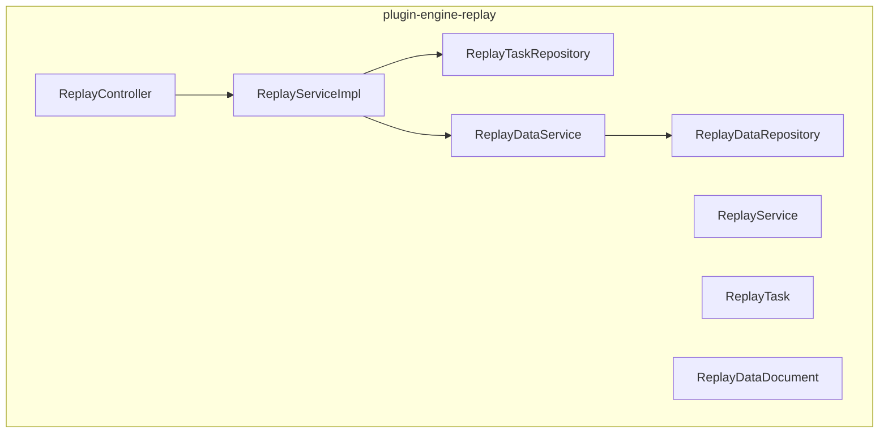
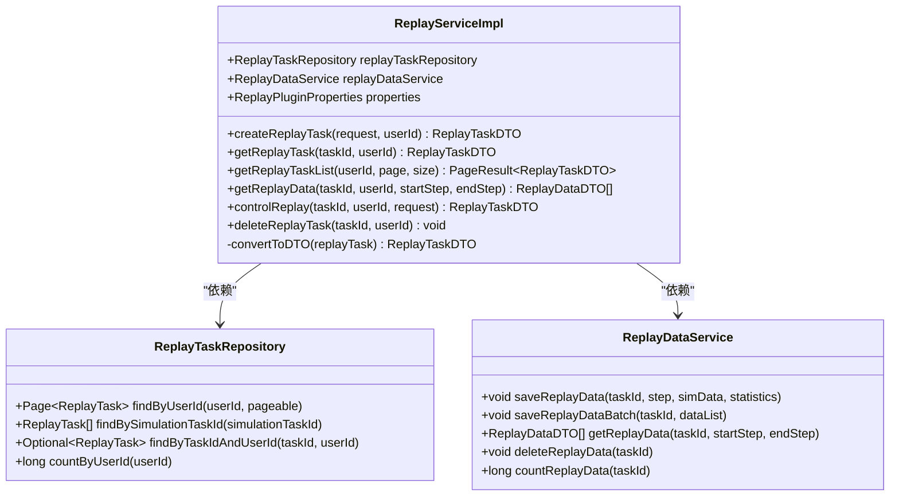
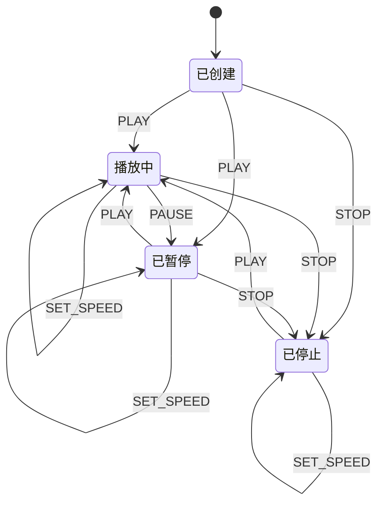
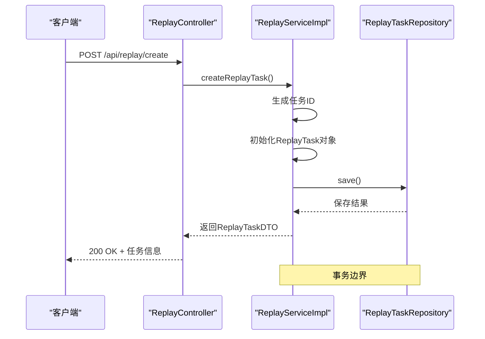
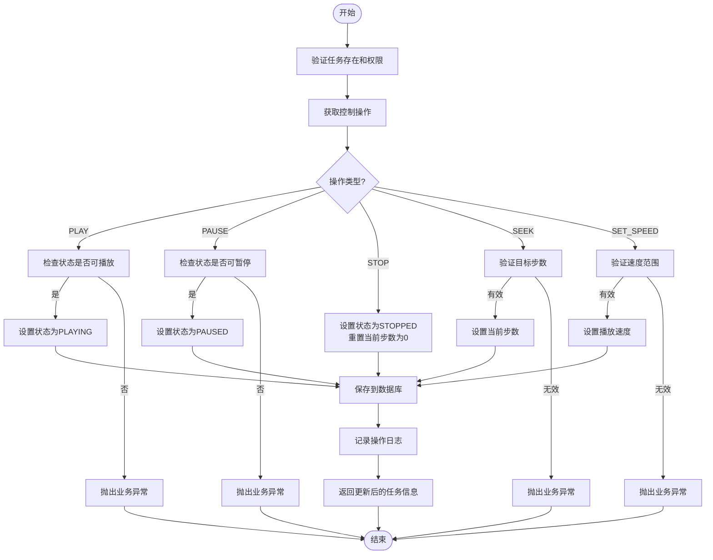
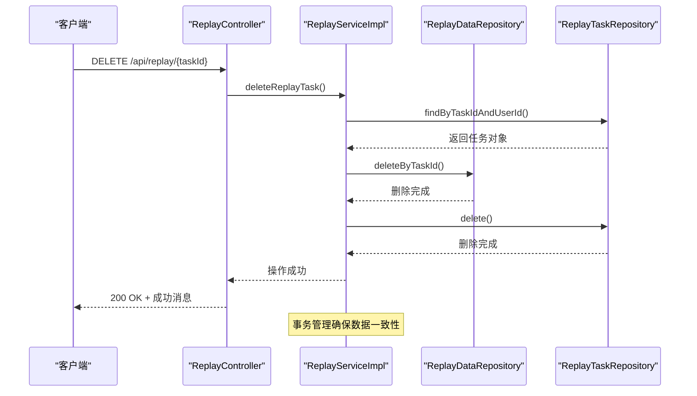
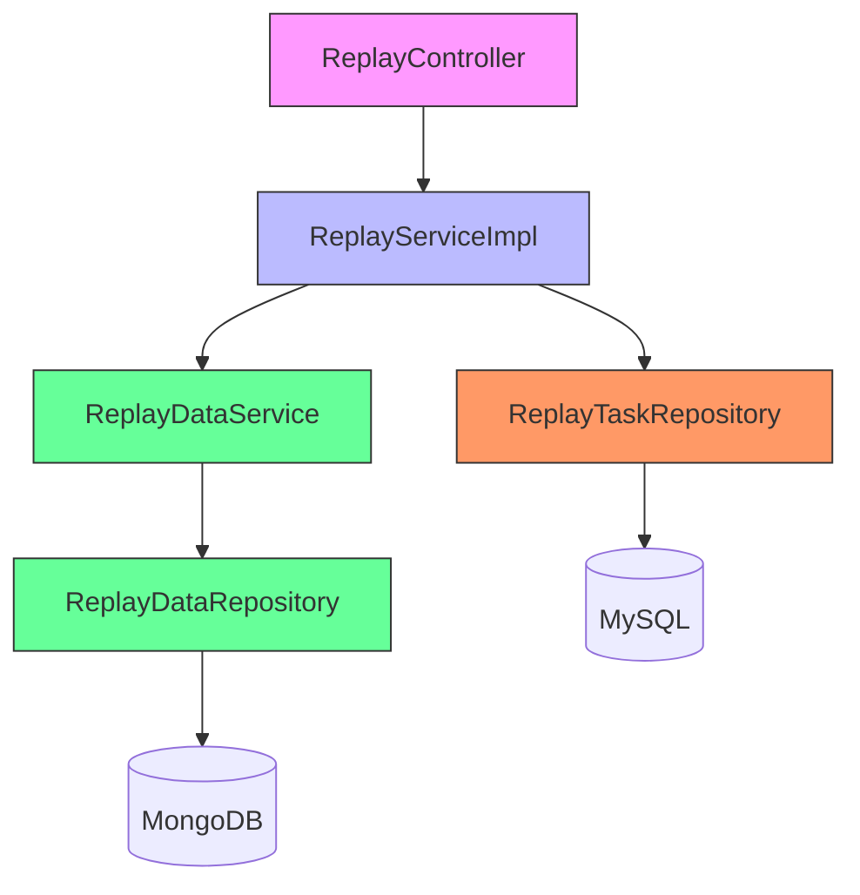

# 核心流程

<cite>
**本文档中引用的文件**  
- [ReplayServiceImpl.java](file://plugins/plugin-engine-replay/src/main/java/com/traffic/sim/plugin/replay/service/ReplayServiceImpl.java)
- [ReplayTask.java](file://plugins/plugin-engine-replay/src/main/java/com/traffic/sim/plugin/replay/entity/ReplayTask.java)
- [ReplayTaskRepository.java](file://plugins/plugin-engine-replay/src/main/java/com/traffic/sim/plugin/replay/repository/ReplayTaskRepository.java)
- [ReplayDataService.java](file://plugins/plugin-engine-replay/src/main/java/com/traffic/sim/plugin/replay/service/ReplayDataService.java)
- [ReplayDataRepository.java](file://plugins/plugin-engine-replay/src/main/java/com/traffic/sim/plugin/replay/repository/ReplayDataRepository.java)
- [ReplayDataDocument.java](file://plugins/plugin-engine-replay/src/main/java/com/traffic/sim/plugin/replay/document/ReplayDataDocument.java)
- [ReplayController.java](file://plugins/plugin-engine-replay/src/main/java/com/traffic/sim/plugin/replay/controller/ReplayController.java)
- [ReplayPluginProperties.java](file://plugins/plugin-engine-replay/src/main/java/com/traffic/sim/plugin/replay/config/ReplayPluginProperties.java)
- [init.sql](file://infrastructure/init.sql)
- [init-mongo.js](file://infrastructure/mongodb/init-mongo.js)
</cite>

## 目录
1. [简介](#简介)
2. [项目结构](#项目结构)
3. [核心组件](#核心组件)
4. [架构概述](#架构概述)
5. [详细组件分析](#详细组件分析)
6. [依赖分析](#依赖分析)
7. [性能考虑](#性能考虑)
8. [故障排除指南](#故障排除指南)
9. [结论](#结论)

## 简介
本文档详细阐述了交通仿真系统中数据回放功能的核心流程。重点分析了从创建回放任务到控制回放全过程的实现机制，包括`ReplayServiceImpl`中`createReplayTask`、`controlReplay`和`deleteReplayTask`等方法的业务逻辑与事务管理。文档还说明了任务状态机的转换规则、服务层如何协调MySQL与MongoDB的数据一致性，以及在异常情况下的回滚策略。

## 项目结构
数据回放功能主要位于`plugin-engine-replay`插件模块中，采用分层架构设计，包含控制器层、服务层、数据访问层和实体层。系统使用MySQL存储任务元数据，使用MongoDB存储回放数据，实现了结构化与非结构化数据的分离存储。



**图示来源**  
- [ReplayController.java](file://plugins/plugin-engine-replay/src/main/java/com/traffic/sim/plugin/replay/controller/ReplayController.java)
- [ReplayServiceImpl.java](file://plugins/plugin-engine-replay/src/main/java/com/traffic/sim/plugin/replay/service/ReplayServiceImpl.java)
- [ReplayTaskRepository.java](file://plugins/plugin-engine-replay/src/main/java/com/traffic/sim/plugin/replay/repository/ReplayTaskRepository.java)
- [ReplayDataRepository.java](file://plugins/plugin-engine-replay/src/main/java/com/traffic/sim/plugin/replay/repository/ReplayDataRepository.java)

**本节来源**  
- [ReplayServiceImpl.java](file://plugins/plugin-engine-replay/src/main/java/com/traffic/sim/plugin/replay/service/ReplayServiceImpl.java)
- [ReplayTask.java](file://plugins/plugin-engine-replay/src/main/java/com/traffic/sim/plugin/replay/entity/ReplayTask.java)

## 核心组件
核心组件包括回放任务管理服务`ReplayServiceImpl`、回放任务实体`ReplayTask`、MySQL任务仓库`ReplayTaskRepository`和MongoDB数据仓库`ReplayDataRepository`。这些组件协同工作，实现了回放任务的全生命周期管理。

**本节来源**  
- [ReplayServiceImpl.java](file://plugins/plugin-engine-replay/src/main/java/com/traffic/sim/plugin/replay/service/ReplayServiceImpl.java)
- [ReplayTask.java](file://plugins/plugin-engine-replay/src/main/java/com/traffic/sim/plugin/replay/entity/ReplayTask.java)
- [ReplayTaskRepository.java](file://plugins/plugin-engine-replay/src/main/java/com/traffic/sim/plugin/replay/repository/ReplayTaskRepository.java)
- [ReplayDataRepository.java](file://plugins/plugin-engine-replay/src/main/java/com/traffic/sim/plugin/replay/repository/ReplayDataRepository.java)

## 架构概述
系统采用微服务架构，通过`plugin-engine-replay`插件提供回放功能。架构分为三层：表现层处理HTTP请求，业务逻辑层处理核心业务，数据访问层负责与MySQL和MongoDB交互。这种分层设计确保了系统的可维护性和可扩展性。

```mermaid
graph TB
Client[客户端] --> API[API接口]
API --> Controller[ReplayController]
Controller --> Service[ReplayService]
Service --> TaskDB[(MySQL)]
Service --> DataDB[(MongoDB)]
subgraph "数据存储"
TaskDB[replay_task表]
DataDB[replay_data集合]
end
subgraph "业务逻辑"
Service[ReplayServiceImpl]
DataService[ReplayDataService]
end
subgraph "表现层"
Controller[ReplayController]
API[/api/replay/*]
end
```

**图示来源**  
- [ReplayController.java](file://plugins/plugin-engine-replay/src/main/java/com/traffic/sim/plugin/replay/controller/ReplayController.java)
- [ReplayServiceImpl.java](file://plugins/plugin-engine-replay/src/main/java/com/traffic/sim/plugin/replay/service/ReplayServiceImpl.java)
- [init.sql](file://infrastructure/init.sql)
- [init-mongo.js](file://infrastructure/mongodb/init-mongo.js)

## 详细组件分析

### 回放服务实现分析
`ReplayServiceImpl`是回放功能的核心服务类，实现了回放任务的创建、控制和删除等关键操作。该类使用Spring事务管理确保数据一致性。

#### 服务类结构


**图示来源**  
- [ReplayServiceImpl.java](file://plugins/plugin-engine-replay/src/main/java/com/traffic/sim/plugin/replay/service/ReplayServiceImpl.java)
- [ReplayTaskRepository.java](file://plugins/plugin-engine-replay/src/main/java/com/traffic/sim/plugin/replay/repository/ReplayTaskRepository.java)
- [ReplayDataService.java](file://plugins/plugin-engine-replay/src/main/java/com/traffic/sim/plugin/replay/service/ReplayDataService.java)

**本节来源**  
- [ReplayServiceImpl.java](file://plugins/plugin-engine-replay/src/main/java/com/traffic/sim/plugin/replay/service/ReplayServiceImpl.java)

#### 任务状态机


**图示来源**  
- [ReplayTask.java](file://plugins/plugin-engine-replay/src/main/java/com/traffic/sim/plugin/replay/entity/ReplayTask.java)
- [ReplayServiceImpl.java](file://plugins/plugin-engine-replay/src/main/java/com/traffic/sim/plugin/replay/service/ReplayServiceImpl.java)

### 创建回放任务流程
创建回放任务的流程涉及生成任务ID、初始化任务状态、保存到MySQL数据库等步骤。该操作使用事务管理确保数据一致性。



**图示来源**  
- [ReplayController.java](file://plugins/plugin-engine-replay/src/main/java/com/traffic/sim/plugin/replay/controller/ReplayController.java)
- [ReplayServiceImpl.java](file://plugins/plugin-engine-replay/src/main/java/com/traffic/sim/plugin/replay/service/ReplayServiceImpl.java)
- [ReplayTaskRepository.java](file://plugins/plugin-engine-replay/src/main/java/com/traffic/sim/plugin/replay/repository/ReplayTaskRepository.java)

**本节来源**  
- [ReplayServiceImpl.java](file://plugins/plugin-engine-replay/src/main/java/com/traffic/sim/plugin/replay/service/ReplayServiceImpl.java)

### 控制回放流程
控制回放操作包括播放、暂停、停止、跳转和设置速度等，系统通过状态机校验确保操作的合法性。



**图示来源**  
- [ReplayServiceImpl.java](file://plugins/plugin-engine-replay/src/main/java/com/traffic/sim/plugin/replay/service/ReplayServiceImpl.java)
- [ReplayTask.java](file://plugins/plugin-engine-replay/src/main/java/com/traffic/sim/plugin/replay/entity/ReplayTask.java)

**本节来源**  
- [ReplayServiceImpl.java](file://plugins/plugin-engine-replay/src/main/java/com/traffic/sim/plugin/replay/service/ReplayServiceImpl.java)

### 删除回放任务流程
删除回放任务需要同时清理MySQL中的任务记录和MongoDB中的回放数据，确保数据完整性。



**图示来源**  
- [ReplayServiceImpl.java](file://plugins/plugin-engine-replay/src/main/java/com/traffic/sim/plugin/replay/service/ReplayServiceImpl.java)
- [ReplayDataRepository.java](file://plugins/plugin-engine-replay/src/main/java/com/traffic/sim/plugin/replay/repository/ReplayDataRepository.java)
- [ReplayTaskRepository.java](file://plugins/plugin-engine-replay/src/main/java/com/traffic/sim/plugin/replay/repository/ReplayTaskRepository.java)

**本节来源**  
- [ReplayServiceImpl.java](file://plugins/plugin-engine-replay/src/main/java/com/traffic/sim/plugin/replay/service/ReplayServiceImpl.java)

## 依赖分析
系统依赖关系清晰，各组件职责分明。`ReplayController`依赖`ReplayServiceImpl`，`ReplayServiceImpl`依赖`ReplayTaskRepository`和`ReplayDataService`，形成典型的分层依赖结构。



**图示来源**  
- [ReplayController.java](file://plugins/plugin-engine-replay/src/main/java/com/traffic/sim/plugin/replay/controller/ReplayController.java)
- [ReplayServiceImpl.java](file://plugins/plugin-engine-replay/src/main/java/com/traffic/sim/plugin/replay/service/ReplayServiceImpl.java)
- [ReplayTaskRepository.java](file://plugins/plugin-engine-replay/src/main/java/com/traffic/sim/plugin/replay/repository/ReplayTaskRepository.java)
- [ReplayDataRepository.java](file://plugins/plugin-engine-replay/src/main/java/com/traffic/sim/plugin/replay/repository/ReplayDataRepository.java)

**本节来源**  
- [ReplayServiceImpl.java](file://plugins/plugin-engine-replay/src/main/java/com/traffic/sim/plugin/replay/service/ReplayServiceImpl.java)
- [ReplayTaskRepository.java](file://plugins/plugin-engine-replay/src/main/java/com/traffic/sim/plugin/replay/repository/ReplayTaskRepository.java)
- [ReplayDataRepository.java](file://plugins/plugin-engine-replay/src/main/java/com/traffic/sim/plugin/replay/repository/ReplayDataRepository.java)

## 性能考虑
在高并发场景下，建议对回放任务创建和控制操作进行优化。可以通过缓存常用配置、批量处理数据、优化数据库索引等方式提升性能。同时，合理配置MongoDB的查询参数，避免全表扫描。

**本节来源**  
- [ReplayPluginProperties.java](file://plugins/plugin-engine-replay/src/main/java/com/traffic/sim/plugin/replay/config/ReplayPluginProperties.java)
- [ReplayServiceImpl.java](file://plugins/plugin-engine-replay/src/main/java/com/traffic/sim/plugin/replay/service/ReplayServiceImpl.java)

## 故障排除指南
当回放功能出现问题时，首先检查MySQL和MongoDB的连接状态。查看日志文件中的错误信息，重点关注事务回滚、权限验证失败和数据一致性问题。对于状态转换异常，检查状态机规则是否正确执行。

**本节来源**  
- [ReplayServiceImpl.java](file://plugins/plugin-engine-replay/src/main/java/com/traffic/sim/plugin/replay/service/ReplayServiceImpl.java)
- [ReplayTask.java](file://plugins/plugin-engine-replay/src/main/java/com/traffic/sim/plugin/replay/entity/ReplayTask.java)

## 结论
本文档详细分析了交通仿真系统中数据回放功能的核心流程。系统通过合理的架构设计和事务管理，确保了回放任务的可靠性和数据一致性。`ReplayServiceImpl`作为核心服务类，实现了任务的全生命周期管理，包括创建、控制和删除等操作。通过MySQL和MongoDB的协同工作，系统实现了结构化元数据和非结构化回放数据的有效分离存储。