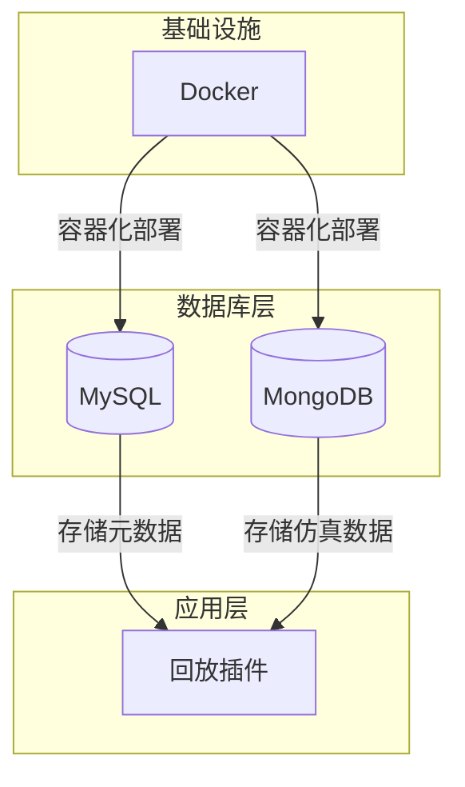
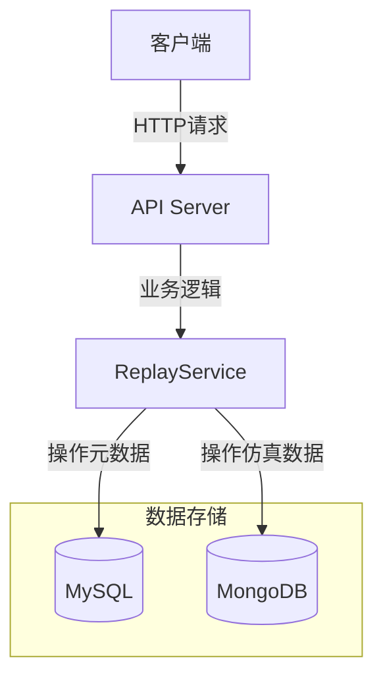
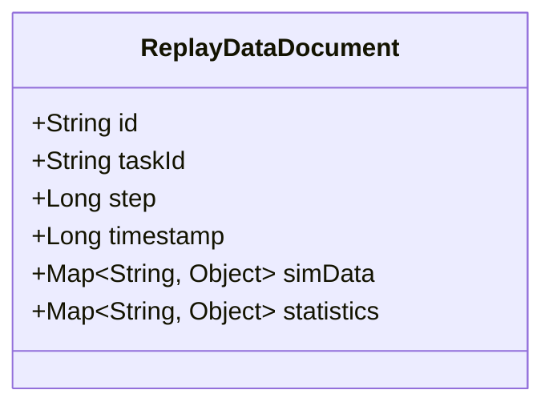
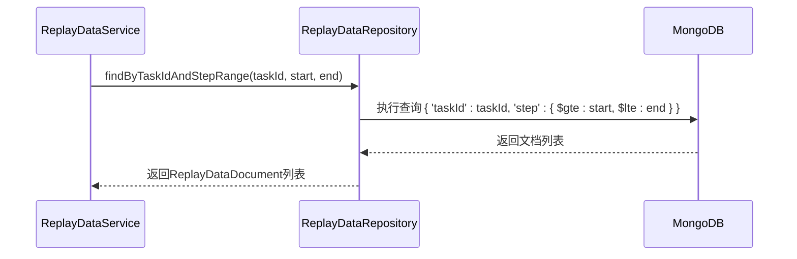
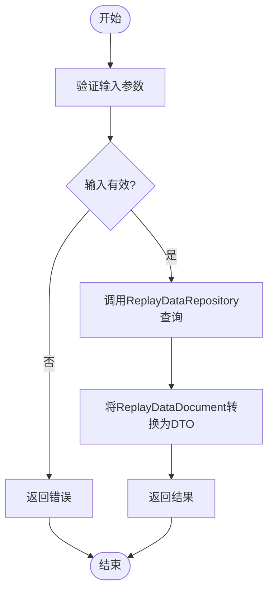
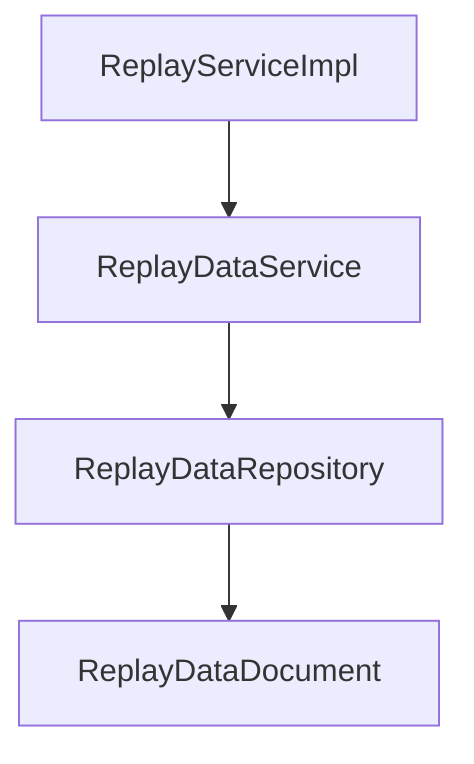

# MongoDB数据模型

<cite>
**本文档引用的文件**   
- [ReplayDataDocument.java](file://plugins/plugin-engine-replay/src/main/java/com/traffic/sim/plugin/replay/document/ReplayDataDocument.java)
- [ReplayDataRepository.java](file://plugins/plugin-engine-replay/src/main/java/com/traffic/sim/plugin/replay/repository/ReplayDataRepository.java)
- [ReplayDataService.java](file://plugins/plugin-engine-replay/src/main/java/com/traffic/sim/plugin/replay/service/ReplayDataService.java)
- [ReplayTask.java](file://plugins/plugin-engine-replay/src/main/java/com/traffic/sim/plugin/replay/entity/ReplayTask.java)
- [init-mongo.js](file://infrastructure/mongodb/init-mongo.js)
- [application.yml](file://traffic-sim-server/src/main/resources/application.yml)
- [init.sql](file://infrastructure/init.sql)
</cite>

## 目录
1. [引言](#引言)
2. [项目结构](#项目结构)
3. [核心组件](#核心组件)
4. [架构概述](#架构概述)
5. [详细组件分析](#详细组件分析)
6. [依赖分析](#依赖分析)
7. [性能考虑](#性能考虑)
8. [故障排除指南](#故障排除指南)
9. [结论](#结论)

## 引言
本文档深入解析了交通仿真系统中用于存储仿真回放数据的MongoDB数据模型，重点分析`ReplayDataDocument`的设计与实现。文档详细说明了为何选择MongoDB作为存储方案，包括其对非结构化数据、高写入吞吐量和灵活文档模式的支持。同时，文档涵盖了数据模型的结构、Spring Data MongoDB注解的使用、集合的分片与索引策略，以及其在数据回放服务中的具体应用场景。

## 项目结构
项目采用微服务架构，其中`plugin-engine-replay`模块专门负责仿真回放功能。该模块使用MySQL存储任务的元数据（如`replay_task`表），而将海量的、结构灵活的仿真过程数据存储在MongoDB中。

**图示来源**
- [init.sql](file://infrastructure/init.sql#L157-L173)
- [init-mongo.js](file://infrastructure/mongodb/init-mongo.js#L19-L21)

**本节来源**
- [init.sql](file://infrastructure/init.sql#L157-L173)
- [init-mongo.js](file://infrastructure/mongodb/init-mongo.js#L19-L21)

## 核心组件
核心组件包括`ReplayDataDocument`（MongoDB文档实体）、`ReplayDataRepository`（数据访问接口）和`ReplayDataService`（业务服务）。`ReplayDataDocument`定义了存储在`replay_data`集合中的数据结构，`ReplayDataRepository`提供了对MongoDB的CRUD操作，而`ReplayDataService`则封装了业务逻辑，如批量保存和范围查询。

**本节来源**
- [ReplayDataDocument.java](file://plugins/plugin-engine-replay/src/main/java/com/traffic/sim/plugin/replay/document/ReplayDataDocument.java#L1-L46)
- [ReplayDataRepository.java](file://plugins/plugin-engine-replay/src/main/java/com/traffic/sim/plugin/replay/repository/ReplayDataRepository.java#L1-L40)
- [ReplayDataService.java](file://plugins/plugin-engine-replay/src/main/java/com/traffic/sim/plugin/replay/service/ReplayDataService.java#L1-L121)

## 架构概述
系统采用混合数据库架构，MySQL用于存储结构化、需要强一致性和事务支持的元数据，而MongoDB则用于存储半结构化、写入密集型的仿真过程数据。这种架构实现了数据存储的优化，既保证了核心业务数据的可靠性，又满足了高性能数据写入和灵活查询的需求。

**图示来源**
- [ReplayTask.java](file://plugins/plugin-engine-replay/src/main/java/com/traffic/sim/plugin/replay/entity/ReplayTask.java#L1-L102)
- [ReplayDataDocument.java](file://plugins/plugin-engine-replay/src/main/java/com/traffic/sim/plugin/replay/document/ReplayDataDocument.java#L1-L46)

## 详细组件分析

### ReplayDataDocument分析
`ReplayDataDocument`是存储在MongoDB中的核心文档，代表了仿真过程中的一个时间步的数据。

#### 类图

**图示来源**
- [ReplayDataDocument.java](file://plugins/plugin-engine-replay/src/main/java/com/traffic/sim/plugin/replay/document/ReplayDataDocument.java#L1-L46)

#### 字段说明
- `id`: 由Spring Data MongoDB自动生成的唯一标识符，对应MongoDB的`_id`字段。
- `taskId`: 回放任务ID，作为主要的查询条件，用于将所有属于同一任务的数据关联起来。
- `step`: 仿真步数，表示该数据点在仿真过程中的时间序列位置。
- `timestamp`: 数据生成的时间戳（毫秒），可用于时间序列分析。
- `simData`: 存储原始的仿真数据，是一个`Map<String, Object>`，可以容纳任意结构的JSON数据，如车辆位置、信号灯状态等。
- `statistics`: 存储该时间步的统计计算结果，也是一个`Map<String, Object>`，如流量、平均速度等。

**本节来源**
- [ReplayDataDocument.java](file://plugins/plugin-engine-replay/src/main/java/com/traffic/sim/plugin/replay/document/ReplayDataDocument.java#L1-L46)

### ReplayDataRepository分析
`ReplayDataRepository`接口扩展了`MongoRepository`，提供了对`replay_data`集合的基本操作，并通过自定义方法支持复杂的查询。

#### 序列图

**图示来源**
- [ReplayDataRepository.java](file://plugins/plugin-engine-replay/src/main/java/com/traffic/sim/plugin/replay/repository/ReplayDataRepository.java#L1-L40)
- [ReplayDataService.java](file://plugins/plugin-engine-replay/src/main/java/com/traffic/sim/plugin/replay/service/ReplayDataService.java#L80-L89)

#### 方法说明
- `findByTaskIdAndStepRange(...)`: 根据任务ID和步数范围查询数据，使用`@Query`注解定义了MongoDB的原生查询语句，是实现时间序列查询的核心。
- `findByTaskId(...)`: 查询某个任务的所有数据。
- `deleteByTaskId(...)`: 删除某个任务的所有相关数据，用于任务清理。
- `countByTaskId(...)`: 统计某个任务的数据条数。

**本节来源**
- [ReplayDataRepository.java](file://plugins/plugin-engine-replay/src/main/java/com/traffic/sim/plugin/replay/repository/ReplayDataRepository.java#L1-L40)

### ReplayDataService分析
`ReplayDataService`是业务逻辑的实现层，它利用`ReplayDataRepository`与MongoDB进行交互。

#### 流程图

**图示来源**
- [ReplayDataService.java](file://plugins/plugin-engine-replay/src/main/java/com/traffic/sim/plugin/replay/service/ReplayDataService.java#L80-L89)

#### 功能说明
- `saveReplayData(...)`: 保存单条回放数据。
- `saveReplayDataBatch(...)`: 批量保存回放数据，通过`saveAll`方法提高写入效率。
- `getReplayData(...)`: 获取回放数据，先调用`ReplayDataRepository`进行查询，然后将`ReplayDataDocument`转换为`ReplayDataDTO`返回给上层。
- `deleteReplayData(...)`: 删除指定任务的所有回放数据。

**本节来源**
- [ReplayDataService.java](file://plugins/plugin-engine-replay/src/main/java/com/traffic/sim/plugin/replay/service/ReplayDataService.java#L1-L121)

## 依赖分析
`ReplayDataDocument`是整个回放数据模块的核心，被`ReplayDataRepository`直接依赖。`ReplayDataRepository`又被`ReplayDataService`依赖，而`ReplayDataService`最终被`ReplayServiceImpl`调用，形成了一条清晰的依赖链。

**图示来源**
- [ReplayServiceImpl.java](file://plugins/plugin-engine-replay/src/main/java/com/traffic/sim/plugin/replay/service/ReplayServiceImpl.java#L33)
- [ReplayDataService.java](file://plugins/plugin-engine-replay/src/main/java/com/traffic/sim/plugin/replay/service/ReplayDataService.java#L27)
- [ReplayDataRepository.java](file://plugins/plugin-engine-replay/src/main/java/com/traffic/sim/plugin/replay/repository/ReplayDataRepository.java#L17)

**本节来源**
- [ReplayServiceImpl.java](file://plugins/plugin-engine-replay/src/main/java/com/traffic/sim/plugin/replay/service/ReplayServiceImpl.java#L33)
- [ReplayDataService.java](file://plugins/plugin-engine-replay/src/main/java/com/traffic/sim/plugin/replay/service/ReplayDataService.java#L27)
- [ReplayDataRepository.java](file://plugins/plugin-engine-replay/src/main/java/com/traffic/sim/plugin/replay/repository/ReplayDataRepository.java#L17)

## 性能考虑
为了优化性能，系统采取了以下策略：
1.  **批量写入**：使用`saveAll`方法进行批量数据插入，显著减少了数据库连接的开销。
2.  **索引优化**：在`taskId`和`step`字段上创建复合索引，可以极大地加速`findByTaskIdAndStepRange`这类范围查询。
3.  **分页查询**：在`getReplayData`方法中使用`Pageable`，避免一次性加载过多数据导致内存溢出。
4.  **连接池**：通过Spring Data MongoDB配置连接池，复用数据库连接，提高并发性能。

## 故障排除指南
- **数据查询缓慢**：检查`replay_data`集合上是否为`taskId`和`step`字段创建了合适的索引。
- **连接失败**：确认`application.yml`中的MongoDB连接字符串（`uri`）配置正确，包括主机、端口、数据库名和认证信息。
- **数据未持久化**：检查`ReplayDataService`中的`save`或`saveAll`方法是否被正确调用，并确认没有抛出异常。

**本节来源**
- [application.yml](file://traffic-sim-server/src/main/resources/application.yml#L28-L39)
- [ReplayDataService.java](file://plugins/plugin-engine-replay/src/main/java/com/traffic/sim/plugin/replay/service/ReplayDataService.java#L47)
- [ReplayDataRepository.java](file://plugins/plugin-engine-replay/src/main/java/com/traffic/sim/plugin/replay/repository/ReplayDataRepository.java#L22)

## 结论
`ReplayDataDocument`的设计充分利用了MongoDB的灵活性和高性能，完美适配了交通仿真回放数据的特点。通过与MySQL中`replay_task`元数据表的关联，系统实现了结构化与非结构化数据的有机结合。`@Document`和`@Id`等Spring Data MongoDB注解的使用，简化了数据访问层的开发。结合合理的索引策略和批量操作，该数据模型能够高效地支持大规模仿真数据的存储、查询和回放，为交通仿真系统的稳定运行提供了坚实的数据基础。