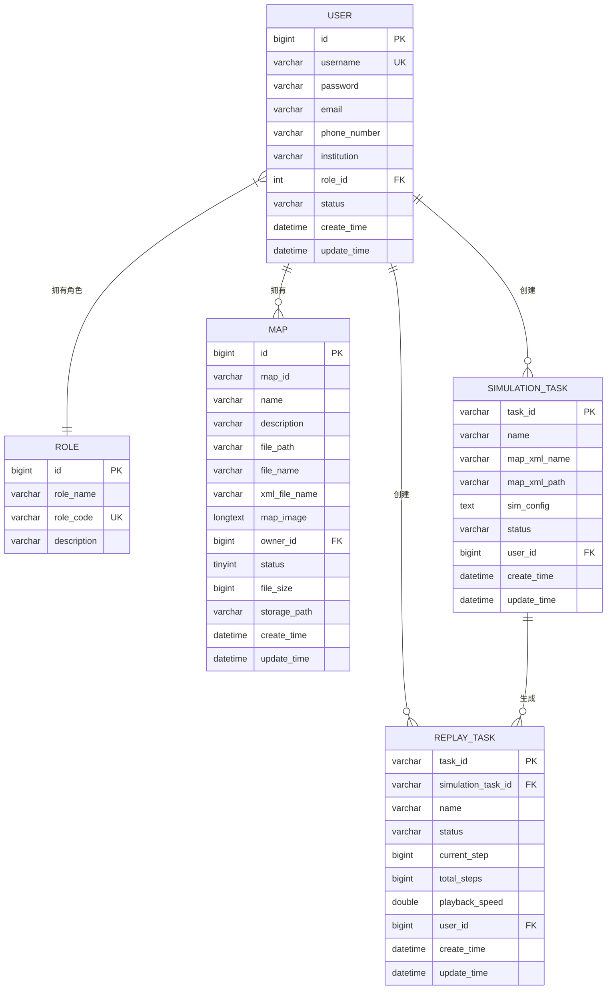

# MySQL数据模型

<cite>
**本文档引用的文件**
- [init.sql](file://infrastructure/init.sql)
- [User.java](file://plugins/plugin-user/src/main/java/com/traffic/sim/plugin/user/entity/User.java)
- [MapEntity.java](file://plugins/plugin-map/src/main/java/com/traffic/sim/plugin/map/entity/MapEntity.java)
- [SimulationTask.java](file://plugins/plugin-simulation/src/main/java/com/traffic/sim/plugin/simulation/entity/SimulationTask.java)
- [ReplayTask.java](file://plugins/plugin-engine-replay/src/main/java/com/traffic/sim/plugin/replay/entity/ReplayTask.java)
- [UserRepository.java](file://plugins/plugin-user/src/main/java/com/traffic/sim/plugin/user/repository/UserRepository.java)
- [MapRepository.java](file://plugins/plugin-map/src/main/java/com/traffic/sim/plugin/map/repository/MapRepository.java)
- [SimulationTaskRepository.java](file://plugins/plugin-simulation/src/main/java/com/traffic/sim/plugin/simulation/repository/SimulationTaskRepository.java)
- [ReplayTaskRepository.java](file://plugins/plugin-engine-replay/src/main/java/com/traffic/sim/plugin/replay/repository/ReplayTaskRepository.java)
</cite>

## 目录
1. [简介](#简介)
2. [核心数据表结构](#核心数据表结构)
3. [实体关系图（ERD）](#实体关系图erd)
4. [JPA对象关系映射](#jpa对象关系映射)
5. [生命周期管理策略](#生命周期管理策略)
6. [典型查询场景与JPA方法](#典型查询场景与jpa方法)
7. [结论](#结论)

## 简介
本文档详细描述了交通仿真系统的MySQL数据模型，基于`init.sql`初始化脚本和相关Java实体类，全面解析了系统中核心数据表的结构设计、字段定义、约束关系以及JPA映射机制。重点分析了`users`、`maps`、`simulation_tasks`、`replay_tasks`等核心表的业务含义和相互关系，为系统开发、维护和优化提供权威的数据模型参考。

## 核心数据表结构

### 用户表 (user)
用户表存储系统所有用户的基本信息和账户状态。

**字段定义：**
- `id` (BIGINT): 主键ID，自增
- `username` (VARCHAR(50)): 用户名，非空且唯一
- `password` (VARCHAR(255)): 加密后的密码，非空
- `email` (VARCHAR(100)): 邮箱地址
- `phone_number` (VARCHAR(20)): 电话号码
- `institution` (VARCHAR(200)): 所属机构
- `role_id` (INT): 角色ID，外键关联`role`表
- `status` (VARCHAR(20)): 用户状态（NORMAL/BANNED/BLOCKED），默认NORMAL
- `create_time` (DATETIME): 创建时间，非空
- `update_time` (DATETIME): 更新时间

**约束与索引：**
- 主键：`PRIMARY KEY (id)`
- 唯一索引：`uk_username (username)`
- 普通索引：`idx_role_id (role_id)`, `idx_status (status)`

**业务含义：**
该表是系统权限控制的基础，通过`role_id`与角色表关联，实现基于角色的访问控制（RBAC）。`status`字段用于账户的启用、禁用等状态管理。

**Section sources**
- [init.sql](file://infrastructure/init.sql#L24-L40)
- [User.java](file://plugins/plugin-user/src/main/java/com/traffic/sim/plugin/user/entity/User.java#L13-L64)

### 地图表 (map)
地图表存储用户上传和管理的地图文件元数据。

**字段定义：**
- `id` (BIGINT): 主键ID，自增
- `map_id` (VARCHAR(255)): MongoDB中存储的原始地图ID
- `name` (VARCHAR(255)): 地图名称，非空
- `description` (VARCHAR(500)): 地图描述
- `file_path` (VARCHAR(500)): 文件系统路径，非空
- `file_name` (VARCHAR(255)): 原始文件名
- `xml_file_name` (VARCHAR(255)): 转换后的XML文件名
- `map_image` (LONGTEXT): 地图缩略图（Base64编码）
- `owner_id` (BIGINT): 所有者用户ID，非空
- `status` (TINYINT): 地图状态（0-公开, 1-私有, 2-禁用），默认1
- `file_size` (BIGINT): 文件大小（字节）
- `storage_path` (VARCHAR(500)): 存储路径
- `create_time` (DATETIME): 创建时间，自动填充
- `update_time` (DATETIME): 更新时间，自动更新

**约束与索引：**
- 主键：`PRIMARY KEY (id)`
- 普通索引：`idx_owner_id (owner_id)`, `idx_status (status)`, `idx_create_time (create_time)`

**业务含义：**
该表实现了用户地图的隔离管理，`owner_id`确保地图归属，`status`字段控制地图的可见性。`map_image`字段存储缩略图，提升前端展示效率。

**Section sources**
- [init.sql](file://infrastructure/init.sql#L87-L107)
- [MapEntity.java](file://plugins/plugin-map/src/main/java/com/traffic/sim/plugin/map/entity/MapEntity.java#L13-L114)

### 仿真任务表 (simulation_task)
仿真任务表记录用户创建的交通仿真任务的配置和状态。

**字段定义：**
- `task_id` (VARCHAR(64)): 任务ID，主键
- `name` (VARCHAR(255)): 仿真名称，非空
- `map_xml_name` (VARCHAR(255)): 地图XML文件名
- `map_xml_path` (VARCHAR(500)): 地图XML文件路径
- `sim_config` (TEXT): 仿真配置（JSON格式）
- `status` (VARCHAR(20)): 任务状态（CREATED/RUNNING/PAUSED/STOPPED/FINISHED），默认CREATED
- `user_id` (BIGINT): 用户ID，非空
- `create_time` (DATETIME): 创建时间，自动填充
- `update_time` (DATETIME): 更新时间，自动更新

**约束与索引：**
- 主键：`PRIMARY KEY (task_id)`
- 普通索引：`idx_user_id (user_id)`, `idx_status (status)`, `idx_create_time (create_time)`

**业务含义：**
该表是仿真业务的核心，`task_id`作为全局唯一标识，`sim_config`以JSON格式存储复杂的仿真参数。`status`字段跟踪任务的完整生命周期。

**Section sources**
- [init.sql](file://infrastructure/init.sql#L133-L148)
- [SimulationTask.java](file://plugins/plugin-simulation/src/main/java/com/traffic/sim/plugin/simulation/entity/SimulationTask.java#L15-L49)

### 回放任务表 (replay_task)
回放任务表管理对已完成仿真任务的回放操作。

**字段定义：**
- `task_id` (VARCHAR(64)): 任务ID，主键
- `simulation_task_id` (VARCHAR(64)): 关联的仿真任务ID，非空
- `name` (VARCHAR(255)): 回放任务名称，非空
- `status` (VARCHAR(20)): 任务状态（CREATED/PLAYING/PAUSED/STOPPED/FINISHED），默认CREATED
- `current_step` (BIGINT): 当前播放步数，默认0
- `total_steps` (BIGINT): 总步数，默认0
- `playback_speed` (DOUBLE): 播放速度（倍速），默认1.0
- `user_id` (BIGINT): 用户ID，非空
- `create_time` (DATETIME): 创建时间，自动填充
- `update_time` (DATETIME): 更新时间，自动更新

**约束与索引：**
- 主键：`PRIMARY KEY (task_id)`
- 普通索引：`idx_simulation_task_id (simulation_task_id)`, `idx_user_id (user_id)`, `idx_status (status)`

**业务含义：**
该表与`simulation_task`表形成一对多关系，一个仿真任务可有多个回放任务。`current_step`和`total_steps`用于实现播放进度控制，`playback_speed`支持变速播放。

**Section sources**
- [init.sql](file://infrastructure/init.sql#L157-L173)
- [ReplayTask.java](file://plugins/plugin-engine-replay/src/main/java/com/traffic/sim/plugin/replay/entity/ReplayTask.java#L15-L100)

## 实体关系图（ERD）



**Diagram sources**
- [init.sql](file://infrastructure/init.sql#L24-L173)
- [User.java](file://plugins/plugin-user/src/main/java/com/traffic/sim/plugin/user/entity/User.java#L13-L64)
- [MapEntity.java](file://plugins/plugin-map/src/main/java/com/traffic/sim/plugin/map/entity/MapEntity.java#L13-L114)
- [SimulationTask.java](file://plugins/plugin-simulation/src/main/java/com/traffic/sim/plugin/simulation/entity/SimulationTask.java#L15-L49)
- [ReplayTask.java](file://plugins/plugin-engine-replay/src/main/java/com/traffic/sim/plugin/replay/entity/ReplayTask.java#L15-L100)

## JPA对象关系映射

### @Entity与@Table注解
Java实体类通过`@Entity`注解声明为JPA实体，并使用`@Table(name = "table_name")`指定对应的数据库表名。

```java
@Entity
@Table(name = "user")
public class User { ... }
```

**Section sources**
- [User.java](file://plugins/plugin-user/src/main/java/com/traffic/sim/plugin/user/entity/User.java#L13-L14)

### @Id与@GeneratedValue注解
`@Id`注解标识实体的主键属性。对于自增主键，使用`@GeneratedValue(strategy = GenerationType.IDENTITY)`。

```java
@Id
@GeneratedValue(strategy = GenerationType.IDENTITY)
private Long id;
```

对于使用UUID的任务ID，主键由业务逻辑生成，不使用`@GeneratedValue`。

```java
@Id
@Column(name = "task_id", length = 64)
private String taskId;
```

**Section sources**
- [User.java](file://plugins/plugin-user/src/main/java/com/traffic/sim/plugin/user/entity/User.java#L18-L20)
- [SimulationTask.java](file://plugins/plugin-simulation/src/main/java/com/traffic/sim/plugin/simulation/entity/SimulationTask.java#L20-L22)

### @Column注解
`@Column`注解用于映射实体属性到数据库列，可指定列名、长度、是否可空等。

```java
@Column(nullable = false, unique = true, length = 50)
private String username;
```

**Section sources**
- [User.java](file://plugins/plugin-user/src/main/java/com/traffic/sim/plugin/user/entity/User.java#L22-L23)

### @Enumerated注解
`@Enumerated(EnumType.ORDINAL)`用于将Java枚举类型映射为数据库中的整数。

```java
@Column(nullable = false)
@Enumerated(EnumType.ORDINAL)
private MapStatus status;
```

**Section sources**
- [MapEntity.java](file://plugins/plugin-map/src/main/java/com/traffic/sim/plugin/map/entity/MapEntity.java#L49-L50)

### @Temporal注解
`@Temporal(TemporalType.TIMESTAMP)`用于指定日期时间类型的精度。

```java
@Column(name = "create_time", nullable = false, updatable = false)
@Temporal(TemporalType.TIMESTAMP)
private Date createTime;
```

**Section sources**
- [User.java](file://plugins/plugin-user/src/main/java/com/traffic/sim/plugin/user/entity/User.java#L43-L45)

### Hibernate专用注解
使用`@CreationTimestamp`和`@UpdateTimestamp`实现创建时间和更新时间的自动填充。

```java
@Column(name = "create_time", nullable = false, updatable = false)
@CreationTimestamp
private Date createTime;

@Column(name = "update_time", nullable = false)
@UpdateTimestamp
private Date updateTime;
```

**Section sources**
- [SimulationTask.java](file://plugins/plugin-simulation/src/main/java/com/traffic/sim/plugin/simulation/entity/SimulationTask.java#L42-L47)

### @PrePersist与@PreUpdate注解
在实体持久化或更新前执行的回调方法，用于设置默认值。

```java
@PrePersist
protected void onCreate() {
    createTime = new Date();
    updateTime = new Date();
    if (status == null || status.isEmpty()) {
        status = "NORMAL";
    }
}
```

**Section sources**
- [User.java](file://plugins/plugin-user/src/main/java/com/traffic/sim/plugin/user/entity/User.java#L51-L58)

### @ManyToOne与@OneToMany注解
虽然在当前实体中未直接体现，但通过`user_id`等外键字段，隐式建立了`User`与`Map`、`SimulationTask`、`ReplayTask`之间的一对多关系。

**Section sources**
- [MapEntity.java](file://plugins/plugin-map/src/main/java/com/traffic/sim/plugin/map/entity/MapEntity.java#L46-L47)
- [SimulationTask.java](file://plugins/plugin-simulation/src/main/java/com/traffic/sim/plugin/simulation/entity/SimulationTask.java#L40-L41)

## 生命周期管理策略

### 自动填充机制
系统采用多种策略自动管理记录的创建和更新时间：

1.  **Hibernate注解方式**：在`SimulationTask`、`ReplayTask`等实体中使用`@CreationTimestamp`和`@UpdateTimestamp`，由Hibernate框架自动处理。
2.  **实体回调方式**：在`User`、`MapEntity`等实体中使用`@PrePersist`和`@PreUpdate`注解，在实体保存或更新前由JPA容器调用回调方法。
3.  **数据库默认值**：在`init.sql`中为`create_time`和`update_time`字段设置`DEFAULT CURRENT_TIMESTAMP`和`ON UPDATE CURRENT_TIMESTAMP`。

这三种策略确保了时间戳的准确性和一致性，避免了业务代码中手动设置时间的繁琐和错误。

**Section sources**
- [init.sql](file://infrastructure/init.sql#L101-L102)
- [User.java](file://plugins/plugin-user/src/main/java/com/traffic/sim/plugin/user/entity/User.java#L51-L63)
- [SimulationTask.java](file://plugins/plugin-simulation/src/main/java/com/traffic/sim/plugin/simulation/entity/SimulationTask.java#L42-L47)

### 状态管理
核心业务实体均包含`status`字段，用于跟踪其生命周期状态：
- `User`：NORMAL/BANNED/BLOCKED
- `Map`：0(公开)/1(私有)/2(禁用)
- `SimulationTask`：CREATED/RUNNING/PAUSED/STOPPED/FINISHED
- `ReplayTask`：CREATED/PLAYING/PAUSED/STOPPED/FINISHED

这些状态字段是业务流程控制的关键，驱动着系统的工作流。

**Section sources**
- [init.sql](file://infrastructure/init.sql#L33-L34)
- [MapEntity.java](file://plugins/plugin-map/src/main/java/com/traffic/sim/plugin/map/entity/MapEntity.java#L49-L50)

## 典型查询场景与JPA方法

### 分页查询用户地图
根据用户ID和可选的搜索条件分页查询其地图列表。

**SQL示例：**
```sql
SELECT * FROM map 
WHERE owner_id = ? 
  AND (:status IS NULL OR status = ?) 
  AND (:mapName IS NULL OR name LIKE ?)
ORDER BY create_time DESC
LIMIT ?,?;
```

**JPA Repository方法：**
```java
Page<MapEntity> findByOwnerIdAndStatusAndNameContaining(
    @Param("ownerId") Long ownerId,
    @Param("status") MapEntity.MapStatus status,
    @Param("mapName") String mapName,
    Pageable pageable);
```

**Section sources**
- [MapRepository.java](file://plugins/plugin-map/src/main/java/com/traffic/sim/plugin/map/repository/MapRepository.java#L53-L59)

### 查询用户的所有仿真任务
获取指定用户创建的所有仿真任务。

**SQL示例：**
```sql
SELECT * FROM simulation_task WHERE user_id = ?;
```

**JPA Repository方法：**
```java
List<SimulationTask> findByUserId(Long userId);
```

**Section sources**
- [SimulationTaskRepository.java](file://plugins/plugin-simulation/src/main/java/com/traffic/sim/plugin/simulation/repository/SimulationTaskRepository.java#L37-L38)

### 权限验证查询
根据任务ID和用户ID查询回放任务，确保用户只能访问自己创建的任务。

**SQL示例：**
```sql
SELECT * FROM replay_task WHERE task_id = ? AND user_id = ?;
```

**JPA Repository方法：**
```java
Optional<ReplayTask> findByTaskIdAndUserId(String taskId, Long userId);
```

**Section sources**
- [ReplayTaskRepository.java](file://plugins/plugin-engine-replay/src/main/java/com/traffic/sim/plugin/replay/repository/ReplayTaskRepository.java#L40-L41)

### 统计用户回放任务数量
统计指定用户的回放任务总数。

**SQL示例：**
```sql
SELECT COUNT(*) FROM replay_task WHERE user_id = ?;
```

**JPA Repository方法：**
```java
@Query("SELECT COUNT(r) FROM ReplayTask r WHERE r.userId = :userId")
long countByUserId(@Param("userId") Long userId);
```

**Section sources**
- [ReplayTaskRepository.java](file://plugins/plugin-engine-replay/src/main/java/com/traffic/sim/plugin/replay/repository/ReplayTaskRepository.java#L45-L46)

## 结论
本文档全面解析了交通仿真系统的MySQL数据模型。系统采用规范的数据库设计，通过`init.sql`脚本定义了清晰的表结构和约束。Java实体类通过JPA注解实现了与数据库表的精确映射，利用`@CreationTimestamp`、`@UpdateTimestamp`等机制实现了高效的生命周期管理。实体关系图清晰地展示了用户、地图、仿真任务和回放任务之间的业务逻辑。JPA Repository接口提供了丰富且类型安全的数据访问方法，支持复杂的查询和分页操作，为上层业务逻辑提供了坚实的数据访问基础。