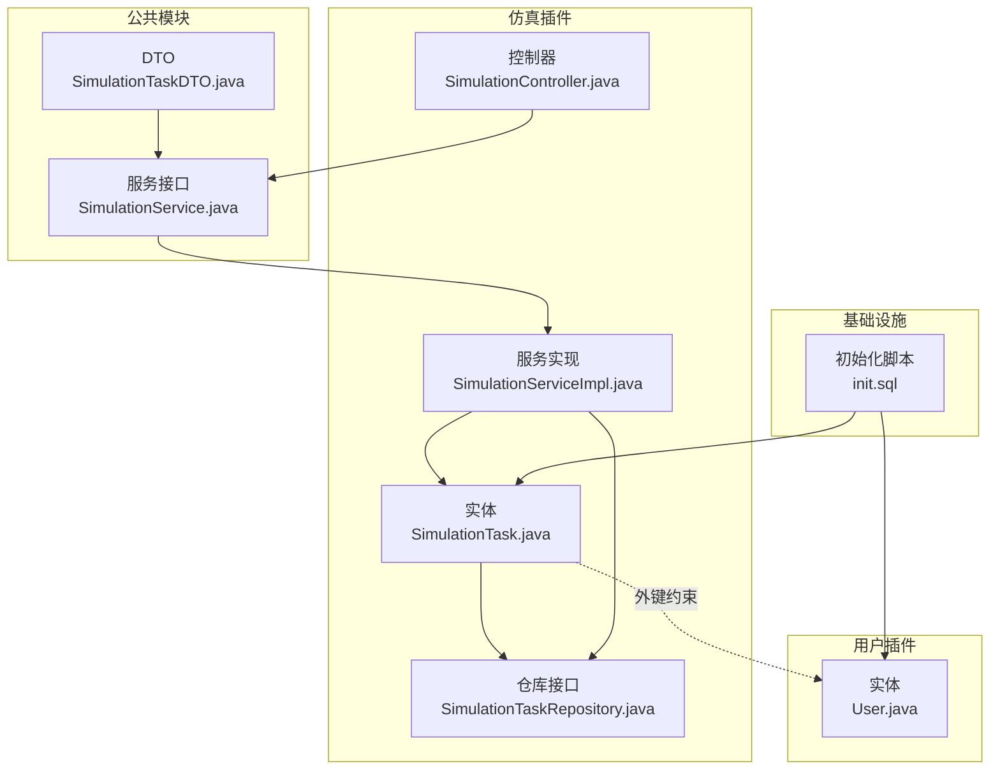
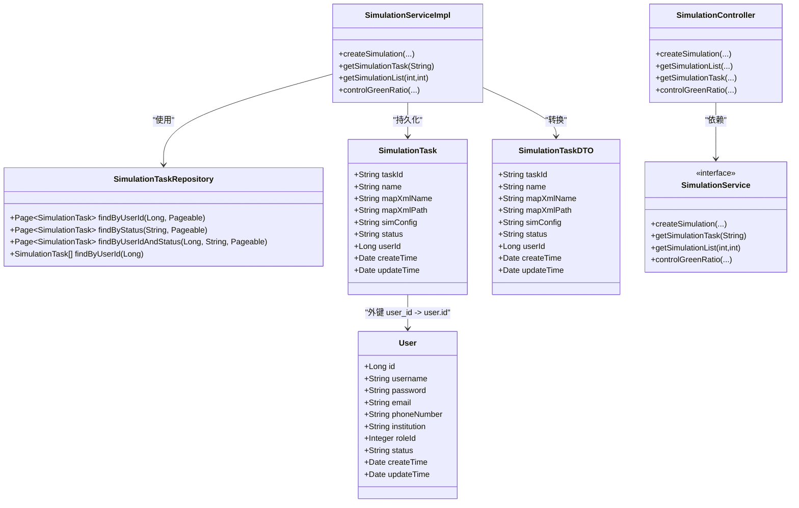
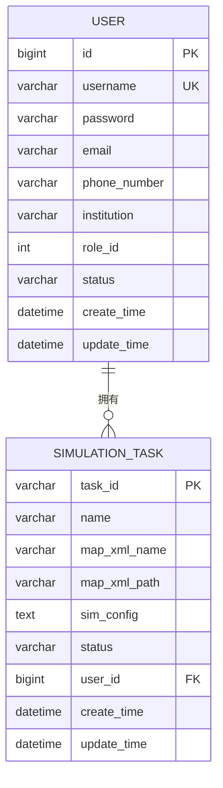
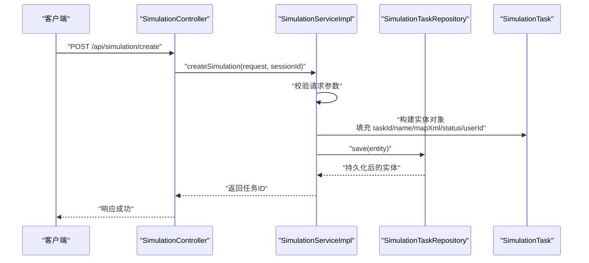
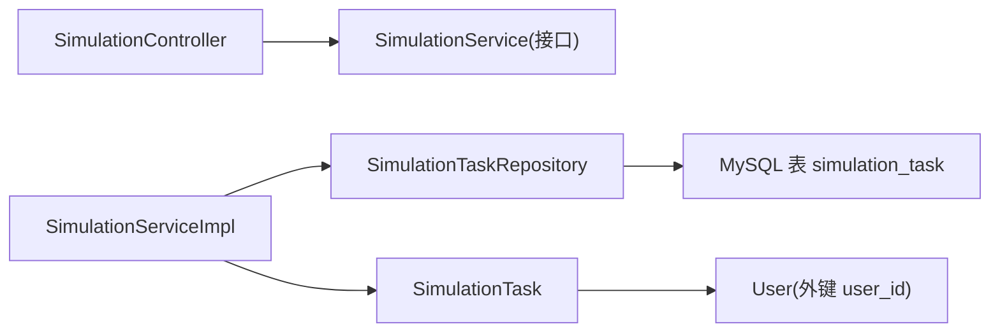

# 仿真任务实体 (SimulationTask)

<cite>
**本文引用的文件**
- [SimulationTask.java](file://plugins/plugin-simulation/src/main/java/com/traffic/sim/plugin/simulation/entity/SimulationTask.java)
- [SimulationTaskRepository.java](file://plugins/plugin-simulation/src/main/java/com/traffic/sim/plugin/simulation/repository/SimulationTaskRepository.java)
- [init.sql](file://infrastructure/init.sql)
- [User.java](file://plugins/plugin-user/src/main/java/com/traffic/sim/plugin/user/entity/User.java)
- [SimulationTaskDTO.java](file://traffic-sim-common/src/main/java/com/traffic/sim/common/dto/SimulationTaskDTO.java)
- [SimulationController.java](file://plugins/plugin-simulation/src/main/java/com/traffic/sim/plugin/simulation/controller/SimulationController.java)
- [SimulationServiceImpl.java](file://plugins/plugin-simulation/src/main/java/com/traffic/sim/plugin/simulation/service/SimulationServiceImpl.java)
- [SimulationService.java](file://traffic-sim-common/src/main/java/com/traffic/sim/common/service/SimulationService.java)
</cite>

## 目录
1. [简介](#简介)
2. [项目结构](#项目结构)
3. [核心组件](#核心组件)
4. [架构概览](#架构概览)
5. [详细组件分析](#详细组件分析)
6. [依赖分析](#依赖分析)
7. [性能考虑](#性能考虑)
8. [故障排查指南](#故障排查指南)
9. [结论](#结论)
10. [附录](#附录)

## 简介
本文件围绕“仿真任务实体”进行系统化数据模型文档化，聚焦于数据库表 simulation_task 的结构与 JPA 实体类 SimulationTask 的映射关系，深入解析以下关键字段：
- 任务唯一标识符：task_id
- 任务名称：name
- 地图XML文件信息：map_xml_name 与 map_xml_path
- 仿真配置：sim_config（JSON 文本）
- 任务状态：status（CREATED/RUNNING/PAUSED/STOPPED/FINISHED）
- 创建者用户ID：user_id
- 时间戳字段：create_time 与 update_time

同时，文档解释 @CreationTimestamp 与 @UpdateTimestamp 注解如何替代手动时间管理，提升代码简洁性；结合数据库索引与外键约束说明与 user 表的关联关系，并在 ER 图中体现；最后给出典型业务场景的 SQL 查询示例与对应的 JPA Repository 查询方法定义，帮助开发者理解数据访问模式。

## 项目结构
本项目采用多插件架构，仿真任务实体位于仿真插件模块，数据库初始化脚本位于基础设施目录，公共 DTO 与服务接口位于公共模块。

**图表来源**
- [SimulationTask.java](file://plugins/plugin-simulation/src/main/java/com/traffic/sim/plugin/simulation/entity/SimulationTask.java#L1-L50)
- [SimulationTaskRepository.java](file://plugins/plugin-simulation/src/main/java/com/traffic/sim/plugin/simulation/repository/SimulationTaskRepository.java#L1-L39)
- [SimulationController.java](file://plugins/plugin-simulation/src/main/java/com/traffic/sim/plugin/simulation/controller/SimulationController.java#L1-L134)
- [SimulationServiceImpl.java](file://plugins/plugin-simulation/src/main/java/com/traffic/sim/plugin/simulation/service/SimulationServiceImpl.java#L59-L189)
- [SimulationService.java](file://traffic-sim-common/src/main/java/com/traffic/sim/common/service/SimulationService.java#L1-L52)
- [SimulationTaskDTO.java](file://traffic-sim-common/src/main/java/com/traffic/sim/common/dto/SimulationTaskDTO.java#L1-L46)
- [init.sql](file://infrastructure/init.sql#L133-L148)
- [User.java](file://plugins/plugin-user/src/main/java/com/traffic/sim/plugin/user/entity/User.java#L1-L66)

**章节来源**
- [SimulationTask.java](file://plugins/plugin-simulation/src/main/java/com/traffic/sim/plugin/simulation/entity/SimulationTask.java#L1-L50)
- [init.sql](file://infrastructure/init.sql#L133-L148)

## 核心组件
- 实体类 SimulationTask：映射数据库表 simulation_task，包含所有核心字段及时间戳字段。
- 仓库接口 SimulationTaskRepository：基于 Spring Data JPA 提供按用户、状态等条件的分页查询能力。
- 控制器 SimulationController：对外暴露 REST API，调用公共服务接口 SimulationService。
- 服务实现 SimulationServiceImpl：负责业务流程编排，持久化仿真任务记录。
- 公共服务接口 SimulationService：定义创建、查询、控制等能力。
- 公共 DTO SimulationTaskDTO：跨模块传输仿真任务数据。
- 用户实体 User：与仿真任务通过 user_id 建立关联。

**章节来源**
- [SimulationTask.java](file://plugins/plugin-simulation/src/main/java/com/traffic/sim/plugin/simulation/entity/SimulationTask.java#L1-L50)
- [SimulationTaskRepository.java](file://plugins/plugin-simulation/src/main/java/com/traffic/sim/plugin/simulation/repository/SimulationTaskRepository.java#L1-L39)
- [SimulationController.java](file://plugins/plugin-simulation/src/main/java/com/traffic/sim/plugin/simulation/controller/SimulationController.java#L1-L134)
- [SimulationServiceImpl.java](file://plugins/plugin-simulation/src/main/java/com/traffic/sim/plugin/simulation/service/SimulationServiceImpl.java#L59-L189)
- [SimulationService.java](file://traffic-sim-common/src/main/java/com/traffic/sim/common/service/SimulationService.java#L1-L52)
- [SimulationTaskDTO.java](file://traffic-sim-common/src/main/java/com/traffic/sim/common/dto/SimulationTaskDTO.java#L1-L46)
- [User.java](file://plugins/plugin-user/src/main/java/com/traffic/sim/plugin/user/entity/User.java#L1-L66)

## 架构概览
下图展示仿真任务实体与其相关组件之间的交互关系，以及与用户表的关联。

**图表来源**
- [SimulationTask.java](file://plugins/plugin-simulation/src/main/java/com/traffic/sim/plugin/simulation/entity/SimulationTask.java#L1-L50)
- [SimulationTaskRepository.java](file://plugins/plugin-simulation/src/main/java/com/traffic/sim/plugin/simulation/repository/SimulationTaskRepository.java#L1-L39)
- [SimulationController.java](file://plugins/plugin-simulation/src/main/java/com/traffic/sim/plugin/simulation/controller/SimulationController.java#L1-L134)
- [SimulationServiceImpl.java](file://plugins/plugin-simulation/src/main/java/com/traffic/sim/plugin/simulation/service/SimulationServiceImpl.java#L59-L189)
- [SimulationService.java](file://traffic-sim-common/src/main/java/com/traffic/sim/common/service/SimulationService.java#L1-L52)
- [SimulationTaskDTO.java](file://traffic-sim-common/src/main/java/com/traffic/sim/common/dto/SimulationTaskDTO.java#L1-L46)
- [User.java](file://plugins/plugin-user/src/main/java/com/traffic/sim/plugin/user/entity/User.java#L1-L66)

## 详细组件分析

### 数据模型与字段语义
- task_id：VARCHAR(64)，主键，唯一标识仿真任务。
- name：VARCHAR(255)，非空，任务名称。
- map_xml_name：VARCHAR(255)，地图XML文件名。
- map_xml_path：VARCHAR(500)，地图XML文件路径。
- sim_config：TEXT，仿真配置 JSON 文本。
- status：VARCHAR(20)，非空，枚举值 CREATED/RUNNING/PAUSED/STOPPED/FINISHED。
- user_id：BIGINT(20)，非空，创建者用户ID，与 user 表 id 关联。
- create_time：DATETIME，非空，自动设置创建时间。
- update_time：DATETIME，非空，自动更新时间。

上述字段与数据库表结构一一对应，且仓库接口提供了按 user_id 与 status 的分页查询能力。

**章节来源**
- [init.sql](file://infrastructure/init.sql#L133-L148)
- [SimulationTask.java](file://plugins/plugin-simulation/src/main/java/com/traffic/sim/plugin/simulation/entity/SimulationTask.java#L1-L50)
- [SimulationTaskRepository.java](file://plugins/plugin-simulation/src/main/java/com/traffic/sim/plugin/simulation/repository/SimulationTaskRepository.java#L1-L39)

### 时间戳注解与手动时间管理对比
- 使用 @CreationTimestamp 与 @UpdateTimestamp：
  - 自动写入创建时间与更新时间，无需在业务层手动赋值。
  - 减少重复代码，避免遗漏更新时间导致的数据不一致。
  - 与数据库默认值配合，保证数据一致性。
- 替代手动时间管理：
  - 在服务实现中曾出现手动设置 createTime/updateTime 的逻辑，现已由注解接管，降低维护成本。
  - 若需兼容历史代码，仍可在构造阶段显式设置，但推荐统一使用注解。

**章节来源**
- [SimulationTask.java](file://plugins/plugin-simulation/src/main/java/com/traffic/sim/plugin/simulation/entity/SimulationTask.java#L42-L48)
- [SimulationServiceImpl.java](file://plugins/plugin-simulation/src/main/java/com/traffic/sim/plugin/simulation/service/SimulationServiceImpl.java#L66-L87)

### 与用户表的关联关系（ER 图）
- 外键关系：simulation_task.user_id 引用 user.id。
- 索引设计：对 user_id、status、create_time 建立索引，支持高频查询。
- 关联用途：按用户维度筛选任务、统计用户任务数量、审计任务归属。

**图表来源**
- [init.sql](file://infrastructure/init.sql#L24-L40)
- [init.sql](file://infrastructure/init.sql#L133-L148)

**章节来源**
- [init.sql](file://infrastructure/init.sql#L24-L40)
- [init.sql](file://infrastructure/init.sql#L133-L148)

### 典型业务场景与查询方法
- 查询某用户的所有运行中任务：
  - SQL 示例：按 user_id 与 status 过滤，返回所有匹配记录。
  - 对应 JPA 方法：SimulationTaskRepository.findByUserIdAndStatus(userId, "RUNNING", Pageable)。
- 获取特定任务的配置信息：
  - SQL 示例：按 task_id 查询 sim_config 字段。
  - 对应 JPA 方法：SimulationTaskRepository.findById(taskId) 或直接通过服务层 DTO 返回。
- 分页查询某用户的任务列表：
  - SQL 示例：按 user_id 分页查询，排序依据 create_time。
  - 对应 JPA 方法：SimulationTaskRepository.findByUserId(userId, Pageable)。

以上查询方法均在仓库接口中定义，控制器通过服务接口调用，最终返回公共 DTO。

**章节来源**
- [SimulationTaskRepository.java](file://plugins/plugin-simulation/src/main/java/com/traffic/sim/plugin/simulation/repository/SimulationTaskRepository.java#L18-L38)
- [SimulationController.java](file://plugins/plugin-simulation/src/main/java/com/traffic/sim/plugin/simulation/controller/SimulationController.java#L62-L97)
- [SimulationService.java](file://traffic-sim-common/src/main/java/com/traffic/sim/common/service/SimulationService.java#L1-L52)
- [SimulationTaskDTO.java](file://traffic-sim-common/src/main/java/com/traffic/sim/common/dto/SimulationTaskDTO.java#L1-L46)

### 数据访问流程（序列图）
以“创建仿真任务”为例，展示从控制器到实体持久化的调用链路。

**图表来源**
- [SimulationController.java](file://plugins/plugin-simulation/src/main/java/com/traffic/sim/plugin/simulation/controller/SimulationController.java#L37-L59)
- [SimulationServiceImpl.java](file://plugins/plugin-simulation/src/main/java/com/traffic/sim/plugin/simulation/service/SimulationServiceImpl.java#L59-L87)
- [SimulationTaskRepository.java](file://plugins/plugin-simulation/src/main/java/com/traffic/sim/plugin/simulation/repository/SimulationTaskRepository.java#L16-L18)
- [SimulationTask.java](file://plugins/plugin-simulation/src/main/java/com/traffic/sim/plugin/simulation/entity/SimulationTask.java#L1-L50)

## 依赖分析
- 组件耦合：
  - SimulationController 仅依赖 SimulationService 接口，便于替换实现与测试。
  - SimulationServiceImpl 依赖 SimulationTaskRepository 与 SimulationTask 实体，承担业务编排。
  - SimulationTaskRepository 依赖 JPA，提供类型安全的查询方法。
- 外部依赖：
  - 数据库：MySQL，使用 InnoDB 存储引擎，具备事务与索引能力。
  - 用户表：与仿真任务通过 user_id 关联，支持按用户维度查询与审计。
- 可能的循环依赖：
  - 当前模块间为单向依赖，无循环依赖迹象。

**图表来源**
- [SimulationController.java](file://plugins/plugin-simulation/src/main/java/com/traffic/sim/plugin/simulation/controller/SimulationController.java#L1-L134)
- [SimulationServiceImpl.java](file://plugins/plugin-simulation/src/main/java/com/traffic/sim/plugin/simulation/service/SimulationServiceImpl.java#L59-L189)
- [SimulationTaskRepository.java](file://plugins/plugin-simulation/src/main/java/com/traffic/sim/plugin/simulation/repository/SimulationTaskRepository.java#L1-L39)
- [SimulationTask.java](file://plugins/plugin-simulation/src/main/java/com/traffic/sim/plugin/simulation/entity/SimulationTask.java#L1-L50)
- [User.java](file://plugins/plugin-user/src/main/java/com/traffic/sim/plugin/user/entity/User.java#L1-L66)

**章节来源**
- [SimulationController.java](file://plugins/plugin-simulation/src/main/java/com/traffic/sim/plugin/simulation/controller/SimulationController.java#L1-L134)
- [SimulationServiceImpl.java](file://plugins/plugin-simulation/src/main/java/com/traffic/sim/plugin/simulation/service/SimulationServiceImpl.java#L59-L189)
- [SimulationTaskRepository.java](file://plugins/plugin-simulation/src/main/java/com/traffic/sim/plugin/simulation/repository/SimulationTaskRepository.java#L1-L39)
- [User.java](file://plugins/plugin-user/src/main/java/com/traffic/sim/plugin/user/entity/User.java#L1-L66)

## 性能考虑
- 索引策略：
  - simulation_task.idx_user_id：加速按用户过滤的任务查询。
  - simulation_task.idx_status：加速按状态过滤的任务查询。
  - simulation_task.idx_create_time：支持按创建时间排序与分页。
- 分页查询：
  - 使用 Pageable 参数进行分页，避免一次性加载大量数据。
- JSON 配置存储：
  - sim_config 为 TEXT 类型，适合存储 JSON，但需注意查询时的性能开销。
- 时间戳字段：
  - 使用数据库默认值与注解自动维护，减少应用层处理开销。

**章节来源**
- [init.sql](file://infrastructure/init.sql#L141-L147)
- [SimulationTaskRepository.java](file://plugins/plugin-simulation/src/main/java/com/traffic/sim/plugin/simulation/repository/SimulationTaskRepository.java#L18-L38)

## 故障排查指南
- 常见问题与定位：
  - 无法按用户查询任务：检查 user_id 是否正确传入，确认索引 idx_user_id 是否生效。
  - 状态查询异常：确认 status 字段值是否符合 CREATED/RUNNING/PAUSED/STOPPED/FINISHED。
  - 时间戳不更新：若手动设置了 update_time，请改为依赖 @UpdateTimestamp。
  - 外键约束失败：确认 user_id 对应的用户是否存在。
- 日志与异常：
  - 控制器层对异常进行捕获并返回标准化响应，便于前端与运维定位问题。
  - 服务层对参数校验与外部调用异常进行包装，便于快速定位业务错误。

**章节来源**
- [SimulationController.java](file://plugins/plugin-simulation/src/main/java/com/traffic/sim/plugin/simulation/controller/SimulationController.java#L46-L59)
- [SimulationServiceImpl.java](file://plugins/plugin-simulation/src/main/java/com/traffic/sim/plugin/simulation/service/SimulationServiceImpl.java#L121-L144)

## 结论
仿真任务实体 SimulationTask 与数据库表 simulation_task 完美映射，通过注解自动维护时间戳，简化了业务代码。仓库接口提供了按用户与状态的分页查询能力，满足常见业务场景。ER 图清晰展示了与用户表的外键关系，索引设计支撑高频查询。结合控制器与服务层的调用链路，开发者可以快速理解数据访问模式并进行扩展。

## 附录
- 字段与类型对照（来自数据库脚本）：
  - task_id：VARCHAR(64)，主键
  - name：VARCHAR(255)，非空
  - map_xml_name：VARCHAR(255)
  - map_xml_path：VARCHAR(500)
  - sim_config：TEXT
  - status：VARCHAR(20)，非空，默认 CREATED
  - user_id：BIGINT(20)，非空
  - create_time：DATETIME，非空，默认 CURRENT_TIMESTAMP
  - update_time：DATETIME，非空，默认 CURRENT_TIMESTAMP ON UPDATE CURRENT_TIMESTAMP
- 索引：
  - idx_user_id：user_id
  - idx_status：status
  - idx_create_time：create_time

**章节来源**
- [init.sql](file://infrastructure/init.sql#L133-L148)