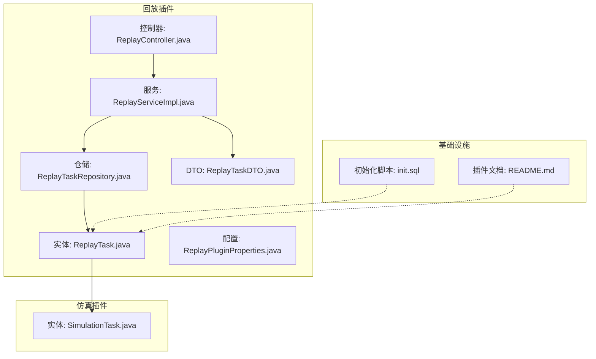
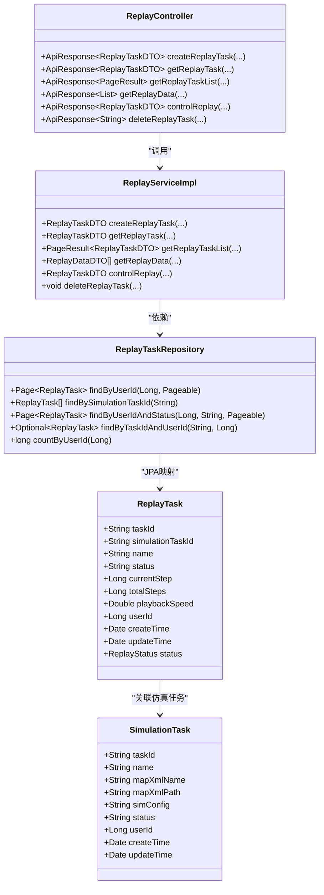
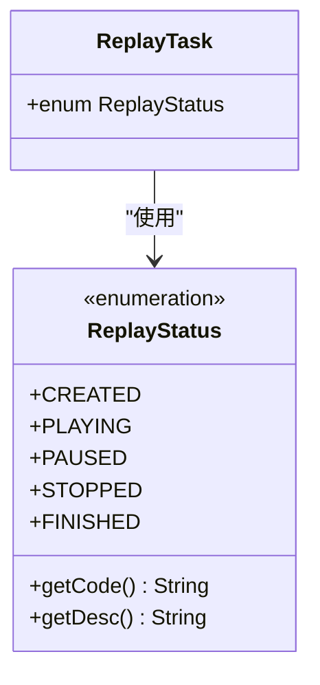
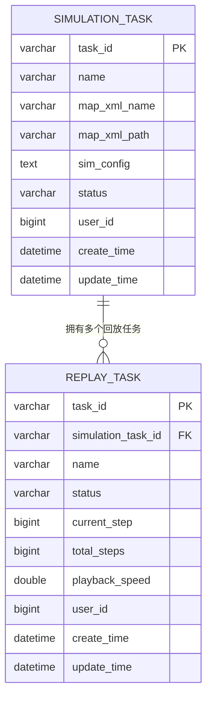
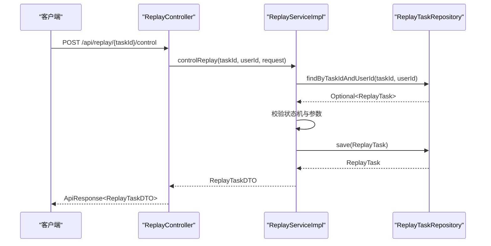
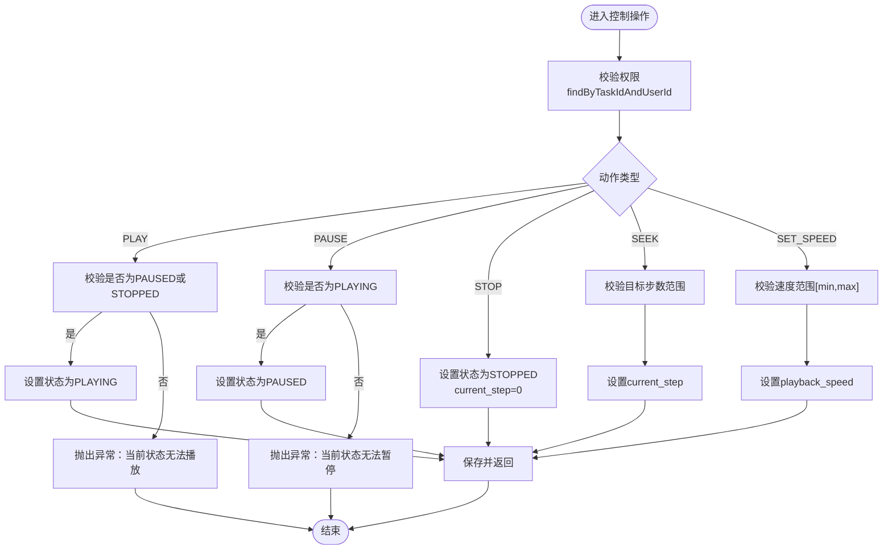

# 回放任务实体 (ReplayTask)

<cite>
**本文引用的文件**
- [ReplayTask.java](file://plugins/plugin-engine-replay/src/main/java/com/traffic/sim/plugin/replay/entity/ReplayTask.java)
- [ReplayTaskRepository.java](file://plugins/plugin-engine-replay/src/main/java/com/traffic/sim/plugin/replay/repository/ReplayTaskRepository.java)
- [ReplayServiceImpl.java](file://plugins/plugin-engine-replay/src/main/java/com/traffic/sim/plugin/replay/service/ReplayServiceImpl.java)
- [ReplayController.java](file://plugins/plugin-engine-replay/src/main/java/com/traffic/sim/plugin/replay/controller/ReplayController.java)
- [ReplayPluginProperties.java](file://plugins/plugin-engine-replay/src/main/java/com/traffic/sim/plugin/replay/config/ReplayPluginProperties.java)
- [ReplayTaskDTO.java](file://plugins/plugin-engine-replay/src/main/java/com/traffic/sim/plugin/replay/dto/ReplayTaskDTO.java)
- [init.sql](file://infrastructure/init.sql)
- [README.md](file://plugins/plugin-engine-replay/README.md)
- [SimulationTask.java](file://plugins/plugin-simulation/src/main/java/com/traffic/sim/plugin/simulation/entity/SimulationTask.java)
</cite>

## 目录
1. [简介](#简介)
2. [项目结构](#项目结构)
3. [核心组件](#核心组件)
4. [架构总览](#架构总览)
5. [详细组件分析](#详细组件分析)
6. [依赖关系分析](#依赖关系分析)
7. [性能考量](#性能考量)
8. [故障排查指南](#故障排查指南)
9. [结论](#结论)
10. [附录](#附录)

## 简介
本文件围绕“回放任务实体”ReplayTask展开，系统性阐述其数据库表结构与Java实体映射、字段语义、状态枚举设计、与仿真任务的关联关系，以及典型查询场景与Spring Data JPA方法定义。同时给出基于真实源码的流程图与时序图，帮助开发者快速理解数据模型与业务流程。

## 项目结构
回放任务实体位于回放插件模块中，采用典型的分层结构：
- 实体层：ReplayTask（JPA实体）
- 仓储层：ReplayTaskRepository（JPA仓库）
- 服务层：ReplayServiceImpl（业务逻辑）
- 控制器层：ReplayController（HTTP接口）
- 配置层：ReplayPluginProperties（回放参数）



图表来源
- [ReplayTask.java](file://plugins/plugin-engine-replay/src/main/java/com/traffic/sim/plugin/replay/entity/ReplayTask.java#L1-L102)
- [ReplayTaskRepository.java](file://plugins/plugin-engine-replay/src/main/java/com/traffic/sim/plugin/replay/repository/ReplayTaskRepository.java#L1-L49)
- [ReplayServiceImpl.java](file://plugins/plugin-engine-replay/src/main/java/com/traffic/sim/plugin/replay/service/ReplayServiceImpl.java#L1-L206)
- [ReplayController.java](file://plugins/plugin-engine-replay/src/main/java/com/traffic/sim/plugin/replay/controller/ReplayController.java#L1-L140)
- [ReplayPluginProperties.java](file://plugins/plugin-engine-replay/src/main/java/com/traffic/sim/plugin/replay/config/ReplayPluginProperties.java#L1-L70)
- [ReplayTaskDTO.java](file://plugins/plugin-engine-replay/src/main/java/com/traffic/sim/plugin/replay/dto/ReplayTaskDTO.java#L1-L29)
- [init.sql](file://infrastructure/init.sql#L157-L173)
- [README.md](file://plugins/plugin-engine-replay/README.md#L163-L189)
- [SimulationTask.java](file://plugins/plugin-simulation/src/main/java/com/traffic/sim/plugin/simulation/entity/SimulationTask.java#L1-L51)

章节来源
- [ReplayTask.java](file://plugins/plugin-engine-replay/src/main/java/com/traffic/sim/plugin/replay/entity/ReplayTask.java#L1-L102)
- [ReplayTaskRepository.java](file://plugins/plugin-engine-replay/src/main/java/com/traffic/sim/plugin/replay/repository/ReplayTaskRepository.java#L1-L49)
- [ReplayServiceImpl.java](file://plugins/plugin-engine-replay/src/main/java/com/traffic/sim/plugin/replay/service/ReplayServiceImpl.java#L1-L206)
- [ReplayController.java](file://plugins/plugin-engine-replay/src/main/java/com/traffic/sim/plugin/replay/controller/ReplayController.java#L1-L140)
- [ReplayPluginProperties.java](file://plugins/plugin-engine-replay/src/main/java/com/traffic/sim/plugin/replay/config/ReplayPluginProperties.java#L1-L70)
- [ReplayTaskDTO.java](file://plugins/plugin-engine-replay/src/main/java/com/traffic/sim/plugin/replay/dto/ReplayTaskDTO.java#L1-L29)
- [init.sql](file://infrastructure/init.sql#L157-L173)
- [README.md](file://plugins/plugin-engine-replay/README.md#L163-L189)
- [SimulationTask.java](file://plugins/plugin-simulation/src/main/java/com/traffic/sim/plugin/simulation/entity/SimulationTask.java#L1-L51)

## 核心组件
- 实体类：ReplayTask（JPA实体，映射至replay_task表）
- 仓储接口：ReplayTaskRepository（JPA仓库，提供按用户、按仿真任务、按状态等查询）
- 服务实现：ReplayServiceImpl（负责创建、控制、查询、删除回放任务）
- 控制器：ReplayController（对外提供REST接口）
- DTO：ReplayTaskDTO（用于对外传输）
- 配置：ReplayPluginProperties（默认速度、最小/最大速度、批处理步长等）

章节来源
- [ReplayTask.java](file://plugins/plugin-engine-replay/src/main/java/com/traffic/sim/plugin/replay/entity/ReplayTask.java#L1-L102)
- [ReplayTaskRepository.java](file://plugins/plugin-engine-replay/src/main/java/com/traffic/sim/plugin/replay/repository/ReplayTaskRepository.java#L1-L49)
- [ReplayServiceImpl.java](file://plugins/plugin-engine-replay/src/main/java/com/traffic/sim/plugin/replay/service/ReplayServiceImpl.java#L1-L206)
- [ReplayController.java](file://plugins/plugin-engine-replay/src/main/java/com/traffic/sim/plugin/replay/controller/ReplayController.java#L1-L140)
- [ReplayPluginProperties.java](file://plugins/plugin-engine-replay/src/main/java/com/traffic/sim/plugin/replay/config/ReplayPluginProperties.java#L1-L70)
- [ReplayTaskDTO.java](file://plugins/plugin-engine-replay/src/main/java/com/traffic/sim/plugin/replay/dto/ReplayTaskDTO.java#L1-L29)

## 架构总览
回放任务实体通过simulation_task_id与仿真任务实体建立关联，形成“回放任务-仿真任务”的一对多关系。服务层在执行控制操作时会校验状态机合法性，并持久化变更；仓储层提供基于用户ID、仿真任务ID、状态的查询能力；控制器层负责鉴权与对外暴露REST接口。



图表来源
- [ReplayTask.java](file://plugins/plugin-engine-replay/src/main/java/com/traffic/sim/plugin/replay/entity/ReplayTask.java#L1-L102)
- [SimulationTask.java](file://plugins/plugin-simulation/src/main/java/com/traffic/sim/plugin/simulation/entity/SimulationTask.java#L1-L51)
- [ReplayTaskRepository.java](file://plugins/plugin-engine-replay/src/main/java/com/traffic/sim/plugin/replay/repository/ReplayTaskRepository.java#L1-L49)
- [ReplayServiceImpl.java](file://plugins/plugin-engine-replay/src/main/java/com/traffic/sim/plugin/replay/service/ReplayServiceImpl.java#L1-L206)
- [ReplayController.java](file://plugins/plugin-engine-replay/src/main/java/com/traffic/sim/plugin/replay/controller/ReplayController.java#L1-L140)

## 详细组件分析

### 表结构与字段语义
- 表名：replay_task
- 主键：task_id（VARCHAR(64)）
- 外键：simulation_task_id（VARCHAR(64)，非空，指向simulation_task表的task_id）
- 字段说明：
  - task_id：回放任务唯一ID（字符串UUID去横线形式）
  - simulation_task_id：关联的原始仿真任务ID（字符串）
  - name：任务名称（字符串，非空）
  - status：播放状态（字符串，非空，取值范围见下节）
  - current_step：当前步数（BIGINT，默认0）
  - total_steps：总步数（BIGINT，默认0）
  - playback_speed：播放倍速（DOUBLE，默认1.0）
  - user_id：操作用户ID（BIGINT，非空）
  - create_time：创建时间（DATETIME，非空，不可更新）
  - update_time：更新时间（DATETIME，非空）

索引：
- idx_simulation_task_id：simulation_task_id
- idx_user_id：user_id
- idx_status：status（由初始化脚本可见）

章节来源
- [init.sql](file://infrastructure/init.sql#L157-L173)
- [README.md](file://plugins/plugin-engine-replay/README.md#L163-L189)
- [ReplayTask.java](file://plugins/plugin-engine-replay/src/main/java/com/traffic/sim/plugin/replay/entity/ReplayTask.java#L1-L102)

### Java实体映射与字段
- 使用JPA注解映射至replay_task表
- 时间戳使用Hibernate注解自动维护
- 字段类型与数据库保持一致（字符串ID、Long步数、Double速度、Long用户ID、Date时间）

章节来源
- [ReplayTask.java](file://plugins/plugin-engine-replay/src/main/java/com/traffic/sim/plugin/replay/entity/ReplayTask.java#L1-L102)

### 状态枚举：ReplayStatus
- 设计目的：统一状态常量，避免魔法字符串，便于状态机校验与国际化扩展
- 可用状态：CREATED、PLAYING、PAUSED、STOPPED、FINISHED
- 提供code与desc两个维度，便于存储与展示



图表来源
- [ReplayTask.java](file://plugins/plugin-engine-replay/src/main/java/com/traffic/sim/plugin/replay/entity/ReplayTask.java#L74-L100)

章节来源
- [ReplayTask.java](file://plugins/plugin-engine-replay/src/main/java/com/traffic/sim/plugin/replay/entity/ReplayTask.java#L74-L100)

### 与仿真任务的关联关系
- 外键约束：replay_task.simulation_task_id 引用 simulation_task.task_id
- 关系性质：一个仿真任务可对应多个回放任务
- 在实体层面，ReplayTask仅持有simulation_task_id作为标识，不直接持有SimulationTask对象



图表来源
- [init.sql](file://infrastructure/init.sql#L133-L173)
- [SimulationTask.java](file://plugins/plugin-simulation/src/main/java/com/traffic/sim/plugin/simulation/entity/SimulationTask.java#L1-L51)
- [ReplayTask.java](file://plugins/plugin-engine-replay/src/main/java/com/traffic/sim/plugin/replay/entity/ReplayTask.java#L1-L102)

章节来源
- [init.sql](file://infrastructure/init.sql#L133-L173)
- [SimulationTask.java](file://plugins/plugin-simulation/src/main/java/com/traffic/sim/plugin/simulation/entity/SimulationTask.java#L1-L51)
- [ReplayTask.java](file://plugins/plugin-engine-replay/src/main/java/com/traffic/sim/plugin/replay/entity/ReplayTask.java#L1-L102)

### 典型查询场景与JPA方法定义
- 查询某仿真任务的所有回放记录
  - JPA方法：findBySimulationTaskId(String simulationTaskId)
  - 返回：List<ReplayTask>
- 查询某用户的回放任务列表（分页，按创建时间倒序）
  - JPA方法：findByUserId(Long userId, Pageable pageable)
  - 返回：Page<ReplayTask>
- 查询某用户且状态为某值的回放任务列表（分页）
  - JPA方法：findByUserIdAndStatus(Long userId, String status, Pageable pageable)
  - 返回：Page<ReplayTask>
- 根据任务ID与用户ID查询（用于权限校验）
  - JPA方法：findByTaskIdAndUserId(String taskId, Long userId)
  - 返回：Optional<ReplayTask>
- 统计某用户的回放任务数量
  - JPA方法：countByUserId(Long userId)
  - 返回：long

章节来源
- [ReplayTaskRepository.java](file://plugins/plugin-engine-replay/src/main/java/com/traffic/sim/plugin/replay/repository/ReplayTaskRepository.java#L1-L49)

### 控制流与状态机
回放控制操作在服务层进行状态校验与持久化：



图表来源
- [ReplayController.java](file://plugins/plugin-engine-replay/src/main/java/com/traffic/sim/plugin/replay/controller/ReplayController.java#L105-L121)
- [ReplayServiceImpl.java](file://plugins/plugin-engine-replay/src/main/java/com/traffic/sim/plugin/replay/service/ReplayServiceImpl.java#L108-L170)
- [ReplayTaskRepository.java](file://plugins/plugin-engine-replay/src/main/java/com/traffic/sim/plugin/replay/repository/ReplayTaskRepository.java#L37-L41)

章节来源
- [ReplayController.java](file://plugins/plugin-engine-replay/src/main/java/com/traffic/sim/plugin/replay/controller/ReplayController.java#L105-L121)
- [ReplayServiceImpl.java](file://plugins/plugin-engine-replay/src/main/java/com/traffic/sim/plugin/replay/service/ReplayServiceImpl.java#L108-L170)
- [ReplayTaskRepository.java](file://plugins/plugin-engine-replay/src/main/java/com/traffic/sim/plugin/replay/repository/ReplayTaskRepository.java#L37-L41)

### 状态机流程（PLAY/PAUSE/STOP/SEEK/SET_SPEED）


图表来源
- [ReplayServiceImpl.java](file://plugins/plugin-engine-replay/src/main/java/com/traffic/sim/plugin/replay/service/ReplayServiceImpl.java#L108-L170)
- [ReplayPluginProperties.java](file://plugins/plugin-engine-replay/src/main/java/com/traffic/sim/plugin/replay/config/ReplayPluginProperties.java#L46-L67)

章节来源
- [ReplayServiceImpl.java](file://plugins/plugin-engine-replay/src/main/java/com/traffic/sim/plugin/replay/service/ReplayServiceImpl.java#L108-L170)
- [ReplayPluginProperties.java](file://plugins/plugin-engine-replay/src/main/java/com/traffic/sim/plugin/replay/config/ReplayPluginProperties.java#L46-L67)

## 依赖关系分析
- 实体与表结构：ReplayTask与replay_task一一对应，包含所有字段与索引
- 实体与仿真任务：通过simulation_task_id建立外键关联
- 仓储与实体：JPA仓库继承JpaRepository<ReplayTask, String>
- 服务与仓储：ReplayServiceImpl依赖ReplayTaskRepository进行CRUD与查询
- 控制器与服务：ReplayController注入ReplayService，负责鉴权与参数解析
- 配置与服务：ReplayPluginProperties提供速度范围与默认速度，服务层在控制操作中使用

```mermaid
graph LR
SQL["init.sql<br/>replay_task表"] --> E["ReplayTask.java"]
E --> R["ReplayTaskRepository.java"]
R --> S["ReplayServiceImpl.java"]
S --> C["ReplayController.java"]
S --> P["ReplayPluginProperties.java"]
ST["SimulationTask.java"] <- --> E
```

图表来源
- [init.sql](file://infrastructure/init.sql#L157-L173)
- [ReplayTask.java](file://plugins/plugin-engine-replay/src/main/java/com/traffic/sim/plugin/replay/entity/ReplayTask.java#L1-L102)
- [ReplayTaskRepository.java](file://plugins/plugin-engine-replay/src/main/java/com/traffic/sim/plugin/replay/repository/ReplayTaskRepository.java#L1-L49)
- [ReplayServiceImpl.java](file://plugins/plugin-engine-replay/src/main/java/com/traffic/sim/plugin/replay/service/ReplayServiceImpl.java#L1-L206)
- [ReplayController.java](file://plugins/plugin-engine-replay/src/main/java/com/traffic/sim/plugin/replay/controller/ReplayController.java#L1-L140)
- [ReplayPluginProperties.java](file://plugins/plugin-engine-replay/src/main/java/com/traffic/sim/plugin/replay/config/ReplayPluginProperties.java#L1-L70)
- [SimulationTask.java](file://plugins/plugin-simulation/src/main/java/com/traffic/sim/plugin/simulation/entity/SimulationTask.java#L1-L51)

章节来源
- [init.sql](file://infrastructure/init.sql#L157-L173)
- [ReplayTask.java](file://plugins/plugin-engine-replay/src/main/java/com/traffic/sim/plugin/replay/entity/ReplayTask.java#L1-L102)
- [ReplayTaskRepository.java](file://plugins/plugin-engine-replay/src/main/java/com/traffic/sim/plugin/replay/repository/ReplayTaskRepository.java#L1-L49)
- [ReplayServiceImpl.java](file://plugins/plugin-engine-replay/src/main/java/com/traffic/sim/plugin/replay/service/ReplayServiceImpl.java#L1-L206)
- [ReplayController.java](file://plugins/plugin-engine-replay/src/main/java/com/traffic/sim/plugin/replay/controller/ReplayController.java#L1-L140)
- [ReplayPluginProperties.java](file://plugins/plugin-engine-replay/src/main/java/com/traffic/sim/plugin/replay/config/ReplayPluginProperties.java#L1-L70)
- [SimulationTask.java](file://plugins/plugin-simulation/src/main/java/com/traffic/sim/plugin/simulation/entity/SimulationTask.java#L1-L51)

## 性能考量
- 分页查询：列表查询使用Pageable，建议结合索引idx_user_id与idx_status提升排序与过滤性能
- 步数范围校验：在读取回放数据前对startStep/endStep进行边界检查，避免无效请求
- 批量步长：配置项batchStepSize可用于批量拉取回放数据，减少网络往返
- 索引策略：除idx_simulation_task_id、idx_user_id、idx_status外，可根据查询模式增加复合索引（如user_id+status、simulation_task_id+status）

[本节为通用性能建议，不直接分析具体文件]

## 故障排查指南
- 权限问题：若提示“回放任务不存在或无权限访问”，检查taskId与userId是否匹配，确认findByTaskIdAndUserId查询结果
- 状态机错误：当尝试PLAY/PAUSE/STOP/SEEK/SET_SPEED失败时，检查当前status与请求动作是否匹配
- 步数越界：当endStep超过totalSteps或startStep>endStep时，服务层会抛出异常
- 速度越界：当playback_speed不在配置的minSpeed与maxSpeed范围内，服务层会抛出异常

章节来源
- [ReplayServiceImpl.java](file://plugins/plugin-engine-replay/src/main/java/com/traffic/sim/plugin/replay/service/ReplayServiceImpl.java#L63-L105)
- [ReplayServiceImpl.java](file://plugins/plugin-engine-replay/src/main/java/com/traffic/sim/plugin/replay/service/ReplayServiceImpl.java#L108-L170)
- [ReplayPluginProperties.java](file://plugins/plugin-engine-replay/src/main/java/com/traffic/sim/plugin/replay/config/ReplayPluginProperties.java#L46-L67)

## 结论
ReplayTask实体完整覆盖了回放任务的核心数据需求，通过明确的状态枚举与严格的控制流校验，确保了回放过程的可控与安全。与仿真任务的外键关联清晰地体现了“一次仿真、多次回放”的设计意图。结合JPA仓库提供的查询方法与控制器的鉴权机制，开发者可以快速构建稳定的回放功能。

[本节为总结性内容，不直接分析具体文件]

## 附录

### 字段对照表
- task_id：回放任务唯一ID（字符串）
- simulation_task_id：关联的原始仿真任务ID（字符串）
- name：任务名称（字符串）
- status：播放状态（字符串，取值：CREATED/PLAYING/PAUSED/STOPPED/FINISHED）
- current_step：当前步数（整数）
- total_steps：总步数（整数）
- playback_speed：播放倍速（浮点数）
- user_id：操作用户ID（整数）
- create_time：创建时间（时间戳）
- update_time：更新时间（时间戳）

章节来源
- [ReplayTask.java](file://plugins/plugin-engine-replay/src/main/java/com/traffic/sim/plugin/replay/entity/ReplayTask.java#L1-L102)
- [init.sql](file://infrastructure/init.sql#L157-L173)

### 典型SQL查询示例（基于真实表结构）
- 查询某仿真任务的所有回放记录
  - SELECT * FROM replay_task WHERE simulation_task_id = ? ORDER BY create_time DESC
- 查询某用户正在进行的回放任务列表（假设status=PLAYING）
  - SELECT * FROM replay_task WHERE user_id = ? AND status = 'PLAYING' ORDER BY create_time DESC
- 统计某用户的回放任务数量
  - SELECT COUNT(*) FROM replay_task WHERE user_id = ?

章节来源
- [init.sql](file://infrastructure/init.sql#L157-L173)
- [README.md](file://plugins/plugin-engine-replay/README.md#L163-L189)