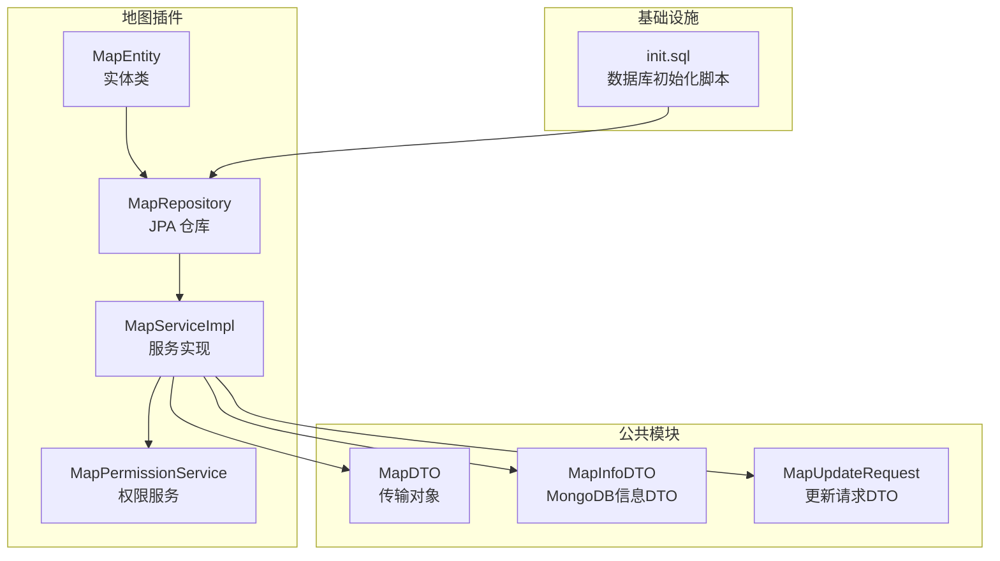
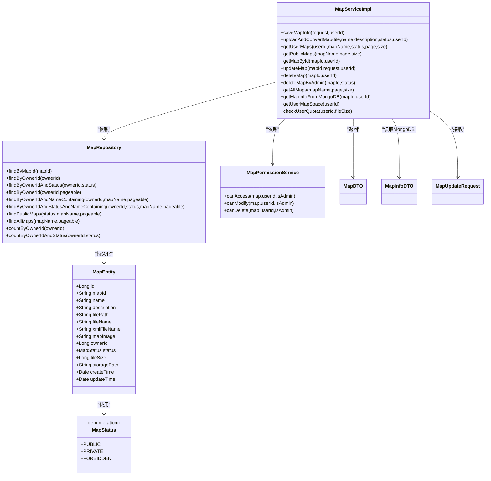
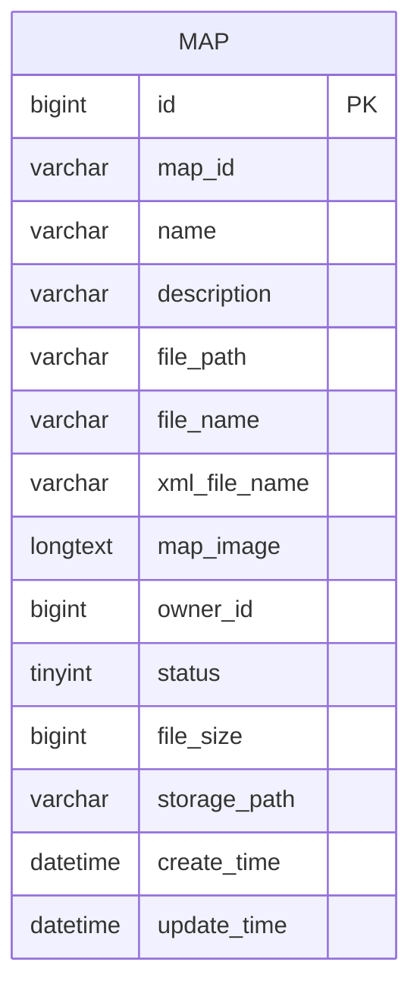
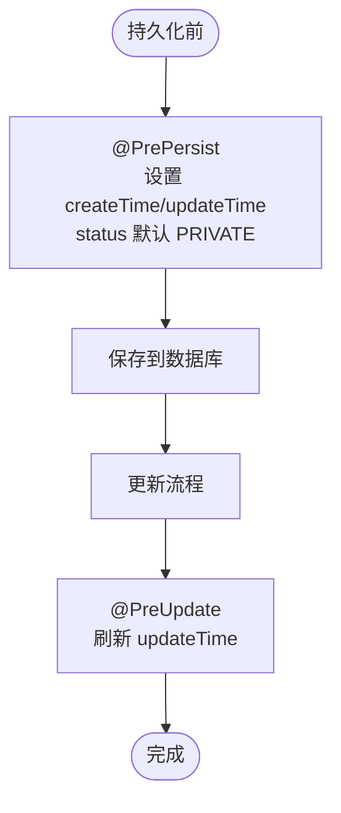
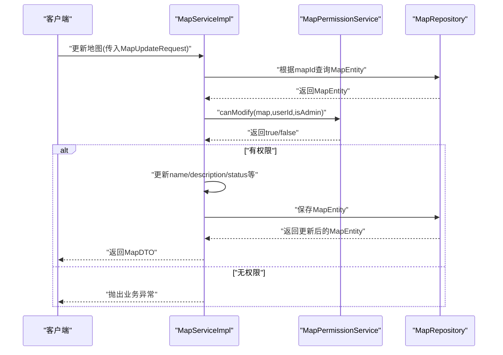
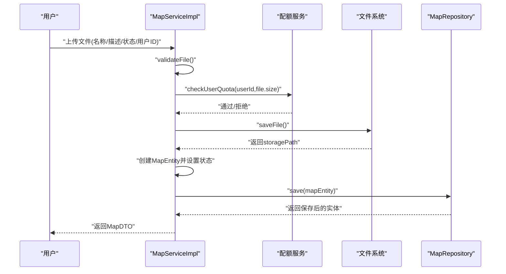
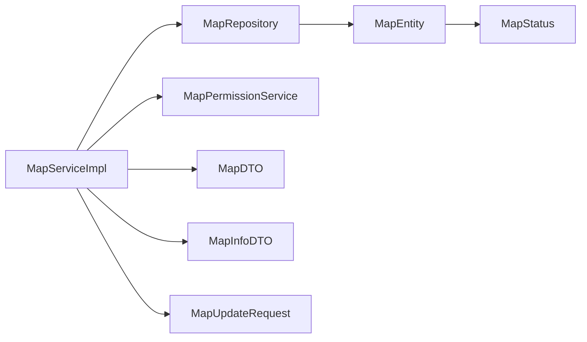

# 地图实体 (MapEntity)

<cite>
**本文引用的文件**
- [MapEntity.java](file://plugins/plugin-map/src/main/java/com/traffic/sim/plugin/map/entity/MapEntity.java)
- [MapRepository.java](file://plugins/plugin-map/src/main/java/com/traffic/sim/plugin/map/repository/MapRepository.java)
- [MapServiceImpl.java](file://plugins/plugin-map/src/main/java/com/traffic/sim/plugin/map/service/MapServiceImpl.java)
- [MapPermissionService.java](file://plugins/plugin-map/src/main/java/com/traffic/sim/plugin/map/service/MapPermissionService.java)
- [MapDTO.java](file://traffic-sim-common/src/main/java/com/traffic/sim/common/dto/MapDTO.java)
- [MapInfoDTO.java](file://traffic-sim-common/src/main/java/com/traffic/sim/common/dto/MapInfoDTO.java)
- [MapUpdateRequest.java](file://traffic-sim-common/src/main/java/com/traffic/sim/common/dto/MapUpdateRequest.java)
- [init.sql](file://infrastructure/init.sql)
</cite>

## 目录
1. [简介](#简介)
2. [项目结构](#项目结构)
3. [核心组件](#核心组件)
4. [架构总览](#架构总览)
5. [详细组件分析](#详细组件分析)
6. [依赖分析](#依赖分析)
7. [性能考量](#性能考量)
8. [故障排查指南](#故障排查指南)
9. [结论](#结论)
10. [附录](#附录)

## 简介
本文件围绕地图实体数据模型展开，系统性解析数据库表 map 的结构与 Java 实体类 MapEntity 的映射关系，重点阐述：
- 字段定义与业务含义：id、map_id、name、description、file_path、xml_file_name、map_image、owner_id、status、file_size、storage_path、create_time、update_time。
- MapStatus 枚举设计与 ORDINAL 映射策略，以及潜在风险与最佳实践建议。
- JPA 注解驱动的对象-关系映射机制，含 @PrePersist/@PreUpdate 的时序控制。
- ER 关系图：MapEntity 与 User 的所有权关系。
- 常见查询 SQL 与对应 Repository 方法签名，覆盖按用户、状态、名称等条件的筛选与分页。
- 权限控制与服务层交互流程，确保数据安全与一致性。

## 项目结构
与地图实体直接相关的模块与文件分布如下：
- 实体与仓库：plugins/plugin-map/src/main/java/com/traffic/sim/plugin/map/entity/MapEntity.java
- 仓库接口：plugins/plugin-map/src/main/java/com/traffic/sim/plugin/map/repository/MapRepository.java
- 服务实现：plugins/plugin-map/src/main/java/com/traffic/sim/plugin/map/service/MapServiceImpl.java
- 权限服务：plugins/plugin-map/src/main/java/com/traffic/sim/plugin/map/service/MapPermissionService.java
- DTO 定义：traffic-sim-common/src/main/java/com/traffic/sim/common/dto/MapDTO.java、MapInfoDTO.java、MapUpdateRequest.java
- 数据库初始化脚本：infrastructure/init.sql

**章节来源**
- file://plugins/plugin-map/src/main/java/com/traffic/sim/plugin/map/entity/MapEntity.java#L1-L116
- file://plugins/plugin-map/src/main/java/com/traffic/sim/plugin/map/repository/MapRepository.java#L1-L87
- file://plugins/plugin-map/src/main/java/com/traffic/sim/plugin/map/service/MapServiceImpl.java#L1-L395
- file://plugins/plugin-map/src/main/java/com/traffic/sim/plugin/map/service/MapPermissionService.java#L1-L66
- file://traffic-sim-common/src/main/java/com/traffic/sim/common/dto/MapDTO.java#L1-L33
- file://traffic-sim-common/src/main/java/com/traffic/sim/common/dto/MapInfoDTO.java#L1-L33
- file://traffic-sim-common/src/main/java/com/traffic/sim/common/dto/MapUpdateRequest.java#L1-L26
- file://infrastructure/init.sql#L80-L117

## 核心组件
- MapEntity：定义了数据库表 map 的完整字段映射，包含基础信息、文件元数据、状态枚举、时间戳与默认值初始化。
- MapRepository：基于 Spring Data JPA 提供的 CRUD 与复杂查询方法，涵盖按用户、状态、名称模糊匹配与分页。
- MapServiceImpl：服务层实现上传、查询、更新、删除、配额校验与权限控制等业务逻辑。
- MapPermissionService：统一处理地图访问、修改、删除的权限判定。
- DTO：MapDTO、MapInfoDTO、MapUpdateRequest 作为跨层数据载体，保证前后端与外部系统交互的一致性。

**章节来源**
- file://plugins/plugin-map/src/main/java/com/traffic/sim/plugin/map/entity/MapEntity.java#L1-L116
- file://plugins/plugin-map/src/main/java/com/traffic/sim/plugin/map/repository/MapRepository.java#L1-L87
- file://plugins/plugin-map/src/main/java/com/traffic/sim/plugin/map/service/MapServiceImpl.java#L1-L395
- file://plugins/plugin-map/src/main/java/com/traffic/sim/plugin/map/service/MapPermissionService.java#L1-L66
- file://traffic-sim-common/src/main/java/com/traffic/sim/common/dto/MapDTO.java#L1-L33
- file://traffic-sim-common/src/main/java/com/traffic/sim/common/dto/MapInfoDTO.java#L1-L33
- file://traffic-sim-common/src/main/java/com/traffic/sim/common/dto/MapUpdateRequest.java#L1-L26

## 架构总览
下图展示了 MapEntity 与数据库表、服务层、权限层以及 DTO 的整体交互关系。

**图表来源**
- [MapEntity.java](file://plugins/plugin-map/src/main/java/com/traffic/sim/plugin/map/entity/MapEntity.java#L1-L116)
- [MapRepository.java](file://plugins/plugin-map/src/main/java/com/traffic/sim/plugin/map/repository/MapRepository.java#L1-L87)
- [MapServiceImpl.java](file://plugins/plugin-map/src/main/java/com/traffic/sim/plugin/map/service/MapServiceImpl.java#L1-L395)
- [MapPermissionService.java](file://plugins/plugin-map/src/main/java/com/traffic/sim/plugin/map/service/MapPermissionService.java#L1-L66)
- [MapDTO.java](file://traffic-sim-common/src/main/java/com/traffic/sim/common/dto/MapDTO.java#L1-L33)
- [MapInfoDTO.java](file://traffic-sim-common/src/main/java/com/traffic/sim/common/dto/MapInfoDTO.java#L1-L33)
- [MapUpdateRequest.java](file://traffic-sim-common/src/main/java/com/traffic/sim/common/dto/MapUpdateRequest.java#L1-L26)

## 详细组件分析

### 数据库表结构与字段映射
- 表名：map
- 主键：id（自增）
- 关键字段：
  - map_id：MongoDB 中存储的地图文件 ID
  - name：地图名称
  - description：描述信息（最大长度 500）
  - file_path：文件路径（非空）
  - file_name：原始文件名
  - xml_file_name：XML 文件名
  - map_image：Base64 编码的地图缩略图（LONGTEXT）
  - owner_id：所属用户 ID（非空）
  - status：地图状态（TINYINT，默认 1，对应 ORDINAL 的 1）
  - file_size：文件大小（字节）
  - storage_path：存储路径
  - create_time：创建时间（非空，不可更新）
  - update_time：更新时间（非空）

**图表来源**
- [init.sql](file://infrastructure/init.sql#L87-L107)

**章节来源**
- file://infrastructure/init.sql#L87-L107
- file://plugins/plugin-map/src/main/java/com/traffic/sim/plugin/map/entity/MapEntity.java#L18-L65

### MapEntity 类与 JPA 注解映射
- 实体注解：@Entity、@Table(name = "map") 指定表名。
- 主键：@Id、@GeneratedValue(strategy = GenerationType.IDENTITY) 自增。
- 字段映射：
  - @Column(name = "map_id") 对应 map_id
  - @Column(nullable = false) 对应 name
  - @Column(length = 500) 对应 description
  - @Column(name = "file_path", nullable = false) 对应 file_path
  - @Column(name = "file_name") 对应 file_name
  - @Column(name = "xml_file_name") 对应 xml_file_name
  - @Lob + @Column(name = "map_image", columnDefinition = "LONGTEXT") 对应 map_image
  - @Column(name = "owner_id", nullable = false) 对应 owner_id
  - @Column(nullable = false) + @Enumerated(EnumType.ORDINAL) 对应 status
  - @Column(name = "file_size") 对应 file_size
  - @Column(name = "storage_path") 对应 storage_path
  - @Column(name = "create_time", nullable = false, updatable = false) + @Temporal(TemporalType.TIMESTAMP) 对应 create_time
  - @Column(name = "update_time", nullable = false) + @Temporal(TemporalType.TIMESTAMP) 对应 update_time
- 时间戳初始化：
  - @PrePersist：设置 createTime、updateTime；若 status 为空则设为 PRIVATE
  - @PreUpdate：每次更新时刷新 updateTime

**图表来源**
- [MapEntity.java](file://plugins/plugin-map/src/main/java/com/traffic/sim/plugin/map/entity/MapEntity.java#L101-L114)

**章节来源**
- file://plugins/plugin-map/src/main/java/com/traffic/sim/plugin/map/entity/MapEntity.java#L13-L114
- file://infrastructure/init.sql#L98-L102

### MapStatus 枚举与 ORDINAL 映射
- 枚举值与含义：
  - PUBLIC(0, "公开")
  - PRIVATE(1, "私有")
  - FORBIDDEN(2, "禁用")
- 数据库存储：status 为 TINYINT，默认 1，对应 ORDINAL 的索引位置。
- 使用场景：通过 EnumType.ORDINAL 将枚举的顺序值写入数据库，简单直观，适合稳定不变的枚举集合。
- 潜在风险：
  - 若调整枚举顺序，数据库中已存在的整数值会与新顺序不一致，导致读取错误。
  - 不利于可读性维护，建议后续迁移为字符串或显式 code 映射。
- 推荐替代方案：使用 @Enumerated(EnumType.STRING) 或自定义 code 映射，避免顺序变更带来的破坏性影响。

**章节来源**
- file://plugins/plugin-map/src/main/java/com/traffic/sim/plugin/map/entity/MapEntity.java#L67-L99
- file://infrastructure/init.sql#L98-L98

### 权限控制与所有权关系
- 所有权关系：MapEntity 的 owner_id 与用户表 user 的 id 建立逻辑上的“拥有”关系（虽然未在实体中声明外键约束，但业务上强约束）。
- 访问规则：
  - 管理员：除 FORBIDDEN 外均可访问
  - PUBLIC：所有用户可见
  - PRIVATE：仅所有者可见
  - FORBIDDEN：禁止访问
- 修改与删除规则：
  - 管理员可修改/删除所有地图
  - 普通用户仅能修改/删除自己的地图

**图表来源**
- [MapServiceImpl.java](file://plugins/plugin-map/src/main/java/com/traffic/sim/plugin/map/service/MapServiceImpl.java#L171-L195)
- [MapPermissionService.java](file://plugins/plugin-map/src/main/java/com/traffic/sim/plugin/map/service/MapPermissionService.java#L39-L63)
- [MapRepository.java](file://plugins/plugin-map/src/main/java/com/traffic/sim/plugin/map/repository/MapRepository.java#L1-L87)

**章节来源**
- file://plugins/plugin-map/src/main/java/com/traffic/sim/plugin/map/service/MapPermissionService.java#L16-L63
- file://plugins/plugin-map/src/main/java/com/traffic/sim/plugin/map/service/MapServiceImpl.java#L171-L195

### 常见查询与 Repository 方法签名
以下列出常用查询场景与对应的 Repository 方法签名（以方法名为准），便于开发与测试对接：
- 根据 mapId 查找：Optional<MapEntity> findByMapId(String mapId)
- 根据所有者 ID 列表：List<MapEntity> findByOwnerId(Long ownerId)
- 根据所有者 ID 和状态：List<MapEntity> findByOwnerIdAndStatus(Long ownerId, MapEntity.MapStatus status)
- 分页查询所有者地图：Page<MapEntity> findByOwnerId(Long ownerId, Pageable pageable)
- 模糊查询名称（所有者限定）：Page<MapEntity> findByOwnerIdAndNameContaining(@Param("ownerId") Long ownerId, @Param("mapName") String mapName, Pageable pageable)
- 复合条件（所有者+状态+名称模糊）：Page<MapEntity> findByOwnerIdAndStatusAndNameContaining(@Param("ownerId") Long ownerId, @Param("status") MapEntity.MapStatus status, @Param("mapName") String mapName, Pageable pageable)
- 公开地图查询（状态=PUBLIC）：Page<MapEntity> findPublicMaps(@Param("status") MapEntity.MapStatus status, @Param("mapName") String mapName, Pageable pageable)
- 管理员全量查询（名称模糊）：Page<MapEntity> findAllMaps(@Param("mapName") String mapName, Pageable pageable)
- 统计数量：
  - long countByOwnerId(Long ownerId)
  - long countByOwnerIdAndStatus(Long ownerId, MapEntity.MapStatus status)

说明：
- 上述方法由 Spring Data JPA 自动生成实现，无需手写 SQL。
- 复合查询使用 @Query + JPQL，参数通过 @Param 绑定，支持空值判断与模糊匹配。

**章节来源**
- file://plugins/plugin-map/src/main/java/com/traffic/sim/plugin/map/repository/MapRepository.java#L1-L87

### 服务层典型流程（上传与更新）
- 上传流程要点：
  - 校验文件类型与大小
  - 检查用户配额
  - 保存文件至存储路径
  - 创建 MapEntity 并设置状态（默认 PRIVATE，或根据请求映射）
  - 生成 map_id（MongoDB ID）
  - 保存并更新配额
- 更新流程要点：
  - 校验权限（管理员或所有者）
  - 支持更新名称、描述、状态
  - 保存后返回 DTO

**图表来源**
- [MapServiceImpl.java](file://plugins/plugin-map/src/main/java/com/traffic/sim/plugin/map/service/MapServiceImpl.java#L52-L120)

**章节来源**
- file://plugins/plugin-map/src/main/java/com/traffic/sim/plugin/map/service/MapServiceImpl.java#L52-L120

## 依赖分析
- MapEntity 依赖 MapStatus 枚举，通过 ORDINAL 映射到数据库整型字段。
- MapRepository 继承 JpaRepository<MapEntity, Long>，提供基础 CRUD 与派生查询。
- MapServiceImpl 依赖 MapRepository、MapPermissionService、MongoTemplate、配额服务等，承担业务编排。
- DTO 层用于跨层传递，避免直接暴露实体细节。

**图表来源**
- [MapEntity.java](file://plugins/plugin-map/src/main/java/com/traffic/sim/plugin/map/entity/MapEntity.java#L1-L116)
- [MapRepository.java](file://plugins/plugin-map/src/main/java/com/traffic/sim/plugin/map/repository/MapRepository.java#L1-L87)
- [MapServiceImpl.java](file://plugins/plugin-map/src/main/java/com/traffic/sim/plugin/map/service/MapServiceImpl.java#L1-L395)
- [MapPermissionService.java](file://plugins/plugin-map/src/main/java/com/traffic/sim/plugin/map/service/MapPermissionService.java#L1-L66)
- [MapDTO.java](file://traffic-sim-common/src/main/java/com/traffic/sim/common/dto/MapDTO.java#L1-L33)
- [MapInfoDTO.java](file://traffic-sim-common/src/main/java/com/traffic/sim/common/dto/MapInfoDTO.java#L1-L33)
- [MapUpdateRequest.java](file://traffic-sim-common/src/main/java/com/traffic/sim/common/dto/MapUpdateRequest.java#L1-L26)

**章节来源**
- file://plugins/plugin-map/src/main/java/com/traffic/sim/plugin/map/entity/MapEntity.java#L1-L116
- file://plugins/plugin-map/src/main/java/com/traffic/sim/plugin/map/repository/MapRepository.java#L1-L87
- file://plugins/plugin-map/src/main/java/com/traffic/sim/plugin/map/service/MapServiceImpl.java#L1-L395
- file://plugins/plugin-map/src/main/java/com/traffic/sim/plugin/map/service/MapPermissionService.java#L1-L66
- file://traffic-sim-common/src/main/java/com/traffic/sim/common/dto/MapDTO.java#L1-L33
- file://traffic-sim-common/src/main/java/com/traffic/sim/common/dto/MapInfoDTO.java#L1-L33
- file://traffic-sim-common/src/main/java/com/traffic/sim/common/dto/MapUpdateRequest.java#L1-L26

## 性能考量
- 查询优化：
  - 为 owner_id、status、create_time 建立索引，有利于按用户、状态与时间排序的查询。
  - 复合条件查询建议使用 Pageable 与 LIMIT，避免一次性加载大量数据。
- 写入优化：
  - @PrePersist/@PreUpdate 在持久化前统一设置时间戳，减少重复赋值。
  - 大字段（如 map_image）建议按需加载，避免不必要的网络与内存开销。
- 存储与配额：
  - 通过 UserMapQuota 控制用户地图数量与总大小，防止资源滥用。
  - 删除地图时同步更新配额，保持统计准确性。

[本节为通用指导，不直接分析具体文件]

## 故障排查指南
- 状态映射异常：
  - 现象：读取到的状态值不符合预期。
  - 排查：确认数据库 status 字段值与 MapStatus 枚举 ORDINAL 顺序是否一致；若顺序变更，需迁移存量数据或改用 STRING/自定义 code。
- 权限访问被拒：
  - 现象：提示“无权访问/修改/删除”。
  - 排查：确认调用方是否管理员；检查 MapEntity 的 owner_id 与当前用户是否一致；核对 MapStatus 是否为 FORBIDDEN。
- 时间戳异常：
  - 现象：create_time/update_time 为空或不正确。
  - 排查：确认 @PrePersist/@PreUpdate 是否生效；检查数据库默认值与触发器。
- 文件删除失败：
  - 现象：删除数据库记录成功但磁盘文件未清理。
  - 排查：检查 storage_path 是否为空；确认文件系统权限与路径有效性。

**章节来源**
- file://plugins/plugin-map/src/main/java/com/traffic/sim/plugin/map/service/MapPermissionService.java#L16-L63
- file://plugins/plugin-map/src/main/java/com/traffic/sim/plugin/map/entity/MapEntity.java#L101-L114
- file://plugins/plugin-map/src/main/java/com/traffic/sim/plugin/map/service/MapServiceImpl.java#L198-L225

## 结论
MapEntity 通过清晰的字段定义与 JPA 注解实现了与数据库表 map 的精准映射，配合 MapRepository 的丰富查询能力与 MapServiceImpl 的权限控制，构建了完整的地图数据生命周期管理。建议在未来版本中将 MapStatus 的 ORDINAL 映射迁移到更稳定的 code 映射，以降低顺序变更带来的维护成本；同时完善外键约束与索引策略，进一步提升系统的稳定性与性能。

[本节为总结性内容，不直接分析具体文件]

## 附录

### 字段对照表（数据库列名 ↔ Java 字段）
- id ↔ id
- map_id ↔ mapId
- name ↔ name
- description ↔ description
- file_path ↔ filePath
- file_name ↔ fileName
- xml_file_name ↔ xmlFileName
- map_image ↔ mapImage
- owner_id ↔ ownerId
- status ↔ status（ORDINAL 映射）
- file_size ↔ fileSize
- storage_path ↔ storagePath
- create_time ↔ createTime
- update_time ↔ updateTime

**章节来源**
- file://infrastructure/init.sql#L87-L107
- file://plugins/plugin-map/src/main/java/com/traffic/sim/plugin/map/entity/MapEntity.java#L18-L65

### 常见 SQL 查询示例（基于 Repository 方法）
- 查询某用户的所有地图（分页）
  - Repository 方法：Page<MapEntity> findByOwnerId(Long ownerId, Pageable pageable)
- 按状态过滤（如 PRIVATE）
  - Repository 方法：List<MapEntity> findByOwnerIdAndStatus(Long ownerId, MapEntity.MapStatus status)
- 名称模糊匹配（所有者限定）
  - Repository 方法：Page<MapEntity> findByOwnerIdAndNameContaining(@Param("ownerId") Long ownerId, @Param("mapName") String mapName, Pageable pageable)
- 复合条件（所有者+状态+名称模糊）
  - Repository 方法：Page<MapEntity> findByOwnerIdAndStatusAndNameContaining(@Param("ownerId") Long ownerId, @Param("status") MapEntity.MapStatus status, @Param("mapName") String mapName, Pageable pageable)
- 公开地图（状态=PUBLIC）
  - Repository 方法：Page<MapEntity> findPublicMaps(@Param("status") MapEntity.MapStatus status, @Param("mapName") String mapName, Pageable pageable)
- 管理员全量查询（名称模糊）
  - Repository 方法：Page<MapEntity> findAllMaps(@Param("mapName") String mapName, Pageable pageable)

**章节来源**
- file://plugins/plugin-map/src/main/java/com/traffic/sim/plugin/map/repository/MapRepository.java#L22-L87