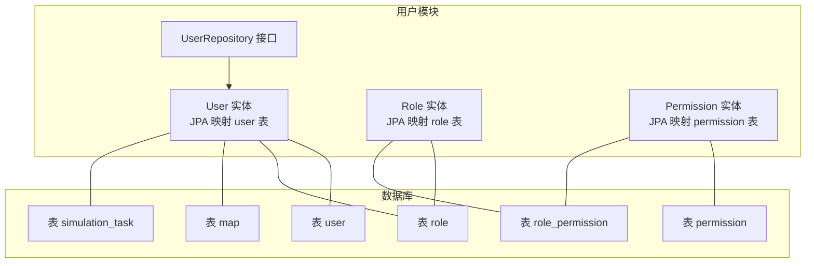
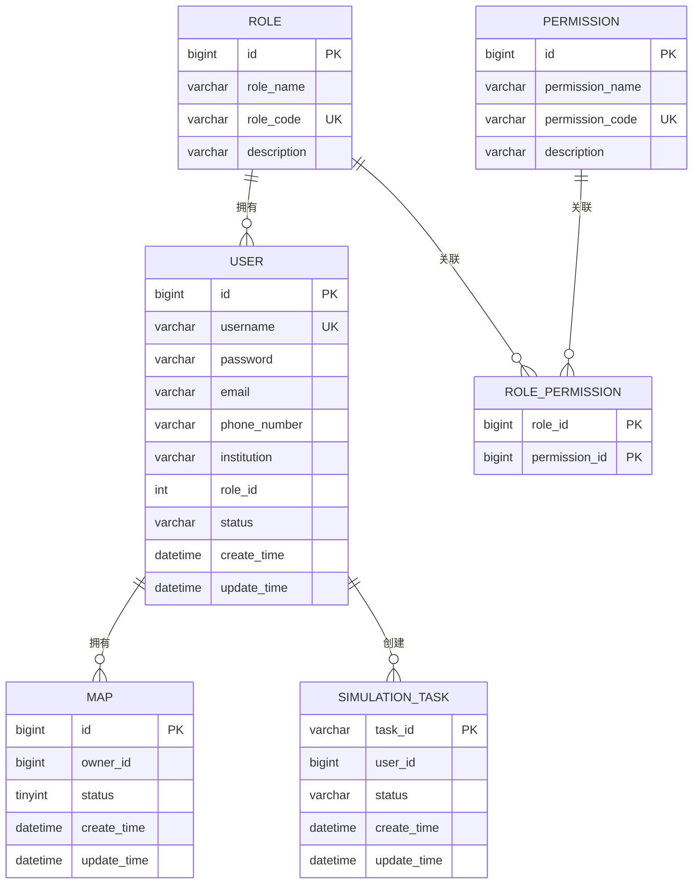
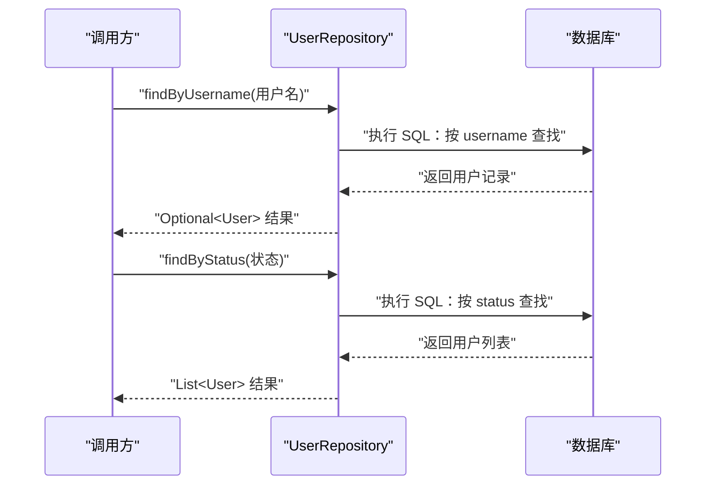
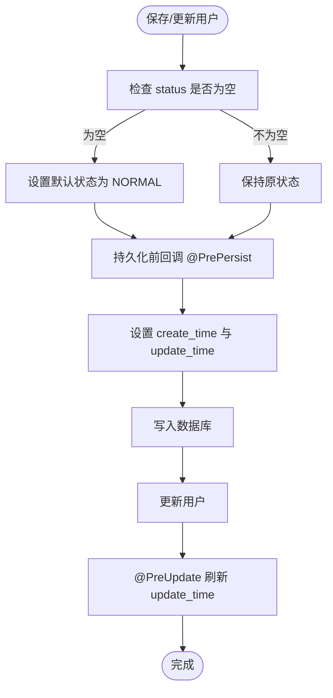
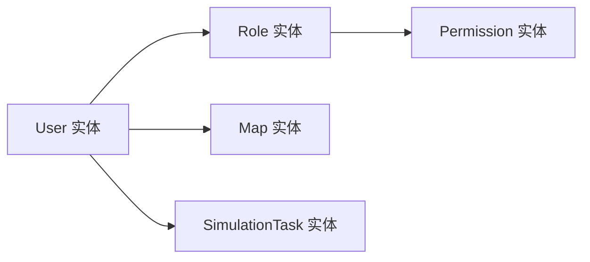

# 用户实体 (User)

<cite>
**本文引用的文件**
- [User.java](file://plugins/plugin-user/src/main/java/com/traffic/sim/plugin/user/entity/User.java)
- [UserRepository.java](file://plugins/plugin-user/src/main/java/com/traffic/sim/plugin/user/repository/UserRepository.java)
- [Role.java](file://plugins/plugin-user/src/main/java/com/traffic/sim/plugin/user/entity/Role.java)
- [Permission.java](file://plugins/plugin-user/src/main/java/com/traffic/sim/plugin/user/entity/Permission.java)
- [init.sql](file://infrastructure/init.sql)
- [UserStatus.java](file://traffic-sim-common/src/main/java/com/traffic/sim/common/constant/UserStatus.java)
- [MapEntity.java](file://plugins/plugin-map/src/main/java/com/traffic/sim/plugin/map/entity/MapEntity.java)
- [SimulationTask.java](file://plugins/plugin-simulation/src/main/java/com/traffic/sim/plugin/simulation/entity/SimulationTask.java)
</cite>

## 目录
1. [简介](#简介)
2. [项目结构](#项目结构)
3. [核心组件](#核心组件)
4. [架构概览](#架构概览)
5. [详细组件分析](#详细组件分析)
6. [依赖分析](#依赖分析)
7. [性能考虑](#性能考虑)
8. [故障排查指南](#故障排查指南)
9. [结论](#结论)
10. [附录](#附录)

## 简介
本文件围绕用户实体 User 的数据模型进行系统性说明，覆盖数据库表 user 的结构、JPA 注解映射、生命周期回调、与其他实体的关联关系，以及典型查询场景与 Spring Data JPA Repository 方法定义。目标是帮助开发者与产品人员准确理解用户数据模型的设计意图与使用方式。

## 项目结构
用户实体位于插件模块 plugin-user 中，配合角色与权限实体共同构成用户权限体系；同时通过 init.sql 定义了数据库表结构及索引策略。用户与地图、仿真任务存在外键引用关系，体现用户作为资源所有者的职责边界。

**图表来源**
- [User.java](file://plugins/plugin-user/src/main/java/com/traffic/sim/plugin/user/entity/User.java#L1-L65)
- [Role.java](file://plugins/plugin-user/src/main/java/com/traffic/sim/plugin/user/entity/Role.java#L1-L39)
- [Permission.java](file://plugins/plugin-user/src/main/java/com/traffic/sim/plugin/user/entity/Permission.java#L1-L30)
- [UserRepository.java](file://plugins/plugin-user/src/main/java/com/traffic/sim/plugin/user/repository/UserRepository.java#L1-L51)
- [init.sql](file://infrastructure/init.sql#L21-L40)

**章节来源**
- [User.java](file://plugins/plugin-user/src/main/java/com/traffic/sim/plugin/user/entity/User.java#L1-L65)
- [UserRepository.java](file://plugins/plugin-user/src/main/java/com/traffic/sim/plugin/user/repository/UserRepository.java#L1-L51)
- [init.sql](file://infrastructure/init.sql#L21-L40)

## 核心组件
- 用户实体 User：承载用户基本信息、角色标识、账户状态与时间戳字段，使用 JPA 注解映射到 user 表，并通过生命周期回调自动维护 create_time 与 update_time。
- 用户仓库 UserRepository：基于 Spring Data JPA 提供常用查询方法，如按用户名、邮箱、状态查询用户。
- 角色实体 Role 与权限实体 Permission：用于构建用户的角色与权限体系，其中角色与权限通过中间表 role_permission 关联。
- 数据库初始化脚本 init.sql：定义 user、role、permission、map、simulation_task 等表结构、索引与默认数据。

**章节来源**
- [User.java](file://plugins/plugin-user/src/main/java/com/traffic/sim/plugin/user/entity/User.java#L1-L65)
- [UserRepository.java](file://plugins/plugin-user/src/main/java/com/traffic/sim/plugin/user/repository/UserRepository.java#L1-L51)
- [Role.java](file://plugins/plugin-user/src/main/java/com/traffic/sim/plugin/user/entity/Role.java#L1-L39)
- [Permission.java](file://plugins/plugin-user/src/main/java/com/traffic/sim/plugin/user/entity/Permission.java#L1-L30)
- [init.sql](file://infrastructure/init.sql#L21-L40)

## 架构概览
用户实体与数据库表之间的映射关系如下：
- 实体类 User 对应数据库表 user，主键 id 使用自增策略。
- 字段 username、password、email、phone_number、institution、role_id、status、create_time、update_time 分别映射到 user 表的同名列。
- 索引与约束：username 唯一索引、role_id 与 status 建有索引；status 默认值为 NORMAL，create_time 不可空且不可更新。

**图表来源**
- [User.java](file://plugins/plugin-user/src/main/java/com/traffic/sim/plugin/user/entity/User.java#L1-L65)
- [Role.java](file://plugins/plugin-user/src/main/java/com/traffic/sim/plugin/user/entity/Role.java#L1-L39)
- [Permission.java](file://plugins/plugin-user/src/main/java/com/traffic/sim/plugin/user/entity/Permission.java#L1-L30)
- [init.sql](file://infrastructure/init.sql#L21-L40)
- [MapEntity.java](file://plugins/plugin-map/src/main/java/com/traffic/sim/plugin/map/entity/MapEntity.java#L1-L116)
- [SimulationTask.java](file://plugins/plugin-simulation/src/main/java/com/traffic/sim/plugin/simulation/entity/SimulationTask.java#L1-L51)

## 详细组件分析

### 用户实体 User 数据模型
- 主键与表映射
  - 实体类通过 @Entity 与 @Table(name = "user") 将 User 类映射到 user 表。
  - @Id 与 @GeneratedValue(strategy = GenerationType.IDENTITY) 指定主键自增策略。
- 字段定义与约束
  - id：自增主键，对应 user.id。
  - username：非空、唯一、长度 50，对应 user.username。
  - password：非空、长度 255，对应 user.password。
  - email：长度 100，对应 user.email。
  - phone_number：长度 20，对应 user.phone_number。
  - institution：长度 200，对应 user.institution。
  - role_id：整型，对应 user.role_id。
  - status：非空、长度 20，默认值 NORMAL，对应 user.status。
  - create_time：非空、不可更新，对应 user.create_time。
  - update_time：对应 user.update_time。
- 时间戳管理机制
  - @Temporal(TemporalType.TIMESTAMP) 指定时间字段映射为 TIMESTAMP。
  - @PrePersist 生命周期回调：设置 createTime 与 updateTime，并在未设置时默认 NORMAL。
  - @PreUpdate 生命周期回调：每次更新时刷新 updateTime。
- 业务含义与取值
  - status 支持 NORMAL、BANNED、BLOCKED，具体常量定义于 UserStatus。
  - role_id 用于关联角色表，实现权限控制。

**章节来源**
- [User.java](file://plugins/plugin-user/src/main/java/com/traffic/sim/plugin/user/entity/User.java#L1-L65)
- [UserStatus.java](file://traffic-sim-common/src/main/java/com/traffic/sim/common/constant/UserStatus.java#L1-L24)

### JPA 注解映射说明
- @Entity：声明该类为 JPA 实体。
- @Table：指定映射的数据库表名。
- @Id：标识主键。
- @GeneratedValue：指定主键生成策略（自增）。
- @Column：映射列属性，包含是否非空、唯一、长度、列名、是否可更新等。
- @Temporal：指定 Java 时间类型与数据库时间类型的映射。
- @PrePersist/@PreUpdate：持久化前回调，用于自动填充时间与默认值。

**章节来源**
- [User.java](file://plugins/plugin-user/src/main/java/com/traffic/sim/plugin/user/entity/User.java#L1-L65)

### 用户仓库 UserRepository 查询方法
- findByUsername(username)：按用户名精确查询用户。
- findByEmail(email)：按邮箱精确查询用户。
- findByStatus(status)：按状态查询用户列表。
- findByStatus(status, Pageable)：按状态分页查询用户。
- existsByUsername(username)/existsByEmail(email)：检查用户名或邮箱是否存在。

典型 SQL 示例（与 Repository 方法一一对应）：
- 根据用户名查找用户
  - SELECT * FROM user WHERE username = ?
- 按状态筛选用户
  - SELECT * FROM user WHERE status = ? ORDER BY create_time DESC
- 按状态分页查询用户
  - SELECT * FROM user WHERE status = ? ORDER BY create_time DESC LIMIT ? OFFSET ?

**章节来源**
- [UserRepository.java](file://plugins/plugin-user/src/main/java/com/traffic/sim/plugin/user/repository/UserRepository.java#L1-L51)

### 用户与其他实体的关联关系
- 与角色/权限
  - 用户通过 role_id 关联角色表 role；角色与权限通过中间表 role_permission 关联，形成多对多关系。
- 与地图
  - 地图表 map 的 owner_id 外键指向 user.id，表示地图的所有者为用户。
- 与仿真任务
  - 仿真任务表 simulation_task 的 user_id 外键指向 user.id，表示任务由用户创建。

**图表来源**
- [UserRepository.java](file://plugins/plugin-user/src/main/java/com/traffic/sim/plugin/user/repository/UserRepository.java#L1-L51)
- [init.sql](file://infrastructure/init.sql#L21-L40)

**章节来源**
- [init.sql](file://infrastructure/init.sql#L21-L40)
- [MapEntity.java](file://plugins/plugin-map/src/main/java/com/traffic/sim/plugin/map/entity/MapEntity.java#L1-L116)
- [SimulationTask.java](file://plugins/plugin-simulation/src/main/java/com/traffic/sim/plugin/simulation/entity/SimulationTask.java#L1-L51)

### 时间戳与状态字段处理流程

**图表来源**
- [User.java](file://plugins/plugin-user/src/main/java/com/traffic/sim/plugin/user/entity/User.java#L51-L64)

**章节来源**
- [User.java](file://plugins/plugin-user/src/main/java/com/traffic/sim/plugin/user/entity/User.java#L51-L64)

## 依赖分析
- 内聚性：User 实体聚焦用户基本信息与时间戳管理，职责清晰。
- 耦合度：User 与 role_id 引用 role 表，与 map.owner_id、simulation_task.user_id 引用 user 表，形成稳定的外键依赖。
- 可能的循环依赖：当前模块内无循环依赖迹象；跨模块依赖通过外键约束实现。

**图表来源**
- [User.java](file://plugins/plugin-user/src/main/java/com/traffic/sim/plugin/user/entity/User.java#L1-L65)
- [Role.java](file://plugins/plugin-user/src/main/java/com/traffic/sim/plugin/user/entity/Role.java#L1-L39)
- [Permission.java](file://plugins/plugin-user/src/main/java/com/traffic/sim/plugin/user/entity/Permission.java#L1-L30)
- [MapEntity.java](file://plugins/plugin-map/src/main/java/com/traffic/sim/plugin/map/entity/MapEntity.java#L1-L116)
- [SimulationTask.java](file://plugins/plugin-simulation/src/main/java/com/traffic/sim/plugin/simulation/entity/SimulationTask.java#L1-L51)

**章节来源**
- [User.java](file://plugins/plugin-user/src/main/java/com/traffic/sim/plugin/user/entity/User.java#L1-L65)
- [Role.java](file://plugins/plugin-user/src/main/java/com/traffic/sim/plugin/user/entity/Role.java#L1-L39)
- [Permission.java](file://plugins/plugin-user/src/main/java/com/traffic/sim/plugin/user/entity/Permission.java#L1-L30)
- [MapEntity.java](file://plugins/plugin-map/src/main/java/com/traffic/sim/plugin/map/entity/MapEntity.java#L1-L116)
- [SimulationTask.java](file://plugins/plugin-simulation/src/main/java/com/traffic/sim/plugin/simulation/entity/SimulationTask.java#L1-L51)

## 性能考虑
- 索引策略
  - user.username 唯一键：支持高频用户名登录与去重校验。
  - user.role_id 与 user.status 上建立索引：提升按角色与状态过滤的查询效率。
- 时间戳字段
  - create_time 不可更新，避免不必要的更新开销；update_time 在 @PreUpdate 自动刷新，减少应用层重复逻辑。
- 分页查询
  - 使用 Spring Data JPA 的 Pageable 进行分页，避免一次性加载大量用户数据。

[本节为通用建议，无需特定文件引用]

## 故障排查指南
- 用户名重复
  - 现象：插入失败，违反唯一约束。
  - 排查：确认 UserRepository.existsByUsername(username) 返回值，或检查 init.sql 中 uk_username 约束。
- 密码长度问题
  - 现象：字段超长导致入库失败。
  - 排查：确认密码长度不超过 255，遵循业务层加密后长度要求。
- 状态非法
  - 现象：状态值不在允许集合内。
  - 排查：使用 UserStatus 常量 NORMAL/BANNED/BLOCKED，避免拼写错误。
- 时间戳异常
  - 现象：create_time 或 update_time 为空或不正确。
  - 排查：确保使用 @PrePersist/@PreUpdate 生命周期回调，避免手动赋值覆盖。

**章节来源**
- [UserRepository.java](file://plugins/plugin-user/src/main/java/com/traffic/sim/plugin/user/repository/UserRepository.java#L1-L51)
- [User.java](file://plugins/plugin-user/src/main/java/com/traffic/sim/plugin/user/entity/User.java#L1-L65)
- [UserStatus.java](file://traffic-sim-common/src/main/java/com/traffic/sim/common/constant/UserStatus.java#L1-L24)

## 结论
用户实体 User 以清晰的字段语义、严格的约束与完善的生命周期回调，支撑起用户管理与鉴权的基础能力。配合角色/权限体系与地图、仿真任务的外键关系，形成完整的用户资源边界。通过 UserRepository 的标准查询方法与 init.sql 的索引设计，能够高效满足常见业务场景。

[本节为总结性内容，无需特定文件引用]

## 附录

### 字段对照表（实体到表）
- id → user.id（主键，自增）
- username → user.username（非空，唯一）
- password → user.password（非空）
- email → user.email
- phone_number → user.phone_number
- institution → user.institution
- role_id → user.role_id
- status → user.status（非空，默认 NORMAL）
- create_time → user.create_time（不可更新）
- update_time → user.update_time

**章节来源**
- [User.java](file://plugins/plugin-user/src/main/java/com/traffic/sim/plugin/user/entity/User.java#L1-L65)
- [init.sql](file://infrastructure/init.sql#L21-L40)

### 典型查询场景与 SQL
- 根据用户名查找用户
  - SQL：SELECT * FROM user WHERE username = ?
  - Repository：findByUsername(String)
- 根据邮箱查找用户
  - SQL：SELECT * FROM user WHERE email = ?
  - Repository：findByEmail(String)
- 按状态筛选用户
  - SQL：SELECT * FROM user WHERE status = ? ORDER BY create_time DESC
  - Repository：findByStatus(String)
- 按状态分页查询用户
  - SQL：SELECT * FROM user WHERE status = ? ORDER BY create_time DESC LIMIT ? OFFSET ?
  - Repository：findByStatus(String, Pageable)

**章节来源**
- [UserRepository.java](file://plugins/plugin-user/src/main/java/com/traffic/sim/plugin/user/repository/UserRepository.java#L1-L51)
- [init.sql](file://infrastructure/init.sql#L21-L40)