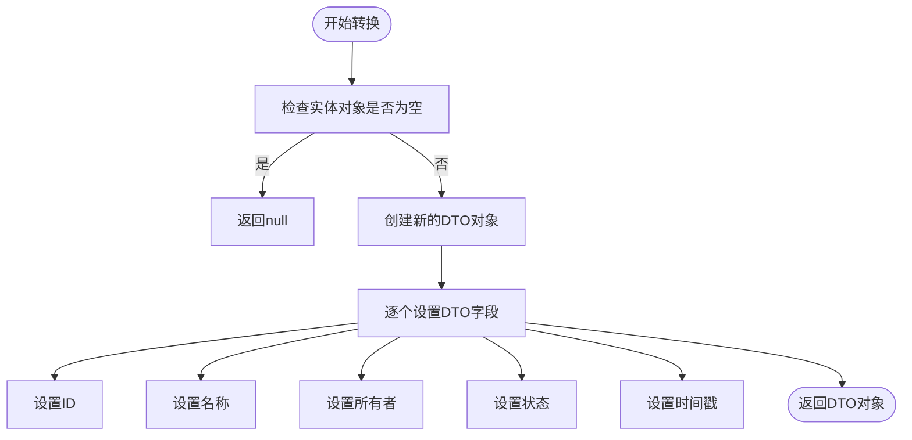
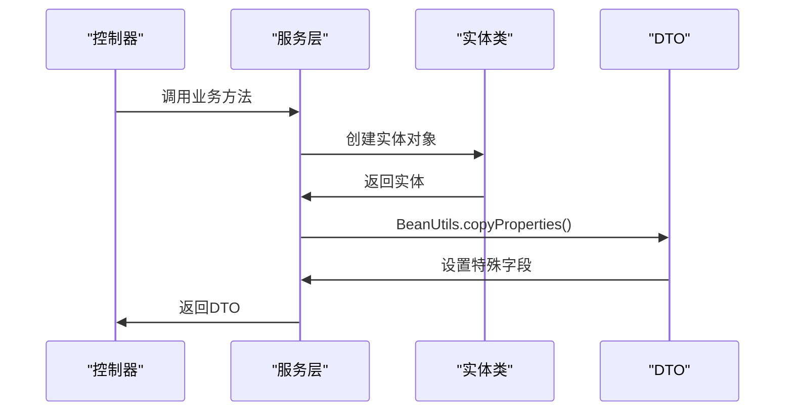
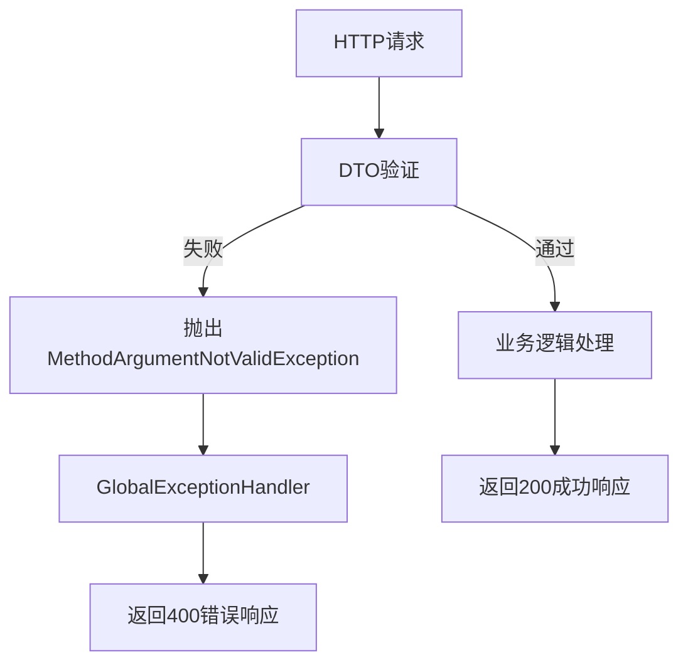

# 数据传输对象（DTO）

<cite>
**本文档中引用的文件**   
- [CreateSimulationRequest.java](file://traffic-sim-common/src/main/java/com/traffic/sim/common/dto/CreateSimulationRequest.java)
- [MapDTO.java](file://traffic-sim-common/src/main/java/com/traffic/sim/common/dto/MapDTO.java)
- [SimulationTaskDTO.java](file://traffic-sim-common/src/main/java/com/traffic/sim/common/dto/SimulationTaskDTO.java)
- [UserDTO.java](file://traffic-sim-common/src/main/java/com/traffic/sim/common/dto/UserDTO.java)
- [LoginRequest.java](file://traffic-sim-common/src/main/java/com/traffic/sim/common/dto/LoginRequest.java)
- [LoginResponse.java](file://traffic-sim-common/src/main/java/com/traffic/sim/common/dto/LoginResponse.java)
- [RegisterRequest.java](file://traffic-sim-common/src/main/java/com/traffic/sim/common/dto/RegisterRequest.java)
- [MapInfoDTO.java](file://traffic-sim-common/src/main/java/com/traffic/sim/common/dto/MapInfoDTO.java)
- [MapUpdateRequest.java](file://traffic-sim-common/src/main/java/com/traffic/sim/common/dto/MapUpdateRequest.java)
- [UserMapSpaceDTO.java](file://traffic-sim-common/src/main/java/com/traffic/sim/common/dto/UserMapSpaceDTO.java)
- [ApiResponse.java](file://traffic-sim-common/src/main/java/com/traffic/sim/common/response/ApiResponse.java)
- [PageResult.java](file://traffic-sim-common/src/main/java/com/traffic/sim/common/response/PageResult.java)
- [MapServiceImpl.java](file://plugins/plugin-map/src/main/java/com/traffic/sim/plugin/map/service/MapServiceImpl.java)
- [UserServiceImpl.java](file://plugins/plugin-user/src/main/java/com/traffic/sim/plugin/user/service/UserServiceImpl.java)
- [GlobalExceptionHandler.java](file://traffic-sim-server/src/main/java/com/traffic/sim/exception/GlobalExceptionHandler.java)
- [pom.xml](file://traffic-sim-common/pom.xml)
</cite>

## 目录
1. [引言](#引言)
2. [核心DTO类设计](#核心dto类设计)
3. [DTO与实体类的转换机制](#dto与实体类的转换机制)
4. [DTO在系统各层间的流转](#dto在系统各层间的流转)
5. [请求验证与响应封装](#请求验证与响应封装)
6. [DTO设计最佳实践](#dto设计最佳实践)
7. [总结](#总结)

## 引言
数据传输对象（DTO）在`traffic-sim-common`模块中扮演着至关重要的角色，作为系统各层之间数据交换的标准载体。DTO的主要作用是隔离数据库实体与API接口，避免直接暴露内部数据结构，从而增强系统的安全性、灵活性和版本兼容性。通过使用DTO，系统可以在不影响外部接口的情况下自由调整内部实体结构，同时还能精确控制API请求和响应的数据内容。

## 核心DTO类设计

### CreateSimulationRequest
`CreateSimulationRequest`类用于封装创建交通仿真任务的请求参数。该DTO包含仿真名称、地图文件信息、仿真配置以及控制视图等关键属性。其设计采用了嵌套内部类的方式，将复杂的仿真配置信息（如OD矩阵、信号灯组配置）组织成层次化的结构，提高了代码的可读性和维护性。

**本节来源**
- [CreateSimulationRequest.java](file://traffic-sim-common/src/main/java/com/traffic/sim/common/dto/CreateSimulationRequest.java#L1-L134)

### MapDTO
`MapDTO`类用于传输地图信息，包含地图ID、名称、描述、文件路径、所有者信息、状态和创建时间等字段。该DTO作为地图服务的主要数据载体，在用户获取地图列表、查询地图详情等场景中被广泛使用，确保了地图数据的安全传输。

**本节来源**
- [MapDTO.java](file://traffic-sim-common/src/main/java/com/traffic/sim/common/dto/MapDTO.java#L1-L34)

### SimulationTaskDTO
`SimulationTaskDTO`类用于表示仿真任务的状态信息，包括任务ID、仿真名称、地图文件路径、仿真配置、任务状态和时间戳等。该DTO在查询仿真任务列表和获取任务详情时作为响应数据返回，为前端提供了完整的任务视图。

**本节来源**
- [SimulationTaskDTO.java](file://traffic-sim-common/src/main/java/com/traffic/sim/common/dto/SimulationTaskDTO.java#L1-L46)

### UserDTO
`UserDTO`类用于传输用户基本信息，包含用户ID、用户名、邮箱、电话、机构、角色信息和状态等字段。该DTO在用户登录、用户信息查询等场景中被使用，实现了用户敏感信息的受控暴露。

**本节来源**
- [UserDTO.java](file://traffic-sim-common/src/main/java/com/traffic/sim/common/dto/UserDTO.java#L1-L30)

## DTO与实体类的转换机制

### 手动转换
系统主要采用手动转换的方式将实体类转换为DTO。在`MapServiceImpl`类中，`convertToDTO`方法通过逐个字段赋值的方式，将`MapEntity`实体转换为`MapDTO`对象。这种方式虽然代码量较大，但提供了最大的灵活性和控制力，可以精确处理每个字段的映射逻辑。

**图表来源**
- [MapServiceImpl.java](file://plugins/plugin-map/src/main/java/com/traffic/sim/plugin/map/service/MapServiceImpl.java#L366-L375)

### 集合转换
对于分页查询结果，系统使用Java 8 Stream API进行批量转换。`convertToPageResult`方法接收一个`Page<MapEntity>`对象，通过`stream().map()`操作将每个实体转换为对应的DTO，然后封装成`PageResult<MapDTO>`对象返回。这种方式简洁高效，充分利用了函数式编程的优势。

**本节来源**
- [MapServiceImpl.java](file://plugins/plugin-map/src/main/java/com/traffic/sim/plugin/map/service/MapServiceImpl.java#L381-L391)

### 属性复制
在`UserServiceImpl`类中，系统使用Spring的`BeanUtils.copyProperties`方法进行属性复制。这种方式适用于字段名称和类型完全匹配的简单转换场景，可以显著减少样板代码。然而，对于需要特殊处理的字段（如密码、状态默认值等），仍需手动设置。

**图表来源**
- [UserServiceImpl.java](file://plugins/plugin-user/src/main/java/com/traffic/sim/plugin/user/service/UserServiceImpl.java#L74-L75)

## DTO在系统各层间的流转

### Controller层
在控制器层，DTO作为方法参数接收客户端请求。例如，`LoginRequest`和`RegisterRequest`被用于接收用户登录和注册的表单数据。同时，控制器也使用DTO作为响应数据，通过`ApiResponse`包装后返回给客户端。

### Service层
服务层是DTO转换的核心。该层接收来自控制器的请求DTO，将其转换为实体类与数据库交互，然后将查询结果转换为响应DTO返回给控制器。这种分层设计确保了业务逻辑与数据传输的分离。

### 跨服务通信
在gRPC通信中，DTO也被用作服务间的数据交换格式。例如，`CreateSimulationRequest`被转换为gRPC请求消息，发送给仿真引擎服务。这种设计保持了内部API和外部API的一致性。

**本节来源**
- [MapServiceImpl.java](file://plugins/plugin-map/src/main/java/com/traffic/sim/plugin/map/service/MapServiceImpl.java)
- [UserServiceImpl.java](file://plugins/plugin-user/src/main/java/com/traffic/sim/plugin/user/service/UserServiceImpl.java)

## 请求验证与响应封装

### 请求验证
系统使用Jakarta Bean Validation对DTO进行请求验证。在`LoginRequest`和`RegisterRequest`类中，通过`@NotBlank`、`@Email`等注解定义字段的验证规则。当请求数据不符合规则时，框架会自动抛出`MethodArgumentNotValidException`，由全局异常处理器统一处理。

**图表来源**
- [LoginRequest.java](file://traffic-sim-common/src/main/java/com/traffic/sim/common/dto/LoginRequest.java#L18-L22)
- [RegisterRequest.java](file://traffic-sim-common/src/main/java/com/traffic/sim/common/dto/RegisterRequest.java#L19-L26)
- [GlobalExceptionHandler.java](file://traffic-sim-server/src/main/java/com/traffic/sim/exception/GlobalExceptionHandler.java#L1-L41)

### 响应封装
`ApiResponse`类提供了统一的API响应格式，包含响应码、消息、数据和时间戳四个字段。通过静态工厂方法（如`success()`和`error()`），可以方便地创建标准化的响应对象。这种设计使客户端能够以一致的方式处理所有API响应。

### 分页响应
`PageResult`类专门用于封装分页查询结果，包含记录列表、总记录数、当前页码、每页大小和总页数等字段。该DTO与Spring Data的`Page`对象无缝集成，简化了分页数据的处理。

**本节来源**
- [ApiResponse.java](file://traffic-sim-common/src/main/java/com/traffic/sim/common/response/ApiResponse.java#L1-L85)
- [PageResult.java](file://traffic-sim-common/src/main/java/com/traffic/sim/common/response/PageResult.java#L1-L47)

## DTO设计最佳实践

### 字段暴露控制
避免过度暴露内部字段，只包含API接口实际需要的数据。例如，`UserDTO`不包含密码字段，`MapDTO`的状态字段使用整数编码而非直接暴露枚举。

### 嵌套对象处理
对于复杂的嵌套结构，使用内部类或专门的DTO类进行封装。`CreateSimulationRequest`中的`SimInfoDTO`、`FixedODDTO`等内部类清晰地组织了多层次的配置信息。

### 分页响应设计
使用专门的`PageResult`类处理分页数据，而不是在每个DTO中重复添加分页字段。这种通用化设计提高了代码的复用性和一致性。

### 版本兼容性
通过为DTO实现`Serializable`接口并定义`serialVersionUID`，确保了序列化兼容性。这在服务升级和分布式部署时尤为重要。

### 验证注解
在请求DTO中使用验证注解，将数据验证逻辑前置到API入口，减轻服务层的验证负担。

**本节来源**
- [CreateSimulationRequest.java](file://traffic-sim-common/src/main/java/com/traffic/sim/common/dto/CreateSimulationRequest.java)
- [MapDTO.java](file://traffic-sim-common/src/main/java/com/traffic/sim/common/dto/MapDTO.java)
- [UserDTO.java](file://traffic-sim-common/src/main/java/com/traffic/sim/common/dto/UserDTO.java)
- [LoginRequest.java](file://traffic-sim-common/src/main/java/com/traffic/sim/common/dto/LoginRequest.java)

## 总结
在`traffic-sim-common`模块中，DTO模式被系统性地应用于各个层面，形成了清晰的数据传输契约。通过精心设计的DTO类、规范的转换机制和统一的响应格式，系统实现了良好的分层架构和松耦合设计。这种实践不仅提高了代码的可维护性和安全性，还为未来的功能扩展和系统演进奠定了坚实的基础。