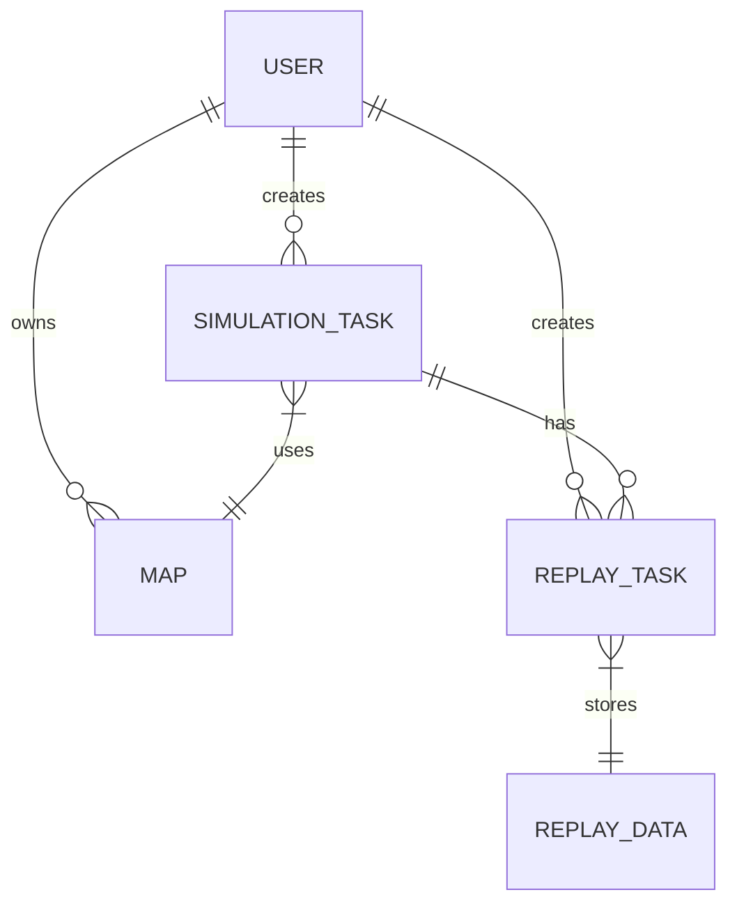
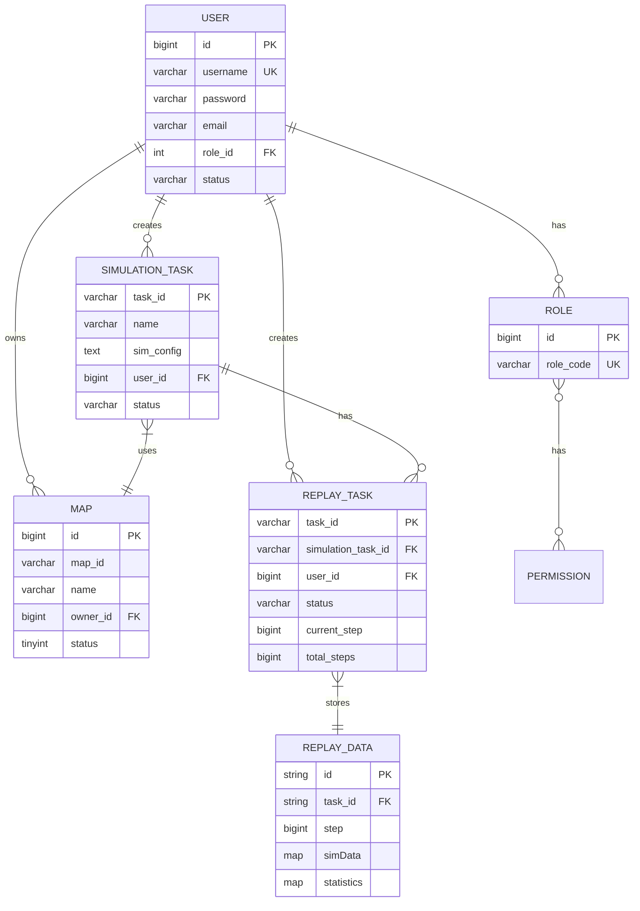

# 数据模型

<cite>
**本文档中引用的文件**   
- [init.sql](file://infrastructure/init.sql)
- [User.java](file://plugins/plugin-user/src/main/java/com/traffic/sim/plugin/user/entity/User.java)
- [MapEntity.java](file://plugins/plugin-map/src/main/java/com/traffic/sim/plugin/map/entity/MapEntity.java)
- [SimulationTask.java](file://plugins/plugin-simulation/src/main/java/com/traffic/sim/plugin/simulation/entity/SimulationTask.java)
- [ReplayTask.java](file://plugins/plugin-engine-replay/src/main/java/com/traffic/sim/plugin/replay/entity/ReplayTask.java)
- [ReplayDataDocument.java](file://plugins/plugin-engine-replay/src/main/java/com/traffic/sim/plugin/replay/document/ReplayDataDocument.java)
- [UserDTO.java](file://traffic-sim-common/src/main/java/com/traffic/sim/common/dto/UserDTO.java)
- [SimulationTaskDTO.java](file://traffic-sim-common/src/main/java/com/traffic/sim/common/dto/SimulationTaskDTO.java)
- [MapDTO.java](file://traffic-sim-common/src/main/java/com/traffic/sim/common/dto/MapDTO.java)
</cite>

## 目录
1. [引言](#引言)
2. [MySQL数据库表结构](#mysql数据库表结构)
3. [JPA实体类与数据库映射](#jpa实体类与数据库映射)
4. [MongoDB文档设计](#mongodb文档设计)
5. [实体关系图（ERD）](#实体关系图erd)
6. [DTO数据传输对象](#dto数据传输对象)
7. [结论](#结论)

## 引言
本文档全面阐述交通仿真系统的核心数据模型。系统采用混合持久化架构，使用MySQL存储结构化业务数据，使用MongoDB存储非结构化的仿真回放数据。文档详细描述了数据库表结构、JPA实体映射、MongoDB文档设计、实体间关系以及数据传输对象（DTO）的设计与作用。

## MySQL数据库表结构

### 用户表 (user)
`user` 表存储系统用户的基本信息。
- **字段**:
  - `id`: BIGINT(20), 主键，自增
  - `username`: VARCHAR(50), 用户名，唯一
  - `password`: VARCHAR(255), 加密后的密码
  - `email`: VARCHAR(100), 邮箱
  - `phone_number`: VARCHAR(20), 电话号码
  - `institution`: VARCHAR(200), 所属机构
  - `role_id`: INT(11), 角色ID，外键关联 `role` 表
  - `status`: VARCHAR(20), 状态（NORMAL/BANNED/BLOCKED）
  - `create_time`: DATETIME, 创建时间
  - `update_time`: DATETIME, 更新时间
- **索引**:
  - 主键 `id`
  - 唯一索引 `uk_username` (username)
  - 普通索引 `idx_role_id` (role_id)
  - 普通索引 `idx_status` (status)

### 角色表 (role)
`role` 表定义系统中的角色。
- **字段**:
  - `id`: BIGINT(20), 主键，自增
  - `role_name`: VARCHAR(50), 角色名称
  - `role_code`: VARCHAR(50), 角色代码，唯一
  - `description`: VARCHAR(500), 描述
- **索引**:
  - 主键 `id`
  - 唯一索引 `uk_role_code` (role_code)

### 权限表 (permission)
`permission` 表定义系统中的权限。
- **字段**:
  - `id`: BIGINT(20), 主键，自增
  - `permission_name`: VARCHAR(100), 权限名称
  - `permission_code`: VARCHAR(100), 权限代码，唯一
  - `description`: VARCHAR(500), 描述
- **索引**:
  - 主键 `id`
  - 唯一索引 `uk_permission_code` (permission_code)

### 角色权限关联表 (role_permission)
`role_permission` 表建立角色与权限的多对多关系。
- **字段**:
  - `role_id`: BIGINT(20), 角色ID
  - `permission_id`: BIGINT(20), 权限ID
- **索引**:
  - 联合主键 `(role_id, permission_id)`
  - 普通索引 `idx_role_id` (role_id)
  - 普通索引 `idx_permission_id` (permission_id)

### 地图表 (map)
`map` 表存储地图元数据。
- **字段**:
  - `id`: BIGINT(20), 主键，自增
  - `map_id`: VARCHAR(255), MongoDB中地图文档的ID
  - `name`: VARCHAR(255), 地图名称
  - `description`: VARCHAR(500), 地图描述
  - `file_path`: VARCHAR(500), 文件路径
  - `file_name`: VARCHAR(255), 原始文件名
  - `xml_file_name`: VARCHAR(255), XML文件名
  - `map_image`: LONGTEXT, 地图图片（Base64编码）
  - `owner_id`: BIGINT(20), 所有者用户ID
  - `status`: TINYINT(4), 地图状态（0-公开，1-私有，2-禁用）
  - `file_size`: BIGINT(20), 文件大小（字节）
  - `storage_path`: VARCHAR(500), 存储路径
  - `create_time`: DATETIME, 创建时间
  - `update_time`: DATETIME, 更新时间
- **索引**:
  - 主键 `id`
  - 普通索引 `idx_owner_id` (owner_id)
  - 普通索引 `idx_status` (status)
  - 普通索引 `idx_create_time` (create_time)

### 用户地图配额表 (user_map_quota)
`user_map_quota` 表管理用户的地图存储配额。
- **字段**:
  - `id`: BIGINT(20), 主键，自增
  - `user_id`: BIGINT(20), 用户ID，唯一
  - `max_maps`: INT(11), 最大地图数量
  - `current_maps`: INT(11), 当前地图数量
  - `total_size`: BIGINT(20), 总文件大小
  - `max_size`: BIGINT(20), 最大存储空间（默认1GB）
  - `create_time`: DATETIME, 创建时间
  - `update_time`: DATETIME, 更新时间
- **索引**:
  - 主键 `id`
  - 唯一索引 `uk_user_id` (user_id)

### 仿真任务表 (simulation_task)
`simulation_task` 表存储仿真任务的配置和状态。
- **字段**:
  - `task_id`: VARCHAR(64), 任务ID，主键
  - `name`: VARCHAR(255), 仿真名称
  - `map_xml_name`: VARCHAR(255), 地图XML文件名
  - `map_xml_path`: VARCHAR(500), 地图XML文件路径
  - `sim_config`: TEXT, 仿真配置（JSON格式）
  - `status`: VARCHAR(20), 状态（CREATED/RUNNING/PAUSED/STOPPED/FINISHED）
  - `user_id`: BIGINT(20), 用户ID
  - `create_time`: DATETIME, 创建时间
  - `update_time`: DATETIME, 更新时间
- **索引**:
  - 主键 `task_id`
  - 普通索引 `idx_user_id` (user_id)
  - 普通索引 `idx_status` (status)
  - 普通索引 `idx_create_time` (create_time)

### 回放任务表 (replay_task)
`replay_task` 表存储回放任务的状态和进度。
- **字段**:
  - `task_id`: VARCHAR(64), 任务ID，主键
  - `simulation_task_id`: VARCHAR(64), 关联的仿真任务ID
  - `name`: VARCHAR(255), 回放任务名称
  - `status`: VARCHAR(20), 状态（CREATED/PLAYING/PAUSED/STOPPED/FINISHED）
  - `current_step`: BIGINT(20), 当前步数
  - `total_steps`: BIGINT(20), 总步数
  - `playback_speed`: DOUBLE, 播放速度
  - `user_id`: BIGINT(20), 用户ID
  - `create_time`: DATETIME, 创建时间
  - `update_time`: DATETIME, 更新时间
- **索引**:
  - 主键 `task_id`
  - 普通索引 `idx_simulation_task_id` (simulation_task_id)
  - 普通索引 `idx_user_id` (user_id)
  - 普通索引 `idx_status` (status)

**Section sources**
- [init.sql](file://infrastructure/init.sql#L25-L202)

## JPA实体类与数据库映射

### User实体类
`User` 类映射到 `user` 表。
- **@Entity**: 标记为JPA实体。
- **@Table(name = "user")**: 显式指定表名为 `user`。
- **@Id**: `id` 字段为主键。
- **@GeneratedValue(strategy = GenerationType.IDENTITY)**: 使用数据库自增策略。
- **@Column**: 定义列属性，如 `nullable=false` (非空), `unique=true` (唯一), `length=50` (长度限制)。
- **@Temporal(TemporalType.TIMESTAMP)**: 将 `Date` 类型映射为SQL的 `DATETIME`。
- **@PrePersist 和 @PreUpdate**: 在保存和更新前自动设置 `createTime` 和 `updateTime`。

### MapEntity实体类
`MapEntity` 类映射到 `map` 表。
- **@Entity**: 标记为JPA实体。
- **@Table(name = "map")**: 显式指定表名为 `map`。
- **@Id**: `id` 字段为主键，使用自增策略。
- **@Column(name = "...")**: 显式指定数据库列名，如 `map_id`。
- **@Lob 和 columnDefinition = "LONGTEXT"**: 将 `mapImage` 字段映射为MySQL的 `LONGTEXT` 类型，用于存储大文本。
- **@Enumerated(EnumType.ORDINAL)**: 将 `MapStatus` 枚举映射为数据库中的整数（0, 1, 2），与 `status` 字段的TINYINT类型对应。
- **@PrePersist 和 @PreUpdate**: 自动管理时间戳。

### SimulationTask实体类
`SimulationTask` 类映射到 `simulation_task` 表。
- **@Entity**: 标记为JPA实体。
- **@Table(name = "simulation_task")**: 显式指定表名。
- **@Id**: `taskId` 字段为主键，但不使用自增，由业务逻辑生成。
- **@Column(columnDefinition = "TEXT")**: 将 `simConfig` 字段映射为SQL的 `TEXT` 类型。
- **@CreationTimestamp 和 @UpdateTimestamp**: Hibernate提供的注解，自动管理 `createTime` 和 `updateTime`。

### ReplayTask实体类
`ReplayTask` 类映射到 `replay_task` 表。
- **@Entity**: 标记为JPA实体。
- **@Table(name = "replay_task")**: 显式指定表名。
- **@Id**: `taskId` 字段为主键。
- **@CreationTimestamp 和 @UpdateTimestamp**: 自动管理时间戳。
- **内部枚举类 `ReplayStatus`**: 定义了任务状态，与数据库中的字符串状态值对应。

**Section sources**
- [User.java](file://plugins/plugin-user/src/main/java/com/traffic/sim/plugin/user/entity/User.java#L1-L66)
- [MapEntity.java](file://plugins/plugin-map/src/main/java/com/traffic/sim/plugin/map/entity/MapEntity.java#L1-L116)
- [SimulationTask.java](file://plugins/plugin-simulation/src/main/java/com/traffic/sim/plugin/simulation/entity/SimulationTask.java#L1-L51)
- [ReplayTask.java](file://plugins/plugin-engine-replay/src/main/java/com/traffic/sim/plugin/replay/entity/ReplayTask.java#L1-L102)

## MongoDB文档设计

### ReplayDataDocument
`ReplayDataDocument` 是存储在MongoDB中的文档，用于保存仿真过程中的详细步骤数据。
- **@Document(collection = "replay_data")**: 指定该文档存储在名为 `replay_data` 的集合中。
- **@Id**: `id` 字段是MongoDB文档的唯一标识符。
- **字段**:
  - `taskId`: 回放任务ID，用于关联 `replay_task`。
  - `step`: 仿真步数，作为时间序列的索引。
  - `timestamp`: 时间戳。
  - `simData`: `Map<String, Object>` 类型，灵活存储每一步的仿真数据（如车辆位置、信号灯状态）。
  - `statistics`: `Map<String, Object>` 类型，存储每一步的统计结果。

### 设计优势
1. **模式灵活性**: 仿真数据结构可能随时间变化，使用文档数据库可以轻松适应这种变化，无需修改表结构。
2. **高性能写入**: 仿真过程会产生大量连续的步骤数据，MongoDB的写入性能非常适合这种场景。
3. **高效查询**: 可以根据 `taskId` 和 `step` 范围快速查询特定时间段的回放数据。
4. **天然分片**: 数据量巨大时，可以基于 `taskId` 或 `step` 进行分片，实现水平扩展。

**Diagram sources **
- [init.sql](file://infrastructure/init.sql#L25-L173)
- [ReplayDataDocument.java](file://plugins/plugin-engine-replay/src/main/java/com/traffic/sim/plugin/replay/document/ReplayDataDocument.java#L1-L47)

## 实体关系图（ERD）

**Diagram sources **
- [init.sql](file://infrastructure/init.sql#L25-L173)
- [User.java](file://plugins/plugin-user/src/main/java/com/traffic/sim/plugin/user/entity/User.java#L1-L66)
- [MapEntity.java](file://plugins/plugin-map/src/main/java/com/traffic/sim/plugin/map/entity/MapEntity.java#L1-L116)
- [SimulationTask.java](file://plugins/plugin-simulation/src/main/java/com/traffic/sim/plugin/simulation/entity/SimulationTask.java#L1-L51)
- [ReplayTask.java](file://plugins/plugin-engine-replay/src/main/java/com/traffic/sim/plugin/replay/entity/ReplayTask.java#L1-L102)
- [ReplayDataDocument.java](file://plugins/plugin-engine-replay/src/main/java/com/traffic/sim/plugin/replay/document/ReplayDataDocument.java#L1-L47)

## DTO数据传输对象

### 作用
`traffic-sim-common` 模块中的DTO（数据传输对象）用于在服务层和API层之间安全、高效地传输数据。它们的主要作用是：
1. **解耦**: 避免将持久层实体（如JPA实体）直接暴露给前端，防止意外的数据暴露或修改。
2. **数据精简**: 只传输前端需要的字段，避免传输敏感信息（如密码）或不必要的关联数据。
3. **结构优化**: 可以组合来自多个实体的数据，形成前端友好的数据结构。

### 核心DTO类

#### UserDTO
用于传输用户信息，不包含密码字段。
- **字段**: `id`, `username`, `email`, `phoneNumber`, `institution`, `roleId`, `roleName` (角色名称，通过关联查询获得), `status`, `createTime`, `updateTime`。

#### SimulationTaskDTO
用于传输仿真任务信息。
- **字段**: `taskId`, `name`, `mapXmlName`, `mapXmlPath`, `simConfig`, `status`, `userId`, `createTime`, `updateTime`。

#### MapDTO
用于传输地图信息。
- **字段**: `id`, `mapId`, `name`, `description`, `filePath`, `fileName`, `xmlFileName`, `mapImage`, `ownerId`, `status`, `fileSize`, `storagePath`, `createTime`, `updateTime`。

**Section sources**
- [UserDTO.java](file://traffic-sim-common/src/main/java/com/traffic/sim/common/dto/UserDTO.java#L1-L30)
- [SimulationTaskDTO.java](file://traffic-sim-common/src/main/java/com/traffic/sim/common/dto/SimulationTaskDTO.java#L1-L46)
- [MapDTO.java](file://traffic-sim-common/src/main/java/com/traffic/sim/common/dto/MapDTO.java#L1-L34)

## 结论
本系统采用MySQL和MongoDB相结合的混合数据存储方案，充分发挥了两种数据库的优势。MySQL用于存储结构化的、关系明确的业务数据（用户、地图、任务），保证了数据的一致性和完整性。MongoDB用于存储非结构化的、高吞吐量的仿真回放数据，提供了极高的灵活性和写入性能。通过JPA注解，Java实体类与MySQL表实现了精确映射。DTO模式的使用确保了API接口的安全性和效率。整体数据模型设计合理，能够有效支撑交通仿真系统的各项功能。